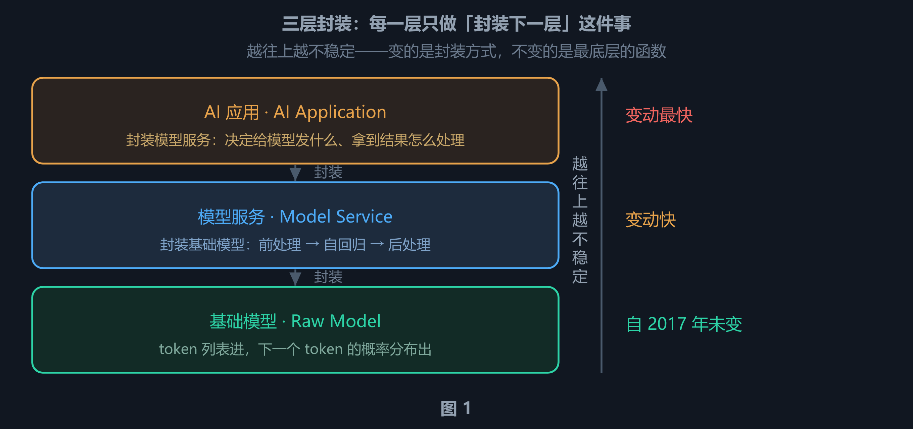
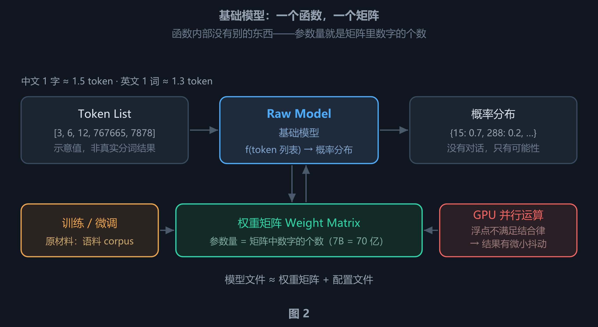
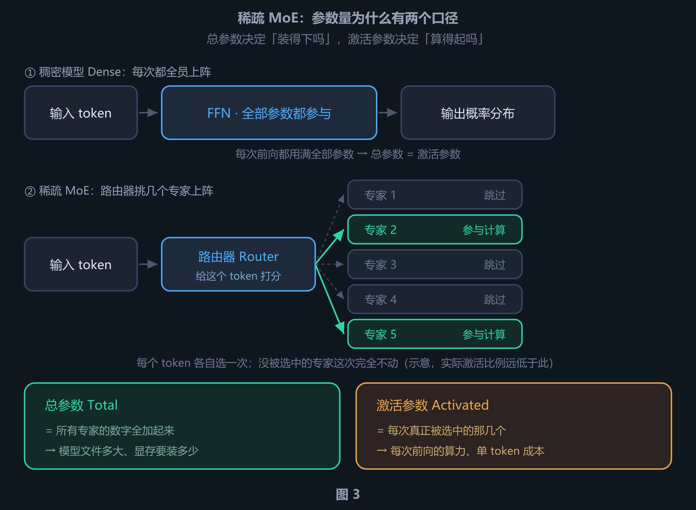
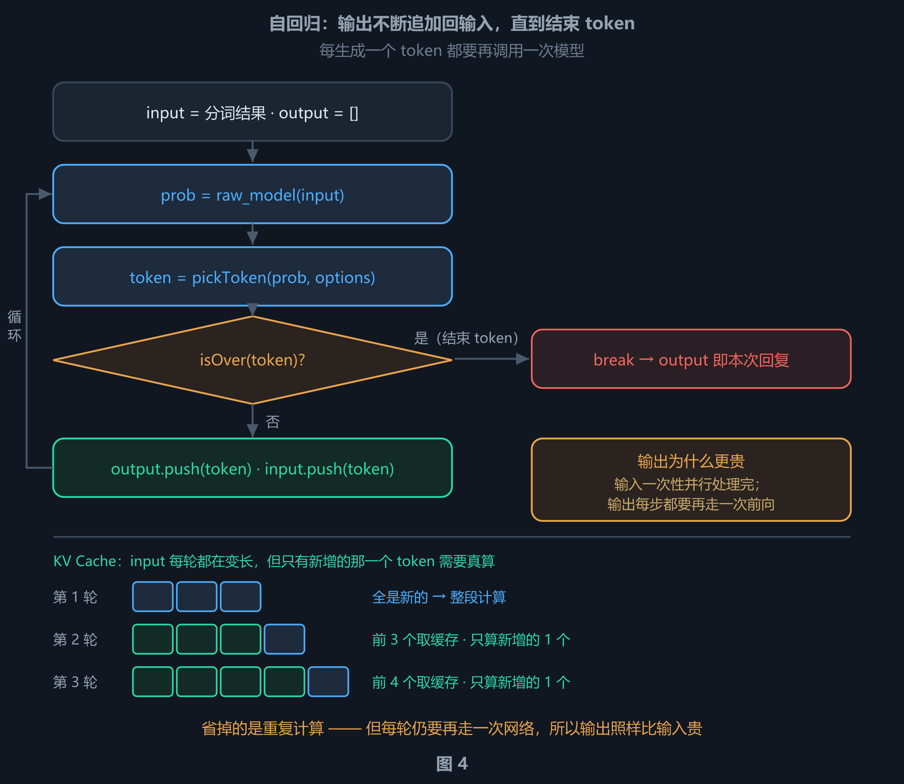
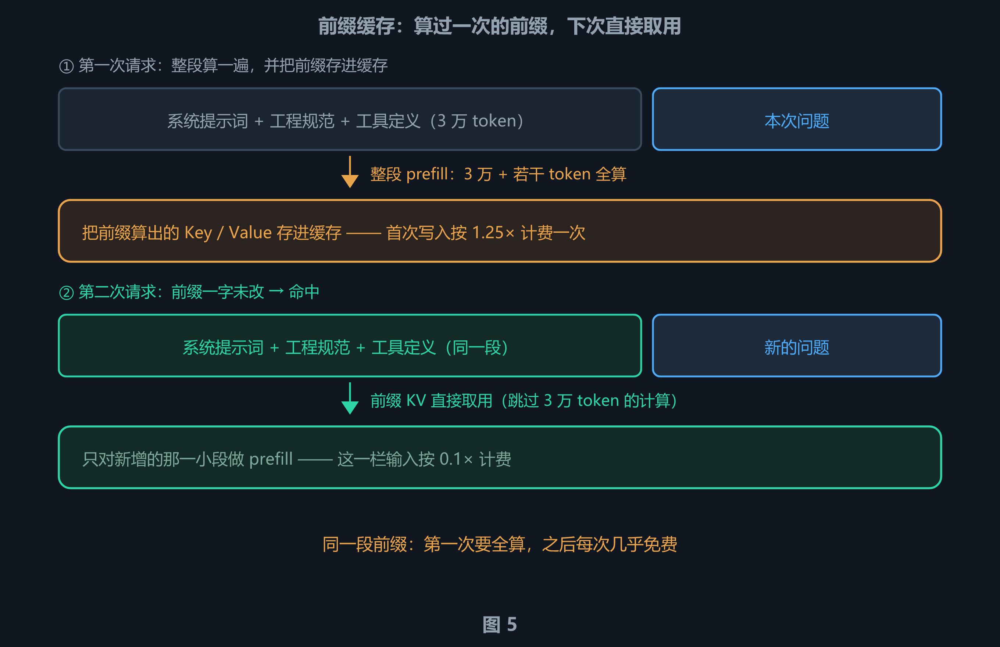
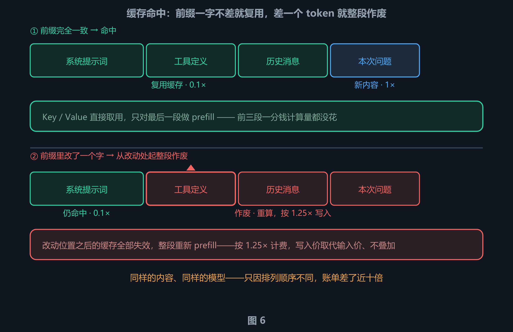
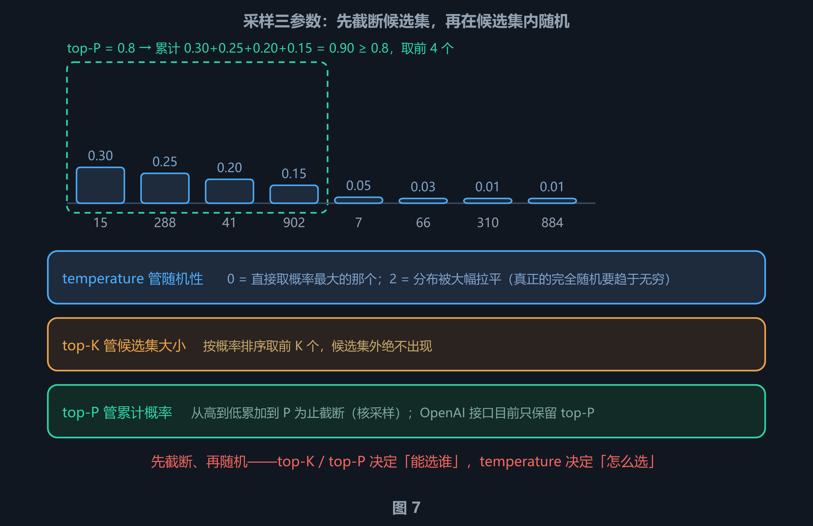
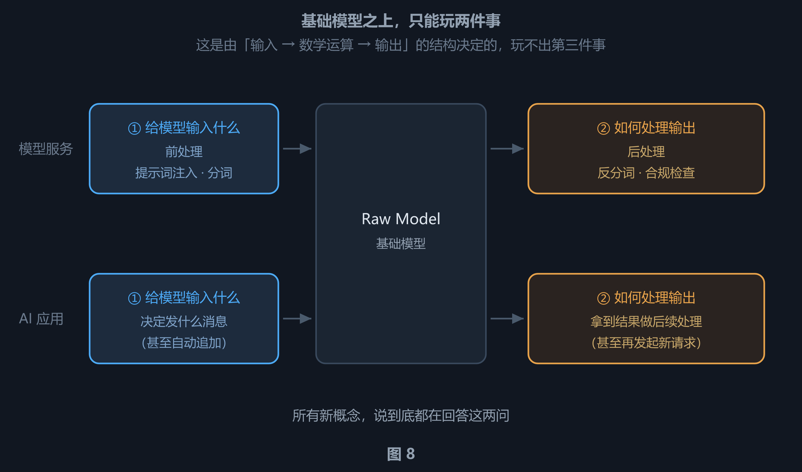
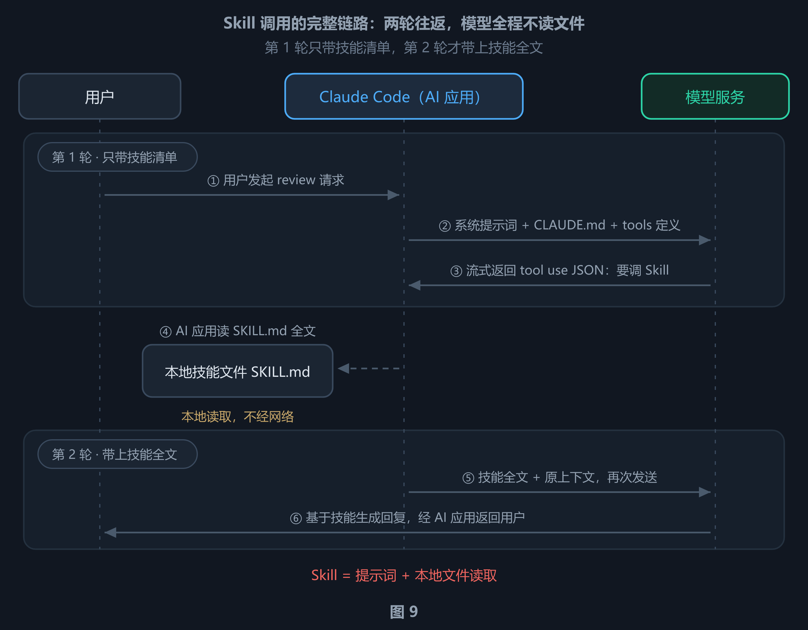

# 大模型三层架构拆解：从基础模型到 AI 应用，一切花样只在「输入什么 / 输出怎么处理」

网上讲大模型的文章，大多从「最新玩法」讲起——今天 RAG、明天 MCP、后天 Agent。读的时候很热闹，读完却常有同一个感觉：**这些概念很难区分？换一批名字，还认得出这些东西吗？**

这篇换一条路：**从最底层往上走**。先把大模型拆成一个函数、一个矩阵，再逐层看上面加了什么封装。走完之后你会得到一个非常省力的结论：
**基础模型之上的一切技术，无论叫什么名字、由谁实现，都只在做两件事：决定给模型输入什么，以及决定如何处理模型的输出。**

本文分为四部分、共 8 章：

- **第一部分（第 1 章）** 先建立三层架构的骨架，并给出一条能长期使用的稳定性规律；
- **第二部分（第 2 章）** 下沉到最底层，把「**基础模型**」拆到函数与矩阵；
- **第三部分（第 3–5 章）** 拆中间层「模型服务」——接口规格、内部三步（含输出为何更贵、缓存命中）、采样参数；
- **第四部分（第 6–8 章）** 讲最上层「AI 应用」：给出一个能拆解任何 AI 新概念的万能分析法，用代理服务器实战拆开 Skill 机制，最后复盘五个常见误区。

***

## 第一部分 · 三层架构：谁封装了谁

### 1. 三层封装链与一条稳定性规律

#### 1.1 每一层只做一件事：封装下一层

大模型的技术体系可以非常干净地切成三层，每一层对上一层的关系只有一句话：**封装**。

| 层                         | 它封装了什么  | 对外提供什么                          |
| ------------------------- | ------- | ------------------------------- |
| **基础模型**（Raw Model）       | 无（它是地基） | 一个函数：token 列表进，下一个 token 的概率分布出 |
| **模型服务**（Model Service）   | 基础模型    | 一个 API：自然语言消息进，自然语言回复出          |
| **AI 应用**（AI Application） | 模型服务    | 一个产品：有价值的 AI 工具                 |

这张表回答的是一个很容易被跳过的问题：**这三层之间是「替代」还是「叠加」？** 答案是叠加——上层不替换下层，只是把下层包起来，对外提供更高级的形态。模型服务封装基础模型，正如 AI 应用封装模型服务。三层都指向同一件事：**越往上层，离用户越近**。

同一件事在三层的三种形态，可以直观地摆在一起看。假设你在某个 AI 编程工具里敲了一句话——「帮我把这段代码改成异步的」：

| 层         | 这一层实际看到 / 处理的东西                                                 |
| --------- | --------------------------------------------------------------- |
| **AI 应用** | 一次回车事件。它决定要带上哪些上下文（工程规范、可用工具清单、历史消息），然后发起一次 HTTP 请求             |
| **模型服务**  | 一个 HTTP 请求体（JSON）。它负责认证、注入系统提示词、分词，然后循环调用基础模型逐 token 生成，最后反分词返回 |
| **基础模型**  | 一个 token 数字列表。它只做一件事：算出下一个 token 的概率分布                          |

三层各司其职，彼此不知道对方内部在做什么——这正是"封装"的含义。

分层还有一个很实际的好处：**每一层可以独立替换**。换模型不用改应用代码，换应用不用动模型，换服务商也不用重训模型——**只要上一层的接口不变，下一层怎么变都不影响你**。这也是"底层最稳定"这件事之所以重要的原因。

#### 1.2 越底层越稳定，越上层越不稳定

记住三层的关系之后，还有一条规律值得单独拎出来，因为它直接决定你该把学习精力花在哪里。



三层封装链。左侧每一层封装下一层，右侧是各层的变动速度——**变的是封装方式，不变的是最底层的函数**。

对照来看，三层的「变动速度」差了一个数量级都不止：

| 层     | 稳定性      | 具体表现                                                                            |
| ----- | -------- | ------------------------------------------------------------------------------- |
| 基础模型  | **非常稳定** | 调用方式（token 列表 → 概率分布）自 2017 年 Transformer 架构确立以来没有本质变化。变的是训练方式、性能、参数规模，**接口没变** |
| 模型服务  | 最不稳定     | 接口格式、周边能力、定价、模型清单，几个月一变                                                         |
| AI 应用 | 最不稳定     | 工具、框架、玩法，更新以周计                                                                  |

把时间线拉长看会更清楚：

| 时间      | 发生了什么                        | 属于哪一层               |
| ------- | ---------------------------- | ------------------- |
| 2017    | Transformer 架构确立             | 基础模型                |
| 2022 年底 | ChatGPT 发布，这套技术路线成为业界共识      | AI 应用               |
| 之后至今    | 训练方法、语料规模、性能指标持续变化；工具与应用层出不穷 | 各层都有，但**最底层那个函数没变** |

这符合技术领域的一般规律：**越底层越稳定，越上层越不稳定**。

#### 1.3 概念会在层间流动

三层之间有一个容易踩的坑：**分界线其实不清晰**。

像 Skills（技能）、MCP（Model Context Protocol，模型上下文协议）、Tools（工具调用）这类能力，会在应用层与服务层之间来回迁移——既可能由服务商在接口里内置，也可能由应用自己实现。

分工逻辑很简单：

> **核心 · 总有一方要做**
>
> 服务商做了，你就不用做；服务商没做，你就必须做。**总有一方要做**——所以你真正需要判断的只有一件事：我这一层要不要做。

这条判断标准的价值在于，它让你面对"某些能力到底属于谁"这种争论时可以直接跳过。归属会变，需求不会。

***

## 第二部分 · 底层：基础模型

### 2. 基础模型：一个函数，一个矩阵

#### 2.1 一句话定义

**Raw Model（基础模型 / 原始模型）** 是整个 AI 技术体系的最底层。无论上层用什么技术，最终都落在它上面。

> **基础模型可以理解成**就是一个**函数**——接收一个 Token（词元）列表，输出**下一个 Token 的概率分布**。

它之所以叫"基础模型"，是因为它处在整个体系的最底层、不带任何花哨功能：没有对话、没有记忆、没有工具，只做这一件事。也正因为如此，它才看得见 AI 最本质的真相——**上面所有的花样，都是在这一件事上做封装**。



左侧是分词后的 token 列表，中间是基础模型函数，右侧是概率分布；下方是函数内部真正被调用的权重矩阵，以及训练 / 微调、语料与 GPU 三个外部因素。**这张图是第 2 章的地图**，后面每一小节展开其中一块。

#### 2.2 从文字到数字：分词

模型的输入不是文字，而是自然语言换算成的数字。这个换算过程被叫做**分词（tokenization）**。

为什么必须分词？因为模型内部从头到尾只有数学运算，**它不认字，只认数字**。文字要进模型，第一步就必须变成数字；模型吐出来的也是数字，最后再被还原成文字给人看。

分词的粒度不符合多数人的直觉：**既不是按字切，也不是按词切，而是按「子词」（subword）切**。英文里，词根、前缀、后缀会被拆开——这就是为什么「1 个英文单词 ≈ 1.3 个 token」而不是 1 个。中文则视词表大小而定，词表做得大的模型更接近「1 字 ≈ 1 token」。

实际工程中不需要精确计算，但需要有一个数量级概念：

| 语言 | 经验换算                                        |
| -- | ------------------------------------------- |
| 中文 | 1 个字 ≈ **1.5 个 token**（有的字占 1 个、有的占 2\~3 个） |
| 英文 | 1 个单词 ≈ **1.3 个 token**（含词根、前后缀的切分）         |

这个换算率**视分词器而定**。Qwen、DeepSeek 等中文词表做得大的模型，中文可以接近「1 字 ≈ 1 token」；而同一个中文词，在不同厂商的分词器下被切成几个 token 也可能不同。

分词结果直接影响两件你会在意的事：**一是上下文窗口的占用**（同样一段文字，切出的 token 越少，能装的内容越多），**二是计费**（所有厂商都按 token 计费，不按字数）。所以"这句话要花多少钱"这个问题，答案由分词器决定。

给模型发一条消息的完整路径是：**消息 → 分词 → 一串数字（token 列表）→ 传给模型**。

不需要精确计算时的快速估法：**中文按字数 × 1.5，英文按单词数 × 1.3**，两者相加就是大致 token 数。做成本预估、判断会不会超出上下文窗口大小，这个精度基本够用了。

#### 2.3 输出：下一个 token 的概率分布

模型拿到 token 列表后，做一整套计算，输出「下一个 token 的可能性」：

```text
输入: [3, 6, 12, 767665, 7878]   （"您好"，示意值，非真实分词结果）
输出: {
    15:  0.7,
    288: 0.2,
    ...
}
```

左边是输入的数字列表，右边是一张「编号 → 概率」的表。模型告诉你的是：**下一个位置最可能出现编号 15 的 token（概率 0.7），其次是编号 288（概率 0.2）**。

这里有两个性质需要点出来，否则后面容易误解：

- **概率之和为 1。** 这是一张完整的概率分布，不是"若干个候选"——它覆盖词表里的每一个 token，只是大部分概率小到可以忽略。
- **模型只给候选，不给结论。** 从这张分布里"挑一个出来"的动作叫**采样**，它发生在模型之外，由调用方传的参数控制。这也是为什么同一个问题问两次可能得到不同答案——第 5 章展开。

这就是基础模型的全部。**没有对话、没有情感，只有概率分布。** 所有市面上的聊天助手、AI 编程工具，都是在这张概率表上面玩出的花样。

#### 2.4 上下文窗口：装得下 ≠ 处理得好

上面那个 token 列表，有一个**最大长度**限制，这个上限就是**上下文窗口（context window）**。

| 标称   | token 数 | 约合中文（÷1.5，保守值） |
| ---- | ------- | -------------- |
| 128K | 12.8 万  | ≈ 8.5 万字       |
| 256K | 25.6 万  | ≈ 17 万字        |
| 1M   | 100 万   | ≈ 66 万字        |

这里说的 K、M 指的是 **token 数量**，与磁盘空间、显存大小不是一回事。表中的「约合中文」按 **÷1.5** 这个保守值折算；中文词表做得大的模型（Qwen、DeepSeek 等）实际能装的中文更多。

关于上下文窗口，有两个特性比数字本身重要得多。

**第一，API 层超限会直接报错。** 超出上限时，服务端返回 400，报错信息例如 `maximum context length is X tokens`。但应用层（聊天工具）通常会先做「丢旧留新」——把最早的历史消息丢掉再发。所以作为普通用户，你往往感觉不到报错，只会觉得"它好像忘了前面"。

这不是错觉。**被丢掉的恰恰是对话最早的内容**——而人们在对话开头交代的规则（"以后回答都用表格""不要用 emoji"）就落在那里。这就是「AI 聊久了忘了之前定的规则」的真实机制：不是它不遵守，是那条规则已经被丢弃了。

**第二，能容纳 ≠ 能处理好。** 上下文越长，模型的实际能力越会下降。这一点和上一条是两回事：上一条是"装不下"，这一条是"装下了但用不好"。

直观理解：模型在生成每个 token 时都要对上下文里的全部内容分配注意力，内容越长，单条信息分到的注意力越被稀释。于是会出现"中间部分被忽略""细节记错"这类现象。

> **提示 · 两条可直接用的实践**
>
> 1. **相对独立的任务，新开一个上下文窗口去做。** 不要在一个经历多轮次的会话里塞一个全新的、无关的任务。
> 2. **AI 编码工具大量使用子代理（subagent），本质就是在规避这个问题。** 让一个干净的上下文去干一件独立的事，干完只把结论带回来，而不是把中间过程全灌进主会话。

#### 2.5 打开黑盒：权重矩阵

现在把基础模型这个「函数」打开。它内部调用的东西叫**权重矩阵（weight matrix）**。

矩阵就是一张数字表格。所谓"函数内部"，说白了就是许多张这样的表格，模型计算的过程就是拿输入的数字列表去和这些表格反复做乘加运算。**除了这些数字，里面没有别的东西。**

**参数量 = 矩阵中数字的个数。** 说一个模型是 7B（B = 10 亿），意思是它的权重矩阵里有 70 亿个数字；当前旗舰模型已达**万亿级总参数**。

由此可以直接推出几个常被误解的事实：

| 说法                | 实际含义                          |
| ----------------- | ----------------------------- |
| 模型文件有几个 G / 几百个 G | 体积主要就是**权重矩阵**占的，其余是描述架构的配置文件 |
| 模型"多大"            | 指的是**参数量**（数字个数），不是文件体积       |
| 下载一个模型            | 下载的是**权重矩阵 + 配置文件**，两者缺一不可    |

"参数量"和"文件体积"的换算关系很直接：每个数字用 16 位浮点（fp16）存占 2 字节，70 亿个数字就是约 14GB。**体积是参数量的直接后果，不是独立指标。**

不过 2026 年的旗舰基本都是**稀疏 MoE（Mixture of Experts，混合专家）**，它给"参数量 = 矩阵中数字的个数"这句话加了一个限定：**数字的总数，和每次用到的数字个数，不再是同一个数了。**

改动的地方很具体：把模型里那个前馈网络（FFN）从一个换成 N 个结构完全相同的副本——这些副本叫**专家（expert）**，前面再加一个**路由器（router）**。每个 token 进来，路由器先给它打分，只放行得分最高的那几个专家，其余专家这次完全不参与计算。



稀疏 MoE 的两个口径。上半是稠密模型——每次前向都用满全部参数；下半是 MoE——路由器为每个 token 挑出少数专家，未被选中的专家不参与这次前向。**参数总量照旧堆着，每次真正参与计算的那部分却小得多。**

> **注意 · "专家"不是分工**
>
> 这些专家并不各管一摊（没有"数学专家""代码专家"之分）。每个专家结构完全相同，谁擅长什么由训练自己长出来，通常也不可解释。"专家"这个名字只是沿用早期论文的叫法。

于是同一个模型的参数量必须分两个口径来报：

| 口径 | 是什么 | 决定什么 |
| --- | --- | --- |
| **总参数**（total） | 所有专家的数字全加起来 | 模型文件多大、显存要装多少、下载门槛 |
| **激活参数**（activated） | 每次前向真正被选中的那几个 | 每次前向的算力、生成速度、单 token 成本 |

两个口径能差出一个数量级。DeepSeek-V3 是 **671B 总参数 / 37B 激活**（256 个路由专家里每个 token 选 8 个，另加 1 个所有 token 都走的共享专家）；按 2026 年旗舰的典型形态，一个 **1.6T 总参数的模型可能只激活 3% 左右**。这就是"体积大"不等于"算得贵"的全部原因——**文件体积按总参数记，算力账单按激活参数记。**

代价则落在另外三处：**显存**（没被选中的专家也得在显存里待命）、**通信**（专家通常分散在多张卡上，token 要跨卡搬运）、**负载均衡**（训练时要防止流量全压在同几个专家上）。所以 MoE 是**用显存和工程复杂度，换单位算力能买到的知识容量**。

还有一个实操层面的关键点：**架构必须匹配**。用 HuggingFace 这类库调用模型时，**用什么架构训练的，就要用什么架构调用**。当前主流架构是 **Transformer**（2017 年确立，至今没有本质变化）。

- **换架构**（比如从 Transformer 换成另一种网络结构）→ 通常需要**重新训练**；
- **同架构换实现**（比如各家权重格式互转）→ 只需做**格式转换**。

这套模式整体属于**神经网络 / 深度学习**技术路线——本章只讲到"矩阵"这一层，矩阵里的数字究竟怎么算出来，是训练阶段的事。

#### 2.6 训练与微调：谁在改矩阵

有了"权重矩阵"这个概念，两个常被混用的词就能一句话分清：

| 概念                  | 它在做什么                      | 原材料        |
| ------------------- | -------------------------- | ---------- |
| **训练（training）**    | 从无到有**生成**这个矩阵             | 语料（corpus） |
| **微调（fine-tuning）** | 矩阵已经存在，通过二次训练**改动其中的部分数字** | 语料（corpus） |

两者的原材料都是**语料（corpus）**。这里有一条朴素的因果关系：**模型见过的 token 越多，预测越准**。编程模型之所以强，很大程度上就是因为开源代码语料规模庞大——**语料的构成决定了模型的能力倾向**。

#### 2.7 本质是纯函数，但 GPU 让它不那么纯

**理论上**，大模型是一个数学函数，甚至是**纯函数（pure function）**——输入不变，输出一定不变。输入 `1+2` 永远得到 `3`，只是这个公式比加法复杂得多。

**实际上**，参数量太大，必须靠 **GPU 并行运算**：把公式拆解成许多小块，同时算。而计算机使用的是**浮点数（floating point）**，浮点数**不满足结合律**：

```js
0.1 + 0.2 + 0.3        // 0.6000000000000001
0.1 + (0.2 + 0.3)      // 0.6
0.1 + 0.2 + 0.3 === 0.1 + (0.2 + 0.3)   // false ← 拆解位置不同，结果不同
```

上面这段可以直接粘到浏览器控制台里跑一遍。GPU 拆解公式的位置、顺序不同，最终结果就可能有细微差异。

所以准确的表述是：**理论上是纯函数，实际运行有微小抖动**。抖动幅度极小、只到末位，不会改变输出的意思。

> **注意 · 抖动不是「随机性」的主要来源**
>
> 这个抖动幅度极小。你在实际使用中感受到的"随机性"，绝大部分来自第三部分要讲的**采样参数**，而不是浮点误差。别把两者混为一谈。

#### 2.8 多模态：一切皆数字

最后收一个常见疑问：模型怎么"看懂"图片和音频？

答案是——**它没有看懂，它只是在算数字**。模型不知道什么叫中文、英文、图片、视频，它的输入输出都是数字数组。所谓多模态，拆开只有两件事：

1. 训练时喂了对应模态的 token；
2. 输出 token 后，**由调用方的程序**判断它落在词表的哪个区间（例如 image file 区间），再转码还原成图像 / 音频。

对模型而言，音频、视频、图像、文字没有任何区别——**喂什么，就能算什么**。模态的差异只存在于「人如何解读输出」这一侧。

> **本章小结 · 第 2 章**
>
> - 基础模型 = `f(token 列表) → 下一个 token 的概率分布`，是 AI 体系的最底层。
> - 分词按子词切，经验值：中文 1 字 ≈ 1.5 token，英文 1 词 ≈ 1.3 token（视分词器而定），直接影响上下文占用与计费。
> - 上下文窗口是 token 列表的长度上限；**超限时 API 报错、应用层丢旧留新**；**装得下 ≠ 处理得好**。
> - 模型文件 ≈ 权重矩阵 + 配置文件；**参数量 = 矩阵中数字的个数**（7B = 70 亿）；2026 年的旗舰多为稀疏 MoE，参数量要分**总参数 / 激活参数**两个口径。
> - 训练 = 从无到有生成矩阵；微调 = 改动矩阵里的部分数字；原材料都是语料。
> - 理论上纯函数，GPU 浮点并行使结果存在微小抖动。
> - 多模态对模型而言没有区别——一切皆数字。

***

## 第三部分 · 中层：模型服务

### 3. 接口规格与调用方式

**Model Service（模型服务）** 是基础模型的上一层：服务商在基础模型基础上做的**二次封装**，以 **API 接口**形式对外发布。

> **核心 · 模型服务的定义**
>
> 用户传入一段自然语言消息 → 经过模型服务的处理 → 得到一段自然语言回复。**自然语言进、自然语言出**，这就是它的核心能力。

服务商除核心能力外，还会附带大量周边功能（文件上传、Skill 创建、tool 调用等），这些**变动快**，需要时查官网文档即可。

#### 3.1 三大接口规格

目前没有权威机构统一接口规格，实际形成的是**事实标准（de facto standard）**。这张表回答的是：**对接一个新模型之前，我该先确认什么？**

| 接口规格                  | 地位   | 说明                           |
| --------------------- | ---- | ---------------------------- |
| **OpenAI 格式**         | 事实标准 | 历史地位决定了多数国内外大模型都按它的 API 格式发布 |
| **Anthropic（Claude）** | 独立规格 | 自有接口格式                       |
| **Google Gemini**     | 独立规格 | 自有接口格式                       |

实操要点是：**对接新模型时，先看官网文档声明兼容哪种规格**。

- 兼容 OpenAI → 直接用 OpenAI 的请求格式 / SDK；
- 部分厂商甚至**同时兼容多家**。例如 KIMI 既兼容 OpenAI 格式，又另外提供一个 base\_url 兼容 Anthropic 格式。

#### 3.2 两种调用方式

| 方式                                        | 你要懂什么                           | 适合           |
| ----------------------------------------- | ------------------------------- | ------------ |
| **原生 HTTP 请求**                            | 请求行 / 请求头 / 请求体，响应行 / 响应头 / 响应体 | 排查问题、对接非标准接口 |
| **SDK**（Software Development Kit，软件开发工具包） | 只需创建 Client，填入三个值               | 日常开发         |

一次原生请求长这样（字段为通用示意，具体以厂商文档为准）：

```bash
curl https://api.example.com/v1/chat/completions \
  -H "Content-Type: application/json" \
  -H "Authorization: Bearer $API_KEY" \
  -d '{
    "model": "your-model-name",
    "messages": [
      {"role": "system", "content": "你是一个严谨的技术助手。"},
      {"role": "user",   "content": "用一句话解释什么是 token"}
    ],
    "temperature": 0.2,
    "top_p": 0.9
  }'
```

拆开看，请求由三部分组成：

| 部分      | 在这段命令里是                          | 作用                  |
| ------- | -------------------------------- | ------------------- |
| **请求行** | `POST /v1/chat/completions`      | 说明"我要做一次对话补全"       |
| **请求头** | `Content-Type` / `Authorization` | 说明"我发的是 JSON"和"我是谁" |
| **请求体** | `-d '{...}'`                     | 模型名、消息列表、采样参数       |

响应体是一个 JSON，回复正文在 `choices[0].message.content` 里——**就是模型服务把基础模型吐出的 token 序列反分词后的结果**。

SDK 就是把上面这一整套网络请求封装好了，用起来只需要三个值：

| 参数         | 作用           |
| ---------- | ------------ |
| `base_url` | 请求基地址        |
| `API Key`  | 鉴权密钥（同时用于计费） |
| `model`    | 模型名          |

#### 3.3 换厂商三步

上面三个值，正好对应**换厂商三步**：

> **核心 · 换厂商三步**
>
> 换基地址（`base_url`）→ 换 API Key → 换模型名（`model`）。**请求路径、请求头、请求体完全一样。**

这就是「事实标准」：只要厂商兼容 OpenAI 格式，切换成本就是改三行配置，代码一行不用动。

***

### 4. 内部三步：前处理 → 自回归 → 后处理

用户消息进入模型服务后，大致分三步得到结果。这三步是理解"为什么输出更贵""为什么问不同模型'你是什么模型'答案不一样"的关键。

#### 4.1 前处理：认证、提示词注入、分词

前处理（pre-processing）里**一定会有**三件事：

**① 身份与权限认证。** 验证 API Key 的有效性、余额，以及有无权限调用该模型。

**② 系统提示词注入。** 用户消息**不会直接**传给大模型，而是先追加一段系统提示词（system prompt）。服务商通常注入类似「你是 XX 大模型，版本是 XX」「当用户询问你是什么模型时，你要怎么回答」这样的内容——**这就是问不同厂商的模型"你是什么模型"，答案五花八门的原因**。

把注入前后摆在一起对比，这件事会立刻变清楚：

```text
你发出去的（请求体里的 messages）：
  [ { role: "user", content: "你是什么模型？" } ]

实际进到基础模型的（示意）：
  [ 系统提示词：你是 XX 大模型，版本 XX；当用户询问你是什么模型时…… ]
  [ { role: "user", content: "你是什么模型？" } ]
  ↓ 分词
  [ 1201, 88, 3307, 15, ..., 4520 ]
```

到这里，"你是什么模型"的答案由谁决定就一目了然了：**由注入的那段系统提示词决定，不是模型自己"知道"**。

顺带一个和钱包有关的推论：**系统提示词同样占输入 token，而且每次请求都要重发一遍**。它由服务商注入，账单却由你付——不同厂商的系统提示词长度差别很大，这也是同一段对话在不同平台花费不同的原因之一。**这笔重复付费是有解的，见 §4.4。**

由此得到一条更重要的认知，值得单独框出来：

> **核心 · 提示词是「服务商层」的概念**
>
> 对基础模型而言，系统提示词、用户提示词、用户问题，统统被转成**同一个 token 数组**，没有任何区别。"提示词"只是**我们在含义上做的分类**，模型层面并不存在这个区分。
>
> 当系统提示词与用户提示词冲突时，一般性内容听用户的，重要规则听系统的——训练数据与后训练对齐让模型对 `system` / `user` 这类 role 标记形成了偏好。

**③ 分词。** 把所有自然语言转成 token 列表，准备传给模型。也就是第 2 章讲的那一步。

#### 4.2 自回归：一段伪代码给你讲透

```javascript
const input  = [...,...];   // 之前 token 化的结果（含提示词 + 用户消息）
const output = [];
while(1){
  const prob  = raw_model(input);           // 根据输入计算下一个 token 的概率分布
  const token = pickToken(prob, options);   // 按配置从概率分布中挑一个 token
  if(isOver(token)){
    break;                                  // 是结束 token 就终止
  }
  output.push(token);                       // 加入输出
  input.push(token);                        // 同时追加回输入 → 下一轮
}
```

这段代码里有三处值得注意一下：

- **`raw_model(input)`**：调用的就是第 2 章的基础模型，输入 token 列表，拿回概率分布。
- **`pickToken(prob, options)`**：从概率分布里挑一个 token，`options` 就是下一节要讲的采样参数。
- **`output.push`** **与** **`input.push`** **两行**：这是整个"自回归"的含义所在——**模型的输出被追加回输入**，下一轮连同前面所有内容一起再喂给模型，直到出现结束 token（结束符由各家模型自定义）。

光看代码还不够直观，把三轮循环摊开走一遍：

| 轮次    | 送进 `raw_model` 的 `input` | 采样结果     | 循环结束时                                              |
| ----- | ------------------------ | -------- | -------------------------------------------------- |
| 第 1 轮 | `[3, 6, 12]`             | 选中 `15`  | `output = [15]`，`input = [3, 6, 12, 15]`           |
| 第 2 轮 | `[3, 6, 12, 15]`         | 选中 `288` | `output = [15, 288]`，`input = [3, 6, 12, 15, 288]` |
| 第 3 轮 | `[3, 6, 12, 15, 288]`    | 选中结束符    | `break`，`output` 即本次回复                             |

三个关键现象在这一张表里全都能看到：**输入每轮都在变长**（自回归的"回归"）；**每一轮都要调用一次模型**；**`output`** **只是被不断追加**，从不需要回头修改。



自回归循环。上半是循环本身——输出不断追加回输入，直到结束 token；右侧标注了「输出为什么更贵」的根源。下半是「带 KV Cache」那一版里 `fresh` 的可视化：input 每轮都在变长，但**只有新增的那一个 token 需要真正计算**，前面已算过的 Key / Value 直接取用。

**这段代码里，KV Cache 藏在** **`raw_model`** **里面。**

第 4 行注释说 `raw_model(input)` 是"根据输入计算下一个 token 的概率分布"，从外面看确实如此。但把它打开一层，里面其实是两件事：

```javascript
function raw_model(input) {
  const kv   = computeKV(input);   // ① 为 input 里的每个 token 算出 Key / Value
  const prob = attention(kv);      // ② 用这批 KV 算出下一个 token 的概率分布
  return prob;
}
```

**KV Cache 改的就是 ① 这一步。** 主循环一个字都不用动，只换 `raw_model` 的实现：

```javascript
// ── 朴素实现：每轮把 input 全部重算 ────────────────
function raw_model(input) {
  const kv = computeKV(input);     // 整个 input 都算一遍
  return attention(kv);
}
```

```javascript
// ── 带 KV Cache：只算新增的那几个 ──────────────────
const kvCache = [];    //  跨调用保留：已经算过的 Key / Value
let computed  = 0;     //  跨调用保留：已经算到第几个 token

function raw_model(input) {
  const fresh = input.slice(computed);    //  只取「还没算过」的 token
  kvCache.push(...computeKV(fresh));      //  只算这几个，追加进池子
  computed = input.length;                //  游标跟上

  return attention(kvCache);              // 用的仍是「全部 token 的 KV」
}
```

两版唯一的差别是 `computeKV` 的入参：前者传整个 `input`，后者只传 `fresh`。而 `attention` 拿到的 KV 集合**完全相同**——所以数学上完全等价，只是有一部分不再重复计算（浮点下仍可能有末位差异，见 §2.7）。

`kvCache` 与 `computed` 定义在**函数外面**，因为它们要跨调用活下来——这正是"复用"能成立的前提。

> **注意 · 真实实现不是数组**
>
> 上面是为讲清逻辑简化的写法。真实实现里，KV Cache 是一块按「层 × 注意力头」组织的显存，用长度游标索引，`fresh` 也不会真的切片。但**逻辑就是那三行**。

#### 4.3 输出 token 为什么更贵

各家模型服务的定价普遍遵循同一条规律：**输入 token 便宜，输出 token 贵**。

| 项目 | 定价示例（OpenAI 官网，课程录制时价格，实际请以官网实时报价为准） |
| -- | ------------------------------------ |
| 输入 | **\$2.5 / 百万 token**                 |
| 输出 | **\$15 / 百万 token**                  |

差距达到 6 倍。原因就藏在上面那段 `while` 循环和那张演算表里：

> **核心 · 输出更贵的根源**
>
> **输入是一次性并行处理完的；输出则是每生成一个 token，就要把"原始输入 + 已生成输出"整段再走一次前向传播。**
>
> 输出 1000 个 token = 调用模型 1000 次。价格差异不是定价策略，是计算量的真实反映。

工程上有一项优化需要补充说明，否则容易产生误解：**KV Cache**（机制见 §4.2）。它让循环里每轮真正新算的，只有刚追加进去的那一个 token，**不必每步都从零重算全部上下文**。

但要注意它优化的是什么、没优化什么：

| KV Cache 优化了 | KV Cache 没有改变         |
| ------------ | --------------------- |
| 已算过的中间结果不必重算 | 每生成一个 token，仍要再走一次前向  |
| 长上下文下的重复计算   | 上下文越长，注意力计算越贵、缓存占显存越大 |

所以结论不变：**成本依然随输出长度上升**。KV Cache 减少的是"重算"，不是"调用次数"。

把成本算一遍会更具体。假设一轮对话：请求带着 2000 token 的上下文（含历史消息），模型回复 500 token。

| 项目         | 数量         | 单价         | 小计       |
| ---------- | ---------- | ---------- | -------- |
| 输入（含历史上下文） | 2000 token | \$2.5 / 百万 | \$0.0050 |
| 输出（本次回复）   | 500 token  | \$15 / 百万  | \$0.0075 |

**输出只有输入的四分之一长度，花费却是输入的 1.5 倍。** 这就是"输出贵 6 倍"在实际账单里的样子。

它同时解释了两件常被忽略的事：**一是"让模型多写"比"让模型多读"更贵**——后者是一次性并行处理，前者每段文字都要再走一遍循环；**二是长对话的输入成本也在涨**——因为历史消息每次都要重发一遍，窗口越满，每一轮的输入越贵。

#### 4.4 缓存命中：为什么重复的输入更便宜

上一节的结尾留下了一个不太好的结论：**历史消息每次都要重发一遍，每一轮都在为"没变的内容"重新付费**。

第 7 章的代理抓包会把这个结论变得非常具体：AI 应用每次发消息，都带着一份几乎不变的大礼包——系统提示词、工程规范、工具定义。它们动辄几万 token，而且**一个字都没改**。但按上一节的规则，这些 token 每一轮都要重新算一遍、重新付一次钱。

缓存命中就是这件事的解药。先看它怎么工作。



前缀缓存的工作过程。第一次请求把前缀整段算完，同时把算出的 Key / Value 存进缓存；第二次请求的前缀一字未改，这部分计算被直接跳过——**算过一次的东西，不必再算第二次**。

**为什么能跳过？因为那批中间结果只取决于输入。**

回到第 2 章那个函数：模型的输入是一串 token，服务端收到后要先把它**整段算一遍**——这一步叫 prefill，也就是上一节说的"输入是一次性并行处理完的"。算的过程中会产生一批中间结果：每层注意力的 Key / Value。

关键在于，**这批中间结果只取决于输入内容本身，与你让它输出什么无关**。所以只要下次请求的开头仍是同一段 token，这批中间结果就**完全一样，没必要重算**。服务端把它存下来、下次直接取用——这个机制叫**前缀缓存（prefix caching）**，取用的动作就叫**缓存命中**；没取到、只能老老实实重算，就叫**缓存未命中**。

于是价目表上的输入 token 不是一栏，而是三栏：

| 计费项                        | 相对标准输入价   | 说明                           |
| -------------------------- | --------- | ---------------------------- |
| 输入 · **未命中**（cache miss）   | **1×**    | 按标准输入价计费                     |
| 输入 · **命中**（cache hit）     | **0.1×**  | 约等于**打一折**，省下 90%            |
| 输入 · **缓存写入**（cache write） | **1.25×** | 首次把这段内容存进缓存；**写入价取代输入价**，不叠加 |

这三行取自 Anthropic 与 OpenAI 官方文档的当前口径，两家在倍率上高度一致；更早的模型可能不收写入费，各家的最小长度门槛也不相同，**具体以官网实时报价为准**。

**为什么命中就便宜？** 因为定价反映的是计算量（上一节已经证明过一次）。命中意味着这一段 token 的 prefill 计算**根本没有发生**，省下的算力，厂商以折扣的形式还给你一部分。

这也解释了折扣为什么只出现在**输入**这一栏：输出是逐 token 串行生成的，每个 token 都是新的，**没有"重复"可省**。

**命中的条件很苛刻：前缀必须逐 token 完全一致。**

缓存比对的不是"这段内容像不像"，而是**从第一个 token 开始，一个字符都不能差**。第三个 token 变了，从第三个 token 往后的缓存就全部作废——已经算好的 Key / Value 用不上，还得按 1.25× 重新写入一次。



同一个前缀，改一个字与没改字的代价对比。上半是前缀一字未改——前三段直接复用缓存、按 0.1× 计费；下半只改了工具定义里的一个字，从改动位置起整段作废——这一段要重新计算、重新写入，按 **1.25×** 计费（写入价取代输入价，不是 1× 再加 1.25×）。

这条约束直接决定了 prompt 该怎么组织：

| 写法                                       | 结果                        |
| ---------------------------------------- | ------------------------- |
| 静态内容在前（系统提示词、工具定义、参考资料），动态内容在后（用户问题、时间戳） | ✅ 前缀稳定，每次都命中              |
| 把当前时间、随机数、会话 ID 写进系统提示词开头                | ❌ 每个请求都不同一个字符 → 永远不命中     |
| 改动系统提示词里的一个版本号                           | ❌ 整段前缀作废，还要按 1.25× 重新写入一次 |

所以"缓存命中"不只是一条省钱的技巧，它同时是一条**对输入组织的硬约束**：**把不变的东西放在前面，把变化的东西放在最后。**

**它和上一节的 KV Cache 是什么关系？**

这两个词经常被混着用，其实是**同一种技术的两种作用范围**：

| <br />     | KV Cache（§4.2）            | 缓存命中（前缀缓存）                |
| ---------- | ------------------------- | ------------------------- |
| **作用范围**   | 一次请求**内部**                | **跨请求**                   |
| **复用的是什么** | 本次已生成 token 的 Key / Value | 上次请求算过的**前缀** Key / Value |
| **省的是**    | 重复计算（省时间）                 | 重复计算 + **真金白银**           |
| **谁直接受益**  | 服务商的算力                    | **你的账单**                  |
| **在价目表上**  | 不体现为独立计费项                 | 有独立单价（0.1×）               |

一句话：**KV Cache 是"这一次别重算"，缓存命中是"上一次算过的这次接着用"。** 底层是同一件事——复用 Key / Value，差别只在作用域。

**两个能立刻验证的推论。**

**① 长会话不是线性变贵，而可能几乎不变贵。** 假设系统提示词 + 工具定义 + 工程规范共 3 万 token，且每次请求一字不改，那么从第二次请求起，这 3 万 token 都按 0.1× 计费——**它占了上下文的大头，却只花了十分之一的钱**。这正是 §4.1 那个"系统提示词每次重发、账单却由你付"的问题的实际解法，也解释了第 7 章里 AI 应用每次都把工程规范和 tools 定义重发一遍、账单却没有失控的原因。

**② 缓存有寿命，隔太久的第一句话会变贵。** 缓存不是永久的，各厂商给了不同的有效期（常见量级是几分钟到几十分钟，被复用时免费续期）。隔夜再打开一个旧会话，前缀缓存大概率已经过期——那一轮请求的前缀要重新计算、重新写入，**按 1.25× 计费**（写入价取代输入价，不是 1× 再加 1.25×）。

> **注意 · 缓存不会因为你"付过钱"就永久有效**
>
> 它省的是重复计算，前提是**这份计算结果还在**。缓存过期、厂商轮换机器、缓存被挤掉，都会让命中率下降。所以它是**常态下的成本优化**，不是可以写进预算的确定承诺。

**怎么确认真的命中了？** 各厂商都在响应的 `usage` 字段里单独列出缓存 token 数（OpenAI 是 `cached_tokens`，Anthropic 是 `cache_read_input_tokens` 与 `cache_creation_input_tokens`）。这两个数字比"感觉变快了"可靠得多——**如果它们一直是 0，说明你的前缀压根没稳定过**。

> **核心 · 缓存命中是「输入什么」这一问的延伸**
>
> 模型没变、输出没变、任务没变，**只是把输入的排列顺序调了一下，账单就差了近十倍**。这是"输入决定成本"最直接的证据，也再次印证第 6 章那个论点：在基础模型之上，你能做的只有两件事。

#### 4.5 后处理：反分词与合规检查

后处理（post-processing）里**一定会有**两件事：

1. **反分词（detokenization）**：把 token 序列还原成自然语言——总不能给用户看数字。
2. **合规性检查**：国内外都有（严格程度不同）。检查不通过就加提示词重新生成，总之不能把不合适的内容给到用户。

> **本章小结 · 第 4 章**
>
> - 模型服务的核心流程：**前处理 → 自回归 → 后处理**。
> - 前处理三件事：身份认证、提示词注入、分词；**提示词是服务商层概念**，对模型都是 token。
> - 自回归 = 输出不断追加回输入的循环，直到结束 token；每一轮输入都更长、都要再调用一次模型。
> - 输出 token 更贵：**每生成一个 token 都要再走一次前向**；KV Cache 复用中间结果，但不减少调用次数。
> - 缓存命中：前缀逐 token 一致则复用已算的 KV，输入按 **0.1×** 计费（省 90%），首次写入 **1.25×**；**静态内容在前、动态内容在后**是命中的前提。
> - 后处理两件事：反分词、合规性检查。

***

### 5. 采样三参数：模型的「随机性」从哪来

#### 5.1 三个参数各管什么

第 2 章说过，模型理论上是纯函数。那么"随机性"从哪来？答案在**采样**这一步——`pickToken(prob, options)` 里的 `options`。

这三个参数由**用户调用 API 时传入**，共同决定「如何从概率分布中挑出下一个 token」：

| 参数                              | 机制                                                            | 取值建议                                                  |
| ------------------------------- | ------------------------------------------------------------- | ----------------------------------------------------- |
| **temperature**（温度）             | 控制选择的**随机性**。0 = 完全确定（取概率最大者）；2 = 分布被大幅拉平，低概率 token 也有较大机会被选中 | 代码 / 科研：**0\~0.2**；普通问答：**0.7 左右**（共识值）；创意写作：**1 以上** |
| **top-K**                       | 按概率**从高到低排序取前 K 个**，候选集外绝对不出现；再用 temperature 在候选内随机选          | 视需求定 K 值                                              |
| **top-P**（核采样，nucleus sampling） | 按概率**从高到低累加到 P 为止**截断候选集                                      | OpenAI 接口目前只保留 top-P                                  |



采样三参数。上半是同一个概率分布上的两种截断方式，下半是三个参数各自的作用域。

top-P 的截断过程用图上的例子走一遍会更清楚：设 `P = 0.8`，候选概率从高到低为 `0.30 + 0.25 + 0.20 + 0.15 = 0.90 ≥ 0.8`——累计值在加到第 4 个时首次达到阈值，于是**取前 4 个**作为候选集。后面那些 0.05、0.03、0.01 的 token 直接被排除在外。

一个容易记混的点：**temperature 与 top-K / top-P 的作用不同层**。top-K 和 top-P 决定"**能选谁**"（截断候选集），temperature 决定"**怎么选**"（在候选集内的随机程度）。两者配合使用的顺序是：**先截断、再随机**。

落到实际配置上，可以按任务性质分三档起步（具体数值需按实际效果微调）：

| 任务性质            | temperature | top-P       | 为什么                   |
| --------------- | ----------- | ----------- | --------------------- |
| 代码生成、数据抽取、翻译、分类 | 0 \~ 0.2    | 0.9 \~ 1.0  | 这类任务**有正确答案**，要的是稳定复现 |
| 普通问答、摘要、改写      | 0.7 左右      | 0.9         | 既要准确又不想太死板            |
| 头脑风暴、创意写作、起名    | 1.0 \~ 1.2  | 0.95 \~ 1.0 | 这类任务**没有标准答案**，要的是多样性 |

#### 5.2 三条实践结论

**① 模型本身理论上没有随机性，随机性来自采样配置。** 第 2 章的纯函数结论依然成立——你感受到的"每次回答不一样"，主要来自 temperature（以及 GPU 浮点运算的极小抖动）。

**② 不要图省事把 temperature 恒置 0。**

> **注意 · temperature = 0 的代价**
>
> 确定是确定了，但可能"**确定地错**"——一错到底，甚至死循环。留一点随机性，配合提示词纠偏重试，实际效果更好。
>
> 这里的"随机"有个量级概念：temperature = 0 时取概率最大者；temperature = 2 时分布被大幅拉平；**真正的"完全随机"要温度趋于无穷**，所以 2 也远不是随机。

**③ top-K 与 top-P 作用类似、细节有别。** 两者都是先截断候选集，实际使用中常与 temperature 配合，不必纠结二选一。

***

## 第四部分 · 上层：AI 应用与万能分析法

### 6. AI 应用层：只玩两件事

**AI Application（AI 应用）** 是第三层：**封装模型服务**。它有两个玩法：

1. **应用开发**：调用模型服务商的接口，做一个有价值的 AI 工具（例如 AI 编程工具）；
2. **工具使用**：不写代码，用现成的 AI 效能工具提升效率。

这一层会频繁出现这些名词：**Tools（工具调用）**、**MCP（Model Context Protocol，模型上下文协议）**、**RAG（Retrieval-Augmented Generation，检索增强生成）**、**Skills（技能）**。常见开发框架有 **LangChain**、**LangGraph**、**Deep Agents** 等。

在展开之前，先回答一个很多人问过的问题：既然有了应用层，**为什么不干脆微调一个自己的模型**？

#### 6.1 微调为什么几乎没人玩了

微调的本质是改动权重矩阵的部分参数。但从成本上算不过来：

1. **过去的做法**：基于某个已有模型的权重矩阵做微调，注入公司内部知识。训练本身花不了多少时间，**麻烦在验证**——验证微调结果是否符合预期，据课程实践通常要两三个月，搞不好更久。
2. **致命问题**：好不容易微调完，**新一代基础模型发布了**。不微调、只写提示词，上下文更大、识别更准、幻觉更少，效果比微调结果还好。
3. **结论**：人力成本巨大，成果却被基础模型迭代碾压。**除极少数极端场景外，现在没人玩微调**；要投入就投入上面两层。

> **注意 · 这条结论的适用范围**
>
> 这个判断针对的是"**全量微调 + 两三个月验证**"这套传统玩法。业界仍在使用 **LoRA / PEFT** 这类低成本的参数高效微调（用于格式对齐、垂直领域适配等），只是它已不是首选方案。
>
> 另外，**知识蒸馏（knowledge distillation）严格说不是微调**，属于另一类技术。

#### 6.2 核心论点：只能玩两件事

现在给出全篇最省力的那个结论。

> **核心 · 基础模型之上，只能玩两件事**
>
> ① **给模型输入什么**；② **如何处理模型的输出**。

这不是经验总结，而是**由模型本质决定的**：基础模型就是「输入 → 数学运算 → 输出」。在这样一个结构之上，你能干预的只有两端——**玩不出第三件事**。

把上面两层的动作摊开对照，会看到同一个模式在重复：

| 层         | ① 输入什么               | ② 如何处理输出            |
| --------- | -------------------- | ------------------- |
| **模型服务**  | 前处理：提示词注入、分词         | 后处理：反分词、合规检查        |
| **AI 应用** | 决定给模型发什么消息（甚至自动追加消息） | 拿到结果做后续处理（甚至再发起新请求） |



基础模型之上只能玩两件事。模型服务与 AI 应用各自以自己的方式回答这两个问题，结构完全同构。

这个模式其实并不新鲜，它与 **HTTP 请求 / 响应**、操作系统调用一脉相承：规定"我发什么、你回什么"。

#### 6.3 由此得到的万能三问

从上面那个论点可以直接推出一套分析方法：

> **核心 · 分析任何 AI 新概念的三问**
>
> 1. 它**给模型传了什么**？
> 2. 模型**吐出来什么**？
> 3. 它**接下来又是怎么处理的**？

拿这三问去套任何一个新名词，几分钟就能搞清楚它到底在干什么，以及它站在哪一层。下面用三个高频概念各走一遍。

**第一个：RAG（Retrieval-Augmented Generation，检索增强生成）。**

- **① 给模型传了什么**：先用用户的问题去做一次检索（通常是向量检索），把召回的文档片段**拼进提示词**，和问题一起发给模型。
- **② 模型吐出来什么**：和普通对话完全一样——**就是普通文本**。模型并不知道这些片段是"检索来的"。
- **③ 如何处理输出**：应用把文本渲染给用户，有些实现还会回头校验引用来源。

看清楚了吗——**RAG 的全部秘密都在第 ① 步**。它没有改模型，没有改输出格式，只是在"输入"这一端多塞了一段检索结果。所谓"检索增强"，增强的是**上下文**，不是模型。

**第二个：MCP（Model Context Protocol，模型上下文协议）。**

- **① 给模型传了什么**：外部工具 / 数据源的**清单**（tools 定义），以及每次工具调用返回的结果。
- **② 模型吐出来什么**：一个 **tool use JSON**（要调哪个工具、传什么参数）。
- **③ 如何处理输出**：宿主程序执行这个工具，把执行结果**回灌进上下文**，再让模型继续。

**第三个：Skill（技能）**——和 MCP 形状几乎一样，差别只在第 ③ 步读的是本地文件，下一章完整拆解。

把三个概念并排放在一起，同构关系非常明显：

| 概念        | ① 输入什么          | ② 输出什么        | ③ 如何处理         |
| --------- | --------------- | ------------- | -------------- |
| **RAG**   | 检索到的文档片段拼进提示词   | 普通文本          | 渲染给用户          |
| **MCP**   | 外部工具清单 + 工具调用结果 | tool use JSON | 宿主执行工具，结果回灌上下文 |
| **Skill** | 技能全文（本地读取后追加）   | tool use JSON | 应用读文件，再发一次     |

三个名词，三个不同的团队，三套不同的宣传话术——**拆开之后是同一个形状**。

顺带说，三问还有一个**反向用法**：判断一个新概念值不值得花时间学。如果三问都答不出新东西——输入、输出、处理方式与已有方案完全一样——那它大概率只是换了个名字。

***

### 7. 实战：用代理服务器拆开 Skill 的「魔法」

第 6 章那套三问是方法，这一章用它拆一次 Skill——它听起来最玄，拆开最朴素。

#### 7.1 实现流程：四步，一个文件

拆法只有一个动作：**在 AI 应用与模型服务之间插一个代理（proxy server）**——AI 应用把消息发给代理，代理转发给模型服务，同时把请求与响应原样记下来。**所有消息传递都看得见，一切"魔法"都会露出原型。**

整套流程只有四步，每一步都能落到具体动作上：

| 步骤         | 做什么            | 具体操作                                 |
| ---------- | -------------- | ------------------------------------ |
| ① 写代理      | 接收 → 转发 → 记录   | 把下面那段代码存成 `proxy.js`                 |
| ② 起代理      | 本地监听 8787，指向上游 | `node proxy.js`                      |
| ③ 让工具走代理   | 改 AI 编程工具的请求地址 | base\_url 指向 `http://127.0.0.1:8787` |
| ④ 触发 + 看日志 | 让它调一次技能        | 报文落在 `proxy.log`                     |

第 ③ 步是几乎所有 AI 编程工具都有的配置项，找它的「请求地址 / base\_url」即可：Claude Code 读环境变量 `ANTHROPIC_BASE_URL`，也可以用地址切换工具（课程里用的是 cc-switch）来改。**转发目标不必是原厂商**——课程里就把 Claude Code 指到了兼容 Anthropic 格式的 KIMI（接口规格见 §3.1「三大接口规格」），代理夹在中间照样工作。

代理本身没有技术含量，下面这份**零依赖、可直接运行**（Node 18+，只用内置的 `node:http` 与全局 `fetch`）：

```javascript
// proxy.js —— 零依赖，存盘后 `node proxy.js` 即可运行
// 用 CommonJS 写；若同目录的 package.json 声明了 "type": "module"，把文件名改成 proxy.cjs 即可
const http = require('node:http');
const { appendFileSync } = require('node:fs');

const PORT   = Number(process.env.PORT ?? 8787);
const TARGET = new URL(process.env.TARGET ?? 'https://api.anthropic.com'); // 上游模型服务
const LOG    = process.env.LOG ?? 'proxy.log';                             // 抓到的原始报文
const record = (t) => appendFileSync(LOG, t + '\n');

http.createServer(async (req, res) => {
  // ① 记录：先看清 AI 应用到底发了什么，这是整件事的目的
  const chunks = [];
  for await (const c of req) chunks.push(c);
  const body = Buffer.concat(chunks);
  console.log(`→ ${req.method} ${req.url}  ${body.length}B`);
  record(`\n===== 请求 ${new Date().toISOString()} =====\n${body}`);

  // ② 转发：路径、方法、鉴权头原样带上，只把 Host 换成上游；content-length 交给 fetch 重算
  const headers = { ...req.headers, host: TARGET.host };
  delete headers['content-length'];
  const upstream = await fetch(new URL(req.url, TARGET), {
    method: req.method,
    headers,
    body: req.method === 'GET' || req.method === 'HEAD' ? undefined : body,
  });

  // ③ 透传：SSE 是流式的，必须逐块转发；fetch 已把响应解压过，所以要摘掉 content-encoding
  //    与 content-length，否则前端按「已压缩」去解一段明文，流会直接烂掉
  const skip = ['content-encoding', 'content-length', 'transfer-encoding'];
  const out  = Object.fromEntries([...upstream.headers].filter(([k]) => !skip.includes(k)));
  res.writeHead(upstream.status, out);

  const acc = [];
  for await (const chunk of upstream.body) {
    acc.push(chunk);
    res.write(chunk);          // 逐块吐给 AI 应用，同时攒一份写日志
  }
  res.end();
  record(`----- 响应 ${upstream.status} -----\n${Buffer.concat(acc)}`);
}).listen(PORT, () => console.log(`proxy → ${TARGET.origin}，监听 http://127.0.0.1:${PORT}`));
```

**这里的关键设计是：代理不解析、不修改、不优化任何内容。** 它一旦动了手脚，你看到的就不是真相了——和调试网络时的"透明抓包"是同一个道理。

> **提示 · 同一套抓包方法还能看什么**
>
> 代理是个通用工具，除了拆 Skill，还能顺手看清这些：
>
> - **系统提示词到底注入了什么**——包括服务商设定的口吻与安全规则；
> - **历史消息是怎么被处理的**——长对话里哪些被压缩、哪些被丢弃；
> - **每次请求实际计了多少 token**——比按字数估算准得多；
> - **一次工具调用往返了几次**——判断延迟到底花在哪一步。

#### 7.2 三个关键发现

**发现一：用户只说了一句话，AI 应用却在自动给模型发一大串消息。**

日志里第一个请求就会露馅——里面除了用户那句话，还带着一整套内容：

| 内容                        | 作用                        |
| ------------------------- | ------------------------- |
| **tools 定义**              | 告知模型当前有哪些工具 / 技能可用，以及调用格式 |
| **CLAUDE.md 文件内容**        | 工程规范，**每次发消息都会带上**        |
| **system reminder（系统提醒）** | 当前有哪些技能可用、每个技能的使用时机       |

**你以为只发了一句话，实际每次请求都附带了一整套上下文**——这正是"输入什么"这一问的具体答案。请求体的形状大致如此（字段名为示意，各家厂商不同）：

```json
{
  "model": "...",
  "system": "（工程规范 CLAUDE.md 的内容）",
  "tools": [
    {
      "name": "Skill",
      "description": "当用户输入 /xxx 形式的斜杠命令时……（说明什么是技能、何时该用、要返回什么 JSON）",
      "input_schema": { "...": "参数结构" }
    }
  ],
  "messages": [{ "role": "user", "content": "（用户的原话）" }]
}
```

**发现二：Skill 就是提示词。**

看 `tools` 里 Skill 工具的 `description` 字段，它只交代了三件事：**什么是技能、何时该用**（用户输入斜杠命令 `/xxx` 即指技能）、**调用时要返回什么 JSON**。如此而已。模型之所以会"使用技能"，不是它学会了什么新能力，而是**有人用自然语言告诉过它：有这么个东西，遇到这种情况就调它**。

**发现三：技能调用是「本地读文件 + 再传一次」。**

关键在这一句：**模型自己不读文件，是 AI 应用读的。**

用户触发（比如一个 review 请求）→ 模型已知技能清单、决定调用 → 模型返回 **SSE（Server-Sent Events，服务器单向流式传输）**：先流式输出自然语言，再输出 **tool use JSON**（工具名 + 技能名 + 参数）→ **AI 应用在本地读取技能文档全文（SKILL.md）**，连同原上下文**再传给模型** → 模型基于完整技能内容继续处理 → 结果经 AI 应用返回用户。

日志里那段流式响应长这样（示意）：

```text
data: {"type":"text_delta","text":"我将使用 web-design-guidelines 技能"}
data: {"type":"tool_use","name":"Skill","input":{"skill":"web-design-guidelines"}}
```

**"先说话、再给 JSON"** 这个顺序值得留意：你在界面上看到的"我将使用 XX 技能"那行字，**不是产品设计出来的文案，就是模型输出的原文**。

#### 7.3 完整调用链

把三个发现串起来，就是 Skill 调用的完整链路。注意模型被调用了**两次**——第一次只拿到技能清单，第二次才拿到技能全文：



Skill 调用的完整链路。模型与 AI 应用之间往返四次，分两轮：**第 1 轮只带技能清单，第 2 轮才带上技能全文**；技能正文由 AI 应用在本地读入——**模型全程没有直接读过文件**。

按图中编号对应：

| 步骤 | 方向                | 内容                                         |
| -- | ----------------- | ------------------------------------------ |
| ①  | 用户 → AI 应用        | 用户输入，例如一个 review 请求                        |
| ②  | AI 应用 → 模型服务      | 系统提示词 + CLAUDE.md + tools 定义（告知有哪些技能、如何调用） |
| ③  | 模型服务 → AI 应用      | SSE 流式：自然语言 + tool use JSON（技能名 + 参数）      |
| ④  | AI 应用 → 本地文件      | 读取 SKILL.md 技能文档全文                         |
| ⑤  | AI 应用 → 模型服务      | 技能全文 + 原上下文，再次发送                           |
| ⑥  | 模型服务 → AI 应用 → 用户 | 基于完整技能继续生成，整理后回复                           |

> **核心 · Skill 的本质**
>
> **Skill = 提示词 + 本地文件读取。**
>
> 系统提示词负责告知"有哪些技能、何时用、怎么调"；模型负责按格式返回一个 JSON；AI 应用负责把技能全文读进来再发一次。三步而已。

> **提示 · 这节课真正要带走的不是 Skill**
>
> 这里讲的**不是 Skill 本身，而是分析方法**。Skill 这个具体概念也许很快会被别的东西取代——但"输入什么 / 输出什么 / 如何处理"三问不会。
>
> 以后遇到任何新概念（哪怕今天火的工具等你看完这篇时已经消失），都用这三问去拆，几分钟就能搞清楚。

***

### 8. 复盘：五个常见误区

走完整条主线，回头看清几个容易被说法带偏的地方。下表左列是常见的表述，右列是这一路拆下来得到的实际情况。

| 常见说法          | 实际是什么                                                 |
| ------------- | ----------------------------------------------------- |
| 模型在"思考"       | 它只是在算下一个 token 的概率分布，把采样结果追加回输入再算一次。**没有思考，只有循环**     |
| 上下文窗口越大越好     | 装得下 ≠ 处理得好。上下文越长，单条信息分到的注意力越被稀释，能力反而下降                |
| 输出贵是厂商的定价策略   | 是计算量的真实反映：输入一次性并行算完，输出每生成一个 token 都要再走一次前向            |
| 想让模型懂我的业务，得微调 | 现在的首选是在"输入什么"这一端做文章（提示词、上下文、检索）。微调验证成本高，成果还会被基础模型迭代碾压 |
| 多模态是模型"看懂了"图片 | 模型不知道什么是图片。它只是在算数字，模态差异只存在于"人如何解读输出"这一侧               |

五条里有三条指向同一件事：**别把封装层做出的效果，当成模型层自身的能力**。

***

## 最后

把四部分串起来，就是一条完整的主线：

1. **基础模型** = `f(token 列表) → 下一个 token 的概率分布`，理论上是纯函数；
2. **模型服务** = 前处理（认证 / 提示词注入 / 分词）→ 自回归（逐 token 生成）→ 后处理（反分词 / 合规）；
3. **AI 应用**在基础模型之上只能玩两件事：**给模型输入什么 + 如何处理模型输出**；
4. 越底层越稳定，越上层越不稳定——**变的是封装方式，不变的是最底层的函数**；
5. 所有新概念都可以用三问拆解：**它给模型传了什么？模型吐出来什么？它接下来又是怎么处理的？**

最后把三层的关键差异压成一张表，方便日后回看：

| <br />  | 基础模型            | 模型服务   | AI 应用       |
| ------- | --------------- | ------ | ----------- |
| **形态**  | 函数              | API    | 产品          |
| **输入**  | token 列表        | 自然语言消息 | 用户操作        |
| **输出**  | 下一个 token 的概率分布 | 自然语言回复 | 完整功能        |
| **稳定性** | 自 2017 年未变      | 几个月一变  | 以周计         |
| **谁在做** | 模型厂商            | 服务商    | 应用开发者 / 使用者 |

