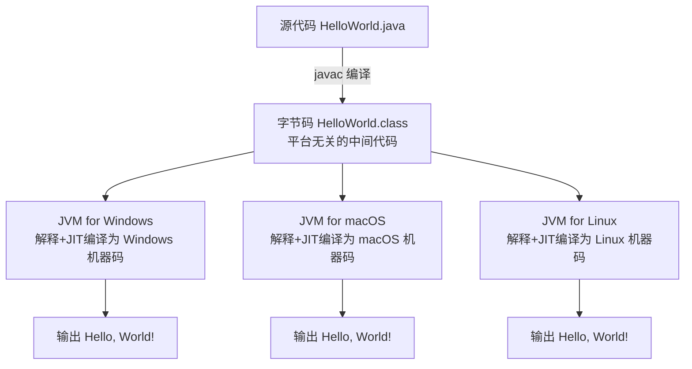
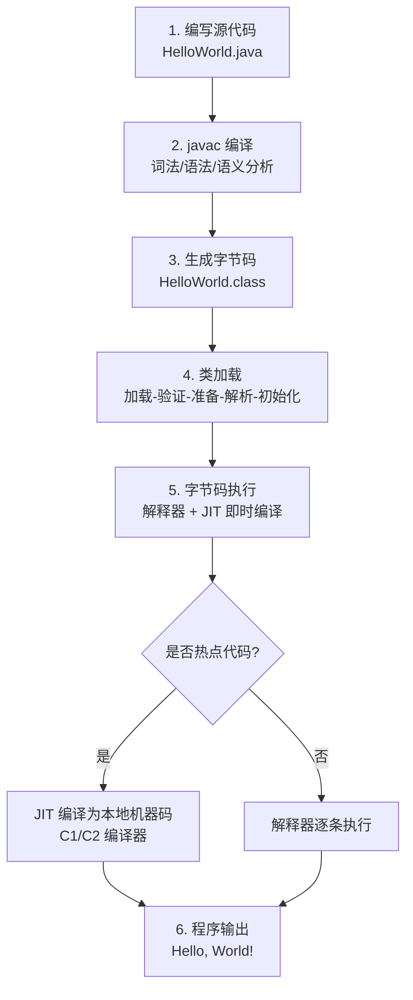
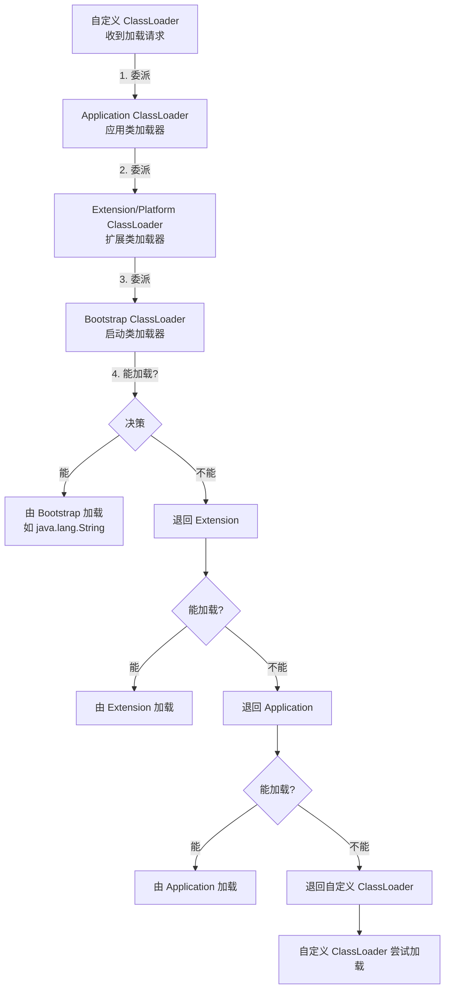

# Java 语言概述

> 学习路线对应：第1周 -- Java 语言核心
> 前置知识：任意编程语言入门经验（Python / JS / C 均可）
> 预计学习时间：1 天

> **视频章节对应**：尚硅谷宋红康《Java零基础入门教程》第01章 -- Java语言概述
> 本章是 Java 学习的起点，帮助学习者建立对 Java 生态的整体认知，完成开发环境搭建，并运行第一个 Java 程序。

---

## 一、核心概念

### 1.1 Java 发展历史

> **生活化类比：编程语言的"代际演进"** —— Java 的版本演进就像汽车换代：Java 1.0 是"初代量产车"（1995，能跑就行），Java 5.0 加装了"涡轮增压和自动挡"（泛型、注解，2004），Java 8 是"混动旗舰版"（Lambda、Stream，2014，至今最畅销），Java 17/21 则是"智能电动旗舰"（虚拟线程、模式匹配，LTS 长期质保）。选版本就像选车，要看"路况"（业务场景）和"售后"（官方支持周期）。

Java 由 Sun Microsystems 公司于 1995 年正式发布，创始人为 James Gosling（詹姆斯·高斯林）。最初命名为 Oak（橡树），后因商标冲突更名为 Java（印度尼西亚爪哇岛产的咖啡名）。

| 时间 | 版本 | 里程碑事件 |
|------|------|-----------|
| 1995.05 | Java 1.0 | 正式发布，提出 "Write Once, Run Anywhere" 理念 |
| 1998.12 | Java 1.2 | 划分为 J2SE（标准版）、J2EE（企业版）、J2ME（微型版）三大平台 |
| 2004.09 | Java 5.0 | 重大更新：泛型、枚举、注解、自动装箱/拆箱、增强 for 循环、可变参数 |
| 2006.11 | Java 6 | Sun 宣布 Java 开源，发布 OpenJDK |
| 2009.04 | - | Oracle 以 74 亿美元收购 Sun Microsystems |
| 2011.07 | Java 7 | 钻石操作符 `<>`、try-with-resources、多异常捕获、switch 支持 String |
| 2014.03 | Java 8（LTS） | **里程碑版本**：Lambda 表达式、Stream API、Optional、新日期时间 API、接口默认方法 |
| 2017.09 | Java 9 | 模块化系统（Project Jigsaw）、JShell 交互式工具、不可变集合工厂方法 |
| 2018.03 | Java 10 | 局部变量类型推断 `var` |
| 2018.09 | Java 11（LTS） | 首个长期支持版（LTS），HTTP Client API、ZGC 垃圾回收器 |
| 2019.09 | Java 13 | 文本块（预览）、Switch 表达式（预览） |
| 2020.09 | Java 15 | 文本块正式版、ZGC 正式版、Sealed Classes（预览） |
| 2021.09 | Java 17（LTS） | **当前主流 LTS**：Sealed Classes、Pattern Matching for switch（预览）、增强的伪随机数生成器 |
| 2022.09 | Java 19 | 虚拟线程（预览）、Record Patterns（预览） |
| 2023.09 | Java 21（LTS） | **最新 LTS**：虚拟线程正式版、Record Patterns、Pattern Matching for switch、String Templates（预览） |

**关键版本选择建议：**
- **学习阶段**：推荐 Java 17 LTS，兼顾稳定性与新特性，企业主流使用
- **新项目开发**：Java 21 LTS，享受虚拟线程等最新特性
- **维护老项目**：Java 8 仍广泛使用，但官方免费支持已结束

> 📖 **参考链接**：
> - [Oracle - Java SE Specifications](https://docs.oracle.com/javase/specs/) -- Java 各版本规范总入口
> - [Oracle - Java Language Specification (JLS) SE 17](https://docs.oracle.com/javase/specs/jls/se17/html/) -- Java 语言规范官方文档
> - [Oracle - Java SE 17 API](https://docs.oracle.com/javase/17/docs/api/) -- Java SE 17 官方 API 文档
> - [Oracle Java SE Support Roadmap](https://www.oracle.com/java/technologies/java-se-support-roadmap.html) -- Oracle 官方版本支持路线图

### 1.2 JDK 版本选择与安装

#### JDK 与 JRE 的区别

> **生活化类比：厨房套装** —— JDK 像是"完整厨房套装"（含灶具、刀具、菜谱书和食材），JRE 是"简化版厨房"（只保留灶具和食材，能做饭但不能研发新菜谱），JVM 则是"灶具本身"（执行炒菜动作的核心）。厨师（开发者）需要 JDK，食客（运行用户）只需 JRE。

```
JDK（Java Development Kit）     -- 开发工具包，包含 JRE + 开发工具
├── JRE（Java Runtime Environment） -- 运行环境，包含 JVM + 核心类库
│   ├── JVM（Java Virtual Machine） -- Java 虚拟机，执行字节码
│   └── Java 核心类库（rt.jar / java.base 模块）
└── 开发工具（javac、java、javadoc、jar 等）
```

**核心关系：JDK > JRE > JVM。** 开发人员安装 JDK 即可，其中已包含 JRE。

> 📖 **参考链接**：
> - [Oracle - Java SE 17 API](https://docs.oracle.com/javase/17/docs/api/) -- JDK 自带类库 API 文档
> - [Oracle - JVM Specification SE 17](https://docs.oracle.com/javase/specs/jvms/se17/html/) -- Java 虚拟机规范

#### 主流 JDK 发行版对比

| 发行版 | 维护方 | 特点 | 推荐场景 |
|--------|--------|------|---------|
| **Oracle JDK** | Oracle | 官方版本，新版需付费用于商业用途 | 个人学习、开发测试 |
| **OpenJDK** | Oracle/社区 | 开源参考实现，Oracle JDK 的基础 | 所有场景 |
| **Adoptium（Eclipse Temurin）** | Eclipse 基金会 | 免费开源，社区驱动，多平台支持 | 生产环境推荐 |
| **Azul Zulu** | Azul | 免费，支持广泛，多平台 | 企业生产环境 |
| **Amazon Corretto** | Amazon | 免费，长期支持，AWS 优化 | AWS 云环境 |
| **Alibaba Dragonwell** | 阿里巴巴 | 免费，淘宝/阿里云大规模验证 | 国内电商场景 |

**学习推荐：** 使用 Adoptium（Eclipse Temurin）或 Oracle JDK 17/21，下载对应操作系统的安装包，一路 Next 安装即可。

> 📖 **参考链接**：
> - [Adoptium - Eclipse Temurin JDK 下载](https://adoptium.net/) -- Eclipse 基金会维护的免费开源 JDK
> - [Oracle - JDK Installation Guide](https://docs.oracle.com/en/java/javase/17/install/overview-jdk-installation.html) -- Oracle 官方 JDK 安装指南

#### Windows 安装步骤

1. 访问 [Adoptium 官网](https://adoptium.net/) 下载对应版本（选择 JDK 17 或 JDK 21，.msi 安装包）
2. 双击运行安装程序，**记住安装路径**（默认为 `C:\Program Files\Eclipse Adoptium\jdk-17.0.0.0-hotspot\`）
3. 安装完成后，配置环境变量（见 1.3 节）

#### macOS 安装步骤

```bash
# 方式一：使用 Homebrew 安装（推荐）
brew install openjdk@17

# 方式二：下载 .pkg 安装包，双击安装
```

#### Linux 安装步骤

```bash
# Ubuntu/Debian
sudo apt update
sudo apt install openjdk-17-jdk

# 验证安装
java -version
javac -version
```

### 1.3 Path 环境变量配置

#### 为什么需要配置 Path？

> **生活化类比：快递员的"送货地址簿"** —— 操作系统就像快递公司，`Path` 环境变量就是"送货地址簿"。当你在终端敲 `java` 命令时，系统会按地址簿（Path）依次翻找每个目录，找到第一个叫 `java.exe` 的就执行。如果地址簿里没有 JDK 的 `bin` 目录，系统就报"查无此人"（不是内部或外部命令）。

在命令行中输入 `javac` 或 `java` 命令时，操作系统需要知道这些可执行文件的位置。Path 环境变量告诉操作系统去哪些目录下查找可执行程序。

#### Windows 配置步骤

**方式一：通过系统属性 GUI 配置（推荐入门使用）**

1. 右键"此电脑" -> "属性" -> "高级系统设置" -> "环境变量"
2. 系统变量中新建（或编辑）`JAVA_HOME`，值为 JDK 安装根目录，例如：
   ```
   C:\Program Files\Eclipse Adoptium\jdk-17.0.0.0-hotspot\
   ```
3. 编辑系统变量 `Path`，新增一条：
   ```
   %JAVA_HOME%\bin
   ```
4. 依次点击"确定"保存，重新打开命令行窗口使其生效

**方式二：通过命令行配置（临时生效）**

```cmd
set JAVA_HOME=C:\Program Files\Eclipse Adoptium\jdk-17.0.0.0-hotspot
set Path=%JAVA_HOME%\bin;%Path%
```

#### macOS / Linux 配置

```bash
# 编辑 shell 配置文件（~/.bashrc 或 ~/.zshrc）
export JAVA_HOME=/usr/lib/jvm/java-17-openjdk
export PATH=$JAVA_HOME/bin:$PATH

# 使配置生效
source ~/.bashrc  # 或 source ~/.zshrc
```

#### 验证配置是否成功

```cmd
java -version
```

正确输出示例：
```
openjdk version "17.0.9" 2023-10-17
OpenJDK Runtime Environment Temurin-17.0.9+9 (build 17.0.9+9)
OpenJDK 64-Bit Server VM Temurin-17.0.9+9 (build 17.0.9+9, mixed mode, sharing)
```

```cmd
javac -version
```

正确输出示例：
```
javac 17.0.9
```

**常见问题排查：**

| 错误提示 | 原因 | 解决方案 |
|---------|------|---------|
| `'java' 不是内部或外部命令` | Path 未配置或配置错误 | 检查 `%JAVA_HOME%\bin` 是否正确添加到 Path 中 |
| `java' 不是内部或外部命令`（已配置 Path） | 命令行窗口未重启 | 关闭并重新打开命令行窗口 |
| 输入 `java` 能找到但版本不对 | Path 中存在多个 JDK，优先级混乱 | 检查 Path 中 JDK 路径的顺序，将需要的版本放在最前面 |

> 📖 **参考链接**：
> - [Oracle - Environment Variables Guide](https://docs.oracle.com/en/java/javase/17/install/installation-jdk-microsoft-windows-platforms.html#GUID-4F47B6E2-A0F3-4A0E-B9D2-6E3D1F0B5B7A) -- Windows 平台 JDK 环境变量配置
> - [Microsoft - Set Environment Variables](https://learn.microsoft.com/windows-server/administration/windows-commands/set) -- Windows `set` 命令官方说明

### 1.4 HelloWorld 编写与执行

#### 编写第一个 Java 程序

```java
// 文件名必须与 public 类名完全一致：HelloWorld.java
public class HelloWorld {
    public static void main(String[] args) {
        System.out.println("Hello, World!");
    }
}
```

#### 编译与运行流程

> **生活化类比：菜谱翻译** —— `.java` 源码像是"中文菜谱"（人能读懂，机器不懂）；`javac` 编译器是"翻译官"，把中文菜谱翻译成"国际通用图示菜谱"（`.class` 字节码，任何安装了对应厨师的厨房都能看懂）；`java` 命令则启动 JVM 这位"厨师长"，按图示菜谱一步步做菜（执行字节码）。

```
源文件（.java） --[javac 编译]--> 字节码文件（.class） --[java 运行]--> JVM 执行
```

```cmd
# 第一步：编译，生成 HelloWorld.class 字节码文件
javac HelloWorld.java

# 第二步：运行（注意：不要加 .class 后缀）
java HelloWorld
```

输出结果：
```
Hello, World!
```

> 📖 **参考链接**：
> - [Oracle - javac 命令行文档](https://docs.oracle.com/en/java/javase/17/docs/specs/man/javac.html) -- Java 编译器官方手册
> - [Oracle - java 命令行文档](https://docs.oracle.com/en/java/javase/17/docs/specs/man/java.html) -- Java 启动器官方手册

#### HelloWorld 程序逐行解析

```java
public class HelloWorld {                          // ① 类声明
    public static void main(String[] args) {       // ② main 方法（程序入口）
        System.out.println("Hello, World!");       // ③ 输出语句
    }
}
```

| 行号 | 关键字 | 含义 |
|------|--------|------|
| ① | `public class` | 声明一个公开的类，类名必须与文件名一致 |
| ② | `public static void main(String[] args)` | Java 程序的入口方法，固定写法，JVM 通过此签名寻找入口 |
| ② | `public` | 访问修饰符，表示该方法可以被外部访问（JVM 需要调用它） |
| ② | `static` | 静态方法，属于类而不属于实例，JVM 无需创建对象即可调用 |
| ② | `void` | 返回值类型，main 方法不返回任何值 |
| ② | `String[] args` | 命令行参数，运行时传入的参数数组 |
| ③ | `System.out.println()` | 标准输出打印并换行，`System` 是 `java.lang` 包下的类 |

#### 常见编译/运行错误

| 错误信息 | 原因 | 解决 |
|---------|------|------|
| `错误: 找不到或无法加载主类 HelloWorld` | 运行时加了 `.class` 后缀；或类名大小写不一致 | 使用 `java HelloWorld`（不加后缀），注意大小写 |
| `错误: 类 HelloWorld 是公共的, 应在名为 HelloWorld.java 的文件中声明` | 文件名与 public 类名不一致 | 确保文件名与 public 类名完全一致（包括大小写） |
| `错误: 找不到符号` | 拼写错误（如 `system` 写成小写，`println` 写错等） | 注意 Java 区分大小写，`System` 首字母大写 |
| `错误: 编码 GBK 的不可映射字符` | 源代码包含中文注释，但编译时使用了 GBK 编码 | 使用 `javac -encoding UTF-8 HelloWorld.java` 指定编码 |

> 📖 **参考链接**：
> - [Oracle - Java 编码与字符集指南](https://docs.oracle.com/en/java/javase/17/intl/character-sets.html) -- Java 国际化字符集官方文档
> - [JLS - Chapter 3. Lexical Structure](https://docs.oracle.com/javase/specs/jls/se17/html/jls-3.html) -- Java 语言规范第 3 章"词法结构"（含标识符、关键字、Unicode）

### 1.5 注释（Comment）

Java 支持三种注释形式：

```java
// 1. 单行注释：以 // 开头，到行尾结束
// 这是一条单行注释

/*
 * 2. 多行注释：以 /* 开头，以 */ 结尾
 * 可以跨越多行
 * 多行注释不能嵌套使用
 */

/**
 * 3. 文档注释（JavaDoc）：以 /** 开头，以 */ 结尾
 * 可以通过 javadoc 工具生成 API 文档
 *
 * @author 作者名
 * @version 1.0
 * @since 2024
 */
public class CommentDemo {
    /**
     * 计算两个整数的和
     * @param a 第一个加数
     * @param b 第二个加数
     * @return 两数之和
     */
    public int add(int a, int b) {
        return a + b;
    }
}
```

**注释的使用原则：**

| 原则 | 说明 |
|------|------|
| **写清楚"为什么"而非"是什么"** | 代码本身已经说明了"是什么"，注释应解释设计意图和业务逻辑 |
| **注释与代码同步更新** | 修改代码时必须同步更新注释，过时的注释比没有注释更危险 |
| **不要用注释美化烂代码** | 如果代码需要大量注释才能理解，优先重构代码本身 |
| **必需的注释场景** | 复杂的业务逻辑、非显而易见的算法、临时的 workaround、TODO/FIXME 标记 |

**文档注释生成 API 文档：**

```cmd
javadoc -d doc -author -version CommentDemo.java
```

> 📖 **参考链接**：
> - [Oracle - javadoc 命令行文档](https://docs.oracle.com/en/java/javase/17/docs/specs/man/javadoc.html) -- javadoc 工具官方手册
> - [Oracle - Javadoc 规范](https://docs.oracle.com/en/java/javase/17/docs/specs/javadoc/doc-comment-spec.html) -- Javadoc 注释规范官方说明

### 1.6 Java 语言特点

> **生活化类比：Java 的"六边形战士"** —— Java 像一位"全能型公务员"：**面向对象**是工作方法（一切按规章办事），**跨平台**是调动能力（中央文件全国通用），**健壮性**是工作严谨（强类型+异常处理=双重审核），**安全性**是廉洁自律（沙箱+字节码校验=反腐机制），**多线程**是同时处理多项任务的能力，**动态性**是终身学习（反射+热部署=不断进修新技能）。

Java 语言的核心设计哲学是 **"简单、面向对象、健壮、安全、跨平台"**。

#### 面向对象

Java 是一门纯粹的面向对象编程语言（OOP），一切都是对象（除基本数据类型外）。核心特性包括封装、继承、多态、抽象。

#### 跨平台性（Write Once, Run Anywhere）

> **生活化类比：PDF 文档的跨平台性** —— 同一份 PDF 在 Windows、macOS、Linux、手机上显示效果完全一致，因为每个平台都有 PDF 阅读器（Acrobat、福昕等）负责"翻译"成该平台的渲染指令。Java 字节码就是"PDF"，JVM 就是"PDF 阅读器"，Write Once Run Anywhere 的本质是"中间格式标准化 + 各平台实现本地化"。

Java 程序经编译后生成字节码（.class 文件），由各平台上的 JVM 解释执行。同一份字节码可以运行在任何安装了 JVM 的平台上。



> 上图展示了 Java 跨平台的核心原理：源代码经 javac 编译后生成平台无关的字节码（.class 文件），不同操作系统上的 JVM 负责将字节码解释或 JIT 编译为本地机器码执行，最终输出一致的结果。这是"Write Once, Run Anywhere"的本质。

#### 健壮性（Robust）

- **强类型语言**：每个变量必须有明确的类型，编译期即可发现类型错误
- **异常处理机制**：try-catch-finally 结构，强制处理或声明受检异常
- **自动垃圾回收（GC）**：无需手动管理内存，避免内存泄漏和悬空指针
- **没有指针**：Java 不暴露内存地址，杜绝了指针操作带来的安全问题

#### 安全性

- **沙箱安全模型**：Java 程序在 JVM 沙箱中运行，限制对本地系统资源的访问
- **字节码校验**：类加载时执行字节码验证，防止恶意代码
- **安全管理器**：可以配置细粒度的安全策略

#### 多线程

Java 语言层面原生支持多线程编程，提供 `Thread` 类、`Runnable` 接口和 `java.util.concurrent` 并发包。

#### 动态性

- **反射机制**：运行时获取类的信息，动态创建对象和调用方法
- **动态类加载**：按需加载类，支持热部署
- **反射与注解结合**：Spring 框架的核心机制

> 📖 **参考链接**：
> - [Oracle - Java 语言特点概述](https://docs.oracle.com/en/java/javase/17/language/java-language-overview.html) -- Java 官方语言特点介绍
> - [JLS - Chapter 1. Introduction](https://docs.oracle.com/javase/specs/jls/se17/html/jls-1.html) -- Java 语言规范第 1 章"概述"
> - [Oracle - Java Security Guide](https://docs.oracle.com/en/java/javase/17/security/java-se-platform-security-architecture.html) -- Java 安全架构官方指南

---

## 二、底层原理

### 2.1 JVM 虚拟机概述

> **生活化类比：JVM 是"虚拟工厂"** —— JVM 是一座建在操作系统之上的"虚拟工厂"：**类加载器子系统**是"原材料入库质检科"（加载、验证、准备、解析、初始化），**运行时数据区**是"车间和仓库"（堆是公共大仓库、栈是每个工人的私人工具箱、方法区是工艺手册档案室），**执行引擎**是"车间主任"（解释器是手工线，JIT 是自动化流水线，GC 是清洁工）。

JVM（Java Virtual Machine）是 Java 实现跨平台的关键。它是一台抽象的计算机，规范定义了类文件格式、运行时数据区、字节码指令集等。

#### JVM 整体架构

```
┌─────────────────────────────────────────────────┐
│                  Java 源文件 (.java)              │
└─────────────────────┬───────────────────────────┘
                      │ javac 编译
                      ▼
┌─────────────────────────────────────────────────┐
│              字节码文件 (.class)                  │
└─────────────────────┬───────────────────────────┘
                      │
                      ▼
┌─────────────────────────────────────────────────┐
│                   JVM 虚拟机                      │
│  ┌───────────────────────────────────────────┐  │
│  │           类加载器子系统                     │  │
│  │   Bootstrap / Extension / Application      │  │
│  │   (加载 -> 验证 -> 准备 -> 解析 -> 初始化)    │  │
│  └───────────────────────────────────────────┘  │
│  ┌───────────────────────────────────────────┐  │
│  │            运行时数据区                      │  │
│  │  ┌──────┐ ┌──────┐ ┌──────────────────┐   │  │
│  │  │ 程序  │ │ Java │ │      堆 (Heap)    │   │  │
│  │  │计数器 │ │虚拟机│ │   (线程共享)      │   │  │
│  │  │(私有) │ │栈(私)│ │                  │   │  │
│  │  └──────┘ └──────┘ └──────────────────┘   │  │
│  │  ┌──────────────────────┐ ┌───────────┐   │  │
│  │  │   方法区 / 元空间      │ │ 本地方法栈 │   │  │
│  │  │  (线程共享, 存类信息)  │ │  (私有)   │   │  │
│  │  └──────────────────────┘ └───────────┘   │  │
│  └───────────────────────────────────────────┘  │
│  ┌───────────────────────────────────────────┐  │
│  │            执行引擎                         │  │
│  │  解释器 / JIT 编译器 / 垃圾回收器           │  │
│  └───────────────────────────────────────────┘  │
└─────────────────────────────────────────────────┘
```

#### 编译与执行流程详解



```
1. 编写源代码     HelloWorld.java
2. 编译（javac）   词法分析 -> 语法分析 -> 语义分析 -> 生成字节码 -> HelloWorld.class
3. 类加载          加载 -> 验证 -> 准备 -> 解析 -> 初始化
4. 字节码执行      解释执行 + JIT 即时编译（热点代码编译为本地机器码）
5. 程序输出        "Hello, World!"
```

> 📖 **参考链接**：
> - [Oracle - JVM Specification SE 17 - Chapter 5. Loading](https://docs.oracle.com/javase/specs/jvms/se17/html/jvms-5.html) -- JVM 规范第 5 章"加载、链接与初始化"
> - [Oracle - JVM Specification SE 17 - Chapter 6. Instruction Set](https://docs.oracle.com/javase/specs/jvms/se17/html/jvms-6.html) -- JVM 字节码指令集

#### JIT（Just-In-Time）即时编译

JVM 并非纯粹的解释执行。对于频繁执行的"热点代码"，JIT 编译器会将其编译为本地机器码，从而大幅提升执行效率。

```
冷代码（执行次数少） --> 解释器执行（启动快）
热点代码（频繁执行） --> JIT 编译为机器码（运行快，C1/C2 编译器）
```

**两种 JIT 编译器模式：**

| 编译器 | 特点 | 适用场景 |
|--------|------|---------|
| **C1（Client Compiler）** | 编译速度快，优化程度较低 | 桌面应用，对启动时间敏感 |
| **C2（Server Compiler）** | 编译速度慢，优化程度高 | 服务端应用，对峰值性能敏感 |

JDK 7+ 默认开启**分层编译**：C1 快速编译 + C2 深度优化。

> 📖 **参考链接**：
> - [Oracle - JIT 编译器指南](https://docs.oracle.com/en/java/javase/17/vm/jit-compiler.html) -- HotSpot JIT 编译器官方说明
> - [OpenJDK - C1/C2 Compiler](https://openjdk.org/groups/hotspot/docs/) -- OpenJDK HotSpot 编译器文档

### 2.2 类加载机制（双亲委派模型）

> **生活化类比：公司请示流程** —— 子加载器像"基层员工"，遇到类加载请求先不擅自处理，而是逐级上报："经理（父加载器），这事您能办吗？"经理办不了再上报："总监，您来？"以此类推到"CEO（Bootstrap 加载器）"。只有上级明确说"超出我职责范围"，下级才自己尝试处理。这样保证了核心 API（如 `java.lang.String`）永远由最高层加载，基层无法伪造篡改。

类加载器接收到类加载请求时，不会立即自己加载，而是将请求委派给父加载器，只有父加载器无法加载时，子加载器才会尝试加载。

```
Bootstrap ClassLoader（启动类加载器 -- 加载 rt.jar / java.base 模块）
    ▲
    │ 委派
    │
Extension / Platform ClassLoader（扩展/平台类加载器 -- 加载 ext / jdk.* 模块）
    ▲
    │ 委派
    │
Application ClassLoader（应用类加载器 -- 加载 classpath 下的类）
    ▲
    │ 委派
    │
自定义 ClassLoader
```

**双亲委派的好处：**
- 避免类的重复加载（同一个类只会被加载一次）
- 保证核心 API 不被篡改（防止自定义 `java.lang.String` 替代 JDK 的 String）



> 上图展示了双亲委派模型的完整流程：类加载请求先逐层向上委派给父加载器，直到顶层的 Bootstrap ClassLoader；若父加载器无法加载，再逐层向下退回由子加载器自行尝试加载。这种机制保证了核心类库不被篡改，同时避免了类的重复加载。

> 📖 **参考链接**：
> - [Oracle - JVM Specification SE 17 - Chapter 5.3. Creation and Loading](https://docs.oracle.com/javase/specs/jvms/se17/html/jvms-5.html#jvms-5.3) -- JVM 规范关于类加载与双亲委派
> - [Oracle - ClassLoader API](https://docs.oracle.com/en/java/javase/17/docs/api/java.base/java/lang/ClassLoader.html) -- ClassLoader 类官方 API 文档

### 2.3 Java 程序为什么能跨平台？

Java 的跨平台并非"编译一次，到处运行"这么简单，而是依赖以下机制：

1. **统一的字节码格式**：javac 编译器将 Java 源码编译为与平台无关的 `.class` 字节码文件
2. **平台相关的 JVM 实现**：各操作系统有对应的 JVM 实现，JVM 负责将字节码翻译为本地机器码执行
3. **统一的 API 规范**：Java 标准类库提供统一的 API 接口，屏蔽底层操作系统差异

**注意：** "跨平台"指的是字节码跨平台，JVM 本身是平台相关的（不同操作系统需要安装对应的 JVM）。

> 📖 **参考链接**：
> - [Oracle - Java 跨平台说明](https://docs.oracle.com/en/java/javase/17/language/java-language-overview.html) -- Java 官方语言概述
> - [Oracle - Java SE 17 Installation](https://docs.oracle.com/en/java/javase/17/install/overview-jdk-installation.html) -- 各平台 JDK 安装指南

---

## 三、实战应用

### 3.1 完整的环境搭建与 HelloWorld 演练

**目标：** 从零开始，完成 JDK 安装、环境配置、编写并运行第一个 Java 程序。

#### 步骤一：下载并安装 JDK

1. 打开 [Adoptium 官网](https://adoptium.net/)，选择 JDK 17 LTS，下载对应操作系统的安装包
2. 运行安装程序，记录安装路径（如 `C:\Program Files\Eclipse Adoptium\jdk-17.0.0.0-hotspot\`）

#### 步骤二：配置环境变量

Windows 系统：
1. 配置 `JAVA_HOME` 系统变量，值为 JDK 安装根目录
2. 在 `Path` 变量中添加 `%JAVA_HOME%\bin`
3. 重新打开命令行，执行 `java -version` 和 `javac -version` 验证

#### 步骤三：编写 HelloWorld

在任意目录下创建文件 `HelloWorld.java`：

```java
/**
 * 我的第一个 Java 程序
 * @author 学习者
 * @version 1.0
 */
public class HelloWorld {
    public static void main(String[] args) {
        // 打印欢迎信息
        System.out.println("Hello, World!");

        // 打印命令行参数
        if (args.length > 0) {
            System.out.println("传入的参数：");
            for (int i = 0; i < args.length; i++) {
                System.out.println("args[" + i + "] = " + args[i]);
            }
        } else {
            System.out.println("没有传入命令行参数");
        }
    }
}
```

#### 步骤四：编译与运行

```cmd
# 编译
javac -encoding UTF-8 HelloWorld.java

# 无参数运行
java HelloWorld

# 带参数运行
java HelloWorld 张三 李四 王五
```

输出示例：
```
Hello, World!
传入的参数：
args[0] = 张三
args[1] = 李四
args[2] = 王五
```

> 📖 **参考链接**：
> - [Oracle - Getting Started with Java](https://docs.oracle.com/en/java/javase/17/getting-started/index.html) -- Java 入门官方指南
> - [Oracle - HelloWorld 示例](https://docs.oracle.com/en/java/javase/17/getting-started/getting-started.html) -- 官方 HelloWorld 教程

### 3.2 常用 JDK 命令行工具速查

| 工具 | 用途 | 示例 |
|------|------|------|
| `javac` | 编译 Java 源文件 | `javac -encoding UTF-8 HelloWorld.java` |
| `java` | 运行 Java 程序 | `java -cp . HelloWorld` |
| `javadoc` | 生成 API 文档 | `javadoc -d doc HelloWorld.java` |
| `jar` | 打包/解压 JAR 包 | `jar cvf app.jar *.class` |
| `javap` | 反编译字节码 | `javap -c HelloWorld.class` |
| `jps` | 查看 Java 进程 | `jps -l` |
| `jstat` | 查看 JVM 统计信息 | `jstat -gc <pid>` |
| `jshell` | Java 交互式命令行（JDK 9+） | `jshell` |

> 📖 **参考链接**：
> - [Oracle - JDK 工具参考](https://docs.oracle.com/en/java/javase/17/docs/specs/man/index.html) -- JDK 17 全部命令行工具官方手册
> - [Oracle - JShell 用户指南](https://docs.oracle.com/en/java/javase/17/jshell/introduction-jshell.html) -- JShell 官方使用指南

### 3.3 JShell 快速实验（JDK 9+）

JShell 是 Java 的 REPL（Read-Eval-Print Loop）工具，适合快速验证代码片段，无需编写完整的类和方法。

```java
// 启动 JShell
jshell

// 在 JShell 中直接执行代码
jshell> System.out.println("Hello, JShell!")
Hello, JShell!

jshell> int sum = 0;
jshell> for (int i = 1; i <= 100; i++) sum += i;
jshell> System.out.println("1+2+...+100 = " + sum)
1+2+...+100 = 5050

jshell> /exit   // 退出 JShell
```

> 📖 **参考链接**：
> - [Oracle - JShell API](https://docs.oracle.com/en/java/javase/17/docs/api/jdk.jshell/module-summary.html) -- JShell API 官方文档
> - [Oracle - Java REPL 工具](https://docs.oracle.com/en/java/javase/17/jshell/) -- JShell 完整文档

---

## 四、常见面试题

### 1. Java 语言的跨平台原理是什么？

**答案要点：**
- Java 源码被编译为与平台无关的字节码（.class 文件）
- 各平台（Windows、Linux、macOS）上有对应的 JVM 实现
- JVM 负责将字节码解释/编译为本地机器码执行
- 同一份字节码可以在任何安装了 JVM 的平台上运行
- 口诀："编译一次，到处运行"，但跨平台的是字节码，JVM 本身是平台相关的

### 2. JDK、JRE、JVM 的区别和联系？

**答案要点：**

| 概念 | 全称 | 包含内容 | 面向用户 |
|------|------|---------|---------|
| JVM | Java Virtual Machine | 字节码执行引擎 | 运行 Java 程序的核心 |
| JRE | Java Runtime Environment | JVM + 核心类库 | 只需要运行 Java 程序的用户 |
| JDK | Java Development Kit | JRE + 开发工具（javac、javadoc、jar 等） | Java 开发人员 |

**关系：** JDK 包含 JRE，JRE 包含 JVM。开发人员安装 JDK 即可。

### 3. 为什么配置 JAVA_HOME 环境变量？

**答案要点：**
- 方便引用：使用 `%JAVA_HOME%` 或 `$JAVA_HOME` 统一引用 JDK 安装路径
- 便于切换：更换 JDK 版本时只需修改 `JAVA_HOME` 的值，无需修改其他引用
- 工具依赖：许多 Java 开发工具（Maven、Gradle、Tomcat、IDEA）依赖 `JAVA_HOME` 定位 JDK
- 最佳实践：`Path` 中使用 `%JAVA_HOME%\bin` 而非硬编码绝对路径

### 4. Java 程序从编写到运行经历了哪些步骤？

**答案要点：**

```
编写源码 (.java)
    -> 编译 (javac)：词法分析、语法分析、语义分析、生成字节码 (.class)
    -> 类加载：加载、验证、准备、解析、初始化
    -> 字节码执行：解释执行 + JIT 即时编译（热点代码编译为本地机器码）
    -> 程序输出
```

### 5. Java 是编译型语言还是解释型语言？

**答案要点：**
- Java 结合了编译和解释两种方式
- 先编译：`.java` 源码经 `javac` 编译为字节码 `.class`
- 后解释：JVM 解释执行字节码（并通过 JIT 编译器将热点代码编译为本地机器码）
- 因此 Java 既是编译型也是解释型，更准确地说是一种"半编译半解释"的语言

### 6. main 方法的签名为什么是固定的？

**答案要点：**

```java
public static void main(String[] args)
```

- `public`：JVM 需要从外部调用此方法，必须是公开的
- `static`：JVM 在类加载后无需创建对象实例即可调用，必须是静态方法
- `void`：程序退出通过 `System.exit()` 或返回值码，main 方法本身不返回数据
- `main`：JVM 规范约定的入口方法名，不能更改
- `String[] args`：接收命令行参数，JVM 会自动传入

---

## 五、避坑指南

| 常见错误 | 现象 | 原因 | 解决方案 |
|---------|------|------|---------|
| 文件名与类名不一致 | `javac` 编译报错 | Java 规定 public 类的类名必须与文件名完全一致（包括大小写） | 确保文件名与 public 类名一致，或使用非 public 类 |
| Java 区分大小写 | 编译报错 `找不到符号` | `System` 写成 `system`、`String` 写成 `string`、`main` 写成 `Main` | 养成严格区分大小写的习惯，Java 是大小写敏感的语言 |
| 中文字符编码问题 | 编译报错 `编码 GBK 的不可映射字符` | 源代码包含中文注释或字符串，javac 默认使用系统编码 | 编译时加 `-encoding UTF-8` 参数；或 IDE 中统一设置 UTF-8 编码 |
| Path 配置后仍无效 | `java` 命令找不到 | 未重启命令行窗口；或 Path 中存在多个 JDK 版本冲突 | 关闭并重新打开命令行；检查 Path 中 JDK 路径的顺序 |
| 运行时加 .class 后缀 | `错误: 找不到或无法加载主类` | `java HelloWorld.class` 是错误写法，`java` 命令的参数是类名而非文件名 | 使用 `java HelloWorld`，不加 `.class` 后缀 |
| 多行注释嵌套 | 编译报错或注释提前结束 | Java 的多行注释 `/* */` 不支持嵌套 | 避免嵌套多行注释；或者用单行注释 `//` 替代内层注释 |
| 混淆 JDK 安装路径 | 多个 JDK 共存，不确定使用的哪个版本 | 安装了多个 JDK，Path 中路径顺序混乱 | 使用 `where java`（Windows）或 `which java`（macOS/Linux）查看实际使用的 java 路径 |

---

## 本章学习自检

完成本章学习后，应该能够：

- [ ] 清晰说出 Java 的发展历史，了解各重要版本（Java 5、8、11、17、21）的关键特性
- [ ] 正确区分 JDK、JRE、JVM 三者的概念和包含关系
- [ ] 独立完成 JDK 的下载安装和 JAVA_HOME / Path 环境变量配置
- [ ] 独立编写 HelloWorld 程序，并成功编译运行
- [ ] 理解 `javac` 编译和 `java` 运行的完整流程
- [ ] 掌握三种注释的写法及使用场景，能够使用 `javadoc` 生成文档
- [ ] 用自己的话解释 Java 跨平台原理（字节码 + JVM）
- [ ] 能说出 Java 语言的主要特点（面向对象、跨平台、健壮、安全、多线程、动态）
- [ ] 了解 JVM 的基本架构（类加载器、运行时数据区、执行引擎）
- [ ] 能够使用 JShell 快速验证简单的 Java 代码片段

---

> **学习导航**：
> - 返回 [学习路线总览](../../README.md)
> - 继续学习：[02-变量与运算符](./02-变量与运算符.md)
> - 本模块其他文件：[08-面向对象与集合框架](./08-面向对象与集合框架.md) | [13-多线程与并发编程](./13-多线程与并发编程.md) | [14-JVM原理与调优](./14-JVM原理与调优.md) | [16-设计模式](./16-设计模式.md) | [17-Java核心笔面试题集](./17-Java核心笔面试题集.md)