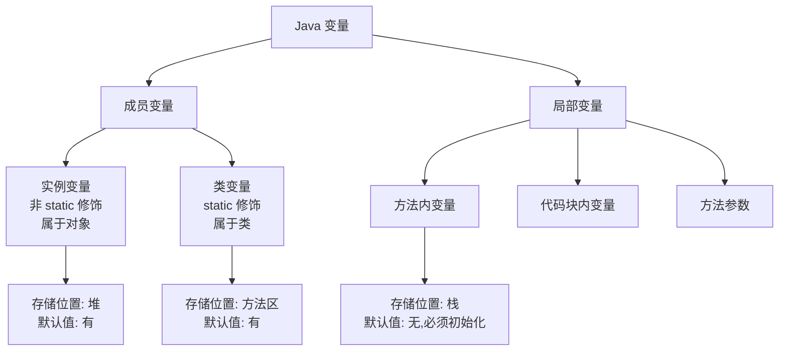

# 变量与运算符

> 学习路线对应：第1周 -- Java 语言核心
> 前置知识：Python/JS 基础语法
> 预计学习时间：1 天
>
> **视频章节对应**：尚硅谷宋红康《Java零基础入门教程》第02章。

## 一、关键字与标识符

### 1.1 关键字

> **生活化类比：法律中的"专用术语"** —— 关键字就像法律中的"原告、被告、上诉、抗诉"等专用术语，普通人不能把这些词当作自己孩子的名字（变量名）。Java 关键字是语言层面的"法律术语"，编译器只认它原本的含义，普通标识符无法占用。

关键字是 Java 语言预定义的保留字，具有特殊含义。

**特点：**
- 所有字母都是小写
- 不能作为变量名、类名、方法名使用

**Java 关键字列表（50个）：**

| 分类 | 关键字 |
|------|--------|
| 访问控制 | `public` `private` `protected` |
| 类、方法修饰 | `abstract` `class` `interface` `enum` `extends` `implements` `final` `static` `native` `strictfp` `synchronized` `volatile` `transient` |
| 程序控制 | `if` `else` `switch` `case` `default` `while` `do` `for` `break` `continue` `return` `try` `catch` `finally` `throw` `throws` `assert` `instanceof` |
| 包相关 | `package` `import` |
| 基本类型 | `boolean` `byte` `char` `short` `int` `long` `float` `double` `void` |
| 变量引用 | `this` `super` `new` |
| 保留字（未使用） | `const` `goto` |

> **注意**：`true`、`false`、`null` 是保留字面量（reserved literal），严格来说不属于关键字，但许多教材将它们一并列出。`const` 和 `goto` 是保留关键字但 Java 未使用。

> 📖 **参考链接**：
> - [JLS - Chapter 3.9. Keywords](https://docs.oracle.com/javase/specs/jls/se17/html/jls-3.html#jls-3.9) -- Java 语言规范第 3.9 节"关键字"
> - [Oracle - Java Tutorial: Variables](https://docs.oracle.com/javase/tutorial/java/nutsandbolts/variables.html) -- Oracle 官方教程"变量"

### 1.2 标识符命名规则

标识符是给变量、类、方法命名的符号。

**必须遵守：**
1. 只能由字母（a-z, A-Z）、数字（0-9）、下划线（`_`）、美元符号（`$`）组成
2. 不能以数字开头
3. 不能是 Java 关键字和保留字
4. 区分大小写

**推荐规范（驼峰命名法）：**
- 类名：大驼峰，每个单词首字母大写 → `HelloWorld` `UserService`
- 变量名、方法名：小驼峰，第一个单词小写，后续单词首字母大写 → `userName` `getUserInfo`
- 常量：全大写，单词间下划线分隔 → `MAX_VALUE` `DEFAULT_PORT`
- 包名：全小写，点分隔 → `com.company.project`

**常见错误示例：**
```java
// 错误：数字开头
int 123abc = 10;

// 错误：包含特殊字符
int a#b = 20;

// 错误：使用关键字
int int = 30;
```

> 📖 **参考链接**：
> - [JLS - Chapter 3.8. Identifiers](https://docs.oracle.com/javase/specs/jls/se17/html/jls-3.html#jls-3.8) -- Java 语言规范第 3.8 节"标识符"
> - [Oracle - Java Naming Conventions](https://www.oracle.com/java/technologies/javase/codeconventions-namingconventions.html) -- Oracle 官方命名规范

## 二、变量的基本概念

### 2.1 变量是什么

> **生活化类比：贴标签的收纳盒** —— 变量就像贴了标签的收纳盒：盒子的"大小和形状"由数据类型决定（`int` 是小号盒子，`double` 是大号盒子），"标签"就是变量名（如 `age`、`price`），盒子里的"东西"就是值。强类型语言意味着每个盒子只能装对应类型的东西，`int` 盒子不能塞字符串。

变量是程序中存储数据的基本单元，在内存中开辟一块空间，用来存放特定类型的数据。

```java
// 数据类型 变量名 = 初始值;
int age = 18;
double price = 99.9;
String name = "张三";
```

### 2.2 变量分类

按声明位置分类：

| 分类 | 位置 | 生命周期 | 默认值 |
|------|------|----------|--------|
| **成员变量（实例变量）** | 类中、方法外 | 对象创建时存在，对象回收后消失 | 有默认值 |
| **静态变量（类变量）** | `static` 修饰，类中方法外 | 类加载时存在，类卸载后消失 | 有默认值 |
| **局部变量** | 方法内、代码块内 | 方法执行时存在，执行完毕销毁 | 没有默认值，必须手动初始化 |



> 上图展示了 Java 变量的分类体系：成员变量（含实例变量和类变量）存储在堆或方法区中且有默认值，局部变量（方法内、代码块内、方法参数）存储在栈中且必须手动初始化。理解变量的存储位置和生命周期是掌握 Java 内存模型的基础。

> 📖 **参考链接**：
> - [JLS - Chapter 4.12. Variables](https://docs.oracle.com/javase/specs/jls/se17/html/jls-4.html#jls-4.12) -- Java 语言规范第 4.12 节"变量"
> - [JLS - Chapter 8.3. Field Declarations](https://docs.oracle.com/javase/specs/jls/se17/html/jls-8.html#jls-8.3) -- 成员变量声明规范
> - [JLS - Chapter 14.4. Local Variable Declarations](https://docs.oracle.com/javase/specs/jls/se17/html/jls-14.html#jls-14.4) -- 局部变量声明规范

## 三、8种基本数据类型

> **生活化类比：八种规格的容器** —— Java 基本类型像厨房里八种规格的量杯：`byte` 是小茶匙（1 字节，装调料），`short` 是小量杯（2 字节），`int` 是中号量杯（4 字节，最常用），`long` 是大桶（8 字节，装大批量液体），`float/double` 是带刻度的量杯（装带小数的液体），`char` 是字符印章（2 字节，刻一个字符），`boolean` 是开关（只有开/关两态）。

Java 是强类型语言，每个变量都必须声明类型。基本数据类型分为四类八种：

### 3.1 基本类型对照表

| 类别 | 类型 | 字节 | 范围 | 默认值 | 适用场景 |
|------|------|------|------|--------|----------|
| **整数型** | `byte` | 1 | -128 ~ 127 | `0` | 字节数据处理、数组 |
| | `short` | 2 | -32768 ~ 32767 | `0` | 很少用 |
| | `int` | 4 | -2<sup>31</sup> ~ 2<sup>31</sup>-1 | `0` | 最常用，一般计数用 |
| | `long` | 8 | -2<sup>63</sup> ~ 2<sup>63</sup>-1 | `0L` | 大数值、时间戳、主键 |
| **浮点型** | `float` | 4 | 单精度 | `0.0f` | 很少用 |
| | `double` | 8 | 双精度 | `0.0` | 最常用，科学计算 |
| **字符型** | `char` | 2 | 0 ~ 65535 | `\u0000` | 存储单个字符 |
| **布尔型** | `boolean` | 1 | `true` / `false` | `false` | 条件判断、逻辑运算 |

> 📖 **参考链接**：
> - [JLS - Chapter 4.2. Primitive Types and Values](https://docs.oracle.com/javase/specs/jls/se17/html/jls-4.html#jls-4.2) -- Java 语言规范第 4.2 节"基本类型与值"
> - [Oracle - Java Tutorial: Primitive Types](https://docs.oracle.com/javase/tutorial/java/nutsandbolts/datatypes.html) -- Oracle 官方教程"基本数据类型"

### 3.2 各类型说明

**整数型：**
```java
byte b = 10;          // 范围 -128 ~ 127
short s = 200;        // 范围 -32768 ~ 32767
int i = 123456;       // 默认整数类型就是 int
long l = 123456789L;  // long 类型要加 L 后缀
```

**浮点型：**
```java
float f = 3.14f;      // float 要加 f 后缀
double d = 3.14;      // 默认浮点类型就是 double

// 注意：浮点数不能精确表示十进制小数，存在精度误差
System.out.println(0.1 + 0.2); // 输出 0.30000000000000004
// 需要精确计算请使用 BigDecimal
```

**字符型：**
```java
char c1 = 'A';        // 单引号包裹一个字符
char c2 = '中';
char c3 = '\u0041';   // Unicode 编码表示，结果是 'A'
char c4 = '\n';        // 转义字符：换行
```

**布尔型：**
```java
boolean flag = true;
boolean isPass = false;

// 注意：Java 中 boolean 不能和 0/1 互相转换，这一点和 C/C++ 不同
if (isPass) {
    // 只有 true 才能进入
}
```

### 3.3 基本类型 vs 引用类型

| 对比项 | 基本类型 | 引用类型 |
|--------|----------|----------|
| 存储位置 | 栈内存直接存储值 | 栈存储地址，堆存储对象 |
| 默认值 | 有默认值（见上表） | null |
| 占用空间 | 固定（1-8字节） | 不固定 |
| 示例 | `int` `double` `boolean` | `String` `数组` `自定义类` |

> 📖 **参考链接**：
> - [JLS - Chapter 4.3. Reference Types and Values](https://docs.oracle.com/javase/specs/jls/se17/html/jls-4.html#jls-4.3) -- Java 语言规范第 4.3 节"引用类型"
> - [Oracle - Java Tutorial: Variables](https://docs.oracle.com/javase/tutorial/java/nutsandbolts/variables.html) -- Oracle 官方教程"变量与类型"

## 四、类型转换

> **生活化类比：水杯倒水** —— 自动类型提升像"小杯水倒进大杯"（`int` → `double`），不会溢出，自然完成；强制类型转换像"大杯水倒进小杯"（`double` → `int`），可能溢出（精度丢失），必须明确告知"我知道会撒，但我就是要倒"（显式强转语法）。

### 4.1 自动类型提升（隐式转换）

当范围小的类型赋值给范围大的类型时，Java 自动完成转换。

**转换规则：**
```
byte → short → int → long → float → double
char → int
```

> 注意：byte/short/char 混合运算时，自动提升为 int。

**示例代码：**
```java
int a = 10;
double b = a;  // int → double，自动提升
System.out.println(b); // 输出 10.0

byte x = 1;
byte y = 2;
// byte + byte → int
int z = x + y;
// 错误：byte result = x + y;
```

**容量排序（容量不是字节数，是表示范围）：**
```
byte(1) < short(2) < int(4) < long(8) < float(4) < double(8)
```
> 奇怪点：float 字节是 4，但范围比 long（8字节）大。

> 📖 **参考链接**：
> - [JLS - Chapter 5.1.2. Widening Primitive Conversion](https://docs.oracle.com/javase/specs/jls/se17/html/jls-5.html#jls-5.1.2) -- Java 语言规范"宽化基本类型转换"
> - [JLS - Chapter 5.1.3. Narrowing Primitive Conversion](https://docs.oracle.com/javase/specs/jls/se17/html/jls-5.html#jls-5.1.3) -- Java 语言规范"窄化基本类型转换"

### 4.2 强制类型转换（显式转换）

当范围大的类型赋值给范围小的类型时，必须强制转换，可能丢失精度。

**语法：** `(目标类型) 变量名`

**示例代码：**
```java
double d = 3.14;
int i = (int) d;  // 强制转换，小数截断
System.out.println(i); // 输出 3

int a = 128;
byte b = (byte) a;
System.out.println(b); // 输出 -128（溢出，二进制截断）
```

**强制转换口诀：**
- 大转小，要强转，精度可能丢，溢出要注意
- 整数转浮点，范围能保住，精度可能丢
- 浮点转整数，小数直接砍，只保留整数

> 📖 **参考链接**：
> - [Oracle - Java Tutorial: Conversions](https://docs.oracle.com/javase/tutorial/java/nutsandbolts/datatypes.html) -- Oracle 官方教程"数据类型转换"
> - [JLS - Chapter 5. Conversions and Contexts](https://docs.oracle.com/javase/specs/jls/se17/html/jls-5.html) -- Java 语言规范第 5 章"转换"

## 五、String 基础使用

> **生活化类比：不可改写的牌匾** —— String 像雕刻在石头上的店名牌匾，一旦刻好就不能修改。要"改名"只能重新刻一块新牌匾（创建新对象），原牌匾原样保留。这就是为什么循环里 `s += i` 性能差：每次都要"刻新牌匾"，而 StringBuilder 像可擦写白板，能原地修改。

String 是引用类型，表示字符串。虽然不是基本类型，但这里提前介绍。

### 5.1 基本语法

```java
// 声明方式
String name = "张三";
String greeting = "Hello, World!";

// 字符串拼接：+ 运算符
String fullName = "张" + "三";
String info = "年龄：" + 18; // "年龄：18"
// 基本类型 + String → 自动转为 String
```

### 5.2 代码示例

```java
public class StringDemo {
    public static void main(String[] args) {
        int age = 18;
        String result = "我今年" + age + "岁了";
        System.out.println(result);

        // 运算优先级问题
        System.out.println(1 + 2 + "3");   // "33" → 先算 1+2
        System.out.println("1" + 2 + 3);   // "123" → 从左到右拼接
    }
}
```

输出：
```
我今年18岁了
33
123
```

> 📖 **参考链接**：
> - [Oracle - String 类 API](https://docs.oracle.com/en/java/javase/17/docs/api/java.base/java/lang/String.html) -- String 类官方 API 文档
> - [JLS - Chapter 3.10.5. String Literals](https://docs.oracle.com/javase/specs/jls/se17/html/jls-3.html#jls-3.10.5) -- Java 语言规范"字符串字面量"

## 六、进制转换

### 6.1 常见进制

| 进制 | 前缀 | 示例 |
|------|------|------|
| 十进制 | 无前缀 | `int a = 10;` |
| 二进制 | `0b` | `int a = 0b10;` → 十进制 2 |
| 八进制 | `0` | `int a = 010;` → 十进制 8 |
| 十六进制 | `0x` | `int a = 0x10;` → 十进制 16 |

### 6.2 进制快速换算

- 二进制 → 十进制：每一位乘以 2^n 累加
- 十进制 → 二进制：除 2 取余，逆序排列

**技巧：**
- 1 字节 = 8 位二进制
- 一个十六进制位对应 4 个二进制位
- 一个八进制位对应 3 个二进制位

### 6.3 原码、反码、补码

> **生活化类比：账本的正负记法** —— 原码像"金额 + 红蓝章"（正数蓝章、负数红章），反码像"红章时把金额数字逐位取反"（9 → 0，0 → 9），补码像"红章金额取反后再加 1 元"。计算机采用补码存储是为了让加减法共用同一套电路：`5 + (-3)` 等价于 `5 + 补码形式的 -3`，无需单独的减法器。

Java 中整数使用**补码**存储：

- 正数：原码 = 反码 = 补码
- 负数：反码 = 原码符号位不变，其余取反；补码 = 反码 + 1
- 符号位：最高位表示符号，0 表示正，1 表示负

> 📖 **参考链接**：
> - [JLS - Chapter 4.2.1. Integral Types and Values](https://docs.oracle.com/javase/specs/jls/se17/html/jls-4.html#jls-4.2.1) -- Java 语言规范"整型类型与值"
> - [Oracle - Integer 类 API](https://docs.oracle.com/en/java/javase/17/docs/api/java.base/java/lang/Integer.html) -- Integer 类官方 API（含进制转换方法）

## 七、各种运算符

> **生活化类比：运算符的工具箱** —— 算术运算符像"计算器"（加减乘除），赋值运算符像"快递签收"（把右边的值交给左边的变量），比较运算符像"裁判"（只回答是/否），逻辑运算符像"门卫组合判断"（`&&` 像"两个门卫都点头才放行"，`||` 像"任一门卫点头就放行"），位运算符像"工程图纸"（直接操作二进制位），三目运算符像"分叉路口的指示牌"（条件真走这边，假走那边）。

### 7.1 运算符分类

| 分类 | 运算符 |
|------|--------|
| 算术运算符 | `+` `-` `*` `/` `%` `++` `--` |
| 赋值运算符 | `=` `+=` `-=` `*=` `/=` `%=` |
| 比较运算符 | `>` `<` `>=` `<=` `==` `!=` |
| 逻辑运算符 | `&` `|` `!` `&&` `||` `^` |
| 位运算符 | `&` `|` `^` `~` `<<` `>>` `>>>` |
| 条件运算符 | `?:` |

### 7.2 算术运算符重点

> **生活化类比：自增前后置** —— `++a` 像"先给商品贴新价签再卖"（先变后用），`a++` 像"先按老价签卖出再换新价签"（先用后变）。`i = i++` 的诡异结果像"店员贴完新价签后又把老价签贴回去"：本意是想涨价，结果还是原价。

**除法和取模：**
```java
System.out.println(5 / 2);   // 2 → 整数除法截断小数
System.out.println(5 / 2.0); // 2.5 → 有浮点数参与，结果是浮点
System.out.println(5 % 2);   // 1 → 取模（余数）
```

**自增自减：**
```java
// 前置：先运算，后使用
int a = 10;
int b = ++a;
System.out.println(a); // 11
System.out.println(b); // 11

// 后置：先使用，后运算
int c = 10;
int d = c++;
System.out.println(c); // 11
System.out.println(d); // 10

// 练习题
int i = 1;
i = i++;
System.out.println(i); // 结果是 1，理解底层栈操作
```

> 📖 **参考链接**：
> - [JLS - Chapter 15.15.1. Prefix Increment Operator ++](https://docs.oracle.com/javase/specs/jls/se17/html/jls-15.html#jls-15.15.1) -- Java 语言规范"前缀自增"
> - [JLS - Chapter 15.14.1. Postfix Increment Operator ++](https://docs.oracle.com/javase/specs/jls/se17/html/jls-15.html#jls-15.14.1) -- Java 语言规范"后缀自增"

### 7.3 赋值运算符

```java
int a = 10;
a += 5; // a = a + 5 → 15
a -= 3; // 12
a *= 2; // 24
// += 等复合赋值不会改变变量类型
byte b = 10;
b += 20; // 正确，自动强制转换
// b = b + 20; // 错误，结果是 int，不能直接赋给 byte
```

> 📖 **参考链接**：
> - [JLS - Chapter 15.26.2. Compound Assignment Operators](https://docs.oracle.com/javase/specs/jls/se17/html/jls-15.html#jls-15.26.2) -- Java 语言规范"复合赋值运算符"
> - [JLS - Chapter 5.1.3. Narrowing Primitive Conversion](https://docs.oracle.com/javase/specs/jls/se17/html/jls-5.html#jls-5.1.3) -- 复合赋值中的隐式窄化转换

### 7.4 比较运算符

- `==` 判断是否相等，`!=` 判断是否不等
- 基本类型比较**值**，引用类型比较**地址**

```java
int a = 10;
int b = 10;
System.out.println(a == b); // true

String s1 = new String("abc");
String s2 = new String("abc");
System.out.println(s1 == s2); // false（不同对象，地址不同）
```

> 📖 **参考链接**：
> - [JLS - Chapter 15.21. Equality Operators](https://docs.oracle.com/javase/specs/jls/se17/html/jls-15.html#jls-15.21) -- Java 语言规范"相等运算符 == 和 !="
> - [Oracle - Object.equals API](https://docs.oracle.com/en/java/javase/17/docs/api/java.base/java/lang/Object.html#equals(java.lang.Object)) -- Object.equals 官方 API

### 7.5 逻辑运算符

| 运算符 | 名称 | 说明 |
|--------|------|------|
| `&&` | 短路与 | 两边都真才真，左边假则右边不执行 |
| `||` | 短路或 | 一边真就真，左边真则右边不执行 |
| `&` | 非短路与 | 无论结果如何，两边都执行 |
| `|` | 非短路或 | 无论结果如何，两边都执行 |
| `!` | 逻辑非 | 取反 |
| `^` | 异或 | 不同为真，相同为假 |

**短路特性示例：**
```java
int a = 10;
boolean result = (a > 20) && (a++ < 20);
System.out.println(result); // false
System.out.println(a);      // 10 → 右边 a++ 没有执行（短路）
```

> 开发中基本只用 `&&` `||` `!`，几乎不用 `&` `|`。

> 📖 **参考链接**：
> - [JLS - Chapter 15.23. Conditional-And Operator &&](https://docs.oracle.com/javase/specs/jls/se17/html/jls-15.html#jls-15.23) -- Java 语言规范"条件与 &&"
> - [JLS - Chapter 15.24. Conditional-Or Operator ||](https://docs.oracle.com/javase/specs/jls/se17/html/jls-15.html#jls-15.24) -- Java 语言规范"条件或 ||"

### 7.6 位运算符

位运算直接操作二进制位，速度快：

| 运算符 | 名称 | 说明 |
|--------|------|------|
| `&` | 与 | 同为 1 才 1 |
| `|` | 或 | 有一个 1 就是 1 |
| `^` | 异或 | 不同是 1 |
| `~` | 取反 | 0 变 1，1 变 0 |
| `<<` | 左移 | 左移 n 位 = 乘以 2^n |
| `>>` | 右移 | 右移 n 位 = 除以 2^n，符号位不变 |
| `>>>` | 无符号右移 | 右移后高位补 0 |

**技巧：**
```java
System.out.println(2 << 1); // 4 → 等价 2 * 2
System.out.println(8 >> 2); // 2 → 等价 8 / 4
// 对 2 的幂运算，位运算比乘除更快
```

> 📖 **参考链接**：
> - [JLS - Chapter 15.19. Shift Operators](https://docs.oracle.com/javase/specs/jls/se17/html/jls-15.html#jls-15.19) -- Java 语言规范"位移运算符"
> - [JLS - Chapter 15.22. Integer Bitwise Operators](https://docs.oracle.com/javase/specs/jls/se17/html/jls-15.html#jls-15.22) -- Java 语言规范"整数位运算符"

### 7.7 条件运算符（三目）

**语法：**
```
条件表达式 ? 表达式1 : 表达式2
```
- 条件为 true，返回表达式1
- 条件为 false，返回表达式2

**示例：**
```java
int a = 10;
int b = 20;
int max = a > b ? a : b;
System.out.println(max); // 20

// 求三个数最大值
int x = 10, y = 20, z = 15;
int max2 = x > y ? (x > z ? x : z) : (y > z ? y : z);
System.out.println(max2); // 20
```

> 📖 **参考链接**：
> - [JLS - Chapter 15.25. Conditional Operator ? :](https://docs.oracle.com/javase/specs/jls/se17/html/jls-15.html#jls-15.25) -- Java 语言规范"条件运算符 ?:"

## 八、运算符优先级

优先级从高到低（只需记重点）：

| 优先级 | 运算符 | 结合性 |
|--------|--------|--------|
| 1 | `()` 括号 | 从左到右 |
| 2 | `!` `~` `++` `--` | 从右到左 |
| 3 | `*` `/` `%` | 从左到右 |
| 4 | `+` `-` | 从左到右 |
| 5 | `<<` `>>` `>>>` | 从左到右 |
| 6 | `<` `<=` `>` `>=` | 从左到右 |
| 7 | `==` `!=` | 从左到右 |
| 8 | `&` | 从左到右 |
| 9 | `^` | 从左到右 |
| 10 | `|` | 从左到右 |
| 11 | `&&` | 从左到右 |
| 12 | `||` | 从左到右 |
| 13 | `?:` | 从右到左 |
| 14 | `=` `+=` 等赋值运算符 | 从右到左 |

**口诀：**
- 括号最高，单目高于双目
- 算术 > 位移 > 比较 > 位运算 > 逻辑 > 三目 > 赋值
- 不确定就加括号！不要赌优先级

> 📖 **参考链接**：
> - [JLS - Chapter 15. Expressions](https://docs.oracle.com/javase/specs/jls/se17/html/jls-15.html) -- Java 语言规范第 15 章"表达式"（含完整运算符优先级）
> - [Oracle - Java Tutorial: Operators](https://docs.oracle.com/javase/tutorial/java/nutsandbolts/operators.html) -- Oracle 官方教程"运算符"

## 九、完整代码示例

```java
/**
 * 变量与运算符综合示例
 */
public class VariableAndOperatorDemo {
    public static void main(String[] args) {
        // 1. 八种基本类型声明
        byte b = 10;
        short s = 20;
        int i = 30;
        long l = 40L;
        float f = 3.14f;
        double d = 2.718;
        char c = 'A';
        boolean flag = true;

        System.out.println("===== 1. 基本类型 =====");
        System.out.println("byte = " + b);
        System.out.println("short = " + s);
        System.out.println("int = " + i);
        System.out.println("long = " + l);
        System.out.println("float = " + f);
        System.out.println("double = " + d);
        System.out.println("char = " + c);
        System.out.println("boolean = " + flag);

        // 2. 自动类型提升
        System.out.println("\n===== 2. 自动类型提升 =====");
        int a1 = 100;
        double d1 = a1;
        System.out.println("int " + a1 + " -> double " + d1);

        byte b1 = 1;
        byte b2 = 2;
        int sum = b1 + b2; // byte+byte -> int
        System.out.println("1 + 2 = " + sum);

        // 3. 强制类型转换
        System.out.println("\n===== 3. 强制类型转换 =====");
        double d2 = 3.99;
        int i2 = (int) d2;
        System.out.println(d2 + " 强制转 int = " + i2 + "（小数截断）");

        // 4. String 拼接
        System.out.println("\n===== 4. String 拼接 =====");
        int age = 25;
        String name = "张三";
        String intro = "我叫" + name + "，今年" + age + "岁";
        System.out.println(intro);

        // 5. 自增自减
        System.out.println("\n===== 5. 自增自减 =====");
        int x = 5;
        System.out.println("x++ 输出：" + x++);   // 5
        System.out.println("x 现在：" + x);        // 6
        System.out.println("++x 输出：" + ++x);   // 7

        // 6. 逻辑运算符短路特性
        System.out.println("\n===== 6. 短路特性 =====");
        int m = 10;
        int n = 10;
        boolean res = (m > 100) && (n++ > 0);
        System.out.println("结果：" + res);
        System.out.println("m = " + m + ", n = " + n); // n 还是 10，右边没执行

        // 7. 位运算
        System.out.println("\n===== 7. 位运算 =====");
        System.out.println("2 << 1 = " + (2 << 1));  // 4 = 2 * 2
        System.out.println("8 >> 2 = " + (8 >> 2));  // 2 = 8 / 4

        // 8. 三目运算符求最大值
        System.out.println("\n===== 8. 三目运算符 =====");
        int p = 15, q = 23, r = 18;
        int maxVal = p > q ? (p > r ? p : r) : (q > r ? q : r);
        System.out.println("最大值：" + maxVal);
    }
}
```

**编译运行输出：**
```
===== 1. 基本类型 =====
byte = 10
short = 20
int = 30
long = 40
float = 3.14
double = 2.718
char = A
boolean = true

===== 2. 自动类型提升 =====
int 100 -> double 100.0
1 + 2 = 3

===== 3. 强制类型转换 =====
3.99 强制转 int = 3（小数截断）

===== 4. String 拼接 =====
我叫张三，今年25岁

===== 5. 自增自减 =====
x++ 输出：5
x 现在：6
++x 输出：7

===== 6. 短路特性 =====
结果：false
m = 10, n = 10

===== 7. 位运算 =====
2 << 1 = 4
8 >> 2 = 2

===== 8. 三目运算符 =====
最大值：23
```

> 📖 **参考链接**：
> - [Oracle - Java Tutorial: Variables and Operators](https://docs.oracle.com/javase/tutorial/java/nutsandbolts/index.html) -- Oracle 官方教程"变量与运算符"
> - [Oracle - Java SE 17 API - java.lang](https://docs.oracle.com/en/java/javase/17/docs/api/java.base/java/lang/package-summary.html) -- java.lang 包 API（含 Integer、Double、String 等）

## 本章学习自检

完成本章学习后，应该能够：
- [ ] 说出 Java 8种基本数据类型的名称、字节数、范围、默认值
- [ ] 理解自动类型提升规则，清楚为什么 `byte + byte` 结果是 `int`
- [ ] 掌握强制类型转换的语法，知道可能丢失精度的场景
- [ ] 区分 `&&` 和 `&` 的区别，理解短路特性
- [ ] 说出运算符优先级大致顺序，会用括号改变优先级
- [ ] 独立编写包含变量声明、各种运算的完整程序

---

> **学习导航**：
> - 返回 [学习路线总览](../../README.md)
> - 下一章节：[03-流程控制语句](./03-流程控制语句.md)
