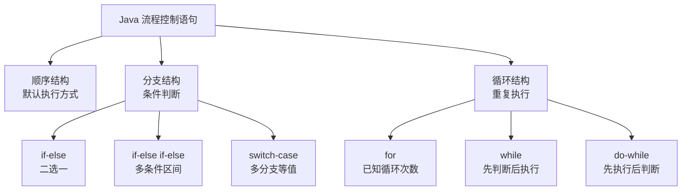
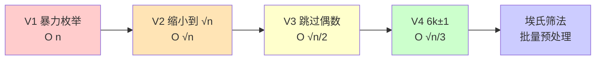
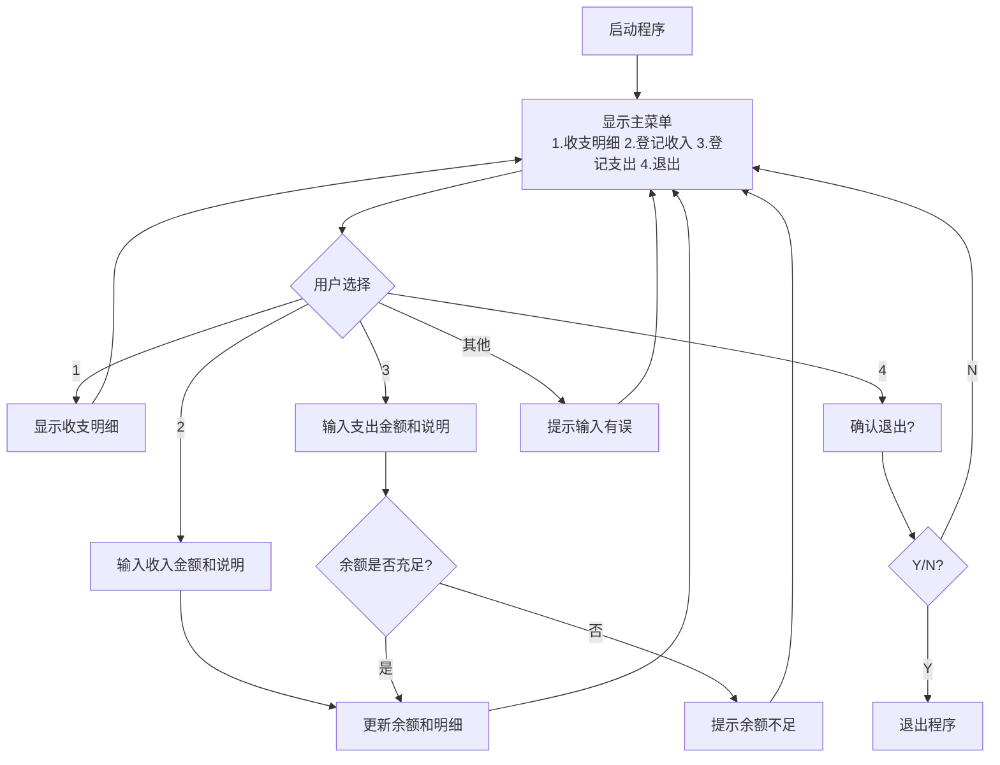

# 流程控制语句

> 学习路线对应：第1周 -- Java 语言核心
> 前置知识：Java 基本语法（变量、数据类型、运算符）
> 预计学习时间：2-3 天

> **视频章节对应**：尚硅谷宋红康《Java零基础入门教程》第03章-流程控制语句。本章内容涵盖条件判断、循环结构、循环控制及实战项目（谷粒记账），是 Java 编程的核心基础。

## 一、核心概念

### 1.1 流程控制全景

> **生活化类比：导航路线选择** —— 顺序结构像"直线行驶"（一条道走到黑），分支结构像"路口红绿灯/岔路口"（根据信号或路况选择走哪条），循环结构像"绕环岛跑圈"（重复执行直到达到目标圈数或满足退出条件）。

Java 流程控制语句分为三大类：



```
流程控制语句
├── 顺序结构（默认执行方式）
├── 分支结构（条件判断）
│   ├── if-else
│   ├── if-else if-else（多条件）
│   └── switch-case（多分支）
└── 循环结构（重复执行）
    ├── for（已知循环次数）
    ├── while（先判断后执行）
    └── do-while（先执行后判断）
```

### 1.2 分支结构对比

| 结构 | 适用场景 | 判断条件 | 穿透性 |
|------|---------|---------|--------|
| **if-else** | 二选一或区间判断 | `boolean` 表达式 | 无 |
| **if-else if-else** | 多条件区间判断 | 多个 `boolean` 表达式 | 无 |
| **switch-case** | 等值判断（离散值） | `byte/short/char/int/String/enum` | 有（需用 `break` 阻断） |

> 📖 **参考链接**：
> - [JLS - Chapter 14.9. The if Statement](https://docs.oracle.com/javase/specs/jls/se17/html/jls-14.html#jls-14.9) -- Java 语言规范"if 语句"
> - [JLS - Chapter 14.11. The switch Statement](https://docs.oracle.com/javase/specs/jls/se17/html/jls-14.html#jls-14.11) -- Java 语言规范"switch 语句"

### 1.3 循环结构对比

| 结构 | 执行特点 | 适用场景 | 最少执行次数 |
|------|---------|---------|------------|
| **for** | 初始化 -> 条件判断 -> 执行体 -> 迭代 | 明确循环次数 | 0 次 |
| **while** | 条件判断 -> 执行体 | 循环次数不确定 | 0 次 |
| **do-while** | 执行体 -> 条件判断 | 至少执行一次 | 1 次 |

> 📖 **参考链接**：
> - [JLS - Chapter 14.14. The for Statement](https://docs.oracle.com/javase/specs/jls/se17/html/jls-14.html#jls-14.14) -- Java 语言规范"for 语句"
> - [JLS - Chapter 14.12. The while Statement](https://docs.oracle.com/javase/specs/jls/se17/html/jls-14.html#jls-14.12) -- Java 语言规范"while 语句"
> - [JLS - Chapter 14.13. The do Statement](https://docs.oracle.com/javase/specs/jls/se17/html/jls-14.html#jls-14.13) -- Java 语言规范"do-while 语句"

---

## 二、底层原理

### 2.1 if-else 分支预测与性能优化

> **生活化类比：高速收费站的车道预判** —— 现代 CPU 的分支预测像收费站的"ETC 车道预判员"：根据历史规律猜测下一辆车走 ETC 还是人工车道，提前放行对应车道的车。猜对了车流顺畅（流水线不停），猜错了要把错放的车倒回去重排（流水线清空重建），代价巨大。所以代码里应把"高频路径"放在 if 主分支，让预判员更容易猜对。

#### 分支预测（Branch Prediction）

现代 CPU 使用分支预测器（Branch Predictor）来猜测 `if-else` 的执行路径。当预测正确时，指令流水线顺畅执行；预测错误时，流水线需要清空重建，导致性能损失。

```java
// 反例：数据随机，分支预测失败率高
for (int i = 0; i < 10000000; i++) {
    if (randomArray[i] > 128) {
        sum += randomArray[i];
    }
}

// 正例：先排序，分支预测成功率大幅提升
Arrays.sort(array);
for (int i = 0; i < 10000000; i++) {
    if (array[i] > 128) {
        sum += array[i];
    }
}
// 排序后分支预测正确率接近 100%，性能提升 3-6 倍
```

**优化建议：**
- 将最可能命中的条件放在 `if` 分支（而非 `else`）
- 将高频路径放在前面，低频路径放在后面
- 对于数据驱动的分支，考虑先排序再处理

#### 短路求值（Short-Circuit Evaluation）

```java
// 短路求值：将开销小的条件或更可能为 false 的条件放在前面
if (fastCheck && expensiveCheck) { ... }  // fastCheck 为 false 时，expensiveCheck 短路

// 条件顺序优化
if (user != null && user.getAge() > 18) { ... }  // 先判空，防止 NPE
```

> 📖 **参考链接**：
> - [JLS - Chapter 15.23. Conditional-And Operator &&](https://docs.oracle.com/javase/specs/jls/se17/html/jls-15.html#jls-15.23) -- Java 语言规范"短路求值"
> - [Oracle - Java Performance Guide](https://docs.oracle.com/en/java/javase/17/performance/java-virtual-machine-performance-enhancements.html) -- JVM 性能优化指南

### 2.2 switch-case 底层实现

#### JDK 7 之前：tableswitch 与 lookupswitch

```java
// 编译后生成两种字节码指令之一

// tableswitch（连续值）：O(1) 跳转表
// 当 case 值连续或接近连续时，编译器生成 tableswitch
// 直接通过偏移量跳转，性能最优
switch (n) {
    case 1: ...   // 跳转表索引 0
    case 2: ...   // 跳转表索引 1
    case 3: ...   // 跳转表索引 2
}

// lookupswitch（稀疏值）：O(log n) 二分查找
// 当 case 值离散分布时，编译器生成 lookupswitch
// 对排序后的 case 值进行二分查找
switch (n) {
    case 1:    ...
    case 100:  ...
    case 1000: ...
}
```

#### JDK 14+：switch 表达式增强

```java
// 传统写法（需要 break）
switch (day) {
    case MONDAY:    result = "工作日"; break;
    case SATURDAY:  result = "周末";   break;
    default:        result = "未知";
}

// JDK 14+ 箭头语法（无穿透，更安全）
String result = switch (day) {
    case MONDAY, TUESDAY, WEDNESDAY, THURSDAY, FRIDAY -> "工作日";
    case SATURDAY, SUNDAY -> "周末";
    // default 分支在覆盖所有枚举值时可不写
};

// JDK 14+ yield 返回值
int numLetters = switch (day) {
    case MONDAY, FRIDAY, SUNDAY -> 6;
    case TUESDAY                -> 7;
    default -> {
        int len = day.toString().length();
        yield len;  // 使用 yield 返回复杂表达式的结果
    }
};
```

> 📖 **参考链接**：
> - [JLS - Chapter 14.11.1. Switch Blocks](https://docs.oracle.com/javase/specs/jls/se17/html/jls-14.html#jls-14.11.1) -- Java 语言规范"switch 块"
> - [JLS - Chapter 15.28. Switch Expressions](https://docs.oracle.com/javase/specs/jls/se17/html/jls-15.html#jls-15.28) -- Java 语言规范"switch 表达式"
> - [Oracle - JDK 14 Switch Expressions](https://docs.oracle.com/en/java/javase/17/language/switch-expressions.html) -- JDK 14+ switch 表达式官方说明

### 2.3 for 循环的底层优化

#### 循环展开（Loop Unrolling）

JIT 编译器（C2）会在运行时对热点循环进行展开优化，减少循环控制开销。

```java
// 原始写法
for (int i = 0; i < n; i++) {
    sum += array[i];
}

// JIT 可能展开为（伪代码）
for (int i = 0; i < n - 3; i += 4) {
    sum += array[i] + array[i+1] + array[i+2] + array[i+3];
}
// 处理剩余元素...
```

#### 循环不变式外提（Loop Invariant Code Motion）

```java
// 反例：每次循环都计算不变的表达式
for (int i = 0; i < list.size(); i++) { ... }       // size() 每次调用
for (int i = 0; i < 1000000; i++) {
    double x = Math.PI * 2;  // 每次循环都计算
}

// 正例：将不变的计算移出循环
int size = list.size();                              // 只调用一次
for (int i = 0; i < size; i++) { ... }
double TWO_PI = Math.PI * 2;
for (int i = 0; i < 1000000; i++) {
    double x = TWO_PI;
}
```

#### 遍历方式性能对比

```java
// 方式一：普通 for（索引遍历）- 对 ArrayList 最优
for (int i = 0; i < list.size(); i++) {
    String s = list.get(i);  // ArrayList: O(1), LinkedList: O(n) 灾难
}

// 方式二：增强 for（foreach）- 对数组和所有集合通用
for (String s : list) {
    // 编译后等价于迭代器，对 ArrayList 和 LinkedList 都适配
}

// 方式三：迭代器 - 适合需要删除元素的场景
Iterator<String> it = list.iterator();
while (it.hasNext()) {
    String s = it.next();
    if (shouldRemove(s)) it.remove();  // 安全删除
}
```

| 遍历方式 | ArrayList | LinkedList | 适用场景 |
|---------|-----------|------------|---------|
| 普通 for `get(i)` | O(1) | O(n) | 仅 ArrayList |
| 增强 for | O(1) | O(1) | 通用（推荐） |
| 迭代器 | O(1) | O(1) | 需要删除元素 |

> 📖 **参考链接**：
> - [Oracle - Iterator API](https://docs.oracle.com/en/java/javase/17/docs/api/java.base/java/util/Iterator.html) -- Iterator 接口官方 API
> - [Oracle - Java Collections Framework](https://docs.oracle.com/en/java/javase/17/docs/api/java.base/java/util/package-summary.html) -- Java 集合框架官方文档

### 2.4 break 与 continue 的标签用法

```java
// 不带标签：只跳出当前层循环
for (int i = 0; i < 5; i++) {
    for (int j = 0; j < 5; j++) {
        if (j == 2) break;     // 只跳出内层循环
        if (i == 3) continue;  // 只跳过内层当前迭代
    }
}

// 带标签：跳出指定层循环
outer:
for (int i = 0; i < 5; i++) {
    for (int j = 0; j < 5; j++) {
        if (i * j > 10) {
            break outer;  // 直接跳出外层循环
        }
    }
}
```

**标签的本质：** 标签（label）在编译后对应一个字节码偏移量，`break label` 和 `continue label` 本质上是跳转到指定位置的 `goto` 指令。Java 保留了 `goto` 作为保留字但未实现，标签机制是 `goto` 的受限替代方案。

> 📖 **参考链接**：
> - [JLS - Chapter 14.7. Labeled Statements](https://docs.oracle.com/javase/specs/jls/se17/html/jls-14.html#jls-14.7) -- Java 语言规范"标签语句"
> - [JLS - Chapter 14.15. The break Statement](https://docs.oracle.com/javase/specs/jls/se17/html/jls-14.html#jls-14.15) -- Java 语言规范"break 语句"
> - [JLS - Chapter 14.16. The continue Statement](https://docs.oracle.com/javase/specs/jls/se17/html/jls-14.html#jls-14.16) -- Java 语言规范"continue 语句"

---

## 三、实战应用

### 3.1 Scanner 键盘输入

> **生活化类比：餐厅服务员点单** —— Scanner 像餐厅服务员：`nextInt()` 像"问几号桌"，`next()` 像"问要点什么菜（按空格分隔）"，`nextLine()` 像"听客人一口气说完所有要求（按回车结束）"。`nextInt()` 后接 `nextLine()` 经常读不到东西，就像服务员问完桌号后没"清空缓存"，把客人刚才的回车键当成了下一句回答。

```java
import java.util.Scanner;

public class ScannerDemo {
    public static void main(String[] args) {
        Scanner scanner = new Scanner(System.in);

        // 基本类型读取
        System.out.print("请输入姓名：");
        String name = scanner.next();          // 读取字符串（空格分隔）

        System.out.print("请输入年龄：");
        int age = scanner.nextInt();           // 读取整数

        System.out.print("请输入身高（米）：");
        double height = scanner.nextDouble();  // 读取浮点数

        System.out.print("请输入性别（男/女）：");
        String gender = scanner.next();

        // 注意：nextLine() 会读取上一行剩余的换行符
        scanner.nextLine();  // 消费掉 nextInt() 留下的换行符

        System.out.print("请输入备注：");
        String remark = scanner.nextLine();    // 读取整行

        System.out.println("姓名：" + name + "，年龄：" + age);

        scanner.close();  // 释放资源
    }
}
```

**Scanner 常见陷阱：**

| 问题 | 原因 | 解决方案 |
|------|------|---------|
| `nextInt()` 后 `nextLine()` 读不到数据 | `nextInt()` 未消费换行符 | 在 `nextLine()` 前额外调用一次 `nextLine()` 消费换行符 |
| `next()` 不能读取带空格的字符串 | `next()` 以空白字符为分隔符 | 使用 `nextLine()` 读取整行 |
| 忘记关闭 Scanner | 资源泄漏 | 使用 `try-with-resources` 或在 finally 中关闭 |

> 📖 **参考链接**：
> - [Oracle - Scanner API](https://docs.oracle.com/en/java/javase/17/docs/api/java.base/java/util/Scanner.html) -- Scanner 类官方 API 文档
> - [Oracle - Java Tutorial: Scanning](https://docs.oracle.com/javase/tutorial/essential/io/scanning.html) -- Oracle 官方 Scanner 教程

### 3.2 质数判断的算法优化

> **生活化类比：质数判断的"渔网捕鱼"演进** —— V1 暴力枚举像"用手抓每条鱼挨个看"（O(n) 慢），V2 缩小到 √n 像"只看小于鱼竿长度的鱼"（O(√n) 快很多），V3 跳过偶数像"直接放生所有双数鱼"（再快 2 倍），V4 6k±1 像"用更密的渔网过滤"（再快 3 倍），埃氏筛法像"一网打尽整片海域所有可能的鱼"（批量预处理，O(n log log n)）。

这是流程控制语句的经典综合案例，体现了从"暴力求解"到"算法优化"的思维演进。



#### 版本一：暴力枚举（O(n)）

```java
// 思路：检查 2 到 n-1 之间是否有能整除 n 的数
// 时间复杂度：O(n)
// 问题：当 n 很大时（如 10^9），需要循环 10^9 次，不可接受
public static boolean isPrimeV1(int n) {
    if (n <= 1) return false;
    for (int i = 2; i < n; i++) {
        if (n % i == 0) return false;
    }
    return true;
}
```

#### 版本二：缩小范围到 sqrt(n)（O(sqrt(n))）

```java
// 优化思路：若 n 是合数，则必有一个因子 <= sqrt(n)
// 证明：若 n = a * b，且 a <= b，则 a <= sqrt(n) <= b
// 因此只需检查 2 到 sqrt(n) 即可
// 时间复杂度：O(sqrt(n))
// 判断 10^9 只需要约 31622 次循环，效率提升 31622 倍
public static boolean isPrimeV2(int n) {
    if (n <= 1) return false;
    // 使用 i * i <= n 替代 i <= Math.sqrt(n)，避免浮点运算
    for (int i = 2; i * i <= n; i++) {
        if (n % i == 0) return false;
    }
    return true;
}
```

#### 版本三：跳过偶数（O(sqrt(n)/2)）

```java
// 优化思路：除了 2 以外，所有偶数都不是质数
// 因此先检查 2，然后从 3 开始只检查奇数
// 时间复杂度：O(sqrt(n)/2)，常数因子减半
public static boolean isPrimeV3(int n) {
    if (n <= 1) return false;
    if (n == 2) return true;       // 2 是唯一的偶质数
    if (n % 2 == 0) return false;  // 排除其他偶数
    for (int i = 3; i * i <= n; i += 2) {
        if (n % i == 0) return false;
    }
    return true;
}
```

#### 版本四：6k ± 1 优化（O(sqrt(n)/3)）

```java
// 优化思路：所有 >= 5 的质数都可以表示为 6k ± 1 的形式
// 证明：任意整数可以表示为 6k, 6k+1, 6k+2, 6k+3, 6k+4, 6k+5
// 其中 6k, 6k+2, 6k+4 是偶数，6k+3 是 3 的倍数
// 只有 6k+1 和 6k+5（即 6k-1）可能是质数
// 时间复杂度：O(sqrt(n)/3)，进一步减少约 1/3 的检查
public static boolean isPrimeV4(int n) {
    if (n <= 1) return false;
    if (n <= 3) return true;       // 2 和 3 是质数
    if (n % 2 == 0 || n % 3 == 0) return false;
    // 从 5 开始，每次加 6，检查 i 和 i+2
    for (int i = 5; i * i <= n; i += 6) {
        if (n % i == 0 || n % (i + 2) == 0) return false;
    }
    return true;
}
```

#### 版本五：埃拉托色尼筛法（批量判断）

```java
// 场景：需要判断 1 到 N 之间所有质数（批量处理）
// 思路：从小到大遍历，将每个质数的倍数标记为合数
// 时间复杂度：O(n log log n)
// 空间复杂度：O(n)
public static boolean[] sieveOfEratosthenes(int n) {
    boolean[] isPrime = new boolean[n + 1];
    Arrays.fill(isPrime, true);
    isPrime[0] = isPrime[1] = false;

    for (int i = 2; i * i <= n; i++) {
        if (isPrime[i]) {
            // 从 i*i 开始标记（i*2, i*3, ..., i*(i-1) 已被之前的质数标记过）
            for (int j = i * i; j <= n; j += i) {
                isPrime[j] = false;
            }
        }
    }
    return isPrime;
}

// 优化版：只标记奇数
public static boolean[] sieveOptimized(int n) {
    if (n < 2) return new boolean[0];
    boolean[] isPrime = new boolean[n + 1];
    Arrays.fill(isPrime, true);
    isPrime[0] = isPrime[1] = false;
    // 先标记偶数（除了 2）
    for (int i = 4; i <= n; i += 2) isPrime[i] = false;
    // 只处理奇数
    for (int i = 3; i * i <= n; i += 2) {
        if (isPrime[i]) {
            for (int j = i * i; j <= n; j += 2 * i) {  // 步长 2*i，跳过偶数
                isPrime[j] = false;
            }
        }
    }
    return isPrime;
}
```

#### 算法优化对比总结

| 版本 | 算法思想 | 时间复杂度 | 判断 10^9 所需循环次数 |
|------|---------|-----------|---------------------|
| V1 暴力 | 枚举 2~n-1 | O(n) | ~10^9 |
| V2 sqrt | 缩小到 sqrt(n) | O(sqrt(n)) | ~31,622 |
| V3 跳过偶数 | 排除偶数 | O(sqrt(n)/2) | ~15,811 |
| V4 6k±1 | 排除 2 和 3 的倍数 | O(sqrt(n)/3) | ~10,540 |
| 埃氏筛法 | 批量标记合数 | O(n log log n) | 适用于批量判断 |

**优化思想总结：**
1. **缩小搜索范围**（V2）：从数学定理出发，将 O(n) 降至 O(sqrt(n))
2. **减少无效检查**（V3/V4）：利用数学性质排除不可能的情况
3. **空间换时间**（埃氏筛）：预计算避免重复判断
4. **常数优化**（`i * i <= n` 替代 `Math.sqrt(n)`）：避免浮点运算开销

> 📖 **参考链接**：
> - [Oracle - Math.sqrt API](https://docs.oracle.com/en/java/javase/17/docs/api/java.base/java/lang/Math.html#sqrt(double)) -- Math.sqrt 官方 API
> - [Oracle - Arrays API](https://docs.oracle.com/en/java/javase/17/docs/api/java.base/java/util/Arrays.html) -- Arrays 工具类（含 fill 方法）

### 3.3 嵌套循环经典案例

#### 九九乘法表

```java
// 外层控制行，内层控制列
for (int i = 1; i <= 9; i++) {
    for (int j = 1; j <= i; j++) {
        System.out.print(j + "×" + i + "=" + (i * j) + "\t");
    }
    System.out.println();
}
```

#### 打印菱形

```java
// 上半部分（正三角）
int n = 5;
for (int i = 1; i <= n; i++) {
    // 空格
    for (int j = 1; j <= n - i; j++) {
        System.out.print(" ");
    }
    // 星号
    for (int j = 1; j <= 2 * i - 1; j++) {
        System.out.print("*");
    }
    System.out.println();
}
// 下半部分（倒三角）
for (int i = n - 1; i >= 1; i--) {
    for (int j = 1; j <= n - i; j++) {
        System.out.print(" ");
    }
    for (int j = 1; j <= 2 * i - 1; j++) {
        System.out.print("*");
    }
    System.out.println();
}
```

**嵌套循环优化原则：**
- 内层循环尽量短：将不依赖内层变量的计算外提
- 减少循环层数：能用一层循环解决的不用两层
- 注意循环边界：内层循环边界依赖外层变量时，确保无越界

> 📖 **参考链接**：
> - [Oracle - Java Tutorial: for Statement](https://docs.oracle.com/javase/tutorial/java/nutsandbolts/for.html) -- Oracle 官方 for 循环教程
> - [Oracle - Java Tutorial: Branching Statements](https://docs.oracle.com/javase/tutorial/java/nutsandbolts/branch.html) -- Oracle 官方 break/continue 教程

### 3.4 谷粒记账项目实战

谷粒记账（GuLi Accounting）是本章的综合实战项目，通过命令行交互实现家庭收支记账功能，综合运用了流程控制语句的各个知识点。



#### 功能需求

```
========== 谷粒记账软件 ==========
1. 收支明细
2. 登记收入
3. 登记支出
4. 退    出
请选择（1-4）：
```

#### 完整实现

```java
import java.util.Scanner;

public class GuLiAccounting {
    public static void main(String[] args) {
        Scanner scanner = new Scanner(System.in);

        // 初始余额
        double balance = 10000.0;
        // 记录收支明细（使用字符串拼接，实际项目中建议用 StringBuilder 或集合）
        String details = "收支\t账户金额\t收支金额\t说明\n";

        boolean isRunning = true;  // 控制主循环

        while (isRunning) {
            // 显示菜单
            System.out.println("\n========== 谷粒记账软件 ==========");
            System.out.println("1. 收支明细");
            System.out.println("2. 登记收入");
            System.out.println("3. 登记支出");
            System.out.println("4. 退    出");
            System.out.print("请选择（1-4）：");

            int choice = scanner.nextInt();

            switch (choice) {
                case 1:
                    // 收支明细
                    System.out.println("\n---------- 当前收支明细 ----------");
                    System.out.println(details);
                    System.out.println("当前余额：" + balance + " 元");
                    break;

                case 2:
                    // 登记收入
                    System.out.print("请输入收入金额：");
                    double income = scanner.nextDouble();
                    System.out.print("请输入收入说明：");
                    String incomeDesc = scanner.next();

                    balance += income;
                    details += "收入\t" + balance + "\t\t" + income + "\t\t" + incomeDesc + "\n";
                    System.out.println("收入登记成功！");
                    break;

                case 3:
                    // 登记支出
                    System.out.print("请输入支出金额：");
                    double expense = scanner.nextDouble();

                    // 余额校验
                    if (expense > balance) {
                        System.out.println("余额不足！当前余额：" + balance + " 元");
                        break;  // 跳出本次 case，返回主菜单
                    }

                    System.out.print("请输入支出说明：");
                    String expenseDesc = scanner.next();

                    balance -= expense;
                    details += "支出\t" + balance + "\t\t" + expense + "\t\t" + expenseDesc + "\n";
                    System.out.println("支出登记成功！");
                    break;

                case 4:
                    // 退出确认
                    System.out.print("确认退出吗？（Y/N）：");
                    String confirm = scanner.next();
                    if ("Y".equalsIgnoreCase(confirm)) {
                        isRunning = false;
                        System.out.println("感谢使用谷粒记账软件，再见！");
                    }
                    break;

                default:
                    System.out.println("输入有误，请重新选择（1-4）！");
            }
        }

        scanner.close();
    }
}
```

#### 项目中用到的流程控制知识点

| 知识点 | 在项目中的应用 |
|--------|--------------|
| `while` 循环 | 主菜单循环，用户选择退出前持续运行 |
| `switch-case` | 菜单选择分发（1-4 对应不同功能） |
| `if-else` | 退出确认（Y/N）、余额校验、输入校验 |
| `break` | 跳出 switch 分支、余额不足时提前返回 |
| `Scanner` | 读取用户输入（菜单选择、金额、说明） |
| `boolean` 控制变量 | `isRunning` 控制主循环生命周期 |

> 📖 **参考链接**：
> - [Oracle - Java Tutorial: Control Flow Statements](https://docs.oracle.com/javase/tutorial/java/nutsandbolts/flow.html) -- Oracle 官方流程控制教程
> - [Oracle - Scanner API](https://docs.oracle.com/en/java/javase/17/docs/api/java.base/java/util/Scanner.html) -- Scanner 类官方 API

---

## 四、常见面试题（附答案）

### 1. switch 语句可以作用于哪些数据类型？String 类型是如何支持的？

**支持的数据类型：** `byte`、`short`、`char`、`int`、`String`（JDK 7+）、`enum`（JDK 5+），以及它们的包装类。

**String 支持原理：** 编译器将 `switch(str)` 转换为先计算 `str.hashCode()`，再根据 `hashCode` 值进行 `switch`（int 类型），同时用 `equals()` 做二次校验，防止哈希冲突。

```java
// 源码
switch (str) {
    case "A": ... break;
    case "B": ... break;
}

// 编译后等价于（伪代码）
int hash = str.hashCode();
switch (hash) {
    case 65:  // "A".hashCode()
        if (str.equals("A")) { ... }
        break;
    case 66:  // "B".hashCode()
        if (str.equals("B")) { ... }
        break;
}
```

### 2. for 循环和 while 循环有什么区别？什么时候用哪个？

| 维度 | for | while |
|------|-----|-------|
| 适用场景 | 循环次数已知 | 循环次数未知 |
| 循环变量作用域 | 循环体内（可限定作用域） | 循环体外（需先声明） |
| 代码结构 | 初始化、条件、迭代集中在一行 | 三个部分分散 |

**选择原则：**
- 遍历数组/集合、已知循环次数 -> 使用 `for` 或增强 `for`
- 不知道循环次数，依赖条件判断（如读取文件直到 EOF） -> 使用 `while`
- 需要至少执行一次（如先显示菜单再判断） -> 使用 `do-while`

### 3. break 和 continue 的区别？带标签的用法是什么？

| 关键字 | 作用 | 影响的循环 |
|--------|------|-----------|
| `break` | 终止当前循环 | 整个循环结束 |
| `continue` | 跳过当前迭代 | 仅跳过本次，进入下一次迭代 |
| `break label` | 终止指定标签的循环 | 跳出标签所在的外层循环 |
| `continue label` | 跳过指定标签的当前迭代 | 外层循环的当前迭代结束 |

```java
// 标签用法示例：查找二维数组中第一个负数
outer:
for (int i = 0; i < matrix.length; i++) {
    for (int j = 0; j < matrix[i].length; j++) {
        if (matrix[i][j] < 0) {
            System.out.println("第一个负数位置：[" + i + "][" + j + "]");
            break outer;  // 跳出外层循环，不再继续查找
        }
    }
}
```

### 4. 为什么 switch 中忘记写 break 会导致 case 穿透？这是设计缺陷还是有意为之？

这是有意为之的设计特性，称为 **fall-through（穿透）**。它允许将多个 case 值共享同一段执行代码。

```java
// 利用穿透的经典用法：多个 case 共享逻辑
switch (month) {
    case 1:
    case 3:
    case 5:
    case 7:
    case 8:
    case 10:
    case 12:
        days = 31;
        break;
    case 4:
    case 6:
    case 9:
    case 11:
        days = 30;
        break;
    case 2:
        days = (isLeapYear ? 29 : 28);
        break;
}
```

JDK 14 引入的箭头语法（`->`）从根本上解决了意外穿透问题，因为箭头语法默认不穿透，多个 case 值用逗号分隔即可。

> 📖 **参考链接**：
> - [JLS - Chapter 14.11. The switch Statement](https://docs.oracle.com/javase/specs/jls/se17/html/jls-14.html#jls-14.11) -- Java 语言规范"switch 语句"
> - [Oracle - String in switch Documentation](https://docs.oracle.com/en/java/javase/17/language/strings-switch-statements.html) -- Java 官方 switch String 实现

---

## 五、避坑指南

| 常见错误 | 现象 | 原因 | 解决方案 |
|---------|------|------|---------|
| `switch` 忘记 `break` | 执行了不该执行的 case 分支 | case 穿透（fall-through）特性 | 每个 case 末尾加 `break`；使用 JDK 14+ 箭头语法（`->`） |
| `if (a = 5)` 误写为赋值 | 条件永远为 true，逻辑错误 | `=` 是赋值，`==` 才是比较 | 将常量放前面：`if (5 == a)` 编译期即可发现错误；使用 IDE 静态检查 |
| `for` 循环中 `list.size()` 作为条件 | 每次循环都调用 `size()` 方法 | `size()` 可能在循环中被修改或产生额外开销 | 提前缓存：`int size = list.size()` |
| `nextInt()` 后接 `nextLine()` | `nextLine()` 读到空字符串 | 换行符未被 `nextInt()` 消费 | 在 `nextLine()` 前额外调用一次 `nextLine()` 消费换行符 |
| `do-while` 少用导致逻辑错误 | 不该执行时执行了一次 | `do-while` 至少执行一次 | 确认确实需要"先执行一次再判断"的场景才使用 |
| 嵌套循环中 `break` 只跳出内层 | 内层 break 后外层继续执行 | `break` 默认只跳出最近一层循环 | 使用标签 `break outer` 跳出指定层 |
| 循环中字符串拼接 | 性能低下，创建大量临时对象 | `String` 不可变，每次 `+=` 创建新对象 | 使用 `StringBuilder` 或 `StringBuffer` |
| `Scanner` 未关闭 | 资源泄漏 | `System.in` 是有限的系统资源 | 使用 `try-with-resources` 或在 finally 中关闭 |

---

## 本章学习自检

完成本章学习后，应该能够：
- [ ] 熟练使用 `if-else`、`switch-case` 进行条件判断，理解各自适用场景
- [ ] 掌握 `for`、`while`、`do-while` 三种循环的使用和选择原则
- [ ] 使用 `Scanner` 实现键盘输入交互，规避常见陷阱
- [ ] 理解嵌套循环的执行逻辑，能独立编写九九乘法表、菱形打印等经典程序
- [ ] 掌握 `break`、`continue` 及标签用法，精确控制循环流程
- [ ] 独立完成质数判断算法，理解从 O(n) 到 O(sqrt(n)/3) 的优化演进过程
- [ ] 完成谷粒记账项目，综合运用流程控制语句实现 CLI 交互应用
- [ ] 理解分支预测、短路求值、循环不变式外提等底层优化原理

---

> **学习导航**：
> - 返回 [学习路线总览](../../README.md)
> - 前置学习：[02-Java基本语法](./02-Java基本语法.md)
> - 后续学习：[04-数组](./04-数组.md) | [05-面向对象基础](./05-面向对象基础.md)
> - 本模块其他文件：[08-面向对象与集合框架](./08-面向对象与集合框架.md) | [17-Java核心笔面试题集](./17-Java核心笔面试题集.md)