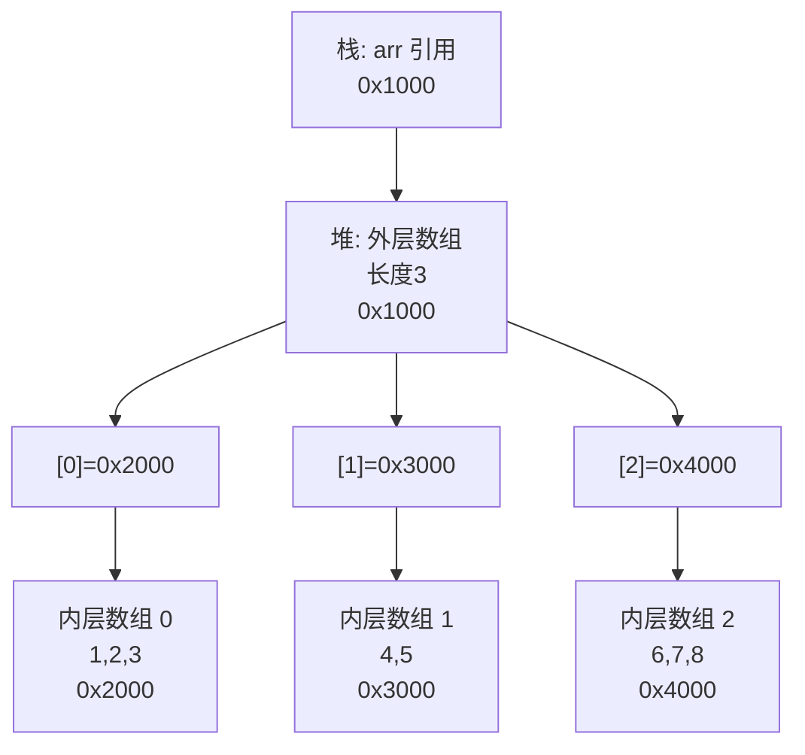

# 数组

> 学习路线对应：第1周 -- Java 语言核心
> 前置知识：Java 基本语法（变量、数据类型、运算符、流程控制）
> 预计学习时间：1-2 天

> **视频章节对应**：尚硅谷宋红康《Java零基础入门教程》第07章（数组）。本章涵盖数组的定义与使用、一维/二维数组、数组的内存解析、常见算法以及 Arrays 工具类。

---

## 一、核心概念

### 1.1 数组概述

> **生活化类比：图书馆书架** —— 数组像图书馆的一排固定书架：每个格子只能放同一类书（类型固定），格子总数一旦建好就不能增减（长度固定），格子按"第 1 格、第 2 格..."编号（连续索引，O(1) 取书），书架本身的编号牌贴在墙上（栈中的引用变量指向堆中的书架对象）。

数组是多个**相同类型**数据按一定顺序排列的集合，使用一个名字命名，并通过编号（下标/索引）的方式对这些数据进行统一管理。

**数组的核心特性：**

| 特性 | 说明 |
|------|------|
| **类型固定** | 数组中的所有元素必须是同一类型 |
| **长度固定** | 数组一旦创建，长度不可改变 |
| **连续内存** | 数组在内存中是连续存储的，支持 O(1) 随机访问 |
| **引用类型** | 数组本身是引用数据类型，数组变量存储的是堆空间中数组对象的首地址 |
| **默认初始化** | 数组创建后，每个元素会被自动赋予默认值（int 为 0，引用类型为 null 等） |

> 📖 **参考链接**：
> - [JLS - Chapter 10. Arrays](https://docs.oracle.com/javase/specs/jls/se17/html/jls-10.html) -- Java 语言规范第 10 章"数组"
> - [Oracle - Java Tutorial: Arrays](https://docs.oracle.com/javase/tutorial/java/nutsandbolts/arrays.html) -- Oracle 官方数组教程

### 1.2 一维数组

#### 声明与初始化

```java
// ========== 声明 ==========
int[] arr1;           // 推荐写法：类型[] 变量名
int arr2[];           // C语言风格，不推荐但合法

// ========== 静态初始化：声明 + 赋值同时进行 ==========
int[] arr3 = new int[]{1, 2, 3, 4, 5};
int[] arr4 = {1, 2, 3, 4, 5};           // 简写形式（仅限声明时）

// ========== 动态初始化：先指定长度，再逐个赋值 ==========
int[] arr5 = new int[5];                 // 所有元素默认值为 0
arr5[0] = 10;
arr5[1] = 20;
arr5[2] = 30;
arr5[3] = 40;
arr5[4] = 50;
```

#### 默认初始化值

| 数组元素类型 | 默认值 |
|-------------|--------|
| `byte` / `short` / `int` / `long` | `0` |
| `float` / `double` | `0.0` |
| `char` | `'\u0000'`（空字符，表现为空白） |
| `boolean` | `false` |
| 引用类型（String、自定义类等） | `null` |

#### 与 Python/JS 对比

| 特性 | Java 数组 | Python list | JavaScript Array |
|------|----------|-------------|------------------|
| 长度 | 固定，不可变 | 动态可变 | 动态可变 |
| 元素类型 | 统一类型 | 可混合类型 | 可混合类型 |
| 内存模型 | 连续内存，O(1) 访问 | 指针数组，近似 O(1) | 与 JS 引擎实现相关 |
| 获取长度 | `arr.length`（属性） | `len(arr)`（函数） | `arr.length`（属性） |
| 声明方式 | `int[] arr = new int[5]` | `arr = [1, 2, 3]` | `let arr = [1, 2, 3]` |

> 📖 **参考链接**：
> - [JLS - Chapter 10.1. Array Types](https://docs.oracle.com/javase/specs/jls/se17/html/jls-10.html#jls-10.1) -- Java 语言规范"数组类型"
> - [JLS - Chapter 10.3. Array Creation](https://docs.oracle.com/javase/specs/jls/se17/html/jls-10.html#jls-10.3) -- Java 语言规范"数组创建"

### 1.3 二维数组

#### 声明与初始化

```java
// ========== 静态初始化 ==========
int[][] arr1 = new int[][]{{1, 2, 3}, {4, 5}, {6, 7, 8, 9}};
int[][] arr2 = {{1, 2, 3}, {4, 5}, {6, 7, 8, 9}};  // 简写形式

// ========== 动态初始化：指定外层长度 ==========
int[][] arr3 = new int[3][];      // 外层长度为 3，内层暂未分配
arr3[0] = new int[3];             // 第 0 行分配 3 个元素
arr3[1] = new int[2];             // 第 1 行分配 2 个元素
arr3[2] = new int[4];             // 第 2 行分配 4 个元素（不规则数组）

// ========== 动态初始化：同时指定内外层长度 ==========
int[][] arr4 = new int[3][4];     // 3 行 4 列的矩阵
```

**关键理解：** Java 中的二维数组本质上是"数组的数组"。`int[][] arr` 声明了一个一维数组，其中每个元素又是一个 `int[]` 类型的一维数组。因此每一行的长度可以不同，形成不规则的二维数组。

> 📖 **参考链接**：
> - [JLS - Chapter 10.7. Array Members](https://docs.oracle.com/javase/specs/jls/se17/html/jls-10.html#jls-10.7) -- Java 语言规范"数组成员"（含 length 字段）
> - [JLS - Chapter 10.8. Multidimensional Arrays](https://docs.oracle.com/javase/specs/jls/se17/html/jls-10.html#jls-10.8) -- Java 语言规范"多维数组"

---

## 二、底层原理：数组内存模型（重点）

### 2.1 JVM 内存区域回顾

> **生活化类比：JVM 内存像"公司办公区"** —— 栈是"工位"（每个员工一个，私有，用完即清），堆是"公共仓库"（所有人共用，存放大型物资如数组、对象），方法区是"档案室"（存放公司章程、工艺手册等永久资料）。数组这种"大件物资"必须放公共仓库（堆），员工工位上只放一张"提货单"（引用地址）。

在理解数组的内存模型之前，先回顾 JVM 的内存划分：

```
JVM 内存结构（简化）
├── 栈（Stack）         -- 存储局部变量、方法调用帧
│   └── 每个线程私有，生命周期与线程相同
├── 堆（Heap）          -- 存储所有对象实例和数组
│   └── 所有线程共享，GC 管理的主要区域
└── 方法区（Method Area）-- 存储类信息、常量、静态变量
    └── 所有线程共享
```

### 2.2 一维数组内存解析

> **生活化类比：酒店的"房间号牌"与"房间"** —— 栈中的 `arr` 变量像前台的"房间号牌"（只记 0x1234 这种门牌号），堆中的数组对象像实际的"房间"（连续排列的多间客房）。`arr[2] = 30` 像根据门牌号找到 3 楼第 3 间房，进去放东西。如果两个变量都指向同一个门牌号，那么一个改动另一个也能看到。

#### 基本数据类型数组

```java
int[] arr = new int[]{10, 20, 30};
```

内存布局如下：

```
栈（Stack）                    堆（Heap）
┌───────────────┐             ┌─────────────────────────┐
│  arr = 0x1234 │────────────>│  [0] 10  [1] 20  [2] 30 │
│  (引用变量)    │             │  (连续内存，int 各占 4 字节) │
└───────────────┘             └─────────────────────────┘
```

**关键点：**
- `arr` 变量本身存储在**栈**中，存储的是数组对象在堆中的**首地址**（引用）
- 数组对象（包括元素值）存储在**堆**中
- 数组元素在堆中是**连续存储**的，这保证了通过下标 O(1) 随机访问
- `arr.length` 存储在数组对象的对象头中，创建时确定，不可更改

> 📖 **参考链接**：
> - [JLS - Chapter 10.7. Array Members](https://docs.oracle.com/javase/specs/jls/se17/html/jls-10.html#jls-10.7) -- Java 语言规范"数组成员"（含 length 字段说明）
> - [Oracle - JVM Specification - Array Components](https://docs.oracle.com/javase/specs/jvms/se17/html/jvms-2.html#jvms-2.4) -- JVM 规范"数组组件"

#### 引用数据类型数组

```java
String[] names = new String[]{"张三", "李四", "王五"};
```

内存布局如下：

```
栈（Stack）                    堆（Heap）
┌──────────────────┐          ┌──────────────────────────────────┐
│  names = 0x2000  │─────────>│  [0]=0x3000  [1]=0x4000         │
│  (引用变量)       │          │  [2]=0x5000                     │
└──────────────────┘          │  (String 引用数组，连续存储)       │
                              └───┬──────────┬──────────┬───────┘
                                  │          │          │
                    ┌─────────────┘   ┌──────┘    ┌─────┘
                    ▼                 ▼           ▼
               ┌──────────┐    ┌──────────┐  ┌──────────┐
               │ "张三"    │    │ "李四"    │  │ "王五"    │
               │ (String   │    │ (String   │  │ (String   │
               │  对象)    │    │  对象)    │  │  对象)    │
               └──────────┘    └──────────┘  └──────────┘
```

**关键点：**
- 引用类型数组的每个元素存储的是**对象的引用（地址）**，而非对象本身
- 实际的对象（如 String 实例）存储在堆中的其他位置
- 引用本身占用的内存大小是固定的（32 位 JVM 中为 4 字节，64 位 JVM 中为 8 字节，开启指针压缩后为 4 字节）

### 2.3 二维数组内存解析

```java
int[][] arr = new int[][]{{1, 2, 3}, {4, 5}, {6, 7, 8}};
```

内存布局如下：



```
栈（Stack）                    堆（Heap）
┌──────────────────┐          ┌──────────────────────────────────────────┐
│  arr = 0x1000    │─────────>│  外层数组（长度为 3）                      │
│  (引用变量)       │          │  [0]=0x2000  [1]=0x3000  [2]=0x4000     │
└──────────────────┘          └──┬──────────┬──────────┬────────────────┘
                                 │          │          │
                    ┌────────────┘   ┌──────┘    ┌─────┘
                    ▼                ▼           ▼
            ┌──────────────┐  ┌──────────┐  ┌──────────────┐
            │ 内层数组 [0]  │  │ 内层数组[1]│  │ 内层数组 [2]  │
            │ [0]=1 [1]=2  │  │ [0]=4    │  │ [0]=6 [1]=7  │
            │ [2]=3        │  │ [1]=5    │  │ [2]=8        │
            └──────────────┘  └──────────┘  └──────────────┘
```

**关键点：**
- 二维数组的本质是**外层数组的每个元素是一个内层数组的引用**
- 外层数组在堆中连续存储的是**内层数组的引用地址**，而非内层数组的数据
- 各内层数组在堆中**不一定连续**，各自独立分配
- 因此每一行的长度可以不同（不规则二维数组/锯齿数组）
- 访问 `arr[1][2]` 的过程：先通过外层数组引用找到内层数组引用，再通过内层数组引用找到具体元素

> 📖 **参考链接**：
> - [JLS - Chapter 10.8. Multidimensional Arrays](https://docs.oracle.com/javase/specs/jls/se17/html/jls-10.html#jls-10.8) -- Java 语言规范"多维数组"
> - [Oracle - Arrays API](https://docs.oracle.com/en/java/javase/17/docs/api/java.base/java/util/Arrays.html) -- Arrays 工具类官方 API

### 2.4 数组赋值与复制的内存行为

#### 数组变量赋值：引用传递

> **生活化类比：两把钥匙开同一扇门** —— `int[] arr2 = arr1;` 不是"复制了一个新房间"，而是"配了一把新钥匙开同一扇门"。两人各自拿钥匙进去装修，看到的都是同一间房的内容。要真正复制房间，得"另开一间新房 + 把家具一件件搬过去"（Arrays.copyOf 或 System.arraycopy）。

```java
int[] arr1 = new int[]{1, 2, 3};
int[] arr2 = arr1;           // 不是复制数组，而是复制引用！
arr2[0] = 100;
System.out.println(arr1[0]); // 输出 100（arr1 也被修改了）
```

内存示意图：

```
栈（Stack）
┌────────────────┐
│  arr1 = 0x3000 │───┐
│  arr2 = 0x3000 │───┤    （两个变量指向同一数组对象）
└────────────────┘   │
                     ▼
              堆（Heap）
              ┌──────────────────────┐
              │ [0]=100 [1]=2 [2]=3  │
              └──────────────────────┘
```

#### 数组复制：值复制

如果需要真正的数组复制（独立副本），有以下方式：

```java
// 方式一：手动循环复制
int[] copy1 = new int[arr1.length];
for (int i = 0; i < arr1.length; i++) {
    copy1[i] = arr1[i];
}

// 方式二：System.arraycopy（native 方法，性能最优）
int[] copy2 = new int[arr1.length];
System.arraycopy(arr1, 0, copy2, 0, arr1.length);

// 方式三：Arrays.copyOf（基于 System.arraycopy 封装）
int[] copy3 = Arrays.copyOf(arr1, arr1.length);

// 方式四：clone() 方法
int[] copy4 = arr1.clone();
```

**注意：** 以上四种方式对于基本数据类型数组是**深拷贝**（元素值完全独立）。但对于引用类型数组，复制的是**引用本身**，而不是引用指向的对象，属于**浅拷贝**。

```java
// 引用类型数组的浅拷贝示例
String[] original = new String[]{"A", "B", "C"};
String[] copy = original.clone();  // 浅拷贝：复制了引用数组
copy[0] = "X";                     // 修改 copy[0] 的引用指向
System.out.println(original[0]);   // 输出 "A"（original 不受影响）

// 但如果修改的是引用指向的对象内部状态...
// 对于 String 这种不可变类型，不会出问题
// 对于可变对象（如自定义类），则需要特别注意
```

> 📖 **参考链接**：
> - [Oracle - System.arraycopy API](https://docs.oracle.com/en/java/javase/17/docs/api/java.base/java/lang/System.html#arraycopy(java.lang.Object,int,java.lang.Object,int,int)) -- System.arraycopy 官方 API
> - [Oracle - Arrays.copyOf API](https://docs.oracle.com/en/java/javase/17/docs/api/java.base/java/util/Arrays.html#copyOf(T%5B%5D,int)) -- Arrays.copyOf 官方 API

### 2.5 数组作为方法参数的内存解析

```java
public static void modify(int[] arr) {
    arr[0] = 999;  // 修改的是堆中数组对象的内容
}

public static void main(String[] args) {
    int[] nums = {1, 2, 3};
    modify(nums);
    System.out.println(nums[0]);  // 输出 999
}
```

内存行为分析：

```
调用 modify(nums) 时：
1. 将 nums 的值（0x3000，即数组对象的地址）复制一份传给形参 arr
2. arr 和 nums 指向堆中的同一个数组对象
3. 通过 arr[0] = 999 修改的是堆中数组对象的内容
4. 方法返回后，nums[0] 自然也变成了 999
```

这与 C/C++ 的指针传递行为类似，Java 中**方法参数传递只有值传递**，但对于引用类型，传递的是**引用地址的值**，因此可以在方法内部修改对象的状态。

> 📖 **参考链接**：
> - [JLS - Chapter 8.4.1. Formal Parameters](https://docs.oracle.com/javase/specs/jls/se17/html/jls-8.html#jls-8.4.1) -- Java 语言规范"形参"
> - [JLS - Chapter 5.1.3. Narrowing Reference Conversion](https://docs.oracle.com/javase/specs/jls/se17/html/jls-5.html#jls-5.1.6) -- 引用类型转换

---

## 三、实战应用：数组常见算法

### 3.1 数组反转

> **生活化类比：停车场车辆对调** —— 双指针反转像"停车场两端的车依次对调"：左指针和右指针分别从两端走向中间，每一步交换两辆车，相遇时停止。原地反转不需要新建停车场（空间 O(1)），效率高。

```java
// 方式一：双指针法（原地反转，空间 O(1)）
public static void reverse(int[] arr) {
    int left = 0, right = arr.length - 1;
    while (left < right) {
        int temp = arr[left];
        arr[left] = arr[right];
        arr[right] = temp;
        left++;
        right--;
    }
}

// 方式二：创建新数组（空间 O(n)）
public static int[] reverseNew(int[] arr) {
    int[] result = new int[arr.length];
    for (int i = 0; i < arr.length; i++) {
        result[i] = arr[arr.length - 1 - i];
    }
    return result;
}
```

### 3.2 数组扩容

```java
// 数组长度不可变，扩容本质是创建新数组 + 复制
public static int[] expand(int[] arr, int newCapacity) {
    if (newCapacity <= arr.length) {
        return arr; // 新容量不大于原长度，无需扩容
    }
    int[] newArr = new int[newCapacity];
    System.arraycopy(arr, 0, newArr, 0, arr.length);
    return newArr;
}

// 使用 Arrays.copyOf 更简洁
public static int[] expandSimple(int[] arr, int newCapacity) {
    return Arrays.copyOf(arr, newCapacity);
    // 若 newCapacity > arr.length，多出的位置填充默认值 0
}
```

**ArrayList 的扩容策略：**

```java
// ArrayList 内部扩容源码（JDK 8）
private void grow(int minCapacity) {
    int oldCapacity = elementData.length;
    int newCapacity = oldCapacity + (oldCapacity >> 1); // 1.5 倍扩容
    if (newCapacity - minCapacity < 0)
        newCapacity = minCapacity;
    if (newCapacity - MAX_ARRAY_SIZE > 0)
        newCapacity = hugeCapacity(minCapacity);
    elementData = Arrays.copyOf(elementData, newCapacity);
}
```

> 📖 **参考链接**：
> - [Oracle - ArrayList 源码](https://docs.oracle.com/en/java/javase/17/docs/api/java.base/java/util/ArrayList.html) -- ArrayList 官方 API（含扩容说明）
> - [Oracle - Arrays.copyOf 源码](https://docs.oracle.com/en/java/javase/17/docs/api/java.base/java/util/Arrays.html#copyOf(T%5B%5D,int)) -- Arrays.copyOf 官方 API

### 3.3 数组缩容

```java
// 缩容：删除指定位置的元素，后续元素前移
public static int[] removeAt(int[] arr, int index) {
    if (index < 0 || index >= arr.length) {
        throw new ArrayIndexOutOfBoundsException("索引越界: " + index);
    }
    int[] newArr = new int[arr.length - 1];
    // 复制 index 之前的元素
    System.arraycopy(arr, 0, newArr, 0, index);
    // 复制 index 之后的元素
    System.arraycopy(arr, index + 1, newArr, index, arr.length - index - 1);
    return newArr;
}

// 缩容：删除第一个匹配的元素
public static int[] removeValue(int[] arr, int value) {
    int index = -1;
    for (int i = 0; i < arr.length; i++) {
        if (arr[i] == value) {
            index = i;
            break;
        }
    }
    if (index == -1) return arr; // 未找到，返回原数组
    return removeAt(arr, index);
}
```

### 3.4 数组查找

> **生活化类比：字典查找的两种方式** —— 线性查找像"翻字典从第一页挨个看"（O(n) 慢，但字典无序也能用），二分查找像"翻字典中间页判断前后"（O(log n) 快，但字典必须先按字母序排好）。如果字典本身有序，二分查找效率高得多。

```java
// ========== 线性查找（顺序查找），O(n) ==========
public static int linearSearch(int[] arr, int target) {
    for (int i = 0; i < arr.length; i++) {
        if (arr[i] == target) {
            return i; // 返回首次出现的索引
        }
    }
    return -1; // 未找到
}

// ========== 二分查找（要求数组已排序），O(log n) ==========
public static int binarySearch(int[] arr, int target) {
    int left = 0, right = arr.length - 1;
    while (left <= right) {
        int mid = left + (right - left) / 2; // 防止溢出
        if (arr[mid] == target) {
            return mid;
        } else if (arr[mid] < target) {
            left = mid + 1;
        } else {
            right = mid - 1;
        }
    }
    return -1; // 未找到
}
```

> 📖 **参考链接**：
> - [Oracle - Arrays.binarySearch API](https://docs.oracle.com/en/java/javase/17/docs/api/java.base/java/util/Arrays.html#binarySearch(int%5B%5D,int)) -- Arrays.binarySearch 官方 API
> - [Oracle - Arrays.sort API](https://docs.oracle.com/en/java/javase/17/docs/api/java.base/java/util/Arrays.html#sort(int%5B%5D)) -- Arrays.sort 官方 API

### 3.5 数组排序

> **生活化类比：排队方式对比** —— 冒泡排序像"相邻同学比身高，高的往后挪"（每轮把最高的人冒泡到最后），快速排序像"选一个基准同学，比他矮的站左边、比他高的站右边，然后左右两边递归"（分治）。冒泡稳定但慢，快排平均快但最坏会退化。

#### 冒泡排序（Bubble Sort）

```java
// 时间复杂度：O(n^2)，稳定排序，空间 O(1)
public static void bubbleSort(int[] arr) {
    for (int i = 0; i < arr.length - 1; i++) {
        boolean swapped = false;     // 优化：提前终止标志
        for (int j = 0; j < arr.length - 1 - i; j++) {
            if (arr[j] > arr[j + 1]) {
                int temp = arr[j];
                arr[j] = arr[j + 1];
                arr[j + 1] = temp;
                swapped = true;
            }
        }
        if (!swapped) break;         // 本轮无交换，已有序
    }
}
```

#### 快速排序（Quick Sort）

```java
// 时间复杂度：平均 O(n log n)，最坏 O(n^2)，不稳定排序
public static void quickSort(int[] arr, int left, int right) {
    if (left >= right) return;
    int pivot = partition(arr, left, right);
    quickSort(arr, left, pivot - 1);
    quickSort(arr, pivot + 1, right);
}

private static int partition(int[] arr, int left, int right) {
    int pivot = arr[left];           // 选取最左元素作为基准
    int i = left, j = right;
    while (i < j) {
        while (i < j && arr[j] >= pivot) j--; // 从右往左找第一个小于 pivot 的
        while (i < j && arr[i] <= pivot) i++; // 从左往右找第一个大于 pivot 的
        if (i < j) {
            int temp = arr[i];
            arr[i] = arr[j];
            arr[j] = temp;
        }
    }
    arr[left] = arr[i];
    arr[i] = pivot;
    return i;
}
```

#### 排序算法对比

| 排序算法 | 平均时间复杂度 | 最坏时间复杂度 | 空间复杂度 | 稳定性 |
|---------|--------------|--------------|-----------|--------|
| 冒泡排序 | O(n^2) | O(n^2) | O(1) | 稳定 |
| 选择排序 | O(n^2) | O(n^2) | O(1) | 不稳定 |
| 插入排序 | O(n^2) | O(n^2) | O(1) | 稳定 |
| 快速排序 | O(n log n) | O(n^2) | O(log n) | 不稳定 |
| 归并排序 | O(n log n) | O(n log n) | O(n) | 稳定 |
| 堆排序 | O(n log n) | O(n log n) | O(1) | 不稳定 |
| `Arrays.sort()` | O(n log n) | O(n log n) | 视情况 | - |

> 📖 **参考链接**：
> - [Oracle - Arrays.sort API](https://docs.oracle.com/en/java/javase/17/docs/api/java.base/java/util/Arrays.html#sort(int%5B%5D)) -- Arrays.sort 官方 API
> - [Oracle - Java Collections Framework Sorting](https://docs.oracle.com/en/java/javase/17/docs/api/java.base/java/util/package-summary.html) -- Java 集合框架排序说明

### 3.6 Arrays 工具类

`java.util.Arrays` 是 JDK 提供的数组操作工具类，包含排序、查找、比较、填充、转换等常用方法。

```java
import java.util.Arrays;

int[] arr = {3, 1, 4, 1, 5, 9, 2, 6};

// ========== 排序 ==========
Arrays.sort(arr);                    // 全数组升序排序（Dual-Pivot QuickSort）
Arrays.sort(arr, 1, 4);             // 对 [1, 4) 区间排序

// ========== 二分查找（数组必须先排序） ==========
int index = Arrays.binarySearch(arr, 5);  // 返回索引，未找到返回 -(插入点+1)

// ========== 比较 ==========
int[] arr2 = {3, 1, 4, 1, 5, 9, 2, 6};
boolean isEqual = Arrays.equals(arr, arr2); // 逐个元素比较

// ========== 填充 ==========
Arrays.fill(arr, 0);                 // 所有元素填充为 0
Arrays.fill(arr, 2, 5, 99);         // [2, 5) 区间填充为 99

// ========== 复制 ==========
int[] copy1 = Arrays.copyOf(arr, arr.length);       // 完整复制
int[] copy2 = Arrays.copyOf(arr, 5);                // 复制前 5 个元素
int[] copy3 = Arrays.copyOfRange(arr, 2, 5);        // 复制 [2, 5) 区间

// ========== 转换为字符串 ==========
String str = Arrays.toString(arr);                  // "[3, 1, 4, 1, 5, 9, 2, 6]"
String deepStr = Arrays.deepToString(twoDimArr);    // 多维数组转字符串

// ========== 转换为 List ==========
List<Integer> list = Arrays.asList(1, 2, 3);
// 注意：asList 返回的 List 是 Arrays 内部类，长度固定，不支持 add/remove！

// 正确的数组转 List 方式（可变 List）：
List<Integer> mutableList = new ArrayList<>(Arrays.asList(1, 2, 3));
```

> 📖 **参考链接**：
> - [Oracle - Arrays 工具类 API](https://docs.oracle.com/en/java/javase/17/docs/api/java.base/java/util/Arrays.html) -- Arrays 工具类完整 API
> - [Oracle - ArrayList API](https://docs.oracle.com/en/java/javase/17/docs/api/java.base/java/util/ArrayList.html) -- ArrayList 官方 API
> - [Oracle - System.arraycopy API](https://docs.oracle.com/en/java/javase/17/docs/api/java.base/java/lang/System.html#arraycopy(java.lang.Object,int,java.lang.Object,int,int)) -- System.arraycopy 官方 API

---

## 四、常见异常

### 4.1 数组索引越界异常

> **生活化类比：图书馆找错书架** —— `arr[3]` 访问一个长度只有 3 的数组，像去图书馆找"第 4 排书架"，但实际只有 3 排。管理员立刻报错：`ArrayIndexOutOfBoundsException`（找不到这一排）。Java 严格检查边界，防止越界访问导致内存安全问题。

```java
int[] arr = new int[]{1, 2, 3};
System.out.println(arr[3]);     // ArrayIndexOutOfBoundsException
System.out.println(arr[-1]);    // ArrayIndexOutOfBoundsException
```

**异常类：** `java.lang.ArrayIndexOutOfBoundsException`

> 📖 **参考链接**：
> - [Oracle - ArrayIndexOutOfBoundsException API](https://docs.oracle.com/en/java/javase/17/docs/api/java.base/java/lang/ArrayIndexOutOfBoundsException.html) -- 数组越界异常官方 API
> - [JLS - Chapter 10.4. Array Access](https://docs.oracle.com/javase/specs/jls/se17/html/jls-10.html#jls-10.4) -- Java 语言规范"数组访问"

**原因：** 访问了不存在的索引。有效索引范围是 `[0, arr.length - 1]`。

**预防：** 遍历数组时使用 `i < arr.length` 而非 `i <= arr.length`；访问前做边界检查。

### 4.2 空指针异常

```java
int[] arr = null;
System.out.println(arr.length);  // NullPointerException
System.out.println(arr[0]);      // NullPointerException

// 二维数组内层未初始化
int[][] arr2 = new int[3][];     // 内层数组尚未分配
System.out.println(arr2[0][0]);  // NullPointerException！（arr2[0] 为 null）
```

**异常类：** `java.lang.NullPointerException`

**原因：** 数组引用变量为 `null`，或者二维数组的内层数组尚未初始化。

**预防：** 使用前判断 `arr != null`；创建二维数组时确保内层数组已分配。

> 📖 **参考链接**：
> - [Oracle - NullPointerException API](https://docs.oracle.com/en/java/javase/17/docs/api/java.base/java/lang/NullPointerException.html) -- 空指针异常官方 API

### 4.3 类型不兼容异常

```java
Object[] objArr = new String[]{"A", "B"};
objArr[0] = 123;  // ArrayStoreException！（运行时抛出）
```

**异常类：** `java.lang.ArrayStoreException`

**原因：** 尝试将不兼容类型的对象存入数组。虽然编译时 `Object[]` 可以接受任何类型，但运行时数组的实际类型是 `String[]`。这是 Java 数组**协变**（covariant）特性带来的陷阱。

> 📖 **参考链接**：
> - [Oracle - ArrayStoreException API](https://docs.oracle.com/en/java/javase/17/docs/api/java.base/java/lang/ArrayStoreException.html) -- 数组存储异常官方 API
> - [JLS - Chapter 4.10.3. Subtyping among Array Types](https://docs.oracle.com/javase/specs/jls/se17/html/jls-4.html#jls-4.10.3) -- Java 语言规范"数组类型的协变"

---

## 五、常见面试题（附答案）

### 1. 数组和 ArrayList 的区别？

| 维度 | 数组 | ArrayList |
|------|------|-----------|
| 长度 | 固定，创建后不可变 | 动态可变，自动扩容（1.5 倍） |
| 类型 | 可存储基本类型和引用类型 | 只能存储引用类型（基本类型需装箱） |
| 泛型 | 不支持 | 支持泛型，编译期类型检查 |
| 性能 | 略高（无装箱/拆箱开销） | 有装箱/拆箱开销 |
| 方法 | 仅 `length` 属性 | 提供丰富的 CRUD 方法 |
| 内存 | 更紧凑 | 有额外的容量预留 |

**选型决策：** 元素数量固定且已知时用数组（性能好）；元素数量不确定、需要频繁增删时用 ArrayList。

### 2. 数组在内存中是如何存储的？为什么数组索引从 0 开始？

**内存存储：** 数组对象在堆中连续存储。数组变量（栈中）持有数组对象的首地址引用。通过 `首地址 + 索引 * 元素大小` 计算出目标元素的地址，实现 O(1) 随机访问。

**索引从 0 开始的原因：**
- 如果索引从 0 开始，第 i 个元素的地址 = `首地址 + i * 元素大小`
- 如果索引从 1 开始，第 i 个元素的地址 = `首地址 + (i - 1) * 元素大小`
- 从 0 开始可以省去一次减法运算，这是 C 语言设计传统，Java 沿用了这一习惯

### 3. 二维数组的每一行长度可以不同吗？为什么？

**可以不同。** 因为 Java 中的二维数组本质上是"数组的数组"。外层数组的每个元素存储的是内层数组的**引用地址**，各内层数组在堆中独立分配，长度可以各不相同。这种结构称为**不规则数组**或**锯齿数组**（Jagged Array）。

```java
int[][] jagged = new int[3][];
jagged[0] = new int[3];  // 第 0 行 3 列
jagged[1] = new int[5];  // 第 1 行 5 列
jagged[2] = new int[2];  // 第 2 行 2 列
```

### 4. Arrays.asList() 有哪些坑？

1. **返回的 List 不支持 add/remove：** `asList` 返回的是 `Arrays` 内部类 `ArrayList`，不是 `java.util.ArrayList`。它只是一个数组的视图，长度固定。
2. **基本类型数组的陷阱：** `Arrays.asList(new int[]{1, 2, 3})` 会将整个 `int[]` 当作一个元素，而不是展开为三个元素。因为泛型不支持基本类型，`int[]` 被当作一个 `Object`。
3. **修改会互相影响：** 对返回的 List 进行 set 操作会影响原数组，反之亦然（因为底层是同一个数组）。

```java
// 正确用法：使用包装类型
List<Integer> list = Arrays.asList(1, 2, 3);  // 自动装箱为 Integer

// 或创建可变的 ArrayList
List<Integer> mutable = new ArrayList<>(Arrays.asList(1, 2, 3));
```

> 📖 **参考链接**：
> - [Oracle - Arrays.asList API](https://docs.oracle.com/en/java/javase/17/docs/api/java.base/java/util/Arrays.html#asList(T...)) -- Arrays.asList 官方 API
> - [Oracle - ArrayList API](https://docs.oracle.com/en/java/javase/17/docs/api/java.base/java/util/ArrayList.html) -- ArrayList 官方 API

---

## 六、避坑指南

| 常见错误 | 现象 | 原因 | 解决方案 |
|---------|------|------|---------|
| 数组越界遍历 | `ArrayIndexOutOfBoundsException` | 循环条件写成 `i <= arr.length`（应为 `i < arr.length`） | 统一使用 `for (int i = 0; i < arr.length; i++)` 或增强 for 循环 |
| 二维数组内层未初始化 | `NullPointerException` | `int[][] arr = new int[3][];` 后直接访问 `arr[0][0]`，内层数组为 null | 逐行初始化：`arr[0] = new int[4];`；或使用 `new int[3][4]` |
| 数组赋值误认为复制 | 修改新变量影响原数组 | `int[] b = a;` 只是复制引用，a 和 b 指向同一对象 | 使用 `Arrays.copyOf()` 或 `System.arraycopy()` 创建独立副本 |
| `Arrays.asList()` 后调 add/remove | `UnsupportedOperationException` | `asList` 返回固定长度的内部类 List | 包装为 `new ArrayList<>(Arrays.asList(...))` |
| 二分查找前未排序 | 返回错误结果或不可预期的负数 | `binarySearch` 要求数组已升序排列 | 先调用 `Arrays.sort()` 排序，再调用 `binarySearch()` |
| 打印数组直接 `toString()` | 输出类似 `[I@15db9742` 的哈希码 | 数组未重写 `toString()`，默认调用 `Object.toString()` | 使用 `Arrays.toString(arr)` 或 `Arrays.deepToString()` |

---

## 本章学习自检

完成本章学习后，应该能够：
- [ ] 用自己的话解释数组的内存模型（栈、堆、引用传递），能画出内存示意图
- [ ] 熟练使用一维数组和二维数组的静态初始化与动态初始化
- [ ] 手写数组反转、扩容、缩容、线性查找、二分查找、冒泡排序、快速排序的代码
- [ ] 掌握 Arrays 工具类的常用方法（sort、binarySearch、copyOf、equals、toString、asList）
- [ ] 理解常见异常（ArrayIndexOutOfBoundsException、NullPointerException、ArrayStoreException）的原因和预防方法
- [ ] 回答常见面试题（数组与 ArrayList 区别、索引从 0 开始的原因、二维数组本质、asList 陷阱）

---

> **学习导航**：
> - 返回 [学习路线总览](../../README.md)
> - 前置学习：[03-流程控制](./03-流程控制.md)
> - 后续学习：[05-面向对象基础](./05-面向对象基础.md)
> - 本模块其他文件：[08-面向对象与集合框架](./08-面向对象与集合框架.md) | [17-Java核心笔面试题集](./17-Java核心笔面试题集.md)