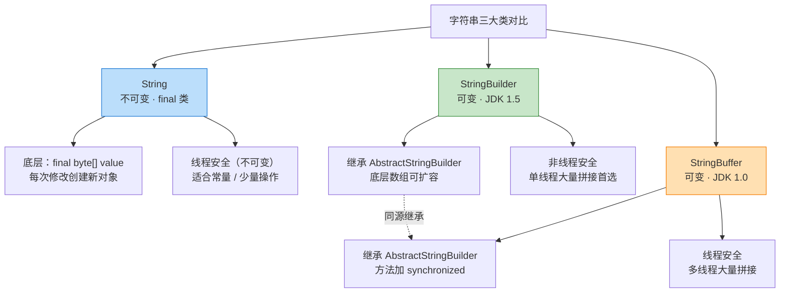
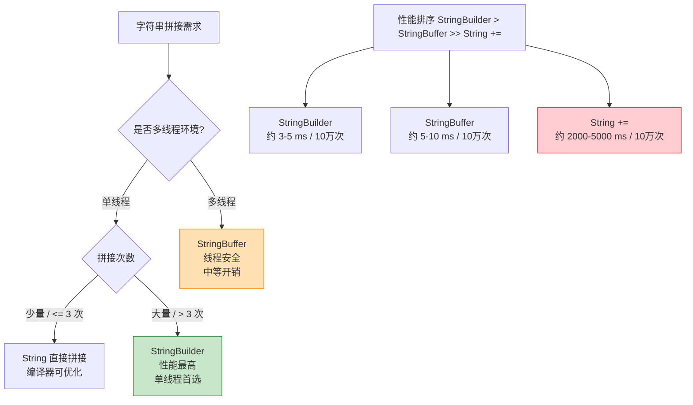
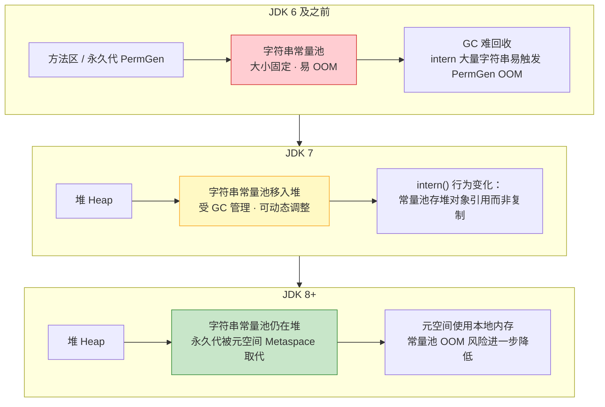
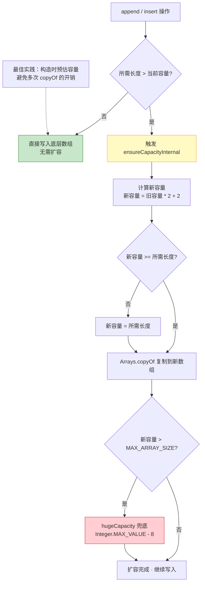

# 常用类与基础 API

> 学习路线对应：第2周 -- Java 语言核心
> 前置知识：Java 基本语法（变量、运算符、流程控制、数组）
> 预计学习时间：2-3 天

> **视频章节对应**：尚硅谷宋红康《Java零基础入门教程》第09章 -- 常用类与基础API
> 本章涵盖 Java 开发中最常用的核心 API 类，包括 String 系列、日期时间 API、比较器、大数运算和随机数生成。重点对比 JDK 8 前后 API 的设计差异和性能表现。

---

## 一、核心概念

### 1.1 String 类与不可变性

#### 1.1.1 String 的不可变性

String 是 Java 中最常用的类之一，其核心特性是**不可变性（Immutable）**：一旦创建，String 对象的内容就无法被修改。

> **生活化类比：刻字石碑** —— String 就像一块刻好字的石碑，一旦刻下"hello"，就永远只能是"hello"。想要改成"Hello"，只能重新刻一块新的石碑（创建新对象），原石碑上的字迹无法被擦改。这也解释了为什么 `s1.replace('h','H')` 不会修改 s1，而是返回一个新字符串。

```java
public final class String
    implements java.io.Serializable, Comparable<String>, CharSequence {
    /** 存储字符串的字符数组，JDK 9 之前为 char[]，JDK 9+ 改为 byte[] */
    private final byte[] value;   // final 修饰，不可变
    private final byte coder;     // 编码标识（JDK 9+）
    private int hash;             // 缓存 hashCode，默认 0
}
```

**不可变性的体现：**

```java
String s1 = "hello";
String s2 = s1.replace('h', 'H');  // 返回新字符串，s1 不变
System.out.println(s1);  // "hello" -- 原字符串未改变
System.out.println(s2);  // "Hello" -- 返回的是新对象

String s3 = "abc";
s3 = "xyz";  // 看似修改了 s3，实际上 s3 指向了新的 String 对象
```

**String 被设计为不可变的原因：**

| 原因 | 说明 |
|------|------|
| **字符串常量池** | 不可变性使得字符串常量池成为可能，相同字面量可共享同一对象，节省内存 |
| **安全性** | String 广泛用于类加载、网络连接、文件路径等敏感场景，不可变防止被恶意篡改 |
| **线程安全** | 不可变对象天然线程安全，多线程共享无需同步 |
| **Hash 缓存** | `hashCode()` 只需计算一次，之后可缓存复用，提升 HashMap 性能 |

> 📖 **参考链接**：
> - [Oracle - String API](https://docs.oracle.com/en/java/javase/17/docs/api/java.base/java/lang/String.html) -- String 类官方 API 文档
> - [JLS §3.10.5 String Literals](https://docs.oracle.com/javase/specs/jls/se17/html/jls-3.html#jls-3.10.5) -- 字符串字面量规范
> - [JEP 254: Compact Strings](https://openjdk.org/jeps/254) -- JDK 9 紧凑字符串优化

#### 1.1.2 String 的创建方式与内存分配

```java
// 方式一：字面量赋值
String s1 = "hello";        // 在字符串常量池中创建
String s2 = "hello";        // 复用常量池中已存在的对象
System.out.println(s1 == s2); // true（指向同一对象）

// 方式二：new 关键字
String s3 = new String("hello");  // 在堆中创建新对象
System.out.println(s1 == s3);     // false（不同对象）

// 方式三：intern() 方法
String s4 = new String("hello").intern();  // 强制返回常量池中的引用
System.out.println(s1 == s4);              // true
```

**内存分配示意图：**

```
字面量 "hello"：
┌──────────────────────┐
│   字符串常量池（堆内）  │
│   ┌──────────────┐   │
│   │   "hello"    │   │  ← s1 和 s2 都指向这里
│   └──────────────┘   │
└──────────────────────┘

new String("hello")：
┌──────────────────────┐
│   堆                  │
│   ┌──────────────┐   │
│   │ String 对象   │   │  ← s3 指向这里（新对象）
│   │ value ──────────────────┐
│   └──────────────┘   │     │
│   ┌──────────────┐   │     │
│   │   "hello"    │   │  <──┘（底层 char[]/byte[] 共享常量池数据）
│   └──────────────┘   │
└──────────────────────┘
```

> **生活化类比：图书馆共享书架** —— 字符串常量池就像图书馆的共享书架：当你说"我要借《hello》这本书"，管理员先去书架上找，有就直接借给你（复用同一对象，s1 == s2 为 true）；没有才去新购一本放到书架。而 `new String("hello")` 则相当于你自己花钱买了一本，不复用书架上的，所以 s1 == s3 为 false。`intern()` 方法则相当于"把你的书登记到共享书架上"。

> **注意（JDK 7+）：** 字符串常量池从方法区（永久代）移到了堆中，受 GC 管理。JDK 8 进一步移除了永久代，改用元空间（Metaspace）。

> 📖 **参考链接**：
> - [Oracle - String.intern() API](https://docs.oracle.com/en/java/javase/17/docs/api/java.base/java/lang/String.html#intern()) -- intern() 方法官方说明
> - [JLS §3.10.5 String Literals](https://docs.oracle.com/javase/specs/jls/se17/html/jls-3.html#jls-3.10.5) -- 字符串字面量与常量池规范

#### 1.1.3 String 常用方法速查

| 方法 | 说明 | 示例 |
|------|------|------|
| `length()` | 返回字符串长度 | `"abc".length()` -> `3` |
| `charAt(int)` | 返回指定索引的字符 | `"abc".charAt(1)` -> `'b'` |
| `equals(Object)` | 比较字符串内容是否相等 | `"a".equals("a")` -> `true` |
| `equalsIgnoreCase(String)` | 忽略大小写比较 | `"Abc".equalsIgnoreCase("abc")` -> `true` |
| `indexOf(String)` | 返回子串首次出现的索引 | `"abcabc".indexOf("bc")` -> `1` |
| `lastIndexOf(String)` | 返回子串最后出现的索引 | `"abcabc".lastIndexOf("bc")` -> `4` |
| `substring(int, int)` | 截取子串 `[begin, end)` | `"hello".substring(1, 4)` -> `"ell"` |
| `trim()` | 去除首尾空白字符 | `" a b ".trim()` -> `"a b"` |
| `replace(char, char)` | 替换所有匹配字符 | `"abca".replace('a', 'x')` -> `"xbcx"` |
| `replaceAll(String, String)` | 正则替换 | `"a1b2".replaceAll("\\d", "")` -> `"ab"` |
| `split(String)` | 按正则分割 | `"a,b,c".split(",")` -> `["a","b","c"]` |
| `toUpperCase()/toLowerCase()` | 大小写转换 | `"abc".toUpperCase()` -> `"ABC"` |
| `startsWith(String)/endsWith(String)` | 判断前缀/后缀 | `"hello".startsWith("he")` -> `true` |
| `contains(CharSequence)` | 是否包含子串 | `"hello".contains("el")` -> `true` |
| `isEmpty()/isBlank()` | 判空（JDK 11+） | `" ".isBlank()` -> `true` |
| `join(CharSequence, ...)` | 用分隔符拼接 | `String.join("-", "a", "b")` -> `"a-b"` |

> 📖 **参考链接**：
> - [Oracle - String API](https://docs.oracle.com/en/java/javase/17/docs/api/java.base/java/lang/String.html) -- String 类常用方法速查
> - [JLS §3.10 String Literals](https://docs.oracle.com/javase/specs/jls/se17/html/jls-3.html) -- 字符串字面量规范

#### 1.1.4 String 与基本类型的转换

```java
// String -> 基本类型
int i = Integer.parseInt("123");
double d = Double.parseDouble("3.14");
boolean b = Boolean.parseBoolean("true");

// 基本类型 -> String
String s1 = String.valueOf(123);      // "123"
String s2 = Integer.toString(456);    // "456"
String s3 = 789 + "";                 // "789"（简单但不推荐，可读性差）
```

> 📖 **参考链接**：
> - [Oracle - Integer API](https://docs.oracle.com/en/java/javase/17/docs/api/java.base/java/lang/Integer.html) -- Integer 类 parseInt/valueOf 等转换方法
> - [Oracle - String.valueOf() API](https://docs.oracle.com/en/java/javase/17/docs/api/java.base/java/lang/String.html#valueOf(java.lang.Object)) -- String.valueOf 重载方法
> - [Java Tutorial - Converting Between Numbers and Strings](https://docs.oracle.com/javase/tutorial/java/data/converting.html) -- 官方教程：数字与字符串互转

### 1.2 StringBuilder 与 StringBuffer

#### 1.2.1 为什么需要可变字符串？

String 是不可变的，每次拼接、替换等操作都会产生新的 String 对象：

```java
String result = "";
for (int i = 0; i < 10000; i++) {
    result += i;  // 每次循环都创建新的 String 对象，极端低效！
}
// 上述代码会创建约 10000 个临时 String 对象，GC 压力巨大
```

`StringBuilder` 和 `StringBuffer` 提供了**可变的字符序列**，避免了频繁创建对象。

> **生活化类比：活页笔记本** —— 如果说 String 是刻字石碑（每次修改要重刻一块），那 StringBuilder 就像一本活页笔记本：你可以随时在任意位置插页（`insert`）、撕掉某页（`delete`）、替换某页内容（`replace`），整本笔记本始终是同一本（同一个对象），只是内容在动态变化。StringBuffer 则是"加了锁的活页笔记本"——多人同时改也不会乱（线程安全），但每次操作都要先开锁再加锁，所以比 StringBuilder 慢一些。

> 📖 **参考链接**：
> - [Oracle - StringBuilder API](https://docs.oracle.com/en/java/javase/17/docs/api/java.base/java/lang/StringBuilder.html) -- StringBuilder 官方 API 文档
> - [Oracle - StringBuffer API](https://docs.oracle.com/en/java/javase/17/docs/api/java.base/java/lang/StringBuffer.html) -- StringBuffer 官方 API 文档
> - [Java Tutorial - The StringBuilder Class](https://docs.oracle.com/javase/tutorial/java/data/buffers.html) -- 官方教程：StringBuilder 用法

#### 1.2.2 三者对比

| 对比维度 | String | StringBuilder | StringBuffer |
|---------|--------|---------------|--------------|
| **可变性** | 不可变 | 可变 | 可变 |
| **线程安全** | 安全（不可变） | 不安全 | 安全（synchronized） |
| **性能** | 拼接操作低效 | 最高 | 中等（同步开销） |
| **继承关系** | 实现 `CharSequence` | 继承 `AbstractStringBuilder` | 继承 `AbstractStringBuilder` |
| **JDK 版本** | JDK 1.0 | JDK 1.5 | JDK 1.0 |
| **适用场景** | 少量字符串操作、常量 | 单线程下大量拼接 | 多线程下大量拼接 |

**三者结构与特性对比可视化：**



#### 1.2.3 常用方法

```java
StringBuilder sb = new StringBuilder();

// 追加
sb.append("hello");
sb.append(123);
sb.append(3.14);
sb.append(true);

// 插入
sb.insert(5, " world");   // 在索引 5 处插入

// 删除
sb.delete(0, 5);          // 删除 [0, 5) 区间的字符
sb.deleteCharAt(3);       // 删除指定索引的字符

// 替换
sb.replace(0, 5, "HELLO"); // 替换 [0, 5) 区间

// 反转
sb.reverse();              // 字符串反转

// 获取长度与容量
int len = sb.length();     // 实际字符数
int cap = sb.capacity();   // 当前容量（底层数组长度）

// 转换为 String
String result = sb.toString();
```

#### 1.2.4 性能对比实测

```java
// 测试三种方式拼接 100000 次字符串的耗时
public class StringConcatBenchmark {
    public static void main(String[] args) {
        int n = 100000;

        // 1. String 直接拼接（不要这样做）
        long t1 = System.currentTimeMillis();
        String s = "";
        for (int i = 0; i < n; i++) {
            s += i;
        }
        long t2 = System.currentTimeMillis();
        System.out.println("String 拼接耗时: " + (t2 - t1) + "ms");
        // 典型结果：2000~5000ms（极慢）

        // 2. StringBuffer
        long t3 = System.currentTimeMillis();
        StringBuffer sbf = new StringBuffer();
        for (int i = 0; i < n; i++) {
            sbf.append(i);
        }
        long t4 = System.currentTimeMillis();
        System.out.println("StringBuffer 耗时: " + (t4 - t3) + "ms");
        // 典型结果：5~10ms

        // 3. StringBuilder
        long t5 = System.currentTimeMillis();
        StringBuilder sbd = new StringBuilder();
        for (int i = 0; i < n; i++) {
            sbd.append(i);
        }
        long t6 = System.currentTimeMillis();
        System.out.println("StringBuilder 耗时: " + (t6 - t5) + "ms");
        // 典型结果：3~5ms（最快）
    }
}
```

**性能结论：** 单线程下 StringBuilder > StringBuffer >> String 拼接。当拼接次数超过 3 次时，就应使用 StringBuilder。

**性能对比与选型决策流程图：**



> 上图展示了字符串拼接的选型决策流程与性能排序：单线程下大量拼接首选 StringBuilder（性能最高），多线程下使用 StringBuffer（线程安全），少量拼接可直接用 String（编译器可优化）。性能排序为 StringBuilder > StringBuffer >> String +=，差异随拼接次数增大而显著放大。

> 📖 **参考链接**：
> - [Oracle - StringBuilder API](https://docs.oracle.com/en/java/javase/17/docs/api/java.base/java/lang/StringBuilder.html) -- StringBuilder 性能说明
> - [JEP 280: Indify String Concatenation](https://openjdk.org/jeps/280) -- JDK 9 字符串拼接优化机制
> - [Java Tutorial - The StringBuilder Class](https://docs.oracle.com/javase/tutorial/java/data/buffers.html) -- 官方教程：StringBuilder 性能对比

### 1.3 JDK 8 前后日期时间 API 对比

#### 1.3.1 旧 API（JDK 8 之前）：Date 与 Calendar

**java.util.Date：**

```java
// 创建 Date 对象
Date d1 = new Date();              // 当前时间
Date d2 = new Date(1000000000L);   // 指定毫秒时间戳

// 常用方法（大部分已过时 @Deprecated）
System.out.println(d1.getTime());  // 返回毫秒时间戳
System.out.println(d1);            // 可读性差：Thu Jun 30 10:30:00 CST 2026

// 比较
d1.before(d2);   // d1 是否在 d2 之前
d1.after(d2);    // d1 是否在 d2 之后
```

**java.util.Calendar（抽象类）：**

```java
// 获取实例
Calendar cal = Calendar.getInstance();

// 获取字段
int year = cal.get(Calendar.YEAR);      // 年份
int month = cal.get(Calendar.MONTH);    // 月份：0-11（注意：0 表示 1 月！）
int day = cal.get(Calendar.DAY_OF_MONTH);

// 设置字段
cal.set(2026, Calendar.JUNE, 30);       // 月份用常量，阅读性差

// 日期运算
cal.add(Calendar.DAY_OF_MONTH, 7);      // 加 7 天
cal.add(Calendar.MONTH, -1);            // 减 1 个月
```

**SimpleDateFormat（格式化与解析）：**

```java
SimpleDateFormat sdf = new SimpleDateFormat("yyyy-MM-dd HH:mm:ss");

// 格式化：Date -> String
String dateStr = sdf.format(new Date());  // "2026-06-30 10:30:00"

// 解析：String -> Date
Date date = sdf.parse("2026-06-30 10:30:00");
```

> 📖 **参考链接**：
> - [Oracle - Date API](https://docs.oracle.com/en/java/javase/17/docs/api/java.base/java/util/Date.html) -- java.util.Date 官方 API
> - [Oracle - Calendar API](https://docs.oracle.com/en/java/javase/17/docs/api/java.base/java/util/Calendar.html) -- java.util.Calendar 官方 API
> - [Oracle - SimpleDateFormat API](https://docs.oracle.com/en/java/javase/17/docs/api/java.base/java/text/SimpleDateFormat.html) -- SimpleDateFormat 官方 API

#### 1.3.2 旧 API 的痛点

| 问题 | 说明 |
|------|------|
| **可变性** | Date 和 Calendar 都是可变的，多线程下不安全 |
| **偏移量设计** | Date 的年份从 1900 开始，月份从 0 开始，极易出错 |
| **格式化线程不安全** | `SimpleDateFormat` 不是线程安全的，多线程共享会出问题 |
| **API 设计混乱** | Date 的大部分方法已过时，Calendar 操作繁琐，两者职责不清 |
| **缺乏时区支持** | 处理时区需要额外引入 `TimeZone` 类，操作复杂 |
| **不可读的输出** | `Date.toString()` 输出格式固定，不可定制 |

**SimpleDateFormat 线程安全问题示例：**

```java
// 错误示范：多线程共享 SimpleDateFormat
SimpleDateFormat sdf = new SimpleDateFormat("yyyy-MM-dd");

// 多线程环境下可能导致：
// 1. 解析结果错误（返回其他线程的日期）
// 2. NumberFormatException
// 3. ArrayIndexOutOfBoundsException
```

#### 1.3.3 新 API（JDK 8+）：java.time 包

JDK 8 引入了全新的 `java.time` 包（基于 JSR-310 规范，借鉴 Joda-Time），解决了旧 API 的所有痛点。

**核心类概览：**

| 类 | 说明 | 示例 |
|---|------|------|
| `LocalDate` | 日期（年-月-日），不含时间 | `2026-06-30` |
| `LocalTime` | 时间（时:分:秒:纳秒），不含日期 | `10:30:00.123456789` |
| `LocalDateTime` | 日期 + 时间（不含时区） | `2026-06-30T10:30:00` |
| `ZonedDateTime` | 带时区的日期时间 | `2026-06-30T10:30:00+08:00[Asia/Shanghai]` |
| `Instant` | 时间戳（以 Unix 元年 1970-01-01 为基准） | `2026-06-30T02:30:00Z` |
| `Duration` | 时间间隔（时分秒纳秒） | `PT2H30M`（2小时30分） |
| `Period` | 日期间隔（年月日） | `P1Y2M3D`（1年2月3天） |
| `DateTimeFormatter` | 线程安全的格式化器 | `yyyy-MM-dd HH:mm:ss` |

**核心代码示例：**

```java
import java.time.*;
import java.time.format.DateTimeFormatter;

// ========== 创建 ==========
LocalDate date = LocalDate.now();                // 当前日期
LocalDate date2 = LocalDate.of(2026, 6, 30);     // 指定日期
LocalDate date3 = LocalDate.parse("2026-06-30"); // 从字符串解析

LocalTime time = LocalTime.now();                // 当前时间
LocalTime time2 = LocalTime.of(10, 30, 0);       // 指定时间

LocalDateTime dt = LocalDateTime.now();          // 当前日期时间
LocalDateTime dt2 = LocalDateTime.of(2026, 6, 30, 10, 30, 0);

// ========== 获取字段 ==========
int year = date.getYear();         // 2026
Month month = date.getMonth();     // Month.JUNE（枚举类型）
int day = date.getDayOfMonth();    // 30
DayOfWeek dow = date.getDayOfWeek(); // DayOfWeek.TUESDAY

// ========== 日期运算（返回新对象，原对象不变） ==========
LocalDate tomorrow = date.plusDays(1);
LocalDate lastMonth = date.minusMonths(1);
LocalDate nextYear = date.withYear(2027);
LocalDate firstDay = date.withDayOfMonth(1);

// ========== 比较 ==========
boolean isAfter = date2.isAfter(date);            // date2 是否在 date 之后
boolean isBefore = date2.isBefore(date);          // date2 是否在 date 之前
boolean isEqual = date2.isEqual(date);            // 日期是否相等

// ========== 格式化与解析（线程安全） ==========
DateTimeFormatter formatter = DateTimeFormatter.ofPattern("yyyy-MM-dd HH:mm:ss");

// 格式化
String str = dt2.format(formatter);  // "2026-06-30 10:30:00"

// 解析
LocalDateTime parsed = LocalDateTime.parse("2026-06-30 10:30:00", formatter);

// ========== 时间戳 ==========
Instant instant = Instant.now();                     // UTC 时间戳
long epochMilli = instant.toEpochMilli();            // 毫秒时间戳
Instant fromTimestamp = Instant.ofEpochMilli(epochMilli);

// ========== 时区转换 ==========
ZonedDateTime zdt = dt2.atZone(ZoneId.of("Asia/Shanghai"));
ZonedDateTime utc = zdt.withZoneSameInstant(ZoneId.of("UTC"));
```

> **生活化类比：老式机械表 vs 智能手表** —— 旧的 `Date`/`Calendar` 就像一块老式机械表：能看时间，但调时区要拆齿轮（额外引入 `TimeZone`），月份从 0 开始数就像刻度盘错位了一格，多个人同时调表还会指针打架（线程不安全）。而 JDK 8 的 `java.time` 就像智能手表：日期和时间分开显示（`LocalDate`/`LocalTime`），按一下按钮切换时区（`ZonedDateTime`），每个操作都返回新表盘（不可变，线程安全），还能精确到纳秒。

> 📖 **参考链接**：
> - [Oracle - java.time 包](https://docs.oracle.com/en/java/javase/17/docs/api/java.base/java/time/package-summary.html) -- java.time 包官方 API
> - [JEP 150: Date & Time API](https://openjdk.org/jeps/150) -- JDK 8 日期时间 API 设计

#### 1.3.4 新旧 API 全面对比

| 对比维度 | 旧 API（Date/Calendar） | 新 API（java.time） |
|---------|------------------------|---------------------|
| **不可变性** | 可变（线程不安全） | 不可变（线程安全） |
| **API 设计** | 混乱，Date 方法大多过时 | 清晰，职责分明 |
| **月份表示** | 0-11（January = 0） | 1-12（自然表示） |
| **年份偏移** | 年份从 1900 开始计算 | 无偏移，直接使用公历年份 |
| **格式化线程安全** | SimpleDateFormat 不安全 | DateTimeFormatter 安全 |
| **时区支持** | 需要额外处理 | 内置 ZonedDateTime、ZoneId |
| **日期运算** | 繁琐，Calendar.add() | 链式调用，plus/minus 语义清晰 |
| **时间精度** | 毫秒 | 纳秒 |
| **类型安全** | 大量 int 常量 | 枚举类型（Month、DayOfWeek） |
| **ISO 8601** | 不支持 | 全面支持 |

#### 1.3.5 新旧 API 互转

```java
// Date -> Instant
Date oldDate = new Date();
Instant instant = oldDate.toInstant();

// Instant -> Date
Date newDate = Date.from(instant);

// Date -> LocalDateTime
LocalDateTime ldt = oldDate.toInstant()
    .atZone(ZoneId.systemDefault())
    .toLocalDateTime();

// LocalDateTime -> Date
Date date = Date.from(ldt.atZone(ZoneId.systemDefault()).toInstant());

// Calendar -> LocalDateTime
Calendar cal = Calendar.getInstance();
LocalDateTime ldt2 = LocalDateTime.ofInstant(cal.toInstant(), ZoneId.systemDefault());

// LocalDateTime -> Calendar
Calendar cal2 = GregorianCalendar.from(ZonedDateTime.of(ldt, ZoneId.systemDefault()));
```

### 1.4 Comparable 与 Comparator

#### 1.4.1 为什么需要比较器？

在 Java 中，对对象进行排序或比较时，需要定义比较规则。Java 提供了两种方式：

| 方式 | 接口 | 位置 | 排序方式 |
|------|------|------|---------|
| 自然排序 | `Comparable<T>` | 类内部实现 | 单一默认排序规则 |
| 定制排序 | `Comparator<T>` | 类外部定义 | 多种排序规则，灵活切换 |

> **生活化类比：自带座次表 vs 外请裁判** —— `Comparable` 就像班级行事历上"按学号排座"的固定规则，写在学生自己身上（类内部实现），只有一种排法；`Comparator` 则像外请的裁判，今天可以按身高排、明天按成绩排，规则与被排序对象解耦（类外部定义），想换就换。当无法修改原类（如第三方库的类）时，只能"外请裁判"。

#### 1.4.2 Comparable（自然排序）

让类自身实现 `Comparable` 接口，定义"自然顺序"：

```java
public class Person implements Comparable<Person> {
    private String name;
    private int age;

    // 构造方法、getter/setter 省略

    @Override
    public int compareTo(Person other) {
        // 返回值规则：
        // 负数：this < other
        // 0：this == other
        // 正数：this > other
        return Integer.compare(this.age, other.age);  // 按年龄升序
        // return other.age - this.age;               // 按年龄降序（不推荐，可能溢出）
    }
}

// 使用
List<Person> list = new ArrayList<>();
list.add(new Person("张三", 25));
list.add(new Person("李四", 20));
list.add(new Person("王五", 30));
Collections.sort(list);  // 自动调用 compareTo 排序
```

#### 1.4.3 Comparator（定制排序）

当需要多种排序规则，或无法修改类源码时，使用 `Comparator`：

```java
// 方式一：传统匿名内部类
Comparator<Person> byName = new Comparator<Person>() {
    @Override
    public int compare(Person p1, Person p2) {
        return p1.getName().compareTo(p2.getName());
    }
};

// 方式二：Lambda 表达式（JDK 8+）
Comparator<Person> byAge = (p1, p2) -> Integer.compare(p1.getAge(), p2.getAge());

// 方式三：Comparator 静态方法（JDK 8+）
Comparator<Person> byNameReversed = Comparator.comparing(Person::getName).reversed();
Comparator<Person> byAgeThenName = Comparator
    .comparingInt(Person::getAge)
    .thenComparing(Person::getName);

// 使用
Collections.sort(list, byAge);       // 按年龄排序
list.sort(byName);                   // JDK 8+ List.sort()
list.sort(Comparator.comparing(Person::getAge).reversed());  // 按年龄降序
```

#### 1.4.4 两者对比

| 对比维度 | Comparable | Comparator |
|---------|------------|------------|
| **所在包** | `java.lang` | `java.util` |
| **实现方式** | 类实现 `compareTo(T o)` | 单独实现 `compare(T o1, T o2)` |
| **排序规则数量** | 只能定义一个（自然顺序） | 可定义多个 |
| **对原类的侵入性** | 侵入（需修改类代码） | 无侵入（外部定义） |
| **使用灵活性** | 低 | 高 |
| **典型场景** | String、Integer 等 JDK 内置类 | 业务对象的多种排序需求 |

> 📖 **参考链接**：
> - [Oracle - Comparable API](https://docs.oracle.com/en/java/javase/17/docs/api/java.base/java/lang/Comparable.html) -- Comparable 接口官方 API
> - [Oracle - Comparator API](https://docs.oracle.com/en/java/javase/17/docs/api/java.base/java/util/Comparator.html) -- Comparator 接口官方 API

### 1.5 BigInteger 与 BigDecimal

#### 1.5.1 为什么需要大数类？

基本数据类型有范围限制，且浮点数存在精度问题：

```java
// 基本类型范围不足
long maxLong = Long.MAX_VALUE;  // 9223372036854775807
// long bigger = 99999999999999999999;  // 编译错误：整数过大

// 浮点数精度丢失
System.out.println(0.1 + 0.2);       // 0.30000000000000004
System.out.println(1.0 - 0.9);       // 0.09999999999999998
System.out.println(0.1 * 0.1);       // 0.010000000000000002
```

`BigInteger` 和 `BigDecimal` 解决了任意精度整数和精确小数运算的问题。

#### 1.5.2 BigInteger

```java
import java.math.BigInteger;

// 创建
BigInteger a = new BigInteger("12345678901234567890");
BigInteger b = BigInteger.valueOf(1234567890L);
BigInteger c = BigInteger.ONE;     // 常量 1
BigInteger d = BigInteger.ZERO;    // 常量 0
BigInteger e = BigInteger.TEN;    // 常量 10

// 运算（必须使用方法，不能使用运算符）
BigInteger sum = a.add(b);              // 加法
BigInteger diff = a.subtract(b);        // 减法
BigInteger product = a.multiply(b);     // 乘法
BigInteger quotient = a.divide(b);      // 除法（整数除法，截断）
BigInteger[] result = a.divideAndRemainder(b);  // 商和余数
BigInteger remainder = a.remainder(b);  // 取余
BigInteger power = a.pow(10);           // 幂运算

// 比较
int cmp = a.compareTo(b);    // -1: a<b, 0: a==b, 1: a>b
boolean eq = a.equals(b);    // 值相等 + 精度相同
```

> 📖 **参考链接**：
> - [Oracle - BigDecimal API](https://docs.oracle.com/en/java/javase/17/docs/api/java.base/java/math/BigDecimal.html) -- java.math 大数运算官方 API
> - [Java Tutorial - Beyond Basic Arithmetic](https://docs.oracle.com/javase/tutorial/java/data/beyondmath.html) -- 官方教程：BigInteger/BigDecimal 精确计算

#### 1.5.3 BigDecimal

```java
import java.math.BigDecimal;
import java.math.RoundingMode;

// 创建（强烈建议使用字符串构造器，避免精度问题）
BigDecimal d1 = new BigDecimal("0.1");     // 推荐：精确
BigDecimal d2 = new BigDecimal(0.1);       // 不推荐：0.1 已是近似值
// d2 的实际值：0.1000000000000000055511151231257827021181583404541015625

BigDecimal d3 = BigDecimal.valueOf(0.1);   // 推荐：内部转为 String 再构造

// 运算
BigDecimal sum = d1.add(d3);              // 加法
BigDecimal diff = d1.subtract(d3);        // 减法
BigDecimal product = d1.multiply(d3);     // 乘法
BigDecimal quotient = d1.divide(d3, 2, RoundingMode.HALF_UP);  // 除法（指定精度和舍入模式）

// 精度控制
BigDecimal rounded = d1.setScale(2, RoundingMode.HALF_UP);  // 保留 2 位小数，四舍五入

// 比较
int cmp = d1.compareTo(d3);  // 比较数值大小（忽略精度：1.0 和 1.00 相等）
boolean eq = d1.equals(d3);  // 比较数值 + 精度（1.0 和 1.00 不相等！）
```

**关键注意事项：**

```java
// equals 陷阱：BigDecimal 的 equals 比较值和精度（scale）
BigDecimal a = new BigDecimal("1.0");
BigDecimal b = new BigDecimal("1.00");
System.out.println(a.equals(b));    // false（精度不同）
System.out.println(a.compareTo(b)); // 0（数值相等）
// 业务中请使用 compareTo，而非 equals！

// 除法必须指定精度和舍入模式，否则可能抛出 ArithmeticException
BigDecimal c = new BigDecimal("1");
BigDecimal d = new BigDecimal("3");
// c.divide(d);  // ArithmeticException: Non-terminating decimal expansion
c.divide(d, 4, RoundingMode.HALF_UP);  // 正确：0.3333
```

**舍入模式（RoundingMode）速查：**

| 模式 | 说明 |
|------|------|
| `HALF_UP` | 四舍五入（最常用） |
| `HALF_DOWN` | 五舍六入 |
| `UP` | 向远离 0 的方向舍入（正数进位，负数进位） |
| `DOWN` | 向 0 方向舍入（截断） |
| `CEILING` | 向正无穷方向舍入 |
| `FLOOR` | 向负无穷方向舍入 |

> **生活化类比：精准天平** —— `double`/`float` 就像菜市场普通的电子秤，称 0.1 千克可能显示 0.10000000000000004 千克，日常买菜无所谓，但给金条称重就出大事了。`BigDecimal` 则像实验室里的精准天平：用字符串构造（`new BigDecimal("0.1")`）确保砝码本身精确，运算时必须声明精度和舍入模式（相当于规定"多出来的零头怎么舍入"），`compareTo` 只看数值不看刻度（1.0 和 1.00 视为相等），而 `equals` 连刻度也比对（视为不等）。金融场景必须上"精准天平"。

#### 1.5.4 性能对比

| 运算类型 | 基本类型耗时 | BigDecimal 耗时 | 倍数 |
|---------|------------|----------------|------|
| 加法（100万次） | ~1ms | ~30ms | ~30x |
| 乘法（100万次） | ~1ms | ~50ms | ~50x |
| 除法（100万次） | ~1ms | ~80ms | ~80x |

**结论：** BigDecimal 比基本类型慢 30~80 倍，仅在需要精确计算（如金融场景）时使用。

### 1.6 随机数生成

#### 1.6.1 java.util.Random

```java
import java.util.Random;

Random random = new Random();           // 默认种子（当前时间纳秒）
Random random2 = new Random(12345L);    // 固定种子（可复现的随机序列）

// 生成随机数
int i = random.nextInt();               // 任意 int 范围
int bound = random.nextInt(100);        // [0, 100) 的整数
long l = random.nextLong();             // 任意 long 范围
double d = random.nextDouble();         // [0.0, 1.0) 的浮点数
boolean b = random.nextBoolean();       // 随机布尔值

// 生成指定范围的随机数
int min = 10, max = 50;
int range = random.nextInt(max - min + 1) + min;  // [10, 50]
```

#### 1.6.2 Math.random()

```java
// Math.random() 底层也是调用 Random 类
double d = Math.random();               // [0.0, 1.0)
int range = (int)(Math.random() * 100); // [0, 99]
```

#### 1.6.3 ThreadLocalRandom（JDK 7+）

多线程环境下的高性能随机数生成器：

```java
import java.util.concurrent.ThreadLocalRandom;

// 每个线程拥有独立的 Random 实例，避免竞争，性能更高
int i = ThreadLocalRandom.current().nextInt(100);
long l = ThreadLocalRandom.current().nextLong(1000);
double d = ThreadLocalRandom.current().nextDouble(0.0, 100.0);
```

#### 1.6.4 三种方式对比

| 方式 | 线程安全 | 性能（多线程） | 适用场景 |
|------|---------|--------------|---------|
| `Math.random()` | 是（内部同步） | 差 | 简单场景，不推荐多线程 |
| `new Random()` | 否（需自行同步） | 中 | 单线程场景 |
| `ThreadLocalRandom` | 是（ThreadLocal 隔离） | 高 | 多线程高并发场景 |

#### 1.6.5 SecureRandom（安全随机数）

```java
import java.security.SecureRandom;

SecureRandom secureRandom = new SecureRandom();
byte[] bytes = new byte[16];
secureRandom.nextBytes(bytes);  // 生成密码学安全的随机字节

// 适用场景：加密密钥、Token 生成、验证码等安全敏感场景
// 注意：SecureRandom 比 Random 慢很多，非安全场景不要用
```

> 📖 **参考链接**：
> - [Oracle - Random API](https://docs.oracle.com/en/java/javase/17/docs/api/java.base/java/util/Random.html) -- java.util.Random 官方 API
> - [Oracle - ThreadLocalRandom API](https://docs.oracle.com/en/java/javase/17/docs/api/java.base/java/util/concurrent/ThreadLocalRandom.html) -- ThreadLocalRandom 官方 API
> - [JEP 356: Enhanced Pseudo-Random Number Generators](https://openjdk.org/jeps/356) -- JDK 17 增强随机数生成器

---

## 二、底层原理

### 2.1 字符串常量池

#### 2.1.1 常量池的位置变迁

| JDK 版本 | 位置 | 备注 |
|---------|------|------|
| JDK 6 及之前 | 方法区（永久代 PermGen） | 大小固定，易 OOM |
| JDK 7 | 堆（Heap） | 受 GC 管理，可动态调整 |
| JDK 8+ | 堆（Heap） | 永久代移除，元空间替代 |

**字符串常量池位置变迁与内存影响：**



#### 2.1.2 intern() 方法的底层行为

```java
String s1 = new String("hello");  // 创建两个对象：常量池中的 "hello" + 堆中的 String
String s2 = s1.intern();          // 去常量池中查找 "hello"，返回常量池中的引用
System.out.println(s1 == s2);     // false：s1 指向堆对象，s2 指向常量池对象

// JDK 7+ 的特殊行为：如果常量池中不存在，intern() 会将对堆中对象的引用存入常量池
String s3 = new String("ja") + new String("va");  // 堆中创建 "java" 对象
s3.intern();  // 常量池中原本没有 "java"？错！"java" 是关键字，早已在常量池中

// 验证：自定义字符串
String s4 = new String("a") + new String("b");  // 堆中创建 "ab"，常量池中无 "ab"
String s5 = s4.intern();  // 将 s4 的引用存入常量池
String s6 = "ab";         // 从常量池获取，得到 s4 的引用
System.out.println(s4 == s6);  // true（JDK 7+）
```

#### 2.1.3 JDK 9 的 Compact Strings 优化

JDK 9 对 String 底层存储进行了重大优化：

```
JDK 8 及之前：
class String {
    private final char[] value;  // 每个字符占 2 字节（UTF-16）
}

JDK 9+：
class String {
    private final byte[] value;  // 每个字符占 1 字节（Latin-1）或 2 字节（UTF-16）
    private final byte coder;    // LATIN1=0, UTF16=1
}
```

**优化效果：** 对于纯 ASCII/Latin-1 字符的字符串，内存占用减少约 50%。

> 📖 **参考链接**：
> - [JEP 254: Compact Strings](https://openjdk.org/jeps/254) -- JDK 9 紧凑字符串存储优化
> - [Oracle - String API](https://docs.oracle.com/en/java/javase/17/docs/api/java.base/java/lang/String.html) -- String 底层 byte[] 存储说明

### 2.2 StringBuilder 扩容机制

```java
// AbstractStringBuilder 的扩容源码（简化）
private void ensureCapacityInternal(int minimumCapacity) {
    if (minimumCapacity - value.length > 0) {
        value = Arrays.copyOf(value, newCapacity(minimumCapacity));
    }
}

private int newCapacity(int minCapacity) {
    // 默认扩容：旧容量 * 2 + 2
    int newCapacity = (value.length << 1) + 2;
    if (newCapacity - minCapacity < 0) {
        newCapacity = minCapacity;
    }
    return (newCapacity <= 0 || MAX_ARRAY_SIZE - newCapacity < 0)
        ? hugeCapacity(minCapacity)
        : newCapacity;
}
```

**扩容策略：**
- 默认容量：`new StringBuilder()` 初始容量为 **16**
- 指定容量：`new StringBuilder(100)` 初始容量为 **100**
- 扩容触发：当 `append` 导致长度超过容量时
- 扩容公式：`新容量 = 旧容量 * 2 + 2`（至少满足最小需求）

**最佳实践：** 如果能预估字符串长度，构造时指定容量，避免多次扩容：

```java
// 不好的做法：默认 16 容量，可能多次扩容
StringBuilder sb1 = new StringBuilder();

// 好的做法：预估容量，一次分配到位
StringBuilder sb2 = new StringBuilder(1024);
```

**StringBuilder 扩容流程可视化：**



> 上图展示了 StringBuilder 的扩容流程：当 append/insert 操作所需长度超过当前容量时，触发 `ensureCapacityInternal` 方法，新容量默认为旧容量的 2 倍加 2；若仍不够则直接使用所需长度，最终通过 `Arrays.copyOf` 复制到底层新数组。构造时预估容量可避免多次扩容复制带来的性能开销。

> 📖 **参考链接**：
> - [Oracle - StringBuilder API](https://docs.oracle.com/en/java/javase/17/docs/api/java.base/java/lang/StringBuilder.html) -- StringBuilder 容量与扩容方法
> - [JEP 254: Compact Strings](https://openjdk.org/jeps/254) -- 底层存储与扩容相关优化

### 2.3 BigDecimal 的精度陷阱原理

浮点数精度丢失的根本原因：**二进制无法精确表示某些十进制小数。**

```
十进制 0.1 在二进制中是无限循环小数：
0.0001100110011001100110011001100110011001100110011...

double 只能存储 53 位有效位，后面的被截断，因此 0.1 在 double 中是一个近似值。
```

```java
// 验证：new BigDecimal(double) 的陷阱
System.out.println(new BigDecimal(0.1));
// 输出：0.1000000000000000055511151231257827021181583404541015625

// 正确做法：使用字符串构造器
System.out.println(new BigDecimal("0.1"));
// 输出：0.1
```

> 📖 **参考链接**：
> - [Oracle - BigDecimal API](https://docs.oracle.com/en/java/javase/17/docs/api/java.base/java/math/BigDecimal.html) -- BigDecimal 精度与构造器说明
> - [Java Tutorial - Beyond Basic Arithmetic](https://docs.oracle.com/javase/tutorial/java/data/beyondmath.html) -- 官方教程：BigDecimal 精度问题

---

## 三、实战应用

### 3.1 字符串处理工具箱

```java
/**
 * 字符串处理常用工具方法
 */
public class StringUtils {

    /**
     * 判断字符串是否为空或仅包含空白字符
     */
    public static boolean isBlank(String str) {
        return str == null || str.trim().isEmpty();
    }

    /**
     * 反转字符串（使用 StringBuilder）
     */
    public static String reverse(String str) {
        if (str == null) return null;
        return new StringBuilder(str).reverse().toString();
    }

    /**
     * 首字母大写
     */
    public static String capitalize(String str) {
        if (isBlank(str)) return str;
        return Character.toUpperCase(str.charAt(0)) + str.substring(1);
    }

    /**
     * 驼峰命名转下划线命名
     * 例如：userName -> user_name
     */
    public static String camelToSnake(String str) {
        if (isBlank(str)) return str;
        StringBuilder sb = new StringBuilder();
        for (int i = 0; i < str.length(); i++) {
            char c = str.charAt(i);
            if (Character.isUpperCase(c)) {
                if (i > 0) sb.append('_');
                sb.append(Character.toLowerCase(c));
            } else {
                sb.append(c);
            }
        }
        return sb.toString();
    }

    /**
     * 高效拼接集合元素（使用分隔符）
     */
    public static String join(List<String> list, String delimiter) {
        if (list == null || list.isEmpty()) return "";
        StringBuilder sb = new StringBuilder();
        for (int i = 0; i < list.size(); i++) {
            if (i > 0) sb.append(delimiter);
            sb.append(list.get(i));
        }
        return sb.toString();
    }
}
```

### 3.2 日期时间工具类

```java
import java.time.*;
import java.time.format.DateTimeFormatter;
import java.time.temporal.ChronoUnit;

/**
 * 基于 java.time 的日期时间工具类
 */
public class DateTimeUtils {

    private static final DateTimeFormatter STD_FORMATTER =
        DateTimeFormatter.ofPattern("yyyy-MM-dd HH:mm:ss");

    private static final DateTimeFormatter DATE_FORMATTER =
        DateTimeFormatter.ofPattern("yyyy-MM-dd");

    /**
     * 格式化日期时间
     */
    public static String format(LocalDateTime dt) {
        return dt == null ? "" : dt.format(STD_FORMATTER);
    }

    /**
     * 解析日期时间字符串
     */
    public static LocalDateTime parse(String str) {
        return LocalDateTime.parse(str, STD_FORMATTER);
    }

    /**
     * 计算两个日期之间的天数差
     */
    public static long daysBetween(LocalDate start, LocalDate end) {
        return ChronoUnit.DAYS.between(start, end);
    }

    /**
     * 获取某月的第一天
     */
    public static LocalDate firstDayOfMonth(LocalDate date) {
        return date.withDayOfMonth(1);
    }

    /**
     * 获取某月的最后一天
     */
    public static LocalDate lastDayOfMonth(LocalDate date) {
        return date.withDayOfMonth(date.lengthOfMonth());
    }

    /**
     * 判断是否为闰年
     */
    public static boolean isLeapYear(int year) {
        return Year.of(year).isLeap();
    }

    /**
     * 获取当前时间戳（毫秒）
     */
    public static long currentTimeMillis() {
        return Instant.now().toEpochMilli();
    }
}
```

### 3.3 金额计算工具类

```java
import java.math.BigDecimal;
import java.math.RoundingMode;

/**
 * 基于 BigDecimal 的金额计算工具类
 * 金融场景必须使用 BigDecimal，禁止使用 float/double
 */
public class MoneyUtils {

    /** 默认精度：保留 2 位小数，四舍五入 */
    private static final int DEFAULT_SCALE = 2;
    private static final RoundingMode DEFAULT_ROUNDING = RoundingMode.HALF_UP;

    /**
     * 创建金额对象（推荐使用字符串入参）
     */
    public static BigDecimal of(String amount) {
        return new BigDecimal(amount).setScale(DEFAULT_SCALE, DEFAULT_ROUNDING);
    }

    /**
     * 加法
     */
    public static BigDecimal add(BigDecimal a, BigDecimal b) {
        return a.add(b).setScale(DEFAULT_SCALE, DEFAULT_ROUNDING);
    }

    /**
     * 减法
     */
    public static BigDecimal subtract(BigDecimal a, BigDecimal b) {
        return a.subtract(b).setScale(DEFAULT_SCALE, DEFAULT_ROUNDING);
    }

    /**
     * 乘法
     */
    public static BigDecimal multiply(BigDecimal a, BigDecimal b) {
        return a.multiply(b).setScale(DEFAULT_SCALE, DEFAULT_ROUNDING);
    }

    /**
     * 除法
     */
    public static BigDecimal divide(BigDecimal a, BigDecimal b) {
        return a.divide(b, DEFAULT_SCALE, DEFAULT_ROUNDING);
    }

    /**
     * 分转元（分 / 100 = 元）
     */
    public static BigDecimal fenToYuan(long fen) {
        return BigDecimal.valueOf(fen)
            .divide(BigDecimal.valueOf(100), DEFAULT_SCALE, DEFAULT_ROUNDING);
    }

    /**
     * 元转分（元 * 100 = 分）
     */
    public static long yuanToFen(BigDecimal yuan) {
        return yuan.multiply(BigDecimal.valueOf(100)).longValue();
    }

    /**
     * 格式化金额为字符串
     */
    public static String format(BigDecimal amount) {
        return amount.setScale(DEFAULT_SCALE, DEFAULT_ROUNDING).toPlainString();
    }
}
```

### 3.4 综合示例：交易记录排序

```java
import java.math.BigDecimal;
import java.time.LocalDateTime;
import java.util.*;
import java.util.stream.Collectors;

/**
 * 综合示例：交易记录管理
 */
public class TransactionDemo {

    static class Transaction {
        private String id;
        private BigDecimal amount;
        private LocalDateTime time;

        public Transaction(String id, String amount, LocalDateTime time) {
            this.id = id;
            this.amount = new BigDecimal(amount);
            this.time = time;
        }

        public String getId() { return id; }
        public BigDecimal getAmount() { return amount; }
        public LocalDateTime getTime() { return time; }

        @Override
        public String toString() {
            return String.format("Transaction{id='%s', amount=%s, time=%s}",
                id, amount, DateTimeUtils.format(time));
        }
    }

    public static void main(String[] args) {
        List<Transaction> transactions = Arrays.asList(
            new Transaction("T001", "100.50", LocalDateTime.of(2026, 6, 30, 10, 0)),
            new Transaction("T002", "250.00", LocalDateTime.of(2026, 6, 29, 15, 30)),
            new Transaction("T003", "99.99", LocalDateTime.of(2026, 6, 30, 9, 0)),
            new Transaction("T004", "250.00", LocalDateTime.of(2026, 6, 28, 12, 0))
        );

        // 1. 按金额降序，金额相同按时间升序
        Comparator<Transaction> byAmountDesc =
            Comparator.comparing(Transaction::getAmount).reversed();
        Comparator<Transaction> byTime =
            Comparator.comparing(Transaction::getTime);
        transactions.sort(byAmountDesc.thenComparing(byTime));

        System.out.println("===== 排序后 =====");
        transactions.forEach(System.out::println);

        // 2. 计算总金额
        BigDecimal total = transactions.stream()
            .map(Transaction::getAmount)
            .reduce(BigDecimal.ZERO, BigDecimal::add);
        System.out.println("总金额: " + total);

        // 3. 按日期分组统计
        Map<LocalDateTime, BigDecimal> dailyTotal = transactions.stream()
            .collect(Collectors.groupingBy(
                t -> t.getTime().withHour(0).withMinute(0).withSecond(0).withNano(0),
                Collectors.reducing(BigDecimal.ZERO, Transaction::getAmount, BigDecimal::add)
            ));
        System.out.println("===== 每日汇总 =====");
        dailyTotal.forEach((date, amt) ->
            System.out.println(DateTimeUtils.format(date) + " : " + amt));
    }
}
```

---

## 四、常见面试题

### 1. String 为什么设计为不可变？不可变有什么好处？

**答案要点：**

1. **字符串常量池**：不可变性使得字符串可以安全共享，相同字面量复用同一对象，节省内存
2. **安全性**：String 广泛用于类加载路径、网络连接参数、文件路径等敏感场景，不可变防止被恶意篡改
3. **线程安全**：不可变对象天然线程安全，多线程共享无需同步，避免并发问题
4. **Hash 缓存**：`hashCode()` 只需计算一次，可缓存复用，提升 HashMap/HashSet 性能
5. **String 类的 final 修饰**：`public final class String` 防止子类化破坏不可变性

### 2. String、StringBuilder、StringBuffer 的区别？

**答案要点：**

| 对比维度 | String | StringBuilder | StringBuffer |
|---------|--------|---------------|--------------|
| 可变性 | 不可变 | 可变 | 可变 |
| 线程安全 | 安全（不可变） | 不安全 | 安全（方法加 synchronized） |
| 性能 | 拼接低效 | 最高 | 中等 |
| 适用场景 | 常量、少量操作 | 单线程大量拼接 | 多线程大量拼接 |

**补充：** 字符串拼接底层编译优化 -- 简单的 `"a" + "b" + "c"` 在编译期会被优化为 `"abc"`；但在循环中拼接则不会优化，每次循环都会创建新的 StringBuilder 对象。

### 3. String 的 intern() 方法有什么作用？

**答案要点：**

- `intern()` 方法会去字符串常量池中查找是否存在与当前字符串内容相同的对象
- 如果存在，返回常量池中的引用
- 如果不存在，将该字符串添加到常量池中，并返回其引用
- JDK 7+ 的行为：如果常量池中不存在，会在常量池中记录**堆中该字符串对象的引用**（而非复制一份），可节省内存
- 用途：在大量重复字符串的场景下，通过 `intern()` 可以显著减少内存占用

### 4. SimpleDateFormat 为什么线程不安全？如何解决？

**答案要点：**

- `SimpleDateFormat` 内部维护了一个 `Calendar` 对象，`format()` 和 `parse()` 方法会修改 `Calendar` 的状态
- 多线程并发调用时，一个线程的格式化操作可能污染另一个线程的 `Calendar` 状态，导致结果错误或异常

**解决方案：**

1. 每次使用创建新实例（简单但开销大）
2. 使用 `ThreadLocal` 为每个线程绑定独立实例
3. 使用 JDK 8+ 的 `DateTimeFormatter`（线程安全，推荐）
4. 使用 `synchronized` 加锁（性能差，不推荐）

### 5. JDK 8 的日期时间 API 相比旧 API 有哪些改进？

**答案要点：**

1. **不可变性**：所有类都是不可变的，线程安全
2. **API 清晰**：职责分明，`LocalDate` 只管日期，`LocalTime` 只管时间，`LocalDateTime` 管日期+时间
3. **月份从 1 开始**：告别 Calendar 中月份 0-11 的反直觉设计
4. **格式化线程安全**：`DateTimeFormatter` 是线程安全的
5. **内置时区支持**：`ZonedDateTime`、`ZoneId` 原生支持
6. **纳秒精度**：比旧 API 的毫秒精度更高
7. **类型安全**：枚举类型（Month、DayOfWeek）替代 int 常量
8. **流畅 API**：链式调用，`plusDays()`, `minusMonths()` 等语义清晰

### 6. Comparable 和 Comparator 的区别？

**答案要点：**

- `Comparable`（`java.lang`）：类内部实现，定义自然排序（单一规则），通过 `compareTo()` 方法
- `Comparator`（`java.util`）：外部定义，可定义多种排序规则，通过 `compare()` 方法
- `Comparable` 是"我能和另一个对象比较"，`Comparator` 是"我能比较两个对象"
- 使用场景：`Collections.sort(list)` 使用 Comparable；`Collections.sort(list, comparator)` 使用 Comparator

### 7. BigDecimal 创建时为什么推荐使用字符串构造器？

**答案要点：**

- `new BigDecimal(double)` 接收的是 double 的近似值，会保留浮点数的精度误差
- 例如：`new BigDecimal(0.1)` 实际值是 `0.1000000000000000055511151231257827021181583404541015625`
- `new BigDecimal("0.1")` 精确表示 0.1
- 推荐使用 `new BigDecimal(String)` 或 `BigDecimal.valueOf(double)`（内部转为 String）

### 8. BigDecimal 的 equals 和 compareTo 有什么区别？

**答案要点：**

- `equals`：比较**数值**和**精度（scale）**，`1.0` 和 `1.00` 的 scale 不同，`equals` 返回 false
- `compareTo`：只比较**数值**，忽略精度，`1.0` 和 `1.00` 视为相等，返回 0
- 业务金额比较务必使用 `compareTo`，避免因精度不同导致判断错误

---

## 五、避坑指南

| 常见错误 | 现象 | 原因 | 解决方案 |
|---------|------|------|---------|
| 循环中使用 `+=` 拼接字符串 | 程序卡顿，GC 频繁，OOM 风险 | 每次 `+=` 都创建新的 String 对象和 StringBuilder 对象 | 使用 `StringBuilder` 替代 |
| `String` 用 `==` 比较 | 明明内容相同却返回 false | `==` 比较引用地址，而非内容 | 始终使用 `equals()` 比较字符串内容 |
| `SimpleDateFormat` 多线程共享 | 解析结果错误或抛出异常 | `SimpleDateFormat` 不是线程安全的 | 使用 `ThreadLocal` 或 `DateTimeFormatter` |
| `BigDecimal` 用 double 构造 | 精度不符合预期 | double 本身是近似值，传入构造器时精度已丢失 | 使用 `new BigDecimal(String)` 或 `BigDecimal.valueOf()` |
| `BigDecimal` 用 `equals` 比较 | 金额相等却判断为不等 | `equals` 比较 scale，`1.0` 和 `1.00` 不相等 | 使用 `compareTo()` 比较数值 |
| `BigDecimal` 除法未指定精度 | `ArithmeticException` | 除不尽时（如 1/3）无法精确表示 | 必须指定精度和 `RoundingMode` |
| `Calendar` 月份按 0-11 计算 | 获取到错误的月份 | `Calendar.MONTH` 返回 0-11（0 表示 1 月） | 使用 JDK 8+ `LocalDate`，或记得 +1 处理 |
| `new Random()` 多线程共享 | 性能下降，随机数质量降低 | 内部使用 CAS 竞争同一个种子 | 多线程使用 `ThreadLocalRandom` |
| `String.split()` 的参数是正则 | 按 `.` 分割时得不到预期结果 | `.` 在正则中表示任意字符，`"a.b.c".split(".")` 返回空数组 | 转义：`split("\\.")` |
| 基本类型用 `toString()` | 编译错误 | 基本类型没有方法 | 使用 `String.valueOf()` 或 `Integer.toString()` |

---

## 本章学习自检

完成本章学习后，应该能够：

- [ ] 理解 String 不可变性的设计原因和好处，能画出字符串常量池的内存示意图
- [ ] 清晰区分 String、StringBuilder、StringBuffer 的使用场景和性能差异
- [ ] 熟练使用 String 的常用方法（equals、substring、replace、split、indexOf 等）
- [ ] 能说出 JDK 8 前后日期时间 API 的 5 个以上改进点，并熟练使用 LocalDate/LocalTime/LocalDateTime
- [ ] 掌握 DateTimeFormatter 的格式化与解析，理解其线程安全性
- [ ] 区分 Comparable 和 Comparator 的使用场景，能用 Lambda 表达式写出简洁的 Comparator
- [ ] 理解为什么金融计算必须使用 BigDecimal，掌握其构造、运算和比较的正确姿势
- [ ] 熟练使用 Random 和 ThreadLocalRandom 生成随机数
- [ ] 能回答常见面试题（String 不可变原因、intern 原理、SimpleDateFormat 线程安全问题、BigDecimal 精度陷阱等）

---

> **学习导航**：
> - 返回 [学习路线总览](../../README.md)
> - 前置学习：[04-数组](./04-数组.md)
> - 后续学习：[08-面向对象与集合框架](./08-面向对象与集合框架.md)
> - 本模块其他文件：[13-多线程与并发编程](./13-多线程与并发编程.md) | [14-JVM原理与调优](./14-JVM原理与调优.md) | [16-设计模式](./16-设计模式.md) | [17-Java核心笔面试题集](./17-Java核心笔面试题集.md)