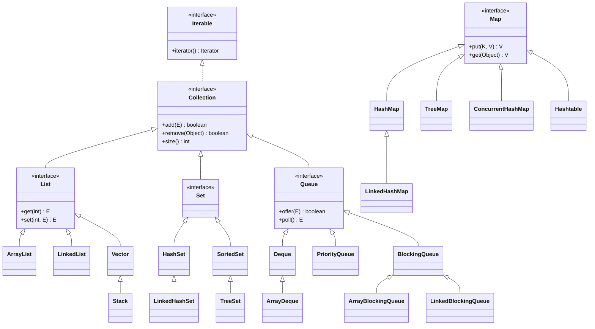
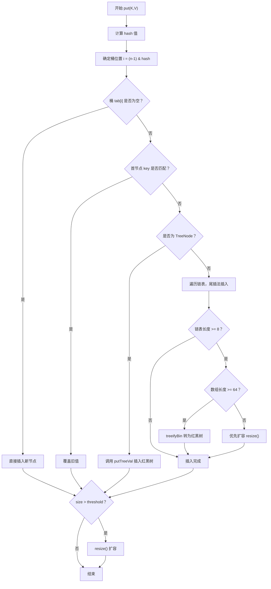
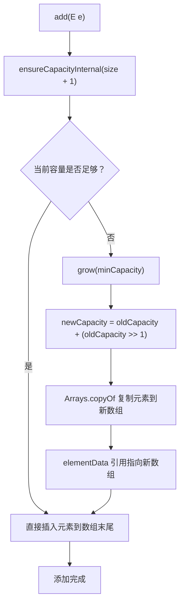

# 面向对象与集合框架

> 学习路线对应：第1周 -- Java 语言核心
> 前置知识：Python/JS 基础语法（变量、循环、函数）
> 预计学习时间：2-3 天

> **视频章节对应**：尚硅谷宋红康《Java零基础入门教程》第11章（集合框架）和第12章（数据结构与集合源码）。面向对象基础部分请参考 [05-面向对象基础](./05-面向对象基础.md)。

## 一、核心概念

### 1.1 Java 面向对象四要素

| 要素 | 说明 | 代码体现 |
|------|------|---------|
| **封装** | 隐藏内部实现细节，对外暴露接口 | `private` 字段 + `public` getter/setter |
| **继承** | 子类复用父类的属性和方法 | `extends` 关键字，单继承 |
| **多态** | 同一方法调用在不同对象上表现不同行为 | 方法重写（override）+ 父类引用指向子类对象 |
| **抽象** | 提取共性，忽略细节 | `abstract` 类 / `interface` |

> **生活化类比：面向对象四要素 = 银行 + 父子 + 翻译官 + 菜谱**
> - **封装**就像银行的 ATM 机——你只看到取款按钮（public 接口），看不到里面的钞箱、密码校验逻辑（private 实现）；钞箱坏了不会影响你取款体验。
> - **继承**就像子女继承父母的姓氏和基因，可以直接复用而不必重新创造；父类是"模板"，子类在模板上做扩展。
> - **多态**就像"开车"这个动作，无论是开小汽车、卡车还是公交车，操作都是踩油门和刹车（同一方法调用），但实际表现完全不同（不同对象不同行为）。
> - **抽象**就像菜谱只写"放盐适量"不写具体几克，留下实现细节给具体菜品决定；abstract 类/interface 定义"做什么"，子类决定"怎么做"。

> 📖 **参考链接**：
> - [Oracle Java Tutorial: Classes and Inheritance](https://docs.oracle.com/javase/tutorial/java/javaOO/index.html)
> - [Oracle Java Tutorial: Interfaces and Inheritance](https://docs.oracle.com/javase/tutorial/java/IandI/index.html)
> - [JLS §8: Classes（Java 语言规范 - 类）](https://docs.oracle.com/javase/specs/jls/se17/html/jls-8.html)
> - [JLS §9: Interfaces（Java 语言规范 - 接口）](https://docs.oracle.com/javase/specs/jls/se17/html/jls-9.html)

### 1.2 集合框架全景

Java 集合框架分为两大体系：

```
Collection（单列集合）                Map（双列集合）
├── List（有序、可重复）              ├── HashMap（哈希表，无序）
│   ├── ArrayList（数组）              ├── LinkedHashMap（哈希表+链表，有序）
│   ├── LinkedList（双向链表）          ├── TreeMap（红黑树，排序）
│   └── Vector（线程安全，已废弃）       ├── ConcurrentHashMap（线程安全）
├── Set（无序、不可重复）               └── Hashtable（线程安全，已废弃）
│   ├── HashSet（HashMap 封装）
│   ├── LinkedHashSet（LinkedHashMap 封装）
│   └── TreeSet（TreeMap 封装）
└── Queue（队列）
    ├── LinkedList（也实现了 Deque）
    ├── ArrayDeque（循环数组双端队列）
    └── PriorityQueue（优先队列）
```

**集合框架继承关系图：**



> 上图展示了 Java 集合框架的核心继承关系。`Collection` 接口继承自 `Iterable`，下分 `List`、`Set`、`Queue` 三大体系；`Map` 是独立的双列集合体系。注意 `LinkedList` 同时实现了 `List` 和 `Deque`，是典型的"多面手"。`Vector` 及其子类 `Stack` 虽然仍可用，但已不推荐使用，建议用 `ArrayList`/`ArrayDeque` 替代。

> **生活化类比：集合框架 = 厨房工具套装**
> - `List` 就像**菜谱本**——内容有顺序，可重复记录同一道菜，能翻到第 N 页（按索引访问）。
> - `Set` 就像**调料盒里的调料**——不能有重复（一罐盐就够了），无序排列。
> - `Queue` 就像**食堂打饭排队**——先来的先打饭（FIFO），也有优先队列（VIP 窗口先打）。
> - `Map` 就像**通讯录**——按名字（key）查电话（value），名字不能重复，电话可以。
> - `ArrayList` 像**一排连续的储物柜**，定位快但要搬动整排才能插入；`LinkedList` 像**手拉手的小朋友队伍**，插入快但要顺着找。
> - `HashMap` 像**图书馆按编号分箱**，hash 冲突时一个箱子里有多本书（链表），箱子书太多时改用书架分类（红黑树）。

> 📖 **参考链接**：
> - [Oracle Java Tutorial: Collections 概览](https://docs.oracle.com/javase/tutorial/collections/index.html)
> - [Oracle Java Tutorial: Collections 接口](https://docs.oracle.com/javase/tutorial/collections/interfaces/index.html)
> - [Oracle Java Tutorial: Collections 实现](https://docs.oracle.com/javase/tutorial/collections/implementations/index.html)
> - [Java SE 17 API: java.util 包](https://docs.oracle.com/javase/17/docs/api/java.base/java/util/package-summary.html)

### 1.3 与 Python/JS 对比

| Java | Python | JavaScript |
|------|--------|------------|
| `List` (ArrayList) | `list` | `Array` |
| `Map` (HashMap) | `dict` | `Object` / `Map` |
| `Set` (HashSet) | `set` | `Set` |
| `Queue` (LinkedList) | `collections.deque` | 数组模拟 |

> 📖 **参考链接**：
> - [Oracle Java Tutorial: Collections 实现 - 何时使用哪个](https://docs.oracle.com/javase/tutorial/collections/implementations/index.html)
> - [Java SE 17 API: Collection 接口](https://docs.oracle.com/javase/17/docs/api/java.base/java/util/Collection.html)

---

## 二、底层原理

### 2.1 HashMap 源码深度解析

#### 底层数据结构：数组 + 链表 + 红黑树

```
JDK 7：Entry[] 数组 + 单向链表（头插法）
JDK 8：Node[] 数组 + 单向链表 + 红黑树（尾插法）
```

**核心常量：**

```java
static final int DEFAULT_INITIAL_CAPACITY = 1 << 4; // 默认容量 16
static final float DEFAULT_LOAD_FACTOR = 0.75f;      // 负载因子
static final int TREEIFY_THRESHOLD = 8;               // 链表树化阈值
static final int UNTREEIFY_THRESHOLD = 6;             // 红黑树退化阈值
static final int MIN_TREEIFY_CAPACITY = 64;           // 最小树化数组容量
```

#### hash() 扰动函数

```java
static final int hash(Object key) {
    int h;
    return (key == null) ? 0 : (h = key.hashCode()) ^ (h >>> 16);
}
```

**设计意图：** 下标计算使用 `(n - 1) & hash`，当 n 较小时（如 16），只有低 4 位参与运算。扰动函数将高 16 位与低 16 位异或，使得高位特性融入低位，降低碰撞概率。

#### put() 完整流程

```
1. 计算 key 的 hash 值
2. 判断 table 是否为 null，是则 resize() 初始化
3. 根据 hash 计算下标 i = (n-1) & hash
4. 若 tab[i] 为空，直接插入新节点
5. 若不为空：
   - 判断首节点 key 是否匹配（相等则覆盖）
   - 判断是否为 TreeNode（红黑树则调用 putTreeVal）
   - 否则遍历链表，尾插法插入
   - 链表长度 >= 8 时，调用 treeifyBin 转为红黑树
6. 若 key 已存在，覆盖旧值并返回
7. ++modCount, ++size，若 size > threshold 则 resize() 扩容
```

#### resize() 扩容机制

- **容量翻倍：** 新容量 = 旧容量 * 2
- **JDK 7 头插法：** 多线程扩容时链表反转，可能形成循环引用导致死循环（CPU 100%）
- **JDK 8 尾插法 + 高低位拆分：** 通过 `e.hash & oldCap` 判断节点在新数组中的位置（0 = 原位，1 = 原位置 + oldCap），保持原有顺序，避免死循环

#### 为什么容量是 2 的幂？

1. `(n - 1) & hash` 等价于 `hash % n`，但位运算效率更高
2. 扩容时 `e.hash & oldCap` 能快速判断节点在新数组中的位置
3. `tableSizeFor()` 方法保证任何传入容量都会向上取整为 2 的幂

#### 树化与退化条件

- **树化条件：** 链表长度 >= 8 **且** 数组长度 >= 64（若数组长度 < 64，优先扩容）
- **退化条件：** 扩容时红黑树拆分后节点数 <= 6，转为链表
- **为什么选 8？** 根据泊松分布，当负载因子为 0.75 时，链表长度达到 8 的概率约为 0.00000006（亿分之六），几乎不可能发生

#### 负载因子 0.75 的数学依据

- 空间利用率 vs 时间效率的折中
- 负载因子越大，空间利用率越高，但哈希冲突概率增大
- 负载因子越小，冲突概率越低，但空间浪费严重
- 当 loadFactor = 0.75 时，根据泊松分布，期望冲突次数可接受

**HashMap JDK 1.8 插入流程图：**



> 上图完整展示了 HashMap 在 JDK 1.8 中的 put 操作流程：从哈希计算开始，经过扰动函数优化后定位桶位置，根据桶状态（空桶、冲突、红黑树）分别处理，最后进行扩容检查。理解此流程是掌握 HashMap 底层原理的关键。

> **生活化类比：HashMap = 银行保险箱库房**
> - **数组 + 链表 + 红黑树**就像银行的保险箱库房：库房是一排排编号的保险箱（数组），每个箱子内部可以挂多把钥匙（链表）；当某个箱子的钥匙太多时，升级为带分类标签的钥匙柜（红黑树）方便查找。
> - **hash 扰动函数**就像"身份证号 → 保险箱编号"的算法，要把高低位混合防止大量人集中在一个箱子。
> - **负载因子 0.75**就像"库房装到 75% 满就要扩建"，太满会冲突，太空会浪费。
> - **容量必须 2 的幂**就像"保险箱数量只能是 16、32、64..."，这样用位运算 `(n-1) & hash` 就能瞬间定位，比取模快。
> - **树化阈值 8**就像"一个箱子的钥匙超过 8 把就要换柜子"，但库房整体不够大（< 64）时优先扩建而非换柜。
> - **resize 高低位拆分**就像扩建后重新分配钥匙——原来箱子里的钥匙要么留原位，要么搬到"原位置 + 旧库房大小"的新箱子，无需重新 hash。

> 📖 **参考链接**：
> - [Java SE 17 API: HashMap](https://docs.oracle.com/javase/17/docs/api/java.base/java/util/HashMap.html)
> - [Java SE 17 API: Map.Entry](https://docs.oracle.com/javase/17/docs/api/java.base/java/util/Map.Entry.html)
> - [Oracle Java Tutorial: Map 实现](https://docs.oracle.com/javase/tutorial/collections/implementations/map.html)
> - [JLS §4.12.2: Variables of Reference Type（变量类型）](https://docs.oracle.com/javase/specs/jls/se17/html/jls-4.html#jls-4.12)

### 2.2 ConcurrentHashMap 源码深度解析

#### JDK 7：Segment 分段锁

```java
// 默认 16 个 Segment，每个 Segment 继承 ReentrantLock
final Segment<K,V>[] segments;

static final class Segment<K,V> extends ReentrantLock {
    transient volatile HashEntry<K,V>[] table;
}
```

- 每个 Segment 内部是一个独立的 HashMap
- 并发度 = Segment 数量，最多支持 16 个线程同时写入不同 Segment
- `get()` 不需要加锁，因为 `HashEntry.value` 和 `next` 都是 `volatile`

#### JDK 8：CAS + synchronized

```java
// 废弃 Segment，直接对桶头节点加锁
transient volatile Node<K,V>[] table;

static class Node<K,V> implements Map.Entry<K,V> {
    final int hash;
    final K key;
    volatile V val;        // volatile 保证可见性
    volatile Node<K,V> next; // volatile 保证可见性
}
```

**核心设计：**
- 空桶使用 CAS 操作插入，无需加锁
- 非空桶对桶头节点加锁（synchronized），锁粒度降低到单个桶级别
- 并发度理论上等于桶数量，远高于 JDK 7

**putVal() 的 4 种桶状态处理：**

| 桶状态 | 处理方式 |
|--------|---------|
| 空桶 | CAS 直接插入（`casTabAt`） |
| hash == MOVED（ForwardingNode） | 正在扩容，调用 `helpTransfer` 协助扩容 |
| 链表头节点 | `synchronized(f)` 加锁，遍历链表插入 |
| TreeBin（红黑树） | `synchronized(f)` 加锁，调用 `putTreeVal` |

**sizeCtl 多重语义：**

| sizeCtl 值 | 含义 |
|------------|------|
| 0 | 默认值，使用 DEFAULT_CAPACITY (16) 初始化 |
| > 0 | 初始化后，表示下一次扩容的阈值 |
| -1 | 正在初始化 table |
| -(1 + n) | 有 n 个线程正在协助扩容 |

#### 渐进式扩容 transfer

- 扩容时，已完成迁移的桶被替换为 `ForwardingNode`（hash = MOVED = -1）
- 其他线程读取到 `ForwardingNode` 时，会去新数组查找
- 其他线程写入时检测到 `ForwardingNode`，会调用 `helpTransfer` 协助扩容
- 每个线程通过 `transferIndex` 领取一段桶区间，用 CAS 更新，确保区间不重叠

#### 为什么 get() 不需要加锁？

1. `Node.val` 和 `Node.next` 都是 `volatile` 修饰的，保证可见性
2. `table` 数组也是 `volatile` 的，扩容时数组引用更新对其他线程立即可见
3. 扩容时旧桶替换为 `ForwardingNode`，`find()` 方法会去新数组查找

#### 计数方案：baseCount + CounterCell 数组

- 先尝试 CAS 更新 `baseCount`
- CAS 失败后，随机选择一个 `CounterCell` 进行累加（LongAdder 分段计数思想）
- 读取总数时，将 `baseCount` 和所有 `CounterCell` 的值求和
- 通过 `@sun.misc.Contended` 避免伪共享

> **生活化类比：ConcurrentHashMap = 多窗口银行 + 流水线扩建**
> - **JDK 7 分段锁**就像银行分 16 个独立窗口，每个窗口自己有锁，最多 16 人同时办理；想换窗口必须重新排队。
> - **JDK 8 CAS + synchronized**就像银行改为"每个柜台单独加锁"，空柜台直接进去（CAS），有人的柜台锁门排队（synchronized），并发度从 16 涨到柜台总数。
> - **ForwardingNode**就像"本窗口搬迁，请到新窗口办理"的指示牌，读请求看到指示牌就自动去新库房找，写请求看到指示牌会主动过来帮忙搬。
> - **CounterCell 数组计数**就像超市多个收银台分别记账，最后把所有收银台的钱汇总，避免所有人都抢着写一个总账本（baseCount）造成冲突。

> 📖 **参考链接**：
> - [Java SE 17 API: ConcurrentHashMap](https://docs.oracle.com/javase/17/docs/api/java.base/java/util/concurrent/ConcurrentHashMap.html)
> - [Java SE 17 API: ConcurrentMap 接口](https://docs.oracle.com/javase/17/docs/api/java.base/java/util/concurrent/ConcurrentMap.html)
> - [Oracle Java Tutorial: Concurrency - Collections](https://docs.oracle.com/javase/tutorial/essential/concurrency/collections.html)
> - [JVM Spec §2.5: Memory Area（内存区域，volatile 语义）](https://docs.oracle.com/javase/specs/jvms/se17/html/jvms-2.html#jvms-2.5)

### 2.3 ArrayList vs LinkedList

| 维度 | ArrayList | LinkedList |
|------|-----------|------------|
| **底层数据结构** | `Object[]` 动态数组 | 双向链表（Node 含 prev/next） |
| **随机访问** | O(1) | O(n)（从近端遍历优化：判断index在前半段还是后半段，从更近的一端开始遍历） |
| **头部插入/删除** | O(n) | O(1) |
| **尾部插入** | 均摊 O(1) | O(1) |
| **中间插入/删除** | O(n) | O(1)（前提是已知位置） |
| **内存占用** | 紧凑，仅存储元素引用 | 每个节点额外存储 prev/next 指针 |
| **扩容策略** | 1.5 倍（`oldCapacity + (oldCapacity >> 1)`） | 无需扩容 |
| **缓存友好度** | 高（连续内存） | 低（节点分散） |
| **线程安全** | 否 | 否 |

**选型决策：**

| 场景 | 推荐 | 原因 |
|------|------|------|
| 频繁随机访问 | ArrayList | O(1) 数组访问 |
| 尾部追加 | ArrayList | 均摊 O(1)，内存连续 |
| 头部插入/删除 | LinkedList | O(1) |
| 需要栈/队列/双端队列 | **ArrayDeque**（优先）或 LinkedList | ArrayDeque 基于循环数组，性能更好 |
| 内存敏感 | ArrayList | LinkedList 每个节点有额外指针开销 |

**ArrayList 扩容流程图：**



> ArrayList 扩容的核心是 1.5 倍增长策略（`oldCapacity + (oldCapacity >> 1)`），通过 `Arrays.copyOf` 将原数组元素复制到新数组，本质上是创建更大的数组并迁移数据，因此频繁扩容会带来性能开销，建议在已知大小时预先指定容量。

> **生活化类比：ArrayList vs LinkedList = 公交车 vs 手拉手小朋友**
> - **ArrayList 像一辆公交车**：座位编号（索引）连续，要找第 N 个座位一秒定位（O(1) 随机访问）；但中途要插一个人进来，所有人都要往后挪（O(n) 插入）；车满了要换一辆更大的车（1.5 倍扩容）。
> - **LinkedList 像手拉手排队的小朋友**：每个人只记得前后是谁（prev/next 指针），要找第 N 个小朋友必须从队头/队尾数过去（O(n) 随机访问）；但要在中间插一个新小朋友，只要断开两只手重新牵（O(1) 插入）；不用考虑"队伍满了"（无扩容）。
> - **ArrayDeque 像环形跑道**：固定大小的环形场地，头尾都能进出（双端队列），既比 LinkedList 省内存又比 ArrayList 头部插入快，是栈/队列场景的"性价比之王"。
> - **CPU 缓存友好度**：ArrayList 像连续的座位，CPU 一次加载一段座位附近的人（缓存预取）；LinkedList 像散落在校园各处的小朋友，找下一个要重新查地址，CPU 缓存命中率低，实际性能差距比理论复杂度更大。

> 📖 **参考链接**：
> - [Java SE 17 API: ArrayList](https://docs.oracle.com/javase/17/docs/api/java.base/java/util/ArrayList.html)
> - [Java SE 17 API: LinkedList](https://docs.oracle.com/javase/17/docs/api/java.base/java/util/LinkedList.html)
> - [Java SE 17 API: ArrayDeque](https://docs.oracle.com/javase/17/docs/api/java.base/java/util/ArrayDeque.html)
> - [Oracle Java Tutorial: List 实现](https://docs.oracle.com/javase/tutorial/collections/implementations/list.html)

---

## 三、实战应用

### 3.1 HashMap 使用注意事项

```java
// 1. 预知容量，避免扩容
int expectedSize = 100;
Map<String, Integer> map = new HashMap<>((int)(expectedSize / 0.75f) + 1);

// 2. 自定义对象作为 key 必须重写 equals 和 hashCode
Map<Person, String> personMap = new HashMap<>();
Person p1 = new Person("张三", 25);
Person p2 = new Person("张三", 25);
personMap.put(p1, "员工A");
personMap.get(p2); // 若没有正确重写 hashCode/equals，返回 null

// 3. JDK 8 新方法
map.computeIfAbsent("Java组", k -> new ArrayList<>()).add("张三");
map.getOrDefault("D", 0);
map.putIfAbsent("A", 100);
map.compute("B", (k, v) -> v == null ? 0 : v * 10);
map.merge("C", 3, Integer::sum);
```

> 📖 **参考链接**：
> - [Java SE 17 API: HashMap.computeIfAbsent](https://docs.oracle.com/javase/17/docs/api/java.base/java/util/HashMap.html#computeIfAbsent(java.lang.Object,java.util.function.Function))
> - [Java SE 17 API: Map.merge](https://docs.oracle.com/javase/17/docs/api/java.base/java/util/Map.html#merge(java.lang.Object,java.lang.Object,java.util.function.BiFunction))
> - [Oracle Java Tutorial: Object Ordering（equals/hashCode 约定）](https://docs.oracle.com/javase/tutorial/collections/interfaces/order.html)

### 3.2 ConcurrentHashMap 并发场景

```java
// 高并发计数器（computeIfAbsent 保证原子性）
ConcurrentHashMap<String, LongAdder> counter = new ConcurrentHashMap<>();
counter.computeIfAbsent("key", k -> new LongAdder()).increment();

// 本地缓存实现
ConcurrentHashMap<String, CacheEntry> cache = new ConcurrentHashMap<>();
String result = cache.compute("key", (k, v) -> {
    if (v == null || v.isExpired()) {
        return new CacheEntry(loadFromDB(k), System.currentTimeMillis() + 60000);
    }
    return v;
}).data;
```

> 📖 **参考链接**：
> - [Java SE 17 API: ConcurrentHashMap.compute](https://docs.oracle.com/javase/17/docs/api/java.base/java/util/concurrent/ConcurrentHashMap.html#compute(java.lang.Object,java.util.function.BiFunction))
> - [Java SE 17 API: LongAdder](https://docs.oracle.com/javase/17/docs/api/java.base/java/util/concurrent/atomic/LongAdder.html)
> - [Oracle Java Tutorial: Atomic Variables](https://docs.oracle.com/javase/tutorial/essential/concurrency/atomicvars.html)

---

## 四、常见面试题（附答案）

### 1. HashMap 为什么线程不安全？ConcurrentHashMap 如何保证线程安全？

**HashMap 线程不安全的表现：**
- 多线程 put 时可能导致数据丢失（两个线程同时 put 到同一个空桶，后一个覆盖前一个）
- JDK 7 扩容时头插法导致链表反转，多线程下可能形成循环引用，`get()` 时 CPU 100%

**ConcurrentHashMap 线程安全实现：**
- JDK 7：Segment 分段锁（继承 ReentrantLock），16 个 Segment，锁粒度是 Segment
- JDK 8：CAS + synchronized，空桶 CAS 插入，非空桶对桶头节点加锁，锁粒度是单个 Node

### 2. ArrayList 和 LinkedList 的区别？什么场景用哪个？

- ArrayList 基于数组，随机访问 O(1)，插入删除 O(n)；LinkedList 基于双向链表，随机访问 O(n)，插入删除 O(1)
- 频繁随机访问用 ArrayList；头部插入/删除用 LinkedList；尾部追加用 ArrayList
- 需要栈/队列时优先使用 ArrayDeque（循环数组，性能优于 LinkedList）

### 3. HashMap 的扩容机制？为什么容量是 2 的幂？

- 扩容时容量翻倍（newCap = oldCap << 1），阈值也翻倍
- JDK 8 通过 `e.hash & oldCap` 判断节点位置（0 = 原位，1 = 原位置 + oldCap）
- 容量是 2 的幂的原因：① `(n-1) & hash` 等价于 `hash % n` 但效率更高；② 扩容时高低位拆分简单高效

### 4. 为什么重写 equals 必须重写 hashCode？

HashMap 先用 `hashCode` 定位桶，再用 `equals` 比较。若两个对象 `equals` 相等但 `hashCode` 不同，会导致相同的 key 存储在不同桶中，违反了 HashMap 的约定（相同 key 唯一）。Java 规范要求：`equals` 相等的对象必须具有相同的 `hashCode`。

> 📖 **参考链接**：
> - [Java SE 17 API: Object.hashCode 契约](https://docs.oracle.com/javase/17/docs/api/java.base/java/lang/Object.html#hashCode())
> - [JLS §4.3.2: The Class Object（equals/hashCode 约定）](https://docs.oracle.com/javase/specs/jls/se17/html/jls-4.html#jls-4.3.2)
> - [Oracle Java Tutorial: Object Ordering](https://docs.oracle.com/javase/tutorial/collections/interfaces/order.html)

---

## 五、避坑指南

| 常见错误 | 现象 | 原因 | 解决方案 |
|---------|------|------|---------|
| HashMap 多线程 put（JDK 7） | CPU 100%，get() 或 put() 时 while 循环无法退出 | JDK 7 扩容使用头插法，多线程扩容时链表反转形成循环引用（A -> B -> A） | 使用 ConcurrentHashMap 替代；升级到 JDK 8（尾插法+高低位拆分）；使用 Collections.synchronizedMap() 包装 |
| ArrayList 遍历时删除元素 | 抛出 ConcurrentModificationException | for-each 循环内部使用迭代器，直接调用 list.remove() 导致 modCount 不一致 | 使用 Iterator.remove()；使用 JDK 8 removeIf()；从后往前遍历（for 循环） |
| subList 修改原列表 | 对原列表结构性修改后 subList 失效，抛出 ConcurrentModificationException | subList 是原列表的视图，非独立副本 | 创建独立副本：`new ArrayList<>(list.subList(1, 4))` |

---

## 本章学习自检

完成本章学习后，应该能够：
- [ ] 用自己的话解释面向对象四要素、HashMap 底层原理（数组+链表+红黑树）、ConcurrentHashMap 线程安全机制
- [ ] 手写 HashMap 的 put 流程、ArrayList 遍历删除的正确写法
- [ ] 回答常见面试题（HashMap 扩容机制、ConcurrentHashMap 分段锁演进、equals 与 hashCode 关系等）
- [ ] 在实战项目中根据场景灵活选用 ArrayList / LinkedList / HashMap / ConcurrentHashMap
- [ ] 识别并避免常见错误（HashMap 多线程死循环、遍历时删除 ConcurrentModificationException、subList 陷阱等）

---

> **学习导航**：
> - 返回 [学习路线总览](../../README.md)
> - 前置学习：[05-面向对象基础](./05-面向对象基础.md) | [07-常用类与基础API](./07-常用类与基础API.md)
> - 本模块其他文件：[17-Java核心笔面试题集](./17-Java核心笔面试题集.md)
> - 实战应用：[电商订单实时统计分析平台](../../extensions/project/01-电商订单实时统计分析平台.md)

