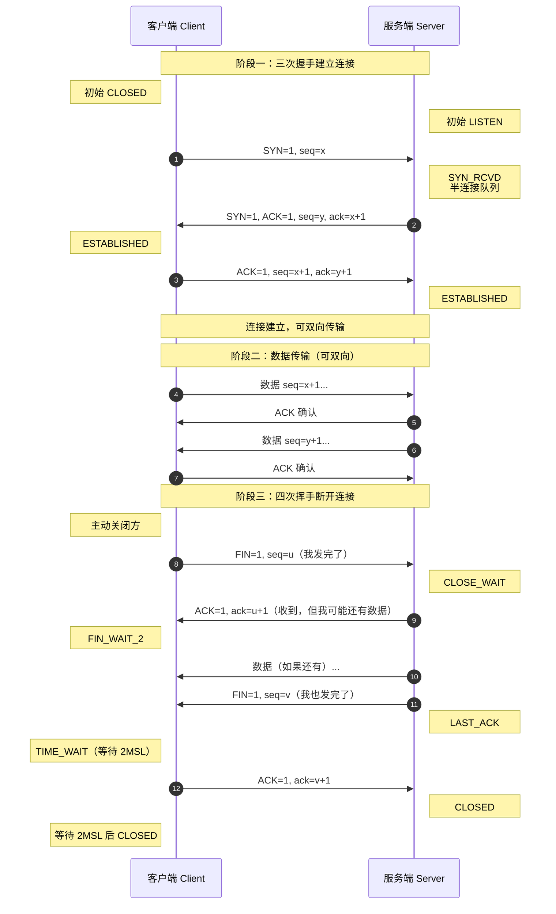

# 网络编程

> 学习路线对应：第1周 -- Java 语言核心
> 前置知识：面向对象、IO流
> 预计学习时间：2-3 天
>
> **视频章节对应**：尚硅谷宋红康《Java零基础入门教程》第14章 -- 网络编程

---

## 一、核心概念

### 1.1 网络编程三要素

网络编程是指在不同设备之间通过网络进行数据通信的编程技术。实现网络通信需要三个核心要素：

**1. IP 地址**
- 标识网络中的唯一设备
- IPv4：32位，形如 `192.168.1.1`，约 42 亿个地址
- IPv6：128位，解决地址枯竭问题
- `127.0.0.1`：本地回环地址，代表本机
- `localhost`：域名，默认解析到 `127.0.0.1`

**2. 端口号**
- 标识设备上的应用进程
- 范围：0 ~ 65535（16位整数）
- 分类：
  - 知名端口（0 ~ 1023）：系统预留，如 80(HTTP)、443(HTTPS)、21(FTP)、22(SSH)
  - 注册端口（1024 ~ 49151）：应用程序使用，如 3306(MySQL)、8080(Tomcat)
  - 动态端口（49152 ~ 65535）：动态分配给客户端

**3. 传输协议**
- 规定数据的传输格式和规则
- 两大主流协议：**TCP** 和 **UDP**

| TCP | UDP |
|-----|-----|
| 面向连接 | 无连接 |
| 可靠传输（三次握手建立连接，四次挥手断开连接） | 不可靠传输 |
| 字节流 | 数据报 |
| 开销大，速度较慢 | 开销小，速度快 |
| 适合大文件传输、需要可靠传输的场景 | 适合视频直播、语音通话、广播等对速度要求高的场景 |

> **生活化类比：网络编程三要素 = 寄快递的三个关键**
> - **IP 地址**就像"收件人地址"——标识网络中唯一的一台设备（一栋楼），没有地址快递员不知道往哪送。
> - **端口号**就像"门牌号"——一栋楼里可能有很多人（多个进程），门牌号决定快递送给哪个进程；知名端口（0-1023）是"公共服务区"（HTTP 80、HTTPS 443），注册端口是"公司前台"（MySQL 3306），动态端口是"临时客房"。
> - **协议**就像"快递服务类型"——TCP 是"挂号信"（必须签收、保价、按顺序到达），UDP 是"平信"（丢就丢了，但快、便宜，适合广告投递）。
> - **`127.0.0.1` 本地回环**：像"自己给自己写信"——信不走出楼，直接从门口绕回自家邮箱，用于本机测试。

> 📖 **参考链接**：
> - [Oracle Java Tutorial: All About Sockets](https://docs.oracle.com/javase/tutorial/networking/sockets/index.html)
> - [Oracle Java Tutorial: Working with URLs](https://docs.oracle.com/javase/tutorial/networking/urls/index.html)
> - [Java SE 17 API: java.net 包](https://docs.oracle.com/javase/17/docs/api/java.base/java/net/package-summary.html)
> - [Java SE 17 API: InetAddress](https://docs.oracle.com/javase/17/docs/api/java.base/java/net/InetAddress.html)

### 1.2 InetAddress 类

`java.net.InetAddress` 类用于表示 IP 地址。

**常用方法：**

```java
// 获取本机 InetAddress 对象
InetAddress localhost = InetAddress.getByName("localhost");
InetAddress localHost = InetAddress.getLocalHost();

// 根据域名获取 IP 地址
InetAddress baidu = InetAddress.getByName("www.baidu.com");

// 根据 IP 字符串获取对象
InetAddress ip = InetAddress.getByName("192.168.1.1");

// 获取主机名
String hostName = address.getHostName();

// 获取 IP 地址字符串
String hostAddress = address.getHostAddress();

// 判断是否可达（ping 效果）
boolean reachable = address.isReachable(5000); // 超时 5 秒
```

> **生活化类比：InetAddress = 通讯录联系人**
> - `getByName("www.baidu.com")` 像"在通讯录查百度这个人的电话号码"（域名 → IP）。
> - `getLocalHost()` 像"查我自己的电话号码"。
> - `getHostName()` / `getHostAddress()` 像"分别取联系人的姓名和电话"。
> - `isReachable(5000)` 像"打电话过去 5 秒内有人接就说明对方在线"——底层是 ICMP ping。

> 📖 **参考链接**：
> - [Java SE 17 API: InetAddress 详解](https://docs.oracle.com/javase/17/docs/api/java.base/java/net/InetAddress.html)
> - [Oracle Java Tutorial: Working with URLs（含地址解析）](https://docs.oracle.com/javase/tutorial/networking/urls/index.html)

### 1.3 TCP 编程（Socket / ServerSocket）

TCP 是面向连接的可靠传输协议，Java 中基于 `Socket` 和 `ServerSocket` 实现。

**通信模型：**
```
客户端 (Client)                 服务端 (Server)
     Socket                  ServerSocket (等待连接)
       |                            |
       |-------- 连接请求 --------->| accept()
       |                            |
       |<------- 连接建立 ---------->|  返回 Socket
       |                            |
       |  通过 Socket.getInputStream()  / getOutputStream() 读写数据
       |                            |
       |----------- 关闭 ----------->|
```

**核心类：**

| 类 | 作用 | 角色 |
|----|------|------|
| `ServerSocket` | 监听指定端口，接受客户端连接 | 服务端 |
| `Socket` | 表示连接套接字，提供 IO 流读写 | 客户端 + 服务端 |

**服务端代码框架：**
```java
// 1. 创建 ServerSocket，绑定端口
ServerSocket serverSocket = new ServerSocket(8888);
System.out.println("服务端启动，等待客户端连接...");

// 2. 阻塞等待客户端连接，返回客户端 Socket
Socket socket = serverSocket.accept();
System.out.println("客户端连接成功：" + socket.getInetAddress());

// 3. 获取输入流，读取客户端发送的数据
InputStream is = socket.getInputStream();
BufferedReader br = new BufferedReader(new InputStreamReader(is, StandardCharsets.UTF_8));
String line = br.readLine();
System.out.println("客户端说：" + line);

// 4. 获取输出流，发送响应给客户端
OutputStream os = socket.getOutputStream();
BufferedWriter bw = new BufferedWriter(new OutputStreamWriter(os, StandardCharsets.UTF_8));
bw.write("你好，客户端！我收到消息了");
bw.newLine();
bw.flush();

// 5. 关闭资源
bw.close();
os.close();
br.close();
is.close();
socket.close();
serverSocket.close();
```

**客户端代码框架：**
```java
// 1. 创建 Socket，连接指定 IP 和端口
Socket socket = new Socket("127.0.0.1", 8888);

// 2. 获取输出流，发送数据给服务端
OutputStream os = socket.getOutputStream();
BufferedWriter bw = new BufferedWriter(new OutputStreamWriter(os, StandardCharsets.UTF_8));
bw.write("你好，服务端！");
bw.newLine();
bw.flush();

// 3. 获取输入流，读取服务端响应
InputStream is = socket.getInputStream();
BufferedReader br = new BufferedReader(new InputStreamReader(is, StandardCharsets.UTF_8));
String response = br.readLine();
System.out.println("服务端响应：" + response);

// 4. 关闭资源
br.close();
is.close();
bw.close();
os.close();
socket.close();
```

> **生活化类比：TCP 编程 = 打电话**
> - **服务端 `ServerSocket`** 像客服坐席——一直守在 8888 号分机（端口）旁等电话。
> - **`accept()`** 像"接起电话"——电话没来就一直阻塞等，电话来了就接通并返回一个 `Socket`（通话通道）。
> - **客户端 `new Socket("127.0.0.1", 8888)`** 像"拨号"——主动呼叫指定 IP 的指定分机。
> - **`getInputStream()` / `getOutputStream()`** 像"听筒"和"话筒"——一个听对方说话，一个对自己说话；通信是双向的。
> - **`BufferedWriter.newLine() + flush()`** 像"说完一句话按发送键"——newline 是分隔符（解决粘包），flush 是强制发送（不攒着）。
> - **`close()`** 像"挂电话"——释放通话通道；不挂的话对方会一直等。

> 📖 **参考链接**：
> - [Oracle Java Tutorial: What Is a Socket?](https://docs.oracle.com/javase/tutorial/networking/sockets/definition.html)
> - [Oracle Java Tutorial: Reading from and Writing to a Socket](https://docs.oracle.com/javase/tutorial/networking/sockets/readingWriting.html)
> - [Java SE 17 API: Socket](https://docs.oracle.com/javase/17/docs/api/java.base/java/net/Socket.html)
> - [Java SE 17 API: ServerSocket](https://docs.oracle.com/javase/17/docs/api/java.base/java/net/ServerSocket.html)

### 1.4 UDP 编程（DatagramSocket）

UDP 是无连接的不可靠传输协议，基于数据报（Datagram）发送数据。

**核心类：**

| 类 | 作用 |
|----|------|
| `DatagramSocket` | 发送和接收数据报的套接字 |
| `DatagramPacket` | 数据报包裹，封装数据和地址信息 |

**发送端流程：**
```java
// 1. 创建 DatagramSocket（可以绑定本地端口，不指定则随机分配）
DatagramSocket socket = new DatagramSocket();

// 2. 准备数据
String data = "Hello UDP!";
byte[] bytes = data.getBytes(StandardCharsets.UTF_8);

// 3. 创建数据报包，指定目标地址和端口
InetAddress address = InetAddress.getByName("127.0.0.1");
DatagramPacket packet = new DatagramPacket(
    bytes,                // 数据字节数组
    bytes.length,        // 数据长度
    address,             // 目标 IP
    9999                 // 目标端口
);

// 4. 发送数据报
socket.send(packet);

// 5. 接收响应（如果需要）
byte[] buffer = new byte[1024];
DatagramPacket responsePacket = new DatagramPacket(buffer, buffer.length);
socket.receive(responsePacket); // 阻塞等待接收
String response = new String(
    responsePacket.getData(),
    0,
    responsePacket.getLength(),
    StandardCharsets.UTF_8
);
System.out.println("收到响应：" + response);

// 6. 关闭
socket.close();
```

**接收端流程：**
```java
// 1. 创建 DatagramSocket，绑定指定端口
DatagramSocket socket = new DatagramSocket(9999);

// 2. 创建空的数据报包用于接收数据
byte[] buffer = new byte[1024];
DatagramPacket packet = new DatagramPacket(buffer, buffer.length);

// 3. 阻塞等待接收数据
socket.receive(packet);

// 4. 解析数据
String received = new String(
    packet.getData(),
    0,
    packet.getLength(),
    StandardCharsets.UTF_8
);
InetAddress senderAddr = packet.getAddress();
int senderPort = packet.getPort();
System.out.println("收到来自 " + senderAddr + ":" + senderPort + " 的消息：" + received);

// 5. 发送响应（如果需要）
String response = "消息已收到";
byte[] responseBytes = response.getBytes(StandardCharsets.UTF_8);
DatagramPacket responsePacket = new DatagramPacket(
    responseBytes,
    responseBytes.length,
    senderAddr,
    senderPort
);
socket.send(responsePacket);

// 6. 关闭
socket.close();
```

> **生活化类比：UDP 编程 = 寄明信片**
> - **`DatagramSocket`** 像邮筒——可以投信也可以收信，不需要和对方建立连接。
> - **`DatagramPacket`** 像明信片——上面写好"内容 + 收件人地址 + 端口"，整张卡片一次寄出。
> - **`send(packet)`** 像"把明信片扔进邮筒"——扔出去就不管了，对方收没收到不知道（不可靠）。
> - **`receive(packet)`** 像"在自家信箱等明信片"——一直等（阻塞），来一张收一张。
> - **与 TCP 的区别**：TCP 像打电话（先拨号建立连接，再双向通话，挂电话要四次挥手）；UDP 像寄明信片（写好地址直接扔邮筒，不用提前联系）。
> - **UDP 适合的场景**：直播、语音通话——丢一两帧画面没关系，但不能卡（延迟低比可靠更重要）。

> 📖 **参考链接**：
> - [Java SE 17 API: DatagramSocket](https://docs.oracle.com/javase/17/docs/api/java.base/java/net/DatagramSocket.html)
> - [Java SE 17 API: DatagramPacket](https://docs.oracle.com/javase/17/docs/api/java.base/java/net/DatagramPacket.html)
> - [Oracle Java Tutorial: All About Sockets（含 UDP 说明）](https://docs.oracle.com/javase/tutorial/networking/sockets/index.html)

### 1.5 URL 编程

`java.net.URL` 类用于统一资源定位符，表示网络上的资源地址，可以直接读取 URL 指向的内容。

**URL 组成：**
```
协议  主机名      端口  路径           参数
http://www.example.com:80/path/file?name=zhangsan
\___/ \____________/ \__/\______/ \____________/
协议   主机名        端口  路径      查询参数
```

**常用方法：**
```java
URL url = new URL("https://www.baidu.com/index.html?wd=java");

String protocol = url.getProtocol(); // http
String host = url.getHost();         // www.baidu.com
int port = url.getPort();           // 443（默认端口根据协议自动推断）
String path = url.getPath();        // /index.html
String query = url.getQuery();      // wd=java
String file = url.getFile();        // /index.html?wd=java
```

**读取 URL 内容：**
```java
URL url = new URL("https://www.example.com");

// 打开连接获取输入流
InputStream is = url.openStream();
BufferedReader br = new BufferedReader(new InputStreamReader(is, StandardCharsets.UTF_8));

String line;
StringBuilder content = new StringBuilder();
while ((line = br.readLine()) != null) {
    content.append(line).append("\n");
}
System.out.println(content);

br.close();
is.close();
```

**HttpURLConnection 发起请求：**
```java
URL url = new URL("https://api.example.com/users");
HttpURLConnection conn = (HttpURLConnection) url.openConnection();

// 设置请求方法
conn.setRequestMethod("GET");

// 设置请求头
conn.setRequestProperty("User-Agent", "Mozilla/5.0");

// 获取响应码
int responseCode = conn.getResponseCode();
System.out.println("响应码：" + responseCode);

// 读取响应内容
InputStream is = conn.getInputStream();
// ... 读取内容

conn.disconnect();
```

> **生活化类比：URL 编程 = 快递单号查物流**
> - **URL** 像一张完整的"快递单"——包含快递公司（协议 http/https）、收件地址（主机名）、楼栋门牌（端口）、楼层位置（路径）、备注（查询参数）。
> - **`url.openStream()`** 像"直接拆开快递取货"——简单粗暴，一气呵成。
> - **`HttpURLConnection`** 像"详细询问快递员"——可以指定 GET/POST、设置请求头、获取响应码、断开连接等精细控制。
> - **`getResponseCode()`** 像查看"快递状态"——200 表示签收成功，404 表示地址查无，500 表示对方公司内部出错。

> 📖 **参考链接**：
> - [Oracle Java Tutorial: URL Basics](https://docs.oracle.com/javase/tutorial/networking/urls/index.html)
> - [Oracle Java Tutorial: Reading Directly from a URL](https://docs.oracle.com/javase/tutorial/networking/urls/readingURL.html)
> - [Oracle Java Tutorial: Connecting via URL](https://docs.oracle.com/javase/tutorial/networking/urls/connecting.html)
> - [Java SE 17 API: URL](https://docs.oracle.com/javase/17/docs/api/java.base/java/net/URL.html)

---

## 二、底层原理

### 2.1 TCP 三次握手与四次挥手

**三次握手（建立连接）：**

```
客户端        服务端
  | -------- SYN --------> |  客户端：SYN=1，seq=x
  | <------- SYN+ACK ------ |  服务端：SYN=1，ACK=1，seq=y，ack=x+1
  | -------- ACK --------> |  客户端：ACK=1，seq=x+1，ack=y+1
```

- **为什么需要三次握手？**
  1. 确认双方都具备发送和接收能力
  2. 同步初始序列号，为后续可靠传输做准备
  3. 防止已过期的连接请求又传送到服务器，造成资源浪费

**四次挥手（断开连接）：**

```
客户端        服务端
  | -------- FIN --------> |  客户端：FIN=1，seq=u （我发完了）
  | <------- ACK ------- |  服务端：ACK=1，ack=u+1
  | <------- FIN ------- |  服务端：FIN=1，seq=v （我也发完了）
  | -------- ACK --------> |  客户端：ACK=1，ack=v+1
```

- **为什么需要四次挥手？**
  - TCP 是全双工通信，双方都需要单独关闭连接
  - 服务端收到 FIN 后，可能还有数据未发送完，不能立即关闭连接

**TCP 三次握手与四次挥手时序图：**



> 上图完整展示了 TCP 连接的生命周期：三次握手（建立连接）→ 数据传输（双向可靠）→ 四次挥手（断开连接）。其中 TIME_WAIT 状态需等待 2MSL（最大报文段寿命），是为了确保最后的 ACK 能到达对方，并让本次连接的所有报文都从网络中消失，避免影响下一个相同四元组的新连接。

> **生活化类比：TCP 三次握手与四次挥手 = 公司签约与解约**
> - **三次握手**就像甲乙双方签约：
>   1. 甲方打电话："我想跟你签合同"（SYN）
>   2. 乙方回应："好的，我也想跟你签，这是我准备的合同"（SYN+ACK）
>   3. 甲方确认："收到你的合同，我们开始合作"（ACK）
>   - 为什么不能两次？如果只两次，乙方说"我准备好了"，但甲方可能没收到就放弃，乙方傻等白浪费资源。
> - **四次挥手**就像甲乙双方解约：
>   1. 甲方："我手头的事做完了，准备走"（FIN）
>   2. 乙方："收到，我还有点尾款要结给你"（ACK）
>   3. 乙方：（处理完尾款）"我这边也搞完了，可以走"（FIN）
>   4. 甲方："好的，再见"（ACK）
>   - 为什么是四次不是三次？因为乙方收到甲方 FIN 时可能还有事没做完，必须先 ACK 表示"知道了"，等自己事做完再单独 FIN。
> - **TIME_WAIT 等 2MSL**：甲方说完"再见"后还要等一会儿，怕乙方没听到"再见"反复问，等够两个最长寿命时间就确保网络里所有报文都消失了。

> 📖 **参考链接**：
> - [RFC 793: Transmission Control Protocol（TCP 协议规范）](https://datatracker.ietf.org/doc/html/rfc793)
> - [Oracle Java Tutorial: All About Sockets](https://docs.oracle.com/javase/tutorial/networking/sockets/index.html)
> - [Java SE 17 API: Socket（TCP 实现）](https://docs.oracle.com/javase/17/docs/api/java.base/java/net/Socket.html)
> - [RFC 9293: TCP 主规范更新](https://datatracker.ietf.org/doc/html/rfc9293)

### 2.2 TCP vs UDP 底层对比

| 对比维度 | TCP | UDP |
|---------|-----|-----|
| 连接 | 面向连接，需要三次握手建立连接 | 无连接，不需要建立连接，直接发送 |
| 可靠性 | 可靠，通过序列号、确认重传机制保证不丢失 | 不可靠，不保证到达，丢包不重传 |
| 有序性 | 通过序列号保证数据按序到达 | 不保证顺序，每个数据报独立 |
| 流量控制 | 滑动窗口实现流量控制，发送方不超过接收方处理能力 | 没有流量控制 |
| 拥塞控制 | 有慢启动、拥塞避免、快重传、快恢复 | 没有拥塞控制 |
| 传输方式 | 字节流，无边界，可拆分拼接 | 数据报，每个数据包独立 |
| 头部开销 | 最小 20 字节 | 固定 8 字节 |
| 适用场景 | 文件传输、网页浏览、邮件、远程登录 | 直播、语音通话、实时游戏、广播、DNS 查询 |

> **生活化类比：TCP vs UDP = 挂号信 vs 明信片**
> - **TCP** 像"挂号信"：要登记（三次握手）、要签收（ACK 确认）、丢件会重发（重传机制）、按顺序到达（序列号）；适合重要文件（合同、转账）。
> - **UDP** 像"明信片"：写好地址扔邮筒就完事，丢就丢了，不管顺序，但快又便宜；适合广告投递（广播）、实时通讯（直播弹幕）。
> - **流量控制 vs 拥塞控制**：流量控制像"收件人告诉发件人：我每天只能收 10 份，别发太多"（滑动窗口）；拥塞控制像"发件人发现路上堵车，主动减少发货量"（慢启动）。
> - **TCP 头部 20 字节 vs UDP 头部 8 字节**：TCP 多出来的字节是用于序列号、确认号、窗口大小、校验和等可靠传输机制；UDP 极简，只够标识端口和长度。

> 📖 **参考链接**：
> - [RFC 768: User Datagram Protocol（UDP 协议规范）](https://datatracker.ietf.org/doc/html/rfc768)
> - [RFC 793: Transmission Control Protocol（TCP 协议规范）](https://datatracker.ietf.org/doc/html/rfc793)
> - [Oracle Java Tutorial: All About Sockets](https://docs.oracle.com/javase/tutorial/networking/sockets/index.html)

### 2.3  Socket 本质

Socket（套接字）是操作系统提供的网络编程接口，是对 TCP/IP 协议的抽象封装。

- **本质：** 对网络中不同主机上的应用进程之间进行双向通信的端点的抽象
- **一个 Socket 包含：** 本地 IP + 本地端口 + 远程 IP + 远程端口 + 协议
- **数据流向：** 通过操作系统内核的 TCP/IP 协议栈处理，最终通过网卡发送到网络

**Java Socket 模型：**
```
Java 应用程序
    |
 Socket API
    |
  JVM
    |
  操作系统内核
    |
  TCP/IP 协议栈
    |
  网卡驱动
    |
  物理网络
```

### 2.4 BIO 模型（阻塞 IO）

Java 原生 TCP 编程默认使用 **BIO（Blocking IO）** 模型：

- `accept()`：阻塞等待客户端连接
- `read()`：阻塞等待数据读取
- `write()`：可能阻塞（内核缓冲区满时）

**单线程 BIO 问题：** 同一时间只能处理一个客户端连接，必须处理完一个才能处理下一个。

**多线程改进方案：** 主线程 `accept()` 接收到新连接后，启动一个新线程处理该客户端的读写。

```
主线程
   |
   ├─> accept() 阻塞等待连接
   |
   └─> 新连接到来
         |
         └> 启动新线程处理该 Socket
               |
               └─> 读写处理...
```

优点：简单实现并发；缺点：每个连接创建一个线程，高并发下线程过多导致内存和上下文切换开销大。

> **生活化类比：BIO 模型 = 银行柜台服务**
> - **单线程 BIO** 像银行只有 1 个柜台——一个客户办业务时，后面所有人排队等（`accept()` 阻塞），效率极差。
> - **多线程 BIO** 像银行开多个柜台——每来一个客户就开一个新柜台（新线程）专门服务他，主柜台继续迎客；但客户多了柜台也多（线程爆炸），银行经理（CPU）在柜台间来回跑（上下文切换）累死。
> - **`accept()` 阻塞**：前台没人时柜员就干等（阻塞），不能干别的活。
> - **`read()` 阻塞**：客户在填表时柜员就干等（阻塞），不能服务其他客户。
> - **本质问题**：一个柜员（线程）只能盯一个客户（连接），但大部分时间客户在思考/填表（IO 等待），柜员利用率极低——这就是 BIO 高并发下性能差的根本原因。

> 📖 **参考链接**：
> - [Oracle Java Tutorial: Concurrency Utilities（高并发处理）](https://docs.oracle.com/javase/tutorial/essential/concurrency/index.html)
> - [Java SE 17 API: ServerSocket.accept](https://docs.oracle.com/javase/17/docs/api/java.base/java/net/ServerSocket.html#accept())
> - [Java SE 17 API: Thread（多线程处理连接）](https://docs.oracle.com/javase/17/docs/api/java.base/java/lang/Thread.html)

---

## 三、实战应用

### 3.1 简单的 Echo 程序（TCP）

客户端发送一行文字，服务端原样返回。

**服务端：**
```java
import java.io.*;
import java.net.ServerSocket;
import java.net.Socket;
import java.nio.charset.StandardCharsets;

public class EchoServer {
    public static void main(String[] args) throws IOException {
        ServerSocket serverSocket = new ServerSocket(8080);
        System.out.println("Echo 服务端启动，端口：8080");
        
        while (!serverSocket.isClosed()) {
            Socket socket = serverSocket.accept();
            System.out.println("新客户端连接：" + socket.getInetAddress());
            
            // 启动新线程处理
            new Thread(() -> handle(socket)).start();
        }
    }
    
    private static void handle(Socket socket) {
        try (
            BufferedReader br = new BufferedReader(
                new InputStreamReader(socket.getInputStream(), StandardCharsets.UTF_8));
            BufferedWriter bw = new BufferedWriter(
                new OutputStreamWriter(socket.getOutputStream(), StandardCharsets.UTF_8))
        ) {
            String line;
            while ((line = br.readLine()) != null) {
                System.out.println("收到：" + line);
                // Echo 回显
                bw.write("[ECHO] " + line);
                bw.newLine();
                bw.flush();
            }
        } catch (IOException e) {
            e.printStackTrace();
        } finally {
            try {
                socket.close();
            } catch (IOException e) {
                e.printStackTrace();
            }
            System.out.println("客户端断开连接");
        }
    }
}
```

**客户端：**
```java
import java.io.*;
import java.net.Socket;
import java.nio.charset.StandardCharsets;
import java.util.Scanner;

public class EchoClient {
    public static void main(String[] args) throws IOException {
        Socket socket = new Socket("127.0.0.1", 8080);
        
        try (
            BufferedReader br = new BufferedReader(
                new InputStreamReader(socket.getInputStream(), StandardCharsets.UTF_8));
            BufferedWriter bw = new BufferedWriter(
                new OutputStreamWriter(socket.getOutputStream(), StandardCharsets.UTF_8));
            Scanner scanner = new Scanner(System.in)
        ) {
            System.out.println("请输入消息（输入 exit 退出）：");
            while (true) {
                System.out.print("> ");
                String input = scanner.nextLine();
                if ("exit".equalsIgnoreCase(input)) {
                    break;
                }
                bw.write(input);
                bw.newLine();
                bw.flush();
                
                String response = br.readLine();
                System.out.println("服务端：" + response);
            }
        } finally {
            socket.close();
        }
    }
}
```

> 📖 **参考链接**：
> - [Oracle Java Tutorial: Writing a Client/Server Pair](https://docs.oracle.com/javase/tutorial/networking/sockets/clientServer.html)
> - [Java SE 17 API: Socket](https://docs.oracle.com/javase/17/docs/api/java.base/java/net/Socket.html)

### 3.2 UDP 广播发送

UDP 支持广播发送，向局域网内所有设备发送消息：

```java
import java.net.*;
import java.nio.charset.StandardCharsets;

public class UdpBroadcastSender {
    public static void main(String[] args) throws Exception {
        DatagramSocket socket = new DatagramSocket();
        
        // 广播地址，局域网内所有设备都会收到
        InetAddress broadcastAddr = InetAddress.getByName("255.255.255.255");
        int port = 8888;
        
        String message = "Hello, this is a broadcast message!";
        byte[] data = message.getBytes(StandardCharsets.UTF_8);
        
        DatagramPacket packet = new DatagramPacket(
            data, data.length, broadcastAddr, port);
        
        // 允许广播
        socket.setBroadcast(true);
        socket.send(packet);
        
        System.out.println("广播消息已发送");
        socket.close();
    }
}
```

接收端：
```java
import java.net.DatagramPacket;
import java.net.DatagramSocket;
import java.nio.charset.StandardCharsets;

public class UdpBroadcastReceiver {
    public static void main(String[] args) throws Exception {
        DatagramSocket socket = new DatagramSocket(8888);
        byte[] buffer = new byte[1024];
        DatagramPacket packet = new DatagramPacket(buffer, buffer.length);
        
        System.out.println("等待接收广播...");
        socket.receive(packet);
        
        String msg = new String(packet.getData(), 0,
            packet.getLength(), StandardCharsets.UTF_8);
        System.out.println("收到广播：" + msg);
        System.out.println("发送方：" + packet.getAddress());
    }
}
```

> 📖 **参考链接**：
> - [Java SE 17 API: DatagramSocket.setBroadcast](https://docs.oracle.com/javase/17/docs/api/java.base/java/net/DatagramSocket.html#setBroadcast(boolean))
> - [Java SE 17 API: DatagramPacket](https://docs.oracle.com/javase/17/docs/api/java.base/java/net/DatagramPacket.html)

### 3.3 项目：多人聊天室

基于 TCP 实现一个简单的多人聊天室，支持：
- 多用户同时连接
- 用户发送消息群发给所有人
- 显示用户上线/下线通知

**项目结构：**
```
chatroom/
├── ChatServer.java      // 服务端主程序
├── ClientHandler.java   // 每个客户端的处理线程
└── ChatClient.java      // 客户端程序
```

**ChatServer.java：**
```java
package com.example.chatroom;

import java.io.IOException;
import java.net.ServerSocket;
import java.net.Socket;
import java.util.ArrayList;
import java.util.List;

public class ChatServer {
    // 保存所有在线客户端处理器
    private static final List<ClientHandler> ONLINE_CLIENTS = new ArrayList<>();
    
    public static void main(String[] args) throws IOException {
        ServerSocket serverSocket = new ServerSocket(9999);
        System.out.println("聊天室服务端启动，端口：9999");
        
        while (!serverSocket.isClosed()) {
            Socket socket = serverSocket.accept();
            ClientHandler handler = new ClientHandler(socket, ChatServer.this);
            addClient(handler);
            new Thread(handler).start();
        }
    }
    
    public synchronized void addClient(ClientHandler handler) {
        ONLINE_CLIENTS.add(handler);
        broadcast(handler.getUsername() + " 已加入聊天室，当前在线人数：" + ONLINE_CLIENTS.size());
    }
    
    public synchronized void removeClient(ClientHandler handler) {
        ONLINE_CLIENTS.remove(handler);
        broadcast(handler.getUsername() + " 已离开聊天室，当前在线人数：" + ONLINE_CLIENTS.size());
    }
    
    public synchronized void broadcast(String message, ClientHandler exclude) {
        for (ClientHandler client : ONLINE_CLIENTS) {
            if (client != exclude) {
                client.send(message);
            }
        }
    }
    
    public void broadcast(String message) {
        broadcast(message, null);
    }
}
```

**ClientHandler.java：**
```java
package com.example.chatroom;

import java.io.*;
import java.net.Socket;
import java.nio.charset.StandardCharsets;

public class ClientHandler implements Runnable {
    private final Socket socket;
    private final ChatServer server;
    private BufferedReader br;
    private BufferedWriter bw;
    private String username;
    
    public ClientHandler(Socket socket, ChatServer server) {
        this.socket = socket;
        this.server = server;
    }
    
    public String getUsername() {
        return username;
    }
    
    public void send(String message) {
        try {
            bw.write(message);
            bw.newLine();
            bw.flush();
        } catch (IOException e) {
            e.printStackTrace();
        }
    }
    
    @Override
    public void run() {
        try {
            br = new BufferedReader(
                new InputStreamReader(socket.getInputStream(), StandardCharsets.UTF_8));
            bw = new BufferedWriter(
                new OutputStreamWriter(socket.getOutputStream(), StandardCharsets.UTF_8));
            
            // 第一步：读取用户名
            username = br.readLine();
            System.out.println("新用户登录：" + username);
            
            // 循环读取客户端消息
            String line;
            while ((line = br.readLine()) != null) {
                if (line.equalsIgnoreCase("/quit")) {
                    break;
                }
                // 广播给其他所有客户端
                server.broadcast(username + ": " + line, this);
            }
        } catch (IOException e) {
            System.out.println(username + " 连接异常断开");
        } finally {
            server.removeClient(this);
            close();
        }
    }
    
    private void close() {
        try {
            if (br != null) br.close();
            if (bw != null) bw.close();
            if (!socket.isClosed()) socket.close();
        } catch (IOException e) {
            e.printStackTrace();
        }
    }
}
```

**ChatClient.java：**
```java
package com.example.chatroom;

import java.io.*;
import java.net.Socket;
import java.nio.charset.StandardCharsets;
import java.util.Scanner;

public class ChatClient {
    private final String host;
    private final int port;
    private Socket socket;
    private BufferedReader br;
    private BufferedWriter bw;
    private String username;
    
    public ChatClient(String host, int port, String username) {
        this.host = host;
        this.port = port;
        this.username = username;
    }
    
    public void connect() throws IOException {
        socket = new Socket(host, port);
        br = new BufferedReader(
            new InputStreamReader(socket.getInputStream(), StandardCharsets.UTF_8));
        bw = new BufferedWriter(
            new OutputStreamWriter(socket.getOutputStream(), StandardCharsets.UTF_8));
        
        // 发送用户名
        bw.write(username);
        bw.newLine();
        bw.flush();
        
        System.out.println("连接成功！输入 /quit 退出聊天室");
    }
    
    public void sendMessage(String message) throws IOException {
        bw.write(message);
        bw.newLine();
        bw.flush();
    }
    
    public void startReceive() {
        // 单独线程接收服务端广播
        new Thread(() -> {
            try {
                String line;
                while ((line = br.readLine()) != null) {
                    System.out.println(line);
                    System.out.print("> ");
                }
            } catch (IOException e) {
                System.out.println("\n与服务端断开连接");
            }
        }).start();
    }
    
    public static void main(String[] args) throws IOException {
        Scanner scanner = new Scanner(System.in);
        System.out.print("请输入用户名：");
        String username = scanner.nextLine();
        
        ChatClient client = new ChatClient("127.0.0.1", 9999, username);
        client.connect();
        client.startReceive();
        
        // 主线程读取用户输入并发送
        while (true) {
            System.out.print("> ");
            String input = scanner.nextLine();
            if (input.equalsIgnoreCase("/quit")) {
                client.sendMessage("/quit");
                break;
            }
            client.sendMessage(input);
        }
        scanner.close();
    }
}
```

**运行方式：**
1. 先启动 `ChatServer`
2. 启动多个 `ChatClient`，分别输入不同用户名
3. 任意客户端发送消息，所有人都能收到

> 📖 **参考链接**：
> - [Oracle Java Tutorial: Writing a Client/Server Pair（聊天室参考）](https://docs.oracle.com/javase/tutorial/networking/sockets/clientServer.html)
> - [Java SE 17 API: Thread（多线程处理多客户端）](https://docs.oracle.com/javase/17/docs/api/java.base/java/lang/Thread.html)
> - [Java SE 17 API: synchronized（线程同步广播）](https://docs.oracle.com/javase/17/docs/api/java.base/java/lang/Object.html)

### 3.4 使用 URL 下载网络文件

```java
import java.io.*;
import java.net.URL;
import java.nio.channels.Channels;
import java.nio.channels.ReadableByteChannel;

public class FileDownloader {
    public static void main(String[] args) throws IOException {
        String fileUrl = "https://example.com/image.jpg";
        String savePath = "d:/download/image.jpg";
        
        URL url = new URL(fileUrl);
        
        // 方式一：传统 IO 流复制
        try (
            InputStream is = url.openStream();
            OutputStream os = new FileOutputStream(savePath)
        ) {
            byte[] buffer = new byte[1024];
            int len;
            while ((len = is.read(buffer)) != -1) {
                os.write(buffer, 0, len);
            }
        }
        
        // 方式二：NIO Channel
        try (
            ReadableByteChannel rbc = Channels.newChannel(url.openStream());
            FileOutputStream fos = new FileOutputStream(savePath)
        ) {
            fos.getChannel().transferFrom(rbc, 0, Long.MAX_VALUE);
        }
        
        System.out.println("下载完成");
    }
}
```

> 📖 **参考链接**：
> - [Oracle Java Tutorial: Reading Directly from a URL](https://docs.oracle.com/javase/tutorial/networking/urls/readingURL.html)
> - [Java SE 17 API: URL.openStream](https://docs.oracle.com/javase/17/docs/api/java.base/java/net/URL.html#openStream())
> - [Java SE 17 API: FileChannel.transferFrom](https://docs.oracle.com/javase/17/docs/api/java.base/java/nio/channels/FileChannel.html#transferFrom(java.nio.channels.ReadableByteChannel,long,long))

---

## 四、常见面试题（附答案）

### 1. TCP 和 UDP 的区别是什么？分别适用什么场景？

**答案要点：**

| 对比项 | TCP | UDP |
|--------|-----|-----|
| 连接 | 面向连接，三次握手建立连接 | 无连接，无需建立连接 |
| 可靠性 | 可靠传输，保证数据不丢失不重复 | 不可靠，尽力交付，不保证到达 |
| 有序性 | 保证数据按序到达 | 不保证顺序 |
| 流量控制 | 有滑动窗口流量控制 | 没有 |
| 拥塞控制 | 有慢启动、拥塞避免等拥塞控制 | 没有 |
| 传输单位 | 字节流 | 数据报 |
| 头部开销 | 大（20~60 字节） | 小（8 字节） |
| 速度 | 较慢 | 快 |

**适用场景：**
- **TCP**：对可靠性要求高的场景，如文件传输、网页浏览、邮件、数据库连接、远程登录
- **UDP**：对速度要求高，允许少量丢包的场景，如视频直播、语音通话、实时游戏、广播、DNS 查询

### 2. 为什么 TCP 建立连接需要三次握手，而断开连接需要四次挥手？

**答案要点：**

**三次握手原因：**
1. TCP 是全双工通信，需要双方都确认自己的发送和接收能力正常
2. 三次握手才能让双方都同步初始序列号（ISN）
3. 防止已过期的连接请求误导服务器，造成资源浪费

如果两次握手可能存在问题：客户端发送的连接请求因为网络延迟很久才到达，这时客户端早已放弃，服务端如果两次握手就认为连接建立了，会一直等待浪费资源。

**四次挥手原因：**
1. TCP 全双工，双方都需要独立关闭自己的发送方向
2. 服务端收到 FIN 后，通常还有数据未发送完，不能立即关闭，需要先发送 ACK，等数据发完了再发送 FIN
3. 所以需要四次：客户端 FIN → 服务端 ACK → 服务端 FIN → 客户端 ACK

### 3. 什么是 Socket？Socket 中 BIO、NIO、AIO 有什么区别？

**答案要点：**
Socket 是操作系统提供的网络编程抽象，代表网络通信的一个端点，包含 IP 和端口，应用程序通过 Socket 读写网络数据。

**BIO（Blocking IO）：**
- 同步阻塞，每个连接一个线程
- 连接建立后，read() 一直阻塞等待数据
- 优点：编程简单；缺点：高并发下线程太多，资源占用大，上下文切换开销高
- 适用：连接数少，业务处理快的场景

**NIO（Non-blocking IO / New IO）：**
- 同步非阻塞，基于 Reactor 模式，一个线程处理多个连接
- 核心组件：Channel、Buffer、Selector
- 通过 Selector 轮询就绪的 IO 事件，没有数据时不阻塞，可以处理其他连接
- 优点：高并发下资源占用少；缺点：编程复杂
- 适用：高并发连接数多的场景

**AIO（Asynchronous IO）：**
- 异步非阻塞，操作系统完成 IO 后通知应用线程处理
- 基于 Proactor 模式，由操作系统完成 IO 操作后回调应用程序
- 优点：真正异步，性能更高；缺点：编程复杂，Linux 上实际性能不如 NIO
- 适用：连接数极多且连接处理时间长的场景

### 4. URI 和 URL 的区别是什么？

**答案要点：**
- **URI（Uniform Resource Identifier）**：统一资源标识符，用来唯一标识一个资源
- **URL（Uniform Resource Locator）**：统一资源定位符，是 URI 的一种具体形式，不仅标识资源，还提供了资源的定位信息（访问地址）
- **关系：URL 是 URI 的子集**，所有 URL 都是 URI，但 URI 不都是 URL。URN（统一资源名称）也是 URI 的一种。

简单理解：
- URI：告诉你这是什么
- URL：告诉你这在哪里，怎么找到它

### 5. TCP 粘包拆包问题是什么？怎么解决？

**答案要点：**
TCP 是字节流协议，没有数据报边界，发送方多次发送的数据可能被 TCP 粘在一起一次发送，或者一次发送的数据被分成多次接收，导致接收方无法区分原始消息边界，这就是粘包拆包问题。

**解决方法：**
1. **固定长度**：每个消息固定长度，不足补空格
2. **分隔符分隔**：消息末尾加特殊分隔符（如换行符 `\n`），接收方按分隔符切分
3. **消息头 + 消息体**：消息头中存放消息长度，接收方先读长度，再按长度读取消息体
4. **使用现成协议**：如 HTTP、Netty 自带的编解码器

### 6. UDP 一定不可靠吗？为什么很多直播用 UDP？

**答案要点：**
UDP 在网络层不提供可靠性保证，可能丢包、乱序，但应用层可以自己实现重传、排序来保证可靠性（比如 QUIC 协议就是基于 UDP 实现可靠传输）。

直播用 UDP 的原因：
1. 延迟低：UDP 没有握手、重传、拥塞控制开销，延迟更低
2. 视频直播容忍少量丢包：偶尔丢一帧只会影响一点点画质，用户感受不明显，比卡顿体验好
3. 带宽利用率高：不需要 TCP 重传占用额外带宽，可以维持更高帧率
4. NAT 穿透更容易：P2P 直播中 UDP 打洞更容易

> 📖 **参考链接**：
> - [RFC 793: Transmission Control Protocol](https://datatracker.ietf.org/doc/html/rfc793)
> - [RFC 768: User Datagram Protocol](https://datatracker.ietf.org/doc/html/rfc768)
> - [Oracle Java Tutorial: All About Sockets](https://docs.oracle.com/javase/tutorial/networking/sockets/index.html)
> - [Java SE 17 API: java.net 包](https://docs.oracle.com/javase/17/docs/api/java.base/java/net/package-summary.html)

---

## 五、避坑指南

| 常见问题 | 现象 | 原因 | 解决方案 |
|---------|------|------|---------|
| 端口被占用 | `BindException: Address already in use` | 端口已经被其他进程占用，或程序异常退出端口未释放 | 换一个端口；或杀死占用端口的进程；或等待几分钟让操作系统释放 TIME_WAIT 端口 |
| 连接拒绝 `Connection refused` | 客户端无法连接服务端 | 服务端未启动；IP/端口写错；防火墙拦截；服务端监听了 127.0.0.1 无法外部访问 | 检查服务端是否启动；核对 IP 端口；关闭防火墙或开放端口；服务端绑定 `0.0.0.0` 而不是 `127.0.0.1` |
| 粘包拆包导致消息错乱 | 接收的消息拼接在一起，或者不完整 | TCP 是字节流，没有天然消息边界 | 自定义协议，添加分隔符或者长度字段 |
| 资源未关闭导致连接泄漏 | 程序运行久了越来越卡，最终打开文件数过多报错 | Socket、流、ServerSocket 使用完没有关闭，文件描述符泄漏 | 使用 try-with-resources 语法，确保资源自动关闭 |
| 中文乱码 | 传输中文后接收方显示乱码 | 发送和接收使用的字符编码不一致 | 统一使用 UTF-8 编码，`new InputStreamReader(is, StandardCharsets.UTF_8)` 显式指定编码 |
| 服务端单线程只能处理一个客户端 | 第一个客户端连接后，第二个客户端连不上 | accept() 处理完第一个客户端后才会继续 accept | 每 accept 一个连接启动一个新线程处理；或使用 NIO |
| UDP 接收数据报溢出 | 大数据包只收到一部分内容 | 创建 `DatagramPacket` 时 buffer 分配太小 | 根据最大消息大小分配足够大的 buffer |
| `SocketTimeoutException` | 读取超时 | 设置了 SO_TIMEOUT，超时时间内没有读到数据 | 根据业务场景调整超时时间；或者不设置超时一直等待 |
| 客户端断开后服务端一直阻塞读 | 服务端线程卡住不动 | 客户端正常断开时 `readLine()` 返回 null，但是异常断开可能长时间不返回 | 设置 SO_TIMEOUT 超时；或应用层设计心跳机制检测死连接 |
| 服务端使用 127.0.0.1 绑定外部无法访问 | 局域网其他机器无法连接 | 绑定 `127.0.0.1` 只允许本机访问 | 绑定 `0.0.0.0` 表示监听所有网卡地址 |

---

## 本章学习自检

完成本章学习后，你应该能够：

- [ ] 说出网络编程三要素：IP、端口、协议的作用
- [ ] 清晰对比 TCP 和 UDP 的区别，说出各自适用场景
- [ ] 理解三次握手和四次挥手的过程和原因
- [ ] 能够使用 Java 编写简单的 TCP 客户端和服务端
- [ ] 能够使用 Java 编写 UDP 发送和接收程序
- [ ] 学会使用 URL 读取网络资源和下载文件
- [ ] 能够独立完成一个多人聊天室项目，理解多线程处理多客户端连接的思路
- [ ] 掌握 TCP 粘包拆包问题及其解决方案

---

> **学习导航**：
> - 返回 [学习路线总览](../../README.md)
> - 前置学习：[06-异常处理](./06-异常处理.md) | [07-常用类与基础API.md](./07-常用类与基础API.md)
> - 本模块其他文件：[13-多线程与并发编程](./13-多线程与并发编程.md) | [14-JVM原理与调优](./14-JVM原理与调优.md) | [17-Java核心笔面试题集](./17-Java核心笔面试题集.md)
> - 实战项目：聊天室完整项目（参见 extensions/project 目录）
