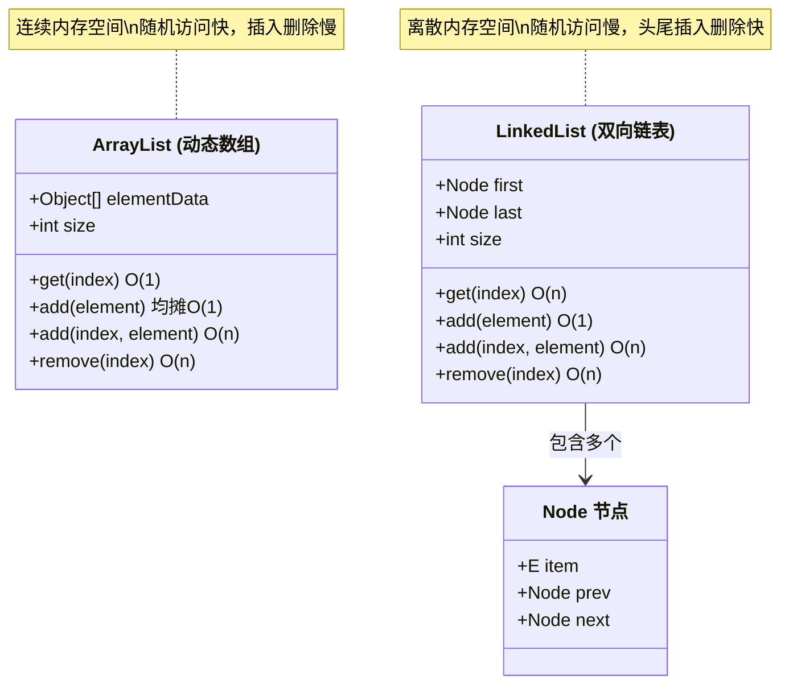

# java-core - 概念对比速查

> 本模块中初学者容易混淆的核心概念对比，帮助快速区分和正确选择。

---

## 1. ArrayList vs LinkedList vs Vector

| 对比维度 | ArrayList | LinkedList | Vector |
|---------|-----------|------------|--------|
| 核心定位 | 基于动态数组实现的列表，随机访问快 | 基于双向链表实现的列表，插入删除快 | 基于动态数组实现的线程安全列表，JDK 1.0 遗留类 |
| 底层数据结构 | `Object[]` 数组 | 双向链表（Node 节点） | `Object[]` 数组 |
| 随机访问性能 | O(1) | O(n) | O(1) |
| 头部插入/删除 | O(n)（需移动元素） | O(1) | O(n)（需移动元素） |
| 尾部插入 | 均摊 O(1) | O(1) | 均摊 O(1) |
| 内存占用 | 紧凑，仅存储元素引用 | 每个节点额外存储前后指针（约 24 字节/节点） | 同 ArrayList，但扩容时默认翻倍（ArrayList 为 1.5 倍） |
| 线程安全 | 否 | 否 | 是（方法级 synchronized） |
| 扩容机制 | 默认扩容 1.5 倍 | 无扩容概念，按需分配节点 | 默认扩容 2 倍 |
| 适用场景 | 频繁随机访问、尾部追加、遍历 | 频繁头部/中间插入删除、队列/双端队列 | 多线程环境下的列表操作（但建议用 CopyOnWriteArrayList 或 Collections.synchronizedList） |
| 选择建议 | 默认首选，覆盖 90% 场景 | 需要频繁在头部插入/删除时选用 | 避免使用，用 Collections.synchronizedList(new ArrayList<>()) 替代 |

> 上图对比了 ArrayList 基于连续数组和 LinkedList 基于双向链表的数据结构差异。ArrayList 通过索引直接定位元素实现 O(1) 随机访问，而 LinkedList 需要从头/尾遍历至目标位置；但 LinkedList 在头尾位置插入删除仅需 O(1)，无需像 ArrayList 那样移动大量元素。

---

## 2. HashMap vs Hashtable vs ConcurrentHashMap

| 对比维度 | HashMap | Hashtable | ConcurrentHashMap |
|---------|---------|-----------|-------------------|
| 核心定位 | 非线程安全的高性能哈希表，JDK 1.2 引入 | 线程安全的遗留哈希表，JDK 1.0 引入 | 高并发线程安全哈希表，JDK 5 引入 |
| 底层结构 | 数组 + 链表 + 红黑树（JDK 8+） | 数组 + 链表 | 数组 + 链表 + 红黑树（JDK 8+） |
| 线程安全 | 否 | 是（方法级 synchronized，全表锁） | 是（JDK 7 分段锁 Segment；JDK 8 CAS + synchronized 锁单节点） |
| 并发性能 | 最高 | 最低（并发场景严重退化） | 高（JDK 8 粒度到桶级别） |
| 允许 null 键/值 | 是（一个 null 键，多个 null 值） | 否（抛 NullPointerException） | 否（抛 NullPointerException） |
| 默认容量 | 16，负载因子 0.75 | 11，负载因子 0.75 | 16，负载因子 0.75 |
| 扩容机制 | 翻倍扩容，JDK 8 尾插法 + 高低位拆分 | 翻倍扩容 | 翻倍扩容，支持多线程协作扩容 |
| 迭代器 | fail-fast（遍历时结构性修改抛 ConcurrentModificationException） | fail-fast（通过 Enumeration 遍历时安全） | 弱一致性（遍历时允许结构性修改，不抛异常） |
| 适用场景 | 单线程或使用外部同步的并发场景 | 遗留代码兼容，不推荐新项目使用 | 高并发场景，读多写多的混合场景 |
| 选择建议 | 单线程场景首选 | 禁止使用，用 ConcurrentHashMap 替代 | 多线程场景首选 |

---

## 3. String vs StringBuilder vs StringBuffer

| 对比维度 | String | StringBuilder | StringBuffer |
|---------|--------|--------------|--------------|
| 核心定位 | 不可变字符序列，适合常量字符串 | 可变字符序列，适合频繁拼接的单线程场景 | 可变字符序列，适合频繁拼接的多线程场景 |
| 可变性 | 不可变（final 类，底层 `final byte[]`） | 可变（继承 AbstractStringBuilder） | 可变（继承 AbstractStringBuilder） |
| 线程安全 | 是（不可变天然线程安全） | 否 | 是（方法级 synchronized） |
| 拼接性能 | 最低（每次拼接创建新对象） | 最高 | 中等（synchronized 开销） |
| 内存效率 | 低（频繁拼接产生大量临时对象） | 高（内部数组扩容，默认 16 字符，扩容 2n+2） | 同 StringBuilder |
| 字符串常量池 | 参与常量池，字面量自动入池 | 不参与常量池 | 不参与常量池 |
| 适用场景 | 字符串内容不变；作为 Map key；少量拼接（< 5 次） | 循环内大量拼接；单线程字符串构建；SQL/JSON 动态拼接 | 多线程环境下的字符串拼接；日志框架中的缓冲写入 |
| 常用 API | replace、substring、split、indexOf | append、insert、delete、reverse、toString | 同 StringBuilder |
| 选择建议 | 默认首选，少量拼接直接用 +（编译器优化为 StringBuilder） | 循环拼接、单线程大量构建场景 | 多线程拼接场景（实际使用较少，多数场景用 String.format 或第三方库） |

---

> [返回模块目录](../../README.md) | [返回知识导览](../../知识导览.md)