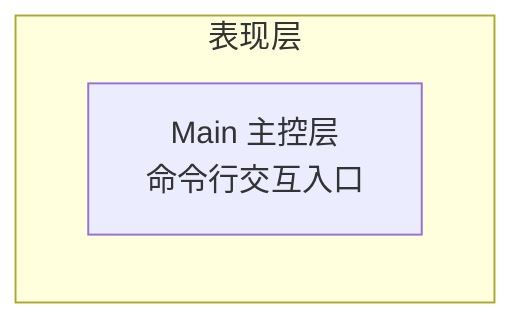
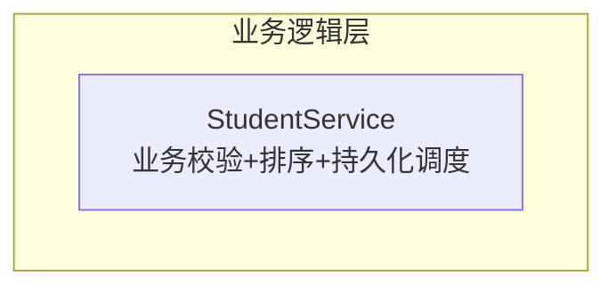
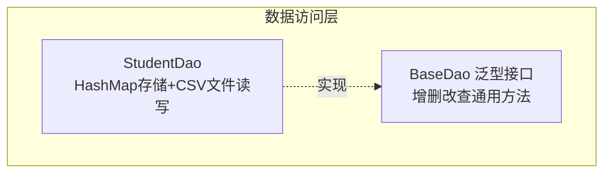
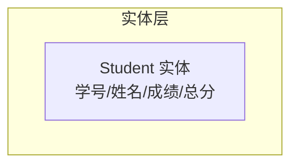
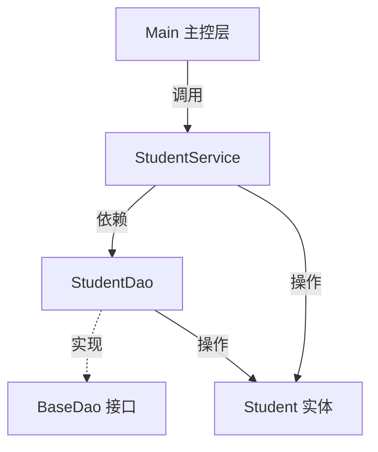

# java-core - 综合场景串联

---

## 场景一：学生成绩管理系统

### 场景描述

设计一个命令行版学生成绩管理系统，支持以下功能：
- 录入学生信息（学号、姓名、各科成绩）
- 按总分排序输出成绩排名
- 将成绩数据保存到文件，支持从文件读取
- 处理输入格式错误和文件不存在等异常

### 涉及知识点

- [集合框架](./08-面向对象与集合框架.md)：使用 ArrayList 存储学生对象，HashMap 按学号索引，Collections.sort 排序
- [泛型](./09-泛型.md)：定义泛型 DAO 接口 `BaseDao<T>`，约束集合元素类型，设计 `Comparator<Student>` 排序器
- [IO 流](./10-IO流.md)：使用 BufferedReader/BufferedWriter 读写成绩文件，try-with-resources 自动关闭流
- [异常处理](./06-异常处理.md)：捕获 NumberFormatException（成绩格式）、FileNotFoundException（文件不存在）、自定义 BusinessException（业务校验失败）
- [常用类与基础 API](./07-常用类与基础API.md)：String 处理姓名、BigDecimal 处理精确成绩计算、DateTimeFormatter 格式化录入时间

### 协作流程

1. **定义实体类（泛型 + 集合）**：创建 `Student` 类，包含学号、姓名、成绩列表等字段，使用 `List<BigDecimal>` 存储成绩，重写 `equals()` 和 `hashCode()` 以学号为准
2. **数据访问层（泛型 + 集合）**：定义 `BaseDao<T>` 接口，包含 `add(T)`、`remove(String id)`、`findById(String id)`、`findAll()` 等通用方法；`StudentDao` 实现该接口，内部使用 `HashMap<String, Student>` 存储数据
3. **排序服务（集合 + 泛型）**：使用 `Comparator<Student>` 按总分降序排列，总分相同时按学号升序，调用 `Collections.sort(list, comparator)` 实现排名
4. **文件持久化（IO 流 + 异常处理）**：使用 BufferedWriter 将成绩数据逐行写入文件，格式为 `学号,姓名,成绩1,成绩2,...`；使用 BufferedReader 读取文件并逐行解析，NumberFormatException 时跳过并记录日志
5. **主控层（异常处理）**：Scanner 读取命令行输入，try-catch 包裹解析逻辑，校验成绩是否在 0-100 范围内，不合法时抛出自定义 `BusinessException`

### 关键要点

- 泛型 DAO 层实现了代码复用，后续新增 Teacher 或其他实体只需实现接口
- 文件读写必须使用 try-with-resources 确保流关闭
- 成绩用 BigDecimal 而非 double 存储，避免浮点数精度问题
- 排序前确保集合非空，防止空指针异常
- 异常处理要分层：DAO 层抛出原始异常，Service 层转换为业务异常，控制层统一捕获并友好提示

**分层架构总览**

##### 表现层（Presentation）



> 表现层作为命令行交互入口，接收用户输入并展示处理结果。

##### 业务逻辑层（Service）



> 业务逻辑层负责数据校验、成绩排序和持久化调度。

##### 数据访问层（DAO）



> 数据访问层通过泛型接口实现代码复用，内部使用 HashMap 存储，支持 CSV 文件持久化。

##### 实体层（Entity）



> 实体层定义 Student 数据模型，使用 BigDecimal 存储成绩以确保精度。

##### 层间调用关系



> 上图展示了学生成绩管理系统的经典分层架构：Main 作为入口调用 Service 层，Service 层依赖 DAO 接口完成数据持久化，DAO 层通过泛型接口实现代码复用，所有层均围绕 Student 实体进行数据传递。

### 完整可运行示例代码

以下是学生成绩管理系统的完整实现，涵盖面向对象、集合、IO 流和异常处理四大知识模块。

**步骤一：定义 Student 实体类**

```java
package com.example.student.entity;

import java.math.BigDecimal;
import java.math.RoundingMode;
import java.util.ArrayList;
import java.util.List;
import java.util.Objects;

/**
 * 学生实体类
 * 使用 BigDecimal 存储成绩，避免浮点数精度问题
 * 重写 equals 和 hashCode 以学号作为唯一标识
 */
public class Student {
    private String studentId;          // 学号
    private String name;               // 姓名
    private List<BigDecimal> scores;   // 各科成绩列表

    public Student() {
        this.scores = new ArrayList<>();
    }

    public Student(String studentId, String name) {
        this.studentId = studentId;
        this.name = name;
        this.scores = new ArrayList<>();
    }

    public String getStudentId() {
        return studentId;
    }

    public void setStudentId(String studentId) {
        this.studentId = studentId;
    }

    public String getName() {
        return name;
    }

    public void setName(String name) {
        this.name = name;
    }

    public List<BigDecimal> getScores() {
        return scores;
    }

    public void setScores(List<BigDecimal> scores) {
        this.scores = scores;
    }

    /**
     * 添加单科成绩
     */
    public void addScore(BigDecimal score) {
        this.scores.add(score);
    }

    /**
     * 计算总分
     */
    public BigDecimal getTotalScore() {
        return scores.stream()
                .reduce(BigDecimal.ZERO, BigDecimal::add)
                .setScale(2, RoundingMode.HALF_UP);
    }

    /**
     * 计算平均分
     */
    public BigDecimal getAverageScore() {
        if (scores.isEmpty()) {
            return BigDecimal.ZERO;
        }
        return getTotalScore()
                .divide(new BigDecimal(scores.size()), 2, RoundingMode.HALF_UP);
    }

    @Override
    public boolean equals(Object o) {
        if (this == o) return true;
        if (o == null || getClass() != o.getClass()) return false;
        Student student = (Student) o;
        return Objects.equals(studentId, student.studentId);
    }

    @Override
    public int hashCode() {
        return Objects.hash(studentId);
    }

    @Override
    public String toString() {
        return String.format("学号: %s | 姓名: %s | 总分: %s | 平均分: %s | 科目数: %d",
                studentId, name, getTotalScore(), getAverageScore(), scores.size());
    }
}
```

**步骤二：定义自定义异常类**

```java
package com.example.student.exception;

/**
 * 业务异常类，用于封装业务校验失败场景
 */
public class BusinessException extends Exception {
    private String errorCode;

    public BusinessException(String message) {
        super(message);
    }

    public BusinessException(String errorCode, String message) {
        super(message);
        this.errorCode = errorCode;
    }

    public String getErrorCode() {
        return errorCode;
    }
}
```

**步骤三：定义泛型 DAO 接口**

```java
package com.example.student.dao;

import java.util.List;

/**
 * 泛型 DAO 接口，定义通用的 CRUD 操作
 * @param <T> 实体类型
 */
public interface BaseDao<T> {
    /**
     * 新增实体
     */
    void add(T entity);

    /**
     * 根据 ID 删除实体
     */
    void remove(String id);

    /**
     * 根据 ID 查找实体
     */
    T findById(String id);

    /**
     * 返回所有实体
     */
    List<T> findAll();
}
```

**步骤四：定义 StudentDao 实现类（集合存储 + 文件持久化）**

```java
package com.example.student.dao;

import com.example.student.entity.Student;

import java.io.*;
import java.math.BigDecimal;
import java.nio.charset.StandardCharsets;
import java.util.*;

/**
 * 学生数据访问层实现
 * 内存中使用 HashMap 存储（按学号索引），文件持久化使用 CSV 格式
 */
public class StudentDao implements BaseDao<Student> {

    private final Map<String, Student> studentMap = new HashMap<>();

    /**
     * 文件存储路径
     */
    private static final String DATA_FILE = "students.csv";

    @Override
    public void add(Student entity) {
        studentMap.put(entity.getStudentId(), entity);
    }

    @Override
    public void remove(String id) {
        studentMap.remove(id);
    }

    @Override
    public Student findById(String id) {
        return studentMap.get(id);
    }

    @Override
    public List<Student> findAll() {
        return new ArrayList<>(studentMap.values());
    }

    /**
     * 将学生数据保存到文件
     * 格式：学号,姓名,成绩1,成绩2,...
     */
    public void saveToFile() throws IOException {
        try (BufferedWriter writer = new BufferedWriter(
                new OutputStreamWriter(
                        new FileOutputStream(DATA_FILE), StandardCharsets.UTF_8))) {
            for (Student student : studentMap.values()) {
                StringBuilder sb = new StringBuilder();
                sb.append(student.getStudentId()).append(",");
                sb.append(student.getName());
                for (BigDecimal score : student.getScores()) {
                    sb.append(",").append(score);
                }
                writer.write(sb.toString());
                writer.newLine();
            }
            writer.flush();
        }
    }

    /**
     * 从文件加载学生数据
     * 解析失败的行会跳过并记录日志
     */
    public void loadFromFile() throws IOException {
        File file = new File(DATA_FILE);
        if (!file.exists()) {
            System.out.println("数据文件不存在，将创建新文件: " + DATA_FILE);
            return;
        }
        try (BufferedReader reader = new BufferedReader(
                new InputStreamReader(
                        new FileInputStream(DATA_FILE), StandardCharsets.UTF_8))) {
            String line;
            int lineNumber = 0;
            while ((line = reader.readLine()) != null) {
                lineNumber++;
                if (line.trim().isEmpty()) {
                    continue;
                }
                try {
                    String[] parts = line.split(",");
                    if (parts.length < 2) {
                        throw new NumberFormatException("数据列数不足");
                    }
                    String studentId = parts[0].trim();
                    String name = parts[1].trim();
                    Student student = new Student(studentId, name);
                    // 解析成绩
                    for (int i = 2; i < parts.length; i++) {
                        BigDecimal score = new BigDecimal(parts[i].trim());
                        student.addScore(score);
                    }
                    studentMap.put(studentId, student);
                } catch (NumberFormatException e) {
                    System.err.println("警告: 第 " + lineNumber + " 行数据格式错误，已跳过: " + line);
                }
            }
        }
        System.out.println("已从文件加载 " + studentMap.size() + " 条学生记录");
    }
}
```

**步骤五：定义 StudentService（业务逻辑 + 排序 + 校验）**

```java
package com.example.student.service;

import com.example.student.dao.StudentDao;
import com.example.student.entity.Student;
import com.example.student.exception.BusinessException;

import java.io.IOException;
import java.math.BigDecimal;
import java.util.Comparator;
import java.util.List;

/**
 * 学生管理业务服务层
 */
public class StudentService {

    private final StudentDao studentDao;

    public StudentService(StudentDao studentDao) {
        this.studentDao = studentDao;
    }

    /**
     * 录入学生信息，校验成绩必须在 0-100 范围内
     */
    public void addStudent(String studentId, String name, List<BigDecimal> scores)
            throws BusinessException {
        // 校验学号不能为空
        if (studentId == null || studentId.trim().isEmpty()) {
            throw new BusinessException("E001", "学号不能为空");
        }
        // 校验姓名不能为空
        if (name == null || name.trim().isEmpty()) {
            throw new BusinessException("E002", "姓名不能为空");
        }
        // 校验成绩范围
        for (int i = 0; i < scores.size(); i++) {
            BigDecimal score = scores.get(i);
            if (score.compareTo(BigDecimal.ZERO) < 0 || score.compareTo(new BigDecimal("100")) > 0) {
                throw new BusinessException("E003",
                        "第 " + (i + 1) + " 科成绩必须在 0-100 之间，当前值: " + score);
            }
        }
        Student student = new Student(studentId, name);
        for (BigDecimal score : scores) {
            student.addScore(score);
        }
        studentDao.add(student);
    }

    /**
     * 按总分降序排名，总分相同时按学号升序
     */
    public List<Student> getRankedStudents() {
        List<Student> students = studentDao.findAll();
        students.sort(Comparator
                .comparing(Student::getTotalScore)
                .reversed()
                .thenComparing(Student::getStudentId));
        return students;
    }

    /**
     * 查找学生
     */
    public Student findStudent(String studentId) throws BusinessException {
        Student student = studentDao.findById(studentId);
        if (student == null) {
            throw new BusinessException("E004", "未找到学号为 " + studentId + " 的学生");
        }
        return student;
    }

    /**
     * 删除学生
     */
    public void deleteStudent(String studentId) throws BusinessException {
        findStudent(studentId); // 先检查是否存在
        studentDao.remove(studentId);
    }

    /**
     * 持久化数据到文件
     */
    public void saveData() throws IOException {
        studentDao.saveToFile();
        System.out.println("数据已保存到文件");
    }

    /**
     * 从文件加载数据
     */
    public void loadData() throws IOException {
        studentDao.loadFromFile();
    }
}
```

**步骤六：定义 Main 入口（命令行交互）**

```java
package com.example.student;

import com.example.student.dao.StudentDao;
import com.example.student.entity.Student;
import com.example.student.exception.BusinessException;
import com.example.student.service.StudentService;

import java.io.IOException;
import java.math.BigDecimal;
import java.util.ArrayList;
import java.util.List;
import java.util.Scanner;

/**
 * 学生成绩管理系统 -- 命令行入口
 */
public class Main {

    private static final Scanner scanner = new Scanner(System.in);
    private static StudentService studentService;

    public static void main(String[] args) {
        // 初始化 DAO 和 Service
        StudentDao studentDao = new StudentDao();
        studentService = new StudentService(studentDao);

        // 启动时加载已有数据
        try {
            studentService.loadData();
        } catch (IOException e) {
            System.out.println("加载数据文件失败: " + e.getMessage());
        }

        // 主循环
        boolean running = true;
        while (running) {
            printMenu();
            String choice = scanner.nextLine().trim();
            try {
                switch (choice) {
                    case "1":
                        addStudent();
                        break;
                    case "2":
                        showRanking();
                        break;
                    case "3":
                        findStudent();
                        break;
                    case "4":
                        deleteStudent();
                        break;
                    case "5":
                        saveAndExit();
                        running = false;
                        break;
                    default:
                        System.out.println("无效选项，请重新输入");
                }
            } catch (Exception e) {
                System.out.println("操作失败: " + e.getMessage());
            }
        }
        scanner.close();
    }

    private static void printMenu() {
        System.out.println("\n========== 学生成绩管理系统 ==========");
        System.out.println("1. 录入学生信息");
        System.out.println("2. 查看成绩排名");
        System.out.println("3. 查找学生");
        System.out.println("4. 删除学生");
        System.out.println("5. 保存并退出");
        System.out.print("请选择操作: ");
    }

    private static void addStudent() {
        try {
            System.out.print("请输入学号: ");
            String id = scanner.nextLine().trim();
            System.out.print("请输入姓名: ");
            String name = scanner.nextLine().trim();
            System.out.print("请输入成绩（多个成绩用逗号分隔，如 85,92,78）: ");
            String scoreStr = scanner.nextLine().trim();

            List<BigDecimal> scores = new ArrayList<>();
            String[] scoreArr = scoreStr.split(",");
            for (String s : scoreArr) {
                scores.add(new BigDecimal(s.trim()));
            }

            studentService.addStudent(id, name, scores);
            System.out.println("学生信息录入成功！");
        } catch (NumberFormatException e) {
            System.out.println("错误: 成绩格式不正确，请输入数字");
        } catch (BusinessException e) {
            System.out.println("错误: " + e.getMessage());
        }
    }

    private static void showRanking() {
        List<Student> ranked = studentService.getRankedStudents();
        if (ranked.isEmpty()) {
            System.out.println("暂无学生数据");
            return;
        }
        System.out.println("\n========== 成绩排名 ==========");
        System.out.println("排名\t学号\t\t姓名\t总分\t平均分");
        System.out.println("----------------------------------------");
        int rank = 1;
        for (Student s : ranked) {
            System.out.printf("%d\t%s\t%s\t%s\t%s%n",
                    rank++, s.getStudentId(), s.getName(),
                    s.getTotalScore(), s.getAverageScore());
        }
    }

    private static void findStudent() {
        try {
            System.out.print("请输入要查找的学号: ");
            String id = scanner.nextLine().trim();
            Student student = studentService.findStudent(id);
            System.out.println("查询结果: " + student);
            System.out.print("各科成绩: ");
            for (int i = 0; i < student.getScores().size(); i++) {
                System.out.print("科目" + (i + 1) + "=" + student.getScores().get(i) + " ");
            }
            System.out.println();
        } catch (BusinessException e) {
            System.out.println("错误: " + e.getMessage());
        }
    }

    private static void deleteStudent() {
        try {
            System.out.print("请输入要删除的学号: ");
            String id = scanner.nextLine().trim();
            studentService.deleteStudent(id);
            System.out.println("学生记录已删除");
        } catch (BusinessException e) {
            System.out.println("错误: " + e.getMessage());
        }
    }

    private static void saveAndExit() {
        try {
            studentService.saveData();
            System.out.println("数据已保存，感谢使用！");
        } catch (IOException e) {
            System.out.println("保存数据失败: " + e.getMessage());
        }
    }
}
```

---

## 场景二：简易依赖注入框架

### 场景描述

实现一个简易的 IoC 容器，支持通过注解标记组件、通过反射自动注入依赖，模拟 Spring 的核心机制。

### 涉及知识点

- [反射机制](./12-反射机制.md)：通过 `Class.forName()` 加载类，`getDeclaredConstructor().newInstance()` 创建实例，`getDeclaredFields()` 遍历字段并注入依赖
- [注解](./05-面向对象基础.md)：自定义 `@Component` 注解标记 Bean，`@Autowired` 注解标记需要注入的字段（注解相关在面向对象基础中涉及）
- [泛型](./09-泛型.md)：容器使用 `Map<Class<?>, Object>` 存储 Bean 实例，`<T> T getBean(Class<T> clazz)` 方法返回类型安全的 Bean
- [集合框架](./08-面向对象与集合框架.md)：使用 HashMap 存储 Bean 定义（`Map<String, BeanDefinition>`），ArrayList 存储后处理器
- [异常处理](./06-异常处理.md)：处理 ClassNotFoundException、NoSuchMethodException、IllegalAccessException 等反射异常，统一包装为 `ContainerException`

### 协作流程

1. **包扫描（反射）**：从指定包路径扫描所有 `.class` 文件，过滤出带有 `@Component` 注解的类，使用 `Class.forName()` 加载
2. **Bean 定义注册（集合 + 泛型）**：将扫描到的类封装为 `BeanDefinition` 对象，存入 `Map<String, BeanDefinition>` 中，key 为 Bean 名称（默认类名首字母小写）
3. **实例化与依赖注入（反射 + 注解）**：遍历 Bean 定义，通过 `clazz.getDeclaredConstructor().newInstance()` 创建实例；遍历实例的 `getDeclaredFields()`，发现 `@Autowired` 注解的字段，从容器中获取对应 Bean 并通过 `field.setAccessible(true)` 和 `field.set(instance, bean)` 注入
4. **Bean 获取（泛型）**：对外暴露 `getBean(Class<T> clazz)` 方法，利用泛型返回类型安全的 Bean，无需调用方强制转型
5. **异常处理**：整个流程中，反射相关异常统一捕获并包装为 `ContainerException("Bean 创建失败: " + className, e)`，保留原始异常链

### 关键要点

- 反射调用 `setAccessible(true)` 是必须的，否则无法访问私有字段
- 注意循环依赖问题：A 依赖 B，B 依赖 A 会导致无限递归，需要提前检测或引入二级缓存
- 泛型方法 `getBean(Class<T>)` 比 `getBean(String)` 更安全，编译期即可检查类型
- 反射性能开销大，生产级使用需缓存 Class/Method/Field 对象
- JDK 9+ 模块化环境下需注意 `--add-opens` 参数配置

---

> [返回模块目录](../../README.md) | [返回知识导览](../../知识导览.md)