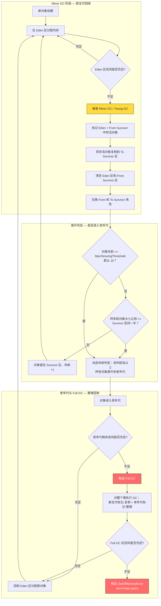
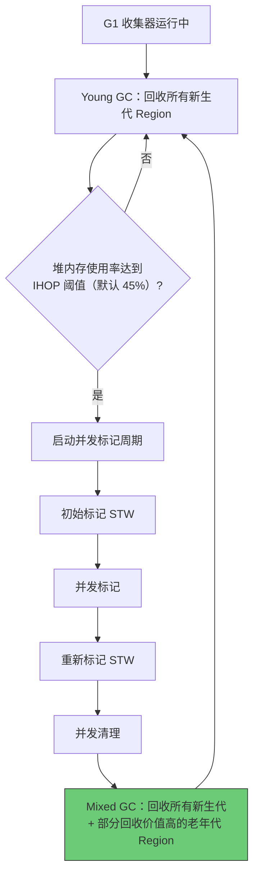

# JVM 原理与调优

> 学习路线对应：第1周 -- Java 语言核心
> 前置知识：Java 基础语法
> 预计学习时间：2 天

## 一、核心概念

### 1.1 JVM 运行时数据区

| 区域 | 存储内容 | 线程共享 | 内存溢出 |
|------|---------|---------|---------|
| **堆（Heap）** | 对象实例和数组 | 是 | `OutOfMemoryError: Java heap space` |
| **方法区/元空间（Metaspace）** | 类元数据、静态变量、常量池 | 是 | `OutOfMemoryError: Metaspace` |
| **虚拟机栈（VM Stack）** | 栈帧（局部变量表、操作数栈、方法出口等） | 否 | `StackOverflowError` |
| **本地方法栈（Native Stack）** | Native 方法调用 | 否 | `StackOverflowError` |
| **程序计数器（PC Register）** | 当前线程执行的字节码行号 | 否 | 不会 OOM |

> **生活化类比：厨房** -- 把JVM内存模型想象成一个厨房：
> - **虚拟机栈（操作台）**：就像厨房的操作台，临时放碗筷、切菜，用完就收。每个线程有自己的操作台（栈帧），方法调用时放上食材（局部变量），方法结束就清空。操作台上堆叠的碗碟太高（递归调用过深）会倒塌（StackOverflow）。
> - **堆（冰箱）**：就像厨房的冰箱，长期存放食材（对象实例）。食材放久了会过期，GC（垃圾回收）就是定期清理过期食材的管家。冰箱满了就是 OOM（堆溢出）。
> - **方法区/元空间（菜谱书架）**：就像厨房的书架，存放菜谱（类的元数据、方法信息、静态变量）。菜谱不会频繁变动，但越积越多也会占满书架（Metaspace OOM）。

> 📖 **参考链接**：
> - [JVM Specification §2.5: Run-Time Data Areas](https://docs.oracle.com/javase/specs/jvms/se17/html/jvms-2.html#jvms-2.5)
> - [Java SE 17 API: java.lang.management 内存管理 MXBean](https://docs.oracle.com/javase/17/docs/api/java.management/java/lang/management/MemoryMXBean.html)
> - [JEP 376: ZGC: Concurrent Thread-Stack Processing](https://openjdk.org/jeps/376)

### 1.2 堆内存划分

```
堆内存（Heap）
├── 新生代（Young Generation）-- 默认占堆的 1/3
│   ├── Eden 区（默认占新生代的 8/10）
│   ├── Survivor 0（From 区，默认占 1/10）
│   └── Survivor 1（To 区，默认占 1/10）
└── 老年代（Old Generation）-- 默认占堆的 2/3

元空间（Metaspace）-- JDK 8+ 替代永久代，使用本地内存
```

**关键参数：**

| 参数 | 含义 | 示例 |
|------|------|------|
| `-Xms` | 初始堆大小 | `-Xms2g` |
| `-Xmx` | 最大堆大小 | `-Xmx4g` |
| `-Xmn` | 新生代大小 | `-Xmn1g` |
| `-XX:NewRatio` | 老年代/新生代比例 | `-XX:NewRatio=2`（老年代:新生代=2:1） |
| `-XX:SurvivorRatio` | Eden/Survivor 比例 | `-XX:SurvivorRatio=8`（Eden:S0:S1=8:1:1） |
| `-XX:MetaspaceSize` | 元空间初始大小 | `-XX:MetaspaceSize=256m` |
| `-XX:MaxMetaspaceSize` | 元空间最大大小 | `-XX:MaxMetaspaceSize=512m` |

**堆内存区域布局（ASCII 示意图）：**

```
+====================================================================+
|                        堆内存 (Heap)                                 |
|            -Xms 初始堆大小    -Xmx 最大堆大小                         |
+====================================================================+
|                    新生代 (Young Generation)                         |
|                    默认占堆的 1/3，由 -Xmn 控制                       |
|  +------------------------+-------------------+-------------------+  |
|  |    Eden 区 (8/10)       | Survivor 0 (1/10) | Survivor 1 (1/10) |  |
|  |  新对象默认分配区域      |   From 区          |    To 区          |  |
|  |  Minor GC 时复制存活    |   GC 时空闲        |    GC 时空闲      |  |
|  |  对象到 Survivor 区     |   接收存活对象      |    接收存活对象    |  |
|  +------------------------+-------------------+-------------------+  |
|           -XX:SurvivorRatio=8 控制 Eden/Survivor 比例                |
+--------------------------------------------------------------------+
|                    老年代 (Old Generation / Tenured)                  |
|                    默认占堆的 2/3                                    |
|       -XX:NewRatio=2 控制老年代与新生代比例 (Old:Young = 2:1)         |
|       存放：大对象 / 长期存活对象 / 晋升对象                           |
|       触发：Major GC / Full GC / Mixed GC                           |
+====================================================================+
|                元空间 (Metaspace) - 使用本地内存（非堆）               |
|           -XX:MetaspaceSize    -XX:MaxMetaspaceSize                 |
|        存放：类元数据、方法信息、常量池、静态变量                        |
|        JDK 8+ 替代永久代 (PermGen)，默认无上限                        |
+====================================================================+
```

> 📖 **参考链接**：
> - [JVM Specification §2.5.4: Heap](https://docs.oracle.com/javase/specs/jvms/se17/html/jvms-2.html#jvms-2.5.4)
> - [JEP 122: Remove the Permanent Generation](https://openjdk.org/jeps/122) -- JDK 8 用元空间替代永久代
> - [Oracle Java SE 17 API: java.lang.management.MemoryUsage](https://docs.oracle.com/javase/17/docs/api/java.management/java/lang/management/MemoryUsage.html)

---

## 二、底层原理

### 2.1 GC 算法

| 算法 | 原理 | 优点 | 缺点 | 适用区域 |
|------|------|------|------|---------|
| **标记-复制** | 将存活对象复制到另一块区域，清理原区域 | 无碎片，速度快 | 浪费一半内存 | 新生代 |
| **标记-清除** | 标记存活对象，清除未标记对象 | 不浪费空间 | 产生内存碎片 | 老年代（CMS 基础） |
| **标记-整理** | 标记存活对象，向一端移动，清理边界外 | 无碎片 | 移动对象开销大，STW 长 | 老年代 |
| **分代收集** | 不同代使用不同算法 | 综合性能最优 | 实现复杂 | 全堆 |

> **生活化类比：垃圾分类** -- 把GC的分代收集想象成垃圾分类处理：
> - **新生代（Minor GC）**：就像快餐盒饭——大部分吃完就扔（短命对象），少数没吃完的打包带走（存活对象晋升到 Survivor 区）。Minor GC 就像每天清理饭盒，速度快、频率高，但活着的那部分会被保留并搬走。
> - **老年代（Major GC / Full GC）**：就像家具家电，不常更换、清理起来费时费力。Major GC 就像搬家大扫除，需要暂停所有活动（STW），把整个家翻一遍，耗时长、频率低。
> - **标记-复制算法**：就像把衣柜里还要穿的衣服挑出来，搬到另一个空衣柜，然后把旧衣柜全部清空。
> - **标记-整理算法**：就像整理书架，把要保留的书都移到一端，然后清理掉另一端的所有书。

> 📖 **参考链接**：
> - [JVM Specification §3.5: Garbage Collection](https://docs.oracle.com/javase/specs/jvms/se17/html/jvms-3.html#jvms-3.5)
> - [JEP 318: Epsilon: A No-Op Garbage Collector](https://openjdk.org/jeps/318) -- JDK 11 无操作 GC，用于性能测试
> - [JEP 491: Synchronize Virtual Threads without Pinning](https://openjdk.org/jeps/491) -- JDK 24 ZGC 增强

### 2.2 垃圾收集器对比

| 收集器 | 作用区域 | 算法 | 线程 | STW | 目标 |
|--------|---------|------|------|-----|------|
| **Serial** | 新生代 | 标记-复制 | 单线程 | 有 | 客户端模式 |
| **ParNew** | 新生代 | 标记-复制 | 多线程 | 有 | 配合 CMS |
| **Parallel Scavenge** | 新生代 | 标记-复制 | 多线程 | 有 | 吞吐量优先 |
| **Serial Old** | 老年代 | 标记-整理 | 单线程 | 有 | 客户端模式 |
| **Parallel Old** | 老年代 | 标记-整理 | 多线程 | 有 | 吞吐量优先 |
| **CMS** | 老年代 | 标记-清除 | 多线程 | 部分 | 低延迟（JDK 9 废弃，JDK 14 移除） |
| **G1** | 全堆 | 标记-整理+复制 | 多线程 | 部分 | 平衡延迟与吞吐量 |
| **ZGC** | 全堆 | 标记-整理（染色指针） | 多线程 | <10ms | 超低延迟 |
| **Shenandoah** | 全堆 | 标记-整理（Brooks Pointer） | 多线程 | <10ms | 超低延迟 |

#### CMS 收集器四阶段

```
1. 初始标记（STW）：标记 GC Roots 直接关联对象
2. 并发标记：从 GC Roots 遍历对象图
3. 重新标记（STW）：修正并发标记期间变动的标记
4. 并发清除：清除未标记的垃圾对象
```

**CMS 缺点：**
- 对 CPU 资源敏感（并发阶段占用 CPU）
- 无法处理浮动垃圾（并发标记阶段新产生的垃圾）
- 标记-清除算法产生内存碎片（可配置 `-XX:+UseCMSCompactAtFullCollection`）
- Concurrent Mode Failure 会退化为 Serial Old 单线程回收

> 📖 **参考链接**：
> - [JEP 291: Deprecate the CMS Garbage Collector](https://openjdk.org/jeps/291) -- JDK 9 废弃 CMS
> - [JEP 363: Remove the CMS Garbage Collector](https://openjdk.org/jeps/363) -- JDK 14 移除 CMS

#### G1 收集器核心概念

- **Region：** G1 将堆划分为约 2048 个等大小的 Region（1MB~32MB）
- **Humongous 区：** 对象大小超过 Region 大小 50% 时，分配在连续的 Humongous Region
- **SATB（Snapshot-At-The-Beginning）：** 并发标记算法，在标记开始时对对象图拍快照
- **RSet（Remembered Set）：** 记录其他 Region 对本 Region 的引用，避免全堆扫描
- **Mixed GC：** 回收所有新生代 Region + 部分老年代 Region（根据回收价值排序）

**G1 核心参数：**

```bash
-XX:+UseG1GC                    # 启用 G1（JDK 9+ 默认）
-XX:MaxGCPauseMillis=200        # 期望的最大 GC 暂停时间（软目标）
-XX:G1HeapRegionSize=4m         # Region 大小
-XX:InitiatingHeapOccupancyPercent=45  # 并发标记触发阈值
```

> 📖 **参考链接**：
> - [JEP 391: ZGC: Scalable Low-Latency Garbage Collector](https://openjdk.org/jeps/391) -- JDK 16 ZGC 正式版
> - [JEP 377: ZGC: A Scalable Low-Latency Garbage Collector](https://openjdk.org/jeps/377) -- JDK 15 ZGC 生产可用
> - [JVM Specification §3.5: Garbage Collection](https://docs.oracle.com/javase/specs/jvms/se17/html/jvms-3.html#jvms-3.5)

#### CMS vs G1 选型

| 维度 | CMS | G1 |
|------|-----|-----|
| 堆大小 | 中小堆（<4G） | 大堆（>4G） |
| 碎片化 | 有（标记-清除） | 可控（标记-整理+复制） |
| 停顿时间 | 不可预测 | 可预测（`-XX:MaxGCPauseMillis`） |
| 垃圾回收 | 仅老年代 | 全堆（Young GC + Mixed GC） |
| 推荐版本 | JDK 8 低延迟 | JDK 9+ 默认 |

> 📖 **参考链接**：
> - [JEP 248: Make G1 the Default Garbage Collector](https://openjdk.org/jeps/248) -- JDK 9 G1 成为默认 GC
> - [JEP 439: Generational ZGC](https://openjdk.org/jeps/439) -- JDK 21 分代 ZGC

**GC 全过程流程图（Young GC → Full GC → Mixed GC）：**

下图将 Minor GC、对象晋升判定、Full GC 三个环节整合为一张完整流程图，箭头表示实际的流转方向，不再使用注释代替跨图连接。



**流程说明：**

1. **Minor GC 阶段**（MINOR 子图，A→B→C→D→E→F→G→H）：新对象首先在 Eden 区分配内存；当 Eden 区空间不足时触发 Minor GC（Young GC），标记 Eden 与 From Survivor 中的存活对象并复制到 To Survivor 区，随后清空 Eden 与 From Survivor 并交换两者角色，完成一次新生代回收。回收后通过 H→I 进入晋升判定环节。

2. **晋升判定**（PROMOTE 子图，I→J→K/L）：判断存活对象是否晋升到老年代。若对象年龄达到 `MaxTenuringThreshold`（默认 15）或同年龄对象大小之和超过 Survivor 空间一半（动态年龄判定），则通过 L→M 晋升到老年代；否则对象留在 Survivor 区并年龄 +1，通过 K→B 回到 Eden 区等待下一次分配，形成新生代内部的循环。

3. **Full GC 阶段**（OLDGC 子图，M→N→O→P→Q→R）：晋升对象进入老年代后，若老年代剩余空间充足则通过 B_RET→B 直接回到 Eden 区继续分配；若空间不足则触发 Full GC，对整个堆执行回收（新生代标记-复制 + 老年代标记-整理）。Full GC 后若空间仍不足（Q→不足→R），则抛出 `OutOfMemoryError: Java heap space`；若空间充足（Q→充足→B_RET），则回到 Eden 区分配新对象，形成完整闭环。

> 📖 **参考链接**：
> - [JVM Specification §2.5.4: Heap](https://docs.oracle.com/javase/specs/jvms/se17/html/jvms-2.html#jvms-2.5.4) -- 新生代与老年代划分、对象晋升机制
> - [JEP 331: Low-Overhead Heap Profiling](https://openjdk.org/jeps/331) -- JDK 11 堆分析工具
> - [JVM Specification §3.5: Garbage Collection](https://docs.oracle.com/javase/specs/jvms/se17/html/jvms-3.html#jvms-3.5)
> - [JEP 377: ZGC: A Scalable Low-Latency Garbage Collector](https://openjdk.org/jeps/377) -- Full GC 优化对比
> - [Oracle Java SE 17: JConsole 监控工具](https://docs.oracle.com/javase/17/docs/api/java.management/javax/management/package-summary.html)

### G1 Mixed GC 流程

> G1 收集器在 Young GC 后，当堆内存使用率达到 IHOP 阈值（默认 45%）时，启动并发标记周期，最终执行 Mixed GC 回收部分老年代 Region。



> 上图展示了 G1 收集器的 Mixed GC 流程：G1 在常规 Young GC 循环中持续检测堆内存使用率，当达到 IHOP 阈值（默认 45%）时启动并发标记周期（初始标记 → 并发标记 → 重新标记 → 并发清理），随后执行 Mixed GC 同时回收新生代和部分回收价值高的老年代 Region，回收完毕后回到 Young GC 循环。

> 📖 **参考链接**：
> - [JEP 248: Make G1 the Default Garbage Collector](https://openjdk.org/jeps/248) -- G1 Mixed GC 机制
> - [JVM Specification §3.5: Garbage Collection](https://docs.oracle.com/javase/specs/jvms/se17/html/jvms-3.html#jvms-3.5)

### 2.3 类加载机制

#### 双亲委派模型

```
加载请求 -> Application ClassLoader
            -> 检查是否已加载
            -> 未加载，委托给 Extension/Platform ClassLoader
               -> 检查是否已加载
               -> 未加载，委托给 Bootstrap ClassLoader
                  -> 从 rt.jar/java.base 中加载
                  -> 找不到，返回子加载器
               -> 从 jre/lib/ext 中加载
               -> 找不到，返回子加载器
            -> 从 classpath 中加载
            -> 找不到，抛出 ClassNotFoundException
```

**三个类加载器：**

| 加载器 | 加载路径 | 语言 |
|--------|---------|------|
| **Bootstrap ClassLoader** | `<JAVA_HOME>/lib`（rt.jar 等） | C++ 实现 |
| **Extension/Platform ClassLoader** | `<JAVA_HOME>/lib/ext` | Java 实现 |
| **Application ClassLoader** | classpath | Java 实现 |

**双亲委派模型的作用：**
1. 保证 Java 核心类库的安全性（防止自定义类覆盖核心类，如 `java.lang.String`）
2. 保证类的唯一性（同一个类不会被重复加载）

**打破双亲委派的场景：**
- Tomcat 的 `WebappClassLoader`（Web 应用隔离）
- JDBC 的 SPI 机制（`Thread.currentThread().getContextClassLoader()`）
- OSGi 模块化
- 热部署/热替换

> 📖 **参考链接**：
> - [JVM Specification §5.3: Creation and Loading](https://docs.oracle.com/javase/specs/jvms/se17/html/jvms-5.html#jvms-5.3)
> - [JVM Specification §5.3.2: Delegation Hierarchy](https://docs.oracle.com/javase/specs/jvms/se17/html/jvms-5.html#jvms-5.3.2) -- 双亲委派模型规范
> - [Java SE 17 API: java.lang.ClassLoader](https://docs.oracle.com/javase/17/docs/api/java.base/java/lang/ClassLoader.html)

### 2.4 JIT 编译

JIT（Just-In-Time）编译器将热点代码编译为本地机器码，提升执行效率。

| 编译器 | 说明 |
|--------|------|
| **C1（Client Compiler）** | 编译速度快，优化程度较低 |
| **C2（Server Compiler）** | 编译速度慢，优化程度高 |
| **分层编译** | JDK 7+ 默认，C1 和 C2 协作 |

**分层编译级别：**
- Level 0：解释执行
- Level 1：C1 编译，无 profiling
- Level 2：C1 编译，简单 profiling
- Level 3：C1 编译，完整 profiling
- Level 4：C2 编译

> 📖 **参考链接**：
> - [JVM Specification §3.5: Optimization](https://docs.oracle.com/javase/specs/jvms/se17/html/jvms-3.html#jvms-3.5) -- JIT 编译相关
> - [JEP 297: Unified Memory Allocation Tracking](https://openjdk.org/jeps/297) -- JIT 内存追踪
> - [Oracle Java SE 17: HotSpot Virtual Machine Performance Enhancements](https://docs.oracle.com/javase/17/docs/api/java.base/java/lang/module/package-summary.html)

---

## 三、实战应用

### 3.1 JVM 常用参数

```bash
# 生产环境推荐配置（4核8G Web 应用）
JAVA_OPTS="
-server
-Xms4g
-Xmx4g
-Xmn2g
-XX:MetaspaceSize=256m
-XX:MaxMetaspaceSize=512m
-XX:MaxDirectMemorySize=512m
-XX:+UseG1GC
-XX:MaxGCPauseMillis=200
-XX:InitiatingHeapOccupancyPercent=45
-XX:+DisableExplicitGC
-XX:+HeapDumpOnOutOfMemoryError
-XX:HeapDumpPath=/logs/heapdump.hprof
-Xlog:gc*:file=/logs/gc.log:time,level,tags
"
```

> 📖 **参考链接**：
> - [Oracle Java SE 17: JVM 命令行选项](https://docs.oracle.com/javase/17/docs/specs/man/java.html)
> - [JVM Specification §2.5: Run-Time Data Areas](https://docs.oracle.com/javase/specs/jvms/se17/html/jvms-2.html#jvms-2.5) -- 内存参数对应区域
> - [JEP 158: Unified JVM Logging](https://openjdk.org/jeps/158) -- JDK 9 统一日志框架

### 3.2 OOM 排查流程

```
1. 查看 GC 状况
   jstat -gcutil <pid> 1000
   关注 FGC（Full GC 次数）和 FGCT（Full GC 总耗时）

2. 导出堆转储
   jmap -dump:live,format=b,file=heap.hprof <pid>
   或配置 -XX:+HeapDumpOnOutOfMemoryError

3. MAT（Memory Analyzer Tool）分析
   - Leak Suspects Report：查看疑似内存泄漏
   - Histogram：按类统计对象数量和大小
   - Dominator Tree：查看大对象的引用链
   - Path to GC Roots：查看引用链

4. 常见 OOM 类型排查
   - Java heap space：增大 -Xmx，检查是否有内存泄漏
   - Metaspace：增大 -XX:MaxMetaspaceSize，检查类加载器泄漏
   - Direct buffer memory：检查 NIO ByteBuffer 是否未释放
   - unable to create new native thread：减少线程数
```

> 📖 **参考链接**：
> - [Oracle Java SE 17: Troubleshooting Guide](https://docs.oracle.com/javase/17/docs/api/java.management/java/lang/management/package-summary.html)
> - [JEP 380: Unix-Domain Socket Channels](https://openjdk.org/jeps/380) -- JDK 16 本地诊断增强
> - [Java SE 17 API: java.lang.management.MemoryMXBean](https://docs.oracle.com/javase/17/docs/api/java.management/java/lang/management/MemoryMXBean.html) -- 内存监控 MXBean

### 3.3 CPU 100% 排查流程

```
1. top 找到 CPU 最高的 Java 进程 PID

2. top -H -p <PID> 找到 CPU 最高的线程 TID

3. printf "%x\n" <TID> 将 TID 转为十六进制

4. jstack <PID> | grep -A 20 <十六进制TID>
   分析线程栈，定位具体代码行

5. 结合 Arthas 诊断
   - thread -n 3：查看 CPU 最高的 3 个线程
   - dashboard：查看实时 JVM 状态
   - monitor：监控方法调用
```

> 📖 **参考链接**：
> - [Oracle Java SE 17: jstack 命令](https://docs.oracle.com/javase/17/docs/specs/man/jstack.html)
> - [JEP 328: Flight Recorder](https://openjdk.org/jeps/328) -- JDK 11 JFR 飞行记录器
> - [Java SE 17 API: java.lang.management.ThreadMXBean](https://docs.oracle.com/javase/17/docs/api/java.management/java/lang/management/ThreadMXBean.html) -- 线程 CPU 监控

---

## 四、常见面试题（附答案）

### 1. 什么是双亲委派模型？为什么需要它？

**双亲委派模型：** 类加载器收到加载请求时，先委托父加载器加载，父加载器无法加载时才自己尝试加载。

**作用：**
1. 保证核心类库安全：防止自定义类覆盖 `java.lang.String` 等核心类
2. 保证类的唯一性：同一个类在同一个类加载器中只会被加载一次
3. 避免类的重复加载：不同类加载器加载的同一个类，JVM 认为它们是不同的类

> 📖 **参考链接**：
> - [JVM Specification §5.3: Creation and Loading](https://docs.oracle.com/javase/specs/jvms/se17/html/jvms-5.html#jvms-5.3)
> - [JVM Specification §5.3.2: Delegation Hierarchy](https://docs.oracle.com/javase/specs/jvms/se17/html/jvms-5.html#jvms-5.3.2)
> - [Java SE 17 API: java.lang.ClassLoader](https://docs.oracle.com/javase/17/docs/api/java.base/java/lang/ClassLoader.html)

### 2. CMS 和 G1 的区别？什么场景选 G1？

| 维度 | CMS | G1 |
|------|-----|-----|
| 算法 | 标记-清除 | 标记-整理 + 复制 |
| 碎片化 | 有碎片问题 | 可控 |
| 停顿时间 | 不可预测 | 可预测（设置 `MaxGCPauseMillis`） |
| 堆结构 | 连续分代 | 多个 Region |
| 回收范围 | 仅老年代 | 全堆（Young GC + Mixed GC） |

**选择 G1 的场景：** 堆大小 > 4GB，需要可预测的停顿时间，JDK 9+ 版本。

> 📖 **参考链接**：
> - [JEP 248: Make G1 the Default Garbage Collector](https://openjdk.org/jeps/248) -- JDK 9 G1 成为默认 GC
> - [JEP 291: Deprecate the CMS Garbage Collector](https://openjdk.org/jeps/291) -- JDK 9 废弃 CMS
> - [JEP 363: Remove the CMS Garbage Collector](https://openjdk.org/jeps/363) -- JDK 14 移除 CMS

### 3. 什么对象会进入老年代？

1. **大对象直接分配：** 超过 `-XX:PretenureSizeThreshold` 的对象（如大数组）
2. **年龄达到阈值：** 对象在 Survivor 区每经历一次 Minor GC，年龄 +1，达到 `-XX:MaxTenuringThreshold`（默认 15）后晋升
3. **动态年龄判定：** Survivor 区中相同年龄的对象大小超过 Survivor 空间的一半，年龄 >= 该年龄的对象全部晋升
4. **空间分配担保失败：** Minor GC 后 Survivor 放不下，且老年代也放不下，触发 Full GC

> 📖 **参考链接**：
> - [JVM Specification §2.5.4: Heap](https://docs.oracle.com/javase/specs/jvms/se17/html/jvms-2.html#jvms-2.5.4)
> - [JVM Specification §3.5: Garbage Collection](https://docs.oracle.com/javase/specs/jvms/se17/html/jvms-3.html#jvms-3.5)

### 4. 如何排查 Full GC 频繁？

1. 导出 GC 日志分析：`jstat -gcutil <pid> 1000` 查看 FGC 频率
2. 分析堆转储（MAT）：查看大对象和内存泄漏
3. 检查 JVM 参数：新生代是否过小（导致对象过早晋升）
4. 检查代码：是否有大对象频繁创建、是否有内存泄漏（如 ThreadLocal 未清理）
5. 用 Arthas 的 `dashboard` 和 `monitor` 命令实时观察

> 📖 **参考链接**：
> - [Oracle Java SE 17: jstat 命令](https://docs.oracle.com/javase/17/docs/specs/man/jstat.html)
> - [JEP 328: Flight Recorder](https://openjdk.org/jeps/328) -- JFR 诊断工具
> - [JVM Specification §3.5: Garbage Collection](https://docs.oracle.com/javase/specs/jvms/se17/html/jvms-3.html#jvms-3.5)

---

## 五、避坑指南

| 常见错误 | 现象 | 原因 | 解决方案 |
|---------|------|------|---------|
| finally 块中 return | try 中的返回值或异常被吞没，程序行为不符合预期 | finally 块中的 return 会覆盖 try 中的 return 或异常 | 避免在 finally 块中使用 return，finally 仅用于资源释放 |
| 依赖 System.gc() 立即回收 | 内存未立即释放，预期效果不达 | System.gc() 只是建议 JVM 进行 GC，不保证立即执行 | 生产环境使用 `-XX:+DisableExplicitGC` 禁用；依赖 JVM 自动 GC 策略 |
| 未理解逃逸分析条件 | 优化未生效，性能未达预期 | 逃逸分析是 JIT 优化，仅在对象不逃逸出方法时生效（需 HotSpot Server 模式） | 确保相关参数开启（`-XX:+DoEscapeAnalysis`、`-XX:+EliminateAllocations`，默认开启） |
| 高并发下大量调用 String.intern() | JDK 7 前 PermGen OOM；JDK 7+ 性能下降 | intern() 需操作字符串常量池，频繁调用涉及锁竞争和哈希表操作 | 避免在高并发场景大量调用 intern()；使用自定义缓存替代 |

---

> **学习导航**：
> - 返回 [学习路线总览](../../README.md)
> - 前置学习：[05-面向对象基础](./05-面向对象基础.md) | [13-多线程与并发编程](./13-多线程与并发编程.md)
> - 本模块其他文件：[17-Java核心笔面试题集](./17-Java核心笔面试题集.md)
> - 实战应用：[电商订单实时统计分析平台](../../extensions/project/01-电商订单实时统计分析平台.md)

