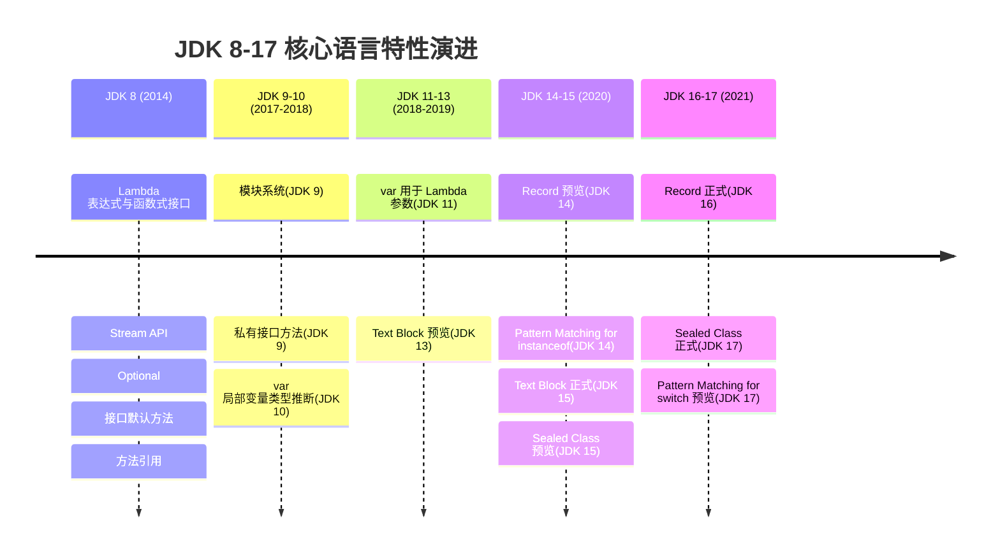

# JDK 8-17 新特性

> 学习路线对应：第18章 -- JDK 8-17 新特性
> 前置知识：Java 基础语法、集合框架、面向对象编程
> 预计学习时间：2-3 天

## 一、核心概念

**JDK 8-17 核心特性演进时间线：**



> 上图展示了 JDK 8 到 JDK 17 核心语言特性的演进历程。JDK 8 是函数式编程的里程碑（Lambda、Stream、Optional），JDK 9-10 引入模块化和类型推断，JDK 14-17 逐步引入 Record、Sealed Class、Pattern Matching 等现代语言特性，使 Java 更加简洁和类型安全。

### 1.1 Lambda 表达式

Lambda 表达式是 JDK 8 引入的最核心特性，本质是一个**匿名函数**——没有名称、但可以像参数一样传递的代码块。

> **生活化类比：快餐店点餐** -- Lambda 表达式就像快餐店的"套餐按钮"：
> - 以前点餐（匿名内部类）需要写一整页订单：我要一份套餐，主食是米饭，配菜是鸡块，饮料是可乐——每次都要把完整流程写一遍。
> - Lambda 就像收银台上的快捷按钮："套餐A"按钮直接代表"米饭+鸡块+可乐"这一整套动作。你只需要按一下按钮（传一段代码），不需要知道按钮内部怎么实现的。
> - 按钮可以随时替换（传不同的 Lambda），也可以贴在任何收银台上（赋值给不同的函数式接口变量），极大简化了"传递行为"这件事。

**语法格式：**

```
(参数列表) -> { 方法体 }
```

**六种基本写法：**

| 形式 | 示例 | 说明 |
|------|------|------|
| 无参无返回值 | `() -> System.out.println("Hello")` | 最简形式 |
| 单参无返回值 | `(s) -> System.out.println(s)` | 括号可省略：`s ->` |
| 多参无返回值 | `(a, b) -> System.out.println(a + b)` | 类型可省略 |
| 单参有返回值 | `(s) -> { return s.length(); }` | 可简化为 `s -> s.length()` |
| 多参有返回值 | `(a, b) -> { return a + b; }` | 可简化为 `(a, b) -> a + b` |
| 带类型声明 | `(String s) -> s.length()` | 显式声明参数类型 |

**Lambda 与匿名内部类的区别：**

| 维度 | Lambda 表达式 | 匿名内部类 |
|------|-------------|-----------|
| 实现方式 | 不需要类文件，`invokedynamic` 指令动态生成 | 编译后生成独立的 `.class` 文件 |
| this 指向 | 指向外层类实例 | 指向匿名内部类自身 |
| 变量捕获 | 只能引用 effectively final 的局部变量 | 可以引用实例变量和 effectively final 局部变量 |
| 适用范围 | 仅函数式接口 | 任何接口或抽象类 |

> 📖 **参考链接**：
> - [JEP 126: Lambda Expressions and Virtual Extension Methods](https://openjdk.org/jeps/126) -- Lambda 表达式官方 JEP
> - [JLS §15.27: Lambda Expressions](https://docs.oracle.com/javase/specs/jls/se17/html/jls-15.html#jls-15.27)
> - [Java SE 17 API: java.util.function 包](https://docs.oracle.com/javase/17/docs/api/java.base/java/util/function/package-summary.html)

### 1.2 函数式接口

**函数式接口**是只包含一个抽象方法的接口（可以有多个默认方法或静态方法）。Lambda 表达式只能赋值给函数式接口类型的变量。

**四大核心函数式接口：**

| 接口 | 抽象方法 | 输入 | 输出 | 用途 |
|------|---------|------|------|------|
| **`Function<T, R>`** | `R apply(T t)` | T | R | 类型转换/计算 |
| **`Consumer<T>`** | `void accept(T t)` | T | 无 | 消费数据 |
| **`Supplier<T>`** | `T get()` | 无 | T | 提供数据 |
| **`Predicate<T>`** | `boolean test(T t)` | T | boolean | 条件判断 |

**扩展函数式接口：**

| 接口 | 说明 |
|------|------|
| `BiFunction<T, U, R>` | 两参数 Function，`R apply(T t, U u)` |
| `BiConsumer<T, U>` | 两参数 Consumer |
| `BiPredicate<T, U>` | 两参数 Predicate |
| `UnaryOperator<T>` | 继承 Function，输入输出同类型 |
| `BinaryOperator<T>` | 继承 BiFunction，输入输出同类型 |

**自定义函数式接口：**

```java
@FunctionalInterface  // 编译期校验，可选但推荐
public interface Calculator {
    int calculate(int a, int b);
}
```

> 📖 **参考链接**：
> - [JLS §9.8: Functional Interfaces](https://docs.oracle.com/javase/specs/jls/se17/html/jls-9.html#jls-9.8)
> - [JLS §9.6.4.9: @FunctionalInterface](https://docs.oracle.com/javase/specs/jls/se17/html/jls-9.html#jls-9.6.4.9)
> - [Java SE 17 API: java.util.function 包](https://docs.oracle.com/javase/17/docs/api/java.base/java/util/function/package-summary.html)

### 1.3 方法引用与构造器引用

方法引用是 Lambda 表达式的**语法糖**，当 Lambda 体仅调用一个已有方法时，可以用方法引用简化。

**四种方法引用：**

| 类型 | 语法 | Lambda 等价形式 | 示例 |
|------|------|----------------|------|
| **静态方法引用** | `类名::静态方法` | `(x) -> 类名.静态方法(x)` | `Math::abs` |
| **实例方法引用（特定对象）** | `实例::实例方法` | `(x) -> 实例.实例方法(x)` | `System.out::println` |
| **实例方法引用（类名）** | `类名::实例方法` | `(x, y) -> x.实例方法(y)` | `String::equals` |
| **构造器引用** | `类名::new` | `(x) -> new 类名(x)` | `ArrayList::new` |

**数组构造器引用：**

```java
// 创建指定长度的数组
Function<Integer, String[]> func = String[]::new;
String[] arr = func.apply(10);  // new String[10]
```

> 📖 **参考链接**：
> - [JLS §15.13: Method Reference Expressions](https://docs.oracle.com/javase/specs/jls/se17/html/jls-15.html#jls-15.13)
> - [JLS §15.29: Constructor Reference](https://docs.oracle.com/javase/specs/jls/se17/html/jls-15.html#jls-15.29)

### 1.4 Stream API

Stream API 是 JDK 8 对集合框架的**函数式增强**，提供声明式的数据处理方式。它不存储数据，而是对数据源（集合、数组、I/O 等）进行计算。

> **生活化类比：工厂流水线** -- Stream 就像一条工厂流水线：
> - **数据源**：原材料仓库（集合、数组），流水线本身不存放原材料，只是从仓库取料加工。
> - **中间操作**：流水线上的各个加工工位（filter=筛选合格品、map=贴标签、sorted=排序、distinct=去重）。每个工位只是登记"要做什么"，不会立即开工——这就是**惰性求值**。
> - **终止操作**：最终包装入库的环节（collect=装箱、forEach=逐个检查、count=计数）。只有到了这一步，整条流水线才会通电运转，从头到尾一次性完成所有加工。
> - **短路机制**：如果质检员（findFirst）在第一个产品就找到了合格品，后面的原材料就不需要加工了，直接停线省电。

**Stream 操作三阶段：**

```
数据源 → 中间操作（惰性求值） → 终止操作（触发计算）
```

**中间操作（Intermediate Operations）：**

| 操作 | 说明 |
|------|------|
| `filter(Predicate)` | 过滤，保留满足条件的元素 |
| `map(Function)` | 映射，将元素转换为另一种形式 |
| `flatMap(Function)` | 扁平化映射，将每个元素转为 Stream 后合并 |
| `distinct()` | 去重（基于 equals） |
| `sorted()` / `sorted(Comparator)` | 排序 |
| `peek(Consumer)` | 调试用，对每个元素执行操作但不改变流 |
| `limit(n)` | 截断，只取前 n 个元素 |
| `skip(n)` | 跳过前 n 个元素 |

**终止操作（Terminal Operations）：**

| 操作 | 说明 |
|------|------|
| `forEach(Consumer)` | 遍历每个元素 |
| `collect(Collector)` | 将流转换为集合或其它形式 |
| `count()` | 返回元素数量 |
| `reduce(BinaryOperator)` | 归约，将元素合并为单个值 |
| `anyMatch(Predicate)` | 是否有元素匹配 |
| `allMatch(Predicate)` | 是否所有元素匹配 |
| `noneMatch(Predicate)` | 是否没有元素匹配 |
| `findFirst()` | 返回第一个元素 |
| `findAny()` | 返回任意一个元素（并行流中更高效） |
| `max(Comparator)` / `min(Comparator)` | 返回最大/最小元素 |

**Collectors 常用方法：**

```java
Collectors.toList()                    // 转为 List
Collectors.toSet()                     // 转为 Set
Collectors.toMap(Function, Function)   // 转为 Map
Collectors.groupingBy(Function)        // 分组
Collectors.partitioningBy(Predicate)   // 分区（分为 true/false 两组）
Collectors.joining(",")                // 连接字符串
Collectors.summarizingInt(ToIntFunction) // 统计信息
```

#### Stream API vs 传统集合操作对比

这是本章核心重点，通过对比理解 Stream API 的优势。

**场景一：筛选与转换**

```java
// 需求：从用户列表中筛选出年龄 >= 18 的用户，收集他们的姓名，按字母排序

// --- 传统方式 ---
List<String> result = new ArrayList<>();
for (User user : users) {
    if (user.getAge() >= 18) {
        result.add(user.getName());
    }
}
Collections.sort(result);

// --- Stream 方式 ---
List<String> result = users.stream()
        .filter(u -> u.getAge() >= 18)
        .map(User::getName)
        .sorted()
        .collect(Collectors.toList());
```

**场景二：分组统计**

```java
// 需求：按城市分组统计用户数量

// --- 传统方式 ---
Map<String, Integer> map = new HashMap<>();
for (User user : users) {
    String city = user.getCity();
    map.put(city, map.getOrDefault(city, 0) + 1);
}

// --- Stream 方式 ---
Map<String, Long> map = users.stream()
        .collect(Collectors.groupingBy(User::getCity, Collectors.counting()));
```

**场景三：多条件过滤 + 聚合**

```java
// 需求：找出销量最高的3个已上架商品的总销售额

// --- 传统方式 ---
List<Product> filtered = new ArrayList<>();
for (Product p : products) {
    if (p.isOnSale()) {
        filtered.add(p);
    }
}
Collections.sort(filtered, (a, b) -> b.getSales() - a.getSales());
int total = 0;
for (int i = 0; i < Math.min(3, filtered.size()); i++) {
    total += filtered.get(i).getSales() * filtered.get(i).getPrice();
}

// --- Stream 方式 ---
int total = products.stream()
        .filter(Product::isOnSale)
        .sorted(Comparator.comparingInt(Product::getSales).reversed())
        .limit(3)
        .mapToInt(p -> p.getSales() * p.getPrice())
        .sum();
```

**Stream vs 传统集合操作对比总结：**

| 维度 | 传统集合操作 | Stream API |
|------|------------|------------|
| **代码风格** | 命令式（怎么做） | 声明式（做什么） |
| **可读性** | 多步骤逻辑分散，嵌套循环可读性差 | 链式调用，语义清晰 |
| **代码量** | 多（需要中间变量、循环、条件判断） | 少（一行链式调用完成） |
| **性能** | 直接操作，无额外开销 | 有惰性求值和短路优化，中等数据量下性能相当 |
| **并行处理** | 需手动实现多线程 | `parallelStream()` 一行切换 |
| **复用性** | 代码逻辑与数据结构耦合 | 操作可抽离为函数式接口参数，高复用 |
| **调试** | 逐步调试容易 | 链式调用断点调试稍复杂（可用 `peek()` 辅助） |

**并行流注意事项：**

- 数据量小（< 10000）时不建议用并行流，线程调度开销大于收益
- 有状态操作（如 `sorted`、`distinct`）在并行流中效率较低
- 确保操作无副作用且线程安全（如 `ArrayList.add` 在并行流中不安全）
- 使用 `ForkJoinPool.commonPool()`，注意不要阻塞公共线程池

> 📖 **参考链接**：
> - [JEP 107: Bulk Data Operations for Collections](https://openjdk.org/jeps/107) -- Stream API 官方 JEP
> - [Java SE 17 API: java.util.stream 包](https://docs.oracle.com/javase/17/docs/api/java.base/java/util/stream/package-summary.html)
> - [Java SE 17 API: java.util.stream.Collectors](https://docs.oracle.com/javase/17/docs/api/java.base/java/util/stream/Collectors.html)

### 1.5 Optional

`Optional<T>` 是 JDK 8 引入的**容器类**，用于优雅地处理可能为 null 的值，避免 `NullPointerException`。

> **生活化类比：快递包裹签收** -- Optional 就像快递柜里的包裹格：
> - 快递柜（Optional）要么里面有包裹（有值），要么格子是空的（empty）。你不用直接去翻找，先看柜子上的指示灯（`isPresent()`）。
> - 如果有包裹，你可以打开取走（`get()`）；如果是空的，你可以选择留个默认物品在里面（`orElse(默认值)`），或者让快递员下次再送（`orElseGet(供应商)`）。
> - `orElse` vs `orElseGet` 的区别：`orElse` 是你每次都提前买好一个备用物品放在柜子旁（不管用不用得上都花钱买了）；`orElseGet` 是只有柜子真为空时，才临时去超市买一个（省钱，惰性求值）。

**创建 Optional：**

```java
Optional.of(value)          // value 不能为 null，否则抛 NPE
Optional.ofNullable(value)  // value 可以为 null
Optional.empty()            // 创建一个空的 Optional
```

**常用方法：**

| 方法 | 说明 |
|------|------|
| `isPresent()` | 值是否存在 |
| `ifPresent(Consumer)` | 值存在时执行操作 |
| `get()` | 获取值（为空时抛异常，不推荐） |
| `orElse(T other)` | 值存在返回该值，否则返回默认值 |
| `orElseGet(Supplier)` | 值存在返回该值，否则由 Supplier 提供（**惰性求值**） |
| `orElseThrow(Supplier)` | 值存在返回该值，否则抛出自定义异常 |
| `map(Function)` | 值存在时转换，返回新的 Optional |
| `flatMap(Function)` | 与 map 类似，但 Function 返回 Optional |
| `filter(Predicate)` | 值存在且满足条件时保留，否则返回 empty |

**orElse vs orElseGet 的关键区别：**

```java
// orElse：无论 Optional 是否有值，默认值都会被执行/构建
String s1 = opt.orElse(expensiveOperation());  // 即使 opt 有值，expensiveOperation() 也会执行

// orElseGet：只有 Optional 为空时，才会执行 Supplier
String s2 = opt.orElseGet(() -> expensiveOperation());  // 惰性，有值时不会执行
```

**最佳实践：**

- 不要用 `Optional` 作为字段类型（序列化问题）
- 不要用 `Optional` 作为方法参数（增加调用方复杂度）
- 不要调用 `Optional.get()` 而不先检查 `isPresent()`——直接用 `orElse`/`orElseGet`/`orElseThrow`
- 适合作为方法返回值，明确告诉调用方"可能为空"

> 📖 **参考链接**：
> - [Java SE 17 API: java.util.Optional](https://docs.oracle.com/javase/17/docs/api/java.base/java/util/Optional.html)
> - [JEP 126: Lambda Expressions and Virtual Extension Methods](https://openjdk.org/jeps/126) -- Optional 作为 JDK 8 的一部分

### 1.6 接口默认方法与静态方法

JDK 8 允许接口包含**默认方法**和**静态方法**的实现，解决了接口演进问题——在不破坏已有实现类的前提下为接口添加新方法。

**默认方法（default method）：**

```java
public interface Collection<E> {
    // 传统抽象方法
    int size();

    // JDK 8 新增的默认方法
    default boolean removeIf(Predicate<? super E> filter) {
        Objects.requireNonNull(filter);
        boolean removed = false;
        Iterator<E> each = iterator();
        while (each.hasNext()) {
            if (filter.test(each.next())) {
                each.remove();
                removed = true;
            }
        }
        return removed;
    }
}
```

**默认方法冲突解决规则（类优先原则）：**

| 冲突场景 | 优先级 |
|---------|--------|
| 类中的方法 > 接口默认方法 | 类优先 |
| 子接口默认方法 > 父接口默认方法 | 子接口优先 |
| 多接口同名默认方法冲突 | **必须手动重写**，用 `接口名.super.方法名()` 选择 |

```java
public class MyClass implements A, B {
    // A 和 B 都有同名默认方法
    @Override
    public void doSomething() {
        A.super.doSomething();  // 显式选择 A 的实现
    }
}
```

**静态方法：**

```java
public interface MyInterface {
    static void helper() {
        System.out.println("接口静态方法");
    }
}
// 调用：MyInterface.helper()
```

> 📖 **参考链接**：
> - [JLS §9.4: Method Declarations](https://docs.oracle.com/javase/specs/jls/se17/html/jls-9.html#jls-9.4) -- 接口方法（含 default 和 static）
> - [JEP 126: Lambda Expressions and Virtual Extension Methods](https://openjdk.org/jeps/126) -- 接口默认方法 JEP

### 1.7 var 局部变量类型推断（JDK 10）

`var` 关键字允许编译器根据右侧表达式**自动推断**局部变量类型，减少冗余的类型声明。

```java
// 之前
Map<String, List<Order>> orderMap = new HashMap<String, List<Order>>();

// JDK 10
var orderMap = new HashMap<String, List<Order>>();
```

**使用限制：**

| 场景 | 是否可用 |
|------|---------|
| 局部变量初始化 | 可以 |
| for-each 循环 | 可以 |
| for 循环索引 | 可以 |
| Lambda 参数（JDK 11+） | 可以（`(@NotNull var x) -> ...`） |
| 方法参数 | 不可以 |
| 方法返回值 | 不可以 |
| 类字段 | 不可以 |
| 未初始化 / 赋值为 null | 不可以 |

> 📖 **参考链接**：
> - [JEP 286: Local-Variable Type Inference](https://openjdk.org/jeps/286) -- JDK 10 var 关键字 JEP
> - [JEP 323: Local-Variable Syntax for Lambda Parameters](https://openjdk.org/jeps/323) -- JDK 11 var 用于 Lambda 参数
> - [JLS §14.4: Local Variable Declaration Statements](https://docs.oracle.com/javase/specs/jls/se17/html/jls-14.html#jls-14.4)

### 1.8 记录类 Record（JDK 14 预览，JDK 16 正式）

Record 是一种**不可变数据载体**，编译器自动生成构造器、`equals()`、`hashCode()`、`toString()` 和访问器方法。

> **生活化类比：身份证** -- Record 就像一张身份证：
> - 身份证一旦办好（构造时），上面的信息（姓名、身份证号、地址）就**不可更改**——这就是 Record 的不可变性（所有字段 `final`）。
> - 办证时你只需要告诉办证中心"我要一张包含姓名和身份证号的证件"（`record Person(String name, String id) {}`），中心自动帮你填好证件格式、防伪编码（`equals/hashCode`）和打印模板（`toString`），不需要你自己手动设计。
> - 两张身份证信息完全一样就算同一张（基于所有字段判断 equals），不需要你手写比较逻辑。

```java
// 传统 POJO（约 50 行样板代码）
public class Point {
    private final int x;
    private final int y;
    public Point(int x, int y) { this.x = x; this.y = y; }
    public int getX() { return x; }
    public int getY() { return y; }
    @Override public boolean equals(Object o) { ... }
    @Override public int hashCode() { ... }
    @Override public String toString() { ... }
}

// Record（一行搞定）
public record Point(int x, int y) { }
```

**Record 的特点：**

- 所有字段隐式为 `private final`
- 自动生成**规范的构造器**（canonical constructor）
- 自动生成访问器方法（方法名为字段名，如 `x()` 而非 `getX()`）
- 自动生成 `equals()`、`hashCode()`、`toString()`
- 不能继承其他类，隐式继承 `java.lang.Record`
- 可以实现接口

**紧凑构造器：**

```java
public record Person(String name, int age) {
    // 紧凑构造器：参数列表省略，直接写校验逻辑
    public Person {
        if (age < 0) throw new IllegalArgumentException("年龄不能为负");
    }
}
```

> 📖 **参考链接**：
> - [JEP 395: Records](https://openjdk.org/jeps/395) -- JDK 16 Record 正式版 JEP
> - [JEP 384: Records (Second Preview)](https://openjdk.org/jeps/384) -- JDK 16 第二预览
> - [JLS §8.10: Record Classes](https://docs.oracle.com/javase/specs/jls/se17/html/jls-8.html#jls-8.10)

### 1.9 密封类 Sealed Class（JDK 15 预览，JDK 17 正式）

密封类通过 `sealed` 关键字**限制哪些类可以继承或实现**它，提供更精确的类型控制。

> **生活化类比：VIP 邀请名单** -- 密封类就像一场只邀请特定人员的 VIP 派对：
> - 普通派对（普通类）谁都能来（任意类都可以继承），你无法控制谁来。
> - final 派对（final 类）谁都不让来（禁止继承），太封闭。
> - **密封类（sealed）** 就是发了一张 VIP 邀请名单（`permits`），只有名单上的人（Circle、Square、Rectangle）能来。名单上的人可以自由选择：要么自己也不让别人来（`final`），要么继续发邀请（`sealed`），要么变成开放派对（`non-sealed`）。
> - 好处是：主人（编译器）知道完整的来宾名单，可以做**穷尽性检查**——switch 时不需要 default 分支，因为所有可能的客人都已知。

```java
// 只允许 Circle、Square、Rectangle 继承 Shape
public sealed class Shape
        permits Circle, Square, Rectangle { }

public final class Circle extends Shape { }
public non-sealed class Square extends Shape { }
public record Rectangle(double w, double h) extends Shape { }
```

**三种子类修饰符：**

| 修饰符 | 含义 |
|--------|------|
| `final` | 子类不能再被继承 |
| `sealed` | 子类也是密封类，需继续声明 permits |
| `non-sealed` | 子类开放继承，任意类可继承它 |

**密封接口：**

```java
public sealed interface Expression
        permits Constant, Add, Multiply { }
```

**密封类 + 模式匹配可构建穷尽性检查：**

```java
// 编译器知道所有子类，switch 无需 default 分支
String describe(Shape shape) {
    return switch (shape) {
        case Circle c -> "圆形，半径：" + c.radius();
        case Square s -> "正方形，边长：" + s.side();
        case Rectangle r -> "矩形，" + r.w() + " x " + r.h();
    };
}
```

> 📖 **参考链接**：
> - [JEP 409: Sealed Classes](https://openjdk.org/jeps/409) -- JDK 17 Sealed Class 正式版 JEP
> - [JEP 360: Sealed Classes (Preview)](https://openjdk.org/jeps/360) -- JDK 15 预览版
> - [JLS §8.1.1.2: sealed, non-sealed, and permits](https://docs.oracle.com/javase/specs/jls/se17/html/jls-8.html#jls-8.1.1.2)

### 1.10 模式匹配（Pattern Matching）

**instanceof 模式匹配（JDK 14 预览，JDK 16 正式）：**

```java
// 旧写法
if (obj instanceof String) {
    String s = (String) obj;
    System.out.println(s.length());
}

// 模式匹配：一步完成类型判断 + 类型转换 + 变量绑定
if (obj instanceof String s) {
    System.out.println(s.length());
}

// 与条件组合
if (obj instanceof String s && s.length() > 5) {
    System.out.println(s.toUpperCase());
}
```

**switch 模式匹配（JDK 17 预览，JDK 21 正式）：**

```java
// 传统写法
String formatted;
if (obj instanceof Integer i) {
    formatted = String.format("int %d", i);
} else if (obj instanceof Long l) {
    formatted = String.format("long %d", l);
} else if (obj instanceof Double d) {
    formatted = String.format("double %.2f", d);
} else if (obj instanceof String s) {
    formatted = String.format("String %s", s);
} else {
    formatted = "unknown";
}

// switch 模式匹配
String formatted = switch (obj) {
    case Integer i -> String.format("int %d", i);
    case Long l    -> String.format("long %d", l);
    case Double d  -> String.format("double %.2f", d);
    case String s  -> String.format("String %s", s);
    default        -> "unknown";
};
```

> 📖 **参考链接**：
> - [JEP 394: Pattern Matching for instanceof](https://openjdk.org/jeps/394) -- JDK 16 instanceof 模式匹配正式版
> - [JEP 441: Pattern Matching for switch](https://openjdk.org/jeps/441) -- JDK 21 switch 模式匹配正式版
> - [JLS §14.11.1: Switch Blocks](https://docs.oracle.com/javase/specs/jls/se17/html/jls-14.html#jls-14.11.1)

### 1.11 文本块 Text Block（JDK 13 预览，JDK 15 正式）

文本块使用三个双引号 `"""` 界定，方便编写多行字符串，保留格式且无需转义。

```java
// 传统写法
String json = "{\n" +
              "  \"name\": \"Alice\",\n" +
              "  \"age\": 25,\n" +
              "  \"city\": \"Beijing\"\n" +
              "}";

// 文本块写法
String json = """
        {
          "name": "Alice",
          "age": 25,
          "city": "Beijing"
        }
        """;
```

**文本块特性：**

| 特性 | 说明 |
|------|------|
| 缩进自动去除 | 以内容行最小缩进为基准，去除公共前导空白 |
| `\` 行连接符 | 行尾加 `\` 表示下一行不换行，拼接为一行 |
| `\s` 强制空格 | 在行尾保留空格（默认会被去除） |
| 双引号无需转义 | 内部 `"` 可直接使用，无需 `\"` |

> 📖 **参考链接**：
> - [JEP 378: Text Blocks](https://openjdk.org/jeps/378) -- JDK 15 Text Block 正式版 JEP
> - [JEP 355: Text Blocks (Preview)](https://openjdk.org/jeps/355) -- JDK 13 预览版
> - [JLS §3.10.6: Text Blocks](https://docs.oracle.com/javase/specs/jls/se17/html/jls-3.html#jls-3.10.6)

---

## 二、底层原理

### 2.1 Lambda 实现原理

Lambda 表达式**不是**通过匿名内部类实现，而是通过 `invokedynamic` 指令 + `LambdaMetafactory` 动态生成。

**编译流程：**

```
Lambda 源码
    ↓
编译生成 invokedynamic 指令 + 引导方法（Bootstrap Method）
    ↓
运行时 JVM 调用 LambdaMetafactory.metafactory()
    ↓
通过 ASM 动态生成一个实现函数式接口的类
    ↓
实例化该类，返回给调用方
```

**关键点：**

- Lambda 不生成独立的 `.class` 文件，运行时动态生成
- 生成的类被缓存在 `LambdaFactory` 中，后续调用直接复用
- 非捕获 Lambda（不引用外部变量）被优化为**单例**，每次调用返回同一个实例
- 捕获 Lambda 每次调用生成新实例（因为捕获的变量值不同）

**验证代码：**

```java
// 非捕获 Lambda —— 始终返回同一个实例
Runnable r1 = () -> System.out.println("Hello");
Runnable r2 = () -> System.out.println("Hello");
System.out.println(r1 == r2);  // true（单例）

// 捕获 Lambda —— 每次生成新实例
String msg = "Hello";
Runnable r3 = () -> System.out.println(msg);
Runnable r4 = () -> System.out.println(msg);
System.out.println(r3 == r4);  // false
```

> 📖 **参考链接**：
> - [JVM Specification §6.5: invokedynamic](https://docs.oracle.com/javase/specs/jvms/se17/html/jvms-6.html#jvms-6.5.invokedynamic) -- Lambda 底层指令
> - [JEP 126: Lambda Expressions](https://openjdk.org/jeps/126) -- Lambda 实现方案
> - [JLS §15.27: Lambda Expressions](https://docs.oracle.com/javase/specs/jls/se17/html/jls-15.html#jls-15.27)

### 2.2 Stream 执行原理

**惰性求值（Lazy Evaluation）：**

中间操作不会立即执行，而是构建一个**操作流水线**。只有终止操作被调用时，整个流水线才被触发执行。

```
filter -> map -> sorted -> collect
   ↑       ↑       ↑         ↑
  构建    构建    构建      触发执行
```

**短路机制：**

```java
// findFirst() 触发短路：找到第一个匹配元素后立即停止
String result = stream.filter(s -> s.length() > 3)
                      .map(String::toUpperCase)
                      .findFirst()
                      .orElse("");
// 如果第一个元素就满足条件，后续元素不会被处理
```

**Sink 链：**

Stream 内部使用 **Sink 链** 模式实现操作流水线。每个中间操作创建一个 Sink 节点，终止操作时将所有 Sink 串联成链，数据从源头逐个流经整个链。

```
元素 → [Sink: filter] → [Sink: map] → [Sink: sorted] → 终止操作
```

> 📖 **参考链接**：
> - [Java SE 17 API: java.util.stream 包](https://docs.oracle.com/javase/17/docs/api/java.base/java/util/stream/package-summary.html)
> - [JEP 107: Bulk Data Operations for Collections](https://openjdk.org/jeps/107) -- Stream API JEP

### 2.3 Optional 内部实现

`Optional` 本质是一个包含单个元素引用的容器：

```java
public final class Optional<T> {
    private final T value;  // 唯一的字段，可能为 null

    private Optional(T value) { this.value = Objects.requireNonNull(value); }

    // 空 Optional 使用同一个单例
    private static final Optional<?> EMPTY = new Optional<>(null);
}
```

- `Optional.of(null)` 抛 `NullPointerException`
- `Optional.ofNullable(null)` 返回 `Optional.EMPTY` 单例
- `Optional.empty()` 返回 `Optional.EMPTY` 单例，节省内存

> 📖 **参考链接**：
> - [Java SE 17 API: java.util.Optional 源码](https://docs.oracle.com/javase/17/docs/api/java.base/java/util/Optional.html)
> - [JEP 126: Lambda Expressions and Virtual Extension Methods](https://openjdk.org/jeps/126)

### 2.4 Record 底层实现

Record 编译后是一个 `final` 类，隐式继承 `java.lang.Record`：

```java
// 编译后等价于：
public final class Point extends java.lang.Record {
    private final int x;
    private final int y;

    public Point(int x, int y) { this.x = x; this.y = y; }

    public int x() { return x; }  // 访问器，不是 getX()
    public int y() { return y; }

    @Override public boolean equals(Object o) { /* 基于所有字段 */ }
    @Override public int hashCode() { /* 基于所有字段 */ }
    @Override public String toString() { /* "Point[x=1, y=2]" */ }
}
```

**Record 的 equals/hashCode 基于 `invokedynamic` 实现**，由引导方法 `ObjectMethods.bootstrap()` 动态生成，与 IDE 生成的样板代码不同：它直接比较字段值，不依赖 getter 方法。

> 📖 **参考链接**：
> - [JEP 395: Records](https://openjdk.org/jeps/395) -- Record 底层实现说明
> - [JLS §8.10: Record Classes](https://docs.oracle.com/javase/specs/jls/se17/html/jls-8.html#jls-8.10)
> - [JVM Specification §6.5: invokedynamic](https://docs.oracle.com/javase/specs/jvms/se17/html/jvms-6.html#jvms-6.5.invokedynamic)

---

## 三、实战应用

### 3.1 Stream 实战：订单数据处理

```java
// 订单模型
record Order(Long id, String customer, double amount, String status, LocalDate date) { }

// 需求：统计2024年已完成订单中，各客户的总消费金额（Top 3）
List<Order> orders = getOrders();

Map<String, DoubleSummaryStatistics> stats = orders.stream()
        .filter(o -> o.date().getYear() == 2024)
        .filter(o -> "COMPLETED".equals(o.status()))
        .collect(Collectors.groupingBy(
                Order::customer,
                Collectors.summarizingDouble(Order::amount)
        ));

// 提取 Top 3 客户
var top3 = stats.entrySet().stream()
        .sorted(Map.Entry.<String, DoubleSummaryStatistics>comparingByValue(
                Comparator.comparingDouble(DoubleSummaryStatistics::getSum)).reversed())
        .limit(3)
        .collect(Collectors.toMap(
                Map.Entry::getKey,
                e -> e.getValue().getSum()
        ));
```

> 📖 **参考链接**：
> - [Java SE 17 API: java.util.stream.Collectors](https://docs.oracle.com/javase/17/docs/api/java.base/java/util/stream/Collectors.html)
> - [Java SE 17 API: java.util.DoubleSummaryStatistics](https://docs.oracle.com/javase/17/docs/api/java.base/java/util/DoubleSummaryStatistics.html)

### 3.2 Optional 实战：避免 NPE 链式调用

```java
// 传统写法（嵌套 null 检查，可读性差）
public String getCityName(Order order) {
    if (order != null) {
        User user = order.getUser();
        if (user != null) {
            Address address = user.getAddress();
            if (address != null) {
                City city = address.getCity();
                if (city != null) {
                    return city.getName();
                }
            }
        }
    }
    return "未知";
}

// Optional 链式写法
public String getCityName(Order order) {
    return Optional.ofNullable(order)
            .map(Order::getUser)
            .map(User::getAddress)
            .map(Address::getCity)
            .map(City::getName)
            .orElse("未知");
}
```

> 📖 **参考链接**：
> - [Java SE 17 API: java.util.Optional](https://docs.oracle.com/javase/17/docs/api/java.base/java/util/Optional.html)
> - [Java SE 17 API: Optional.map](https://docs.oracle.com/javase/17/docs/api/java.base/java/util/Optional.html#map(java.util.function.Function))

### 3.3 文本块 + 模式匹配实战

```java
// JSON 构建（文本块 + 变量替换）
public String buildResponse(User user, Order order) {
    return """
            {
              "code": 200,
              "message": "success",
              "data": {
                "userName": "%s",
                "orderId": %d,
                "amount": %.2f
              }
            }
            """.formatted(user.getName(), order.getId(), order.getAmount());
}

// 模式匹配用于数据解析
public Object parseValue(String raw) {
    // 尝试解析为数字
    try {
        return Integer.parseInt(raw);
    } catch (NumberFormatException e1) {
        try {
            return Double.parseDouble(raw);
        } catch (NumberFormatException e2) {
            return raw;
        }
    }
}

// 使用模式匹配处理不同数据类型
public String formatValue(Object obj) {
    return switch (obj) {
        case Integer i -> "整数: " + i;
        case Double d  -> "浮点数: " + String.format("%.2f", d);
        case String s  -> "字符串: " + s;
        case null      -> "空值";
        default        -> "未知类型";
    };
}
```

> 📖 **参考链接**：
> - [JEP 378: Text Blocks](https://openjdk.org/jeps/378) -- 文本块 JEP
> - [JEP 441: Pattern Matching for switch](https://openjdk.org/jeps/441) -- switch 模式匹配 JEP
> - [Java SE 17 API: String.formatted](https://docs.oracle.com/javase/17/docs/api/java.base/java/lang/String.html#formatted(java.lang.Object...))

### 3.4 密封类实战：支付状态机

```java
// 支付状态：严格控制状态转换
public sealed interface PaymentState
        permits Pending, Processing, Completed, Failed { }

public record Pending() implements PaymentState { }
public record Processing(String transactionId) implements PaymentState { }
public record Completed(String transactionId, LocalDateTime completedAt) implements PaymentState { }
public record Failed(String reason) implements PaymentState { }

// 状态转换：编译器确保穷尽性
public String getStatusMessage(PaymentState state) {
    return switch (state) {
        case Pending()                     -> "待支付";
        case Processing(var txnId)         -> "处理中，流水号: " + txnId;
        case Completed(var txnId, var dt)  -> "已支付，完成时间: " + dt;
        case Failed(var reason)            -> "支付失败: " + reason;
    };
}
```

> 📖 **参考链接**：
> - [JEP 409: Sealed Classes](https://openjdk.org/jeps/409) -- 密封类 JEP
> - [JLS §8.1.1.2: sealed Classes](https://docs.oracle.com/javase/specs/jls/se17/html/jls-8.html#jls-8.1.1.2)
> - [JEP 361: Switch Expressions](https://openjdk.org/jeps/361) -- JDK 14 switch 表达式正式版

### 3.5 函数式接口组合

```java
// 函数组合：多个 Function 串联
Function<String, String> trim = String::trim;
Function<String, String> toLower = String::toLowerCase;
Function<String, String> addPrefix = s -> "user_" + s;

Function<String, String> pipeline = trim.andThen(toLower).andThen(addPrefix);
String result = pipeline.apply("  Alice  ");  // "user_alice"

// Predicate 组合
Predicate<User> isAdult = u -> u.getAge() >= 18;
Predicate<User> isActive = User::isActive;
Predicate<User> isVip = User::isVip;

// 成年人 + 活跃 + VIP
List<User> targetUsers = users.stream()
        .filter(isAdult.and(isActive).and(isVip))
        .collect(Collectors.toList());
```

> 📖 **参考链接**：
> - [JEP 126: Lambda Expressions and Virtual Extension Methods](https://openjdk.org/jeps/126) -- 函数式接口 JEP
> - [Java SE 17 API: java.util.function 包](https://docs.oracle.com/javase/17/docs/api/java.base/java/util/function/package-summary.html)

---

## 四、常见面试题（附答案）

### 1. Lambda 表达式的底层实现原理是什么？

Lambda 表达式**不是**通过匿名内部类实现。编译时，编译器生成 `invokedynamic` 指令和引导方法。运行时，JVM 通过 `LambdaMetafactory.metafactory()` 动态生成一个实现函数式接口的类实例。非捕获 Lambda 返回单例，捕获 Lambda 返回新实例。这是 Lambda 表达式比匿名内部类性能更好的根本原因——它不需要加载独立的 `.class` 文件。

> 📖 **参考链接**：
> - [JVM Specification §6.5: invokedynamic](https://docs.oracle.com/javase/specs/jvms/se17/html/jvms-6.html#jvms-6.5.invokedynamic)
> - [JEP 126: Lambda Expressions](https://openjdk.org/jeps/126)

### 2. Stream 的中间操作和终止操作有什么区别？

**中间操作**（如 `filter`、`map`、`sorted`）是惰性的，不会立即执行，只是构建一个操作流水线，返回类型仍然是 `Stream`。**终止操作**（如 `collect`、`forEach`、`reduce`）会触发流水线执行，返回值不再是 `Stream`。一个 Stream 只能被消费一次，终止操作后不能再使用同一个 Stream。

> 📖 **参考链接**：
> - [JEP 107: Bulk Data Operations for Collections](https://openjdk.org/jeps/107)
> - [Java SE 17 API: java.util.stream 包](https://docs.oracle.com/javase/17/docs/api/java.base/java/util/stream/package-summary.html)

### 3. `orElse` 和 `orElseGet` 有什么区别？

`orElse(T other)` 无论 Optional 是否包含值，参数 `other` 都会被求值。`orElseGet(Supplier<? extends T>)` 是惰性的，只有当 Optional 为空时才会调用 Supplier 获取默认值。当默认值获取代价较高（如数据库查询、远程调用）时，应使用 `orElseGet`。

> 📖 **参考链接**：
> - [Java SE 17 API: java.util.Optional](https://docs.oracle.com/javase/17/docs/api/java.base/java/util/Optional.html)

### 4. Record 和 Lombok @Data 有什么区别？

| 维度 | Record | Lombok @Data |
|------|--------|-------------|
| 实现方式 | Java 语言内置，编译器原生支持 | 注解处理器（APT），编译期生成代码 |
| 不可变性 | 所有字段隐式 final，不可变 | 默认生成 setter，可变 |
| 继承 | 隐式继承 Record，不能继承其他类 | 可继承任意类 |
| IDEs 支持 | 原生支持 | 需安装插件 |
| 依赖 | 无额外依赖 | 需引入 Lombok 依赖 |

> 📖 **参考链接**：
> - [JEP 395: Records](https://openjdk.org/jeps/395) -- Record JEP
> - [JLS §8.10: Record Classes](https://docs.oracle.com/javase/specs/jls/se17/html/jls-8.html#jls-8.10)

### 5. 密封类和 final 类有什么区别？

`final` 类完全禁止继承。`sealed` 类允许继承，但继承者被限定在 `permits` 子句中声明的类。`sealed` 的灵活性在于子类可以声明为 `non-sealed`，恢复开放的继承能力。密封类与模式匹配配合，可实现编译器的穷尽性检查。

> 📖 **参考链接**：
> - [JEP 409: Sealed Classes](https://openjdk.org/jeps/409) -- 密封类 JEP
> - [JLS §8.1.1.2: sealed Classes](https://docs.oracle.com/javase/specs/jls/se17/html/jls-8.html#jls-8.1.1.2)

### 6. Stream 并行流和普通流的区别？什么时候用并行流？

并行流使用 `ForkJoinPool.commonPool()` 将任务拆分为子任务并行执行。适用场景：数据量大（>10000 条）、操作是 CPU 密集型、操作之间无状态且线程安全。不适用场景：数据量小、操作涉及 I/O、有状态操作（依赖外部可变状态）、需要保证顺序且对顺序敏感。

> 📖 **参考链接**：
> - [Java SE 17 API: java.util.stream 包](https://docs.oracle.com/javase/17/docs/api/java.base/java/util/stream/package-summary.html)
> - [Oracle Java Concurrency Tutorial: Fork/Join](https://docs.oracle.com/javase/tutorial/essential/concurrency/forkjoin.html)

### 7. 接口默认方法解决了什么问题？

接口默认方法解决了**接口演进**问题。在 JDK 8 之前，为接口添加新方法意味着所有实现类都必须修改。默认方法允许接口提供默认实现，实现类可以选择重写或直接继承。典型例子是 `Collection.removeIf()`，新增该方法后无需修改所有 Collection 实现类。

> 📖 **参考链接**：
> - [JEP 126: Lambda Expressions and Virtual Extension Methods](https://openjdk.org/jeps/126) -- 接口默认方法 JEP
> - [JLS §9.4: Method Declarations](https://docs.oracle.com/javase/specs/jls/se17/html/jls-9.html#jls-9.4)
> - [Java SE 17 API: java.util.Collection](https://docs.oracle.com/javase/17/docs/api/java.base/java/util/Collection.html)

---

## 五、避坑指南

| 常见错误 | 现象 | 原因 | 解决方案 |
|---------|------|------|---------|
| Stream 重复消费 | `IllegalStateException: stream has already been operated upon or closed` | Stream 只能被消费一次，终止操作后不能再使用 | 每次需要操作时重新获取 Stream，或将结果收集到集合后再处理 |
| 并行流中使用非线程安全集合 | 数据丢失、结果不一致 | `ArrayList.add()` 非线程安全，并行流中并发写入导致数据损坏 | 使用 `Collectors.toList()` 等线程安全的收集器，或使用 `ConcurrentHashMap` 等并发集合 |
| Lambda 中修改外部变量 | 编译错误：`Variable used in lambda expression should be final or effectively final` | Lambda 只能引用 effectively final 的局部变量 | 使用 `AtomicInteger` 等原子类包装变量，或将变量声明为实例变量 |
| Optional 用作字段/方法参数 | 序列化失败、调用方代码复杂 | Optional 未实现 `Serializable`，且设计初衷是返回值类型 | 仅将 Optional 用作方法返回值；字段保持原始类型，参数直接接收原始类型 |
| `orElse` 中传入方法调用 | 不必要的性能开销 | `orElse(expensiveOp())` 即使 Optional 有值也会执行 `expensiveOp()` | 使用 `orElseGet(() -> expensiveOp())` 实现惰性求值 |
| 文本块缩进不一致 | 生成的字符串包含多余空格 | 文本块以内容行最小缩进为基准去除公共空白，混合缩进会导致结果不符合预期 | 确保文本块内容使用一致的缩进，推荐使用 4 空格缩进 |
| Record 与 JPA/Hibernate 混用 | 持久化异常 | Record 要求字段 final，无无参构造器，不符合 JPA 实体规范 | Record 适合用作 DTO/VO/数据传输对象，实体类仍使用传统 POJO |
| 密封类 permits 遗漏 | 编译错误 | 声明了 `sealed` 但未用 `permits` 列出子类，或子类不在同一包/模块中 | 确保 `permits` 子句中列出所有允许的子类，且子类位于同一包或模块 |
| 模式匹配变量作用域混淆 | 编译错误：`cannot find symbol` | `if (obj instanceof String s && s.length() > 5)` 中 `s` 的作用域受短路运算影响 | 理解模式匹配变量作用域：`&&` 之后可见，`||` 之后不可见；确保变量在使用前已绑定 |

---

> **学习导航**：
> - 返回 [学习路线总览](../../README.md)
> - 前置学习：[08-面向对象与集合框架](./08-面向对象与集合框架.md) | [05-面向对象基础](./05-面向对象基础.md)
> - 本模块其他文件：[13-多线程与并发编程](./13-多线程与并发编程.md) | [14-JVM原理与调优](./14-JVM原理与调优.md) | [17-Java核心笔面试题集](./17-Java核心笔面试题集.md)
> - 实战应用：[电商订单实时统计分析平台](../../extensions/project/01-电商订单实时统计分析平台.md)