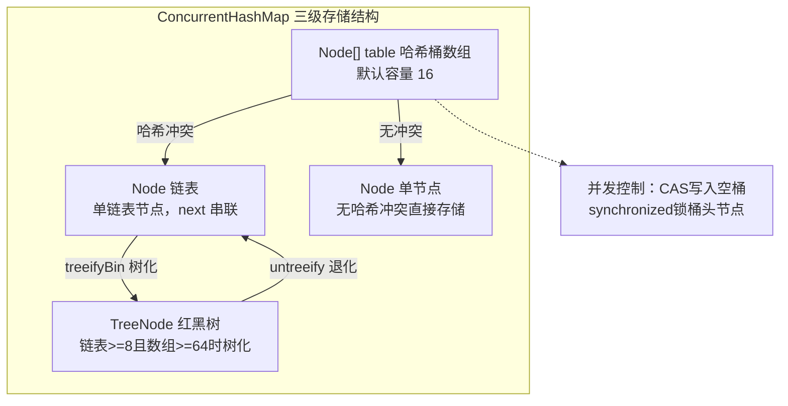
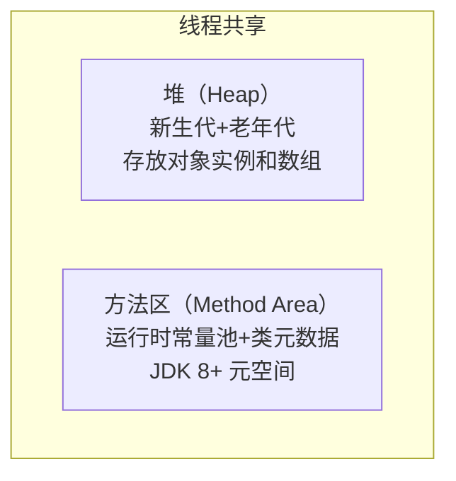
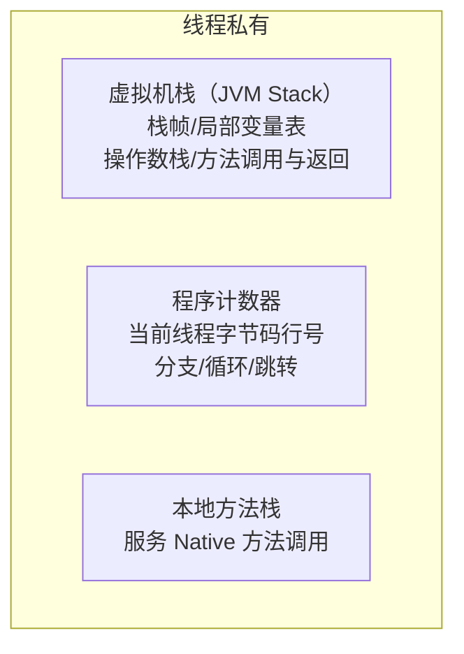
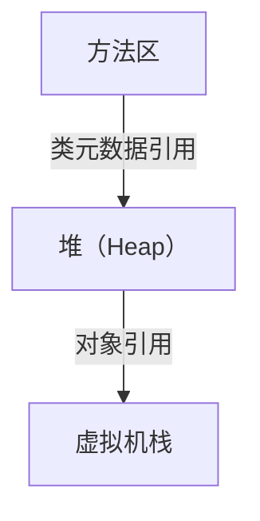

# Java 核心笔面试题集

> 题目来源：常见国企/互联网笔面试真题归纳
> 难度标注：★基础 ★★中档 ★★★拔高

## 一、选择题（30 题，附解析）

1. ★ 以下关于 HashMap 说法正确的是？
   A. HashMap 是线程安全的
   B. HashMap 允许 null 键和 null 值
   C. HashMap 的 key 不需要重写 hashCode
   D. HashMap 默认容量是 8
   **答案：B**
   **解析：** HashMap 线程不安全，允许一个 null 键和多个 null 值，默认容量是 16。key 必须正确重写 hashCode 和 equals。

2. ★★ HashMap 在 JDK 1.8 中当链表长度超过多少时会转换为红黑树？
   A. 6
   B. 7
   C. 8
   D. 10
   **答案：C**
   **解析：** `TREEIFY_THRESHOLD = 8`，且需要数组长度 >= 64（`MIN_TREEIFY_CAPACITY`）。退化为链表的阈值是 6（`UNTREEIFY_THRESHOLD`）。



> 上图展示了 JDK 1.8 ConcurrentHashMap 的数组+链表+红黑树三级存储结构：哈希桶数组作为一级索引，冲突时形成链表，链表超阈值时树化为红黑树以提升查询性能。并发控制通过 CAS 写入空桶、synchronized 锁桶头节点实现细粒度线程安全。

3. ★★ ConcurrentHashMap 在 JDK 1.8 中用什么机制保证线程安全？
   A. Segment 分段锁
   B. CAS + synchronized
   C. ReentrantLock
   D. ReadWriteLock
   **答案：B**
   **解析：** JDK 7 使用 Segment 分段锁（继承 ReentrantLock），JDK 8 废弃 Segment，改用 CAS + synchronized 对桶头节点加锁，粒度更细。

4. ★ ArrayList 的底层数据结构是？
   A. 链表
   B. 数组
   C. 哈希表
   D. 红黑树
   **答案：B**
   **解析：** ArrayList 底层是 `Object[] elementData` 动态数组，扩容时增长至原来的 1.5 倍。

5. ★★ 以下哪些是线程池的拒绝策略？
   A. CallerRunsPolicy（调用者运行）
   B. AbortPolicy（抛出异常）
   C. DiscardPolicy（丢弃任务）
   D. DiscardOldestPolicy（丢弃最旧任务）
   E. 以上都是
   **答案：E**
   **解析：** 四种拒绝策略全部是 ThreadPoolExecutor 的内部类。默认是 AbortPolicy。

6. ★★ synchronized 锁升级的顺序是？
   A. 偏向锁 -> 轻量级锁 -> 重量级锁
   B. 轻量级锁 -> 偏向锁 -> 重量级锁
   C. 重量级锁 -> 轻量级锁 -> 偏向锁
   D. 偏向锁 -> 重量级锁 -> 轻量级锁
   **答案：A**
   **解析：** 锁升级顺序：无锁 -> 偏向锁 -> 轻量级锁 -> 重量级锁。升级为重量级锁后不可降级（但偏向锁可被批量撤销或重偏向）。

7. ★ volatile 关键字的作用是？
   A. 保证原子性
   B. 保证可见性和禁止指令重排序
   C. 保证线程安全
   D. 代替 synchronized
   **答案：B**
   **解析：** volatile 保证可见性和禁止指令重排序，但不保证原子性。`i++` 这样的复合操作不是原子的。

8. ★★★ ThreadLocal 可能导致什么问题？
   A. 死锁
   B. 内存泄漏
   C. 线程不安全
   D. CPU 100%
   **答案：B**
   **解析：** ThreadLocalMap 的 Entry 中 key 是 ThreadLocal 的弱引用，value 是强引用。ThreadLocal 被回收后 key 为 null，但 value 无法回收，导致内存泄漏。

**JVM 运行时数据区**

##### 线程共享区域



> 线程共享区域包括堆和方法区，堆存放对象实例，方法区存放类元数据。

##### 线程私有区域



> 线程私有区域包括虚拟机栈、程序计数器和本地方法栈，各线程独立。

##### 内存区域关联关系



> 上图展示了 JVM 运行时数据区的五大组成部分：线程共享的堆（存放对象实例）和方法区（存放类元数据），以及线程私有的虚拟机栈、程序计数器和本地方法栈。理解各区域职责是排查 OOM、内存泄漏和 GC 问题的基础。

9. ★ JVM 堆内存中，新生代和老年代的比例默认是？
   A. 1:1
   B. 1:2
   C. 1:3
   D. 2:1
   **答案：B**
   **解析：** 默认 `-XX:NewRatio=2`，即老年代:新生代 = 2:1，新生代占堆的 1/3。

10. ★★ CMS 垃圾收集器基于什么算法？
    A. 复制算法
    B. 标记-清除算法
    C. 标记-整理算法
    D. 分代收集算法
    **答案：B**
    **解析：** CMS 老年代收集器基于标记-清除算法，会产生内存碎片。G1 基于标记-整理 + 复制算法。

11. ★★ 以下哪个不是 Java 类加载器？
    A. Bootstrap ClassLoader
    B. Extension ClassLoader
    C. Application ClassLoader
    D. Network ClassLoader
    **答案：D**
    **解析：** Java 三大类加载器：Bootstrap（启动类加载器）、Extension/Platform（扩展/平台类加载器）、Application（应用类加载器）。

12. ★★ 双亲委派模型的核心方法是？
    A. findClass()
    B. loadClass()
    C. defineClass()
    D. resolveClass()
    **答案：B**
    **解析：** `ClassLoader.loadClass()` 实现了双亲委派逻辑：先检查是否已加载 -> 委托父加载器 -> 自己尝试加载。`findClass()` 是子类需要重写的方法。

13. ★★ G1 垃圾收集器的特点不包括？
    A. 将堆划分为多个 Region
    B. 可预测的停顿时间
    C. 没有碎片化问题
    D. 优先回收价值最大的 Region
    **答案：C**
    **解析：** G1 使用标记-整理 + 复制，整体无碎片但局部仍有碎片（可控）。A、B、D 都是 G1 的特点。

14. ★★ String 类为什么被设计为 final？
    A. 提高性能
    B. 保证线程安全、不可变性
    C. 便于垃圾回收
    D. 以上都是
    **答案：D**
    **解析：** String 的不可变性带来了线程安全、字符串常量池优化、HashMap key 的安全性等好处，同时也方便 GC。

15. ★★ 以下关于 equals 和 hashCode 说法正确的是？
    A. 两个对象 equals 相等，hashCode 一定相等
    B. 两个对象 hashCode 相等，equals 一定相等
    C. 两个对象 equals 不相等，hashCode 一定不相等
    D. hashCode 相等与否与 equals 无关
    **答案：A**
    **解析：** Java 规范要求：equals 相等的对象 hashCode 必须相等。但 hashCode 相等时 equals 不一定相等（哈希碰撞）。

16. ★★★ CAS 的 ABA 问题如何解决？
    A. 加锁
    B. 使用版本号（AtomicStampedReference）
    C. 使用 volatile
    D. 使用 synchronized
    **答案：B**
    **解析：** `AtomicStampedReference` 通过版本号（stamp）解决 ABA 问题。每次更新时版本号递增，CAS 时同时检查值和版本号。

17. ★★ 以下哪个情况下对象不会进入老年代？
    A. 大对象直接分配
    B. 年龄达到阈值
    C. Survivor 区中同龄对象超过一半
    D. 对象刚被创建
    **答案：D**
    **解析：** 新创建的对象首先在 Eden 区分配（或在 TLAB 中）。A、B、C 都是对象进入老年代的触发条件。

18. ★★ JVM 参数 -Xms 的含义是？
    A. 最大堆内存
    B. 初始堆内存
    C. 最大栈内存
    D. 最大元空间内存
    **答案：B**
    **解析：** `-Xms` 是初始堆大小（memory start），`-Xmx` 是最大堆大小（memory max）。生产环境建议 `-Xms` 和 `-Xmx` 设为相同值。

19. ★★★ Full GC 频繁的可能原因不包括？
    A. 内存泄漏
    B. 大对象频繁创建
    C. 代码逻辑正常
    D. Metaspace 不足
    **答案：C**
    **解析：** Full GC 频繁说明 JVM 内存压力大。A、B、D 都可能导致 Full GC 频繁。代码逻辑正常通常不会导致 Full GC 频繁。

20. ★★ CompletableFuture 的 supplyAsync 和 runAsync 的区别是？
    A. 一个有返回值一个没有
    B. 一个异步一个同步
    C. 一个并行一个串行
    D. 没有区别
    **答案：A**
    **解析：** `supplyAsync(Supplier)` 有返回值（`CompletableFuture<T>`），`runAsync(Runnable)` 无返回值（`CompletableFuture<Void>`）。

21. ★ Java 中 char 类型占几个字节？
    A. 1 字节
    B. 2 字节
    C. 3 字节
    D. 4 字节
    **答案：B**
    **解析：** Java 的 char 使用 Unicode 编码，固定占 2 字节（16 位），范围 0~65535。C 语言的 char 占 1 字节。

22. ★ switch 语句中不能使用以下哪种数据类型？
    A. int
    B. String
    C. double
    D. enum
    **答案：C**
    **解析：** switch 支持 byte、short、char、int、String、enum。JDK 14+ 还支持模式匹配。不支持 long、float、double、boolean。

23. ★★ 以下关于数组说法正确的是？
    A. 数组长度可以动态改变
    B. 二维数组的每一行长度必须相同
    C. 数组的默认值取决于元素类型
    D. `int[] arr = new int[3]{1,2,3}` 是正确的语法
    **答案：C**
    **解析：** 数组长度不可变（A错）；二维数组可以是不规则数组（B错）；静态初始化不能同时指定长度和元素（D错，应去掉 `[3]`）。

24. ★★ try-catch-finally 中，如果 catch 中有 return，finally 还会执行吗？
    A. 不会执行
    B. 会执行，但 catch 的 return 值会被 finally 的 return 覆盖
    C. 会执行，且 finally 在 return 之前执行
    D. 取决于异常类型
    **答案：C**
    **解析：** finally 一定会执行（除非 System.exit(0) 或 JVM 崩溃）。catch 的 return 值先暂存，执行 finally 后再返回。如果 finally 中也有 return，会覆盖 catch 的 return 值。

25. ★★ 以下关于泛型类型擦除说法正确的是？
    A. 泛型信息在运行时仍然保留
    B. `List<String>` 和 `List<Integer>` 的 Class 对象不同
    C. 泛型擦除后，类型参数被替换为 Object 或其上界
    D. 可以通过反射获取泛型的具体类型参数
    **答案：C**
    **解析：** Java 泛型通过类型擦除实现，编译后泛型信息被擦除。`List<String>` 和 `List<Integer>` 在运行时是同一个 Class。可以通过反射获取方法签名中的泛型信息（因为方法签名保留在字节码中）。

26. ★★ 以下哪个流是字符流？
    A. FileInputStream
    B. FileOutputStream
    C. FileReader
    D. BufferedInputStream
    **答案：C**
    **解析：** 以 Stream 结尾的是字节流（InputStream/OutputStream），以 Reader/Writer 结尾的是字符流。FileReader 是字符输入流。

27. ★ TCP 三次握手中，第三次握手的作用是？
    A. 确认服务端发送能力正常
    B. 确认客户端接收能力正常
    C. 防止已失效的连接请求到达服务端
    D. 协商通信参数
    **答案：C**
    **解析：** 第三次握手（客户端发送 ACK）主要是防止已失效的连接请求报文段突然又传到服务端，导致服务端错误地建立连接。

28. ★★ 获取 Class 对象的方式不包括？
    A. `Class.forName("全限定类名")`
    B. `类名.class`
    C. `对象.getClass()`
    D. `Class.newInstance("全限定类名")`
    **答案：D**
    **解析：** 获取 Class 对象的三种方式：`Class.forName()`、`类名.class`、`对象.getClass()`。`Class.newInstance()` 是创建实例的方法（JDK 9 已废弃，推荐用 `Constructor.newInstance()`）。

29. ★★ Lambda 表达式中 `(a, b) -> a + b` 属于哪种语法？
    A. 参数类型声明
    B. 单条语句返回值
    C. 方法引用
    D. 构造器引用
    **答案：B**
    **解析：** Lambda 表达式三种语法：`(参数) -> 单条语句`（可省略 return）、`(参数) -> { 多条语句; return 值; }`、`(参数) -> 表达式`。此例属于第一种，省略了 return 和花括号。

30. ★★ Stream API 中，`filter()` 属于哪种操作？
    A. 终端操作
    B. 中间操作
    C. 短路操作
    D. 聚合操作
    **答案：B**
    **解析：** Stream 操作分为中间操作（filter、map、sorted、distinct 等，返回 Stream）和终端操作（forEach、collect、reduce、count 等，返回非 Stream 结果）。`filter` 是中间操作，惰性求值。

> 📖 **参考链接**：
> - [Java SE 17 API: java.util.HashMap](https://docs.oracle.com/javase/17/docs/api/java.base/java/util/HashMap.html)
> - [Java SE 17 API: java.util.concurrent.ConcurrentHashMap](https://docs.oracle.com/javase/17/docs/api/java.base/java/util/concurrent/ConcurrentHashMap.html)
> - [JEP 266: More Concurrency Updates](https://openjdk.org/jeps/266)
> - [Java SE 17 API: java.util.stream 包](https://docs.oracle.com/javase/17/docs/api/java.base/java/util/stream/package-summary.html)

---

## 二、简答题（15 题，附要点）

### 1. ★★ HashMap 的 put 流程？

**要点：**
1. 计算 key 的 hash 值（`hashCode()` 高 16 位与低 16 位异或）
2. 判断 table 是否为 null，是则 `resize()` 初始化
3. 根据 hash 计算下标 `i = (n-1) & hash`，若为空直接插入
4. 若不为空，判断首节点 key 是否匹配（相等则覆盖旧值）
5. 判断是链表还是红黑树（`instanceof TreeNode`），链表则尾插，红黑树则树插入
6. 链表插入后判断是否超过阈值（8），超过则调用 `treeifyBin` 树化
7. 判断 `++size` 是否超过 `threshold`，超过则 `resize()` 扩容

> **生活化类比：停车场管理** -- HashMap 的 put 流程就像停车场找车位：
> - hash 计算就像根据车牌号计算"应该停在几号区域"（桶下标）。
> - 区域空着直接停（空桶直接插入）；区域已有车，看是否同一车牌（key 相等覆盖旧值）。
> - 同一区域停了多辆车形成排队（链表），排队超过 8 辆就升级为立体车库（红黑树树化）。
> - 停车场满了（超过阈值）就扩建（resize 扩容）。

> 📖 **参考链接**：
> - [Java SE 17 API: java.util.HashMap](https://docs.oracle.com/javase/17/docs/api/java.base/java/util/HashMap.html)
> - [JEP 180: Frequently Used Methods in HashMap](https://openjdk.org/jeps/180) -- HashMap 性能优化

### 2. ★★ ConcurrentHashMap 在 JDK 1.7 和 1.8 的线程安全实现区别？

**要点：**
- **JDK 7：** 使用 Segment 分段锁（继承 ReentrantLock），默认并发度 16，锁粒度是 Segment。每个 Segment 内部是一个独立的 HashMap
- **JDK 8：** 使用 CAS + synchronized，锁粒度是单个 Node 节点。空桶 CAS 插入，非空桶对桶头节点加锁。并发度理论上等于桶数量，远高于 JDK 7
- **本质区别：** 锁粒度从 Segment 级别降低到单个桶级别

> 📖 **参考链接**：
> - [Java SE 17 API: java.util.concurrent.ConcurrentHashMap](https://docs.oracle.com/javase/17/docs/api/java.base/java/util/concurrent/ConcurrentHashMap.html)
> - [Oracle Java Concurrency Tutorial: Concurrent Collections](https://docs.oracle.com/javase/tutorial/essential/concurrency/collections.html)

### 3. ★★ synchronized 和 ReentrantLock 的区别？

**要点：**
1. synchronized 是 JVM 层面关键字，ReentrantLock 是 API 层面（`java.util.concurrent.locks`）
2. synchronized 自动释放锁（代码块退出或异常），ReentrantLock 需手动 `unlock()`（推荐在 finally 块中）
3. ReentrantLock 支持公平锁、可中断获取（`lockInterruptibly()`）、超时获取（`tryLock(timeout)`）、多条件等待（多个 Condition）
4. synchronized 在 JDK 6 后经过锁升级优化，性能与 ReentrantLock 接近

> 📖 **参考链接**：
> - [Java SE 17 API: java.util.concurrent.locks.ReentrantLock](https://docs.oracle.com/javase/17/docs/api/java.base/java/util/concurrent/locks/ReentrantLock.html)
> - [JLS §17.1: Synchronization](https://docs.oracle.com/javase/specs/jls/se17/html/jls-17.html#jls-17.1)

### 4. ★★ 线程池的核心参数和执行流程？

**要点：**
- **7 个参数：** `corePoolSize`、`maximumPoolSize`、`keepAliveTime`、`unit`、`workQueue`、`threadFactory`、`handler`
- **执行流程：**
  1. 当前线程数 < corePoolSize：创建核心线程执行任务
  2. 线程数 >= corePoolSize：任务放入工作队列
  3. 队列满且线程数 < maximumPoolSize：创建非核心线程
  4. 队列满且线程数 = maximumPoolSize：执行拒绝策略

> 📖 **参考链接**：
> - [Java SE 17 API: java.util.concurrent.ThreadPoolExecutor](https://docs.oracle.com/javase/17/docs/api/java.base/java/util/concurrent/ThreadPoolExecutor.html)
> - [Oracle Java Concurrency Tutorial: Thread Pools](https://docs.oracle.com/javase/tutorial/essential/concurrency/pools.html)

### 5. ★★ 什么是 AQS？ReentrantLock 如何基于 AQS 实现？

**要点：**
- AQS = AbstractQueuedSynchronizer，基于 CLH 队列的同步框架
- 核心三要素：`state` 变量（volatile int，同步状态）、CLH 队列（双向链表，存储等待线程）、独占/共享模式
- ReentrantLock 内部有 Sync（继承 AQS），通过 `state` 变量表示锁状态：0 = 未锁，1 = 已锁，>1 = 重入次数
- 获取锁时 CAS 尝试将 state 从 0 改为 1，失败则入队等待
- 释放锁时将 state 减 1，减到 0 时唤醒队首等待线程

> **生活化类比：银行排队取号** -- AQS 就像银行大厅的排队系统：
> - `state` 变量就像柜台的"服务状态灯"：0 = 空闲，1 = 正在服务，2+ = VIP 客户多次进入（重入）。
> - CLH 队列就像大厅里的排队叫号机，每个人（线程）拿到一个号牌（Node），按顺序排成一条链。
> - CAS 就像抢号：你尝试把状态灯从 0 改成 1（抢到服务），成功就直接办事；失败就老老实实排队。
> - 办完事的人走的时候看看后面有没有人排队（state 减到 0），有的话叫下一个人（唤醒队首线程）。

> 📖 **参考链接**：
> - [Java SE 17 API: java.util.concurrent.locks.AbstractQueuedSynchronizer](https://docs.oracle.com/javase/17/docs/api/java.base/java/util/concurrent/locks/AbstractQueuedSynchronizer.html)
> - [Oracle Java Concurrency Tutorial: Lock Objects](https://docs.oracle.com/javase/tutorial/essential/concurrency/newlocks.html)

### 6. ★★ JVM 垃圾回收的判定方法？

**要点：**
1. **引用计数法：** 每个对象维护一个引用计数器，为 0 时回收。无法解决循环引用问题（A 引用 B，B 引用 A，但都不再被外部引用）
2. **可达性分析（Java 使用）：** 从 GC Roots 出发，通过引用链能到达的对象视为存活，不可达的对象判定为垃圾
3. **GC Roots 包括：** 栈帧中的局部变量、静态变量、JNI 引用、活跃线程、被 synchronized 持有的对象等

> **生活化类比：寻人启事排查** -- 可达性分析就像警察排查失踪人口：
> - GC Roots 就像"已知的还活着的人"（警察、家属、目击证人），从他们出发去追踪社会关系网。
> - 能通过关系链找到的人 = 存活对象（有人认识你，你还活着）。
> - 找不到任何关系链的人 = 垃圾对象（没有人认识你了，认定失踪/回收）。
> - 引用计数法的缺陷：两个人互相说"我认识他"（A↔B 循环引用），但实际上没有任何其他人认识他们，应该被回收但计数器不为 0。

> 📖 **参考链接**：
> - [JVM Specification §3.5: Garbage Collection](https://docs.oracle.com/javase/specs/jvms/se17/html/jvms-3.html#jvms-3.5)
> - [Java SE 17 API: java.lang.ref 包](https://docs.oracle.com/javase/17/docs/api/java.base/java/lang/ref/package-summary.html) -- 引用类型

### 7. ★★ 类加载过程？

**要点：**
1. **加载：** 通过类全限定名获取二进制字节流，将静态存储结构转换为方法区运行时数据结构，生成 Class 对象
2. **验证：** 确保字节码符合 JVM 规范（文件格式、元数据、字节码、符号引用验证）
3. **准备：** 为静态变量分配内存并赋零值（`static int a = 1` 在此阶段 a = 0）
4. **解析：** 将符号引用替换为直接引用
5. **初始化：** 执行 `<clinit>` 方法，静态变量赋初始值，执行静态代码块
6. 使用 -> 卸载

> 📖 **参考链接**：
> - [JVM Specification §5: Loading, Linking, and Initializing](https://docs.oracle.com/javase/specs/jvms/se17/html/jvms-5.html)
> - [Java SE 17 API: java.lang.ClassLoader](https://docs.oracle.com/javase/17/docs/api/java.base/java/lang/ClassLoader.html)

### 8. ★★★ 什么情况下需要打破双亲委派模型？

**要点：**
1. **JDBC 驱动加载（SPI 机制）：** `DriverManager` 在 `rt.jar` 中（由 Bootstrap 加载），但具体驱动在 classpath 中（由 Application 加载）。Bootstrap 无法向下委托，需通过线程上下文类加载器（`Thread.currentThread().getContextClassLoader()`）
2. **Tomcat 类加载：** 每个 WebApp 使用独立的 `WebappClassLoader`，实现应用隔离（不同应用可加载不同版本的同一库）
3. **热部署/热替换：** 需要卸载旧的类加载器，创建新的类加载器加载新的类
4. **OSGi 模块化：** 每个 Bundle 有自己的类加载器，实现模块级类隔离

> 📖 **参考链接**：
> - [JVM Specification §5.3: Creation and Loading](https://docs.oracle.com/javase/specs/jvms/se17/html/jvms-5.html#jvms-5.3)
> - [JVM Specification §5.3.2: Delegation Hierarchy](https://docs.oracle.com/javase/specs/jvms/se17/html/jvms-5.html#jvms-5.3.2) -- 双亲委派模型
> - [Java SE 17 API: java.util.ServiceLoader](https://docs.oracle.com/javase/17/docs/api/java.base/java/util/ServiceLoader.html) -- SPI 机制

### 9. ★★ G1 和 CMS 的区别？

**要点：**
1. **算法：** CMS 基于标记-清除（有碎片），G1 基于标记-整理 + 复制（可控）
2. **堆结构：** CMS 连续分代，G1 将堆分为多个 Region
3. **停顿时间：** CMS 不可预测，G1 可预测（`-XX:MaxGCPauseMillis`）
4. **回收范围：** CMS 仅回收老年代，G1 回收全堆（Young GC + Mixed GC）
5. **适用场景：** CMS 适合中小堆（<4GB），G1 适合大堆（>4GB）

> 📖 **参考链接**：
> - [JEP 248: Make G1 the Default Garbage Collector](https://openjdk.org/jeps/248)
> - [JEP 291: Deprecate the CMS Garbage Collector](https://openjdk.org/jeps/291)
> - [JEP 363: Remove the CMS Garbage Collector](https://openjdk.org/jeps/363)

### 10. ★★ ThreadLocal 原理和内存泄漏？

**要点：**
- 每个 Thread 内部有 `ThreadLocalMap`，key 是 ThreadLocal 的弱引用（WeakReference），value 是强引用
- ThreadLocal 被 GC 回收后 key 变为 null，但 value 作为强引用无法回收，只要线程存活就一直存在
- **解决方案：** 每次使用后调用 `remove()` 方法清理
- **使用场景：** 数据库连接管理、Session 管理、链路追踪（TraceId）、避免 SimpleDateFormat 线程安全问题

> **生活化类比：员工工位储物柜** -- ThreadLocal 就像公司里每个员工的私人储物柜：
> - 每个员工（线程）有一个自己的储物柜（ThreadLocalMap），柜子里放着个人物品（value）。
> - 储物柜的钥匙牌（ThreadLocal 弱引用）挂在公共钥匙架上。如果钥匙牌丢了（ThreadLocal 被 GC），柜子里的物品（value）还在，但没人能打开了——这就是**内存泄漏**。
> - 解决方案：离职时把柜子清空（`remove()`），不要留东西在里面。

> 📖 **参考链接**：
> - [Java SE 17 API: java.lang.ThreadLocal](https://docs.oracle.com/javase/17/docs/api/java.base/java/lang/ThreadLocal.html)
> - [JEP 446: Scoped Values (Preview)](https://openjdk.org/jeps/446) -- ThreadLocal 现代替代方案

### 11. ★★ Java 中值传递和引用传递的区别？

**要点：**
- Java 只有值传递，没有引用传递
- 基本类型：传递的是值的副本，修改不影响原值
- 引用类型：传递的是引用的副本（指向同一对象），通过引用修改对象内容会影响原对象，但修改引用本身（如设为 null）不影响原引用
- 常见误区：`swap(a, b)` 方法无法交换两个对象引用，因为传入的是引用的副本

> 📖 **参考链接**：
> - [JLS §8.4.1: Formal Parameters](https://docs.oracle.com/javase/specs/jls/se17/html/jls-8.html#jls-8.4.1) -- 参数传递规范
> - [Oracle Java Tutorial: Passing Information to a Method](https://docs.oracle.com/javase/tutorial/java/javaOO/arguments.html)

### 12. ★★ Checked Exception 和 Unchecked Exception 的区别？

**要点：**
- Checked Exception（受检异常）：继承自 Exception（非 RuntimeException），编译时必须处理（try-catch 或 throws），如 IOException、SQLException
- Unchecked Exception（非受检异常）：继承自 RuntimeException，编译时不强制处理，如 NullPointerException、ArrayIndexOutOfBoundsException
- Error：表示 JVM 级别的严重错误，不应捕获，如 OutOfMemoryError、StackOverflowError
- 设计原则：可恢复的用 Checked，编程错误用 Unchecked

> 📖 **参考链接**：
> - [JLS §11: Exceptions](https://docs.oracle.com/javase/specs/jls/se17/html/jls-11.html)
> - [Java SE 17 API: java.lang.Exception](https://docs.oracle.com/javase/17/docs/api/java.base/java/lang/Exception.html)
> - [Java SE 17 API: java.lang.RuntimeException](https://docs.oracle.com/javase/17/docs/api/java.base/java/lang/RuntimeException.html)

### 13. ★★ Java 序列化中 serialVersionUID 的作用？

**要点：**
- serialVersionUID 是序列化版本号，用于验证序列化和反序列化对象的版本一致性
- 如果未显式定义，JVM 会根据类结构自动生成（类名、字段、方法等），类结构变化会导致版本号变化
- 反序列化时，如果 serialVersionUID 不匹配，会抛出 InvalidClassException
- 最佳实践：显式定义 `private static final long serialVersionUID = 1L;`，兼容性修改时保持不变

> 📖 **参考链接**：
> - [Java SE 17 API: java.io.Serializable](https://docs.oracle.com/javase/17/docs/api/java.base/java/io/Serializable.html)
> - [Java SE 17 API: java.io.ObjectInputStream](https://docs.oracle.com/javase/17/docs/api/java.base/java/io/ObjectInputStream.html) -- 反序列化版本校验

### 14. ★★ TCP 和 UDP 的主要区别及适用场景？

**要点：**

| 维度 | TCP | UDP |
|------|-----|-----|
| 连接 | 面向连接（三次握手） | 无连接 |
| 可靠性 | 可靠（确认+重传） | 不可靠 |
| 有序性 | 有序 | 可能乱序 |
| 头部开销 | 20 字节 | 8 字节 |
| 适用场景 | 文件传输、HTTP、邮件 | 视频直播、DNS、游戏 |
- TCP 通过序列号、确认应答、重传机制、流量控制、拥塞控制保证可靠性
- UDP 适合实时性要求高、可容忍少量丢包的场景

> 📖 **参考链接**：
> - [Java SE 17 API: java.net.Socket](https://docs.oracle.com/javase/17/docs/api/java.base/java/net/Socket.html) -- TCP 客户端
> - [Java SE 17 API: java.net.DatagramSocket](https://docs.oracle.com/javase/17/docs/api/java.base/java/net/DatagramSocket.html) -- UDP 套接字
> - [Oracle Java Tutorial: All About Sockets](https://docs.oracle.com/javase/tutorial/networking/sockets/)

### 15. ★★ Stream API 中 map 和 flatMap 的区别？

**要点：**
- `map`：一对一映射，将每个元素转换为另一个元素。`Stream<T> -> Stream<R>`
- `flatMap`：一对多映射，将每个元素转换为一个 Stream，然后将所有 Stream 扁平化合并。`Stream<T> -> Stream<R>`
- 典型场景：`map` 用于提取对象属性（如 `users.stream().map(User::getName)`）；`flatMap` 用于展开嵌套集合（如 `list.stream().flatMap(Collection::stream)`）
- 类比：`flatMap` = `map` + `flatten`

> **生活化类比：拆快递与合并包裹** -- map 和 flatMap 的区别就像快递分拣：
> - `map`：每个快递箱贴一个新标签（一对一转换）。10 个箱子进，10 个箱子出，只是标签变了。
> - `flatMap`：每个快递箱拆开，里面可能有多个小包裹，拆完后所有小包裹摊在一起。比如 3 个大箱子，每个里面有 4 个小包裹，`flatMap` 后得到 12 个小包裹。
> - 场景：把"一个班级的学生列表"转为"每个学生的所有成绩"用 `map`（每个学生→成绩列表）；要"把所有学生的所有成绩展平成一个列表"用 `flatMap`（拆开+摊平）。

> 📖 **参考链接**：
> - [Java SE 17 API: java.util.stream.Stream.map](https://docs.oracle.com/javase/17/docs/api/java.base/java/util/stream/Stream.html#map(java.util.function.Function))
> - [Java SE 17 API: java.util.stream.Stream.flatMap](https://docs.oracle.com/javase/17/docs/api/java.base/java/util/stream/Stream.html#flatMap(java.util.function.Function))
> - [JEP 107: Bulk Data Operations for Collections](https://openjdk.org/jeps/107)

---

## 三、编程题（8 题，附思路）

### 1. ★ 用 Java 实现一个 LRU 缓存（基于 LinkedHashMap）

**思路：** 继承 `LinkedHashMap`，构造时设置 `accessOrder=true`（按访问顺序排序），重写 `removeEldestEntry` 方法，当 `size() > capacity` 时返回 true 自动删除最旧元素。

```java
public class LRUCache<K, V> extends LinkedHashMap<K, V> {
    private final int capacity;

    public LRUCache(int capacity) {
        super(capacity, 0.75f, true); // accessOrder = true
        this.capacity = capacity;
    }

    @Override
    protected boolean removeEldestEntry(Map.Entry<K, V> eldest) {
        return size() > capacity;
    }
}
```

**完整可运行版本（含测试用例）**：

```java
// 手写LRU缓存 - 完整可运行版本（基于LinkedHashMap）
public class LRUCache<K, V> extends LinkedHashMap<K, V> {
    private final int capacity;

    public LRUCache(int capacity) {
        // accessOrder=true 按访问顺序排序，最近访问的排在末尾
        super(capacity, 0.75f, true);
        this.capacity = capacity;
    }

    @Override
    protected boolean removeEldestEntry(Map.Entry<K, V> eldest) {
        // 当size超过容量时自动删除最旧的条目
        return size() > capacity;
    }

    // 测试用例
    public static void main(String[] args) {
        LRUCache<String, String> cache = new LRUCache<>(3);
        cache.put("A", "1");
        cache.put("B", "2");
        cache.put("C", "3");
        System.out.println("初始: " + cache.keySet());   // [A, B, C]

        cache.get("A");  // 访问A，A移到末尾
        System.out.println("访问A后: " + cache.keySet()); // [B, C, A]

        cache.put("D", "4");  // 超出容量，删除最旧的B
        System.out.println("插入D后: " + cache.keySet()); // [C, A, D]
    }
}
```

**进阶版本：基于HashMap + 双向链表（不依赖LinkedHashMap）**：

```java
// 手写LRU缓存 - 基于HashMap + 双向链表（纯手写，面试高频）
public class LRUCacheManual<K, V> {
    private final int capacity;
    private final Map<K, Node<K, V>> map;
    private final Node<K, V> head;  // 哨兵头节点（最近使用）
    private final Node<K, V> tail;  // 哨兵尾节点（最久未使用）

    public LRUCacheManual(int capacity) {
        this.capacity = capacity;
        this.map = new HashMap<>();
        this.head = new Node<>(null, null);
        this.tail = new Node<>(null, null);
        head.next = tail;
        tail.prev = head;
    }

    public V get(K key) {
        Node<K, V> node = map.get(key);
        if (node == null) return null;
        moveToHead(node);  // 访问后移到头部，表示最近使用
        return node.value;
    }

    public void put(K key, V value) {
        Node<K, V> node = map.get(key);
        if (node != null) {
            // 已存在：更新值并移到头部
            node.value = value;
            moveToHead(node);
        } else {
            // 不存在：新建节点
            if (map.size() >= capacity) {
                removeTail();  // 超出容量，删除最久未使用的
            }
            Node<K, V> newNode = new Node<>(key, value);
            map.put(key, newNode);
            addToHead(newNode);
        }
    }

    // ===== 双向链表操作 =====
    private void addToHead(Node<K, V> node) {
        node.prev = head;
        node.next = head.next;
        head.next.prev = node;
        head.next = node;
    }

    private void removeNode(Node<K, V> node) {
        node.prev.next = node.next;
        node.next.prev = node.prev;
    }

    private void moveToHead(Node<K, V> node) {
        removeNode(node);
        addToHead(node);
    }

    private void removeTail() {
        Node<K, V> last = tail.prev;
        map.remove(last.key);
        removeNode(last);
    }

    // 双向链表节点
    static class Node<K, V> {
        K key;
        V value;
        Node<K, V> prev, next;
        Node(K key, V value) {
            this.key = key;
            this.value = value;
        }
    }

    // 测试用例
    public static void main(String[] args) {
        LRUCacheManual<Integer, String> cache = new LRUCacheManual<>(3);
        cache.put(1, "A");
        cache.put(2, "B");
        cache.put(3, "C");
        System.out.println(cache.get(1));  // A
        cache.put(4, "D");                // 超出容量，删除key=2
        System.out.println(cache.get(2));  // null（已被淘汰）
        System.out.println(cache.get(3));  // C
        System.out.println(cache.get(1));  // A
        System.out.println(cache.get(4));  // D
    }
}
```

> 📖 **参考链接**：
> - [Java SE 17 API: java.util.LinkedHashMap](https://docs.oracle.com/javase/17/docs/api/java.base/java/util/LinkedHashMap.html) -- `removeEldestEntry` 实现 LRU
> - [Java SE 17 API: java.util.HashMap](https://docs.oracle.com/javase/17/docs/api/java.base/java/util/HashMap.html)

### 2. ★★ 手写一个线程安全的单例模式（双重检查锁定 + volatile）

**思路：** `private static volatile` 修饰 instance，`getInstance()` 中两次 `if (instance == null)` 检查 + `synchronized` 块。volatile 防止指令重排导致返回未初始化的对象。

```java
public class Singleton {
    private static volatile Singleton instance;

    private Singleton() {}

    public static Singleton getInstance() {
        if (instance == null) {
            synchronized (Singleton.class) {
                if (instance == null) {
                    instance = new Singleton();
                }
            }
        }
        return instance;
    }
}
```

**方式二：静态内部类实现（推荐方式，线程安全 + 懒加载）**：

```java
// 手写单例模式 - 静态内部类方式（利用类加载机制保证线程安全）
public class Singleton {
    private Singleton() {
        // 防止反射破坏单例
        if (SingletonHolder.INSTANCE != null) {
            throw new RuntimeException("单例已存在，不允许通过反射重复创建");
        }
    }

    // 静态内部类：在第一次被引用时才加载，天然实现懒加载
    private static class SingletonHolder {
        private static final Singleton INSTANCE = new Singleton();
    }

    public static Singleton getInstance() {
        return SingletonHolder.INSTANCE;
    }

    // 防止反序列化破坏单例
    private Object readResolve() {
        return SingletonHolder.INSTANCE;
    }

    // 测试用例
    public static void main(String[] args) {
        // 多线程测试
        for (int i = 0; i < 5; i++) {
            new Thread(() -> {
                Singleton s = Singleton.getInstance();
                System.out.println(Thread.currentThread().getName() + " -> " + s.hashCode());
            }).start();
        }
    }
}
```

**对比总结**：

| 维度 | DCL（双重检查锁定） | 静态内部类 |
|------|---------------------|-----------|
| 线程安全 | 靠volatile+synchronized | 靠JVM类加载机制 |
| 懒加载 | 是 | 是（内部类首次引用时才加载） |
| 实现复杂度 | 较高（需注意volatile） | 简单 |
| 反序列化安全 | 需额外处理 | 需额外处理readResolve |
| 反射安全 | 不防反射 | 可在构造器中加判断 |

> 📖 **参考链接**：
> - [JLS §17.4: Memory Model](https://docs.oracle.com/javase/specs/jls/se17/html/jls-17.html#jls-17.4) -- volatile 与指令重排序
> - [JLS §8.3.1.4: volatile Fields](https://docs.oracle.com/javase/specs/jls/se17/html/jls-8.html#jls-8.3.1.4)
> - [JLS §12.4: Initialization of Classes and Interfaces](https://docs.oracle.com/javase/specs/jls/se17/html/jls-12.html#jls-12.4) -- 静态内部类延迟初始化

### 3. ★★ 实现一个简单的线程池

**思路：** 维护 `BlockingQueue` 任务队列 + `List<Worker>` 线程集合。Worker 循环从队列取任务执行。核心线程数满后入队，队列满后创建新线程直到最大线程数，达到最大线程数后执行拒绝策略。

```java
public class SimpleThreadPool {
    private final BlockingQueue<Runnable> taskQueue;
    private final List<Worker> workers;
    private final int coreSize;
    private final int maxSize;
    private volatile boolean isShutdown = false;

    public SimpleThreadPool(int coreSize, int maxSize, int queueSize) {
        this.coreSize = coreSize;
        this.maxSize = maxSize;
        this.taskQueue = new ArrayBlockingQueue<>(queueSize);
        this.workers = new ArrayList<>(maxSize);
        for (int i = 0; i < coreSize; i++) {
            Worker worker = new Worker();
            workers.add(worker);
            worker.start();
        }
    }

    public void execute(Runnable task) {
        // 队列没满直接入队
        if (taskQueue.offer(task)) {
            return;
        }
        // 队列已满，尝试创建新线程（最多到 maxSize）
        synchronized (workers) {
            if (workers.size() < maxSize) {
                Worker worker = new Worker();
                workers.add(worker);
                worker.start();
                // 新线程创建后，自旋等待队列空位，最多重试 3 次
                for (int i = 0; i < 3; i++) {
                    if (taskQueue.offer(task)) {
                        return;
                    }
                    try { Thread.sleep(10); } catch (InterruptedException e) {
                        Thread.currentThread().interrupt();
                        break;
                    }
                }
            }
        }
        throw new RejectedExecutionException("任务队列已满，线程池已达最大容量");
    }

    private class Worker extends Thread {
        @Override
        public void run() {
            while (!isShutdown) {
                try {
                    Runnable task = taskQueue.poll(1, TimeUnit.SECONDS);
                    if (task != null) {
                        task.run();
                    } else {
                        // 非核心线程空闲超时退出
                        synchronized (workers) {
                            if (workers.size() > coreSize) {
                                workers.remove(this);
                                break;
                            }
                        }
                    }
                } catch (InterruptedException e) {
                    Thread.currentThread().interrupt();
                }
            }
        }
    }
}
```

**完整版本：遵循ThreadPoolExecutor核心参数和执行流程**：

```java
// 手写线程池 - 完整模拟ThreadPoolExecutor核心逻辑
import java.util.concurrent.*;
import java.util.concurrent.atomic.AtomicInteger;

public class SimpleThreadPoolExecutor {
    // ===== 核心参数 =====
    private final int corePoolSize;       // 核心线程数
    private final int maximumPoolSize;    // 最大线程数
    private final long keepAliveTime;     // 非核心线程空闲存活时间
    private final TimeUnit unit;
    private final BlockingQueue<Runnable> workQueue;  // 工作队列
    private final ThreadFactory threadFactory;         // 线程工厂
    private final RejectedExecutionHandler handler;   // 拒绝策略

    private final AtomicInteger workerCount = new AtomicInteger(0);  // 当前工作线程数
    private volatile boolean isShutdown = false;

    // ===== 四种内置拒绝策略 =====
    public static class AbortPolicy implements RejectedExecutionHandler {
        public void rejectedExecution(Runnable r, SimpleThreadPoolExecutor e) {
            throw new RejectedExecutionException("任务被拒绝：" + r);
        }
    }

    public static class CallerRunsPolicy implements RejectedExecutionHandler {
        public void rejectedExecution(Runnable r, SimpleThreadPoolExecutor e) {
            if (!e.isShutdown()) {
                r.run();  // 由调用者线程自己执行
            }
        }
    }

    public SimpleThreadPoolExecutor(int corePoolSize,
                                    int maximumPoolSize,
                                    long keepAliveTime,
                                    TimeUnit unit,
                                    BlockingQueue<Runnable> workQueue) {
        this(corePoolSize, maximumPoolSize, keepAliveTime, unit, workQueue,
             Executors.defaultThreadFactory(), new AbortPolicy());
    }

    public SimpleThreadPoolExecutor(int corePoolSize,
                                    int maximumPoolSize,
                                    long keepAliveTime,
                                    TimeUnit unit,
                                    BlockingQueue<Runnable> workQueue,
                                    ThreadFactory threadFactory,
                                    RejectedExecutionHandler handler) {
        this.corePoolSize = corePoolSize;
        this.maximumPoolSize = maximumPoolSize;
        this.keepAliveTime = keepAliveTime;
        this.unit = unit;
        this.workQueue = workQueue;
        this.threadFactory = threadFactory;
        this.handler = handler;
    }

    // ===== 执行流程（核心）=====
    public void execute(Runnable command) {
        if (command == null) throw new NullPointerException();

        int count = workerCount.get();
        // 1. 当前线程数 < 核心线程数：创建核心线程执行
        if (count < corePoolSize) {
            if (addWorker(command, true)) return;
        }
        // 2. 核心线程已满：尝试入队
        if (workQueue.offer(command)) {
            // 入队成功
        } else {
            // 3. 队列已满：尝试创建非核心线程
            if (!addWorker(command, false)) {
                // 4. 达到最大线程数：执行拒绝策略
                handler.rejectedExecution(command, this);
            }
        }
    }

    // 添加工作线程
    private boolean addWorker(Runnable firstTask, boolean isCore) {
        if (isShutdown) return false;

        int current = workerCount.get();
        int max = isCore ? corePoolSize : maximumPoolSize;
        if (current >= max) return false;

        Worker worker = new Worker(firstTask);
        Thread thread = threadFactory.newThread(worker);
        if (thread == null) return false;

        worker.setThread(thread);
        workerCount.incrementAndGet();
        thread.start();
        return true;
    }

    // ===== 工作线程 =====
    private class Worker implements Runnable {
        private final Runnable firstTask;
        private Thread thread;

        Worker(Runnable firstTask) {
            this.firstTask = firstTask;
        }

        void setThread(Thread thread) {
            this.thread = thread;
        }

        @Override
        public void run() {
            Runnable task = firstTask;
            while (!isShutdown || task != null || !workQueue.isEmpty()) {
                try {
                    // 有任务直接执行，没有从队列获取
                    while (task == null) {
                        // 非核心线程：keepAliveTime超时退出
                        task = keepAliveTime > 0
                            ? workQueue.poll(keepAliveTime, unit)
                            : workQueue.take();
                        if (task == null && workerCount.get() > corePoolSize) {
                            // 超时退出，减少计数
                            workerCount.decrementAndGet();
                            return;
                        }
                    }

                    // 执行任务
                    if (task != null) {
                        task.run();
                        task = null;
                    }
                } catch (InterruptedException e) {
                    Thread.currentThread().interrupt();
                }
            }
        }
    }

    // 拒绝策略接口
    public interface RejectedExecutionHandler {
        void rejectedExecution(Runnable r, SimpleThreadPoolExecutor executor);
    }

    // ===== 测试用例 =====
    public static void main(String[] args) {
        // 核心线程2，最大线程4，队列容量3，使用CallerRunsPolicy拒绝策略
        SimpleThreadPoolExecutor pool = new SimpleThreadPoolExecutor(
            2, 4, 60, TimeUnit.SECONDS,
            new ArrayBlockingQueue<>(3),
            Executors.defaultThreadFactory(),
            new CallerRunsPolicy()
        );

        // 提交10个任务
        for (int i = 0; i < 10; i++) {
            int taskId = i;
            pool.execute(() -> {
                System.out.println(Thread.currentThread().getName()
                    + " -> 执行任务 " + taskId);
                try {
                    Thread.sleep(1000);
                } catch (InterruptedException e) {
                    e.printStackTrace();
                }
            });
        }
    }
}
```

**核心参数总结**：

| 参数 | 作用 |
|------|------|
| corePoolSize | 核心线程数，始终存活，不会被回收（除非设置allowCoreThreadTimeOut）|
| maximumPoolSize | 最大线程数，队列满了才会创建非核心线程，不能超过最大值 |
| keepAliveTime | 非核心线程空闲超时后回收 |
| workQueue | 保存等待执行任务的阻塞队列 |
| threadFactory | 创建线程的工厂，可自定义线程名 |
| handler | 达到最大线程数后的拒绝策略 |

**执行流程（面试必背）**：
1. `workerCount < corePoolSize` → 创建核心线程执行任务
2. `workerCount >= corePoolSize` → 任务入队 `workQueue`
3. `workQueue` 已满但 `workerCount < maximumPoolSize` → 创建非核心线程执行
4. `workerCount >= maximumPoolSize` → 执行拒绝策略

> 📖 **参考链接**：
> - [Java SE 17 API: java.util.concurrent.ThreadPoolExecutor](https://docs.oracle.com/javase/17/docs/api/java.base/java/util/concurrent/ThreadPoolExecutor.html)
> - [Java SE 17 API: java.util.concurrent.BlockingQueue](https://docs.oracle.com/javase/17/docs/api/java.base/java/util/concurrent/BlockingQueue.html)

### 4. ★★ 手写阻塞队列（基于 ReentrantLock + Condition）

**思路：** 使用 `ReentrantLock` 配合两个 `Condition`（notFull 和 notEmpty）实现生产者-消费者模式。入队时队列满则 await，出队时队列空则 await。出队后唤醒等待的入队线程，入队后唤醒等待的出队线程。

```java
// 手写阻塞队列 - 基于ReentrantLock + Condition（完整可运行）
import java.util.concurrent.TimeUnit;
import java.util.concurrent.locks.Condition;
import java.util.concurrent.locks.ReentrantLock;

public class SimpleBlockingQueue<T> {
    private final Object[] items;
    private final int capacity;
    private int count;      // 当前元素数量
    private int putIndex;   // 入队索引（循环数组）
    private int takeIndex;  // 出队索引（循环数组）

    private final ReentrantLock lock = new ReentrantLock();
    private final Condition notFull = lock.newCondition();   // 队列未满条件
    private final Condition notEmpty = lock.newCondition();  // 队列非空条件

    public SimpleBlockingQueue(int capacity) {
        this.capacity = capacity;
        this.items = new Object[capacity];
    }

    // ===== 阻塞入队（队列满时等待）=====
    public void put(T item) throws InterruptedException {
        lock.lock();
        try {
            while (count == capacity) {
                notFull.await();  // 队列满，等待消费者取走
            }
            enqueue(item);
        } finally {
            lock.unlock();
        }
    }

    // ===== 阻塞出队（队列空时等待）=====
    @SuppressWarnings("unchecked")
    public T take() throws InterruptedException {
        lock.lock();
        try {
            while (count == 0) {
                notEmpty.await();  // 队列空，等待生产者放入
            }
            return dequeue();
        } finally {
            lock.unlock();
        }
    }

    // ===== 带超时的入队 =====
    public boolean offer(T item, long timeout, TimeUnit unit) throws InterruptedException {
        long nanos = unit.toNanos(timeout);
        lock.lock();
        try {
            while (count == capacity) {
                if (nanos <= 0) return false;
                nanos = notFull.awaitNanos(nanos);  // 等待指定纳秒
            }
            enqueue(item);
            return true;
        } finally {
            lock.unlock();
        }
    }

    // ===== 带超时的出队 =====
    @SuppressWarnings("unchecked")
    public T poll(long timeout, TimeUnit unit) throws InterruptedException {
        long nanos = unit.toNanos(timeout);
        lock.lock();
        try {
            while (count == 0) {
                if (nanos <= 0) return null;
                nanos = notEmpty.awaitNanos(nanos);
            }
            return dequeue();
        } finally {
            lock.unlock();
        }
    }

    // ===== 内部方法 =====
    private void enqueue(T item) {
        items[putIndex] = item;
        if (++putIndex == capacity) putIndex = 0;  // 循环索引
        count++;
        notEmpty.signal();  // 通知等待的消费者
    }

    @SuppressWarnings("unchecked")
    private T dequeue() {
        T item = (T) items[takeIndex];
        items[takeIndex] = null;  // 防止内存泄漏
        if (++takeIndex == capacity) takeIndex = 0;
        count--;
        notFull.signal();  // 通知等待的生产者
        return item;
    }

    public int size() {
        lock.lock();
        try {
            return count;
        } finally {
            lock.unlock();
        }
    }

    // ===== 测试用例：生产者-消费者 =====
    public static void main(String[] args) {
        SimpleBlockingQueue<Integer> queue = new SimpleBlockingQueue<>(5);

        // 生产者线程
        new Thread(() -> {
            for (int i = 1; i <= 10; i++) {
                try {
                    queue.put(i);
                    System.out.println("生产: " + i + " (队列大小: " + queue.size() + ")");
                    Thread.sleep(500);
                } catch (InterruptedException e) {
                    Thread.currentThread().interrupt();
                }
            }
        }, "Producer").start();

        // 消费者线程
        new Thread(() -> {
            for (int i = 1; i <= 10; i++) {
                try {
                    Integer item = queue.take();
                    System.out.println("消费: " + item + " (队列大小: " + queue.size() + ")");
                    Thread.sleep(1000);  // 消费者比生产者慢
                } catch (InterruptedException e) {
                    Thread.currentThread().interrupt();
                }
            }
        }, "Consumer").start();
    }
}
```

**设计要点**：
- 使用**循环数组**实现队列，避免频繁扩容
- `notFull` 和 `notEmpty` 两个 Condition 分别控制生产者和消费者等待
- 出队后将数组位置设为 `null`，防止内存泄漏
- `while` 而非 `if` 判断条件，防止虚假唤醒

> 📖 **参考链接**：
> - [Java SE 17 API: java.util.concurrent.locks.ReentrantLock](https://docs.oracle.com/javase/17/docs/api/java.base/java/util/concurrent/locks/ReentrantLock.html)
> - [Java SE 17 API: java.util.concurrent.locks.Condition](https://docs.oracle.com/javase/17/docs/api/java.base/java/util/concurrent/locks/Condition.html)
> - [Java SE 17 API: java.util.concurrent.ArrayBlockingQueue](https://docs.oracle.com/javase/17/docs/api/java.base/java/util/concurrent/ArrayBlockingQueue.html)

### 4-A. ★★ 多线程交替打印（3 个线程分别打印 A、B、C，循环 10 次）

**思路：** 使用 `synchronized` + `wait()/notifyAll()` 或 `ReentrantLock` + `Condition` 或 `Semaphore`。

```java
public class AlternatePrint {
    private static int state = 0;
    private static final Object lock = new Object();

    public static void main(String[] args) {
        new Thread(() -> print("A", 0)).start();
        new Thread(() -> print("B", 1)).start();
        new Thread(() -> print("C", 2)).start();
    }

    private static void print(String s, int target) {
        for (int i = 0; i < 10; i++) {
            synchronized (lock) {
                while (state % 3 != target) {
                    try { lock.wait(); } catch (InterruptedException e) {
                        Thread.currentThread().interrupt();
                        return; // 响应中断，退出线程
                    }
                }
                System.out.print(s);
                state++;
                lock.notifyAll();
            }
        }
    }
}
```

> 📖 **参考链接**：
> - [Java SE 17 API: java.util.concurrent.Semaphore](https://docs.oracle.com/javase/17/docs/api/java.base/java/util/concurrent/Semaphore.html)
> - [Java SE 17 API: java.lang.Object.wait()](https://docs.oracle.com/javase/17/docs/api/java.base/java/lang/Object.html#wait()) -- wait/notify 机制

### 5. ★★★ 手写一个 ConcurrentHashMap 的简化版（基于分段锁思想）

**思路：** 定义 Segment 数组，每个 Segment 内部维护一个小 HashMap + `ReentrantLock`。put 时先根据 hash 定位 Segment，再对 Segment 加锁操作。

```java
public class SimpleConcurrentHashMap<K, V> {
    private final Segment<K, V>[] segments;

    public SimpleConcurrentHashMap(int concurrencyLevel) {
        this.segments = new Segment[concurrencyLevel];
        for (int i = 0; i < concurrencyLevel; i++) {
            segments[i] = new Segment<>();
        }
    }

    public V put(K key, V value) {
        int hash = Math.abs(key.hashCode());
        int index = hash % segments.length;
        return segments[index].put(key, value, hash);
    }

    public V get(K key) {
        int hash = Math.abs(key.hashCode());
        int index = hash % segments.length;
        return segments[index].get(key, hash);
    }

    private static class Segment<K, V> extends ReentrantLock {
        private volatile Node<K, V>[] table = new Node[16];

        V put(K key, V value, int hash) {
            lock();
            try {
                int index = Math.abs(hash) % table.length;
                Node<K, V> head = table[index];
                if (head == null) {
                    table[index] = new Node<>(key, value, hash);
                    return null;
                }
                Node<K, V> cur = head;
                while (cur != null) {
                    if (cur.hash == hash && cur.key.equals(key)) {
                        V old = cur.value;
                        cur.value = value;
                        return old;
                    }
                    if (cur.next == null) {
                        cur.next = new Node<>(key, value, hash);
                        return null;
                    }
                    cur = cur.next;
                }
                return null;
            } finally {
                unlock();
            }
        }

        V get(K key, int hash) {
            int index = Math.abs(hash) % table.length;
            Node<K, V> cur = table[index];
            while (cur != null) {
                if (cur.hash == hash && cur.key.equals(key)) {
                    return cur.value;
                }
                cur = cur.next;
            }
            return null;
        }
    }

    private static class Node<K, V> {
        K key;
        V value;
        int hash;
        Node<K, V> next;
        Node(K key, V value, int hash) {
            this.key = key; this.value = value; this.hash = hash;
        }
    }
}
```

> 📖 **参考链接**：
> - [Java SE 17 API: java.util.concurrent.ConcurrentHashMap](https://docs.oracle.com/javase/17/docs/api/java.base/java/util/concurrent/ConcurrentHashMap.html)
> - [Java SE 17 API: java.util.concurrent.locks.ReentrantLock](https://docs.oracle.com/javase/17/docs/api/java.base/java/util/concurrent/locks/ReentrantLock.html)

---

### 6. ★★ 使用 Stream API 实现分组统计（按部门统计员工平均薪资）

**思路：** 使用 `Collectors.groupingBy` 进行分组，配合 `Collectors.averagingDouble` 计算平均值。

```java
public class StreamGrouping {
    static class Employee {
        String name;
        String department;
        double salary;
        // 构造器、getter 省略
    }

    public static Map<String, Double> avgSalaryByDept(List<Employee> employees) {
        return employees.stream()
            .collect(Collectors.groupingBy(
                Employee::getDepartment,
                Collectors.averagingDouble(Employee::getSalary)
            ));
    }
}
```

> 📖 **参考链接**：
> - [Java SE 17 API: java.util.stream.Collectors](https://docs.oracle.com/javase/17/docs/api/java.base/java/util/stream/Collectors.html)
> - [Java SE 17 API: java.util.stream.Stream](https://docs.oracle.com/javase/17/docs/api/java.base/java/util/stream/Stream.html)

### 7. ★★ 使用反射实现简单的依赖注入

**思路：** 扫描类的所有字段，对有 `@Autowired` 注解的字段自动创建实例并注入。

```java
public class SimpleDI {
    public static <T> T createBean(Class<T> clazz) throws Exception {
        T instance = clazz.getDeclaredConstructor().newInstance();
        for (Field field : clazz.getDeclaredFields()) {
            if (field.isAnnotationPresent(Autowired.class)) {
                field.setAccessible(true);
                Object dependency = field.getType().getDeclaredConstructor().newInstance();
                field.set(instance, dependency);
            }
        }
        return instance;
    }
}

@Retention(RetentionPolicy.RUNTIME)
@interface Autowired {}
```

> 📖 **参考链接**：
> - [Java SE 17 API: java.lang.reflect.Field](https://docs.oracle.com/javase/17/docs/api/java.base/java/lang/reflect/Field.html)
> - [Java SE 17 API: java.lang.Class](https://docs.oracle.com/javase/17/docs/api/java.base/java/lang/Class.html) -- 反射核心类

### 8. ★★ 使用 try-with-resources 实现文件复制

**思路：** try-with-resources 自动关闭资源，无需手动 finally 关闭流。使用缓冲流提高效率。

```java
public static void copyFile(String src, String dest) throws IOException {
    try (BufferedInputStream bis = new BufferedInputStream(new FileInputStream(src));
         BufferedOutputStream bos = new BufferedOutputStream(new FileOutputStream(dest))) {
        byte[] buffer = new byte[8192];
        int len;
        while ((len = bis.read(buffer)) != -1) {
            bos.write(buffer, 0, len);
        }
    }
    // 无需 finally 关闭流，try-with-resources 自动处理
}
```

> 📖 **参考链接**：
> - [JLS §14.20.3: try-with-resources](https://docs.oracle.com/javase/specs/jls/se17/html/jls-14.html#jls-14.20.3)
> - [Java SE 17 API: java.io.BufferedInputStream](https://docs.oracle.com/javase/17/docs/api/java.base/java/io/BufferedInputStream.html)
> - [Java SE 17 API: java.lang.AutoCloseable](https://docs.oracle.com/javase/17/docs/api/java.base/java/lang/AutoCloseable.html) -- try-with-resources 接口

---

> **学习导航**：
> - 返回 [学习路线总览](../../README.md)
> - 本模块其他文件：[08-面向对象与集合框架](./08-面向对象与集合框架.md) | [13-多线程与并发编程](./13-多线程与并发编程.md) | [14-JVM原理与调优](./14-JVM原理与调优.md)
> - 实战应用：[电商订单实时统计分析平台](../../extensions/project/01-电商订单实时统计分析平台.md)

