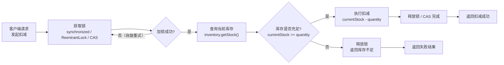

# jvm-juc - 综合场景串联

---

## 场景一：设计一个线程安全的缓存系统

### 场景描述

在一个高并发电商系统中，需要设计一个本地缓存来存储商品信息，缓存需要支持过期淘汰、并发读写、防止缓存穿透。系统要求：缓存命中率 95% 以上，读写延迟不超过 1ms，支持多线程并发访问。

### 涉及知识点

- [ConcurrentHashMap](./13-多线程与并发编程.md)（线程安全容器）：作为缓存的核心存储结构，保证并发读写的线程安全，分段锁粒度细
- [volatile](./13-多线程与并发编程.md)（可见性保证）：缓存元数据（如过期时间戳）使用 volatile 保证多线程可见性
- [synchronized / ReentrantLock](./13-多线程与并发编程.md)（同步控制）：缓存加载时使用 DCL 双重检查锁定，避免缓存击穿时大量线程重复加载
- [线程池](./13-多线程与并发编程.md)（异步任务）：异步刷新即将过期的缓存项，使用 ThreadPoolExecutor 管理后台刷新线程
- [CompletableFuture](./13-多线程与并发编程.md)（异步编排）：缓存加载时用 CompletableFuture 防止重复加载，多个线程等待同一个加载结果

### 协作流程

```
1. get(key) 请求到达
   └── ConcurrentHashMap.get(key) 快速查询缓存（线程安全读）
       ├── 命中且未过期 → 返回缓存值
       └── 未命中或已过期 → 进入加载流程
           ├── DCL 双重检查：synchronized 加锁后再次检查是否已有其他线程在加载
           │   └── 使用 CompletableFuture 包装加载任务，多个线程等待同一个 Future
           ├── 线程池异步执行加载逻辑（数据库查询 + 序列化）
           └── 加载完成后 ConcurrentHashMap.put(key, value) 更新缓存
               └── volatile 标记刷新时间戳，后台线程异步检查过期
```

### 关键要点

- ConcurrentHashMap 的 get 操作几乎无锁，保证高并发读性能
- DCL + CompletableFuture 组合防止缓存击穿，避免大量请求同时打到数据库
- 线程池限流 + 有界队列防止缓存加载任务耗尽系统资源
- volatile 保证过期时间戳的可见性，避免脏读

---

## 场景二：排查线上 JVM Full GC 频繁问题

### 场景描述

某订单系统上线后运营反馈页面响应变慢，监控显示 GC 停顿时间超过 2 秒，Full GC 每分钟发生 2-3 次。系统配置：4 核 8G，JVM 参数 `-Xms4g -Xmx4g`，使用 G1 收集器。需要快速定位问题并给出修复方案。

### 涉及知识点

- [堆内存划分](./14-JVM原理与调优.md)（新生代/老年代/Eden/Survivor）：分析 Full GC 频繁的原因，判断是否因对象过早晋升或老年代空间不足
- [GC 日志分析](./14-JVM原理与调优.md)（jstat/G1 日志）：通过 jstat -gcutil 实时观察各区域使用率，定位 FGC 频率和 FGCT 耗时
- [内存泄漏排查](./14-JVM原理与调优.md)（MAT/堆转储）：导出堆 dump 后用 MAT 分析 Dominator Tree，找到占用内存最大的对象和 GC Root 引用链
- [ThreadLocal 内存泄漏](./13-多线程与并发编程.md)：检查线程池中 ThreadLocal 未 remove 导致的内存泄漏（常见于链路追踪 TraceId）
- [JVM 参数调优](./14-JVM原理与调优.md)：调整 -XX:MaxGCPauseMillis、-XX:InitiatingHeapOccupancyPercent 等 G1 参数优化停顿

### 协作流程

```
1. 监控告警 → 发现 Full GC 频繁
   └── jstat -gcutil <pid> 1000 观察各区域
       ├── 老年代使用率持续上升 → 怀疑内存泄漏
       │   ├── jmap -dump:live,format=b,file=heap.hprof <pid>
       │   └── MAT 分析：Leak Suspects Report → 发现 ThreadLocal 未清理
       │       └── 代码排查：线程池中 ThreadLocal 的 TraceId 未 remove
       │           └── 修复：在 finally 中调用 remove()
       └── 老年代使用率正常但 FGC 仍频繁 → 怀疑对象晋升过快
           ├── 检查新生代大小：-Xmn 配置过小
           ├── 检查大对象：日志中大量大数组直接进老年代
           └── 调整参数：-Xmn 增大新生代，-XX:PretenureSizeThreshold 限制大对象
2. 修复后验证
   └── jstat 观察 FGC 频率下降，G1 日志中 Mixed GC 恢复正常
```

### 关键要点

- 先通过 jstat 判断是内存泄漏还是晋升过快，两者排查方向不同
- ThreadLocal 内存泄漏是高频故障点，线程池场景下必须 remove
- MAT 的 Dominator Tree 和 Path to GC Roots 是定位内存泄漏的核心工具
- G1 参数调优需要结合业务特征：低延迟场景设小 MaxGCPauseMillis，高吞吐场景适当放宽

---

## 场景三：高并发库存扣减 -- 三种锁方案对比



> 上图展示了高并发库存扣减的通用流程：请求到达后先获取锁（同步机制），然后查询库存是否充足，充足则扣减后释放锁返回成功，不足则直接释放锁返回失败。三种方案（synchronized、ReentrantLock、CAS）的核心区别在于"获取锁"环节的实现方式不同。

### 完整可运行示例代码

以下代码展示了三种不同的线程安全库存扣减实现方式，并附带性能对比测试。

**步骤一：定义库存类（共享资源）**

```java
package com.example.inventory;

import java.util.concurrent.atomic.AtomicInteger;

/**
 * 库存类 -- 被多个线程并发操作的共享资源
 */
public class Inventory {
    private final String productId;
    private int stock;

    public Inventory(String productId, int stock) {
        this.productId = productId;
        this.stock = stock;
    }

    public String getProductId() {
        return productId;
    }

    public int getStock() {
        return stock;
    }

    public void setStock(int stock) {
        this.stock = stock;
    }
}
```

**步骤二：方案一 -- synchronized 同步方法实现**

```java
package com.example.inventory;

/**
 * 方案一：使用 synchronized 同步方法
 * 优点：简单直观，JVM 内置支持，自动释放锁
 * 缺点：锁粒度粗，所有对同一对象的操作互斥，性能较低
 */
public class SynchronizedInventoryService {

    private final Inventory inventory;

    public SynchronizedInventoryService(Inventory inventory) {
        this.inventory = inventory;
    }

    /**
     * 同步方法 -- 整个方法被 synchronized 保护
     * 同一时刻只有一个线程能执行扣减操作
     */
    public synchronized boolean deduct(int quantity) {
        if (quantity <= 0) {
            return false;
        }
        int currentStock = inventory.getStock();
        if (currentStock >= quantity) {
            // 模拟业务处理耗时（如数据库写入、日志记录等）
            simulateBusinessLogic();
            inventory.setStock(currentStock - quantity);
            return true;
        }
        return false;
    }

    private void simulateBusinessLogic() {
        try {
            Thread.sleep(1); // 模拟 1ms 业务耗时
        } catch (InterruptedException e) {
            Thread.currentThread().interrupt();
        }
    }
}
```

**步骤三：方案二 -- ReentrantLock 显式锁实现**

```java
package com.example.inventory;

import java.util.concurrent.TimeUnit;
import java.util.concurrent.locks.ReentrantLock;

/**
 * 方案二：使用 ReentrantLock 显式锁
 * 优点：支持公平锁、可中断获取锁、超时获取锁、条件变量
 * 缺点：必须手动释放锁（finally 块），容易遗漏
 */
public class ReentrantLockInventoryService {

    private final Inventory inventory;
    private final ReentrantLock lock = new ReentrantLock(true); // 公平锁

    public ReentrantLockInventoryService(Inventory inventory) {
        this.inventory = inventory;
    }

    /**
     * 使用 tryLock 带超时的方式获取锁，避免死锁
     */
    public boolean deduct(int quantity) {
        if (quantity <= 0) {
            return false;
        }
        try {
            // 尝试在 100ms 内获取锁，超时则放弃
            if (lock.tryLock(100, TimeUnit.MILLISECONDS)) {
                try {
                    int currentStock = inventory.getStock();
                    if (currentStock >= quantity) {
                        simulateBusinessLogic();
                        inventory.setStock(currentStock - quantity);
                        return true;
                    }
                    return false;
                } finally {
                    lock.unlock(); // 必须手动释放锁
                }
            } else {
                System.out.println(Thread.currentThread().getName() + " 获取锁超时");
                return false;
            }
        } catch (InterruptedException e) {
            Thread.currentThread().interrupt();
            return false;
        }
    }

    private void simulateBusinessLogic() {
        try {
            Thread.sleep(1);
        } catch (InterruptedException e) {
            Thread.currentThread().interrupt();
        }
    }
}
```

**步骤四：方案三 -- CAS（AtomicInteger）无锁实现**

```java
package com.example.inventory;

import java.util.concurrent.atomic.AtomicInteger;

/**
 * 方案三：使用 CAS（AtomicInteger）无锁实现
 * 优点：无锁竞争，高并发下性能最优，不会出现死锁
 * 缺点：ABA 问题（可用 AtomicStampedReference 解决），自旋消耗 CPU
 */
public class CASInventoryService {

    private final String productId;
    private final AtomicInteger stock;

    public CASInventoryService(String productId, int initialStock) {
        this.productId = productId;
        this.stock = new AtomicInteger(initialStock);
    }

    /**
     * 使用 CAS 循环进行库存扣减
     * 核心思想：不断尝试，直到成功扣减或库存不足
     */
    public boolean deduct(int quantity) {
        if (quantity <= 0) {
            return false;
        }
        while (true) {
            int currentStock = stock.get();
            if (currentStock < quantity) {
                return false; // 库存不足
            }
            int newStock = currentStock - quantity;
            // CAS 操作：只有当当前值等于期望值时，才更新为新值
            if (stock.compareAndSet(currentStock, newStock)) {
                simulateBusinessLogic();
                return true;
            }
            // CAS 失败，说明有其他线程修改了库存，重新尝试
        }
    }

    public int getStock() {
        return stock.get();
    }

    public String getProductId() {
        return productId;
    }

    private void simulateBusinessLogic() {
        try {
            Thread.sleep(1);
        } catch (InterruptedException e) {
            Thread.currentThread().interrupt();
        }
    }
}
```

**步骤五：性能对比测试 -- 三种方案并发扣减压测**

```java
package com.example.inventory;

import java.util.concurrent.CountDownLatch;
import java.util.concurrent.ExecutorService;
import java.util.concurrent.Executors;
import java.util.concurrent.atomic.AtomicInteger;

/**
 * 三种库存扣减方案的性能对比测试
 */
public class InventoryBenchmark {

    private static final int THREAD_COUNT = 100;      // 并发线程数
    private static final int DEDUCT_PER_THREAD = 100;  // 每线程扣减次数
    private static final int INITIAL_STOCK = 10000;    // 初始库存

    public static void main(String[] args) throws InterruptedException {
        System.out.println("========== 高并发库存扣减性能对比 ==========");
        System.out.println("线程数: " + THREAD_COUNT);
        System.out.println("每线程扣减次数: " + DEDUCT_PER_THREAD);
        System.out.println("初始库存: " + INITIAL_STOCK);
        System.out.println();

        testSynchronized();
        testReentrantLock();
        testCAS();
    }

    /**
     * 测试 synchronized 方案
     */
    private static void testSynchronized() throws InterruptedException {
        Inventory inventory = new Inventory("P001", INITIAL_STOCK);
        SynchronizedInventoryService service = new SynchronizedInventoryService(inventory);
        long elapsed = runConcurrentTest(service, "synchronized");
        System.out.printf("【synchronized】剩余库存: %d, 耗时: %d ms%n",
                inventory.getStock(), elapsed);
    }

    /**
     * 测试 ReentrantLock 方案
     */
    private static void testReentrantLock() throws InterruptedException {
        Inventory inventory = new Inventory("P002", INITIAL_STOCK);
        ReentrantLockInventoryService service = new ReentrantLockInventoryService(inventory);
        long elapsed = runConcurrentTest(service, "ReentrantLock");
        System.out.printf("【ReentrantLock】剩余库存: %d, 耗时: %d ms%n",
                inventory.getStock(), elapsed);
    }

    /**
     * 测试 CAS 方案
     */
    private static void testCAS() throws InterruptedException {
        CASInventoryService service = new CASInventoryService("P003", INITIAL_STOCK);
        long elapsed = runConcurrentTest(service, "CAS");
        System.out.printf("【CAS】剩余库存: %d, 耗时: %d ms%n",
                service.getStock(), elapsed);
    }

    /**
     * 通用并发测试方法
     */
    private static long runConcurrentTest(Object service, String label) throws InterruptedException {
        ExecutorService executor = Executors.newFixedThreadPool(THREAD_COUNT);
        CountDownLatch latch = new CountDownLatch(THREAD_COUNT);
        AtomicInteger successCount = new AtomicInteger(0);

        long startTime = System.currentTimeMillis();

        for (int i = 0; i < THREAD_COUNT; i++) {
            executor.submit(() -> {
                try {
                    for (int j = 0; j < DEDUCT_PER_THREAD; j++) {
                        boolean success = false;
                        if (service instanceof SynchronizedInventoryService) {
                            success = ((SynchronizedInventoryService) service).deduct(1);
                        } else if (service instanceof ReentrantLockInventoryService) {
                            success = ((ReentrantLockInventoryService) service).deduct(1);
                        } else if (service instanceof CASInventoryService) {
                            success = ((CASInventoryService) service).deduct(1);
                        }
                        if (success) {
                            successCount.incrementAndGet();
                        }
                    }
                } finally {
                    latch.countDown();
                }
            });
        }

        latch.await(); // 等待所有线程完成
        executor.shutdown();

        long endTime = System.currentTimeMillis();
        System.out.printf("[%s] 成功扣减次数: %d%n", label, successCount.get());
        return endTime - startTime;
    }
}
```

**步骤六：方案对比总结**

| 对比维度 | synchronized | ReentrantLock | CAS（AtomicInteger） |
|---------|-------------|---------------|---------------------|
| 实现复杂度 | 低（关键字即可） | 中（需手动释放） | 中（需自旋循环） |
| 锁粒度 | 粗（整个方法） | 可控（锁代码块） | 无锁（原子操作） |
| 性能 | 较低 | 中等 | 高（无锁竞争） |
| 公平性 | 非公平锁 | 支持公平锁 | 无锁概念 |
| 可中断 | 不可中断 | 可中断获取 | 自旋不阻塞 |
| 适用场景 | 简单并发场景 | 需要超时/条件 | 高并发读写场景 |
| 风险 | 死锁风险 | 忘记释放锁 | ABA 问题、CPU 空转 |

---

> [返回模块目录](../../README.md) | [返回知识导览](../../知识导览.md)