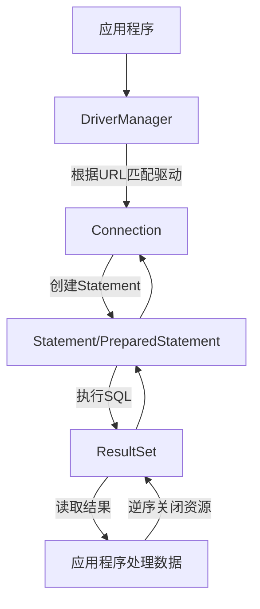

# JDBC 核心原理

> 学习路线对应：第3周 -- 数据访问与 ORM
> 前置知识：MySQL 基础与 SQL 核心、Java 基础
> 预计学习时间：1-2 天

## 一、核心概念

### 1.1 JDBC 架构

JDBC（Java Database Connectivity）是 Java 访问关系型数据库的标准 API，位于 `java.sql` 和 `javax.sql` 包下。它采用「接口 + 驱动」的设计，让 Java 代码与具体数据库解耦。

| 核心组件 | 作用 | 说明 |
|---------|------|------|
| **DriverManager** | 驱动管理器 | 管理一组 JDBC 驱动，根据 URL 匹配并建立连接 |
| **Driver** | 数据库驱动 | 各厂商实现（如 `com.mysql.cj.jdbc.Driver`），负责与具体数据库通信 |
| **Connection** | 数据库连接 | 代表一个 TCP 会话，管理事务和创建 Statement |
| **Statement** | SQL 执行器 | 静态执行 SQL；`PreparedStatement` 预编译；`CallableStatement` 调用存储过程 |
| **ResultSet** | 结果集 | 查询返回的二维数据游标，逐行读取 |

**JDBC 架构图：**

```
Java 应用程序
     │  调用 JDBC API（接口）
     ▼
JDBC API（java.sql.*）
     │  通过 DriverManager 获取连接
     ▼
JDBC 驱动管理器（DriverManager）
     │  匹配 URL 选择驱动
     ▼
数据库驱动（MySQL Driver / Oracle Driver / ...）
     │  翻译为数据库协议
     ▼
数据库（MySQL / Oracle / PostgreSQL / ...）
```

> **生活化类比：JDBC 架构 = USB 标准接口**
> - **JDBC API** 就像"USB 标准接口规范"——所有设备厂商都遵守同一规范，电脑（Java 程序）不需要为每种外设单独设计插槽。
> - **JDBC 驱动** 就像"USB 设备驱动程序"——MySQL 厂商提供 MySQL 驱动，Oracle 厂商提供 Oracle 驱动，各自把 USB 协议翻译成自家硬件能懂的指令。
> - **DriverManager** 就像"USB 控制器"——你插上设备后，它负责识别是哪种设备、加载对应驱动、建立连接。
> - **Connection** 就像"USB 数据线"——建立后才能传输数据；一条线一次只能传输一个任务（一个事务）。
> - **Statement / PreparedStatement** 就像"发送给设备的命令"——Statement 是"现写现发"，PreparedStatement 是"先打印好模板再填参数"。
> - **ResultSet** 就像"设备返回的数据流"——你只能从头到尾逐行读取，不能跳跃（默认游标只能向前）。

> 📖 **参考链接**：
> - [Oracle Java Tutorial: JDBC Introduction](https://docs.oracle.com/javase/tutorial/jdbc/overview/index.html)
> - [Oracle Java Tutorial: JDBC Basics](https://docs.oracle.com/javase/tutorial/jdbc/basics/index.html)
> - [Java SE 17 API: java.sql 模块](https://docs.oracle.com/javase/17/docs/api/java.sql/module-summary.html)
> - [MySQL Connector/J 8.0 官方文档](https://dev.mysql.com/doc/connector-j/8.0/en/)

### 1.2 JDBC 编程六步骤

| 步骤 | 代码 | 说明 |
|------|------|------|
| 1. 加载驱动 | `Class.forName("com.mysql.cj.jdbc.Driver")` | MySQL 8.0+ 可省略（SPI 自动加载） |
| 2. 获取连接 | `DriverManager.getConnection(url, user, pwd)` | 建立 TCP 连接，返回 Connection |
| 3. 创建 Statement | `conn.prepareStatement(sql)` | 推荐 PreparedStatement |
| 4. 执行 SQL | `ps.executeQuery()` / `ps.executeUpdate()` | 查询返回 ResultSet，增删改返回影响行数 |
| 5. 处理结果 | `while (rs.next()) { rs.getString("name") }` | 游标从 beforeFirst 开始，需 next() 移动 |
| 6. 释放资源 | `rs.close(); ps.close(); conn.close()` | 逆序关闭，务必在 finally 中执行 |

**JDBC URL 格式：**

```
jdbc:mysql://主机:端口/数据库名?参数键=值&参数键=值
```

常用参数：

| 参数 | 说明 | 推荐值 |
|------|------|--------|
| `useSSL` | 是否使用 SSL | `false`（开发）/ `true`（生产） |
| `serverTimezone` | 时区 | `Asia/Shanghai` |
| `characterEncoding` | 字符编码 | `utf8` |
| `useUnicode` | 使用 Unicode | `true` |
| `rewriteBatchedStatements` | 批量重写 | `true`（批量插入加速） |

**JDBC 核心执行链路：**



上述流程图清晰展示了 JDBC 从驱动管理到结果获取的完整调用链路。DriverManager 作为入口负责根据 URL 匹配并选择正确的数据库驱动，然后创建 Connection 对象代表数据库连接。连接创建后通过 prepareStatement 方法预编译 SQL 并得到 Statement 对象，执行查询后返回 ResultSet 结果集供应用程序读取。使用完毕后务必按 rs → ps → conn 的逆序关闭资源，避免连接泄漏。

> **生活化类比：JDBC 六步骤 = 打电话叫外卖的全流程**
> - **1. 加载驱动** = 找到外卖平台的电话号码（`Class.forName` 注册驱动），MySQL 8.0+ 用 SPI 自动注册就像"手机里已经存好号码"。
> - **2. 获取连接** = 拨通电话建立通话（TCP 连接），返回的 `Connection` 就是这条通话线路。
> - **3. 创建 Statement** = 跟客服说"我要点餐"（创建执行器），`PreparedStatement` 像填好的点餐模板，只待填具体菜品。
> - **4. 执行 SQL** = 报出菜品名让客服下单（`executeQuery`/`executeUpdate`），查询像"问有什么菜"，更新像"下单"。
> - **5. 处理结果** = 客服念菜单给你听（`ResultSet`），你逐条记录（`while(rs.next())`）。
> - **6. 释放资源** = 挂电话（`close()`），按"听筒→订单→挂断"的顺序逆序关闭——先关 ResultSet，再关 Statement，最后关 Connection。

> 📖 **参考链接**：
> - [Oracle Java Tutorial: Establishing a Connection](https://docs.oracle.com/javase/tutorial/jdbc/basics/connecting.html)
> - [Oracle Java Tutorial: Processing SQL Statements](https://docs.oracle.com/javase/tutorial/jdbc/basics/processingsqlstatements.html)
> - [Java SE 17 API: DriverManager](https://docs.oracle.com/javase/17/docs/api/java.base/java/sql/DriverManager.html)
> - [Java SE 17 API: Connection](https://docs.oracle.com/javase/17/docs/api/java.base/java/sql/Connection.html)

---

## 二、底层原理

### 2.1 PreparedStatement vs Statement

| 维度 | Statement | PreparedStatement |
|------|-----------|-------------------|
| **SQL 处理** | 直接拼接字符串执行 | 预编译，参数用 `?` 占位 |
| **SQL 注入** | 存在风险 | 防御 SQL 注入 |
| **性能** | 每次都要解析编译 SQL | 可复用执行计划，批量场景更快 |
| **可读性** | 拼接复杂、易错 | 参数清晰 |
| **类型安全** | 无 | `setInt/setString` 显式设值 |

**SQL 注入防御原理：**

```java
// 危险：Statement 拼接字符串
String name = "admin' OR '1'='1";
String sql = "SELECT * FROM t_user WHERE username = '" + name + "'";
// 实际执行：SELECT * FROM t_user WHERE username = 'admin' OR '1'='1'
// 结果：返回所有用户，绕过认证！

Statement stmt = conn.createStatement();
ResultSet rs = stmt.executeQuery(sql);
```

```java
// 安全：PreparedStatement 预编译
String sql = "SELECT * FROM t_user WHERE username = ?";
PreparedStatement ps = conn.prepareStatement(sql);
ps.setString(1, "admin' OR '1'='1");
// 驱动将整个字符串作为字面量参数，不会解析为 SQL 语法
// 实际执行：SELECT * FROM t_user WHERE username = 'admin\' OR \'1\'=\'1'
// 结果：查不到匹配用户，登录失败
```

**预编译原理：** 数据库先对 SQL 模板进行词法/语法分析、优化执行计划并缓存，参数在执行阶段才传入并被当作纯数据值，不会被当作 SQL 关键字解析，从根本上杜绝注入。

> **生活化类比：PreparedStatement vs Statement = 快递单模板 vs 手写快递单**
> - **Statement 拼接 SQL** 像每寄一个包裹都重新手写一张快递单——寄件人、收件人、物品全靠手填，遇到地址里有"省"字可能被误解（SQL 注入），而且每次都要重新审核格式（每次重新编译）。
> - **PreparedStatement 预编译** 像提前打印好"快递单模板"，收件人位置画个空格 `____`，寄件时只填空格——填什么内容都被当作"收件人名字"处理，不会被当成指令；模板可以反复用（执行计划复用）。
> - **`?` 占位符的语义**：数据库在编译阶段就把 `?` 当成"将来要填一个值的位置"，结构已定死；执行时填入的 `' OR '1'='1` 只是一个普通字符串值，不会被拆成 SQL 关键字。
> - **批量场景优势**：同一个 `PreparedStatement` 调用多次 `setXxx` + `addBatch`，模板只编译一次，1000 次插入共享一个执行计划，比 1000 个 Statement 快得多。
> - **注意**：如果用字符串拼接把 SQL 拼好后整体传给 `prepareStatement(sql)`，那 `?` 就没用上，依然会注入——预编译的前提是"参数必须通过 `setXxx` 传入"。

> 📖 **参考链接**：
> - [Oracle Java Tutorial: Prepared Statements](https://docs.oracle.com/javase/tutorial/jdbc/basics/prepared.html)
> - [Java SE 17 API: PreparedStatement](https://docs.oracle.com/javase/17/docs/api/java.base/java/sql/PreparedStatement.html)
> - [Java SE 17 API: Statement](https://docs.oracle.com/javase/17/docs/api/java.base/java/sql/Statement.html)
> - [OWASP: SQL Injection Prevention](https://cheatsheetseries.owasp.org/cheatsheets/SQL_Injection_Prevention_Cheat_Sheet.html)

### 2.2 连接池原理

**为什么需要连接池：**

| 不用连接池 | 使用连接池 |
|----------|----------|
| 每次请求新建 TCP 连接（3 次握手） | 复用已建立的连接 |
| 每次请求进行数据库认证授权 | 只认证一次 |
| 每次请求销毁连接（4 次挥手） | 连接归还池中复用 |
| 高并发下连接数失控，拖垮数据库 | 限制最大连接数，保护数据库 |
| 建连耗时 50~200ms | 借还耗时 < 1ms |

**连接池核心参数：**

| 参数 | 说明 |
|------|------|
| `minimumIdle` / `minIdle` | 最小空闲连接数 |
| `maximumPoolSize` / `maxActive` | 最大连接数 |
| `connectionTimeout` | 获取连接超时时间 |
| `idleTimeout` | 空闲连接最大存活时间 |
| `maxLifetime` | 连接最大生命周期（建议 < 数据库 wait_timeout） |
| `connectionTestQuery` | 连接有效性检测 SQL |

> **生活化类比：连接池 = 共享单车调度站**
> - 不用连接池时，每次出行都要"买车"（建 TCP 连接）、"骑完销毁"（断开）——买车成本高、销毁浪费。
> - 连接池像"共享单车调度站"——预先备好一批车（最小空闲连接），用户扫码即骑（借连接，<1ms），骑完归还（归还连接，不销毁）；高峰期不够用时加车（扩容到最大连接数），低谷时回收多余车（空闲超时回收）。
> - **`maxLifetime`** 像单车的"最大使用年限"——超过年限强制报废换新，避免老车在路上突然坏掉（数据库单方面断开连接）。
> - **`connectionTestQuery`** 像"出车前检查"——借车前先试骑一圈（`SELECT 1`），确认没坏再交给用户。
> - **`maxLifetime` 必须 < 数据库 `wait_timeout`**：因为数据库会主动断开空闲连接，如果池子里的连接比数据库等待时间长，借出去的连接可能已经被数据库掐断，导致 `CommunicationsException`。

> 📖 **参考链接**：
> - [Oracle Java Tutorial: Connecting with DataSource Objects（连接池规范）](https://docs.oracle.com/javase/tutorial/jdbc/basics/sqldatasources.html)
> - [Java SE 17 API: javax.sql.DataSource](https://docs.oracle.com/javase/17/docs/api/java.base/javax/sql/DataSource.html)
> - [HikariCP GitHub Wiki](https://github.com/brettwooldridge/HikariCP)
> - [Druid GitHub Wiki](https://github.com/alibaba/druid/wiki)

### 2.3 HikariCP 原理

HikariCP 是目前性能最高的 JDBC 连接池，Spring Boot 2.x 默认集成。其高性能来源于以下设计：

| 优化点 | 说明 | 收益 |
|--------|------|------|
| **FastList** | 自定义无 `range check` 的 ArrayList | 减少 `get()` 开销 |
| **ConcurrentBag** | 无锁并发队列，基于 `ThreadLocal` + `CopyOnWriteArrayList` | 借还连接无锁，高并发吞吐高 |
| **字节码优化** | 使用 Javassist 生成代理类，避免反射 | 方法调用更快 |
| **精简设计** | 只保留核心功能，无冗余特性 | 体积小、依赖少 |
| **状态机管理** | 连接状态精准控制，避免悬空 | 稳定性高 |

**ConcurrentBag 借取流程：**
1. 优先从当前线程的 `ThreadLocal` 中取（无竞争，最快）
2. 否则从共享队列中无锁 CAS 借取
3. 都失败则进入等待或创建新连接

> **生活化类比：HikariCP 的 ConcurrentBag = 公司茶水间的一次性纸杯架**
> - **ThreadLocal 优先**：每人桌边放一摞纸杯（线程本地缓存），自己拿自己的最快，不用排队。
> - **共享队列 CAS**：桌上没有时去茶水间公共纸杯架抢——多个人同时伸手时只有一个人抢到（CAS 无锁），失败的重试。
> - **FastList 去 range check**：像"拿纸杯时不一个个数编号核对"，直接拿，省了检查步骤。
> - **Javassist 生成代理类**：像"提前印好联系方式的名片"，不用每次现写（避免反射）。
> - **精简设计哲学**：HikariCP 作者名言"代码越少，bug 越少"——只做连接池本职工作，监控交给 Spring Actuator 等外部工具。

> 📖 **参考链接**：
> - [HikariCP GitHub: Wiki - About Pool Sizing](https://github.com/brettwooldridge/HikariCP/wiki/About-Pool-Sizing)
> - [HikariCP GitHub: README（优化原理说明）](https://github.com/brettwooldridge/HikariCP)
> - [Java SE 17 API: ThreadLocal（ConcurrentBag 核心机制）](https://docs.oracle.com/javase/17/docs/api/java.base/java/lang/ThreadLocal.html)

### 2.4 Druid 原理

Druid 是阿里巴巴开源的数据库连接池，主打「监控 + SQL 解析」，适合需要运维观测的场景。

| 特性 | 说明 |
|------|------|
| **监控统计** | 内置 StatFilter，统计 SQL 执行次数、慢查询、执行时间 |
| **SQL 解析** | 内置 SQL Parser，识别 SQL 类型、解析表名字段，支持 SQL 防火墙 |
| **SQL 防火墙** | WallFilter 拦截危险 SQL（如 `DROP`、`TRUNCATE`、`OR 1=1`） |
| **连接检测** | 多种探活方式（`validationQuery`、`testWhileIdle`） |
| **LogFilter** | 可输出完整 SQL 日志，便于排查 |

**HikariCP vs Druid 对比：**

| 维度 | HikariCP | Druid |
|------|----------|-------|
| **性能** | 极高（业界最快） | 较高 |
| **监控** | 较弱（需结合 Actuator） | 强（内置 Web 监控页） |
| **SQL 解析** | 无 | 内置 Parser |
| **配置复杂度** | 简单 | 参数多 |
| **适用场景** | 追求极致性能 | 需要监控和 SQL 审计 |

> **生活化类比：HikariCP vs Druid = 跑车 vs 装了行车记录仪的 SUV**
> - **HikariCP** 像一辆纯种跑车——为了极致速度拆掉空调、音响、副驾座椅（只保留连接池核心功能），圈速最快但没什么辅助设备。
> - **Druid** 像装了行车记录仪、GPS、油耗统计、防撞雷达的 SUV——速度略逊但功能齐全，能随时查看"哪段路开得慢（慢查询）"、"有没有危险驾驶（SQL 防火墙）"。
> - **选择原则**：互联网高并发项目选 HikariCP（性能优先）；金融、国企、对审计要求高的项目选 Druid（监控优先）。
> - **Druid 的 SQL Parser** 像自带"语法警察"——能解析 SQL 结构识别表名、字段，进而做 SQL 防火墙（拦截 DROP/TRUNCATE）、SQL 审计、慢查询统计。

> 📖 **参考链接**：
> - [Druid GitHub: Wiki - 配置详解](https://github.com/alibaba/druid/wiki/DruidDataSource%E9%85%8D%E7%BD%AE%E5%B1%9E%E6%80%A7%E5%88%97%E8%A1%A8)
> - [Druid GitHub: SQL Parser 介绍](https://github.com/alibaba/druid/wiki/SQL-Parser)
> - [Spring Boot: HikariCP 默认集成说明](https://docs.spring.io/spring-boot/docs/current/reference/htmlsingle/#data.sql.datasource.connection-pool)

### 2.5 事务管理

JDBC 默认自动提交（`autoCommit = true`），每条 SQL 都是独立事务。手动事务需关闭自动提交：

| API | 作用 |
|-----|------|
| `conn.setAutoCommit(false)` | 关闭自动提交，开启事务 |
| `conn.commit()` | 提交事务，持久化所有操作 |
| `conn.rollback()` | 回滚事务，撤销所有操作 |
| `conn.setSavepoint()` | 设置保存点，可部分回滚 |
| `conn.setTransactionIsolation(level)` | 设置事务隔离级别 |

**隔离级别：**

| 常量 | 隔离级别 | 脏读 | 不可重复读 | 幻读 |
|------|---------|------|----------|------|
| `TRANSACTION_NONE` | 不支持事务 | - | - | - |
| `TRANSACTION_READ_UNCOMMITTED` | 读未提交 | 可能 | 可能 | 可能 |
| `TRANSACTION_READ_COMMITTED` | 读已提交 | 不可能 | 可能 | 可能 |
| `TRANSACTION_REPEATABLE_READ` | 可重复读（MySQL 默认） | 不可能 | 不可能 | 可能 |
| `TRANSACTION_SERIALIZABLE` | 串行化 | 不可能 | 不可能 | 不可能 |

> **注意：** 上表遵循 SQL 标准定义。MySQL InnoDB 引擎在 REPEATABLE READ 级别下通过 Next-Key Locking 已额外防止幻读，因此 InnoDB 的 RR 级别实际效果等同于标准 SQL 的 SERIALIZABLE（针对幻读）。

> **生活化类比：JDBC 事务管理 = 银行柜员办业务**
> - **`autoCommit = true`（默认）** 像"每办一笔业务立刻签字盖章入账"——一笔业务就是一个独立事务，无法撤销。
> - **`setAutoCommit(false)`** 像"柜员说'今天办的所有业务先攒着，最后一起签字'"——开启事务，所有 SQL 在一个事务里。
> - **`commit()`** 像"客户确认无误，柜员统一签字盖章入账"——事务提交，数据持久化。
> - **`rollback()`** 像"客户发现某笔错了，柜员把今天所有业务全部作废"——事务回滚，回到开启前状态。
> - **隔离级别** 像柜员之间的"隐私等级"：读未提交像"别人办业务时你能偷看到草稿"（脏读）；串行化像"一个柜员办完下一个才能办"（完全隔离但慢）。

> 📖 **参考链接**：
> - [Oracle Java Tutorial: Using Transactions](https://docs.oracle.com/javase/tutorial/jdbc/basics/transactions.html)
> - [Java SE 17 API: Connection.setAutoCommit](https://docs.oracle.com/javase/17/docs/api/java.base/java/sql/Connection.html#setAutoCommit(boolean))
> - [Java SE 17 API: Connection.setTransactionIsolation](https://docs.oracle.com/javase/17/docs/api/java.base/java/sql/Connection.html#setTransactionIsolation(int))
> - [MySQL 8.0: InnoDB Transaction Isolation Levels](https://dev.mysql.com/doc/refman/8.0/en/innodb-transaction-isolation-levels.html)

### 2.6 Savepoint

Savepoint 用于事务内部分回滚，可回滚到指定保存点而不必回滚整个事务：

```java
Connection conn = dataSource.getConnection();
try {
    conn.setAutoCommit(false);

    // 操作1
    updateAccount(conn, 1, -100);

    // 设置保存点
    Savepoint sp = conn.setSavepoint("before_transfer");

    // 操作2（可能失败）
    updateAccount(conn, 2, 100);

    // 操作3（危险操作）
    dangerousOperation(conn);

    conn.commit();
} catch (BusinessException e) {
    // 仅回滚到保存点，保留操作1
    conn.rollback(sp);
    conn.commit();
} catch (Exception e) {
    // 回滚整个事务
    conn.rollback();
} finally {
    conn.setAutoCommit(true);
    conn.close();
}
```

> **生活化类比：Savepoint = 文档编辑的"历史版本"**
> - 没有 Savepoint 时，事务只能"全做或全不做"——就像写文档只能"全部保存"或"全部撤销"。
> - 有了 Savepoint，可以在关键步骤打"历史版本标记"——出错时只回滚到某个版本，保留之前已确认的内容。
> - 示例中：操作1（扣款）成功后打标记，操作2（加款）也成功，操作3（危险操作）失败——只回滚操作3 和操作2，保留操作1（避免"钱扣了但没到账"的尴尬）。
> - **使用场景**：长事务中分段提交、批量处理中跳过失败项继续后续、复杂业务流程的部分回滚。

> 📖 **参考链接**：
> - [Oracle Java Tutorial: Using Savepoints](https://docs.oracle.com/javase/tutorial/jdbc/basics/transactions.html#savepoints)
> - [Java SE 17 API: Connection.setSavepoint](https://docs.oracle.com/javase/17/docs/api/java.base/java/sql/Connection.html#setSavepoint())
> - [Java SE 17 API: Connection.rollback(Savepoint)](https://docs.oracle.com/javase/17/docs/api/java.base/java/sql/Connection.html#rollback(java.sql.Savepoint))
> - [MySQL 8.0: SAVEPOINT Statement](https://dev.mysql.com/doc/refman/8.0/en/savepoint.html)

### 2.7 批处理与高级 ResultSet

**批处理（Batch）** 用于一次性执行多条 SQL，减少网络往返次数，是大数据量插入/更新的必备手段：

```java
// 批量插入：开启 rewriteBatchedStatements=true 后 MySQL 会重写为一条 INSERT
Connection conn = dataSource.getConnection();
try (PreparedStatement ps = conn.prepareStatement(
        "INSERT INTO t_user (username, email) VALUES (?, ?)")) {
    conn.setAutoCommit(false);

    for (int i = 0; i < 10000; i++) {
        ps.setString(1, "user" + i);
        ps.setString(2, "user" + i + "@example.com");
        ps.addBatch();                    // 累积到批处理缓冲区
        if (i % 1000 == 999) {
            ps.executeBatch();            // 每 1000 条执行一次
            ps.clearBatch();
        }
    }
    ps.executeBatch();                    // 执行剩余
    conn.commit();
} finally {
    conn.setAutoCommit(true);
    conn.close();
}
```

**关键要点：**
- JDBC URL 加 `rewriteBatchedStatements=true`，MySQL 驱动会把多条 `INSERT` 重写为 `INSERT ... VALUES (...),(...),(...)`，性能提升 10 倍以上。
- 批处理必须配合事务（`autoCommit=false`），否则每条都自动提交反而更慢。
- 分批执行（如每 1000 条 `executeBatch` 一次）避免内存溢出。
- `executeBatch()` 返回 `int[]`，每条 SQL 影响的行数；`Statement.SUCCESS_NO_INFO`（-2）表示成功但具体行数未知。

**ResultSet 类型与并发模式：**

| 参数组合 | 说明 | 适用场景 |
|---------|------|---------|
| `TYPE_FORWARD_ONLY` + `CONCUR_READ_ONLY` | 默认，只能向前、只读 | 绝大多数查询 |
| `TYPE_SCROLL_INSENSITIVE` + `CONCUR_READ_ONLY` | 可双向滚动、只读、不感知外部修改 | 分页、聚合统计 |
| `TYPE_SCROLL_SENSITIVE` + `CONCUR_UPDATABLE` | 可双向滚动、可更新、感知外部修改 | 行内编辑（少用） |

```java
// 可滚动、可更新的 ResultSet
Statement stmt = conn.createStatement(
    ResultSet.TYPE_SCROLL_INSENSITIVE,
    ResultSet.CONCUR_UPDATABLE);
ResultSet rs = stmt.executeQuery("SELECT id, username FROM t_user");

rs.absolute(5);              // 直接跳到第 5 行
rs.previous();               // 回到上一行
rs.first();                  // 跳到第一行
rs.last();                   // 跳到最后一行
rs.updateString("username", "newName");  // 修改当前行
rs.updateRow();              // 提交修改到数据库

rs.moveToInsertRow();        // 移动到插入行
rs.updateString("username", "newUser");
rs.insertRow();              // 插入新行
```

> **生产建议**：可滚动/可更新的 ResultSet 性能开销大、行为依赖驱动实现，生产环境慎用；需要分页用 `LIMIT`，需要更新用 `UPDATE` 语句更可控。

> 📖 **参考链接**：
> - [Oracle Java Tutorial: Using Prepared Statements - Batch Updates](https://docs.oracle.com/javase/tutorial/jdbc/basics/sqlupdate.html)
> - [Java SE 17 API: Statement.executeBatch](https://docs.oracle.com/javase/17/docs/api/java.base/java/sql/Statement.html#executeBatch())
> - [Java SE 17 API: ResultSet 类型说明](https://docs.oracle.com/javase/17/docs/api/java.base/java/sql/ResultSet.html)
> - [MySQL Connector/J: rewriteBatchedStatements 说明](https://dev.mysql.com/doc/connector-j/8.0/en/connector-j-connp-props-performance-extensions.html)

---

## 三、实战应用

### 3.1 完整 JDBC CRUD 示例

```java
import java.sql.*;

public class JdbcDemo {
    private static final String URL =
        "jdbc:mysql://127.0.0.1:3306/shop?useSSL=false&serverTimezone=Asia/Shanghai";
    private static final String USER = "root";
    private static final String PWD = "123456";

    // 1. 新增（使用 PreparedStatement + 获取自增主键）
    public long insertUser(String username, String email) throws SQLException {
        String sql = "INSERT INTO t_user (username, email) VALUES (?, ?)";
        try (Connection conn = DriverManager.getConnection(URL, USER, PWD);
             PreparedStatement ps = conn.prepareStatement(
                     sql, Statement.RETURN_GENERATED_KEYS)) {
            ps.setString(1, username);
            ps.setString(2, email);
            ps.executeUpdate();
            try (ResultSet rs = ps.getGeneratedKeys()) {
                if (rs.next()) {
                    return rs.getLong(1);
                }
            }
        }
        return -1L;
    }

    // 2. 查询单条
    public User findById(long id) throws SQLException {
        String sql = "SELECT id, username, email FROM t_user WHERE id = ?";
        try (Connection conn = DriverManager.getConnection(URL, USER, PWD);
             PreparedStatement ps = conn.prepareStatement(sql)) {
            ps.setLong(1, id);
            try (ResultSet rs = ps.executeQuery()) {
                if (rs.next()) {
                    User user = new User();
                    user.setId(rs.getLong("id"));
                    user.setUsername(rs.getString("username"));
                    user.setEmail(rs.getString("email"));
                    return user;
                }
            }
        }
        return null;
    }

    // 3. 修改
    public int updateUser(long id, String email) throws SQLException {
        String sql = "UPDATE t_user SET email = ? WHERE id = ?";
        try (Connection conn = DriverManager.getConnection(URL, USER, PWD);
             PreparedStatement ps = conn.prepareStatement(sql)) {
            ps.setString(1, email);
            ps.setLong(2, id);
            return ps.executeUpdate();
        }
    }

    // 4. 删除
    public int deleteUser(long id) throws SQLException {
        String sql = "DELETE FROM t_user WHERE id = ?";
        try (Connection conn = DriverManager.getConnection(URL, USER, PWD);
             PreparedStatement ps = conn.prepareStatement(sql)) {
            ps.setLong(1, id);
            return ps.executeUpdate();
        }
    }

    // 5. 事务转账示例
    public void transfer(long from, long to, double amount) throws SQLException {
        Connection conn = null;
        try {
            conn = DriverManager.getConnection(URL, USER, PWD);
            conn.setAutoCommit(false);                  // 开启事务

            try (PreparedStatement ps1 = conn.prepareStatement(
                    "UPDATE t_user SET balance = balance - ? WHERE id = ? AND balance >= ?")) {
                ps1.setDouble(1, amount);
                ps1.setLong(2, from);
                ps1.setDouble(3, amount);
                if (ps1.executeUpdate() == 0) {
                    throw new RuntimeException("余额不足");
                }
            }

            try (PreparedStatement ps2 = conn.prepareStatement(
                    "UPDATE t_user SET balance = balance + ? WHERE id = ?")) {
                ps2.setDouble(1, amount);
                ps2.setLong(2, to);
                ps2.executeUpdate();
            }

            conn.commit();                              // 提交事务
        } catch (Exception e) {
            if (conn != null) conn.rollback();          // 回滚事务
            throw e;
        } finally {
            if (conn != null) {
                conn.setAutoCommit(true);               // 恢复默认
                conn.close();
            }
        }
    }
}
```

> 📖 **参考链接**：
> - [Oracle Java Tutorial: Retrieving Values from Result Sets](https://docs.oracle.com/javase/tutorial/jdbc/basics/retrieving.html)
> - [Oracle Java Tutorial: Using Transactions（转账示例）](https://docs.oracle.com/javase/tutorial/jdbc/basics/transactions.html)
> - [Java SE 17 API: ResultSet](https://docs.oracle.com/javase/17/docs/api/java.base/java/sql/ResultSet.html)
> - [Java SE 17 API: Statement.RETURN_GENERATED_KEYS](https://docs.oracle.com/javase/17/docs/api/java.base/java/sql/Statement.html#RETURN_GENERATED_KEYS)

### 3.2 HikariCP 连接池配置

```java
import com.zaxxer.hikari.HikariConfig;
import com.zaxxer.hikari.HikariDataSource;
import javax.sql.DataSource;

public class HikariPoolDemo {
    public static DataSource createDataSource() {
        HikariConfig config = new HikariConfig();
        config.setJdbcUrl("jdbc:mysql://127.0.0.1:3306/shop?useSSL=false&serverTimezone=Asia/Shanghai");
        config.setUsername("root");
        config.setPassword("123456");
        config.setDriverClassName("com.mysql.cj.jdbc.Driver");

        // 连接池核心参数
        config.setMinimumIdle(5);                    // 最小空闲连接
        config.setMaximumPoolSize(20);               // 最大连接数
        config.setConnectionTimeout(30000);          // 获取连接超时 30s
        config.setIdleTimeout(600000);               // 空闲连接存活 10min
        config.setMaxLifetime(1800000);              // 连接最大生命周期 30min
        config.setConnectionTestQuery("SELECT 1");  // 连接有效性检测

        return new HikariDataSource(config);
    }
}
```

**Spring Boot 配置（application.yml）：**

```yaml
spring:
  datasource:
    type: com.zaxxer.hikari.HikariDataSource
    url: jdbc:mysql://127.0.0.1:3306/shop?useSSL=false&serverTimezone=Asia/Shanghai
    username: root
    password: 123456
    hikari:
      minimum-idle: 5
      maximum-pool-size: 20
      connection-timeout: 30000
      idle-timeout: 600000
      max-lifetime: 1800000
      connection-test-query: SELECT 1
```

> 📖 **参考链接**：
> - [Spring Boot: HikariCP 配置参考](https://docs.spring.io/spring-boot/docs/current/reference/htmlsingle/#appendix.application-properties.data)
> - [HikariCP GitHub: README（参数说明）](https://github.com/brettwooldridge/HikariCP#gear-configuration-knobs-baby)

### 3.3 Druid 配置

```java
import com.alibaba.druid.pool.DruidDataSource;
import javax.sql.DataSource;

public class DruidPoolDemo {
    public static DataSource createDataSource() {
        DruidDataSource ds = new DruidDataSource();
        ds.setUrl("jdbc:mysql://127.0.0.1:3306/shop?useSSL=false&serverTimezone=Asia/Shanghai");
        ds.setUsername("root");
        ds.setPassword("123456");
        ds.setDriverClassName("com.mysql.cj.jdbc.Driver");

        // 连接池参数
        ds.setInitialSize(5);            // 初始连接数
        ds.setMinIdle(5);                // 最小空闲
        ds.setMaxActive(20);             // 最大活跃
        ds.setMaxWait(60000);            // 获取连接超时
        ds.setTimeBetweenEvictionRunsMillis(60000);  // 检测间隔
        ds.setMinEvictableIdleTimeMillis(300000);    // 最小空闲时间

        // 监控与防火墙
        ds.setFilters("stat,wall");      // stat 统计 + wall 防火墙
        ds.setTestWhileIdle(true);
        ds.setValidationQuery("SELECT 1");
        return ds;
    }
}
```

**Druid 监控页开启（Spring Boot）：**

```yaml
spring:
  datasource:
    druid:
      stat-view-servlet:
        enabled: true
        url-pattern: /druid/*
        login-username: admin
        login-password: admin
      web-stat-filter:
        enabled: true
        url-pattern: /*
```

> 📖 **参考链接**：
> - [Druid GitHub: Spring Boot 集成](https://github.com/alibaba/druid/tree/master/druid-spring-boot-starter)
> - [Druid GitHub: 监控页面配置](https://github.com/alibaba/druid/wiki/Druid_StatView%E9%85%8D%E7%BD%AE%E8%AF%B4%E6%98%8E)

### 3.4 Spring JdbcTemplate

Spring 对 JDBC 的薄封装，消除样板代码（资源关闭、异常转换），仍保留手写 SQL 的灵活性：

```java
import org.springframework.jdbc.core.JdbcTemplate;
import org.springframework.jdbc.core.RowMapper;
import org.springframework.jdbc.core.BeanPropertyRowMapper;
import java.util.List;

public class UserDao {
    private final JdbcTemplate jdbcTemplate;

    public UserDao(JdbcTemplate jdbcTemplate) {
        this.jdbcTemplate = jdbcTemplate;
    }

    // 新增
    public int insert(User user) {
        String sql = "INSERT INTO t_user (username, email) VALUES (?, ?)";
        return jdbcTemplate.update(sql, user.getUsername(), user.getEmail());
    }

    // 查询单条（自定义 RowMapper）
    public User findById(Long id) {
        String sql = "SELECT id, username, email FROM t_user WHERE id = ?";
        return jdbcTemplate.queryForObject(sql,
            (rs, rowNum) -> {
                User u = new User();
                u.setId(rs.getLong("id"));
                u.setUsername(rs.getString("username"));
                u.setEmail(rs.getString("email"));
                return u;
            }, id);
    }

    // 查询列表（BeanPropertyRowMapper 自动映射）
    public List<User> findAll() {
        String sql = "SELECT id, username, email FROM t_user";
        return jdbcTemplate.query(sql,
            new BeanPropertyRowMapper<>(User.class));
    }

    // 更新
    public int update(Long id, String email) {
        String sql = "UPDATE t_user SET email = ? WHERE id = ?";
        return jdbcTemplate.update(sql, email, id);
    }

    // 删除
    public int delete(Long id) {
        String sql = "DELETE FROM t_user WHERE id = ?";
        return jdbcTemplate.update(sql, id);
    }
}
```

**JdbcTemplate 优势：** 自动管理资源关闭；统一异常体系（`DataAccessException`）；支持命名参数（`NamedParameterJdbcTemplate`）；无需手动处理事务边界（配合 `@Transactional`）。

> **生活化类比：Spring JdbcTemplate = 装了自动驾驶的汽车**
> - **原生 JDBC** 像手动挡汽车——换挡、踩离合、看后视镜全靠自己（手动开关资源、捕获 SQLException、处理事务边界）。
> - **JdbcTemplate** 像装了自动驾驶——踩油门就行（写 SQL + 参数），系统自动换挡（关闭资源）、自动避障（SQLException 转 DataAccessException）、自动巡航（@Transactional 管理事务）。
> - **`RowMapper`** 像自定义"翻译官"——你告诉它"ResultSet 每一行怎么翻译成 Java 对象"，它自动遍历所有行。
> - **`BeanPropertyRowMapper`** 像通用翻译官——按"列名 = 属性名"自动映射，省去手写映射代码，但要求列名和属性名严格对应。
> - **JdbcTemplate 不是 ORM**：它只是"消除样板代码的薄封装"，SQL 仍要自己写；要做 ORM（对象关系映射）请用 MyBatis/JPA。

> 📖 **参考链接**：
> - [Spring Framework Reference: Data Access with JDBC](https://docs.spring.io/spring-framework/reference/data-access/jdbc.html)
> - [Spring Framework: JdbcTemplate Javadoc](https://docs.spring.io/spring-framework/docs/current/javadoc-api/org/springframework/jdbc/core/JdbcTemplate.html)
> - [Spring Framework: RowMapper Javadoc](https://docs.spring.io/spring-framework/docs/current/javadoc-api/org/springframework/jdbc/core/RowMapper.html)

---

## 四、常见面试题（附答案）

### 1. Statement、PreparedStatement、CallableStatement 的区别？

`Statement` 用于执行静态 SQL，存在 SQL 注入风险且性能差；`PreparedStatement` 预编译 SQL 并使用 `?` 占位参数，可防御 SQL 注入、可复用执行计划、性能更好，是最常用的方式；`CallableStatement` 用于调用数据库存储过程，支持 OUT/INOUT 参数。三者是继承关系：`Statement` -> `PreparedStatement` -> `CallableStatement`。

### 2. PreparedStatement 是如何防止 SQL 注入的？

数据库先对 SQL 模板进行词法、语法分析并生成执行计划，参数用 `?` 占位。执行时通过 `setString/setInt` 等方法传入的值被视为纯数据字面量，即使包含 `'` 或 `OR 1=1` 等字符，也只被当作普通字符串值处理，不会被当作 SQL 关键字解析，从而杜绝注入。注意：必须使用 `?` 占位符并调用 `setXxx` 方法才安全，如果用字符串拼接 SQL 再交给 PreparedStatement 执行，依然会注入。

### 3. 为什么要使用数据库连接池？HikariCP 为什么快？

不使用连接池时每次请求都要经历 TCP 三次握手、数据库认证、四次挥手，耗时 50~200ms 且高并发下连接数失控。连接池预先创建并复用连接，借还耗时 < 1ms，还能限制最大连接数保护数据库。HikariCP 快的原因：① 使用 FastList 替代 ArrayList，去掉越界检查；② 使用 ConcurrentBag 无锁并发队列，基于 ThreadLocal 优先借取本线程连接，减少锁竞争；③ 用 Javaset 生成代理类避免反射开销；④ 整体设计精简，无冗余特性。

### 4. JDBC 事务管理的基本流程是什么？

默认 `autoCommit = true` 每条 SQL 独立提交。手动事务流程：① 调用 `conn.setAutoCommit(false)` 开启事务；② 执行多条 SQL；③ 全部成功调用 `conn.commit()` 提交；④ 出现异常调用 `conn.rollback()` 回滚；⑤ 在 finally 中恢复 `autoCommit = true` 并关闭连接。需要部分回滚时可在关键操作后用 `conn.setSavepoint()` 设置保存点，再用 `conn.rollback(savepoint)` 回滚到该点而非整体回滚。

### 5. HikariCP 和 Druid 该如何选择？

HikariCP 性能最高、配置简单、体积小，是 Spring Boot 默认连接池，适合追求极致性能、对监控要求不高的场景，是大多数互联网项目的首选。Druid 性能略逊但内置强大的监控统计、SQL 解析、SQL 防火墙能力，提供可视化 Web 监控页，适合金融、国企等对 SQL 审计、慢查询排查、安全防护要求高的场景。选择原则：性能优先选 HikariCP，监控审计优先选 Druid。

> 📖 **参考链接**：
> - [Oracle Java Tutorial: JDBC Overview（面试核心知识）](https://docs.oracle.com/javase/tutorial/jdbc/overview/index.html)
> - [Oracle Java Tutorial: Handling SQLException](https://docs.oracle.com/javase/tutorial/jdbc/basics/sqlexception.html)
> - [HikariCP vs Druid 性能对比](https://github.com/brettwooldridge/HikariCP)
> - [Spring Framework: JDBC 最佳实践](https://docs.spring.io/spring-framework/reference/data-access/jdbc.html)

---

## 五、避坑指南

| 常见错误 | 现象 | 原因 | 解决方案 |
|---------|------|------|---------|
| 资源未关闭 | 连接泄漏，连接池耗尽 | ResultSet/Statement/Connection 未在 finally 关闭 | 使用 try-with-resources 自动关闭；按 rs -> ps -> conn 逆序关闭 |
| Statement 拼接 SQL | SQL 注入漏洞 | 用户输入直接拼入 SQL 字符串 | 全部使用 PreparedStatement + `?` 占位 + setXxx 设值 |
| 事务未提交/回滚 | 数据不一致或脏数据残留 | 异常时未 rollback，或 autoCommit 仍为 true | try-catch-finally 模式，异常时 rollback，finally 中恢复 autoCommit 并关闭 |
| 连接池 maxLifetime 过大 | 连接被数据库单方面断开 | maxLifetime > 数据库 `wait_timeout`，连接失效仍在用 | maxLifetime 设置为 `wait_timeout` 的 60%~80%，如 30min |
| 获取连接超时 | 请求堆积、接口超时 | 最大连接数过小或慢 SQL 长期占用连接 | 调大 maximumPoolSize；排查慢 SQL；设置合理 connectionTimeout |
| 批量插入逐条执行 | 插入万条数据耗时数分钟 | 每次 executeUpdate 都一次网络往返 | 使用 `addBatch` + `executeBatch`；开启 `rewriteBatchedStatements=true` |
| ResultSet 使用后关闭报错 | `Operation not allowed after ResultSet closed` | 同一 Statement 执行新查询后旧 ResultSet 自动关闭 | 先读取完旧 ResultSet 数据再执行新查询；使用不同 Statement |
| 日期类型精度丢失 | 时间字段时分秒为 00:00:00 | 用 `rs.getDate()` 只取日期部分 | 使用 `rs.getTimestamp()` 获取完整时间 |

> 📖 **参考链接**：
> - [Oracle Java Tutorial: Handling SQLException（异常避坑）](https://docs.oracle.com/javase/tutorial/jdbc/basics/sqlexception.html)
> - [Oracle Java Tutorial: Using Transactions（事务避坑）](https://docs.oracle.com/javase/tutorial/jdbc/basics/transactions.html)
> - [HikariCP GitHub: About Pool Sizing（连接池调参避坑）](https://github.com/brettwooldridge/HikariCP/wiki/About-Pool-Sizing)
> - [MySQL 8.0: Connection timeout（wait_timeout 说明）](https://dev.mysql.com/doc/refman/8.0/en/server-system-variables.html#sysvar_wait_timeout)

## 本章学习自检

完成本章学习后，应该能够：
- [ ] 用自己的话解释 JDBC 架构、PreparedStatement 防 SQL 注入原理、连接池必要性、事务管理流程
- [ ] 手写 JDBC 六步 CRUD 代码、事务转账示例、HikariCP/Druid 配置
- [ ] 回答常见面试题（三种 Statement 区别、防注入原理、连接池原理、事务管理、HikariCP vs Druid）
- [ ] 在实战项目中使用 JdbcTemplate 或连接池进行数据访问
- [ ] 识别并避免常见错误（资源泄漏、SQL 注入、事务遗漏、连接池参数不当等）

---

> **学习导航**：
> - 返回 [学习路线总览](../../README.md)
> - 本模块其他文件：[01-MySQL基础与SQL核心](./01-MySQL基础与SQL核心.md) | [03-MyBatis原生框架](./03-MyBatis原生框架.md) | [04-Spring-Data-JPA深度](./04-Spring-Data-JPA深度.md) | [05-MyBatis-Plus实战](./05-MyBatis-Plus实战.md) | [06-MySQL深度优化](./06-MySQL深度优化.md) | [07-数据库笔面试题集](./07-数据库笔面试题集.md)
> - 实战应用：[电商订单实时统计分析平台](../../extensions/project/01-电商订单实时统计分析平台.md)
