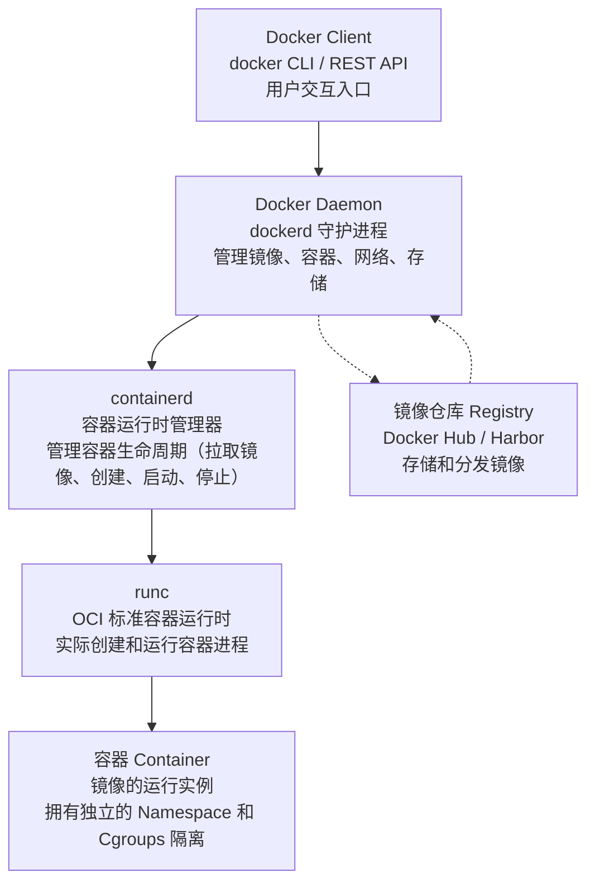
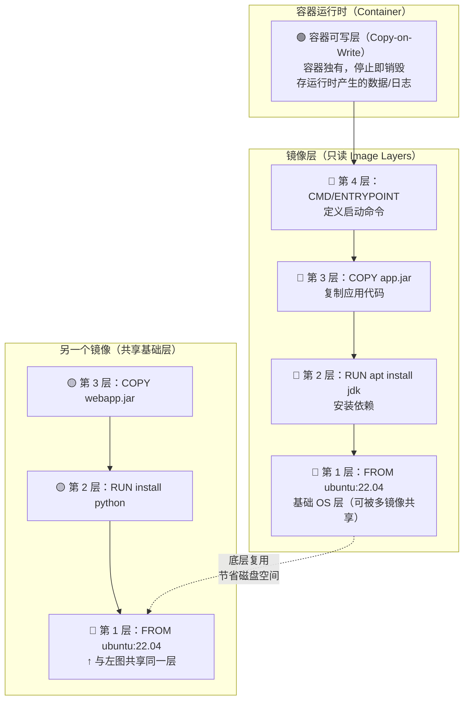

# Docker 核心原理

> 学习路线对应：第6周 -- 容器化与 K8s
> 前置知识：Linux 基础命令
> 对比 Node.js：Docker 容器化 约等于 把 Node 应用和所有依赖打包成一个可移植的单元

> 📖 **参考链接**：
> - [Docker 官方文档](https://docs.docker.com/) -- Docker 官方文档总站，涵盖安装、CLI、Dockerfile、网络、存储、Compose 等全部主题
> - [Docker 概念指南](https://docs.docker.com/get-started/overview/) -- 官方入门概览，理解镜像、容器、引擎、守护进程等核心概念
> - [Dockerfile 参考手册](https://docs.docker.com/engine/reference/builder/) -- Dockerfile 全部指令（FROM/RUN/COPY/ENTRYPOINT 等）的权威说明
> - [Docker 存储原理](https://docs.docker.com/storage/storagedriver/) -- 镜像分层与存储驱动（overlay2/aufs）原理
> - [Open Containers Initiative (OCI)](https://opencontainers.org/) -- 容器开放标准组织，定义镜像格式与运行时规范

## 一、核心概念

### 1.1 容器 vs 虚拟机

| 对比维度 | 容器（Docker） | 虚拟机（VM） |
|----------|---------------|-------------|
| **操作系统** | 共享宿主机内核 | 独立 Guest OS（完整操作系统） |
| **启动速度** | 秒级 | 分钟级 |
| **资源占用** | MB 级镜像 | GB 级镜像 |
| **隔离性** | 进程级隔离（Namespace） | 硬件级隔离（Hypervisor） |
| **性能损耗** | 近乎原生性能 | 5-15% 性能损耗 |
| **单机密度** | 数百个容器 | 数十个虚拟机 |

> 记忆口诀："容器住集体宿舍（共享内核），虚拟机住独立公寓（独立 OS）"

> **生活化类比：** Docker 容器 vs 虚拟机，就像胶囊旅馆 vs 独立别墅。虚拟机（独立别墅）有自己的地基、水电系统、门牌号（完整 Guest OS），安全隔离性极好，但占地大、建得慢、成本高。Docker 容器（胶囊旅馆）共享同一栋楼的水电系统和走廊（共享宿主机内核），每个胶囊空间独立但轻量，拎包入住、秒级启动、一栋楼能塞几百个。住胶囊旅馆省空间但共享同一套水电系统——如果大楼水管爆了（内核崩溃），所有胶囊都受影响（隔离性弱），住别墅私密性好但贵。实际项目中，你可以在别墅里（虚拟机）再开个胶囊旅馆（跑 Docker），两者并不冲突。

### 1.2 Docker 三大核心

| 核心概念 | 说明 | 类比 |
|----------|------|------|
| **镜像（Image）** | 只读的模板，包含运行应用所需的文件系统、依赖和配置 | 模具/铸模 |
| **容器（Container）** | 镜像的运行实例，在镜像层之上添加可写层 | 用模具浇铸出的产品 |
| **仓库（Registry）** | 存储和分发镜像的服务（如 Docker Hub、Harbor） | 应用商店/镜像仓库 |

> 注意：镜像的分层是 UnionFS 文件系统叠加，不是 OOP 继承。镜像层是只读的，容器在镜像层之上添加了可写层（Copy-on-Write）。

> **生活化类比：容器 = "集装箱"** —— Docker 这个名字本身就来自"集装箱"（Container 在英文里既指集装箱也指容器）。没有集装箱的时代，港口搬运货物千奇百怪——运钢琴的、运棉花的、运汽车的，每艘船都要量身定制装载方案，搬运工得针对每种货物想不同办法，效率极低且容易出错（依赖冲突、环境不一致）。集装箱的伟大之处在于：统一了标准箱体规格，不管里面装的是什么（Java 应用、Python 脚本、MySQL），外面都是同样规格的箱子，起重机（Docker 引擎）统一吊装，轮船（服务器）统一运输。你不用关心箱子里是钢琴还是棉花，只要箱体规格对，就能在任何港口（任何装了 Docker 的机器）卸货运行。"一次打包，到处运行"正是集装箱精神在软件世界的翻版。

> **生活化类比：镜像 = "饼干模具"** —— Docker 镜像就像一整套饼干模具（模板）。模具本身不能吃（只读模板），但用它压面团能做出一模一样的饼干（容器实例）。一个"姜饼人模具"（`openjdk:17` 镜像）可以压出无数个完全相同的姜饼人（`docker run` 多次得到多个容器），每个饼干人独立存在、独立被吃掉（容器互不影响）。更妙的是模具可以层层叠加：先有个"人形模具"（基础镜像），再往上加个"圣诞帽模具"（安装依赖层），再往上加个"纽扣模具"（复制应用层），最终组合成"圣诞姜饼人模具"（最终镜像）。每一层模具都只读、可复用——1000 个圣诞姜饼人共享同一套人形和帽子模具（分层共享、节省空间），只是最上面的糖霜装饰（容器可写层）各不相同。

> **生活化类比：仓库 = "应用商店"** —— Docker 镜像仓库就像手机的应用商店（App Store）。Docker Hub 是"官方应用商店"（类似 App Store / Google Play），上面有官方认证的应用（`nginx`、`mysql`、`redis` 等官方镜像），也有个人开发者上传的第三方应用（社区镜像），你 `docker pull mysql` 就像在应用商店点"下载"。企业自建的 Harbor 是"企业内部分发市场"（类似企业 MDM 内部应用商店），存放公司内部不公开的镜像，员工从内网拉取。`docker push` 是"上架应用"（把自己的镜像传到仓库），`docker pull` 是"下载应用"，`docker tag` 是"给应用贴版本标签"。版本管理（tag）让你能同时维护 `myapp:1.0`、`myapp:2.0`、`myapp:latest` 多个版本，回滚时只需 `pull` 旧版本即可——就像应用商店能下载历史版本。

### 1.3 Docker 架构

```
Client（docker CLI） -> Docker Daemon（dockerd） -> containerd -> runc
```

| 组件 | 职责 |
|------|------|
| **Docker Client** | 用户交互入口，发送命令到 Daemon |
| **Docker Daemon** | 核心守护进程，管理镜像、容器、网络、存储 |
| **containerd** | 容器运行时管理器，管理容器生命周期 |
| **runc** | OCI 标准容器运行时，实际创建和运行容器 |



> 上图展示了 Docker 的核心架构分层：用户通过 Docker Client 发送指令，Docker Daemon 作为守护进程统一调度，containerd 负责容器生命周期的管理，最终由 runc 依据 OCI 标准实际创建并运行容器进程。镜像仓库独立于这条调用链，通过 pull / push 与 Daemon 交互，实现镜像的分发与存储。

---

## 二、底层原理

### 2.1 镜像分层（UnionFS / Overlay2）

Docker 镜像采用分层构建，每一层都是只读的：

```
镜像构建过程：
  基础层（FROM ubuntu:22.04）
  -> 安装 JDK（RUN apt-get install openjdk-17）
  -> 复制 jar 包（COPY app.jar /app/）
  -> 启动命令（CMD ["java", "-jar", "app.jar"]）

容器运行时：
  镜像层（只读）+ 容器层（可写，Copy-on-Write）
```

**分层的好处：**
- 共享基础层：多个镜像共享相同的基础层，节省磁盘空间
- 加速构建：未变化的层使用缓存，只重新构建变化的层
- 快速分发：只拉取本地没有的层

**Copy-on-Write（写时复制）：**
- 读取文件时，从最上层向下查找，返回第一个匹配
- 修改文件时，先将文件从镜像层复制到容器层，再修改
- 删除文件时，在容器层创建"whiteout"标记该文件已删除

**镜像分层结构可视化（Mermaid 图）：**



> 上图展示了 Docker 镜像分层与 Copy-on-Write 的核心机制：镜像由多个只读层（Layer）堆叠而成，每条 Dockerfile 指令（FROM/RUN/COPY）产生一层。容器启动时，在镜像层顶部叠加一个**可写层**（Container Layer），容器运行时的所有写操作（创建文件、修改配置、写日志）都落在这层——这就是 Copy-on-Write：读时自顶向下查找命中层，写时先把文件从只读层复制到可写层再修改，删时在可写层打"whiteout"标记。容器停止后可写层销毁，数据丢失（除非用 Volume 持久化）。多个镜像若共享相同的基础层（如都 `FROM ubuntu:22.04`），该层在磁盘上只存一份（存储驱动 overlay2 去重），大幅节省空间。这也是 `docker pull` 加速的原因——只拉取本地缺失的层。

**Overlay2 存储驱动原理（Docker 默认）：**

| 目录 | 作用 | 说明 |
|------|------|------|
| `lowerdir` | 只读镜像层 | 多个只读层叠加，构成镜像的完整文件系统 |
| `upperdir` | 可写容器层 | 容器运行时的所有写操作落在此层（Copy-on-Write） |
| `merged` | 合并视图 | 容器内进程看到的统一文件系统（lowerdir + upperdir 叠加） |
| `workdir` | 工作目录 | overlay2 内部使用，存放 Copy-on-Write 的临时文件 |

> 查看 `docker inspect <容器>` 的 `GraphDriver.Data` 字段可看到这四个目录的实际路径。理解 overlay2 有助于排查"容器内文件丢失"（被 whiteout 遮盖）、"磁盘空间未释放"（可写层未清理）等问题。

### 2.2 容器隔离（Namespace）

Docker 使用 Linux Namespace 实现容器间隔离：

| Namespace | 隔离内容 | 说明 |
|-----------|----------|------|
| **PID** | 进程 ID | 容器内进程拥有独立的 PID 编号空间 |
| **Network** | 网络接口 | 每个容器拥有独立的网络栈（IP、端口） |
| **Mount** | 文件系统挂载点 | 容器拥有独立的文件系统视图 |
| **UTS** | 主机名和域名 | 容器可以有自己的 hostname |
| **IPC** | 进程间通信 | 隔离信号量、消息队列、共享内存 |
| **User** | 用户和组 ID | 容器内 root 映射到宿主机非 root 用户 |
| **Cgroup** | Cgroup 视图 | （Linux 4.6+）容器拥有独立的 cgroup 层级视图 |

**Namespace 原理深入：**

Namespace 是 Linux 内核提供的隔离机制，让一个进程只能看到与自己相关的系统资源，从而产生"我独占这台机器"的错觉。Docker 容器并非真正的轻量级虚拟机，而是"一组带隔离属性的普通进程"——容器内的进程在宿主机上仍能看到（`ps aux` 会列出），只是它的 PID、网络、文件系统视图被 Namespace 限制了。

```bash
# 查看某个容器的 6 种 Namespace
docker inspect --format '{{.State.Pid}}' <容器名>   # 获取容器主进程在宿主机的 PID
ls -l /proc/<宿主机PID>/ns/                          # 查看该进程的 namespace 链接
# 输出示例：
# lrwxrwxrwx ... ipc -> ipc:[4026532183]
# lrwxrwxrwx ... mnt -> mnt:[4026532185]
# lrwxrwxrwx ... net -> net:[4026532187]
# lrwxrwxrwx ... pid -> pid:[4026532189]
# lrwxrwxrwx ... user -> user:[4026531837]
# lrwxrwxrwx ... uts -> uts:[4026532191]

# 进入容器的 namespace 执行命令（不通过 docker exec）
nsenter --target <宿主机PID> --mount --uts --ipc --net --pid /bin/bash
```

**Namespace 的局限：**
- **共享内核**：所有容器共享宿主机内核，内核漏洞（如 Dirty COW）会影响所有容器
- **非安全边界**：Namespace 是"视图隔离"而非"安全隔离"，逃逸手段（如特权容器 + 挂载宿主机磁盘）可突破
- **资源可见性**：容器内 `top` 可能看到宿主机 CPU 核数（需配合 cgroup 限制 + `--cpus` 才能正确显示）

> **对比虚拟机**：虚拟机通过 Hypervisor 提供硬件级隔离，每个 VM 有独立内核，隔离性强但重；容器通过 Namespace 提供进程级隔离，共享内核轻量但隔离弱。这也是"安全容器"（如 Kata Containers、gVisor）出现的动机——在容器轻量性与虚拟机隔离性之间取折中。

### 2.3 资源限制（Cgroups）

Docker 使用 Linux Cgroups（Control Groups）限制容器资源使用：

| 资源类型 | 限制参数 | 说明 |
|----------|----------|------|
| **CPU** | `--cpus=2` | 限制容器最多使用 2 个 CPU 核心 |
| **CPU 权重** | `--cpu-shares=512` | 相对权重（默认 1024），CPU 紧张时按比例分配 |
| **内存** | `--memory=512m` | 限制容器最多使用 512MB 内存 |
| **内存+Swap** | `--memory-swap=1g` | 限制内存+Swap 总量（需大于 memory） |
| **磁盘 I/O** | `--blkio-weight=500` | 限制磁盘读写权重（10-1000，默认 500） |
| **磁盘读写速率** | `--device-read-bps=/dev/sda:10mb` | 限制读速率 10MB/s |
| **进程数** | `--pids-limit=100` | 限制容器内最大进程数 |

**Cgroups 原理深入：**

Cgroups 是 Linux 内核提供的资源限制与统计机制，将进程分组并对每组施加资源配额。Docker 每启动一个容器，就在 cgroup 文件系统中创建一个独立的控制组，把容器内所有进程加入该组，从而实现资源隔离。

```bash
# 查看某个容器的 cgroup 路径
docker inspect --format '{{.HostConfig.Memory}}' <容器名>
# 宿主机上查看该容器的 cgroup（以 memory 子系统为例）
cat /sys/fs/cgroup/memory/docker/<容器完整ID>/memory.limit_in_bytes
# 输出：536870912  （即 512MB）

# cgroup v2 统一层级（Linux 5.x+ / 新版发行版默认）
cat /sys/fs/cgroup/system.slice/docker-<容器ID>.scope/memory.max
```

**Cgroups v1 vs v2 对比：**

| 维度 | Cgroups v1 | Cgroups v2 |
|------|-----------|-----------|
| 层级结构 | 每个子系统独立层级（cpu//memory/blkio 各一棵树） | 统一单层层级，所有子系统挂载在同一树 |
| 进程归属 | 同一进程可属于不同子系统的不同 cgroup | 一个进程只能属于一个 cgroup |
| 复杂度 | 高（多层级管理繁琐） | 低（统一管理） |
| 支持发行版 | CentOS 7 / 旧 Ubuntu | CentOS 9 / Ubuntu 22.04+ / 新内核 |

**资源限制的常见陷阱：**

| 陷阱 | 现象 | 解决方案 |
|------|------|----------|
| OOM Killed | 容器内进程被杀，日志见 `Killed` | 调大 `--memory`，排查内存泄漏 |
| CPU 节流 | 应用响应变慢，`cpu.stat` 中 `nr_throttled` 递增 | 调大 `--cpus` 或 `--cpu-quota` |
| Swap 未限制 | `--memory` 限制了但 swap 没限，OOM 不触发 | 同时设置 `--memory-swap` |
| OOM 优先级 | 宿主机内存紧张时，`oom-score` 高的容器先被杀 | 设置 `--oom-score-adj=-1000` 降低被杀概率 |
| JVM 看不到限制 | JVM 按宿主机总内存计算堆大小，导致 OOM | 用 `java -XX:+UseContainerSupport`（JDK 8u191+ 默认开启） |

> **最佳实践**：生产环境务必为每个容器设置 `--memory` 和 `--cpus` 上限，防止"吵闹的邻居"（某个容器突发吃光资源拖垮宿主机）。Java 应用推荐 JDK 11+ 并启用 `UseContainerSupport`，让 JVM 正确感知 cgroup 限制。监控容器资源使用可用 `docker stats` 或接入 Prometheus + cAdvisor。

### 2.4 Dockerfile 核心指令

| 指令 | 说明 | 示例 |
|------|------|------|
| **FROM** | 指定基础镜像 | `FROM openjdk:17-alpine` |
| **RUN** | 执行构建命令（构建时） | `RUN apt-get update && apt-get install -y curl` |
| **COPY** | 复制文件到镜像 | `COPY target/app.jar /app/app.jar` |
| **ADD** | 复制文件（支持 URL 和自动解压 tar） | `ADD app.tar.gz /app/` |
| **WORKDIR** | 设置工作目录 | `WORKDIR /app` |
| **EXPOSE** | 声明容器监听端口 | `EXPOSE 8080` |
| **CMD** | 容器启动时的默认命令 | `CMD ["java", "-jar", "app.jar"]` |
| **ENTRYPOINT** | 容器入口点（不可被覆盖） | `ENTRYPOINT ["java"]` |
| **ENV** | 设置环境变量 | `ENV JAVA_OPTS="-Xmx512m"` |

**CMD vs ENTRYPOINT 区别：**

| 对比 | CMD | ENTRYPOINT |
|------|-----|------------|
| 可被覆盖 | 是（`docker run` 参数会覆盖） | 否（`docker run` 参数作为追加以参数） |
| 用途 | 提供默认命令 | 定义容器入口 |

```
# CMD 模式：docker run myimage echo hello -> 执行 echo hello
CMD ["echo", "default"]

# ENTRYPOINT 模式：docker run myimage hello -> 执行 echo hello
ENTRYPOINT ["echo"]
CMD ["default"]
```

**Dockerfile 编写最佳实践（镜像瘦身与缓存优化）：**

| 最佳实践 | 说明 | 示例 |
|----------|------|------|
| **使用小基础镜像** | Alpine / distroless 比 ubuntu 镜像小 10 倍以上 | `FROM openjdk:17-alpine` 而非 `FROM ubuntu:22.04` |
| **合并 RUN 指令** | 多条 RUN 产生多层，用 `&&` 合并减少层数 | `RUN apt-get update && apt-get install -y curl && rm -rf /var/lib/apt/lists/*` |
| **依赖文件先拷贝** | 先 COPY pom.xml 再 COPY src，利用层缓存 | 见下方多阶段构建示例 |
| **.dockerignore** | 排除 target/、.git/、node_modules/ 等 | 避免不必要的文件进入构建上下文 |
| **多阶段构建** | 构建工具不进入最终镜像 | `FROM maven AS build` → `FROM jre-alpine` 只 COPY 产物 |
| **非 root 运行** | 创建普通用户运行应用，降低逃逸风险 | `RUN adduser -D appuser && USER appuser` |
| **固定版本 tag** | 不用 `latest`，用明确版本号 | `FROM openjdk:17.0.8-alpine` 而非 `openjdk:latest` |

**多阶段构建示例（Java Spring Boot 瘦身）：**

```dockerfile
# ===== 阶段 1：构建（使用 maven 镜像，含完整 JDK 和 Maven） =====
FROM maven:3.9-eclipse-temurin-17 AS builder
WORKDIR /build
# 先拷贝 pom.xml 下载依赖（利用缓存：pom 不变时这层复用）
COPY pom.xml .
RUN mvn dependency:go-offline
# 再拷贝源码编译（src 变化只重新编译这层）
COPY src ./src
RUN mvn clean package -DskipTests

# ===== 阶段 2：运行（只含 JRE，体积小） =====
FROM eclipse-temurin:17-jre-alpine
WORKDIR /app
# 从构建阶段只拷贝最终的 jar（构建工具 maven/JDK 不进入最终镜像）
COPY --from=builder /build/target/*.jar app.jar
# 创建非 root 用户
RUN addgroup -S appgroup && adduser -S appuser -G appgroup
USER appuser
EXPOSE 8080
ENTRYPOINT ["java", "-jar", "app.jar"]
```

> **多阶段构建的价值**：最终镜像从 ~800MB（含 Maven + JDK + 源码）瘦身到 ~200MB（只含 JRE + jar），既减小推送/拉取时间，又减小攻击面（没有编译器、shell、源码可供攻击者利用）。这是生产 Dockerfile 的标准写法。

> **缓存失效顺序**：Dockerfile 从上到下逐层构建，一旦某层指令发生变化（如 `COPY src ./src` 中源码变了），该层及之后所有层的缓存全部失效并重新构建。因此把"变化频率低"的指令（如安装依赖）放前面，"变化频率高"的指令（如拷贝业务代码）放后面，能最大化利用缓存、加速构建。

---

## 三、实战应用

### 3.1 Spring Boot 应用容器化

**Dockerfile 编写：**

```dockerfile
# 多阶段构建
# 第一阶段：构建
FROM maven:3.8-openjdk-17 AS build
WORKDIR /app
COPY pom.xml .
COPY src ./src
RUN mvn clean package -DskipTests

# 第二阶段：运行
FROM openjdk:17-alpine
WORKDIR /app
COPY --from=build /app/target/*.jar app.jar
EXPOSE 8080
ENV JAVA_OPTS="-Xmx512m -Xms256m"
ENTRYPOINT ["sh", "-c", "java $JAVA_OPTS -jar app.jar"]
```

**多阶段构建的好处：**
- 最终镜像只包含运行所需文件（不包含源码和构建工具）
- 镜像体积大幅减小（从 500MB+ 降到 100MB 左右）
- 构建缓存利用更高效

### 3.2 docker-compose 编排

```yaml
version: '3.8'
services:
  mysql:
    image: mysql:8.0
    environment:
      MYSQL_ROOT_PASSWORD: root123
      MYSQL_DATABASE: order_db
    ports:
      - "3306:3306"
    volumes:
      - mysql-data:/var/lib/mysql
    healthcheck:
      test: ["CMD", "mysqladmin", "ping", "-h", "localhost"]
      interval: 10s
      timeout: 5s
      retries: 5

  redis:
    image: redis:7-alpine
    ports:
      - "6379:6379"
    volumes:
      - redis-data:/data

  app:
    build: .
    ports:
      - "8080:8080"
    depends_on:
      mysql:
        condition: service_healthy
      redis:
        condition: service_started
    environment:
      SPRING_DATASOURCE_URL: jdbc:mysql://mysql:3306/order_db
      SPRING_REDIS_HOST: redis

volumes:
  mysql-data:
  redis-data:
```

### 3.3 镜像优化

| 优化手段 | 效果 | 示例 |
|----------|------|------|
| **选择 Alpine 基础镜像** | 从 500MB 降到 100MB | `FROM openjdk:17-alpine` |
| **多阶段构建** | 不包含构建工具 | 如上示例 |
| **减少层数** | 合并 RUN 命令 | `RUN apt-get update && apt-get install -y curl && rm -rf /var/lib/apt/lists/*` |
| **.dockerignore** | 排除不需要的文件 | 排除 target、node_modules、.git |
| **使用特定版本标签** | 避免 latest 标签 | `FROM openjdk:17.0.9-jdk-alpine` |

**.dockerignore 示例：**

```
target/
*.log
.git
.gitignore
.idea/
.vscode/
node_modules/
```

---

## 四、常见面试题

### 1. Docker 镜像分层的好处是什么？

**答案：** 1）共享基础层：多个镜像可以共享相同的基础层，节省磁盘空间；2）加速构建：未变化的层使用缓存，只重新构建变化的层；3）快速分发：镜像拉取时只下载本地没有的层，减少网络传输。

### 2. CMD 和 ENTRYPOINT 的区别？

**答案：** CMD 提供默认命令，可以被 `docker run` 参数覆盖；ENTRYPOINT 定义容器入口，不可被覆盖，`docker run` 参数作为参数追加到 ENTRYPOINT 后面。通常组合使用：ENTRYPOINT 定义可执行程序，CMD 提供默认参数。

### 3. 如何减小 Docker 镜像大小？

**答案：** 1）选择 Alpine 等轻量级基础镜像；2）使用多阶段构建，最终镜像只包含运行时文件；3）减少 RUN 层数，合并命令并在同一层清理缓存；4）使用 .dockerignore 排除不需要的文件；5）使用特定版本标签而非 latest。

### 4. 容器和虚拟机的区别？

**答案：** 容器共享宿主机内核，无需 Guest OS，启动快（秒级）、资源占用小（MB 级）、单机密度高（数百个）。虚拟机拥有独立 Guest OS，启动慢（分钟级）、资源占用大（GB 级）、隔离性更强。容器使用 Namespace 实现进程级隔离，虚拟机使用 Hypervisor 实现硬件级隔离。

---

## 五、避坑指南

| 常见错误 | 现象 | 原因 | 解决方案 |
|---------|------|------|---------|
| 在容器中存储数据 | 删除容器后数据丢失 | 容器是无状态的，删除后数据不可恢复 | 使用 Volume 挂载或 Bind Mount 将数据持久化到宿主机或外部存储 |
| 以 root 用户运行容器 | 安全风险（容器逃逸） | root 用户拥有最高权限 | 在 Dockerfile 中创建非 root 用户：`RUN addgroup -S appgroup && adduser -S appuser -G appgroup`，然后 `USER appuser` |
| 使用 latest 标签 | 不同时间拉取得到不同镜像，环境不一致 | latest 标签指向最新版本，版本不确定 | 使用明确的版本标签（如 `nginx:1.25.3`） |
| 镜像层数过多 | 构建和拉取性能差 | 每个 RUN/COPY/ADD 指令创建一个新层 | 将相关命令合并到一个 RUN 指令中（使用 && 连接） |
| 未设置资源限制 | 容器耗尽宿主机资源，影响其他容器 | 未限制 CPU 和内存使用 | 设置 `--cpus`、`--memory` 等资源限制 |
## 本章学习自检

完成本章学习后，应该能够：
- [ ] 用自己的话解释容器 vs 虚拟机的区别、镜像分层原理（UnionFS/Overlay2）、Namespace 隔离、Cgroups 资源限制
- [ ] 手写 Spring Boot 应用的 Dockerfile（多阶段构建）、docker-compose 编排文件
- [ ] 回答常见面试题（镜像分层好处、CMD vs ENTRYPOINT、减小镜像大小方法、容器 vs 虚拟机区别等）
- [ ] 在实战项目中应用 Docker 容器化部署 Spring Boot 应用
- [ ] 识别并避免常见错误（容器中存储数据、以 root 运行、使用 latest 标签、不设置资源限制等）

---

> **学习导航**：
> - 返回 [学习路线总览](../../README.md)
> - 本模块其他文件：[03-容器与K8s笔面试题集](./03-容器与K8s笔面试题集.md)
> - 实战应用：[电商订单实时统计分析平台](../../extensions/project/01-电商订单实时统计分析平台.md)

