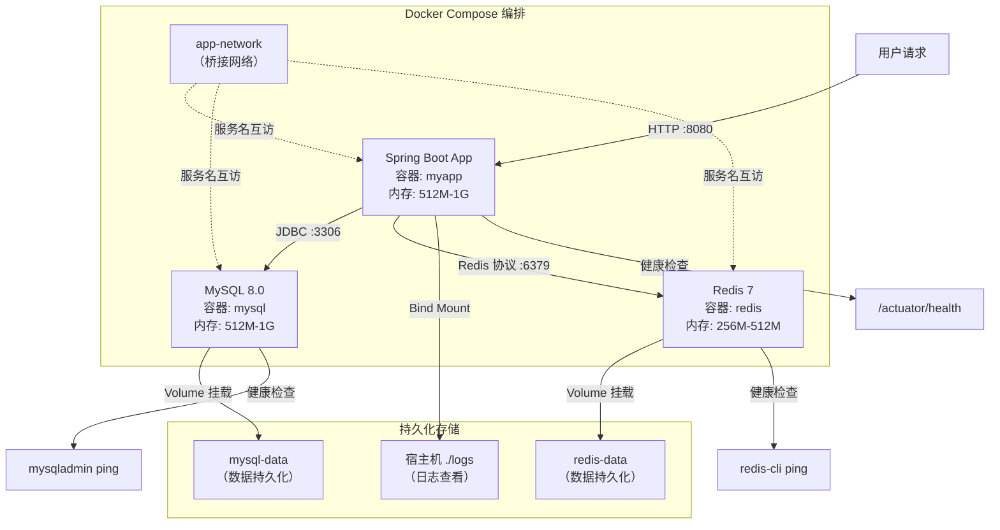

# Docker 与 Kubernetes - 综合场景串联

---

**综合架构图（Docker Compose 编排部署 Spring Boot + MySQL + Redis）：**



> 上图展示了 Docker Compose 编排部署 Spring Boot + MySQL + Redis 的完整架构：三个服务通过 app-network 桥接网络互通（以服务名访问），MySQL 和 Redis 数据通过 Volume 持久化，各服务配置健康检查确保启动顺序正确。

---

## 场景一：用 Docker Compose 部署 Spring Boot + MySQL + Redis

### 场景描述
使用 Docker Compose 在单机上编排部署一个 Spring Boot 应用，该应用依赖 MySQL 数据库和 Redis 缓存，需要配置网络互通、数据持久化、健康检查和资源限制。

### 涉及知识点
- [Docker 核心原理](./01-Docker核心原理.md)：Dockerfile 编写、镜像构建、Volume 挂载、网络模式
- [Kubernetes 核心概念](./02-Kubernetes核心概念.md)：健康检查、资源限制、配置管理（对标理解）
- [容器与 K8s 笔面试题集](./03-容器与K8s笔面试题集.md)：容器化部署面试题

### 协作流程

第一步：编写 Spring Boot 应用的 Dockerfile
- 使用多阶段构建：第一阶段用 Maven/Gradle 编译，第二阶段用 JRE 运行
- 创建非 root 用户运行应用：`RUN addgroup -S appgroup && adduser -S appuser -G appgroup`
- 设置 JVM 参数：`ENV JAVA_OPTS="-Xms512m -Xmx1024m"`
- 配置健康检查：`HEALTHCHECK --interval=30s CMD curl -f http://localhost:8080/actuator/health || exit 1`

第二步：编写 docker-compose.yml
- 定义三个服务：app、mysql、redis
- 配置自定义网络：`app-network`，使服务间通过服务名互相访问
- MySQL 配置：设置 root 密码、创建数据库、挂载 Volume 持久化数据
- Redis 配置：设置密码（requirepass）、挂载 Volume 持久化数据
- App 配置：通过环境变量注入数据库和 Redis 连接信息，设置 depends_on 和健康检查条件

第三步：配置数据持久化
- MySQL 数据卷：`mysql-data:/var/lib/mysql`
- Redis 数据卷：`redis-data:/data`
- 应用日志可通过 Bind Mount 挂载到宿主机便于查看

第四步：配置资源限制
- 在 docker-compose.yml 中为每个服务设置 `deploy.resources.limits` 和 `reservations`
- MySQL：`cpus: '2'`、`memory: 1G`
- Redis：`cpus: '1'`、`memory: 512M`
- App：`cpus: '2'`、`memory: 1G`

第五步：启动与验证
- 启动所有服务：`docker compose up -d`
- 查看服务状态：`docker compose ps`
- 查看日志：`docker compose logs -f app`
- 验证 MySQL 连接：`docker compose exec mysql mysql -u root -p`
- 验证 Redis 连接：`docker compose exec redis redis-cli -a password ping`
- 验证应用：`curl http://localhost:8080/actuator/health`

### 关键要点
- 使用明确的镜像版本标签（如 `mysql:8.0`），避免使用 latest
- 敏感信息（密码）使用环境变量或 `.env` 文件，不要硬编码在 docker-compose.yml 中
- 数据必须通过 Volume 持久化，否则容器删除后数据丢失
- 设置资源限制防止单个容器耗尽宿主机资源
- 使用 depends_on 配合健康检查确保启动顺序正确

### 完整示例代码：Dockerfile + docker-compose 部署配置

#### 步骤一：Spring Boot 应用 Dockerfile（多阶段构建）

```dockerfile
# ============================================================
# 阶段一：Maven 构建（使用 Maven 官方镜像）
# ============================================================
FROM maven:3.8.6-openjdk-17-slim AS builder

WORKDIR /build

# 1. 先复制 pom.xml，利用 Docker 缓存层加速依赖下载
COPY pom.xml .
RUN mvn dependency:go-offline -B -q

# 2. 复制源码并编译打包
COPY src ./src
RUN mvn clean package -DskipTests -B -q

# ============================================================
# 阶段二：JRE 运行（使用精简 JRE 镜像）
# ============================================================
FROM eclipse-temurin:17-jre-alpine AS runtime

# 创建非 root 用户
RUN addgroup -S appgroup && adduser -S appuser -G appgroup

# 设置时区
RUN apk add --no-cache tzdata curl && \
    cp /usr/share/zoneinfo/Asia/Shanghai /etc/localtime && \
    echo "Asia/Shanghai" > /etc/timezone

WORKDIR /app

# 从构建阶段复制 JAR 包
COPY --from=builder /build/target/*.jar app.jar

# 修改文件所有者
RUN chown -R appuser:appgroup /app

# 切换到非 root 用户
USER appuser

# JVM 参数（可通过环境变量覆盖）
ENV JAVA_OPTS="-Xms512m -Xmx1024m -XX:+UseG1GC -XX:MaxGCPauseMillis=200"

# 优雅关闭
STOPSIGNAL SIGTERM

# 健康检查
HEALTHCHECK --interval=30s --timeout=5s --retries=3 --start-period=60s \
    CMD curl -f http://localhost:8080/actuator/health || exit 1

# 暴露端口
EXPOSE 8080

# 启动命令
ENTRYPOINT ["sh", "-c", "java ${JAVA_OPTS} -Duser.timezone=Asia/Shanghai -jar app.jar"]
```

#### 步骤二：docker-compose.yml（Spring Boot + MySQL + Redis 完整编排）

```yaml
version: '3.8'

# ============================================================
# 服务定义
# ============================================================
services:
  # ========== Spring Boot 应用 ==========
  app:
    build:
      context: .
      dockerfile: Dockerfile
    image: myapp:latest
    container_name: myapp
    restart: always
    ports:
      - "8080:8080"
    environment:
      # 数据库连接（通过服务名访问）
      SPRING_DATASOURCE_URL: jdbc:mysql://mysql:3306/trading_db?useUnicode=true&characterEncoding=utf8mb4&serverTimezone=Asia/Shanghai
      SPRING_DATASOURCE_USERNAME: root
      SPRING_DATASOURCE_PASSWORD: ${MYSQL_ROOT_PASSWORD:-root123}
      # Redis 连接
      SPRING_REDIS_HOST: redis
      SPRING_REDIS_PORT: 6379
      SPRING_REDIS_PASSWORD: ${REDIS_PASSWORD:-redis123}
      # JVM 参数
      JAVA_OPTS: "-Xms512m -Xmx1024m -XX:+UseG1GC"
      # 激活环境
      SPRING_PROFILES_ACTIVE: docker
    depends_on:
      mysql:
        condition: service_healthy
      redis:
        condition: service_healthy
    networks:
      - app-network
    deploy:
      resources:
        limits:
          cpus: '2'
          memory: 1G
        reservations:
          cpus: '1'
          memory: 512M
    # 将应用日志挂载到宿主机
    volumes:
      - ./logs:/app/logs

  # ========== MySQL 8.0 ==========
  mysql:
    image: mysql:8.0.35
    container_name: mysql
    restart: always
    ports:
      # 仅开发环境暴露，生产环境建议注释掉
      - "3306:3306"
    environment:
      MYSQL_ROOT_PASSWORD: ${MYSQL_ROOT_PASSWORD:-root123}
      MYSQL_DATABASE: trading_db
      MYSQL_USER: appuser
      MYSQL_PASSWORD: ${MYSQL_USER_PASSWORD:-app123}
      TZ: Asia/Shanghai
    command:
      - --character-set-server=utf8mb4
      - --collation-server=utf8mb4_unicode_ci
      - --default-authentication-plugin=mysql_native_password
      - --max_connections=500
      - --innodb_buffer_pool_size=256M
      - --slow_query_log=1
      - --slow_query_log_file=/var/log/mysql/slow.log
      - --long_query_time=1
    volumes:
      - mysql-data:/var/lib/mysql
      # 初始化脚本（首次启动时执行）
      - ./sql/init:/docker-entrypoint-initdb.d
    networks:
      - app-network
    healthcheck:
      test: ["CMD", "mysqladmin", "ping", "-h", "localhost", "-u", "root", "-p${MYSQL_ROOT_PASSWORD:-root123}"]
      interval: 10s
      timeout: 5s
      retries: 5
      start_period: 40s
    deploy:
      resources:
        limits:
          cpus: '2'
          memory: 1G
        reservations:
          cpus: '1'
          memory: 512M

  # ========== Redis 7 ==========
  redis:
    image: redis:7.2-alpine
    container_name: redis
    restart: always
    ports:
      # 仅开发环境暴露，生产环境建议注释掉
      - "6379:6379"
    command:
      - redis-server
      - --requirepass ${REDIS_PASSWORD:-redis123}
      - --maxmemory 256mb
      - --maxmemory-policy allkeys-lru
      - --save 900 1
      - --save 300 10
      - --save 60 10000
      - --appendonly yes
    volumes:
      - redis-data:/data
    networks:
      - app-network
    healthcheck:
      test: ["CMD", "redis-cli", "-a", "${REDIS_PASSWORD:-redis123}", "ping"]
      interval: 10s
      timeout: 5s
      retries: 5
      start_period: 10s
    deploy:
      resources:
        limits:
          cpus: '1'
          memory: 512M
        reservations:
          cpus: '0.5'
          memory: 256M

# ============================================================
# 网络
# ============================================================
networks:
  app-network:
    driver: bridge
    name: app-network

# ============================================================
# 数据卷（持久化存储）
# ============================================================
volumes:
  mysql-data:
    name: mysql-data
    driver: local
  redis-data:
    name: redis-data
    driver: local
```

#### 步骤三：环境变量文件 (.env)

```bash
# .env — 敏感信息统一管理，不提交到 Git
MYSQL_ROOT_PASSWORD=root123
MYSQL_USER_PASSWORD=app123
REDIS_PASSWORD=redis123
```

#### 步骤四：MySQL 初始化 SQL 脚本 (sql/init/01-init.sql)

```sql
-- 创建数据库（MySQL 镜像会自动创建 MYSQL_DATABASE，这里创建表）
USE trading_db;

CREATE TABLE IF NOT EXISTS t_user (
    id BIGINT AUTO_INCREMENT PRIMARY KEY,
    username VARCHAR(50) NOT NULL UNIQUE COMMENT '用户名',
    password VARCHAR(255) NOT NULL COMMENT '密码',
    phone VARCHAR(20) COMMENT '手机号',
    email VARCHAR(100) COMMENT '邮箱',
    age INT COMMENT '年龄',
    status TINYINT DEFAULT 1 COMMENT '状态: 1-正常 0-禁用',
    create_time DATETIME DEFAULT CURRENT_TIMESTAMP COMMENT '创建时间',
    update_time DATETIME DEFAULT CURRENT_TIMESTAMP ON UPDATE CURRENT_TIMESTAMP COMMENT '更新时间',
    INDEX idx_username (username),
    INDEX idx_phone (phone)
) ENGINE=InnoDB DEFAULT CHARSET=utf8mb4 COLLATE=utf8mb4_unicode_ci COMMENT='用户表';

CREATE TABLE IF NOT EXISTS t_order (
    id BIGINT AUTO_INCREMENT PRIMARY KEY,
    order_no VARCHAR(32) NOT NULL UNIQUE COMMENT '订单号',
    user_id BIGINT NOT NULL COMMENT '用户ID',
    product_id BIGINT NOT NULL COMMENT '商品ID',
    amount DECIMAL(10,2) NOT NULL COMMENT '订单金额',
    status TINYINT DEFAULT 1 COMMENT '状态: 1-待支付 2-已支付 3-已发货 4-已完成 5-已取消',
    create_time DATETIME DEFAULT CURRENT_TIMESTAMP COMMENT '创建时间',
    update_time DATETIME DEFAULT CURRENT_TIMESTAMP ON UPDATE CURRENT_TIMESTAMP COMMENT '更新时间',
    INDEX idx_user_id (user_id),
    INDEX idx_order_no (order_no),
    INDEX idx_create_time (create_time)
) ENGINE=InnoDB DEFAULT CHARSET=utf8mb4 COLLATE=utf8mb4_unicode_ci COMMENT='订单表';
```

#### 步骤五：Spring Boot 多环境配置 (application-docker.yml)

```yaml
# application-docker.yml — Docker 环境专用配置
spring:
  datasource:
    driver-class-name: com.mysql.cj.jdbc.Driver
    url: jdbc:mysql://${SPRING_DATASOURCE_URL:mysql:3306/trading_db}?useUnicode=true&characterEncoding=utf8mb4&serverTimezone=Asia/Shanghai
    username: ${SPRING_DATASOURCE_USERNAME:root}
    password: ${SPRING_DATASOURCE_PASSWORD:root123}
    hikari:
      maximum-pool-size: 20
      minimum-idle: 5
      connection-timeout: 5000
      idle-timeout: 300000

  redis:
    host: ${SPRING_REDIS_HOST:redis}
    port: ${SPRING_REDIS_PORT:6379}
    password: ${SPRING_REDIS_PASSWORD:}
    lettuce:
      pool:
        max-active: 20
        max-idle: 10
        min-idle: 5

server:
  shutdown: graceful

management:
  endpoints:
    web:
      exposure:
        include: health,info,metrics,prometheus
  endpoint:
    health:
      show-details: when-authorized
```

#### 步骤六：常用操作命令速查

```bash
# ========== 构建与启动 ==========
# 构建镜像并启动所有服务（后台运行）
docker compose up -d --build

# 仅启动（不重新构建）
docker compose up -d

# 查看服务状态
docker compose ps

# 查看所有服务日志（实时跟踪）
docker compose logs -f

# 只看某个服务的日志
docker compose logs -f app
docker compose logs -f mysql

# ========== 停止与重启 ==========
# 停止所有服务
docker compose stop

# 停止并删除容器（数据卷保留）
docker compose down

# 停止并删除容器 + 数据卷（危险操作）
docker compose down -v

# 重启单个服务
docker compose restart app

# ========== 进入容器调试 ==========
# 进入应用容器
docker compose exec app sh

# 进入 MySQL 容器
docker compose exec mysql mysql -u root -p

# 进入 Redis 容器
docker compose exec redis redis-cli -a redis123

# ========== 数据备份 ==========
# 备份 MySQL 数据
docker compose exec mysql mysqldump -u root -p trading_db > backup_$(date +%Y%m%d).sql

# 备份 Redis 数据（触发 RDB 快照）
docker compose exec redis redis-cli -a redis123 BGSAVE

# ========== 资源监控 ==========
# 查看容器资源使用情况
docker stats

# 查看容器内进程
docker compose top
```

---

## 场景二：Kubernetes 部署一个高可用的微服务

### 场景描述
在 Kubernetes 集群中部署一个生产级 Spring Boot 微服务，要求实现高可用（多副本）、滚动更新、健康检查、自动扩缩容、配置管理、服务发现和 Ingress 流量入口。

### 涉及知识点
- [Docker 核心原理](./01-Docker核心原理.md)：Dockerfile 编写、镜像构建、推送至镜像仓库
- [Kubernetes 核心概念](./02-Kubernetes核心概念.md)：Deployment、Service、Ingress、ConfigMap、Secret、HPA、Probe
- [容器与 K8s 笔面试题集](./03-容器与K8s笔面试题集.md)：K8s 部署面试题

### 协作流程

第一步：构建并推送镜像
- 编写多阶段构建 Dockerfile，使用明确的版本标签
- 构建镜像：`docker build -t registry.example.com/myapp:v1.0.0 .`
- 推送至私有镜像仓库：`docker push registry.example.com/myapp:v1.0.0`

第二步：创建 ConfigMap 和 Secret
- ConfigMap 存储非敏感配置（数据库 URL、日志级别、线程池大小）
- Secret 存储敏感信息（数据库密码、API 密钥），使用 base64 编码
- 在 Deployment 中通过环境变量或 Volume 挂载方式引用

第三步：创建 Deployment
- 设置 replicas 为 3，确保高可用
- 配置 resources.requests 和 resources.limits（CPU 和内存）
- 配置健康检查：
  - livenessProbe：检查应用是否存活，不依赖外部服务
  - readinessProbe：检查应用是否就绪可接收流量，可检查依赖
  - startupProbe：给应用足够的启动时间，initialDelaySeconds 适当设置
- 配置优雅关闭：设置 terminationGracePeriodSeconds 为 30 秒
- 配置 Pod 反亲和性：将 Pod 分散到不同节点，提高可用性

第四步：创建 Service
- 创建 ClusterIP Service 供集群内部访问
- 通过 selector 关联 Deployment 的 Pod 标签
- 指定端口映射（targetPort 和 port）

第五步：配置 Ingress
- 创建 Ingress 资源，配置域名和路径规则
- 配置 TLS 证书（通过 Secret 引用）
- 将外部流量路由到 Service

第六步：配置 HPA 自动扩缩容
- 基于 CPU 使用率：`kubectl autoscale deployment myapp --cpu-percent=70 --min=3 --max=10`
- 或通过 YAML 配置 HPA 资源，指定 metrics（CPU/内存/自定义指标）

第七步：部署与验证
- 应用所有资源：`kubectl apply -f k8s/`
- 检查 Deployment 状态：`kubectl rollout status deployment/myapp`
- 检查 Pod 状态：`kubectl get pods -l app=myapp`
- 查看日志：`kubectl logs -f deployment/myapp`
- 执行滚动更新：`kubectl set image deployment/myapp myapp=registry.example.com/myapp:v1.1.0`
- 回滚验证：`kubectl rollout undo deployment/myapp`

### 关键要点
- 不要使用 latest 标签，使用明确的版本号或 Git commit hash
- livenessProbe 不检查外部依赖，避免级联重启
- readinessProbe 可检查依赖，确保 Pod 就绪后才接收流量
- 设置 resources.requests 和 limits，防止资源争抢和 OOM
- 应用必须正确处理 SIGTERM 信号，实现优雅关闭
- 敏感配置使用 Secret，非敏感配置使用 ConfigMap
- 使用 Pod 反亲和性将副本分散到不同节点，避免单点故障

---

> [返回模块目录](../../README.md) | [返回知识导览](../../知识导览.md)