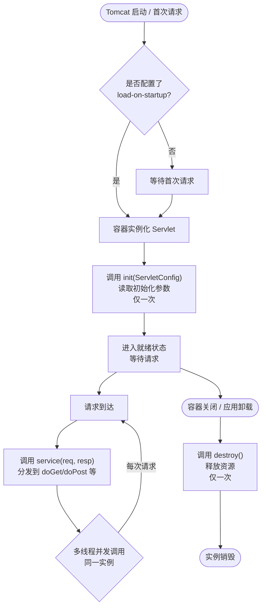
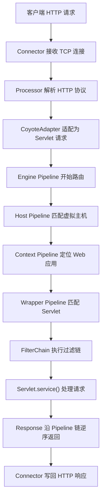

# Servlet 与 Tomcat 底层

> 学习路线对应：第2周 -- JavaWeb 基础
> 前置知识：Java 面向对象、HTTP 协议基础
> 预计学习时间：1-2 天

## 一、核心概念

### 1.1 Servlet 接口与体系结构

| 维度 | 内容 |
|------|------|
| 是什么 | Servlet 是 Java EE 规范中定义的处理 Web 请求的服务器端组件，核心接口为 `javax.servlet.Servlet`，运行在 Servlet 容器（如 Tomcat）中 |
| 能做什么 | 接收 HTTP 请求并生成响应；通过生命周期方法管理实例的创建与销毁；按 HTTP 方法分发到不同的处理方法 |
| 怎么用 | 自定义类继承 HttpServlet，覆写 doGet/doPost 方法，通过 web.xml 或 @WebServlet 注解注册 |
| 原理和工作流程 | Servlet 体系结构为三层：Servlet 接口（定义 init/service/destroy 等核心方法）-> GenericServlet 抽象类（实现 Servlet 和 ServletConfig 接口，与协议无关，提供通用 init/destroy 实现，留下 service 抽象方法）-> HttpServlet 抽象类（继承 GenericServlet，覆写 service 方法，根据 HTTP 请求方法分发到 doGet/doPost/doPut/doDelete/doHead/doOptions/doTrace 七个方法）。开发者通常继承 HttpServlet 并覆写所需的 doXxx 方法即可 |
| 缺点 | API 偏底层 boilerplate 代码多；一个 Servlet 通常只处理一类 URL 导致类爆炸；配置繁琐需 web.xml 或注解；单例多线程并发安全需自行处理 |

> 📖 **参考链接**：
> - [Jakarta Servlet Specification](https://github.com/jakartaee/servlet-spec) -- Servlet 规范文档
> - [Oracle - Servlet Tutorial](https://docs.oracle.com/javaee/7/tutorial/servlets.htm) -- Servlet 官方教程
> - [MDN - Servlet](https://developer.mozilla.org/zh-CN/docs/Glossary/Servlet) -- Servlet 概念解释

### 1.2 Servlet 生命周期详解

| 维度 | 内容 |
|------|------|
| 是什么 | Servlet 生命周期指 Servlet 实例从创建、初始化、处理请求到最终销毁的完整过程，由 Servlet 容器管理 |
| 能做什么 | 控制 Servlet 实例的创建时机（懒加载或启动时加载）；管理初始化参数；处理每次请求；在销毁时释放资源 |
| 怎么用 | 覆写 init(ServletConfig)、service/doGet/doPost、destroy 方法，通过 load-on-startup 控制加载时机 |
| 原理和工作流程 | 生命周期分三个阶段：1. 初始化阶段 -- 容器加载 Servlet 类并实例化（默认首次请求时懒加载，load-on-startup >= 0 时启动时加载），调用 init(ServletConfig) 方法一次，传入 ServletConfig 对象获取初始化参数。2. 请求处理阶段 -- 每次请求到达时容器调用 service(ServletRequest, ServletResponse) 方法，HttpServlet 的 service 方法根据请求方法分发到 doGet/doPost 等。service 方法被多线程并发调用，同一个 Servlet 实例同时服务多个请求。3. 销毁阶段 -- 容器关闭或卸载 Web 应用时调用 destroy() 方法一次，释放资源。整个容器中一个 Servlet 类型通常只有一个实例（单例模式），但实现了 SingleThreadModel 接口的 Servlet 会有多个实例（已废弃） |
| 缺点 | 单例多线程需自行处理并发安全（实例变量共享）；懒加载导致首次请求响应慢；init 失败导致 Servlet 不可用；destroy 时长影响容器关闭速度 |

> **生活化类比：Servlet 生命周期就像员工入职-工作-离职的全过程** —— 把 Servlet 实例想象成公司的一名员工：init() 是入职报到（只办一次手续，配置工牌、领工位、读员工手册），service() 是每天上班处理客户业务（每来一个客户就处理一次，可以多个客户同时来——多线程并发），destroy() 是离职办理（只办一次，归还工牌、清理工位、交接工作）。load-on-startup 就像"提前入职"，公司开张当天就到岗，而不是"客户第一次上门时才急急忙忙招聘"（懒加载）。整个公司里这个岗位通常只有一名员工（单例），但同一时间可能同时服务多位客户（多线程），所以员工的本子（实例变量）不能记着"上一个客户写到一半的内容"——这就是 Servlet 线程安全问题的根源。

#### Servlet 生命周期的 Mermaid 流程图



> 这张 Servlet 生命周期流程图揭示了三个关键节点：init 与 destroy 各只执行一次（单例），service 在每次请求时被多线程并发调用（无同步）。理解这一点是写出线程安全 Servlet 的前提——实例变量必须按"不可变"或"同步访问"原则处理，否则会出现竞态条件。

> 📖 **参考链接**：
> - [Jakarta Servlet - Lifecycle](https://github.com/jakartaee/servlet-spec/wiki/Lifecycle) -- Servlet 生命周期规范
> - [Tomcat - Servlet Lifecycle](https://tomcat.apache.org/tomcat-10.1-doc/servletapi/jakarta/servlet/Servlet.html) -- Servlet 接口文档

### 1.3 GenericServlet 与 HttpServlet 继承关系

| 维度 | 内容 |
|------|------|
| 是什么 | GenericServlet 是协议无关的 Servlet 抽象实现，HttpServlet 是专门处理 HTTP 协议的 Servlet 抽象实现，二者构成 Servlet 体系的核心继承链 |
| 能做什么 | GenericServlet 提供通用 init/destroy 实现和 ServletConfig 访问；HttpServlet 按 HTTP 方法自动分发到 doGet/doPost 等 |
| 怎么用 | GenericServlet 覆写 service 方法处理任何协议；HttpServlet 覆写 doGet/doPost 等方法处理 HTTP 请求 |
| 原理和工作流程 | GenericServlet 实现了 Servlet 和 ServletConfig 接口，保存了 init 传入的 ServletConfig 引用，提供了 getServletConfig/getServletContext/getInitParameter 等便捷方法。其 init(ServletConfig) 方法调用无参 init() 方法（模板方法模式），子类只需覆写无参 init 即可。service 方法保持抽象，由子类实现。HttpServlet 继承 GenericServlet 并覆写 service 方法，先从 ServletRequest 强转为 HttpServletRequest，然后调用重载的 service(HttpServletRequest, HttpServletResponse) 方法，该方法根据 request.getMethod() 返回值分发到 doGet/doPost/doPut/doDelete/doHead/doOptions/doTrace。doHead 默认调用 doGet 后丢弃响应体，doOptions 返回允许的方法列表，doTrace 回显请求用于调试。子类通常覆写 doGet 和 doPost 即可 |
| 缺点 | 继承层次深三个类理解成本高；HttpServlet 中 doGet 和 doPost 默认返回 405 需显式覆写；GenericServlet 的 service 方法签名参数为 ServletRequest 需手动强转；doHead 默认实现调用 doGet 可能产生不必要的响应体 |

### 1.4 Tomcat 架构总览

| 维度 | 内容 |
|------|------|
| 是什么 | Tomcat 是 Apache 开源的 Servlet 容器实现，由 Connector（连接器）和 Container（容器）两大核心组件组成，采用分层架构 |
| 能做什么 | 处理网络 I/O 与 HTTP 协议解析；管理 Web 应用的生命周期；按层级路由请求到具体 Servlet；支持多种 I/O 模型 |
| 怎么用 | 下载解压后通过 bin/startup.sh 启动，webapps 目录部署 WAR 包或目录，conf/server.xml 配置端口和虚拟主机 |
| 原理和工作流程 | Tomcat 整体架构为 Server -> Service ->（Connector + Engine）。Server 代表整个 Tomcat 实例，管理所有 Service 的生命周期。Service 将 Connector 和 Engine 组合在一起，一个 Service 可包含多个 Connector和一个 Engine。Connector 负责接收网络请求、解析协议、封装请求对象，支持 HTTP/1.1（端口 8080）和 AJP（端口 8009，与 Apache/Nginx 对接）。Engine 是顶级容器，负责请求路由，层级为 Engine -> Host（虚拟主机，如 localhost）-> Context（Web 应用，对应一个 WAR 或目录）-> Wrapper（单个 Servlet）。每层容器都有自己的 Pipeline-Valve 责任链处理请求 |
| 缺点 | 架构层次多新手上手难；默认配置不适合高并发需调优；单机部署无集群能力需额外方案；AJP 协议在现代架构中逐渐淘汰 |

> **生活化类比：Tomcat 架构就像政府办公体系** —— 把 Tomcat 的多层架构与政府办公体系对应起来：Server 是整个国家（最高层级），Service 是国务院（管理多个部委），Connector 是信访办/收发室（接待来访群众、登记来访事项、翻译群众诉求为政府内部文件），Engine 是中央办公厅（接到信访事项后路由到对应部委），Host 是各部委（按域名区分，如工信部、商务部），Context 是部委下属的具体司局（每个司局有自己的独立办公大楼和档案室），Wrapper 是某个具体的窗口办事员（处理具体业务）。Pipeline-Valve 链就是办事流程（从信访办→部委→司局→窗口，每层都要盖章签字），FilterChain 是窗口前的前置审核（先经过保安检查、再经过预审员、最后才到办事员）。理解这套层级关系后，Tomcat 调试问题就不再迷茫。

> 📖 **参考链接**：
> - [Tomcat - Architecture Overview](https://tomcat.apache.org/tomcat-10.1-doc/architecture/overview.html) -- Tomcat 架构总览
> - [Tomcat - Configuring server.xml](https://tomcat.apache.org/tomcat-10.1-doc/config/server.html) -- server.xml 配置指南

### 1.5 Tomcat Connector 详解

| 维度 | 内容 |
|------|------|
| 是什么 | Connector 是 Tomcat 中负责网络通信的组件，监听端口接收 TCP 连接，解析 HTTP 协议，将原始字节流封装为 Request/Response 对象 |
| 能做什么 | 监听端口接收连接；解析 HTTP 协议提取请求行/头/体；封装为 Tomcat 内部请求对象；将响应对象序列化为 HTTP 响应报文发送 |
| 怎么用 | 在 server.xml 中配置 Connector 元素，指定端口、协议、线程池等参数 |
| 原理和工作流程 | Connector 核心组件包括：Endpoint（网络端点，负责 Socket 监听和 I/O 读写）、Processor（协议处理器，解析 HTTP 协议，将字节流转为请求对象）、Adapter（适配器，CoyoteAdapter 将 Tomcat 内部的 CoyoteRequest/Response 适配为 Servlet 标准的 HttpServletRequest/Response）。Endpoint 支持三种 I/O 模型：BIO（阻塞 I/O，一请求一线程，8.5 已移除）、NIO（非阻塞 I/O，基于 Selector 多路复用，默认模型）、APR（使用 native 库直接调用操作系统 I/O，性能最高）。NIO 模型下，Acceptor 线程接收连接，Poller 线程监听 Socket 事件，Worker 线程池处理具体请求 |
| 缺点 | BIO 并发低已淘汰；APR 部署复杂需 native 库；NIO 默认参数需按场景调优；Connector 配置参数多优化门槛高 |

#### Connector 三种 I/O 模型深度对比

Tomcat Connector 历经三种 I/O 模型演进，理解其差异有助于生产环境选型：

| I/O 模型 | 工作机制 | 线程开销 | 适用场景 | Tomcat 版本支持 |
|---------|---------|---------|---------|----------------|
| BIO | 一个请求占用一个 Worker 线程，线程阻塞在 Socket 读上直到数据到达 | 高（并发数=线程数） | 低并发、简单场景 | 8.5 起已移除 |
| NIO（默认） | 基于 Java NIO Selector，Acceptor 接收连接后注册到 Poller 的 Selector，Poller 监听就绪事件再交给 Worker 线程处理 | 低（少量线程处理大量连接） | 通用场景，高并发友好 | 6.x 起，8.5+ 默认 |
| NIO2 | 基于 JDK 7 的 AsynchronousSocketChannel，真正的异步 I/O，回调驱动 | 极低 | 大量长连接、IoT 场景 | 8+ |
| APR | 使用 Apache Portable Runtime native 库，直接调用操作系统 epoll/kqueue | 极低 | 极致性能、生产高并发 | 需额外安装 native 库 |

NIO 模型三类线程分工详解：

- **Acceptor 线程**（默认 1 个）：循环调用 `ServerSocketChannel.accept()` 阻塞接收新连接，每接收一个 SocketChannel 就注册到某个 Poller 的 Selector 上。Acceptor 不负责读取数据，只做"接收连接 + 转交注册"。
- **Poller 线程**（默认 `Math.min(2, CPU 核心数)` 个）：每个 Poller 维护一个 Selector 与一个事件队列，循环调用 `selector.select()` 监听就绪事件，将就绪的 SocketChannel 封装为任务提交到 Worker 线程池。
- **Worker 线程池**（maxThreads 默认 200）：从任务队列取出任务，读取 Socket 数据，调用 Http11Processor 解析 HTTP 协议，再经由 CoyoteAdapter 调用 Container 处理。

关键参数推荐配置（以 4C8G 服务器、5000 QPS 为例）：

```xml
<Connector
    port="8080"
    protocol="org.apache.coyote.http11.Http11NioProtocol"
    maxThreads="500"
    minSpareThreads="20"
    acceptCount="200"
    maxConnections="10000"
    connectionTimeout="20000"
    enableLookups="false"
    URIEncoding="UTF-8" />
```

> 📖 **参考链接**：
> - [Tomcat - Connector Configuration](https://tomcat.apache.org/tomcat-10.1-doc/config/http.html) -- HTTP Connector 配置
> - [Tomcat - NIO Implementation](https://cwiki.apache.org/confluence/display/TOMCAT/Connectors) -- Connector 实现细节

### 1.6 Tomcat Container 详解

| 维度 | 内容 |
|------|------|
| 是什么 | Container 是 Tomcat 中负责请求路由和业务处理的组件，采用四层嵌套结构，每层都有独立的 Pipeline-Valve 责任链 |
| 能做什么 | Engine 路由请求到对应虚拟主机；Host 管理多个 Web 应用；Context 管理单个 Web 应用；Wrapper 封装单个 Servlet |
| 怎么用 | 在 server.xml 中配置 Engine/Host/Context 元素，或通过 WAR 包自动部署 |
| 原理和工作流程 | 四层容器结构：Engine（顶级容器，一个 Service 一个 Engine，负责将请求路由到正确的 Host）-> Host（虚拟主机，根据请求的 Host 头匹配，支持多个域名，如 localhost）-> Context（Web 应用，对应一个 WAR 包或目录，拥有独立的 ServletContext 和类加载器）-> Wrapper（单个 Servlet 的包装器，管理 Servlet 的加载、初始化和调用）。每层容器都实现了 Container 接口，拥有自己的 Pipeline 和 Valve 链。请求到达时，从 Engine 的 Pipeline 开始，依次经过各层容器的 Valve 链，最终到达 Wrapper 的 Valve 链，Wrapper 调用 FilterChain 和 Servlet。Tomcat 使用责任链模式实现请求的分层处理 |
| 缺点 | 四层嵌套结构理解成本高；Valve 链顺序不当影响请求处理；Context 类加载器隔离可能导致类找不到；多层容器间的属性传递依赖内部机制 |

### 1.7 ServletContext 详解

| 维度 | 内容 |
|------|------|
| 是什么 | ServletContext 是 Web 应用与 Servlet 容器通信的接口，每个 Web 应用有唯一的 ServletContext 对象，代表整个 Web 应用的上下文 |
| 能做什么 | 获取应用初始化参数；读写应用级属性（全局共享）；获取资源文件路径；获取服务器信息；实现 Servlet 间通信 |
| 怎么用 | `getServletContext().getInitParameter("key")` 获取初始化参数；`getServletContext().setAttribute("key", value)` 存储全局属性；`getServletContext().getRealPath("/")` 获取真实路径 |
| 原理和工作流程 | ServletContext 在 Web 应用启动时由容器创建，应用销毁时销毁，生命周期与 Web 应用一致。通过 web.xml 的 context-param 配置应用级初始化参数，所有 Servlet 和 Filter 均可通过 ServletContext.getInitParameter 读取。应用级属性通过 setAttribute/getAttribute 方法存储和读取，所有 Servlet 共享同一 ServletContext，可用于 Servlet 间通信和全局配置共享。getRealPath 将虚拟路径转为服务器文件系统真实路径。getResource 和 getResourceAsStream 获取 Web 应用内的资源文件。getRequestDispatcher 获取请求转发器，用于服务端转发 |
| 缺点 | 应用级属性全局共享存在并发安全问题；存储对象无类型安全需手动转型；属性过多导致内存占用；应用重启后属性丢失 |

### 1.8 ServletConfig 详解

| 维度 | 内容 |
|------|------|
| 是什么 | ServletConfig 是 Servlet 配置对象，每个 Servlet 实例有独立的 ServletConfig，封装了 web.xml 或注解中配置的 Servlet 初始化参数 |
| 能做什么 | 获取 Servlet 级别的初始化参数；获取 ServletContext 引用；获取当前 Servlet 的注册名称 |
| 怎么用 | `getServletConfig().getInitParameter("key")` 获取初始化参数；`getServletConfig().getServletName()` 获取 Servlet 名称 |
| 原理和工作流程 | ServletConfig 在 Servlet 初始化时由容器创建并传入 init(ServletConfig) 方法。GenericServlet 保存了 ServletConfig 引用，通过 getServletConfig() 可获取。在 web.xml 中通过 servlet 元素下的 init-param 子元素配置初始化参数，注解方式通过 @WebServlet 的 initParams 属性配置。每个 Servlet 的 ServletConfig 独立，不同 Servlet 可有同名参数但值不同。ServletConfig 还提供了 getServletContext() 方法获取应用上下文，GenericServlet 中直接提供便捷方法 |
| 缺点 | 初始化参数仅 String 类型需手动转换；参数在 init 时固定无法运行时修改；注解方式参数分散不集中；参数过多时配置和维护复杂 |

### 1.9 请求转发 vs 重定向

| 维度 | 内容 |
|------|------|
| 是什么 | 请求转发（Forward）是服务端内部跳转，重定向（Redirect）是服务端通知客户端重新发起请求，二者实现机制、行为特征和适用场景不同 |
| 能做什么 | Forward 服务端内部转发请求到另一个资源（Servlet/JSP/HTML）；Redirect 通知浏览器访问新地址 |
| 怎么用 | Forward：`req.getRequestDispatcher("/target").forward(req, resp)`；Redirect：`resp.sendRedirect("/target")` |
| 原理和工作流程 | Forward 发生在服务端内部，调用 forward 后当前 Servlet 不再向客户端输出响应，而是将请求和响应对象传递给目标资源继续处理。地址栏 URL 不变，请求对象和属性在转发链中共享。Redirect 通过设置响应状态码为 302 和 Location 响应头，浏览器收到后自动发起新的 GET 请求到新地址。地址栏 URL 变为新地址，原请求对象和属性丢失，两次请求互相独立。Forward 只能转发到同一 Web 应用内的资源，Redirect 可重定向到任意 URL。Forward 效率高（一次请求），Redirect 效率低（两次请求） |
| 缺点 | Forward 只能跳转应用内资源；Forward 后地址栏不变用户困惑；Redirect 丢失请求属性和 POST 数据；Redirect 增加一次网络往返延迟；Forward 链过长导致性能下降 |

---

## 二、底层原理

### 2.1 Servlet 请求处理全流程

| 维度 | 内容 |
|------|------|
| 是什么 | 一个 HTTP 请求从 Tomcat 接收到 Servlet 执行的完整处理流程，涉及 Connector、Adapter、Mapper、Container、FilterChain 等多个组件 |
| 能做什么 | 理解请求在各组件间的流转路径；掌握 Pipeline-Valve 责任链的执行机制；理解 FilterChain 的构建和执行过程 |
| 怎么用 | 请求 -> Connector(Endpoint+Processor) -> CoyoteAdapter -> Mapper -> Engine Pipeline -> Host Pipeline -> Context Pipeline -> Wrapper -> FilterChain -> Servlet |
| 原理和工作流程 | 1. Connector 的 NIO Endpoint 中 Acceptor 线程接收连接，Poller 线程监听 Socket 事件，Worker 线程从线程池中取出处理。2. Http11Processor 解析 HTTP 协议，将字节流封装为 CoyoteRequest/CoyoteResponse。3. CoyoteAdapter 的 service 方法将 Coyote 对象适配为 HttpServletRequest/Response（实际类型为 RequestFacade/ResponseFacade，门面模式）。4. CoyoteAdapter 调用 Mapper.map 根据 URL 匹配 Host/Context/Wrapper。5. 调用 Engine 的 Pipeline 中第一个 Valve（StandardEngineValve），Valve 调用 Host 的 Pipeline。6. StandardHostValve 调用 Context 的 Pipeline。7. StandardContextValve 调用 Wrapper 的 Pipeline。8. StandardWrapperValve 分配 Servlet 实例（从对象池中获取或创建），构建 FilterChain（ApplicationFilterChain）。9. FilterChain 依次执行各 Filter 的 doFilter 方法，最后调用 Servlet 的 service 方法。10. 响应沿 Valve 链和 Filter 链逆序返回，最终由 Processor 写回 Socket |
| 缺点 | 组件层次多链路长排查困难；Pipeline-Valve 模式增加理解成本；FilterChain 构建依赖 URL 匹配规则；大量内部对象转换有性能开销 |

**Tomcat 请求处理核心流程：**



上图完整呈现了 Tomcat 从接收网络连接到返回响应的全链路处理过程。Connector 负责底层网络通信与协议解析，经由 CoyoteAdapter 将内部请求适配为标准 Servlet API 后，交由 Container 的四层 Pipeline-Valve 责任链逐级路由，最终到达 Wrapper 调用 Servlet 处理业务逻辑。响应数据沿原路逆序返回，由 Processor 序列化为 HTTP 报文写回客户端。

### 2.2 Tomcat 类加载机制

| 维度 | 内容 |
|------|------|
| 是什么 | Tomcat 使用自定义类加载体系，打破了 Java 双亲委派模型，实现了 Web 应用间的类隔离和共享 |
| 能做什么 | Web 应用间类隔离互不影响；共享公共类库减少内存占用；支持热加载和热部署 |
| 怎么用 | 公共类放 CATALINA_HOME/lib，应用私有类放 WEB-INF/lib，Tomcat 自动按类加载器层级加载 |
| 原理和工作流程 | Tomcat 类加载器层级（自上而下）：Bootstrap ClassLoader（加载 JVM 核心类）-> System ClassLoader（加载 CLASSPATH 中的类）-> Common ClassLoader（加载 CATALINA_HOME/lib 中的类，Tomcat 和所有 Web 应用共享）-> Catalina ClassLoader（加载 CATALINA_HOME/lib 中 Tomcat 专用的类，对 Web 应用不可见）-> Shared ClassLoader（加载 CATALINA_HOME/shared 中的类，所有 Web 应用共享，默认未使用）-> Webapp ClassLoader（每个 Web 应用独立，加载 WEB-INF/classes 和 WEB-INF/lib 中的类）。Webapp ClassLoader 打破了双亲委派：加载类时先尝试自己加载（WEB-INF 目录），找不到再委托父类加载器，实现应用隔离。默认情况下 Webapp ClassLoader 不从父类加载器缓存中查找，确保不同应用的类版本独立 |
| 缺点 | 类加载器层级多调试困难；打破双亲委派可能引起类找不到异常；WEB-INF/lib 中重复 jar 导致内存浪费；类加载器泄漏导致 PermGen/Metaspace 溢出 |

> **生活化类比：Tomcat 类加载器就像图书馆分级管理** —— Java 标准的双亲委派像"国家图书馆→省图书馆→市图书馆"的层级——市馆没有的书先问省馆，省馆没有的再问国图，确保大家读到的"经典著作"（核心类）版本一致。Tomcat 的 WebappClassLoader 打破这一规则，相当于"每个分公司都有自己的小图书馆，先查自家藏书，找不到才去问总部"。这样设计的目的是让不同 Web 应用能用不同版本的同一本书（比如应用 A 用 Spring 5、应用 B 用 Spring 6）互不干扰——这是 Tomcat 实现 Web 应用类隔离的核心机制。但副作用是：如果有人把"分公司图书馆的藏书"偷偷藏到公司外部（如 ThreadLocal 持有 WebappClassLoader 的引用），分公司倒闭（应用热部署）时这些书就永远收不回了——这就是经典的"类加载器泄漏导致 PermGen/Metaspace 溢出"问题。

> 📖 **参考链接**：
> - [Tomcat - Class Loader HOW-TO](https://tomcat.apache.org/tomcat-10.1-doc/class-loader-howto.html) -- Tomcat 类加载机制官方文档
> - [Oracle - ClassLoader](https://docs.oracle.com/javase/8/docs/api/java/lang/ClassLoader.html) -- Java ClassLoader API

### 2.3 Tomcat 线程模型（NIO 深入）

| 维度 | 内容 |
|------|------|
| 是什么 | Tomcat NIO 线程模型基于 Java NIO 的 Selector 多路复用机制，用少量线程处理大量并发连接 |
| 能做什么 | Acceptor 线程接收连接；Poller 线程监听 I/O 事件；Worker 线程池处理业务逻辑；实现高并发低延迟 |
| 怎么用 | 在 server.xml 中配置 Connector protocol="HTTP/1.1"（默认 NIO），调整 maxThreads、acceptCount 等参数 |
| 原理和工作流程 | NIO 线程模型包含三类线程：1. Acceptor 线程（默认 1 个）：循环调用 ServerSocketChannel.accept() 接收新连接，将 SocketChannel 注册到 Poller 的 Selector 上。2. Poller 线程（默认每个 CPU 核心 1-2 个）：每个 Poller 维护一个 Selector，循环调用 select() 监听就绪事件，将就绪的 SocketChannel 封装为任务提交到 Worker 线程池。3. Worker 线程池（maxThreads 默认 200）：从任务队列中取出任务，读取 Socket 数据，解析 HTTP 协议，调用 Container 处理，最后写回响应。关键参数：maxConnections（最大连接数，默认 10000）、acceptCount（等待队列长度，默认 100）、maxThreads（Worker 线程数，默认 200）、minSpareThreads（核心线程数，默认 10） |
| 缺点 | 参数调优需根据业务场景定制；线程数设置不当导致资源浪费或瓶颈；Poller 线程数不合理影响吞吐；默认参数不适合所有场景 |

### 2.4 Pipeline-Valve 责任链模式

| 维度 | 内容 |
|------|------|
| 是什么 | Pipeline-Valve 是 Tomcat 容器内部使用的责任链模式实现，每个容器（Engine/Host/Context/Wrapper）拥有独立的 Pipeline 和 Valve 链 |
| 能做什么 | 实现请求的分层处理；支持自定义 Valve 扩展功能；按顺序执行各层 Valve 链 |
| 怎么用 | 实现 Valve 接口并在 server.xml 中配置，或通过编程方式添加到 Pipeline |
| 原理和工作流程 | Pipeline 是 Valve 的有序集合，每个容器有一个 Pipeline。Pipeline 包含一个 Basic Valve（如 StandardEngineValve）和若干附加 Valve。Basic Valve 总是最后执行，负责调用下一层容器的 Pipeline。请求处理流程：Engine Pipeline 的 Valve 1 -> Valve 2 -> ... -> StandardEngineValve（调用 Host Pipeline）-> Host Pipeline 的 Valve 1 -> ... -> StandardHostValve（调用 Context Pipeline）-> StandardContextValve（调用 Wrapper Pipeline）-> StandardWrapperValve（构建 FilterChain，调用 Servlet）。响应沿逆序返回。自定义 Valve 可插入到任意层级的 Pipeline 中，实现日志记录、访问控制、性能监控等功能。Spring Boot 中常用的 RequestContextFilter 底层原理类似 |
| 缺点 | 多层 Valve 链增加调用栈深度；Valve 配置分散在各层容器中；自定义 Valve 与容器生命周期耦合；Valve 链执行顺序依赖配置顺序 |

> 📖 **参考链接**：
> - [Tomcat - The Valve Component](https://tomcat.apache.org/tomcat-10.1-doc/config/valve.html) -- Valve 组件配置
> - [Tomcat - Pipeline Design](https://tomcat.apache.org/tomcat-10.1-doc/architecture/requestProcess.html) -- Pipeline 设计原理

---

## 三、实战应用

### 3.1 手写 Servlet 完整示例（web.xml 与注解两种方式）

| 维度 | 内容 |
|------|------|
| 是什么 | 通过 web.xml 配置和 Servlet 3.0+ 注解两种方式手写 Servlet 的完整开发示例，包括初始化参数和生命周期方法 |
| 能做什么 | web.xml 方式声明 Servlet 类与映射；注解方式 @WebServlet 零配置注册；覆写生命周期方法观察执行时机 |
| 怎么用 | web.xml 方式：`<servlet><servlet-name>demo</servlet-name><servlet-class>com.example.DemoServlet</servlet-class><load-on-startup>1</load-on-startup></servlet><servlet-mapping><servlet-name>demo</servlet-name><url-pattern>/demo</url-pattern></servlet-mapping>`；注解方式：`@WebServlet(name="demo", urlPatterns="/demo", loadOnStartup=1, initParams={@WebInitParam(name="key", value="val")})` |
| 原理和工作流程 | web.xml 方式：在 web.xml 中通过 servlet 元素声明 Servlet 类名、初始化参数和 load-on-startup，通过 servlet-mapping 元素将 URL 映射到 Servlet。Tomcat 启动时解析 web.xml，按配置创建 Servlet 实例。注解方式（Servlet 3.0+）：在类上标注 @WebServlet 指定 name、urlPatterns、loadOnStartup 和 initParams，Tomcat 启动时扫描 WEB-INF/classes 和 WEB-INF/lib 中的注解自动注册。Servlet 类中覆写 init(ServletConfig) 读取初始化参数，覆写 doGet 和 doPost 处理请求，覆写 destroy 释放资源。load-on-startup 为 0 或正数时在启动时加载，值越小优先级越高 |
| 缺点 | web.xml 配置繁琐易出错；注解方式参数分散不集中；手动拼接 JSON 字符串易产生注入和格式错误；一个 Servlet 处理一个 URL 导致类爆炸 |

### 3.2 ServletContext 实现全局配置共享

| 维度 | 内容 |
|------|------|
| 是什么 | 通过 ServletContext 的 context-param 和 setAttribute 实现 Web 应用全局配置的读取和共享 |
| 能做什么 | 在 web.xml 中配置全局初始化参数；在应用启动时加载配置存入 ServletContext；所有 Servlet 共享全局配置 |
| 怎么用 | web.xml：`<context-param><param-name>appName</param-name><param-value>MyApp</param-value></context-param>`；读取：`getServletContext().getInitParameter("appName")`；存储：`getServletContext().setAttribute("config", props)` |
| 原理和工作流程 | 在 web.xml 中通过 context-param 元素配置全局参数，Tomcat 启动时解析并存入 ServletContext。所有 Servlet 通过 getServletContext().getInitParameter(key) 读取，参数在应用生命周期内不变。也可通过 ServletContextListener 在 contextInitialized 中加载配置文件（如 properties）并存入 ServletContext 的 Attribute 中，供全局使用。注意 ServletContext 中 Attribute 是全局共享的，多线程并发访问需保证线程安全，可使用不可变对象或同步机制 |
| 缺点 | 全局参数仅 String 类型需手动转换；全局 Attribute 多线程共享需同步；应用重启后 Attribute 丢失；参数过多时 web.xml 臃肿 |

### 3.3 请求转发与重定向实战

| 维度 | 内容 |
|------|------|
| 是什么 | 通过请求转发和重定向实现页面跳转和请求分发的实战示例，对比两种方式的参数传递和地址栏行为 |
| 能做什么 | Forward 实现服务端内部跳转共享请求属性；Redirect 实现外部跳转和防止表单重复提交 |
| 怎么用 | Forward：`req.setAttribute("msg", "hello"); req.getRequestDispatcher("/result.jsp").forward(req, resp);`；Redirect：`resp.sendRedirect(req.getContextPath() + "/result.jsp?msg=hello");` |
| 原理和工作流程 | Forward 场景：用户提交表单后需要展示结果页面，在 Servlet 中处理表单数据后设置请求属性，通过 forward 转发到 JSP 页面展示，地址栏保留原 URL。Redirect 场景：用户提交表单后重定向到列表页，防止刷新导致重复提交（Post-Redirect-Get 模式），地址栏变为新 URL。Forward 可传递请求属性（setAttribute），请求对象在转发链中共享。Redirect 通过 URL 参数或 Session 传递数据，请求对象不共享。Forward 路径以 "/" 开头表示相对于 Web 应用根目录，Redirect 路径以 "/" 开头表示相对于服务器根目录（需加 contextPath） |
| 缺点 | Forward 地址栏不变可能导致用户困惑；Forward 链过长导致性能下降；Redirect 丢失 POST 请求体；Redirect 增加一次网络往返；两种方式混用时路径写法易混淆 |

---

## 四、常见面试题

### 1. Servlet 的生命周期是怎样的？

| 维度 | 内容 |
|------|------|
| 是什么 | Servlet 从实例化到销毁经历的初始化（init）、处理请求（service）、销毁（destroy）三个阶段及对应方法调用机制 |
| 能做什么 | init 初始化加载资源一次；service 处理每次请求多次；destroy 释放资源一次；支持懒加载与启动时加载 |
| 怎么用 | `init(ServletConfig)` 加载时一次；`service(req,resp)` 每次请求；`destroy()` 关闭时一次 |
| 原理和工作流程 | 1. 初始化：容器加载 Servlet 类并实例化（默认首次请求时懒加载，load-on-startup 设为启动时加载），调用 init(ServletConfig) 一次，传入 ServletConfig 获取初始化参数。GenericServlet 的 init(ServletConfig) 调用无参 init()，子类覆写无参 init 即可。2. 处理请求：每次请求到达时容器调用 service 方法，HttpServlet 根据请求方法分发到 doGet/doPost 等。service 方法被多线程并发调用，同一实例同时服务多个请求。3. 销毁：容器关闭或卸载时调用 destroy() 一次，释放资源。整个容器中一个 Servlet 类型通常只有一个实例（单例），但需要保证线程安全 |
| 缺点 | 单例多线程需自行处理并发安全；懒加载导致首次请求慢；init 失败导致 Servlet 不可用；destroy 时长影响容器关闭速度 |

### 2. GenericServlet 和 HttpServlet 的区别是什么？

| 维度 | 内容 |
|------|------|
| 是什么 | GenericServlet 是协议无关的 Servlet 抽象实现，HttpServlet 是专门处理 HTTP 协议的 Servlet 抽象实现，继承自 GenericServlet |
| 能做什么 | GenericServlet 提供通用 init/destroy 和 ServletConfig 访问；HttpServlet 额外提供 HTTP 方法分发到 doGet/doPost 等 |
| 怎么用 | GenericServlet 覆写 service(ServletRequest, ServletResponse)；HttpServlet 覆写 doGet/doPost 即可 |
| 原理和工作流程 | GenericServlet 实现了 Servlet 和 ServletConfig 接口，保存 ServletConfig 引用，提供 getServletConfig/getServletContext/getInitParameter 等便捷方法。init(ServletConfig) 调用无参 init()（模板方法模式），service 保持抽象。HttpServlet 继承 GenericServlet，覆写 service 方法，从 ServletRequest 强转为 HttpServletRequest，调用重载的 service(HttpServletRequest, HttpServletResponse)，该方法根据 getMethod() 返回值分发到 doGet/doPost/doPut/doDelete/doHead/doOptions/doTrace。开发者通常继承 HttpServlet 并覆写 doGet 和 doPost |
| 缺点 | 继承层次深理解成本高；doGet 和 doPost 默认返回 405 需显式覆写；GenericServlet 的 service 参数为 ServletRequest 需手动强转；doHead 默认调用 doGet 可能产生不必要响应体 |

### 3. 请求转发（Forward）和重定向（Redirect）的区别？

| 维度 | 内容 |
|------|------|
| 是什么 | Forward 是服务端内部跳转，Redirect 是通知客户端重新发起请求，二者在请求次数、地址栏、参数传递、跳转范围方面不同 |
| 能做什么 | Forward 服务端内部转发共享请求属性；Redirect 实现外部跳转和防止表单重复提交 |
| 怎么用 | Forward：`req.getRequestDispatcher("/target").forward(req, resp)`；Redirect：`resp.sendRedirect("/target")` |
| 原理和工作流程 | Forward：服务端内部行为，调用 forward 后请求和响应对象传递给目标资源，地址栏不变，请求属性共享，仅一次请求。只能跳转到同一 Web 应用内资源。Redirect：服务端返回 302 状态码和 Location 头，浏览器自动发起新 GET 请求到新地址，地址栏变为新 URL，请求属性丢失，两次独立请求。可跳转到任意 URL（包括外部域名）。Forward 效率高（一次请求），Redirect 效率低（两次请求）。Redirect 常用于 Post-Redirect-Get 模式防止表单重复提交 |
| 缺点 | Forward 地址栏不变用户困惑且只能跳转应用内；Redirect 丢失请求属性和 POST 数据；Redirect 增加网络往返延迟；Forward 链过长性能下降；两种方式路径写法（"/" 含义）不同易混淆 |

### 4. Tomcat 的架构是怎样的？Connector 和 Container 如何协作？

| 维度 | 内容 |
|------|------|
| 是什么 | Tomcat 由 Connector（连接器，负责网络通信）和 Container（容器，负责请求处理）两大核心组件组成的分层架构 |
| 能做什么 | Connector 处理网络 I/O 和协议解析；Container 按层级路由请求到具体 Servlet；二者通过 CoyoteAdapter 协作 |
| 怎么用 | 在 server.xml 中配置 Connector（端口、协议）和 Engine/Host/Context（路由规则） |
| 原理和工作流程 | Tomcat 架构为 Server -> Service ->（Connector + Engine）。Connector 包含 Endpoint（网络监听，NIO/NIO2/APR）、Processor（协议解析，HTTP/AJP）和 Adapter（CoyoteAdapter 适配为 Servlet API）。Container 包含四层：Engine（路由到 Host）、Host（虚拟主机，匹配 Host 头）、Context（Web 应用）、Wrapper（单个 Servlet），每层有 Pipeline-Valve 链。协作流程：Connector 接收请求 -> Processor 解析 HTTP 封装为 CoyoteRequest -> CoyoteAdapter 适配为 HttpServletRequest -> Connector 调用 Engine Pipeline -> Engine Valve 链 -> Host Valve 链 -> Context Valve 链 -> Wrapper -> FilterChain -> Servlet。响应沿原路返回 |
| 缺点 | 架构层次多新手上手难；Connector 和 Container 的协作依赖内部 API；Pipeline-Valve 链增加理解成本；默认配置不适合高并发需调优 |

### 5. ServletContext 和 ServletConfig 的区别是什么？

| 维度 | 内容 |
|------|------|
| 是什么 | ServletContext 是 Web 应用级别的上下文对象（一个应用一个），ServletConfig 是 Servlet 级别的配置对象（每个 Servlet 一个） |
| 能做什么 | ServletContext 提供应用级初始化参数、全局属性共享、资源路径获取；ServletConfig 提供 Servlet 级初始化参数、Servlet 名称 |
| 怎么用 | ServletContext：`getServletContext().getInitParameter("key")`；ServletConfig：`getServletConfig().getInitParameter("key")` |
| 原理和工作流程 | ServletContext 在 Web 应用启动时创建，销毁时销毁，生命周期等于应用。通过 web.xml 的 context-param 配置全局参数，所有 Servlet 共享。提供 getRealPath、getResource、getRequestDispatcher 等全局方法。ServletConfig 在 Servlet 初始化时创建并传入 init 方法，包含该 Servlet 的 init-param 初始化参数。GenericServlet 保存了 ServletConfig 引用，并提供 getServletContext 便捷方法。作用域：ServletContext 是应用级，ServletConfig 是 Servlet 级 |
| 缺点 | ServletContext 属性全局共享需注意并发安全；ServletConfig 参数仅 String 类型；参数在 init 后固定无法运行时修改；两个接口功能有重叠容易混淆 |

---

## 五、避坑指南

| 维度 | 内容 |
|------|------|
| 是什么 | Servlet 和 Tomcat 开发中线程安全、类加载器泄漏、Servlet 配置、转发与重定向等高频错误与陷阱汇总 |
| 能做什么 | 解决 Servlet 线程安全问题；避免类加载器泄漏；正确处理路径配置；防范 Forward 和 Redirect 误用 |
| 怎么用 | Servlet 不使用实例变量或用 ThreadLocal；Context 的 reloadable 设为 false 生产环境；路径以 "/" 开头时注意 Forward 和 Redirect 的根路径差异 |
| 原理和工作流程 | Servlet 线程安全：Servlet 是单例多线程，实例变量被所有线程共享，存在线程安全问题。解决方案：不使用实例变量，或使用 ThreadLocal，或使用 synchronized 但影响性能。类加载器泄漏：Tomcat 的 WebappClassLoader 在应用重载时如果被外部引用（如 ThreadLocal 中的对象、数据库驱动注册），会导致类加载器无法回收，频繁重载导致 PermGen/Metaspace 溢出。解决方案：关闭 JDBC 驱动、清理 ThreadLocal、避免启动线程未关闭。路径配置：Forward 路径以 "/" 开头相对于 Web 应用根目录，Redirect 路径以 "/" 开头相对于服务器根目录（需加 contextPath）。Servlet 注解的 urlPatterns 必须以 "/" 开头 |
| 缺点 | 线程安全问题的排查需压测验证；类加载器泄漏排查困难需分析堆 dump；路径配置错误不报错仅 404；Tomcat 参数调优需结合业务场景 |

> 📖 **参考链接**：
> - [OWASP - Thread Safety in Java](https://cheatsheetseries.owasp.org/cheatsheets/Java_Web_Security_Cheat_Sheet.html) -- Java Web 安全最佳实践
> - [Tomcat - Migration Guide](https://tomcat.apache.org/migration.html) -- Tomcat 版本迁移指南

---

> **学习导航**：
> - 返回 [学习路线总览](../../README.md)
> - 本模块其他文件：[01-JavaWeb核心与HTTP协议](./01-JavaWeb核心与HTTP协议.md) | [03-Request与Response&Filter监听器](./03-Request与Response&Filter监听器.md) | [JavaWeb笔面试题集](./JavaWeb笔面试题集.md)