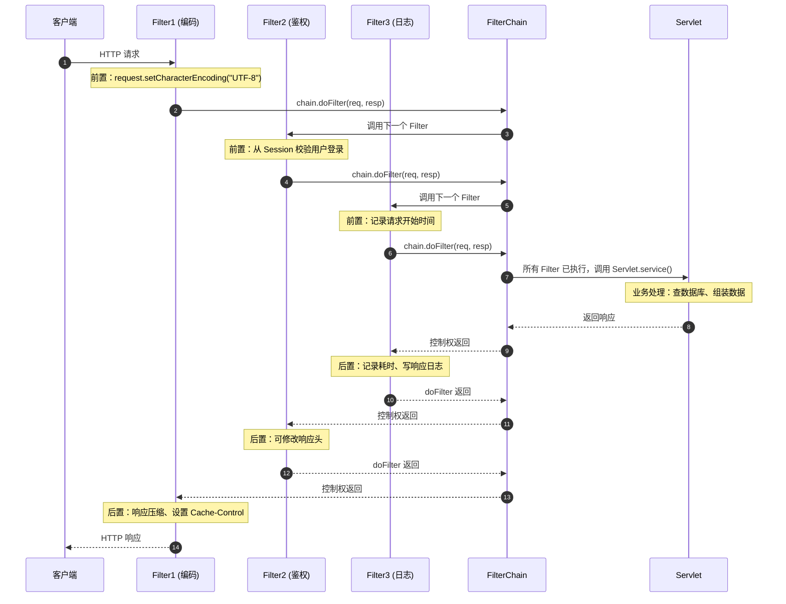

# Request 与 Response & Filter 监听器

> 学习路线对应：第2周 -- JavaWeb 基础
> 前置知识：Servlet 基础、HTTP 协议、Tomcat 架构
> 预计学习时间：1-2 天

## 一、核心概念

### 1.1 Filter 过滤器核心概念

| 维度 | 内容 |
|------|------|
| 是什么 | Filter 是 Servlet 规范中基于责任链模式的拦截组件，在请求到达 Servlet 之前和响应离开 Servlet 之后执行拦截处理 |
| 能做什么 | 统一编码处理；权限验证与登录检查；请求日志记录；敏感词过滤；响应压缩；跨域处理 |
| 怎么用 | 实现 `javax.servlet.Filter` 接口，覆写 init/doFilter/destroy 方法，通过 @WebFilter 注解或 web.xml 配置拦截路径 |
| 原理和工作流程 | Filter 在 Servlet 规范中定义，由 Servlet 容器管理生命周期。每个 Filter 实现 init(FilterConfig)、doFilter(ServletRequest, ServletResponse, FilterChain)、destroy() 三个方法。多个 Filter 按配置顺序组成 FilterChain（责任链），请求依次经过各 Filter 的 doFilter 前置逻辑，最终到达 Servlet，响应沿逆序经过各 Filter 的后置逻辑。Filter 可拦截所有请求包括静态资源，执行顺序在 web.xml 中按 filter-mapping 声明顺序，注解方式可通过 FilterRegistrationBean 或 @Order 控制 |
| 缺点 | @WebFilter 注解无法直接控制执行顺序；不依赖 Spring 容器获取 Bean 需 ApplicationContext；只能拦截请求粒度无法细到方法级别；责任链过长影响性能 |

> **生活化类比：Filter 就像地铁进站安检** —— Filter 的拦截机制与地铁进站安检非常相似：每位乘客（HTTP 请求）必须先经过安检（Filter 链）才能上车（到达 Servlet），出站时也要经过反向流程（响应逆序）。安检员可以查包（前置逻辑：权限校验、编码设置），可以拒绝放行（不调用 chain.doFilter 直接返回错误），可以放行后回头加行李标签（后置逻辑：响应压缩、添加响应头）。多名安检员组成流水线（FilterChain），每个人只检查一项——保安查身份证、X 光机查违禁品、人工开包查液体，分工明确。如果某位安检员忘了挥手放行（忘记调用 chain.doFilter），整条流水线就卡住了——这是 Filter 实战最常见的 Bug。

> 📖 **参考链接**：
> - [Servlet Specification - Filters](https://github.com/jakartaee/servlet-spec/wiki/Filters) -- Servlet Filter 规范
> - [Oracle - Filter Tutorial](https://docs.oracle.com/javaee/7/tutorial/servlets002.htm) -- Servlet Filter 官方教程

### 1.2 FilterChain 执行流程

| 维度 | 内容 |
|------|------|
| 是什么 | FilterChain 是 Filter 的有序集合，由 Servlet 容器构建，按顺序调用各 Filter 的 doFilter 方法，形成洋葱模型拦截链 |
| 能做什么 | 按配置顺序依次执行 Filter 前置逻辑；调用 chain.doFilter 放行到下一个 Filter 或 Servlet；在响应返回时逆序执行 Filter 后置逻辑 |
| 怎么用 | 在 doFilter 方法中调用 `chain.doFilter(request, response)` 放行，前置逻辑写在 doFilter 调用之前，后置逻辑写在之后 |
| 原理和工作流程 | FilterChain 由 Tomcat 的 ApplicationFilterChain 实现，内部维护 Filter 数组和当前位置指针。执行流程：1. 判断当前位置是否小于 Filter 数量，若是则取下一个 Filter 调用其 doFilter 方法。2. Filter 的 doFilter 方法中先执行前置逻辑（编码设置、权限校验），然后调用 chain.doFilter 将控制权交回 FilterChain。3. FilterChain 继续调用下一个 Filter，重复此过程。4. 所有 Filter 执行完毕后，FilterChain 调用目标 Servlet 的 service 方法。5. Servlet 处理完成后，调用栈逐层返回，各 Filter 的 doFilter 中 chain.doFilter 之后的代码执行后置逻辑。执行顺序：请求 Filter1 -> Filter2 -> Filter3 -> Servlet；响应 Servlet -> Filter3 -> Filter2 -> Filter1 |
| 缺点 | Filter 执行顺序依赖配置顺序易出错；chain.doFilter 忘记调用导致请求被拦截不继续；后置逻辑中 response 可能已被提交无法修改；FilterChain 构建依赖 URL 匹配规则 |

#### FilterChain 执行流程 Mermaid 图



> 这张时序图清晰呈现了 FilterChain 的"洋葱模型"——请求方向 Filter1→Filter2→Filter3→Servlet（从外到内），响应方向 Servlet→Filter3→Filter2→Filter1（从内到外）。每个 Filter 的 doFilter 方法被切成两半：chain.doFilter 之前是"进入时的前置处理"，之后是"出去时的后置处理"。这种"对称结构"让 Filter 非常适合做"请求/响应双向处理"——如编码设置（请求解码+响应编码）、日志（请求开始时间+响应耗时）、压缩（请求解压+响应压缩）。

> 📖 **参考链接**：
> - [Servlet Specification - Filter Chain](https://github.com/jakartaee/servlet-spec/wiki/Filters#filter-chains) -- Filter Chain 规范
> - [Tomcat - ApplicationFilterChain Source](https://github.com/apache/tomcat/blob/main/java/org/apache/catalina/core/ApplicationFilterChain.java) -- Tomcat 实现源码

### 1.3 Listener 监听器核心概念

| 维度 | 内容 |
|------|------|
| 是什么 | Listener 是 Servlet 规范中基于观察者模式的监听组件，监听 Web 应用中特定事件（应用启动、Session 创建、属性变更等）的发生并执行回调 |
| 能做什么 | 应用启动时初始化全局资源；统计在线人数；记录请求日志；监听 Session 和属性变更；加载全局配置 |
| 怎么用 | 实现对应的 Listener 接口（如 ServletContextListener），标注 @WebListener 注解或在 web.xml 中配置，容器自动注册并在事件发生时回调 |
| 原理和工作流程 | Listener 基于观察者模式，Servlet 容器在特定事件发生时遍历已注册的监听器并调用对应回调方法。主要监听器类型：ServletContextListener（应用启动/销毁时触发，用于初始化全局资源）、HttpSessionListener（Session 创建/销毁时触发，用于统计在线人数）、ServletRequestListener（请求创建/销毁时触发，用于请求日志）、ServletContextAttributeListener（应用作用域属性增删改）、HttpSessionAttributeListener（Session 属性增删改）、HttpSessionBindingListener（对象绑定到 Session 或从 Session 移除时触发，由实体类实现）、HttpSessionActivationListener（Session 钝化/活化时触发） |
| 缺点 | 监听器过多导致启动变慢；监听逻辑与容器生命周期耦合；无法精确控制事件传播；异步事件处理需额外机制 |

> **生活化类比：Listener 就像广播员与"事件订阅者"** —— Listener 的机制与广播站订阅完全对应：Servlet 容器是广播电台（事件源），它在特定时机发出广播（事件），比如"早上六点开机"（contextInitialized）、"新员工入职"（sessionCreated）、"员工办完事离岗"（requestDestroyed）。监听器是事先登记过的订阅者（@WebListener），它们听到广播后会做对应的事——比如统计员听到"新员工入职"就把计数器加一。其中 HttpSessionBindingListener 很特别，它是"被动监听"——实体类主动实现它，被放进 Session 时自己收到通知（"你被绑定了"），不像其他监听器那样由容器主动通知。

> 📖 **参考链接**：
> - [Servlet Specification - Event Listeners](https://github.com/jakartaee/servlet-spec/wiki/Event-Listeners) -- Servlet 事件监听器规范
> - [Oracle - Event Listener Tutorial](https://docs.oracle.com/javaee/7/tutorial/servlets004.htm) -- 监听器教程

### 1.4 Session 钝化与活化

| 维度 | 内容 |
|------|------|
| 是什么 | Session 钝化（Passivation）是将 Session 对象从内存序列化到磁盘的过程，活化（Activation）是将磁盘上的 Session 反序列化回内存的过程 |
| 能做什么 | 节省内存资源将不活跃的 Session 持久化到磁盘；服务器重启后恢复 Session 状态；实现 Session 跨服务器迁移 |
| 怎么用 | 实体类实现 Serializable 接口并实现 HttpSessionActivationListener；在 context.xml 中配置 Manager 的 maxIdleSwap 和 directory 参数 |
| 原理和工作流程 | Tomcat 的 PersistentManager 管理 Session 钝化与活化。当 Session 空闲时间超过 maxIdleSwap（默认 -1 不启用）时，Manager 将 Session 对象及其属性序列化到指定目录（directory 参数）。Session 中的属性对象必须实现 Serializable 接口，否则抛出 NotSerializableException。实现 HttpSessionActivationListener 接口的类在 Session 钝化前会收到 sessionWillPassivate 回调，活化后收到 sessionDidActivate 回调，可用于释放和重建不可序列化的资源（如数据库连接）。钝化到磁盘的 Session 文件在 Session 过期后被删除。分布式环境中 Session 钝化可用于跨服务器迁移 Session |
| 缺点 | 属性对象必须实现 Serializable 增加约束；钝化活化有 I/O 开销影响性能；不可序列化对象的释放和重建需自行处理；PersistentManager 配置复杂默认不启用 |

### 1.5 文件上传与下载

| 维度 | 内容 |
|------|------|
| 是什么 | 文件上传是客户端通过 multipart/form-data 编码将文件传输到服务端，文件下载是服务端将文件流写入响应输出流供客户端保存 |
| 能做什么 | 文件上传：接收客户端上传的文件保存到服务器或云存储；文件下载：将服务器文件以流方式返回客户端供下载 |
| 怎么用 | 上传：表单 `enctype="multipart/form-data"`，Servlet 3.0+ 使用 `@MultipartConfig` 和 `request.getPart("file")`；下载：设置 Content-Disposition 响应头，通过 `response.getOutputStream()` 写入文件流 |
| 原理和工作流程 | 文件上传：客户端表单设置 enctype="multipart/form-data"，浏览器将文件以二进制流编码在请求体中。Servlet 3.0+ 中在 Servlet 类上标注 @MultipartConfig 注解（可配置 maxFileSize、maxRequestSize、location），通过 request.getPart("file") 获取 Part 对象，调用 part.write(fileName) 或 part.getInputStream() 保存文件。Servlet 2.5 及之前需使用 Apache Commons FileUpload 库。文件下载：设置 Content-Type 为 application/octet-stream 或具体 MIME 类型，设置 Content-Disposition 为 `attachment; filename="xxx"` 触发浏览器下载对话框，通过 response.getOutputStream() 将文件字节流写入响应体，注意设置 Content-Length 头 |
| 缺点 | 大文件上传占用内存和带宽需分片上传；文件类型和安全校验需自行实现；下载大文件需流式处理避免内存溢出；中文文件名需 URLEncoder 编码处理浏览器兼容性 |

### 1.6 中文乱码处理

| 维度 | 内容 |
|------|------|
| 是什么 | 中文乱码是由于字符编码不一致导致的显示问题，涉及请求参数编码、响应编码、页面编码、数据库编码等多个环节 |
| 能做什么 | 解决 GET 请求参数乱码；解决 POST 请求体乱码；统一响应编码；确保页面和数据库编码一致 |
| 怎么用 | GET 乱码：Tomcat 配置 `URIEncoding="UTF-8"`；POST 乱码：`request.setCharacterEncoding("UTF-8")`；响应：`response.setContentType("text/html;charset=UTF-8")` |
| 原理和工作流程 | 乱码根本原因：字符在不同环节使用不同编码方式导致解码错误。GET 请求参数乱码：Tomcat 默认使用 ISO-8859-1 解码 URL 参数，中文参数被错误解码。解决方案：在 server.xml 的 Connector 中配置 URIEncoding="UTF-8"（Spring Boot 默认已为 UTF-8），或使用 URLEncoder.encode 编码参数。POST 请求体乱码：未设置请求体编码时默认使用 ISO-8859-1 解码。解决方案：在 doPost 第一行调用 request.setCharacterEncoding("UTF-8")，或使用 EncodingFilter 统一设置。响应乱码：设置 response.setCharacterEncoding("UTF-8") 和 response.setContentType("text/html;charset=UTF-8")。数据库乱码：在 JDBC URL 中指定 characterEncoding=UTF-8 |
| 缺点 | 乱码问题场景多样需逐一排查编码环节；各服务器默认编码设置不一致；需要同时配置多个编码点；历史代码中编码处理不统一 |

---

## 二、底层原理

### 2.1 Filter 责任链底层实现

| 维度 | 内容 |
|------|------|
| 是什么 | Filter 责任链由 Tomcat 的 ApplicationFilterChain 类实现，内部维护 Filter 数组和索引指针，通过递归式调用实现链式拦截 |
| 能做什么 | 按配置顺序构建 Filter 执行链；通过索引指针控制 Filter 的执行顺序；在 Filter 前后分别执行前置和后置逻辑 |
| 怎么用 | ApplicationFilterChain 内部维护 `private Filter[] filters` 和 `private int pos`，通过 internalDoFilter 方法递归调用 |
| 原理和工作流程 | ApplicationFilterChain 核心实现：1. 构建阶段：StandardWrapperValve 在分配 Servlet 实例后，根据请求 URL 匹配所有适用的 Filter，按顺序创建 Filter 数组，并设置目标 Servlet。2. 执行阶段：调用 ApplicationFilterChain.doFilter 方法，该方法调用 internalDoFilter。internalDoFilter 判断 pos 是否小于 filters.length，若是则取 filters[pos++] 调用其 doFilter 方法。Filter 的 doFilter 中调用 chain.doFilter 时，再次进入 internalDoFilter，取出下一个 Filter，形成递归调用。当 pos 等于 filters.length 时，所有 Filter 已执行完毕，调用 servlet.service 方法处理请求。3. 当 servlet.service 返回后，递归调用栈逐层返回，各 Filter 的 doFilter 中 chain.doFilter 之后的代码执行后置逻辑 |
| 缺点 | 递归调用链过长可能导致栈溢出；Filter 执行顺序依赖数组构建顺序；后置逻辑中 response 可能已被提交；缺少异常处理机制需在 Filter 中捕获 |

### 2.2 Request 门面模式

| 维度 | 内容 |
|------|------|
| 是什么 | Tomcat 使用门面模式（Facade Pattern），通过 RequestFacade 和 ResponseFacade 包装内部 Request/Response 对象，限制应用程序只能访问 Servlet API 规范定义的方法 |
| 能做什么 | 防止应用程序直接访问 Tomcat 内部 API；确保 Servlet 规范的一致性；隐藏内部实现细节 |
| 怎么用 | 应用程序接收到的 HttpServletRequest 实际类型是 RequestFacade，内部持有 org.apache.catalina.connector.Request 引用 |
| 原理和工作流程 | Tomcat 内部使用 org.apache.catalina.connector.Request（继承 HttpServletRequest）处理请求，该对象包含大量 Tomcat 内部方法（如 getConnector、getContext 等）。如果直接暴露给应用程序，应用程序可能依赖 Tomcat 内部 API 导致无法移植到其他容器。CoyoteAdapter 在适配请求时，创建 RequestFacade 包装内部 Request 对象，RequestFacade 仅暴露 Servlet 规范定义的公共方法，对内部方法调用返回 UnsupportedOperationException 或 null。ResponseFacade 同理包装内部 Response 对象。门面模式实现了容器与应用程序的解耦 |
| 缺点 | 限制了应用程序对底层能力的访问；门面包装增加了一次间接调用；调试时无法直接查看内部对象状态；需要反射才能绕过门面限制 |

### 2.3 Listener 的事件驱动模型

| 维度 | 内容 |
|------|------|
| 是什么 | Listener 基于观察者模式，Servlet 容器作为事件源在特定时机触发事件，已注册的监听器作为观察者接收事件并执行回调 |
| 能做什么 | 应用启动时触发 ServletContextEvent；Session 创建时触发 HttpSessionEvent；请求到达时触发 ServletRequestEvent；属性变更时触发对应事件 |
| 怎么用 | 实现对应监听器接口并标注 @WebListener，容器自动注册并在事件发生时回调 |
| 原理和工作流程 | Servlet 规范定义了 8 种监听器接口和对应的事件类型。ServletContextListener 监听 ServletContextEvent（应用启动/销毁）。HttpSessionListener 监听 HttpSessionEvent（Session 创建/销毁）。ServletRequestListener 监听 ServletRequestEvent（请求初始化/销毁）。属性监听器（ServletContextAttributeListener、HttpSessionAttributeListener、ServletRequestAttributeListener）监听属性增删改事件。对象绑定监听器（HttpSessionBindingListener、HttpSessionActivationListener）由实体类实现，在对象绑定/解绑或钝化/活化时触发。容器在启动时扫描所有 @WebListener 注解的类并实例化注册。事件发生时容器遍历所有注册的监听器，调用对应的回调方法。监听器执行顺序不保证，不应依赖监听器执行顺序 |
| 缺点 | 监听器执行顺序不可控；监听器异常可能影响应用启动和请求处理；监听器数量多导致启动时间增加；事件类型有限无法自定义事件 |

---

## 三、实战应用

### 3.1 Filter 实现统一编码与权限校验

| 维度 | 内容 |
|------|------|
| 是什么 | 通过 Filter 实现统一编码设置和登录权限校验的完整实战示例 |
| 能做什么 | 统一设置请求和响应编码；校验用户登录状态；放行白名单路径（登录页、静态资源）；未登录用户重定向到登录页 |
| 怎么用 | `@WebFilter(urlPatterns = "/*") public class AuthFilter implements Filter { doFilter 中判断路径和 Session 中用户信息决定放行或重定向 }` |
| 原理和工作流程 | 创建 AuthFilter 实现 Filter 接口，init 方法中初始化白名单路径列表（如 /login、/register、/static/、.css、.js 等）。doFilter 方法中：1. 设置 request.setCharacterEncoding("UTF-8") 和 response.setContentType("application/json;charset=UTF-8")。2. 获取请求路径，判断是否在白名单中，若是则直接 chain.doFilter 放行。3. 从 Session 中获取登录用户信息，若不为空则放行。4. 若未登录且不在白名单，判断是否为 AJAX 请求（检查 X-Requested-With 头），若是则返回 JSON 格式的 401 错误，否则重定向到登录页。destroy 方法清理资源。注意 Filter 执行顺序：编码 Filter 应放在权限 Filter 之前 |
| 缺点 | 白名单路径硬编码维护不便；Session 校验依赖 Cookie 禁用后失效；静态资源拦截增加性能开销；AJAX 和页面请求的未登录处理需区分 |

#### Filter 链完整代码示例

下面给出一个真实可用的 Filter 链示例，包含 EncodingFilter、AuthFilter、LogFilter 三个 Filter，演示如何在 Spring Boot 项目中通过 FilterRegistrationBean 控制执行顺序：

```java
// 1. 编码 Filter：统一设置请求与响应编码
public class EncodingFilter implements Filter {
    @Override
    public void doFilter(ServletRequest request, ServletResponse response,
                         FilterChain chain) throws IOException, ServletException {
        request.setCharacterEncoding("UTF-8");
        response.setCharacterEncoding("UTF-8");
        response.setContentType("application/json;charset=UTF-8");
        chain.doFilter(request, response);   // 放行
    }
}

// 2. 鉴权 Filter：校验 Session 中的登录用户
public class AuthFilter implements Filter {
    private static final List<String> WHITELIST =
        Arrays.asList("/login", "/register", "/static/");

    @Override
    public void doFilter(ServletRequest request, ServletResponse response,
                         FilterChain chain) throws IOException, ServletException {
        HttpServletRequest req = (HttpServletRequest) request;
        HttpServletResponse resp = (HttpServletResponse) response;
        String path = req.getRequestURI();

        // 白名单直接放行
        if (WHITELIST.stream().anyMatch(path::startsWith)) {
            chain.doFilter(request, response);
            return;
        }

        // 校验 Session 中的登录用户
        Object user = req.getSession().getAttribute("user");
        if (user == null) {
            // AJAX 请求返回 JSON，否则重定向登录页
            if ("XMLHttpRequest".equals(req.getHeader("X-Requested-With"))) {
                resp.setStatus(HttpServletResponse.SC_UNAUTHORIZED);
                resp.getWriter().write("{\"code\":401,\"msg\":\"请先登录\"}");
            } else {
                resp.sendRedirect("/login");
            }
            return;   // 不调用 chain.doFilter，请求终止
        }
        chain.doFilter(request, response);
    }
}

// 3. 日志 Filter：记录请求耗时与响应状态
public class LogFilter implements Filter {
    @Override
    public void doFilter(ServletRequest request, ServletResponse response,
                         FilterChain chain) throws IOException, ServletException {
        HttpServletRequest req = (HttpServletRequest) request;
        long start = System.currentTimeMillis();
        try {
            chain.doFilter(request, response);
        } finally {
            long cost = System.currentTimeMillis() - start;
            HttpServletResponse resp = (HttpServletResponse) response;
            System.out.printf("[LOG] %s %s -> %d (%dms)%n",
                req.getMethod(), req.getRequestURI(), resp.getStatus(), cost);
        }
    }
}

// 4. Spring Boot 中注册并控制执行顺序（数值小的先执行）
@Configuration
public class FilterConfig {
    @Bean
    public FilterRegistrationBean<EncodingFilter> encodingFilter() {
        FilterRegistrationBean<EncodingFilter> bean = new FilterRegistrationBean<>();
        bean.setFilter(new EncodingFilter());
        bean.addUrlPatterns("/*");
        bean.setOrder(1);            // 最先执行
        return bean;
    }
    @Bean
    public FilterRegistrationBean<AuthFilter> authFilter() {
        FilterRegistrationBean<AuthFilter> bean = new FilterRegistrationBean<>();
        bean.setFilter(new AuthFilter());
        bean.addUrlPatterns("/*");
        bean.setOrder(2);            // 编码之后
        return bean;
    }
    @Bean
    public FilterRegistrationBean<LogFilter> logFilter() {
        FilterRegistrationBean<LogFilter> bean = new FilterRegistrationBean<>();
        bean.setFilter(new LogFilter());
        bean.addUrlPatterns("/*");
        bean.setOrder(3);            // 最后执行
        return bean;
    }
}
```

> 这个完整示例展示了三个关键点：第一，每个 Filter 的 doFilter 方法严格遵循"前置逻辑 → chain.doFilter → 后置逻辑"的对称结构，缺一不可；第二，AuthFilter 中未登录场景必须 return 而不调用 chain.doFilter，请求才会被"短路"返回；第三，Spring Boot 下用 `FilterRegistrationBean.setOrder()` 控制执行顺序，order 数值小的先执行——这与 `@Order` 注解的语义一致。

> 📖 **参考链接**：
> - [Spring Boot - Filter Registration](https://docs.spring.io/spring-boot/docs/current/reference/htmlsingle/#web.servlet.spring-mvc.filters) -- Spring Boot Filter 注册
> - [Spring - FilterRegistrationBean](https://docs.spring.io/spring-framework/docs/current/javadoc-api/org/springframework/web/filter/FilterRegistrationBean.html) -- FilterRegistrationBean API

### 3.2 Listener 实现应用启动初始化与在线人数统计

| 维度 | 内容 |
|------|------|
| 是什么 | 通过 ServletContextListener 和 HttpSessionListener 实现应用启动时加载全局配置和统计在线人数 |
| 能做什么 | 应用启动时加载配置文件存入 ServletContext；Session 创建时在线人数加一；Session 销毁时在线人数减一；提供获取在线人数的方法 |
| 怎么用 | `@WebListener public class AppListener implements ServletContextListener, HttpSessionListener { contextInitialized 加载配置；sessionCreated 人数+1；sessionDestroyed 人数-1 }` |
| 原理和工作流程 | AppListener 同时实现 ServletContextListener 和 HttpSessionListener 两个接口。contextInitialized 方法在应用启动时由容器回调，读取 /WEB-INF/config.properties 配置文件，将 Properties 对象存入 ServletContext 的 Attribute 中供全局使用。同时初始化在线人数计数器 AtomicInteger 存入 ServletContext。sessionCreated 方法在每次新 Session 创建时调用，AtomicInteger 加一。sessionDestroyed 方法在 Session 过期或主动销毁时调用，AtomicInteger 减一。注意 Session 销毁可能发生在超时后，不一定是用户主动登出时。统计在线人数只是近似值，不适合精确计费场景 |
| 缺点 | Session 超时销毁有延迟导致在线人数不精确；AtomicInteger 在分布式环境无法跨节点共享；监听器异常导致启动失败；配置文件路径硬编码不灵活 |

#### Listener 实战代码示例

下面给出 AppListener 的完整实现，演示如何在一个监听器中同时实现应用启动初始化与在线人数统计：

```java
@WebListener
public class AppListener implements ServletContextListener, HttpSessionListener {

    private static final Logger log = LoggerFactory.getLogger(AppListener.class);
    private AtomicInteger onlineCount;

    @Override
    public void contextInitialized(ServletContextEvent sce) {
        ServletContext ctx = sce.getServletContext();
        log.info("[Listener] 应用启动，开始加载全局配置...");

        // 1. 加载 /WEB-INF/config.properties 配置文件
        Properties props = new Properties();
        try (InputStream in = ctx.getResourceAsStream("/WEB-INF/config.properties")) {
            if (in != null) {
                props.load(in);
                ctx.setAttribute("appConfig", props);     // 全局共享
                log.info("[Listener] 配置加载完成，共 {} 项", props.size());
            }
        } catch (IOException e) {
            // 注意：监听器异常会导致应用启动失败，必须 try-catch
            log.error("[Listener] 配置加载失败", e);
        }

        // 2. 初始化在线人数计数器
        onlineCount = new AtomicInteger(0);
        ctx.setAttribute("onlineCount", onlineCount);
        log.info("[Listener] 应用启动完成");
    }

    @Override
    public void sessionCreated(HttpSessionEvent se) {
        int current = onlineCount.incrementAndGet();
        log.info("[Listener] Session 创建：{}，当前在线人数：{}",
            se.getSession().getId(), current);
    }

    @Override
    public void sessionDestroyed(HttpSessionEvent se) {
        int current = onlineCount.decrementAndGet();
        log.info("[Listener] Session 销毁：{}，当前在线人数：{}",
            se.getSession().getId(), current);
    }

    @Override
    public void contextDestroyed(ServletContextEvent sce) {
        log.info("[Listener] 应用销毁，清理资源");
        // 主动释放数据库连接池、关闭线程池等
    }
}
```

监听器实战要点：

- 监听器异常处理：`contextInitialized` 中的异常会导致应用启动失败，必须用 try-catch 包裹可能失败的操作（文件读取、网络连接等）。
- 线程安全：`onlineCount` 必须用 `AtomicInteger` 而非 `int`，因为 Session 创建与销毁可能并发发生。
- 分布式场景：`AtomicInteger` 只在单节点有效，集群环境需要改用 Redis 计数器，可通过 RedisTemplate 的 `increment/decrement` 实现。
- 性能注意：`sessionCreated/sessionDestroyed` 在高并发登录场景会被频繁调用，回调中不要做耗时操作（如查数据库）。

> 📖 **参考链接**：
> - [Servlet Specification - Listener Registration](https://github.com/jakartaee/servlet-spec/wiki/Event-Listeners) -- Listener 注册机制
> - [Tomcat - Listener Configuration](https://tomcat.apache.org/tomcat-10.1-doc/config/listeners.html) -- Tomcat Listener 配置

### 3.3 文件上传与下载完整实现

| 维度 | 内容 |
|------|------|
| 是什么 | 基于 Servlet 3.0+ @MultipartConfig 实现文件上传和基于流式输出实现文件下载的完整实战 |
| 能做什么 | 接收客户端上传的文件保存到服务器；从服务器读取文件以流方式返回客户端下载；处理中文文件名和防止路径穿越 |
| 怎么用 | 上传：`@MultipartConfig(maxFileSize=10*1024*1024) @WebServlet("/upload") doPost 中 request.getPart("file").write(savePath + fileName)`；下载：`@WebServlet("/download") doGet 中设置 Content-Disposition 头，FileInputStream 写入 response.getOutputStream()` |
| 原理和工作流程 | 文件上传：在 Servlet 上标注 @MultipartConfig 配置 maxFileSize（单个文件大小限制）、maxRequestSize（总请求大小限制）、fileSizeThreshold（内存缓存阈值）。doPost 方法中通过 request.getPart("file") 获取上传文件对应的 Part 对象，通过 part.getSubmittedFileName() 获取原始文件名，通过 part.getSize() 获取文件大小，通过 part.getContentType() 获取 MIME 类型。使用 UUID 重命名文件防止冲突，通过 part.write(savePath) 保存到磁盘。文件下载：通过 request.getParameter("filename") 获取要下载的文件名，进行路径穿越校验（防止 ../../etc/passwd），拼接完整文件路径。设置 Content-Type 为 application/octet-stream，设置 Content-Disposition 为 `attachment; filename*=UTF-8''urlEncodedFileName` 支持中文文件名。使用 FileInputStream 循环读取文件字节写入 response.getOutputStream()，最后关闭流 |
| 缺点 | 大文件上传需分片上传和断点续传；文件类型校验需自行实现；下载大文件内存占用高需流式处理；中文文件名在不同浏览器编码处理不同 |

### 3.4 中文乱码统一解决方案

| 维度 | 内容 |
|------|------|
| 是什么 | 通过 Tomcat 配置、EncodingFilter、页面编码设置、数据库连接编码四层统一解决中文乱码问题的完整方案 |
| 能做什么 | 解决 GET 请求 URL 参数乱码；解决 POST 请求体乱码；确保响应不乱码；确保数据库读写不乱码 |
| 怎么用 | Tomcat：`URIEncoding="UTF-8"`；Filter：`request.setCharacterEncoding("UTF-8")`；页面：`<%@ page contentType="text/html;charset=UTF-8" %>`；数据库：`jdbc:mysql://...?characterEncoding=utf-8` |
| 原理和工作流程 | 完整的乱码解决方案需覆盖四个环节：1. Tomcat 层面：在 server.xml 的 Connector 中配置 URIEncoding="UTF-8" 解决 GET 请求 URL 参数解码问题。Spring Boot 内嵌 Tomcat 默认已设置 UTF-8，可通过 server.tomcat.uri-encoding 配置。2. Filter 层面：创建 EncodingFilter 设置 request.setCharacterEncoding("UTF-8") 解决 POST 请求体解码，设置 response.setCharacterEncoding("UTF-8") 和 response.setContentType("text/html;charset=UTF-8") 解决响应编码。3. 页面层面：JSP 页面设置 `<%@ page contentType="text/html;charset=UTF-8" pageEncoding="UTF-8" %>`，HTML 页面设置 `<meta charset="UTF-8">`。4. 数据库层面：JDBC URL 中添加 characterEncoding=utf-8 和 useUnicode=true 参数，MySQL 数据库和表设置 utf8mb4 字符集 |
| 缺点 | 需要同时配置多个环节遗漏一处即乱码；各服务器默认编码设置不一致；历史代码编码处理不统一；UTF-8 与 GBK 混用增加排查难度 |

---

## 四、常见面试题

### 1. Filter 过滤器的工作原理和生命周期？

| 维度 | 内容 |
|------|------|
| 是什么 | Filter 基于责任链模式在请求到达 Servlet 前后执行拦截，生命周期包括 init/doFilter/destroy 三个阶段 |
| 能做什么 | 统一编码处理；权限验证；请求日志；敏感词过滤；响应压缩；跨域处理 |
| 怎么用 | 实现 Filter 接口，覆写 init/doFilter/destroy，通过 @WebFilter 注解或 web.xml 配置拦截路径 |
| 原理和工作流程 | Filter 生命周期：init(FilterConfig) 在容器启动时调用一次，获取 FilterConfig 读取初始化参数。doFilter 在每次匹配的请求中调用，先执行前置逻辑（编码设置、权限校验），然后调用 chain.doFilter 放行，在 Servlet 处理完成后执行后置逻辑（响应处理）。destroy 在容器关闭时调用一次释放资源。多个 Filter 按配置顺序组成 FilterChain，请求按顺序经过各 Filter 前置逻辑，到达 Servlet 后逆序经过各 Filter 后置逻辑，形成洋葱模型 |
| 缺点 | 注解方式无法控制执行顺序需额外配置；不依赖 Spring 容器获取 Bean 困难；只能拦截请求粒度无法细到方法；责任链过长影响性能 |

### 2. Filter 和 Interceptor（拦截器）的区别？

| 维度 | 内容 |
|------|------|
| 是什么 | Filter 是 Servlet 规范组件由 Servlet 容器管理，Interceptor 是 Spring 框架组件由 Spring 容器管理，二者在规范、依赖、执行范围、执行顺序上不同 |
| 能做什么 | Filter 拦截所有请求含静态资源；Interceptor 只拦截 Controller 请求可注入 Spring Bean |
| 怎么用 | Filter：`implements javax.servlet.Filter`；Interceptor：`implements HandlerInterceptor` 注册到 WebMvcConfigurer |
| 原理和工作流程 | Filter 是 Servlet 规范组件，由 Servlet 容器管理，作用于所有请求含静态资源，在请求进入 Servlet 前后执行，不依赖 Spring 容器获取 Bean 需 ApplicationContext。Interceptor 是 Spring 框架组件，由 Spring 容器管理，仅作用于 Spring MVC 处理的 Controller 请求，在 Controller 方法前后和视图渲染后执行（preHandle/postHandle/afterCompletion），可直接注入 Bean。执行顺序：Filter -> Interceptor -> Controller。Filter 粒度粗拦截所有请求，Interceptor 粒度细只拦 Controller。Filter 基于函数回调，Interceptor 基于 AOP 和反射 |
| 缺点 | Filter 获取 Spring Bean 困难；Interceptor 无法拦截非 Controller 请求；二者执行顺序混合时排查复杂；Filter 与 Interceptor 职责重叠易混淆 |

### 3. Servlet 中 Listener 监听器有哪些？各有什么作用？

| 维度 | 内容 |
|------|------|
| 是什么 | Listener 是 Servlet 规范中基于观察者模式的监听组件，共 8 种接口，分为三类：生命周期监听、属性变更监听、对象绑定监听 |
| 能做什么 | 监听应用启动/销毁初始化全局资源；监听 Session 创建/销毁统计在线人数；监听请求创建/销毁记录日志；监听属性变更；监听对象绑定/钝化/活化 |
| 怎么用 | 实现对应接口并标注 @WebListener，容器自动注册并在事件发生时回调 |
| 原理和工作流程 | 三大类八种监听器：1. 生命周期监听器 -- ServletContextListener（应用启动 contextInitialized / 销毁 contextDestroyed）、HttpSessionListener（Session 创建 sessionCreated / 销毁 sessionDestroyed）、ServletRequestListener（请求初始化 requestInitialized / 销毁 requestDestroyed）。2. 属性变更监听器 -- ServletContextAttributeListener（属性增删改）、HttpSessionAttributeListener（属性增删改）、ServletRequestAttributeListener（属性增删改）。3. 对象绑定监听器 -- HttpSessionBindingListener（对象绑定到 Session valueBound / 解绑 valueUnbound，由实体类实现）、HttpSessionActivationListener（Session 钝化 sessionWillPassivate / 活化 sessionDidActivate，由实体类实现）。容器在特定事件发生时遍历已注册的监听器并调用回调方法 |
| 缺点 | 监听器执行顺序不可控；监听器异常可能影响应用启动；监听器数量多导致启动时间增加；事件类型有限无法自定义 |

### 4. 什么是 Session 钝化和活化？如何实现？

| 维度 | 内容 |
|------|------|
| 是什么 | Session 钝化是将不活跃的 Session 从内存序列化到磁盘，活化是将磁盘上的 Session 反序列化回内存，用于节省内存和实现 Session 迁移 |
| 能做什么 | 节省内存资源；服务器重启后恢复 Session；实现 Session 跨服务器迁移 |
| 怎么用 | 实体类实现 Serializable 和 HttpSessionActivationListener；在 context.xml 中配置 PersistentManager 的 maxIdleSwap 和 directory |
| 原理和工作流程 | Tomcat 的 PersistentManager 管理 Session 钝化与活化。当 Session 空闲时间超过 maxIdleSwap 时，Manager 将 Session 对象及其属性序列化到指定目录。Session 属性对象必须实现 Serializable 接口，否则抛出 NotSerializableException。实现 HttpSessionActivationListener 接口的类在钝化前收到 sessionWillPassivate 回调（释放不可序列化资源），活化后收到 sessionDidActivate 回调（重建资源）。配置方式：在 context.xml 的 Context 元素内配置 Manager 元素，如 `<Manager className="org.apache.catalina.session.PersistentManager" maxIdleSwap="60"><Store className="org.apache.catalina.session.FileStore" directory="sessions"/></Manager>` |
| 缺点 | 属性对象必须实现 Serializable 增加约束；钝化活化有 I/O 开销影响性能；不可序列化对象的释放和重建需自行处理；PersistentManager 默认不启用需手动配置 |

### 5. 文件上传时如何防止文件过大和类型安全问题？

| 维度 | 内容 |
|------|------|
| 是什么 | 文件上传安全防护包括限制文件大小、校验文件类型、防止路径穿越、重命名文件等综合措施 |
| 能做什么 | 限制单个文件和总请求大小；校验文件 MIME 类型和扩展名；防止路径穿越攻击；使用 UUID 重命名文件 |
| 怎么用 | @MultipartConfig 配置 maxFileSize 和 maxRequestSize；通过 part.getContentType() 获取 MIME 类型校验；通过 MultipartFile 的 getOriginalFilename 校验扩展名；使用 UUID.randomUUID() 重命名 |
| 原理和工作流程 | 大小限制：在 @MultipartConfig 中配置 maxFileSize（单个文件最大字节数）和 maxRequestSize（整个请求最大字节数），超出时容器抛出 SizeLimitExceededException。类型校验：通过 part.getContentType() 获取 MIME 类型（如 image/png），与白名单对比。注意 MIME 类型来自客户端可被伪造，需结合文件头魔数（Magic Number）校验。扩展名校验：通过 part.getSubmittedFileName() 获取原始文件名，提取扩展名与白名单对比。路径穿越防护：文件名中可能包含 ../ 等路径穿越字符，应过滤掉路径分隔符，仅保留文件名部分。重命名：使用 UUID.randomUUID().toString() 生成唯一文件名，保留原始扩展名，防止文件名冲突和恶意文件名 |
| 缺点 | MIME 类型可被伪造需结合魔数校验；大文件上传需分片上传和断点续传；文件类型白名单维护成本高；文件存储路径规划需考虑磁盘空间和备份 |

---

## 五、避坑指南

| 维度 | 内容 |
|------|------|
| 是什么 | Filter、Listener、文件上传下载、中文乱码相关的常见错误与陷阱汇总 |
| 能做什么 | 解决 Filter 执行顺序问题；避免 Listener 异常影响应用；处理文件上传路径穿越；统一解决中文乱码 |
| 怎么用 | Filter 顺序用 FilterRegistrationBean 控制；Listener 异常用 try-catch 包裹；文件名过滤路径穿越字符；四层编码方案统一解决乱码 |
| 原理和工作流程 | Filter 执行顺序：@WebFilter 注解无法控制顺序，多个 Filter 需使用 FilterRegistrationBean 注册并设置 setOrder()。Listener 异常：contextInitialized 中异常会导致应用启动失败，需在 Listener 中用 try-catch 包裹异常处理逻辑。文件上传路径穿越：攻击者可能上传 `../../etc/passwd` 文件名，需过滤 `../` 和 `..\\` 等字符，仅保留纯文件名。中文乱码：需同时覆盖 Tomcat URIEncoding、request.setCharacterEncoding、response.setContentType、页面 charset、数据库 characterEncoding 五个环节。文件下载中文文件名：使用 `filename*=UTF-8''urlEncodedFileName` 格式设置 Content-Disposition 头以兼容各浏览器 |
| 缺点 | Filter 顺序控制增加配置复杂度；Listener 异常处理需逐个包裹；文件上传安全校验需覆盖多个维度；中文乱码需同时配置多个环节遗漏一处即乱码 |

---

> **学习导航**：
> - 返回 [学习路线总览](../../README.md)
> - 本模块其他文件：[01-JavaWeb核心与HTTP协议](./01-JavaWeb核心与HTTP协议.md) | [02-Servlet与Tomcat底层](./02-Servlet与Tomcat底层.md) | [JavaWeb笔面试题集](./JavaWeb笔面试题集.md)