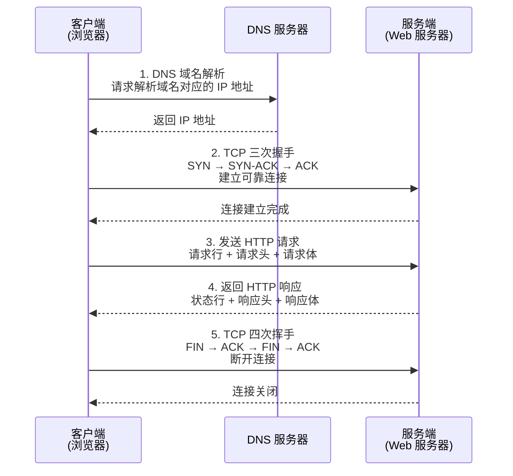

# JavaWeb 笔面试题集

> 适用岗位：后端开发工程师 / Java 开发工程师
> 覆盖范围：HTTP 协议 · Servlet · Tomcat · Filter · Listener · Session/Cookie · 编码与安全
> 题量：20 道选择题 + 15 道简答题 + 3 道场景设计题
> 难度标注：★ 基础 / ★★ 中档 / ★★★ 拔高

---

## 第一部分：选择题（共 20 题）

---

**从浏览器输入 URL 到页面渲染的完整网络通信时序图：**

> 上图展示了从浏览器输入 URL 到页面渲染的完整网络通信时序：首先通过 DNS 解析域名获取 IP 地址，然后通过 TCP 三次握手建立可靠连接，接着发送 HTTP 请求并接收响应，最后通过四次挥手断开连接。理解这一流程是排查网络问题和优化页面加载性能的基础。

### 1. ★ HTTP 协议中，以下哪个状态码表示"请求成功"？

A. 200
B. 301
C. 404
D. 500

**答案：A**

| 维度 | 内容 |
|------|------|
| 是什么 | 考查 HTTP 状态码 2xx 成功类别中 200 OK 的含义 |
| 能做什么 | 200 表示请求成功服务端正常返回数据；301 永久重定向；404 资源不存在；500 服务器内部错误 |
| 怎么用 | 服务端处理成功时设置 `resp.setStatus(200)`，客户端根据状态码决定后续处理逻辑 |
| 原理和工作流程 | 200 属于 2xx 成功类状态码，表示服务端已成功处理请求并返回响应体。301 属于 3xx 重定向类，浏览器会缓存新地址。404 属于 4xx 客户端错误类，表示请求的资源不存在。500 属于 5xx 服务端错误类，表示服务器内部异常 |
| 缺点 | 状态码语义有限，无法精确表达业务级别的成功或失败细节 |

---

### 2. ★ 以下哪项不是 HTTP 请求报文的一部分？

A. 请求行
B. 请求头
C. 状态码
D. 请求体

**答案：C**

| 维度 | 内容 |
|------|------|
| 是什么 | 考查 HTTP 请求报文与响应报文的结构区别，状态码属于响应报文而非请求报文 |
| 能做什么 | 请求报文由请求行（方法+URL+协议版本）、请求头（键值对元信息）、空行、请求体组成；状态码属于响应状态行 |
| 怎么用 | 客户端构造请求报文发送给服务端，服务端解析请求报文后返回包含状态码的响应报文 |
| 原理和工作流程 | HTTP 请求报文结构：请求行（GET /api/user HTTP/1.1）+ 请求头（Host、Content-Type 等）+ 空行 + 请求体。HTTP 响应报文结构：状态行（HTTP/1.1 200 OK）+ 响应头 + 空行 + 响应体。状态码仅出现在响应报文中，表示服务端处理结果 |
| 缺点 | 请求报文结构固定，GET 请求通常无请求体，部分代理和防火墙会修改请求头 |

---

### 3. ★ 用户在浏览器地址栏输入 URL 并回车，浏览器默认发送的 HTTP 请求方法是？

A. POST
B. GET
C. PUT
D. DELETE

**答案：B**

| 维度 | 内容 |
|------|------|
| 是什么 | 考查浏览器地址栏输入 URL 访问时默认使用的 HTTP 请求方法 |
| 能做什么 | GET 用于获取资源，是浏览器地址栏访问、超链接点击、表单 method="get" 时的默认方法 |
| 怎么用 | 地址栏输入 URL 回车即发送 GET 请求，参数可通过 URL 查询字符串传递 |
| 原理和工作流程 | 浏览器地址栏输入 URL 后，浏览器解析 URL 构造 GET 请求报文，通过 DNS 解析域名获取 IP，建立 TCP 连接后发送请求。GET 请求参数通过 URL 查询字符串传递，可被浏览器缓存和历史记录保存。POST 需要表单提交或 AJAX 指定，PUT 和 DELETE 需要程序显式指定 |
| 缺点 | GET 请求参数暴露在 URL 不安全且长度受限；浏览器历史记录会保存 URL 含敏感参数 |

---

### 4. ★ Servlet 规范中，HttpServlet 的 doGet 和 doPost 方法默认行为是？

A. 返回 200 OK
B. 返回 405 Method Not Allowed
C. 抛出异常
D. 调用 doService 方法

**答案：B**

| 维度 | 内容 |
|------|------|
| 是什么 | 考查 HttpServlet 中 doGet 和 doPost 方法的默认实现行为 |
| 能做什么 | 默认返回 405 错误提示客户端该 HTTP 方法不被支持，开发者需显式覆写对应方法 |
| 怎么用 | 继承 HttpServlet 后必须覆写 doGet 或 doPost，否则 GET 请求收到 405 错误 |
| 原理和工作流程 | HttpServlet 的 service 方法根据 request.getMethod() 分发到 doGet/doPost/doPut/doDelete 等。这些 doXxx 方法的默认实现是调用 sendMethodNotAllowed 设置 405 状态码并返回错误信息。开发者必须覆写所需的方法才能正常处理请求 |
| 缺点 | 默认返回 405 不友好，未覆写方法时错误信息不明确；新手容易忘记覆写导致接口不可用 |

---

### 5. ★ Tomcat 默认的 HTTP 监听端口是？

A. 80
B. 443
C. 8080
D. 8443

**答案：C**

| 维度 | 内容 |
|------|------|
| 是什么 | 考查 Tomcat 默认 HTTP 监听端口号 |
| 能做什么 | 8080 是 Tomcat 默认 HTTP 端口，8443 是默认 HTTPS 端口，80 和 443 分别是 HTTP 和 HTTPS 标准端口 |
| 怎么用 | 在 server.xml 的 Connector 元素中配置 port 属性，默认 8080，可在 Spring Boot 中通过 server.port 修改 |
| 原理和工作流程 | Tomcat 在 server.xml 中配置 Connector 元素监听端口。默认 HTTP Connector 端口为 8080，HTTPS Connector 端口为 8443。使用非标准端口的原因是 80 和 443 在 Linux 下需要 root 权限才能绑定。开发环境通常使用 8080，生产环境通过 Nginx 反向代理到 80/443 |
| 缺点 | 8080 非标准端口需要在 URL 中显式指定；与其它服务（如 Jenkins 默认 8080）可能冲突 |

---

### 6. ★★ 以下关于 Cookie 和 Session 的说法，正确的是？

A. Cookie 存储在服务端，Session 存储在客户端
B. Session 依赖 Cookie 传递 JSESSIONID 来关联客户端
C. Cookie 大小无限制
D. Session 默认超时时间为 60 分钟

**答案：B**

| 维度 | 内容 |
|------|------|
| 是什么 | 考查 Cookie 和 Session 的存储位置、大小限制、关联机制和超时时间等核心概念辨析 |
| 能做什么 | Cookie 存储在客户端约 4KB；Session 存储在服务端，通过 Cookie 中的 JSESSIONID 关联客户端；默认超时 30 分钟 |
| 怎么用 | 服务端创建 Session 生成 JSESSIONID，通过 Set-Cookie 下发，客户端后续请求自动携带 Cookie 回传 |
| 原理和工作流程 | A 错误：Cookie 存储在客户端（浏览器），Session 存储在服务端。B 正确：Session 依赖 Cookie 传递 JSESSIONID 来关联客户端和服务端会话。C 错误：Cookie 单个大小限制约 4KB。D 错误：Session 默认超时时间为 30 分钟（Tomcat 默认值），可通过 web.xml 的 session-timeout 配置 |
| 缺点 | Cookie 大小受限且不安全；Session 依赖 Cookie 禁用 Cookie 需 URL 重写 |

---

### 7. ★★ Servlet 生命周期中，init 方法被调用的次数是？

A. 0 次
B. 1 次
C. 每次请求调用 1 次
D. 取决于配置

**答案：B**

| 维度 | 内容 |
|------|------|
| 是什么 | 考查 Servlet 生命周期中 init 方法的调用次数 |
| 能做什么 | init 在 Servlet 实例化后调用一次完成初始化，service 每次请求调用多次，destroy 销毁时调用一次 |
| 怎么用 | 覆写 init(ServletConfig) 或 init() 方法，在方法中执行初始化逻辑（加载配置、建立连接等） |
| 原理和工作流程 | Servlet 生命周期中 init 仅调用一次。容器加载 Servlet 类并实例化后调用 init(ServletConfig)，传入 ServletConfig 获取初始化参数。GenericServlet 的 init(ServletConfig) 调用无参 init()，子类覆写无参 init 即可。service 每次请求调用，destroy 容器关闭时调用一次。整个容器中一个 Servlet 类型通常只有一个实例（单例） |
| 缺点 | init 仅调用一次，初始化失败导致 Servlet 不可用；单例模式下实例变量需保证线程安全 |

---

### 8. ★★ 在 web.xml 中配置 `<load-on-startup>1</load-on-startup>` 的作用是？

A. 设置 Servlet 线程优先级
B. 设置 Servlet 在 Tomcat 启动时加载，值越小优先级越高
C. 设置 Servlet 的超时时间
D. 设置 Servlet 的最大并发请求数

**答案：B**

| 维度 | 内容 |
|------|------|
| 是什么 | 考查 load-on-startup 配置项的含义，控制 Servlet 在容器启动时加载而非首次请求时懒加载 |
| 能做什么 | 值为 0 或正数时 Servlet 在容器启动时加载，值越小优先级越高；负数或不配置时首次请求时懒加载 |
| 怎么用 | 在 web.xml 的 servlet 元素中添加 `<load-on-startup>1</load-on-startup>`，注解方式 `@WebServlet(loadOnStartup=1)` |
| 原理和工作流程 | 默认 Servlet 在首次请求时初始化（懒加载），首次请求需等待 init 执行导致响应慢。配置 load-on-startup 后 Servlet 在容器启动时初始化，值越小越先加载。适用于需要提前初始化的 Servlet（如框架入口 DispatcherServlet）。Spring Boot 的 DispatcherServlet 默认 load-on-startup 为 -1（懒加载），可通过配置修改 |
| 缺点 | 启动时加载过多 Servlet 导致容器启动变慢；值冲突时加载顺序不确定 |

---

### 9. ★★ 请求转发（Forward）和重定向（Redirect）的区别，以下说法错误的是？

A. Forward 地址栏不变，Redirect 地址栏变为新 URL
B. Forward 是一次请求，Redirect 是两次请求
C. Forward 可以跳转到任意外部 URL
D. Redirect 会丢失请求属性和 POST 数据

**答案：C**

| 维度 | 内容 |
|------|------|
| 是什么 | 考查 Forward 和 Redirect 在地址栏行为、请求次数、跳转范围、数据传递等方面的区别 |
| 能做什么 | Forward 服务端内部跳转只能跳转应用内资源；Redirect 客户端跳转可跳转到任意 URL |
| 怎么用 | Forward：`req.getRequestDispatcher("/target").forward(req, resp)`；Redirect：`resp.sendRedirect("/target")` |
| 原理和工作流程 | A 正确：Forward 是服务端内部行为地址栏不变，Redirect 浏览器发起新请求地址栏变为新 URL。B 正确：Forward 一次请求，Redirect 服务端返回 302+Location 浏览器再发起新请求共两次。C 错误：Forward 只能跳转到同一 Web 应用内的资源，不能跳转到外部 URL。D 正确：Redirect 是两次独立请求，原请求属性和 POST 请求体数据丢失 |
| 缺点 | Forward 只能跳转应用内资源；Redirect 丢失请求数据；Forward 地址栏不变用户困惑 |

---

### 10. ★★ 以下关于 Filter 执行顺序的说法，正确的是？

A. 按 Filter 类名字母顺序执行
B. 按 web.xml 中 filter-mapping 的声明顺序执行
C. 随机顺序执行
D. 按 Filter 实例化时间顺序执行

**答案：B**

| 维度 | 内容 |
|------|------|
| 是什么 | 考查 Filter 执行顺序的确定规则 |
| 能做什么 | web.xml 中按 filter-mapping 声明顺序执行；注解方式 @WebFilter 无法直接控制顺序；FilterRegistrationBean 可通过 setOrder 控制 |
| 怎么用 | 在 web.xml 中按期望的执行顺序声明 filter-mapping；Spring Boot 中使用 FilterRegistrationBean.setOrder() |
| 原理和工作流程 | web.xml 方式中 Filter 按 filter-mapping 元素的声明顺序组成 FilterChain，请求依次经过各 Filter 前置逻辑，响应逆序返回。注解方式 @WebFilter 无法控制顺序，因为容器扫描注解的顺序不确定。Spring Boot 中通过 FilterRegistrationBean 注册 Filter 并设置 setOrder() 控制顺序，值越小优先级越高 |
| 缺点 | @WebFilter 注解无法控制顺序需额外配置；注解和 web.xml 混合时顺序不确定；Filter 顺序错误导致功能异常 |

---

### 11. ★★ 客户端通过 HTTPS 访问网站时，浏览器首先验证的是？

A. 网站的 IP 地址
B. 服务器的 SSL 证书
C. 网站的 Cookie
D. 服务器的 Session

**答案：B**

| 维度 | 内容 |
|------|------|
| 是什么 | 考查 HTTPS 握手中客户端验证服务器证书的过程 |
| 能做什么 | 浏览器验证 SSL 证书的有效性（证书链、域名匹配、有效期、吊销状态），确认服务器身份 |
| 怎么用 | 服务端配置由 CA 签发的 SSL 证书，客户端通过 HTTPS URL 访问，浏览器自动验证证书 |
| 原理和工作流程 | HTTPS 握手过程中，服务端在 ServerHello 后发送 SSL 证书。浏览器验证证书：1. 验证证书链是否可追溯到内置的根 CA 证书。2. 验证证书中的域名是否与访问域名匹配。3. 验证证书是否在有效期内。4. 检查证书吊销列表（CRL）或 OCSP 响应。验证通过后，浏览器使用证书中的公钥加密预主密钥发送给服务端，完成密钥协商 |
| 缺点 | 自签名证书浏览器不信任需手动添加例外；证书过期需及时续期；证书链不完整导致验证失败 |

---

### 12. ★★ Tomcat 中 Connector 和 Container 的关系，以下描述正确的是？

A. Connector 负责处理业务逻辑，Container 负责网络通信
B. Connector 负责网络通信和协议解析，Container 负责请求路由和业务处理
C. Connector 和 Container 功能完全相同
D. 一个 Service 只能有一个 Connector

**答案：B**

| 维度 | 内容 |
|------|------|
| 是什么 | 考查 Tomcat 架构中 Connector（连接器）和 Container（容器）的职责分工 |
| 能做什么 | Connector 处理网络 I/O 和 HTTP 协议解析；Container 按层级路由请求到具体 Servlet |
| 怎么用 | 在 server.xml 中配置 Connector（端口、协议）和 Engine/Host/Context（路由规则） |
| 原理和工作流程 | A 错误：Connector 负责网络通信和协议解析，Container 负责请求路由和业务处理。B 正确。C 错误：二者职责完全不同。D 错误：一个 Service 可包含多个 Connector（如同时监听 8080 HTTP 和 8009 AJP）。Connector 接收请求后通过 CoyoteAdapter 适配为 Servlet API，然后调用 Container 的 Pipeline 处理 |
| 缺点 | 二者职责分离增加理解成本；Connector 和 Container 的协作依赖内部 API |

---

### 13. ★★ 以下哪个不是 ServletContext 的功能？

A. 获取 Web 应用初始化参数
B. 获取资源文件的真实路径
C. 管理 Servlet 的初始化参数
D. 获取请求转发器

**答案：C**

| 维度 | 内容 |
|------|------|
| 是什么 | 考查 ServletContext（应用级）和 ServletConfig（Servlet 级）的功能区分 |
| 能做什么 | ServletContext 提供应用级初始化参数、资源路径、请求转发器；ServletConfig 管理 Servlet 级初始化参数 |
| 怎么用 | ServletContext：`getServletContext().getInitParameter("key")`；ServletConfig：`getServletConfig().getInitParameter("key")` |
| 原理和工作流程 | A 是 ServletContext 功能：通过 web.xml 的 context-param 配置全局参数。B 是 ServletContext 功能：getRealPath 将虚拟路径转为真实路径。C 是 ServletConfig 功能：管理单个 Servlet 的 init-param 初始化参数。D 是 ServletContext 功能：getRequestDispatcher 获取请求转发器。ServletContext 是应用级，ServletConfig 是 Servlet 级 |
| 缺点 | 两个接口功能有重叠容易混淆；应用级属性全局共享需注意并发安全 |

---

### 14. ★★ HTTP 请求报文中，用于区分头部和请求体的标志是？

A. 一个换行符
B. 一个空行（CRLF + CRLF）
C. Content-Type 头
D. Content-Length 头

**答案：B**

| 维度 | 内容 |
|------|------|
| 是什么 | 考查 HTTP 请求报文结构中头部与体部的分隔方式 |
| 能做什么 | 空行（两个连续的 CRLF，即 \r\n\r\n）是 HTTP 协议中区分头部和体部的标准分隔符 |
| 怎么用 | 解析 HTTP 请求时按行读取直到遇到空行（仅含 \r\n），空行后为请求体内容 |
| 原理和工作流程 | HTTP 协议规定请求行和请求头每行以 CRLF（\r\n）结尾。所有头部字段结束后，发送一个空行（即额外的 CRLF，形成 \r\n\r\n）表示头部结束。空行后的内容为请求体。Content-Type 头描述请求体的 MIME 类型，Content-Length 头描述请求体的字节长度，都不是分隔符 |
| 缺点 | 仅靠空行分隔需要按行解析，对于大请求体效率较低；部分代理可能修改 CRLF |

---

### 15. ★★ 以下关于 GET 和 POST 的说法，正确的是？

A. GET 请求可以有请求体
B. POST 请求参数在 URL 中
C. GET 请求可被浏览器缓存，POST 默认不缓存
D. POST 请求是幂等的

**答案：C**

| 维度 | 内容 |
|------|------|
| 是什么 | 考查 GET 和 POST 在缓存、幂等性、参数位置方面的核心区别 |
| 能做什么 | GET 可被浏览器和 CDN 缓存、幂等；POST 默认不缓存、非幂等 |
| 怎么用 | GET 用于获取资源（查询操作），POST 用于提交数据（创建/修改操作） |
| 原理和工作流程 | A 错误：GET 规范允许请求体但不推荐，很多服务器和代理会忽略或拒绝。B 错误：POST 参数在请求体中，GET 参数在 URL 查询字符串中。C 正确：GET 可被浏览器和 CDN 缓存，POST 默认不缓存。D 错误：POST 是非幂等的，多次相同 POST 请求可能创建多个资源，GET 是幂等的 |
| 缺点 | GET 和 POST 语义常被误用；幂等性是语义约定非协议强制 |

---

### 16. ★★★ 以下关于 HTTP/1.1 持久连接的说法，正确的是？

A. HTTP/1.1 默认每次请求建立新连接
B. HTTP/1.1 默认使用 Connection: keep-alive 复用连接
C. HTTP/1.1 不支持持久连接
D. HTTP/1.1 持久连接不需要显式关闭

**答案：B**

| 维度 | 内容 |
|------|------|
| 是什么 | 考查 HTTP/1.1 持久连接（Keep-Alive）机制 |
| 能做什么 | HTTP/1.1 默认启用持久连接，一个 TCP 连接可复用发送多个请求，减少连接建立开销 |
| 怎么用 | HTTP/1.1 默认 Connection: keep-alive，无需显式配置；可通过 Connection: close 关闭 |
| 原理和工作流程 | A 错误：HTTP/1.0 默认每次请求新建连接，HTTP/1.1 默认持久连接。B 正确：HTTP/1.1 默认 Connection: keep-alive，一个 TCP 连接可复用发送多个请求。C 错误：HTTP/1.1 支持持久连接。D 错误：持久连接在空闲超时后仍需关闭，可通过 Keep-Alive: timeout=5 设置超时时间。持久连接减少 TCP 三次握手和四次挥手开销，但存在队头阻塞问题 |
| 缺点 | 队头阻塞导致一个慢请求阻塞后续请求；连接占用时间长导致服务端资源消耗 |

---

### 17. ★★★ Servlet 中，以下关于线程安全的说法，正确的是？

A. Servlet 是多实例的，每个请求创建新实例，不存在线程安全问题
B. Servlet 是单例的，service 方法被多线程并发调用，实例变量存在线程安全问题
C. service 方法自动加锁，不需要考虑线程安全
D. 实现 SingleThreadModel 接口是推荐的线程安全方案

**答案：B**

| 维度 | 内容 |
|------|------|
| 是什么 | 考查 Servlet 的线程模型和线程安全问题 |
| 能做什么 | Servlet 默认单例多线程，实例变量被所有线程共享存在线程安全问题；方法内局部变量是线程安全的 |
| 怎么用 | 不使用实例变量，或将状态存储在线程安全的容器中，或使用 ThreadLocal，或使用 synchronized |
| 原理和工作流程 | A 错误：Servlet 默认是单例的，一个实例服务所有请求。B 正确：Servlet 单例多线程，实例变量被所有线程共享，存在线程安全问题。C 错误：service 方法没有自动加锁，多线程并发调用。D 错误：SingleThreadModel 已废弃（Servlet 2.4），它通过创建多个 Servlet 实例（每个实例一次只服务一个请求）实现线程安全，但性能极差且不能真正保证线程安全 |
| 缺点 | 线程安全问题需开发者自行处理；ThreadLocal 使用不当导致内存泄漏；synchronized 影响并发性能 |

---

### 18. ★★★ Tomcat 中，以下哪个组件负责将 URL 映射到具体的 Servlet？

A. Connector
B. CoyoteAdapter
C. Mapper
D. Pipeline

**答案：C**

| 维度 | 内容 |
|------|------|
| 是什么 | 考查 Tomcat 内部 Mapper 组件的职责 |
| 能做什么 | Mapper 根据请求 URL 匹配到对应的 Host -> Context -> Wrapper（Servlet），是路由的核心组件 |
| 怎么用 | Mapper 在 Tomcat 内部自动工作，根据 web.xml 和注解配置的 URL 映射规则进行匹配 |
| 原理和工作流程 | CoyoteAdapter 在适配请求后调用 Mapper.map() 方法。Mapper 内部维护一个路由表（MapperListener 监听容器变化实时更新），根据请求的 Host 头匹配 Host，根据 URL 路径逐段匹配 Context 和 Wrapper。匹配规则：精确匹配 > 前缀匹配 > 扩展名匹配 > 默认匹配。匹配结果返回 MapperMapping 对象，包含对应的 Host、Context、Wrapper |
| 缺点 | Mapper 路由规则复杂，调试困难；URL 匹配规则多种优先级需理解；路由表更新有延迟 |

---

### 19. ★★★ 以下关于 FilterChain 的说法，错误的是？

A. FilterChain 由 Servlet 容器构建
B. FilterChain 中 Filter 按配置顺序执行
C. 不调用 chain.doFilter() 会中断请求处理
D. FilterChain 中的 Filter 顺序可以动态改变

**答案：D**

| 维度 | 内容 |
|------|------|
| 是什么 | 考查 FilterChain 的构建、执行和特性 |
| 能做什么 | FilterChain 由容器构建，按配置顺序执行，chain.doFilter 放行，顺序在启动时确定不可动态改变 |
| 怎么用 | 在 doFilter 中调用 chain.doFilter(request, response) 放行到下一个 Filter 或 Servlet |
| 原理和工作流程 | A 正确：FilterChain 由 Tomcat 的 StandardWrapperValve 在请求到达时构建。B 正确：按 web.xml 中 filter-mapping 声明顺序或 FilterRegistrationBean 的顺序执行。C 正确：不调用 chain.doFilter 请求被拦截，不会到达后续 Filter 和 Servlet。D 错误：FilterChain 的 Filter 顺序在应用启动时确定，无法在运行时动态改变（除非重新部署应用） |
| 缺点 | 顺序无法动态改变限制了运行时灵活性；忘记调用 chain.doFilter 导致请求被拦截 |

---

### 20. ★★★ 以下关于 HTTPS 握手过程的描述，正确的是？

A. 客户端直接使用对称密钥加密数据
B. 服务端用客户端的公钥加密数据
C. 客户端使用服务端的公钥加密预主密钥发送给服务端
D. 证书中不包含服务端的公钥

**答案：C**

| 维度 | 内容 |
|------|------|
| 是什么 | 考查 HTTPS/TLS 握手中密钥协商的核心流程 |
| 能做什么 | 客户端用服务端证书中的公钥加密预主密钥发送，双方用随机数+预主密钥生成会话密钥 |
| 怎么用 | 服务端配置 SSL 证书，客户端通过 HTTPS URL 访问，浏览器自动完成 TLS 握手 |
| 原理和工作流程 | A 错误：客户端不能直接使用对称密钥，因为对称密钥尚未协商。B 错误：客户端没有"客户端的公钥"概念，服务端用自身私钥解密。C 正确：客户端验证证书后用证书中的公钥加密预主密钥（Pre-Master Secret）发送给服务端，服务端用私钥解密。D 错误：证书中包含服务端的公钥。双方用客户端随机数+服务端随机数+预主密钥生成会话密钥，后续通信使用对称加密 |
| 缺点 | TLS 握手增加 1-2 个 RTT 延迟；旧版本 TLS 存在安全漏洞 |

---

## 第二部分：简答题（共 15 题）

---

### 1. ★ 简述 HTTP 协议的主要特点

| 维度 | 内容 |
|------|------|
| 是什么 | 考查 HTTP 协议的核心特性：无状态、基于请求-响应模型、应用层协议、基于 TCP |
| 能做什么 | 定义客户端与服务端的数据交换格式；通过 URL 定位资源；通过方法操作资源；通过状态码标识结果 |
| 怎么用 | 客户端发送请求报文，服务端返回响应报文，通过请求行/头/体和状态行/头/体定义格式 |
| 原理和工作流程 | HTTP 主要特点：1. 无状态 -- 协议本身不保存客户端状态，每次请求独立。2. 基于请求-响应模型 -- 客户端主动发起请求，服务端被动响应。3. 应用层协议 -- 建立在 TCP 之上，默认端口 80。4. 灵活 -- 可传输任意类型数据，通过 Content-Type 标识。5. 简单快速 -- 请求方法简洁，服务器程序规模小通信速度快。6. 支持 B/S 和 C/S 架构 |
| 缺点 | 无状态导致需额外机制维持会话；明文传输不安全；队头阻塞问题 |

> 📖 **参考链接**：
> - [MDN - HTTP 概述](https://developer.mozilla.org/zh-CN/docs/Web/HTTP/Overview) -- HTTP 协议特点
> - [RFC 9110 - HTTP Semantics](https://www.rfc-editor.org/rfc/rfc9110) -- HTTP 语义规范

---

### 2. ★ 简述 HTTP 响应报文的结构

| 维度 | 内容 |
|------|------|
| 是什么 | 考查 HTTP 响应报文四部分结构：状态行、响应头、空行、响应体 |
| 能做什么 | 状态行返回协议版本、状态码和状态描述；响应头传递元信息；响应体承载实际内容 |
| 怎么用 | 服务端构造 `HTTP/1.1 200 OK` + 响应头 + 空行 + 响应体返回给客户端 |
| 原理和工作流程 | 状态行：包含 HTTP 协议版本（HTTP/1.1）、三位状态码（200）、状态描述短语（OK）。响应头：Key: Value 格式传递元信息，常用头包括 Content-Type（响应体 MIME 类型）、Content-Length（字节数）、Set-Cookie（设置 Cookie）、Cache-Control（缓存策略）、Location（重定向地址）。空行：\r\n\r\n 分隔头部和体部。响应体：实际返回内容，可为 HTML 页面、JSON 数据、XML、图片、二进制文件等 |
| 缺点 | 状态码语义有限无法精确表达业务错误；大响应体需分块传输 |

---

### 3. ★ 简述 Servlet 的生命周期

| 维度 | 内容 |
|------|------|
| 是什么 | 考查 Servlet 从实例化到销毁的 init -> service -> destroy 三个阶段 |
| 能做什么 | init 初始化一次；service 处理每次请求；destroy 销毁一次；支持懒加载与启动时加载 |
| 怎么用 | 覆写 init/doGet/doPost/destroy 方法，通过 load-on-startup 控制加载时机 |
| 原理和工作流程 | 1. 初始化阶段：容器加载 Servlet 类并实例化（默认首次请求时懒加载），调用 init(ServletConfig) 一次，传入 ServletConfig 获取初始化参数。2. 请求处理阶段：每次请求到达时容器调用 service 方法，HttpServlet 根据请求方法分发到 doGet/doPost 等，service 被多线程并发调用。3. 销毁阶段：容器关闭或卸载时调用 destroy() 一次释放资源。整个容器中一个 Servlet 类型通常只有一个实例（单例），需保证线程安全 |
| 缺点 | 单例多线程需自行处理并发安全；懒加载导致首次请求慢；init 失败导致 Servlet 不可用 |

> 📖 **参考链接**：
> - [Jakarta Servlet - Lifecycle](https://github.com/jakartaee/servlet-spec/wiki/Lifecycle) -- Servlet 生命周期规范
> - [Oracle - Servlet Tutorial](https://docs.oracle.com/javaee/7/tutorial/servlets.htm) -- Servlet 教程

---

### 4. ★★ 简述 GET 和 POST 的区别

| 维度 | 内容 |
|------|------|
| 是什么 | 考查 HTTP 两种最常用方法在参数位置、长度限制、安全性、幂等性、缓存、语义方面的区别 |
| 能做什么 | GET 获取资源参数在 URL 可缓存幂等；POST 提交数据参数在请求体不缓存非幂等 |
| 怎么用 | GET：`/api/user?id=1`；POST：`/api/user` + JSON 请求体 |
| 原理和工作流程 | 参数位置：GET 在 URL 查询字符串，POST 在请求体。长度限制：GET 受浏览器限制约 2KB，POST 理论上无限制。安全性：GET 参数暴露在 URL 不安全，POST 相对安全但明文传输仍不安全。幂等性：GET 幂等（多次请求结果相同），POST 非幂等。缓存：GET 可被浏览器和 CDN 缓存，POST 默认不缓存。语义：GET 获取资源，POST 提交数据。GET 可被浏览器收藏和地址栏直接访问，POST 不能 |
| 缺点 | GET 长度限制不统一；POST 明文传输仍不安全；语义常被误用；幂等性是语义约定非协议强制 |

> 📖 **参考链接**：
> - [MDN - HTTP 请求方法](https://developer.mozilla.org/zh-CN/docs/Web/HTTP/Methods) -- HTTP 方法详解
> - [RFC 9110 - Method Definitions](https://www.rfc-editor.org/rfc/rfc9110#name-method-definitions) -- 方法定义规范

---

### 5. ★★ 简述 Cookie 和 Session 的区别与联系

| 维度 | 内容 |
|------|------|
| 是什么 | 考查 Cookie 客户端存储与 Session 服务端会话两种机制的对比及 Session 基于 Cookie 的关联关系 |
| 能做什么 | Cookie 客户端存小量数据约 4KB；Session 服务端存用户状态无限制；Session 通过 JSESSIONID 关联 Cookie |
| 怎么用 | Cookie：`resp.addCookie(new Cookie("k","v"))`；Session：`req.getSession().setAttribute("k",v)` |
| 原理和工作流程 | 区别：存储位置（Cookie 客户端，Session 服务端）、大小限制（Cookie 约 4KB，Session 无限制）、安全性（Cookie 低可篡改，Session 高）、生命周期（Cookie 可设 Max-Age，Session 默认 30 分钟超时）、性能（Cookie 每次请求携带增加带宽，Session 占用服务端内存）。联系：Session 依赖 Cookie 传递 JSESSIONID，服务端创建 Session 时生成 JSESSIONID 通过 Set-Cookie 下发，客户端后续请求携带 Cookie 回传，服务端根据 JSESSIONID 查找 Session。若浏览器禁用 Cookie，Session 可通过 URL 重写实现跟踪 |
| 缺点 | Cookie 大小受限且不安全；Session 服务端内存消耗大；分布式需 Session 共享；浏览器禁用 Cookie 需 URL 重写 |

> **生活化类比：Cookie 与 Session 就像银行卡与银行账户** —— Cookie 是用户钱包里的银行卡（客户端存储，每次消费都带着），Session 是银行的账户记录（服务端存储，账户余额变动只在银行内发生）。卡上印着卡号（JSESSIONID），消费时商家凭卡号向银行查账户。卡丢了（Cookie 被清）只是没卡用，账户还在；账户注销（Session 过期）了，卡也就没用了。

> 📖 **参考链接**：
> - [MDN - HTTP Cookies](https://developer.mozilla.org/zh-CN/docs/Web/HTTP/Cookies) -- Cookie 机制
> - [Servlet Specification - Session Management](https://github.com/jakartaee/servlet-spec) -- Session 管理

---

### 6. ★★ 简述 Servlet 中 Filter 的工作原理

| 维度 | 内容 |
|------|------|
| 是什么 | 考查 Filter 基于责任链模式的拦截机制，在请求到达 Servlet 前后执行拦截处理 |
| 能做什么 | 统一编码、权限验证、日志记录、敏感词过滤、响应压缩、跨域处理 |
| 怎么用 | 实现 Filter 接口，覆写 init/doFilter/destroy，通过 @WebFilter 或 web.xml 配置拦截路径 |
| 原理和工作流程 | Filter 生命周期：init(FilterConfig) 容器启动时调用一次，获取 FilterConfig 读取初始化参数。doFilter 每次匹配的请求调用，先执行前置逻辑（编码设置、权限校验），然后调用 chain.doFilter 放行，在 Servlet 完成后执行后置逻辑。destroy 容器关闭时调用一次。多个 Filter 按配置顺序组成 FilterChain，请求按顺序前置->Servlet->逆序后置，形成洋葱模型。执行顺序在 web.xml 中按 filter-mapping 声明顺序，注解方式通过 FilterRegistrationBean 或 @Order 控制 |
| 缺点 | 注解方式无法控制执行顺序；不依赖 Spring 容器获取 Bean 困难；只能拦截请求粒度无法细到方法；责任链过长影响性能 |

> **生活化类比：Filter 链就像机场安检流程** —— Filter 链的"洋葱模型"与机场安检完全对应：值机柜台（Filter1 编码处理）→ 安检（Filter2 权限校验）→ 海关（Filter3 日志记录）→ 登机口（Servlet 业务处理）→ 上飞机后反向经过海关、安检、值机柜台（响应逆序处理）。任何一层不挥手放行（不调用 chain.doFilter）都会卡住整条流程，这就是 Filter 实战最常见的 Bug。

> 📖 **参考链接**：
> - [Servlet Specification - Filters](https://github.com/jakartaee/servlet-spec/wiki/Filters) -- Filter 规范
> - [Oracle - Filter Tutorial](https://docs.oracle.com/javaee/7/tutorial/servlets002.htm) -- Filter 教程

---

### 7. ★★ 简述 Forward 和 Redirect 的区别

| 维度 | 内容 |
|------|------|
| 是什么 | 考查 Forward 服务端内部转发与 Redirect 客户端重定向在请求次数、地址栏、参数传递、跳转范围方面的区别 |
| 能做什么 | Forward 服务端内部转发共享请求属性；Redirect 实现外部跳转和防止表单重复提交 |
| 怎么用 | Forward：`req.getRequestDispatcher("/target").forward(req, resp)`；Redirect：`resp.sendRedirect("/target")` |
| 原理和工作流程 | 请求次数：Forward 一次请求，Redirect 两次请求（服务端返回 302，浏览器再发新请求）。地址栏：Forward 不变，Redirect 变为新 URL。参数传递：Forward 可通过 setAttribute 传递请求属性，Redirect 通过 URL 参数或 Session 传递。跳转范围：Forward 只能跳转同一 Web 应用内资源，Redirect 可跳转到任意 URL。效率：Forward 高（一次请求），Redirect 低（两次请求）。应用场景：Forward 用于服务端内部页面跳转，Redirect 用于 Post-Redirect-Get 模式防止表单重复提交 |
| 缺点 | Forward 地址栏不变用户困惑且只能跳转应用内；Redirect 丢失请求属性和 POST 数据；两种方式路径写法不同易混淆 |

> **生活化类比：Forward 与 Redirect 就像楼层接待员与改地址信件** —— Forward 相当于"你在大楼里找前台，前台打电话把你叫到对应部门"（地址栏没变、同一栋楼内、一次来访）；Redirect 相当于"你寄信到旧地址，邮局盖戳写'此地址已迁移到新地址'，你按新地址重新寄一次"（地址栏变了、可寄到国外、是两次寄送）。

> 📖 **参考链接**：
> - [Servlet Specification - Request Dispatcher](https://github.com/jakartaee/servlet-spec/wiki/Request-Dispatcher) -- 请求转发规范
> - [RFC 9110 - Redirection 3xx](https://www.rfc-editor.org/rfc/rfc9110#status.3xx) -- 重定向状态码规范

---

### 8. ★★ 简述 Tomcat 的整体架构

| 维度 | 内容 |
|------|------|
| 是什么 | 考查 Tomcat 的 Server -> Service ->（Connector + Engine）-> Host -> Context -> Wrapper 分层架构 |
| 能做什么 | Connector 处理网络通信和协议解析；Container 按层级路由请求到具体 Servlet |
| 怎么用 | 在 server.xml 中配置 Connector、Engine、Host、Context 等组件 |
| 原理和工作流程 | Tomcat 架构：Server（顶级，管理所有 Service 生命周期）-> Service（组合 Connector 和 Engine）-> Connector（负责网络通信，支持 HTTP/1.1 和 AJP，包含 Endpoint+Processor+Adapter）-> Engine（顶级容器，负责路由到 Host）-> Host（虚拟主机，根据 Host 头匹配）-> Context（Web 应用，对应一个 WAR 包）-> Wrapper（单个 Servlet 的包装器）。每层容器都有 Pipeline-Valve 责任链。请求流程：Connector 接收请求 -> CoyoteAdapter 适配 -> Engine Pipeline -> Host Pipeline -> Context Pipeline -> Wrapper -> FilterChain -> Servlet |
| 缺点 | 架构层次多新手上手难；默认配置不适合高并发需调优；单机部署无集群能力 |

> 📖 **参考链接**：
> - [Tomcat - Architecture Overview](https://tomcat.apache.org/tomcat-10.1-doc/architecture/overview.html) -- Tomcat 架构总览
> - [Tomcat - Configuring server.xml](https://tomcat.apache.org/tomcat-10.1-doc/config/server.html) -- server.xml 配置

---

### 9. ★★ 简述 ServletContext 和 ServletConfig 的区别

| 维度 | 内容 |
|------|------|
| 是什么 | 考查 ServletContext（应用级上下文）和 ServletConfig（Servlet 级配置）的作用域和功能区别 |
| 能做什么 | ServletContext 提供应用级初始化参数、全局属性共享、资源路径获取；ServletConfig 提供 Servlet 级初始化参数 |
| 怎么用 | ServletContext：`getServletContext().getInitParameter("key")`；ServletConfig：`getServletConfig().getInitParameter("key")` |
| 原理和工作流程 | 作用域：ServletContext 是 Web 应用级别，一个应用一个，生命周期等于应用。ServletConfig 是 Servlet 级别，每个 Servlet 一个，在 Servlet 初始化时创建。功能：ServletContext 提供 getInitParameter（应用级 context-param）、getRealPath（虚拟路径转真实路径）、getResource（获取资源）、setAttribute/getAttribute（全局属性共享）、getRequestDispatcher（请求转发器）。ServletConfig 提供 getInitParameter（Servlet 级 init-param）、getServletName（Servlet 名称）、getServletContext（获取 ServletContext 引用）。ServletContext 属性全局共享需注意并发安全 |
| 缺点 | 两个接口功能有重叠容易混淆；ServletContext 属性全局共享需注意并发安全；ServletConfig 参数仅 String 类型 |

---

### 10. ★★ 简述 HTTP 状态码 301 和 302 的区别

| 维度 | 内容 |
|------|------|
| 是什么 | 考查 HTTP 重定向状态码中 301（永久重定向）和 302（临时重定向）的区别 |
| 能做什么 | 301 永久重定向浏览器缓存新地址后续直接访问新地址；302 临时重定向每次仍请求原地址 |
| 怎么用 | 301：`resp.setStatus(301); resp.setHeader("Location", newUrl)`；302：`resp.sendRedirect(newUrl)` 默认 302 |
| 原理和工作流程 | 301 Moved Permanently：表示资源已永久移动到新地址，浏览器会缓存这个重定向，后续访问原地址时直接跳转到新地址，不再请求原服务器。搜索引擎会将权重转移到新地址。302 Found（HTTP/1.0 为 Moved Temporarily）：表示资源临时移动到新地址，浏览器每次仍会请求原地址，服务端再返回 302。搜索引擎保留原地址的权重。301 适用于域名更换、HTTP 迁移到 HTTPS；302 适用于临时维护页面、Post-Redirect-Get 模式 |
| 缺点 | 301 缓存期过长难以清除（需用户手动清除浏览器缓存）；302 被搜索引擎误用可能导致 URL 劫持 |

---

### 11. ★★★ 简述 Tomcat 的类加载机制

| 维度 | 内容 |
|------|------|
| 是什么 | 考查 Tomcat 自定义类加载器体系，打破 Java 双亲委派模型，实现 Web 应用间类隔离 |
| 能做什么 | Web 应用间类隔离互不影响；共享公共类库减少内存占用；支持热加载和热部署 |
| 怎么用 | 公共类放 CATALINA_HOME/lib，应用私有类放 WEB-INF/lib，Tomcat 自动按类加载器层级加载 |
| 原理和工作流程 | Tomcat 类加载器层级：Bootstrap -> System -> Common（CATALINA_HOME/lib，共享）-> Catalina（Tomcat 专用，对应用不可见）-> Shared（/shared，默认未使用）-> Webapp（每个应用独立，WEB-INF/classes 和 WEB-INF/lib）。Webapp ClassLoader 打破双亲委派：加载类时先尝试自己加载（WEB-INF 目录），找不到再委托父类加载器。默认不从父类加载器缓存中查找，确保不同应用的同名类版本独立。热加载：当 WEB-INF/classes 或 WEB-INF/lib 变化时，废弃旧 WebappClassLoader 创建新的，实现不重启更新 |
| 缺点 | 类加载器层级多调试困难；打破双亲委派可能引起类找不到异常；类加载器泄漏导致 PermGen/Metaspace 溢出 |

---

### 12. ★★★ 简述 Tomcat 的 NIO 线程模型

| 维度 | 内容 |
|------|------|
| 是什么 | 考查 Tomcat NIO 模型基于 Selector 多路复用的三类线程（Acceptor/Poller/Worker）协作机制 |
| 能做什么 | Acceptor 接收连接；Poller 监听 I/O 事件；Worker 线程池处理业务；实现高并发低延迟 |
| 怎么用 | 在 server.xml 中配置 Connector protocol="HTTP/1.1"（默认 NIO），调整 maxThreads、acceptCount 等 |
| 原理和工作流程 | 三类线程协作：1. Acceptor（默认 1 个）：循环 accept() 接收新连接，将 SocketChannel 注册到 Poller 的 Selector。2. Poller（默认每 CPU 1-2 个）：每个维护一个 Selector，循环 select() 监听就绪事件，将就绪 SocketChannel 封装为任务提交到 Worker 线程池。3. Worker 线程池（maxThreads 默认 200）：从任务队列取任务，读取 Socket 数据，解析 HTTP，调用 Container 处理，写回响应。关键参数：maxConnections（最大连接数 10000）、acceptCount（等待队列 100）、maxThreads（Worker 线程数 200） |
| 缺点 | 参数调优需根据业务场景定制；线程数设置不当导致资源浪费或瓶颈；Poller 线程数不合理影响吞吐 |

---

### 13. ★★★ 简述 HTTP 和 HTTPS 的主要区别

| 维度 | 内容 |
|------|------|
| 是什么 | 考查 HTTP 明文传输与 HTTPS 加密传输在安全性、端口、证书、连接、性能方面的区别 |
| 能做什么 | HTTP 明文传输端口 80；HTTPS 基于 TLS 加密端口 443 需 CA 证书 |
| 怎么用 | HTTP：`http://domain.com`；HTTPS：`https://domain.com` 需配置 SSL 证书 |
| 原理和工作流程 | 安全性：HTTP 明文传输可被窃听和篡改，HTTPS 通过 TLS 加密防窃听和篡改。端口：HTTP 默认 80，HTTPS 默认 443。证书：HTTP 不需要证书，HTTPS 需要 CA 签发的 SSL 证书。连接方式：HTTP 直接 TCP 连接，HTTPS 在 TCP 之上增加 TLS 握手（非对称加密协商对称密钥）。性能：HTTP 无加密开销，HTTPS 有 TLS 握手延迟和加解密计算开销。HTTP/2 仅支持 HTTPS 可实现多路复用。SEO：搜索引擎对 HTTPS 站点有排名加权 |
| 缺点 | HTTPS 证书有费用和有效期；TLS 握手增加延迟；旧设备可能不支持现代 TLS 版本；部署和运维复杂度高 |

> 📖 **参考链接**：
> - [MDN - HTTPS](https://developer.mozilla.org/zh-CN/docs/Glossary/HTTPS) -- HTTPS 概念
> - [RFC 8446 - TLS 1.3](https://www.rfc-editor.org/rfc/rfc8446) -- TLS 1.3 协议规范

---

### 14. ★★★ 简述如何防止表单重复提交

| 维度 | 内容 |
|------|------|
| 是什么 | 考查防止表单重复提交的多种方案：Post-Redirect-Get 模式、Token 机制、前端防抖 |
| 能做什么 | 防止用户刷新页面重复提交；防止用户多次点击提交按钮；防止浏览器后退后重新提交 |
| 怎么用 | PRG 模式：POST 处理完成后 Redirect 到结果页；Token 机制：表单中隐藏 Token，服务端校验一次性 Token |
| 原理和工作流程 | 三种方案：1. Post-Redirect-Get 模式：用户 POST 提交表单后，服务端处理完毕不直接返回页面，而是 Redirect 到结果页面。用户刷新时刷新的是 GET 结果页而非 POST 提交，避免重复提交。2. Token 机制：服务端生成唯一 Token 存入 Session 并嵌入表单隐藏域。提交时服务端校验 Token，校验通过后删除 Token，重复提交时 Token 已不存在被拒绝。3. 前端控制：提交后禁用按钮，或使用防抖节流限制提交频率。推荐组合使用 PRG + Token 机制 |
| 缺点 | PRG 模式增加一次请求；Token 机制增加服务端存储和校验开销；前端控制可被绕过 |

---

### 15. ★★★ 简述 Web 应用中常见的编码问题及解决方案

| 维度 | 内容 |
|------|------|
| 是什么 | 考查 Web 应用中文乱码的成因（编码不一致）和四层解决方案（Tomcat + Filter + 页面 + 数据库） |
| 能做什么 | 解决 GET 请求参数乱码；解决 POST 请求体乱码；确保响应不乱码；确保数据库读写不乱码 |
| 怎么用 | Tomcat：URIEncoding="UTF-8"；Filter：request.setCharacterEncoding("UTF-8")；页面：charset=UTF-8；数据库：characterEncoding=utf-8 |
| 原理和工作流程 | 乱码根因：字符在不同环节使用不同编码方式导致解码错误。四层解决方案：1. Tomcat 层：server.xml 中 Connector 配置 URIEncoding="UTF-8" 解决 GET 请求 URL 参数解码。2. Filter 层：request.setCharacterEncoding("UTF-8") 解决 POST 请求体解码，response.setContentType 解决响应编码。3. 页面层：JSP 设置 `<%@ page contentType="text/html;charset=UTF-8" %>`，HTML 设置 `<meta charset="UTF-8">`。4. 数据库层：JDBC URL 添加 characterEncoding=utf-8，MySQL 设置 utf8mb4 字符集。需覆盖所有环节，遗漏一处即乱码 |
| 缺点 | 需同时配置多个环节遗漏一处即乱码；各服务器默认编码不一致；历史代码编码处理不统一 |

> 📖 **参考链接**：
> - [Tomcat - HTTP Connector URIEncoding](https://tomcat.apache.org/tomcat-10.1-doc/config/http.html#Common_Attributes) -- URIEncoding 配置
> - [MySQL - Character Set Support](https://dev.mysql.com/doc/refman/8.0/en/charset.html) -- MySQL 字符集支持

---

## 第三部分：场景设计题（共 3 题）

---

### 场景题 1：设计一个统一的登录认证方案 ★★★

**场景描述：**

某电商平台使用 Servlet + JSP 技术栈，需要实现统一的登录认证功能。要求：未登录用户访问任意受保护页面时自动跳转到登录页；登录成功后跳转回原访问页面；支持"记住我"功能（7 天内免登录）；区分 AJAX 请求和页面请求（AJAX 请求返回 JSON 格式错误）。

**参考方案：**

| 维度 | 内容 |
|------|------|
| 是什么 | 考查基于 Filter + Session + Cookie 的登录认证方案设计，包含白名单、重定向回跳、记住我、AJAX 区分 |
| 能做什么 | 未登录拦截；登录后跳转回原页面；记住我 7 天免登录；AJAX 和页面请求区分处理 |
| 怎么用 | AuthFilter 拦截所有请求，白名单放行，Session 校验登录状态，Cookie 实现记住我 |
| 原理和工作流程 | 1. AuthFilter 拦截所有请求（urlPatterns="/*"），init 中初始化白名单（/login、/register、/static/等）。2. doFilter 中获取 Session 中 user 属性，若不为空则放行。3. 若为空，检查 Cookie 中 remember_token，若存在且有效则自动登录（从 token 中恢复用户信息存入 Session）。4. 若均无效，判断请求类型：AJAX 请求（X-Requested-With: XMLHttpRequest）返回 JSON 格式 `{"code":401,"msg":"未登录"}`；页面请求将当前 URL 存入 Session 的 redirect_url，重定向到登录页。5. 登录成功后，从 Session 取出 redirect_url 跳转回去。6. 记住我：登录成功时生成 UUID token 存入 Cookie（Max-Age=7天）和数据库，下次自动登录时校验 token |
| 缺点 | 白名单路径硬编码；记住我 token 存数据库增加查询开销；AJAX 和页面请求处理逻辑需区分 |

---

### 场景题 2：设计一个文件上传服务 ★★★

**场景描述：**

某文档管理系统需要提供文件上传功能。要求：支持最大 50MB 单文件上传；支持图片（jpg/png/gif）和文档（pdf/doc/docx）格式；文件名使用 UUID 重命名防冲突；防止路径穿越攻击；上传成功后返回文件访问 URL；支持上传进度反馈。

**参考方案：**

| 维度 | 内容 |
|------|------|
| 是什么 | 考查基于 Servlet 3.0+ @MultipartConfig 的文件上传服务设计，包含大小限制、类型校验、安全防护、进度反馈 |
| 能做什么 | 限制单文件 50MB；校验 MIME 类型和扩展名；UUID 重命名；防止路径穿越；返回访问 URL |
| 怎么用 | @MultipartConfig 配置大小限制，Part API 获取文件信息，白名单校验类型，UUID 重命名保存 |
| 原理和工作流程 | 1. Servlet 配置：@MultipartConfig(maxFileSize=50*1024*1024, maxRequestSize=55*1024*1024, fileSizeThreshold=1024*1024)。2. 类型校验：维护白名单 Map（MIME 类型 -> 扩展名列表），如 image/jpeg -> [jpg,jpeg]。通过 part.getContentType() 获取 MIME 类型校验，通过 part.getSubmittedFileName() 提取扩展名校验。3. 安全防护：文件名过滤 ../ 和 ..\\ 等路径穿越字符，使用 FilenameUtils.getName() 仅保留文件名部分。4. 文件保存：使用 UUID.randomUUID().toString() + 原始扩展名生成新文件名，保存到配置的上传目录（按日期分子目录避免单目录文件过多）。5. 返回 URL：拼接访问 URL（如 /files/2026/07/01/uuid.jpg）返回给客户端。6. 进度反馈：Servlet 3.0 标准 API 不支持上传进度，可使用 Apache Commons FileUpload 的 ProgressListener 或前端分片上传 + 进度条 |
| 缺点 | 标准 Servlet 不支持上传进度需第三方库；MIME 类型可被伪造需结合魔数校验；大文件上传需分片和断点续传 |

---

### 场景题 3：设计一个 API 限流方案 ★★★

**场景描述：**

某 RESTful API 服务基于 Servlet 实现，需要设计一个 API 限流方案防止恶意请求。要求：每个 IP 每分钟最多 100 次请求；超过限制返回 429 状态码；限流规则可配置化（支持不同接口不同频率）；支持集群环境下的限流。

**参考方案：**

| 维度 | 内容 |
|------|------|
| 是什么 | 考查基于 Filter 的 API 限流方案设计，包含滑动窗口算法、配置化规则、429 响应、Redis 集中式限流 |
| 能做什么 | 每个 IP 每分钟限流 100 次；超过限制返回 429；规则可配置化；支持集群环境 |
| 怎么用 | RateLimitFilter 拦截请求，根据 IP 和 URL 查询限流计数，判断是否超限 |
| 原理和工作流程 | 1. 算法选择：使用滑动窗口或令牌桶算法。滑动窗口：以分钟为单位记录每个 IP 的请求计数，使用 Redis 的 ZSET 存储请求时间戳，每次请求清理过期记录并计数。2. Filter 实现：RateLimitFilter 拦截所有 API 请求，从 request.getRemoteAddr() 获取客户端 IP，结合请求路径匹配限流规则。3. 规则配置：在 web.xml 或 properties 文件中配置限流规则，格式如 `/api/order=50`（每分钟 50 次）、`/api/user=100`、`default=100`。Filter 初始化时加载规则。4. 超限处理：返回 429 Too Many Requests 状态码，响应头添加 Retry-After 指示多久后可重试，响应体返回 JSON 错误信息。5. 集群方案：单机使用 ConcurrentHashMap 存储在内存中；集群环境使用 Redis 集中存储计数，使用 Lua 脚本保证原子性操作（INCR + EXPIRE） |
| 缺点 | Redis 方案增加网络开销和依赖；单机内存方案重启丢失计数；IP 可能被代理和 NAT 共享导致误限 |

---

> **学习导航**：
> - 返回 [学习路线总览](../../README.md)
> - 本模块其他文件：[01-JavaWeb核心与HTTP协议](./01-JavaWeb核心与HTTP协议.md) | [02-Servlet与Tomcat底层](./02-Servlet与Tomcat底层.md) | [03-Request与Response&Filter监听器](./03-Request与Response&Filter监听器.md)