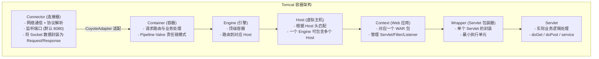

# JavaWeb Servlet - 综合场景串联

---

## 场景一：从零实现一个登录认证系统

### 场景描述
使用 Servlet + JSP + Filter + Session 从零实现一个完整的登录认证系统，包含登录页面、登录验证、Session 管理、登出功能和基于 Filter 的权限拦截。

### 涉及知识点
- [HTTP 协议](01-JavaWeb核心与HTTP协议-导览.md)：GET/POST 方法选择、请求/响应结构、状态码
- [Cookie 与 Session](01-JavaWeb核心与HTTP协议-导览.md)：Session 创建与销毁、JSESSIONID 传递、Session 固定攻击防护
- [Servlet 生命周期与配置](02-Servlet与Tomcat底层-导览.md)：Servlet 初始化、请求处理、注解配置或 web.xml 配置
- [Request 与 Response](03-Request与Response&Filter监听器-导览.md)：获取表单参数、设置响应编码、重定向与转发
- [Filter 过滤器](03-Request与Response&Filter监听器-导览.md)：Filter 链、权限拦截、编码统一设置
- [Servlet 与 Tomcat 底层](02-Servlet与Tomcat底层-导览.md)：Servlet 生命周期、Tomcat 配置、中文乱码处理

### 协作流程

**第一步：创建登录页面（login.jsp）**

使用 JSP 编写登录表单，form 的 method 设为 POST（避免密码出现在 URL 中），action 指向 LoginServlet。表单包含用户名和密码两个输入框，提交按钮。页面设置 UTF-8 编码防止中文乱码。

**第二步：实现 LoginServlet 处理登录请求**

继承 HttpServlet，重写 doPost 方法。在 doPost 第一行调用 request.setCharacterEncoding("UTF-8") 设置请求编码。通过 request.getParameter 获取用户名和密码，与数据库或预设的用户信息比对。验证成功后调用 session.invalidate() 销毁旧 Session（防止 Session 固定攻击），然后 request.getSession(true) 创建新 Session，将用户信息存入 Session。使用 response.sendRedirect() 重定向到首页。

**第三步：实现 EncodingFilter 统一编码**

实现 Filter 接口，在 doFilter 方法中统一设置 request.setCharacterEncoding("UTF-8") 和 response.setContentType("text/html;charset=UTF-8")，然后调用 chain.doFilter() 放行。在 web.xml 或使用 @WebFilter 注解配置 Filter，urlPatterns 设为 "/*" 覆盖所有请求。

**第四步：实现 AuthFilter 权限拦截**

实现 Filter 接口，在 doFilter 方法中检查请求 URL 是否为登录页面或登录接口。如果是，直接放行；否则检查 Session 中是否存在用户信息。若未登录，重定向到登录页面；若已登录，放行。配置 Filter 的 urlPatterns 为 "/*"，确保所有请求都经过权限检查。

**第五步：实现 LogoutServlet 登出功能**

在 doGet 方法中调用 session.invalidate() 销毁 Session，然后重定向到登录页面。登出按钮使用 GET 请求指向 LogoutServlet。

**第六步：配置 web.xml 或使用注解配置**

配置 welcome-file-list 指定登录页面为默认首页。配置 session-timeout 设置 Session 超时时间（如 30 分钟）。按顺序配置 EncodingFilter 和 AuthFilter，确保 EncodingFilter 在 AuthFilter 之前执行。

### 关键要点
- 登录表单必须使用 POST 方法，避免密码出现在 URL 中
- 登录成功后必须销毁旧 Session 并创建新 Session，防止 Session 固定攻击
- EncodingFilter 必须放在 Filter 链最前面，确保后续 Filter 和 Servlet 拿到正确编码
- 登录页面和静态资源应在 AuthFilter 中放行，避免死循环重定向
- Session 中存储的密码应使用哈希（如 BCrypt）存储，不可存明文
- 生产环境应使用 HTTPS 并设置 Cookie 的 Secure 和 HttpOnly 属性



> 上图展示了 Tomcat 容器从 Connector 到 Servlet 的完整请求处理层次：Connector 负责底层网络通信和 HTTP 协议解析，Container 内部的 Engine/Host/Context/Wrapper 四级容器逐层路由，最终将请求分发到具体的 Servlet 实例进行处理。

---

## 场景二：实现文件上传下载服务

### 场景描述
使用 Servlet 实现一个完整的文件上传下载服务，支持多文件上传、文件类型校验、文件名安全处理、路径穿越防护和中文文件名下载支持。

### 涉及知识点
- [HTTP 协议](01-JavaWeb核心与HTTP协议-导览.md)：multipart/form-data 编码类型、Content-Disposition 头
- [Servlet 文件上传](03-Request与Response&Filter监听器-导览.md)：@MultipartConfig 注解、Part 接口、文件写入
- [Request 与 Response](03-Request与Response&Filter监听器-导览.md)：设置响应头、输出流写入
- [文件安全](03-Request与Response&Filter监听器-导览.md)：路径穿越防护、文件类型校验、文件大小限制
- [中文编码](03-Request与Response&Filter监听器-导览.md)：文件名中文乱码处理、多浏览器兼容

### 协作流程

**第一步：创建文件上传页面（upload.jsp）**

编写上传表单，form 的 method 设为 POST，enctype 设为 multipart/form-data。使用 input type="file" 的 multiple 属性支持多文件上传。提交按钮指向 UploadServlet。

**第二步：实现 UploadServlet 处理文件上传**

使用 @MultipartConfig 注解配置上传参数：maxFileSize（单个文件最大大小）、maxRequestSize（请求总大小）、fileSizeThreshold（内存缓存阈值）。在 doPost 方法中通过 request.getParts() 获取所有上传文件。遍历每个 Part，通过 part.getSubmittedFileName() 获取原始文件名。

**第三步：文件名安全处理**

获取原始文件名后，过滤路径穿越字符（`../` 和 `..\\`），仅保留纯文件名。使用 UUID 重命名文件避免文件名冲突，保留原始扩展名。校验文件类型（通过扩展名白名单或 MIME 类型），拒绝可执行文件上传。

**第四步：文件存储**

将文件保存到服务器指定目录（如 /upload/），该目录放在 Web 应用外部，避免被直接访问。使用 part.write() 方法将文件写入磁盘。将文件信息（原始文件名、存储文件名、上传时间、上传者）记录到数据库。

**第五步：实现 DownloadServlet 处理文件下载**

通过请求参数获取文件 ID，从数据库查询文件信息。验证文件存在且用户有下载权限。设置响应头：Content-Type 设为 application/octet-stream，Content-Disposition 使用 `attachment; filename*=UTF-8''urlEncodedFileName` 格式设置文件名以兼容各浏览器中文文件名。通过 response.getOutputStream() 将文件字节流写入响应。

**第六步：实现文件列表页面**

展示已上传文件列表，包含文件名、大小、上传时间等信息。每个文件提供下载链接，指向 DownloadServlet 并携带文件 ID 参数。提供删除功能（需做权限校验）。

### 关键要点
- 上传表单必须设置 enctype="multipart/form-data"，否则只能获取文件名无法获取文件内容
- 文件存储目录必须放在 Web 应用外部，防止攻击者直接访问上传的恶意文件
- 文件名必须过滤路径穿越字符，并使用 UUID 重命名，防止覆盖系统文件
- 文件下载时 Content-Disposition 使用 `filename*=UTF-8''` 格式兼容各浏览器中文文件名
- 上传文件大小限制在 @MultipartConfig 和服务器层面双重配置
- 文件类型校验必须基于文件魔数（Magic Number）而非仅依赖扩展名
- 下载接口需做权限校验，防止未授权用户下载他人文件

### 完整可运行示例代码

以下代码展示了完整的登录认证系统（Servlet + Filter + Listener），包含编码过滤器、认证过滤器、登录/登出 Servlet、Session 监听器和文件上传/下载功能。

**步骤一：web.xml 配置（Servlet 3.0+ 也可用注解替代）**

```xml
<?xml version="1.0" encoding="UTF-8"?>
<web-app xmlns="http://xmlns.jcp.org/xml/ns/javaee"
         xmlns:xsi="http://www.w3.org/2001/XMLSchema-instance"
         xsi:schemaLocation="http://xmlns.jcp.org/xml/ns/javaee
         http://xmlns.jcp.org/xml/ns/javaee/web-app_4_0.xsd"
         version="4.0">

    <display-name>Longjiang Login System</display-name>

    <!-- 欢迎页面 -->
    <welcome-file-list>
        <welcome-file>login.jsp</welcome-file>
    </welcome-file-list>

    <!-- Session 配置：超时 30 分钟 -->
    <session-config>
        <session-timeout>30</session-timeout>
    </session-config>

    <!-- ========== Filter 配置（顺序决定执行顺序） ========== -->

    <!-- 1. 编码过滤器（必须放在最前面） -->
    <filter>
        <filter-name>EncodingFilter</filter-name>
        <filter-class>com.longjiang.filter.EncodingFilter</filter-class>
    </filter>
    <filter-mapping>
        <filter-name>EncodingFilter</filter-name>
        <url-pattern>/*</url-pattern>
    </filter-mapping>

    <!-- 2. 认证过滤器 -->
    <filter>
        <filter-name>AuthFilter</filter-name>
        <filter-class>com.longjiang.filter.AuthFilter</filter-class>
    </filter>
    <filter-mapping>
        <filter-name>AuthFilter</filter-name>
        <url-pattern>/*</url-pattern>
    </filter-mapping>

    <!-- ========== Listener 配置 ========== -->
    <listener>
        <listener-class>com.longjiang.listener.SessionListener</listener-class>
    </listener>
    <listener>
        <listener-class>com.longjiang.listener.AppContextListener</listener-class>
    </listener>

    <!-- ========== Servlet 配置 ========== -->
    <servlet>
        <servlet-name>LoginServlet</servlet-name>
        <servlet-class>com.longjiang.servlet.LoginServlet</servlet-class>
    </servlet>
    <servlet-mapping>
        <servlet-name>LoginServlet</servlet-name>
        <url-pattern>/login</url-pattern>
    </servlet-mapping>

    <servlet>
        <servlet-name>LogoutServlet</servlet-name>
        <servlet-class>com.longjiang.servlet.LogoutServlet</servlet-class>
    </servlet>
    <servlet-mapping>
        <servlet-name>LogoutServlet</servlet-name>
        <url-pattern>/logout</url-pattern>
    </servlet-mapping>

    <servlet>
        <servlet-name>UploadServlet</servlet-name>
        <servlet-class>com.longjiang.servlet.UploadServlet</servlet-class>
        <multipart-config>
            <max-file-size>10485760</max-file-size>      <!-- 单个文件最大 10MB -->
            <max-request-size>52428800</max-request-size> <!-- 请求总大小最大 50MB -->
            <file-size-threshold>1048576</file-size-threshold> <!-- 内存缓存阈值 1MB -->
        </multipart-config>
    </servlet>
    <servlet-mapping>
        <servlet-name>UploadServlet</servlet-name>
        <url-pattern>/upload</url-pattern>
    </servlet-mapping>

    <servlet>
        <servlet-name>DownloadServlet</servlet-name>
        <servlet-class>com.longjiang.servlet.DownloadServlet</servlet-class>
    </servlet>
    <servlet-mapping>
        <servlet-name>DownloadServlet</servlet-name>
        <url-pattern>/download</url-pattern>
    </servlet-mapping>

</web-app>
```

**步骤二：EncodingFilter -- 统一编码过滤器**

```java
package com.longjiang.filter;

import javax.servlet.*;
import javax.servlet.annotation.WebFilter;
import javax.servlet.http.HttpServletRequest;
import javax.servlet.http.HttpServletResponse;
import java.io.IOException;

/**
 * 编码过滤器 -- 放在 Filter 链最前面，统一处理请求和响应编码
 * 注解方式：@WebFilter(filterName = "EncodingFilter", urlPatterns = "/*")
 */
public class EncodingFilter implements Filter {

    private String encoding = "UTF-8";

    @Override
    public void init(FilterConfig filterConfig) throws ServletException {
        // 从 web.xml 读取配置的编码参数
        String encodingParam = filterConfig.getInitParameter("encoding");
        if (encodingParam != null && !encodingParam.isEmpty()) {
            this.encoding = encodingParam;
        }
        System.out.println("[EncodingFilter] 初始化完成，编码: " + encoding);
    }

    @Override
    public void doFilter(ServletRequest request, ServletResponse response,
                         FilterChain chain) throws IOException, ServletException {
        HttpServletRequest req = (HttpServletRequest) request;
        HttpServletResponse resp = (HttpServletResponse) response;

        // 设置请求编码
        req.setCharacterEncoding(encoding);
        // 设置响应编码和内容类型
        resp.setCharacterEncoding(encoding);
        resp.setContentType("text/html;charset=" + encoding);

        // 放行请求
        chain.doFilter(req, resp);
    }

    @Override
    public void destroy() {
        System.out.println("[EncodingFilter] 销毁");
    }
}
```

**步骤三：AuthFilter -- 认证拦截过滤器**

```java
package com.longjiang.filter;

import javax.servlet.*;
import javax.servlet.http.HttpServletRequest;
import javax.servlet.http.HttpServletResponse;
import javax.servlet.http.HttpSession;
import java.io.IOException;
import java.util.Arrays;
import java.util.HashSet;
import java.util.Set;

/**
 * 认证过滤器 -- 拦截未登录请求，放行登录页面和静态资源
 */
public class AuthFilter implements Filter {

    /**
     * 不需要认证的路径白名单
     */
    private static final Set<String> WHITE_LIST = new HashSet<>(Arrays.asList(
            "/login",                    // 登录接口
            "/login.jsp",                // 登录页面
            "/logout",                   // 登出接口
            "/error.jsp",                // 错误页面
            "/favicon.ico"               // 网站图标
    ));

    /**
     * 静态资源路径前缀
     */
    private static final Set<String> STATIC_PREFIXES = new HashSet<>(Arrays.asList(
            "/css/", "/js/", "/images/", "/fonts/"
    ));

    @Override
    public void init(FilterConfig filterConfig) throws ServletException {
        System.out.println("[AuthFilter] 初始化完成");
    }

    @Override
    public void doFilter(ServletRequest request, ServletResponse response,
                         FilterChain chain) throws IOException, ServletException {
        HttpServletRequest req = (HttpServletRequest) request;
        HttpServletResponse resp = (HttpServletResponse) response;

        String requestURI = req.getRequestURI();
        String contextPath = req.getContextPath();
        String path = requestURI.substring(contextPath.length());

        // 检查是否在白名单中
        if (isWhiteListed(path)) {
            chain.doFilter(req, resp);
            return;
        }

        // 检查 Session 中是否存在登录用户
        HttpSession session = req.getSession(false);
        if (session != null && session.getAttribute("user") != null) {
            // 已登录，放行
            chain.doFilter(req, resp);
        } else {
            // 未登录，重定向到登录页面
            String loginUrl = req.getContextPath() + "/login.jsp";
            // 如果是 AJAX 请求，返回 JSON 格式错误
            if ("XMLHttpRequest".equals(req.getHeader("X-Requested-With"))) {
                resp.setContentType("application/json;charset=UTF-8");
                resp.getWriter().write("{\"code\":401,\"msg\":\"未登录，请先登录\"}");
            } else {
                resp.sendRedirect(loginUrl);
            }
        }
    }

    /**
     * 判断请求路径是否在白名单中
     */
    private boolean isWhiteListed(String path) {
        // 精确匹配
        if (WHITE_LIST.contains(path)) {
            return true;
        }
        // 静态资源前缀匹配
        for (String prefix : STATIC_PREFIXES) {
            if (path.startsWith(prefix)) {
                return true;
            }
        }
        return false;
    }

    @Override
    public void destroy() {
        System.out.println("[AuthFilter] 销毁");
    }
}
```

**步骤四：LoginServlet -- 用户登录 Servlet**

```java
package com.longjiang.servlet;

import javax.servlet.ServletException;
import javax.servlet.http.HttpServlet;
import javax.servlet.http.HttpServletRequest;
import javax.servlet.http.HttpServletResponse;
import javax.servlet.http.HttpSession;
import java.io.IOException;

/**
 * 登录 Servlet
 * 处理 POST 请求，验证用户名密码，创建 Session
 */
public class LoginServlet extends HttpServlet {

    // 模拟用户数据（生产环境应查询数据库）
    private static final String VALID_USERNAME = "admin";
    private static final String VALID_PASSWORD = "123456";

    @Override
    protected void doGet(HttpServletRequest req, HttpServletResponse resp)
            throws ServletException, IOException {
        // GET 请求转发到登录页面
        req.getRequestDispatcher("/login.jsp").forward(req, resp);
    }

    @Override
    protected void doPost(HttpServletRequest req, HttpServletResponse resp)
            throws ServletException, IOException {
        String username = req.getParameter("username");
        String password = req.getParameter("password");

        // 参数校验
        if (username == null || password == null || username.trim().isEmpty()) {
            req.setAttribute("error", "用户名和密码不能为空");
            req.getRequestDispatcher("/login.jsp").forward(req, resp);
            return;
        }

        // 验证用户名密码
        if (VALID_USERNAME.equals(username.trim()) && VALID_PASSWORD.equals(password)) {
            // 登录成功：销毁旧 Session（防止 Session 固定攻击）
            HttpSession oldSession = req.getSession(false);
            if (oldSession != null) {
                oldSession.invalidate();
            }

            // 创建新 Session
            HttpSession newSession = req.getSession(true);
            newSession.setAttribute("user", username);
            newSession.setMaxInactiveInterval(30 * 60); // 30 分钟超时

            System.out.println("[LoginServlet] 用户登录成功: " + username
                    + ", SessionID: " + newSession.getId());

            // 重定向到首页
            resp.sendRedirect(req.getContextPath() + "/index.jsp");
        } else {
            // 登录失败
            req.setAttribute("error", "用户名或密码错误");
            req.getRequestDispatcher("/login.jsp").forward(req, resp);
        }
    }
}
```

**步骤五：LogoutServlet -- 用户登出 Servlet**

```java
package com.longjiang.servlet;

import javax.servlet.ServletException;
import javax.servlet.http.HttpServlet;
import javax.servlet.http.HttpServletRequest;
import javax.servlet.http.HttpServletResponse;
import javax.servlet.http.HttpSession;
import java.io.IOException;

/**
 * 登出 Servlet
 * 销毁 Session 并重定向到登录页面
 */
public class LogoutServlet extends HttpServlet {

    @Override
    protected void doGet(HttpServletRequest req, HttpServletResponse resp)
            throws ServletException, IOException {
        HttpSession session = req.getSession(false);
        if (session != null) {
            String username = (String) session.getAttribute("user");
            session.invalidate();
            System.out.println("[LogoutServlet] 用户登出: " + username);
        }
        // 重定向到登录页面
        resp.sendRedirect(req.getContextPath() + "/login.jsp");
    }
}
```

**步骤六：SessionListener -- 在线用户统计监听器**

```java
package com.longjiang.listener;

import javax.servlet.http.HttpSessionEvent;
import javax.servlet.http.HttpSessionListener;
import java.util.concurrent.atomic.AtomicInteger;

/**
 * Session 生命周期监听器 -- 统计在线用户数
 */
public class SessionListener implements HttpSessionListener {

    private static final AtomicInteger onlineCount = new AtomicInteger(0);

    @Override
    public void sessionCreated(HttpSessionEvent se) {
        int count = onlineCount.incrementAndGet();
        System.out.println("[SessionListener] 新会话创建: "
                + se.getSession().getId() + ", 当前在线: " + count);
        // 将在线人数存入 ServletContext 供页面展示
        se.getSession().getServletContext().setAttribute("onlineCount", count);
    }

    @Override
    public void sessionDestroyed(HttpSessionEvent se) {
        int count = onlineCount.decrementAndGet();
        System.out.println("[SessionListener] 会话销毁: "
                + se.getSession().getId() + ", 当前在线: " + count);
        se.getSession().getServletContext().setAttribute("onlineCount", count);
    }

    /**
     * 获取当前在线用户数
     */
    public static int getOnlineCount() {
        return onlineCount.get();
    }
}
```

**步骤七：AppContextListener -- 应用上下文初始化监听器**

```java
package com.longjiang.listener;

import javax.servlet.ServletContextEvent;
import javax.servlet.ServletContextListener;
import java.io.File;

/**
 * 应用上下文监听器 -- 在应用启动时初始化资源
 */
public class AppContextListener implements ServletContextListener {

    @Override
    public void contextInitialized(ServletContextEvent sce) {
        System.out.println("========== 应用启动 ==========");

        // 初始化上传目录
        String uploadPath = sce.getServletContext().getRealPath("/") + "WEB-INF" + File.separator + "uploads";
        File uploadDir = new File(uploadPath);
        if (!uploadDir.exists()) {
            boolean created = uploadDir.mkdirs();
            System.out.println("[AppContextListener] 上传目录创建: " + uploadDir.getAbsolutePath()
                    + " -> " + (created ? "成功" : "失败"));
        }

        // 将上传目录路径存入 ServletContext 供全局使用
        sce.getServletContext().setAttribute("uploadDir", uploadDir.getAbsolutePath());

        // 初始化在线人数
        sce.getServletContext().setAttribute("onlineCount", 0);

        System.out.println("[AppContextListener] 上传目录: " + uploadDir.getAbsolutePath());
    }

    @Override
    public void contextDestroyed(ServletContextEvent sce) {
        System.out.println("========== 应用关闭 ==========");
        System.out.println("[AppContextListener] 正在清理资源...");
    }
}
```

**步骤八：UploadServlet -- 文件上传 Servlet**

```java
package com.longjiang.servlet;

import javax.servlet.ServletException;
import javax.servlet.http.HttpServlet;
import javax.servlet.http.HttpServletRequest;
import javax.servlet.http.HttpServletResponse;
import javax.servlet.http.Part;
import java.io.File;
import java.io.IOException;
import java.util.UUID;

/**
 * 文件上传 Servlet
 * 支持多文件上传、文件名安全处理、路径穿越防护
 */
public class UploadServlet extends HttpServlet {

    /**
     * 允许上传的文件扩展名白名单
     */
    private static final String[] ALLOWED_EXTENSIONS = {
            "jpg", "jpeg", "png", "gif", "bmp",
            "pdf", "doc", "docx", "xls", "xlsx",
            "txt", "zip", "rar"
    };

    @Override
    protected void doPost(HttpServletRequest req, HttpServletResponse resp)
            throws ServletException, IOException {
        req.setCharacterEncoding("UTF-8");
        resp.setContentType("text/html;charset=UTF-8");

        // 获取上传目录
        String uploadDir = (String) getServletContext().getAttribute("uploadDir");

        StringBuilder resultMsg = new StringBuilder();

        try {
            // 遍历所有上传的文件 Part
            for (Part part : req.getParts()) {
                String fileName = extractFileName(part);
                if (fileName == null || fileName.isEmpty()) {
                    continue; // 跳过非文件字段
                }

                // 1. 文件名安全处理：过滤路径穿越字符
                fileName = sanitizeFileName(fileName);

                // 2. 校验文件扩展名
                String extension = getFileExtension(fileName);
                if (!isAllowedExtension(extension)) {
                    resultMsg.append("文件类型不允许: ").append(fileName).append("<br>");
                    continue;
                }

                // 3. 使用 UUID 重命名文件，避免文件名冲突
                String savedFileName = UUID.randomUUID().toString() + "." + extension;
                String filePath = uploadDir + File.separator + savedFileName;

                // 4. 写入文件
                part.write(filePath);

                resultMsg.append("文件上传成功: ")
                        .append(fileName)
                        .append(" -> ")
                        .append(savedFileName)
                        .append("<br>");

                System.out.println("[UploadServlet] 文件上传: " + fileName
                        + " -> " + savedFileName
                        + " (大小: " + part.getSize() + " bytes)");
            }

            if (resultMsg.length() == 0) {
                resultMsg.append("未选择文件");
            }
        } catch (Exception e) {
            resultMsg.append("上传失败: ").append(e.getMessage());
            System.err.println("[UploadServlet] 上传异常: " + e.getMessage());
        }

        resp.getWriter().write("<html><body><h2>上传结果</h2>"
                + resultMsg.toString()
                + "<br><a href='upload.jsp'>返回上传页面</a>"
                + "</body></html>");
    }

    /**
     * 从 Part 中提取原始文件名
     */
    private String extractFileName(Part part) {
        String contentDisposition = part.getHeader("Content-Disposition");
        if (contentDisposition == null) {
            return null;
        }
        for (String token : contentDisposition.split(";")) {
            token = token.trim();
            if (token.startsWith("filename")) {
                String fileName = token.substring(token.indexOf("=") + 2, token.length() - 1);
                return fileName;
            }
        }
        return null;
    }

    /**
     * 文件名安全处理：过滤路径穿越字符
     */
    private String sanitizeFileName(String fileName) {
        // 删除路径分隔符，防止路径穿越攻击
        fileName = fileName.replace("..", "");
        fileName = fileName.replace("/", "");
        fileName = fileName.replace("\\", "");
        fileName = fileName.replace(":", "");
        return fileName.trim();
    }

    /**
     * 获取文件扩展名（小写）
     */
    private String getFileExtension(String fileName) {
        int dotIndex = fileName.lastIndexOf(".");
        if (dotIndex == -1) {
            return "";
        }
        return fileName.substring(dotIndex + 1).toLowerCase();
    }

    /**
     * 检查文件扩展名是否在白名单中
     */
    private boolean isAllowedExtension(String extension) {
        for (String allowed : ALLOWED_EXTENSIONS) {
            if (allowed.equals(extension)) {
                return true;
            }
        }
        return false;
    }
}
```

**步骤九：DownloadServlet -- 文件下载 Servlet**

```java
package com.longjiang.servlet;

import javax.servlet.ServletException;
import javax.servlet.http.HttpServlet;
import javax.servlet.http.HttpServletRequest;
import javax.servlet.http.HttpServletResponse;
import java.io.*;
import java.net.URLEncoder;

/**
 * 文件下载 Servlet
 * 支持中文文件名、安全校验
 */
public class DownloadServlet extends HttpServlet {

    @Override
    protected void doGet(HttpServletRequest req, HttpServletResponse resp)
            throws ServletException, IOException {
        String fileName = req.getParameter("file");

        // 校验参数
        if (fileName == null || fileName.trim().isEmpty()) {
            resp.sendError(HttpServletResponse.SC_BAD_REQUEST, "缺少文件名参数");
            return;
        }

        // 文件名安全处理
        fileName = fileName.replace("..", "").replace("/", "").replace("\\", "");

        String uploadDir = (String) getServletContext().getAttribute("uploadDir");
        File file = new File(uploadDir, fileName);

        // 校验文件是否存在
        if (!file.exists()) {
            resp.sendError(HttpServletResponse.SC_NOT_FOUND, "文件不存在");
            return;
        }

        // 校验文件是否在允许的目录内（防止路径穿越）
        if (!file.getCanonicalPath().startsWith(new File(uploadDir).getCanonicalPath())) {
            resp.sendError(HttpServletResponse.SC_FORBIDDEN, "非法访问");
            return;
        }

        // 设置响应头
        resp.setContentType("application/octet-stream");
        resp.setContentLengthLong(file.length());

        // 处理中文文件名（兼容各浏览器）
        String encodedFileName = URLEncoder.encode(fileName, "UTF-8")
                .replaceAll("\\+", "%20");
        resp.setHeader("Content-Disposition",
                "attachment; filename=\"" + encodedFileName + "\"; filename*=UTF-8''" + encodedFileName);

        // 写入文件流
        try (FileInputStream fis = new FileInputStream(file);
             OutputStream os = resp.getOutputStream()) {
            byte[] buffer = new byte[4096];
            int bytesRead;
            while ((bytesRead = fis.read(buffer)) != -1) {
                os.write(buffer, 0, bytesRead);
            }
            os.flush();
        }

        System.out.println("[DownloadServlet] 文件下载: " + fileName);
    }
}
```

**步骤十：JSP 页面（login.jsp）**

```jsp
<%@ page contentType="text/html;charset=UTF-8" language="java" %>
<!DOCTYPE html>
<html>
<head>
    <meta charset="UTF-8">
    <title>用户登录</title>
    <style>
        body { font-family: Arial, sans-serif; background: #f0f2f5; display: flex;
               justify-content: center; align-items: center; height: 100vh; margin: 0; }
        .login-box { background: #fff; padding: 40px; border-radius: 8px;
                     box-shadow: 0 2px 12px rgba(0,0,0,0.1); width: 360px; }
        .login-box h2 { text-align: center; margin-bottom: 30px; color: #333; }
        .form-group { margin-bottom: 20px; }
        .form-group label { display: block; margin-bottom: 5px; color: #666; }
        .form-group input { width: 100%; padding: 10px; border: 1px solid #ddd;
                            border-radius: 4px; box-sizing: border-box; }
        .btn { width: 100%; padding: 12px; background: #1890ff; color: #fff;
               border: none; border-radius: 4px; cursor: pointer; font-size: 16px; }
        .btn:hover { background: #40a9ff; }
        .error { color: #ff4d4f; text-align: center; margin-bottom: 15px; }
        .online-info { text-align: center; color: #999; font-size: 12px; margin-top: 10px; }
    </style>
</head>
<body>
    <div class="login-box">
        <h2>用户登录</h2>
        <%
            String error = (String) request.getAttribute("error");
            if (error != null) {
        %>
            <div class="error"><%= error %></div>
        <%
            }
        %>
        <form action="login" method="POST">
            <div class="form-group">
                <label>用户名</label>
                <input type="text" name="username" placeholder="请输入用户名" required>
            </div>
            <div class="form-group">
                <label>密码</label>
                <input type="password" name="password" placeholder="请输入密码" required>
            </div>
            <button type="submit" class="btn">登 录</button>
        </form>
        <div class="online-info">
            当前在线人数: <%= application.getAttribute("onlineCount") != null
                ? application.getAttribute("onlineCount") : 0 %>
        </div>
    </div>
</body>
</html>
```

**步骤十一：首页（index.jsp）**

```jsp
<%@ page contentType="text/html;charset=UTF-8" language="java" %>
<%
    String user = (String) session.getAttribute("user");
    if (user == null) {
        response.sendRedirect(request.getContextPath() + "/login.jsp");
        return;
    }
%>
<!DOCTYPE html>
<html>
<head>
    <meta charset="UTF-8">
    <title>首页</title>
</head>
<body>
    <h2>欢迎回来，<%= user %>！</h2>
    <p>当前在线人数: <%= application.getAttribute("onlineCount") != null
        ? application.getAttribute("onlineCount") : 0 %></p>
    <p>Session ID: <%= session.getId() %></p>
    <ul>
        <li><a href="upload.jsp">文件上传</a></li>
        <li><a href="logout">退出登录</a></li>
    </ul>
</body>
</html>
```

**步骤十二：请求处理流程图**

```
客户端请求
    │
    ▼
┌─────────────────┐
│  EncodingFilter  │  ← 设置请求/响应编码为 UTF-8
│  (第1个 Filter)   │
└────────┬────────┘
         │ chain.doFilter()
         ▼
┌─────────────────┐
│   AuthFilter     │  ← 检查 Session 中是否有 user
│  (第2个 Filter)   │     ├── 未登录 → 重定向到 login.jsp
└────────┬────────┘     └── 已登录 → 放行
         │ chain.doFilter()
         ▼
┌─────────────────┐
│    Servlet       │  ← LoginServlet / LogoutServlet / UploadServlet / DownloadServlet
│  (业务处理)       │
└────────┬────────┘
         │
         ▼
     响应返回客户端
```

---

> [返回模块目录](../../README.md) | [返回知识导览](../../知识导览.md)