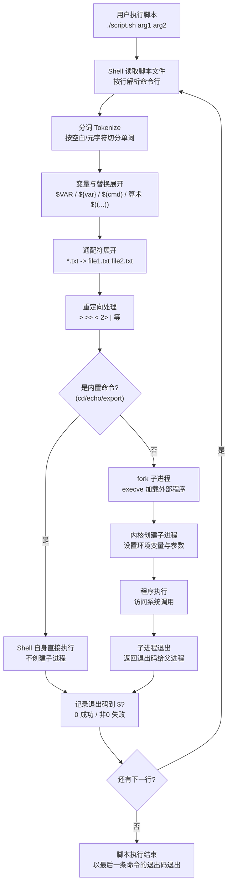

# Linux 核心命令与 Shell 脚本

> 学习路线对应：补充模块 — Linux 基础
> 前置知识：操作系统基本概念
> 预计学习时间：2 天

> 📖 **参考链接**：
> - [Linux man pages 在线手册](https://man7.org/linux/man-pages/) -- man7.org 官方 Linux 手册页，按章节查询命令、系统调用、配置文件格式
> - [ls(1) 手册页](https://man7.org/linux/man-pages/man1/ls.1.html) -- `ls` 命令完整参数说明
> - [find(1) 手册页](https://man7.org/linux/man-pages/man1/find.1.html) -- `find` 命令查找条件与表达式
> - [bash(1) 手册页](https://man7.org/linux/man-pages/man1/bash.1.html) -- Bash Shell 完整参考（变量、条件、循环、重定向）
> - [The Linux Documentation Project](https://tldp.org/) -- Linux 文档项目，含 Shell 脚本编程指南

---

## 一、核心概念

### 1.1 Linux 发行版简介

Linux 是一个开源内核，不同厂商/社区基于内核打包了不同的发行版：

| 发行版 | 特点 | 适用场景 |
|--------|------|----------|
| **Ubuntu/Debian** | 易用性强，包管理 `apt`，社区活跃 | 桌面开发、服务器、云原生 |
| **CentOS/RHEL** | 稳定，企业级支持，包管理 `yum/dnf` | 生产服务器、企业应用 |
| **Alpine** | 极简，体积小（~5MB），包管理 `apk` | 容器镜像、嵌入式 |
| **Arch** | 滚动更新，包管理 `pacman`，文档完善 | 极客玩家、定制化需求 |
| **Fedora** | 前沿技术，RedHat 赞助 | 测试新技术、桌面开发 |

> **选择建议**：后端开发服务器推荐 CentOS/RHEL 或 Ubuntu；本地开发推荐 Ubuntu；容器镜像推荐 Alpine。

### 1.2 FHS 文件系统层次结构标准

FHS（Filesystem Hierarchy Standard）定义了 Linux 文件系统的目录结构和用途：

| 目录 | 作用 |
|------|------|
| `/` | 根目录，所有文件的起点 |
| `/bin` | 系统基本命令（所有用户可用），如 `ls`、`cp` |
| `/sbin` | 系统管理命令（需要 root 权限），如 `fdisk`、`reboot` |
| `/etc` | 配置文件，如 `/etc/passwd`、`/etc/nginx/nginx.conf` |
| `/home` | 普通用户家目录，每个用户一个子目录 |
| `/root` | root 用户的家目录 |
| `/usr` | 用户安装的应用程序，`/usr/local` 放本地编译安装的软件 |
| `/var` | 可变数据，如日志 `/var/log`、数据库 `/var/lib` |
| `/tmp` | 临时文件，系统重启会清空 |
| `/dev` | 设备文件，`/dev/sda` 表示第一块硬盘，`/dev/null` 空设备 |
| `/proc` | 虚拟文件系统，反映内核和进程状态，`/proc/cpuinfo`、`/proc/meminfo` |
| `/mnt` | 临时挂载点，挂载其他文件系统 |
| `/opt` | 可选应用软件，第三方软件安装位置 |

> 记忆口诀：`bin` 命令 `sbin` 特权，`etc` 配置 `home` 用户，`usr` 应用 `var` 可变，`tmp` 临时 `dev` 设备。

### 1.3 文件与目录操作核心命令

> **生活化类比：Linux 权限模型 = "门禁卡系统"** —— 每个文件/目录像一栋楼，有三类人想进出：业主（所有者 owner）、同小区住户（所属组 group）、外人（其他人 others）。门禁卡（权限位）分三种权限：r 是"能看楼里有什么"（读文件/列目录）、w 是"能改动楼里东西"（改文件/增删文件）、x 是"能进楼"（执行文件/进入目录）。`chmod 755` 就是给业主配张全权限卡（7=rwx），给住户和外人配张只能进不能改的卡（5=r-x）。`sudo` 是"临时管理员卡"——你是普通住户，但临时需要进机房，刷自己的卡+输密码验证后，系统给你一张临时 root 卡用一次。`/etc/sudoers` 是"谁能拿管理员卡"的白名单。`chmod 777` 则是"大门敞开谁都能进能改"——方便是方便，但安全隐患极大，生产环境绝对要避免。

| 命令 | 作用 | 常用参数 |
|------|------|----------|
| `ls` | 列出目录内容 | `-l` 详细格式，`-a` 显示隐藏文件，`-h` 人类可读大小 |
| `cd` | 切换工作目录 | `cd ~` 回家，`cd -` 返回上一次目录，`cd ..` 返回上级 |
| `pwd` | 显示当前工作目录绝对路径 | - |
| `mkdir` | 创建目录 | `-p` 递归创建多级目录 |
| `rm` | 删除文件或目录 | `-r` 递归删除目录，`-f` 强制删除不提示 |
| `cp` | 复制文件或目录 | `-r` 递归复制目录，`-p` 保留权限 |
| `mv` | 移动/重命名文件或目录 | - |
| `find` | 查找文件 | `-name` 按名称查找，`-type` 按类型查找，`-size` 按大小查找 |
| `tar` | 打包压缩 | `-c` 创建，`-x` 解压，`-z` gzip 压缩，`-f` 指定文件名，`-v` 显示过程 |

### 1.4 管道与重定向

> **生活化类比：管道 `|` = "工厂流水线"** —— 没有管道时，每个命令都是独立工位：`cat log.txt` 把原料（文件内容）倒在地上，`grep error` 蹲在地上捡出含 error 的，再交给 `wc -l` 数一数——中间结果要存成临时文件，繁琐。管道 `|` 就是把这些工位用传送带连起来变成流水线：`cat log.txt | grep error | wc -l`，原料（日志文本）从第一个工位（cat）上传送带，流到第二个工位（grep）过滤出 error 行，再流到第三个工位（wc）统计行数，最后只输出最终成品（错误行数）。每个工位只做自己擅长的事，中间结果自动通过管道流转，无需临时文件。这就是 Unix 哲学："每个工具做好一件事，通过管道组合成强大的处理链"。重定向 `>` `>>` `<` 则是把流水线的入口/出口接到文件上：`> output.txt` 是把成品装进文件，`< input.txt` 是从文件取原料。

| 概念 | 符号 | 作用 |
|------|------|------|
| **标准输入** | `stdin` / `0` | 默认从键盘接收输入 |
| **标准输出** | `stdout` / `1` | 默认输出到屏幕 |
| **标准错误** | `stderr` / `2` | 默认输出到屏幕 |
| **输出重定向** | `>` | 覆盖写入文件 |
| **输出追加重定向** | `>>` | 追加到文件末尾 |
| **输入重定向** | `<` | 从文件读取输入 |
| **错误重定向** | `2>` | 重定向错误输出 |
| **管道** | `|` | 将前一个命令的输出作为后一个命令的输入 |
| **匿名管道** | `|` | 上述的管道，用于连接两个命令 |
| **命名管道** | `mkfifo` | FIFO，可用于不同进程间通信 |

### 1.5 文本处理三剑客

| 工具 | 主要用途 |
|------|----------|
| **grep** | 文本搜索，按模式匹配行 |
| **sed** | 流编辑器，行级处理，替换、删除、插入 |
| **awk** | 文本分析工具，按字段处理，支持编程 |

### 1.6 Shell 脚本基础

Shell 是用户与内核交互的命令解释器，也是一门脚本编程语言：

> **生活化类比：Shell = "你的自动化秘书"** —— 你是公司老板（用户），内核是公司真正干活的员工（CPU、磁盘、网络）。你不可能每件事都亲自跑去找员工交代（直接调系统调用），于是雇了个秘书（Shell）。你在键盘上敲 `ls`，就像跟秘书说"把当前文件夹的文件清单给我"，秘书翻译成内核听得懂的指令（系统调用），内核执行完把结果交还秘书，秘书再格式化后展示给你。Shell 脚本就是"给秘书的工作手册"——把一系列指令写成文档（`deploy.sh`），秘书按顺序执行：先打包、再上传、再重启、再发通知。你只需说一句"按手册办事"（`./deploy.sh`），秘书就自动跑完整个流程。优秀的 Shell 脚本就像优秀秘书的工作手册：步骤清晰、有异常处理（`if [ $? -ne 0 ]`）、能接收参数（`$1 $2`）、还会自我检查（`set -e` 出错即停）。

- **变量**：自定义变量、环境变量、位置参数
- **条件判断**：`if-else`、`case`
- **循环**：`for`、`while`、`until`
- **函数**：代码封装，参数传递
- **退出状态**：`$?` 获取上一条命令退出码，0 成功，非 0 失败

---

## 二、底层原理

### 2.1 Linux 文件系统原理

- **一切皆文件**：Linux 中所有资源都抽象为文件，包括硬件设备、管道、网络套接字
- **inode 与 block**：每个文件有一个 inode 存储元信息（权限、大小、时间戳、数据块指针），data block 存储实际数据
- **硬链接 vs 软链接**：
  - 硬链接：多个文件名指向同一个 inode，删除一个不影响其他，不能跨文件系统，不能链接目录
  - 软链接：类似 Windows 快捷方式，是一个新文件，存储目标文件路径，可以跨文件系统，可以链接目录

### 2.2 管道实现原理

管道基于环形队列实现，本质是内核中的一块缓冲区：

- **半双工**：同一时间只能单向传输数据，要双向通信需要两个管道
- **缓冲大小**：通常是 4KB 或一页内存大小
- **同步机制**：读管道时如果为空，读进程阻塞；写管道时如果满了，写进程阻塞
- **匿名管道**：只能用于有血缘关系的进程间通信（父子进程、兄弟进程）
- **命名管道**：创建为 FIFO 文件，可以在任意进程间通信

### 2.3 Shell 执行脚本流程

**Shell 脚本执行的完整流程（Mermaid 图）：**



> 上图展示了 Shell 执行脚本的完整链路：Shell 逐行读取脚本，对每行依次进行**分词**（按空白切分单词）、**变量与替换展开**（`$VAR` 替换为值、`$(cmd)` 执行命令替换、`$((...))` 算术展开）、**通配符展开**（`*.txt` 展开为匹配文件列表）、**重定向处理**（`>` `>>` `<` `2>` `|`）。然后判断命令类型：**内置命令**（如 `cd`、`echo`、`export`、`source`）由 Shell 自身直接执行，不创建子进程（所以 `cd` 能改变当前 Shell 的工作目录）；**外部命令**（如 `ls`、`grep`、`java`）通过 `fork` 创建子进程，再 `execve` 加载程序执行。子进程退出后将退出码返回父进程，Shell 记录到 `$?`。若还有下一行则继续循环，否则脚本以最后一条命令的退出码结束。理解这套流程能解释很多"坑"：比如 `cd` 在子 Shell 中执行不影响父 Shell、管道 `|` 两边分别在子 Shell 中执行、变量在子 Shell 中的修改父 Shell 看不到等。

1. **读取**：Shell 从文件或标准输入读取命令行
2. **分词**：将命令行按空白分割为单词和元字符
3. **替换**：展开通配符、变量、命令替换（`$(...)`）、算术替换
4. **重定向**：处理 `>`、`<` 等符号，重定向文件描述符
5. **执行**：调用 `execve` 执行程序，或者由 Shell 内置命令直接处理

### 2.4 环境变量与进程环境

- 每个进程都有一个环境表（environment list），存储环境变量 `key=value`
- 子进程会继承父进程的环境变量
- `export` 将变量导出为环境变量，使其能被子进程继承
- 常见环境变量：`PATH`（命令搜索路径）、`HOME`（用户家目录）、`PWD`（当前目录）、`USER`（当前用户名）、`SHELL`（默认 Shell）

---

## 三、实战应用

### 3.1 文件与目录操作实战

**常用示例：**

```bash
# 以详细列表格式显示所有文件（包括隐藏文件）
ls -alh

# 创建多级目录
mkdir -p project/{src,bin,config}

# 强制递归删除目录
rm -rf build/

# 复制目录并保留权限
cp -rp /source/project /backup/

# 批量重命名：将所有 .txt 改为 .md
for f in *.txt; do mv "$f" "${f%.txt}.md"; done

# 按名称查找所有 .log 文件
find /var/log -name "*.log"

# 查找大于 100MB 的文件
find / -size +100M -type f

# 打包压缩为 tar.gz
tar -czf archive.tar.gz project/

# 解压 tar.gz
tar -xzf archive.tar.gz

# 查看当前目录总大小
du -sh .
```

### 3.2 管道与重定向实战

**常用示例：**

```bash
# 将输出重定向到文件（覆盖）
echo "Hello World" > output.txt

# 追加到文件末尾
echo "New line" >> output.txt

# 同时重定向标准输出和错误输出
./script.sh > output.log 2>&1

# 或者简写（bash 支持）
./script.sh &> output.log

# 丢弃错误输出
./script.sh 2> /dev/null

# 统计 nginx 访问日志中每个 IP 的访问次数，排序取 Top 10
cat access.log | awk '{print $1}' | sort | uniq -c | sort -nr | head -10

# 查找包含 error 的日志行，显示行号
grep -n "error" /var/log/nginx/error.log

# 分页查看大文件
cat large.log | less
```

### 3.3 文本处理三剑客实战

**grep 常用：**

```bash
# 搜索匹配行
grep "pattern" file.txt

# 忽略大小写，显示行号，递归搜索目录
grep -irn "TODO" src/

# 反向匹配，输出不包含pattern的行
grep -v "debug" app.log

# 匹配整词
grep -w "error" file.txt
```

**sed 常用：**

```bash
# 替换：将文件中所有 foo 替换为 bar，输出到标准输出
sed 's/foo/bar/g' file.txt

# 直接修改原文件（Mac 需要加 '' ：sed -i '' 's/foo/bar/g'）
sed -i 's/foo/bar/g' file.txt

# 删除空行
sed '/^$/d' file.txt

# 删除第 1-5 行
sed '1,5d' file.txt

# 在匹配行后插入一行
sed '/pattern/a 新增行' file.txt
```

**awk 常用：**

```bash
# 输出第 1 和第 3 列，默认按空白分割
awk '{print $1 "\t" $3}' access.log

# 指定分隔符为冒号，输出 /etc/passwd 中用户名和 UID
awk -F: '{print $1 ":" $3}' /etc/passwd

# 统计行数（相当于 wc -l）
awk 'END{print NR}' file.txt

# 计算所有访问日志中响应时间总和
awk '{sum += $NF} END{print sum}' access.log

# 只输出长度大于 100 的行
awk 'length($0) > 100' file.txt
```

### 3.4 Shell 脚本基础实战

**变量示例：**

```bash
#!/bin/bash

# 定义变量，等号两边不能有空格
NAME="Alice"
AGE=25
echo "Name: $NAME, Age: $AGE"

# 只读变量
readonly PI=3.14159

# 获取命令输出赋值给变量
CURRENT_DIR=$(pwd)
echo "Current dir: $CURRENT_DIR"

# 位置参数
# $0 脚本名，$1 第一个参数，$2 第二个，$# 参数个数，$@ 所有参数
echo "Script name: $0"
echo "First arg: $1"
echo "Number of args: $#"
```

**条件判断示例：**

```bash
#!/bin/bash

# 文件判断
if [ -f "/etc/passwd" ]; then
    echo "/etc/passwd exists and is a regular file"
fi

# 整数比较
if [ $AGE -gt 18 ]; then
    echo "adult"
else
    echo "minor"
fi

# 字符串比较
if [ "$NAME" = "Alice" ]; then
    echo "Hello Alice"
fi

# 多条件分支
score=85
if [ $score -ge 90 ]; then
    echo "A"
elif [ $score -ge 80 ]; then
    echo "B"
else
    echo "C"
fi

# case 语句
case $1 in
    start)
        echo "Starting..."
        ;;
    stop)
        echo "Stopping..."
        ;;
    restart)
        echo "Restarting..."
        ;;
    *)
        echo "Usage: $0 {start|stop|restart}"
        ;;
esac
```

**循环示例：**

```bash
#!/bin/bash

# for 循环遍历列表
for i in 1 2 3 4 5; do
    echo "i = $i"
done

# for 循环遍历文件
for f in *.md; do
    echo "File: $f"
done

# C 风格 for
for ((i=0; i<10; i++)); do
    echo "i = $i"
done

# while 循环
count=0
while [ $count -lt 5 ]; do
    echo "count = $count"
    count=$((count+1))
done
```

**函数示例：**

```bash
#!/bin/bash

# 定义函数
greet() {
    local name=$1  # 局部变量
    echo "Hello, $name!"
}

# 调用函数
greet "World"

# 带返回值的函数
add() {
    local a=$1
    local b=$2
    echo $((a + b))  # 通过输出返回
}

result=$(add 3 5)
echo "3 + 5 = $result"
```

**完整启动脚本示例：**

```bash
#!/bin/bash

# Spring Boot 应用启动脚本

APP_NAME="myapp"
JAR_FILE="/app/app.jar"
LOG_FILE="/app/logs/app.log"
PID_FILE="/app/app.pid"

case $1 in
    start)
        if [ -f $PID_FILE ] && kill -0 $(cat $PID_FILE) 2>/dev/null; then
            echo "$APP_NAME already running, pid=$(cat $PID_FILE)"
            exit 1
        fi
        echo "Starting $APP_NAME..."
        mkdir -p $(dirname $LOG_FILE)
        nohup java -jar $JAR_FILE >> $LOG_FILE 2>&1 &
        echo $! > $PID_FILE
        echo "$APP_NAME started, pid=$!"
        ;;
    stop)
        if [ ! -f $PID_FILE ]; then
            echo "$APP_NAME not running"
            exit 1
        fi
        pid=$(cat $PID_FILE)
        echo "Stopping $APP_NAME (pid=$pid)..."
        kill $pid
        rm -f $PID_FILE
        echo "$APP_NAME stopped"
        ;;
    restart)
        $0 stop
        sleep 2
        $0 start
        ;;
    status)
        if [ -f $PID_FILE ] && kill -0 $(cat $PID_FILE) 2>/dev/null; then
            echo "$APP_NAME is running, pid=$(cat $PID_FILE)"
        else
            echo "$APP_NAME is not running"
        fi
        ;;
    *)
        echo "Usage: $0 {start|stop|restart|status}"
        exit 1
esac

exit 0
```

---

## 四、常见面试题

### 1. 软链接和硬链接的区别？

**答案：**
- 硬链接：多个文件名指向同一个 inode，不新建 inode；不能跨文件系统，不能链接目录；删除原文件不影响硬链接；链接数会增加。
- 软链接：是一个独立文件，有自己的 inode，存储目标文件的路径；可以跨文件系统，可以链接目录；删除原文件后软链接变为悬空链接；链接数不增加。

### 2. `tar` 命令 `czf`、`xzf` 参数的含义？

**答案：**
- `c`：create，创建新的压缩包
- `x`：extract，解压压缩包
- `z`：gzip，使用 gzip 压缩算法
- `f`：file，指定压缩包文件名，f 必须放在最后
因此 `tar -czf output.tar.gz files/` 表示创建 gzip 压缩包；`tar -xzf input.tar.gz` 表示解压 gzip 压缩包。

### 3. `|` 管道和 `;` 分号、`&&` 区别？

**答案：**
- `|` 管道：前一个命令的输出作为后一个命令的输入，只有前一个命令完成输出，后一个才能开始处理；
- `;` 分号：顺序执行多个命令，不关心命令是否成功，前一个执行完执行下一个，彼此无关；
- `&&` 逻辑与：只有前一个命令执行成功（退出码 0），才会执行后一个命令；如果前一个失败，后一个不执行。

类似地，`||` 逻辑或：只有前一个命令失败，才会执行后一个。

### 4. `grep`、`sed`、`awk` 各自适用场景？

**答案：**
- `grep`：适合简单的文本搜索，查找是否包含某个模式，过滤出匹配行；
- `sed`：适合行级别的文本替换、删除、插入等编辑操作，是流编辑器；
- `awk`：适合按字段处理文本，可以做简单的统计计算，支持条件判断、循环等编程逻辑，处理结构化文本更强大。

简单记忆：**搜 grep，换 sed，算 awk**。

### 5. Shell 中单引号和双引号区别？

**答案：**
- **单引号**：单引号内所有字符都会原样输出，变量不会展开；
- **双引号**：双引号内变量会被展开为变量的值，特殊字符会被解释；
- 不使用引号：空格会被当作分隔符，变量会展开，通配符会展开；没有特殊需求，推荐变量都加双引号 `"$VAR"`。

示例：
```bash
name=Alice
echo 'Hello $name'  # 输出：Hello $name
echo "Hello $name"  # 输出：Hello Alice
```

### 6. 如何在 Shell 脚本中获取脚本所在目录？

**答案：**

```bash
#!/bin/bash
# 获取脚本所在绝对路径
SCRIPT_DIR=$(cd "$(dirname "${BASH_SOURCE[0]}")" && pwd)
echo "Script directory: $SCRIPT_DIR"
```

### 7. `$?`、`$$`、`$#`、`$@`、`$*` 分别表示什么？

**答案：**
- `$?`：上一条命令的退出状态码，0 表示成功，非 0 表示失败
- `$$`：当前 Shell 进程的 PID
- `$#`：传入脚本或函数的参数个数
- `$@`：所有位置参数，每个参数分开 `"$1" "$2" ...`，推荐使用
- `$*`：所有位置参数，合并为一个字符串 `"$1c$2c..."`，c 是 IFS 第一个字符

---

## 五、避坑指南

| 常见错误 | 错误示例 | 原因 | 正确写法 |
|---------|----------|------|----------|
| `rm -rf /tmp/$APP` 变量为空删根 | `rm -rf /tmp/$APP` 当 `APP` 为空变成 `rm -rf /tmp/ /` | 变量未初始化或为空 | `rm -rf /tmp/"$APP"/*` 或者先判断 `if [ -z "$APP" ]; then exit 1; fi` |
| 去掉变量引号导致分词错误 | `FILE="my file.txt"; cat $FILE` 会拆成 `cat "my" "file.txt"` | 空格被当作分词 | `cat "$FILE"` 变量都加双引号 |
| `rm -rf *.log` 当前目录没有 .log 会报错 | `rm -rf *.log` 当没有匹配文件时，`*` 不展开，当作字面量删除 | Bash 默认不展开 null glob | `shopt -s nullglob` 或者 `find . -name "*.log" -delete` |
| `tar.gz` 解压顺序错 f 不在最后 | `tar -czvf archive.tar.gz project` 没问题，`tar -czvf project archive.tar.gz` 错了 | f 必须放在最后，其后跟文件名 | `tar -czf archive.tar.gz project` |
| `sed -i` 在 Mac 上报错 | `sed -i 's/foo/bar/g' file.txt` Linux 正常，Mac 报错 | Mac BSD sed 需要备份后缀参数 | Linux：`sed -i 's/...` Mac：`sed -i '' 's/...` |
| 判断字符串相等漏了空格 | `[$1="yes"]` 报错 | `[` 是命令，前后需要空格 | `[ "$1" = "yes" ]` |
| 循环中遍历文件名含空格出错 | `for f in $(find . -name "*.txt"); do echo $f; done` 文件名含空格会被拆分 | find 输出按换行分割，for 按空白分割 | 使用 `find ... -print0 | xargs -0 ...` 或者 `while IFS= read -r f; do ... done < <(find ...)` |
| 后台进程输出导致脚本挂起 | 脚本中启动后台进程但未重定向 stdout/stderr，SSH 断开后脚本会收到 SIGHUP 退出 | 后台进程会持有终端 | 使用 `nohup` + 重定向：`nohup command >> output.log 2>&1 &` |
| 在根目录执行 `chmod 777 -R .` 严重安全问题 | 所有人都能读写所有文件 | 权限太大，敏感文件可被任意修改 | 不要乱递归改权限，合理设置权限，一般文件 644，目录 755，执行文件 755 |
| `find` 执行删除多个文件写法错 | `find ... -exec rm {} \;` 可以但低效 | 每次找到一个文件 fork 一次 `rm` | `find ... -delete`（find 自带）或 `find ... -exec rm {} +` 批量删除 |

---

## 本章学习自检

完成本章学习后，应该能够：
- [ ] 说出常见 Linux 发行版的区别和适用场景，以及 FHS 标准主要目录的作用
- [ ] 熟练使用 ls/cd/mkdir/rm/cp/mv/find/tar 等文件目录操作命令
- [ ] 理解管道和重定向，能灵活组合多个命令完成文本处理任务
- [ ] 掌握 grep/sed/awk 的常用用法，能快速处理日志文件
- [ ] 编写简单的 Shell 脚本，包括变量、条件判断、循环、函数、参数处理
- [ ] 避免常见的 Shell 脚本坑（变量未引用、空格问题、安全问题等）
- [ ] 能独立编写 Spring Boot 应用的启动停止脚本

---

> **学习导航**：
> - 返回 [学习路线总览](../../README.md)
> - 下一个模块：[Docker核心原理](../docker-k8s/01-Docker核心原理.md)
