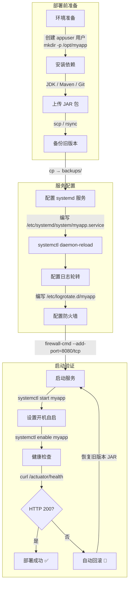

# Linux - 综合场景串联

---

**Linux 服务器部署 Spring Boot 应用的完整流程图：**



> 上图展示了 Linux 服务器上部署 Spring Boot 应用的完整流程：从环境准备、上传 JAR、备份旧版本，到配置 systemd 服务、日志轮转、防火墙，最后启动服务并通过健康检查验证部署结果，验证失败则自动回滚到上一版本。

---

## 场景一：部署一个 Java 应用并配置 systemd 服务

### 场景描述
从零开始在 Linux 服务器上部署一个 Spring Boot 应用，要求使用 systemd 管理服务生命周期，配置日志轮转，设置防火墙规则，确保服务器重启后应用自动启动。

### 涉及知识点
- [Linux 核心命令与 Shell 脚本](./01-Linux核心命令与Shell脚本.md)：文件操作、权限管理、Shell 脚本编写
- [Linux 系统管理与服务部署](./02-Linux系统管理与服务部署.md)：用户管理、systemd 服务配置、防火墙、日志轮转
- [Linux 笔面试题集](./03-Linux笔面试题集.md)：服务部署相关面试题和场景题

### 协作流程

第一步：环境准备（用户与目录）
- 创建专用应用用户：`useradd -m appuser`
- 创建应用目录：`mkdir -p /opt/myapp`，设置权限：`chown -R appuser:appuser /opt/myapp`
- 上传 jar 包到 `/opt/myapp/app.jar`

第二步：编写 systemd 服务文件
- 创建 `/etc/systemd/system/myapp.service`，配置 User、WorkingDirectory、ExecStart、Restart 等
- 设置 JVM 参数：`-Xms512m -Xmx1024m`
- 重载 systemd：`systemctl daemon-reload`

第三步：配置日志轮转
- 创建 `/etc/logrotate.d/myapp`，配置日志文件路径、轮转策略（按天/按大小）、保留份数
- 验证配置：`logrotate -d /etc/logrotate.d/myapp`

第四步：配置防火墙
- 开放应用端口：`firewall-cmd --add-port=8080/tcp --permanent`，然后 `firewall-cmd --reload`
- 确认数据库端口（如 3306）仅对内网开放，不对外暴露

第五步：启动与验证
- 启动服务：`systemctl start myapp`
- 启用开机自启：`systemctl enable myapp`
- 检查状态：`systemctl status myapp`
- 查看日志：`journalctl -u myapp -f`
- 验证访问：`curl http://localhost:8080/actuator/health`

### 关键要点
- 不要以 root 用户运行应用，创建专用 appuser 降低安全风险
- 使用 `kill -15`（SIGTERM）而非 `kill -9`（SIGKILL），让应用优雅关闭
- 必须设置 JVM 内存限制，防止 OOM Killer 杀死进程
- 部署完成后不要忘记 `systemctl enable`，否则重启后服务不会自动启动
- nohup.out 会无限增长，使用 systemd 的 journal 或重定向到日志文件

### 完整示例代码：Shell 脚本自动化部署

以下脚本实现 Spring Boot 项目的完整自动化部署流程：本地打包、上传到服务器、备份旧版本、重启服务、健康检查。

#### 步骤一：本地打包与上传脚本 (deploy.sh)

```bash
#!/bin/bash
# ============================================================
# 脚本名称: deploy.sh
# 功能描述: 本地打包 + 上传到远程服务器 + 触发远程部署
# 使用方式: ./deploy.sh [环境标识，默认 prod]
# 依赖:     Maven/Gradle 已安装，ssh 免密登录已配置
# ============================================================

set -euo pipefail

# ========== 配置区（按项目修改） ==========
PROJECT_DIR="/path/to/your/project"          # 本地项目根目录
REMOTE_HOST="192.168.1.100"                   # 远程服务器 IP
REMOTE_USER="appuser"                         # 远程服务器用户
REMOTE_DIR="/opt/myapp"                       # 远程应用目录
APP_NAME="myapp"                              # 应用名称
JAR_NAME="${APP_NAME}.jar"                    # JAR 包名称
ENV="${1:-prod}"                              # 环境标识，默认 prod

# ========== 颜色输出 ==========
RED='\033[0;31m'
GREEN='\033[0;32m'
YELLOW='\033[1;33m'
NC='\033[0m' # No Color

log_info()  { echo -e "${GREEN}[INFO]${NC}  $(date '+%Y-%m-%d %H:%M:%S') $*"; }
log_warn()  { echo -e "${YELLOW}[WARN]${NC}  $(date '+%Y-%m-%d %H:%M:%S') $*"; }
log_error() { echo -e "${RED}[ERROR]${NC} $(date '+%Y-%m-%d %H:%M:%S') $*"; }

# ========== 步骤 1：本地编译打包 ==========
log_info "开始编译打包，环境: ${ENV}..."

cd "${PROJECT_DIR}" || { log_error "项目目录不存在: ${PROJECT_DIR}"; exit 1; }

# 跳过测试，按环境打包
mvn clean package -DskipTests -P"${ENV}" -q

if [ ! -f "target/${JAR_NAME}" ]; then
    log_error "编译失败，未找到 target/${JAR_NAME}"
    exit 1
fi

log_info "编译打包成功 => target/${JAR_NAME}"

# ========== 步骤 2：上传 JAR 包到远程服务器 ==========
log_info "上传 JAR 包到 ${REMOTE_HOST}..."

scp "target/${JAR_NAME}" "${REMOTE_USER}@${REMOTE_HOST}:${REMOTE_DIR}/${JAR_NAME}.new"

if [ $? -ne 0 ]; then
    log_error "上传失败，请检查网络和 SSH 配置"
    exit 1
fi

log_info "JAR 包上传成功"

# ========== 步骤 3：远程执行部署脚本 ==========
log_info "触发远程部署..."

ssh "${REMOTE_USER}@${REMOTE_HOST}" "bash ${REMOTE_DIR}/remote-deploy.sh"

if [ $? -eq 0 ]; then
    log_info "远程部署完成！"
else
    log_error "远程部署失败，请登录服务器检查日志"
    exit 1
fi
```

#### 步骤二：远程服务器部署脚本 (remote-deploy.sh)

```bash
#!/bin/bash
# ============================================================
# 脚本名称: remote-deploy.sh
# 功能描述: 在远程服务器上执行：备份旧版本 -> 替换 JAR -> 重启服务 -> 健康检查
# 存放位置: /opt/myapp/remote-deploy.sh
# 调用方式: 由 deploy.sh 通过 SSH 远程触发
# ============================================================

set -euo pipefail

# ========== 配置区 ==========
APP_DIR="/opt/myapp"                           # 应用根目录
JAR_NAME="myapp.jar"                           # JAR 包文件名
SERVICE_NAME="myapp"                           # systemd 服务名
BACKUP_DIR="${APP_DIR}/backups"                # 备份目录
LOG_DIR="${APP_DIR}/logs"                      # 日志目录
HEALTH_URL="http://localhost:8080/actuator/health"  # 健康检查地址
MAX_BACKUPS=10                                 # 最大保留备份数量
STARTUP_TIMEOUT=120                            # 启动超时时间（秒）

# ========== 颜色输出 ==========
RED='\033[0;31m'
GREEN='\033[0;32m'
YELLOW='\033[1;33m'
NC='\033[0m'

log_info()  { echo -e "${GREEN}[INFO]${NC}  $(date '+%Y-%m-%d %H:%M:%S') $*"; }
log_warn()  { echo -e "${YELLOW}[WARN]${NC}  $(date '+%Y-%m-%d %H:%M:%S') $*"; }
log_error() { echo -e "${RED}[ERROR]${NC} $(date '+%Y-%m-%d %H:%M:%S') $*"; }

# ========== 步骤 1：检查新 JAR 包是否已上传 ==========
if [ ! -f "${APP_DIR}/${JAR_NAME}.new" ]; then
    log_error "未找到新 JAR 包: ${APP_DIR}/${JAR_NAME}.new"
    exit 1
fi

log_info "检测到新 JAR 包，开始部署..."

# ========== 步骤 2：备份当前版本 ==========
log_info "备份当前版本..."

mkdir -p "${BACKUP_DIR}"

if [ -f "${APP_DIR}/${JAR_NAME}" ]; then
    BACKUP_NAME="${JAR_NAME%.jar}_$(date '+%Y%m%d_%H%M%S').jar"
    cp "${APP_DIR}/${JAR_NAME}" "${BACKUP_DIR}/${BACKUP_NAME}"
    log_info "已备份至: ${BACKUP_DIR}/${BACKUP_NAME}"

    # 清理旧备份，只保留最近 MAX_BACKUPS 个
    BACKUP_COUNT=$(ls -1 "${BACKUP_DIR}"/*.jar 2>/dev/null | wc -l)
    if [ "${BACKUP_COUNT}" -gt "${MAX_BACKUPS}" ]; then
        log_info "清理旧备份（保留最近 ${MAX_BACKUPS} 个）..."
        ls -1t "${BACKUP_DIR}"/*.jar | tail -n +$((MAX_BACKUPS + 1)) | xargs rm -f
    fi
else
    log_warn "未找到旧 JAR 包，跳过备份（首次部署）"
fi

# ========== 步骤 3：替换 JAR 包 ==========
log_info "替换 JAR 包..."

mv "${APP_DIR}/${JAR_NAME}.new" "${APP_DIR}/${JAR_NAME}"
chmod 500 "${APP_DIR}/${JAR_NAME}"

log_info "JAR 包替换完成"

# ========== 步骤 4：重启服务 ==========
log_info "重启服务 ${SERVICE_NAME}..."

# 停止旧服务
if systemctl is-active --quiet "${SERVICE_NAME}"; then
    log_info "停止旧服务..."
    sudo systemctl stop "${SERVICE_NAME}"

    # 等待优雅关闭
    WAIT_COUNT=0
    while systemctl is-active --quiet "${SERVICE_NAME}" && [ "${WAIT_COUNT}" -lt 30 ]; do
        sleep 1
        WAIT_COUNT=$((WAIT_COUNT + 1))
    done

    if systemctl is-active --quiet "${SERVICE_NAME}"; then
        log_warn "优雅关闭超时，强制终止..."
        sudo systemctl kill "${SERVICE_NAME}"
    fi
fi

# 启动新服务
log_info "启动新服务..."
sudo systemctl start "${SERVICE_NAME}"

# ========== 步骤 5：健康检查 ==========
log_info "开始健康检查（最多等待 ${STARTUP_TIMEOUT} 秒）..."

ELAPSED=0
HEALTH_CHECK_INTERVAL=3

while [ "${ELAPSED}" -lt "${STARTUP_TIMEOUT}" ]; do
    # 先检查进程是否存活
    if ! systemctl is-active --quiet "${SERVICE_NAME}"; then
        log_error "服务启动失败，进程已退出"
        log_error "最近日志："
        sudo journalctl -u "${SERVICE_NAME}" -n 50 --no-pager
        exit 1
    fi

    # 检查健康接口
    HTTP_CODE=$(curl -s -o /dev/null -w "%{http_code}" --max-time 5 "${HEALTH_URL}" 2>/dev/null || echo "000")

    if [ "${HTTP_CODE}" == "200" ]; then
        log_info "健康检查通过！HTTP ${HTTP_CODE}"
        break
    fi

    sleep "${HEALTH_CHECK_INTERVAL}"
    ELAPSED=$((ELAPSED + HEALTH_CHECK_INTERVAL))

    if [ $((ELAPSED % 15)) -eq 0 ]; then
        log_info "等待应用启动中... 已等待 ${ELAPSED}s, HTTP状态码: ${HTTP_CODE}"
    fi
done

if [ "${ELAPSED}" -ge "${STARTUP_TIMEOUT}" ]; then
    log_error "健康检查超时！启动时间超过 ${STARTUP_TIMEOUT} 秒"
    log_error "最近日志："
    sudo journalctl -u "${SERVICE_NAME}" -n 100 --no-pager

    # 自动回滚
    log_warn "开始自动回滚到上一版本..."
    LATEST_BACKUP=$(ls -1t "${BACKUP_DIR}"/*.jar 2>/dev/null | head -1)
    if [ -n "${LATEST_BACKUP}" ]; then
        cp "${LATEST_BACKUP}" "${APP_DIR}/${JAR_NAME}"
        sudo systemctl restart "${SERVICE_NAME}"
        log_info "已回滚到: ${LATEST_BACKUP}"
    else
        log_error "无可用备份，无法自动回滚！"
    fi
    exit 1
fi

# ========== 步骤 6：部署完成确认 ==========
log_info "============================================"
log_info "部署成功！"
log_info "  应用目录: ${APP_DIR}"
log_info "  JAR 文件: ${APP_DIR}/${JAR_NAME}"
log_info "  服务状态: $(systemctl is-active "${SERVICE_NAME}")"
log_info "  健康检查: ${HEALTH_URL}"
log_info "============================================"

# 显示最近 20 行日志
sudo journalctl -u "${SERVICE_NAME}" -n 20 --no-pager
```

#### 步骤三：systemd 服务配置文件 (/etc/systemd/system/myapp.service)

```ini
[Unit]
Description=MyApp Spring Boot Application
After=network.target

[Service]
Type=simple
User=appuser
Group=appuser
WorkingDirectory=/opt/myapp
ExecStart=/usr/bin/java \
    -Xms512m \
    -Xmx1024m \
    -XX:+UseG1GC \
    -XX:MaxGCPauseMillis=200 \
    -XX:+HeapDumpOnOutOfMemoryError \
    -XX:HeapDumpPath=/opt/myapp/logs/heapdump.hprof \
    -Duser.timezone=Asia/Shanghai \
    -Dspring.profiles.active=prod \
    -jar /opt/myapp/myapp.jar
ExecStop=/bin/kill -15 $MAINPID
Restart=on-failure
RestartSec=10
StandardOutput=journal
StandardError=journal
SyslogIdentifier=myapp

# 优雅关闭
TimeoutStopSec=30
KillMode=mixed
KillSignal=SIGTERM

# 限制
LimitNOFILE=65536
LimitNPROC=4096

[Install]
WantedBy=multi-user.target
```

#### 步骤四：日志轮转配置 (/etc/logrotate.d/myapp)

```conf
/opt/myapp/logs/*.log {
    daily                   # 每天轮转
    rotate 30               # 保留 30 份
    missingok               # 日志文件不存在时不报错
    notifempty              # 空文件不轮转
    compress                # 压缩旧日志
    delaycompress           # 延迟压缩（保留最近一份不压缩）
    copytruncate            # 复制后截断（不中断应用写日志）
    dateext                 # 使用日期作为后缀
    dateformat -%Y%m%d
    maxsize 100M            # 超过 100M 强制轮转
}
```

#### 步骤五：一键部署命令速查

```bash
# ========== 首次部署准备（仅执行一次） ==========
# 1. 创建目录结构
ssh appuser@192.168.1.100 "mkdir -p /opt/myapp/{logs,backups}"

# 2. 上传脚本和配置文件
scp remote-deploy.sh appuser@192.168.1.100:/opt/myapp/
scp myapp.service appuser@192.168.1.100:/tmp/
scp myapp-logrotate appuser@192.168.1.100:/tmp/

# 3. 安装 systemd 服务和日志轮转
ssh appuser@192.168.1.100 "\
    sudo mv /tmp/myapp.service /etc/systemd/system/ && \
    sudo mv /tmp/myapp-logrotate /etc/logrotate.d/myapp && \
    sudo systemctl daemon-reload && \
    sudo systemctl enable myapp"

# 4. 开放防火墙端口
ssh appuser@192.168.1.100 "sudo firewall-cmd --add-port=8080/tcp --permanent && sudo firewall-cmd --reload"

# ========== 日常部署 ==========
# 一键部署（本地执行）
./deploy.sh prod

# 仅部署到测试环境
./deploy.sh test

# ========== 运维命令 ==========
# 查看服务状态
ssh appuser@192.168.1.100 "systemctl status myapp"

# 查看实时日志
ssh appuser@192.168.1.100 "journalctl -u myapp -f"

# 手动回滚到指定备份
ssh appuser@192.168.1.100 "cp /opt/myapp/backups/myapp_20260701_120000.jar /opt/myapp/myapp.jar && sudo systemctl restart myapp"

# 查看备份列表
ssh appuser@192.168.1.100 "ls -lh /opt/myapp/backups/"
```

---

## 场景二：排查线上服务器 CPU 飙高问题

### 场景描述
线上服务器突然 CPU 使用率飙升至 90% 以上，应用响应变慢，需要快速定位问题根源并恢复服务。

### 涉及知识点
- [Linux 核心命令与 Shell 脚本](./01-Linux核心命令与Shell脚本.md)：top/ps/find/grep/awk 等命令使用
- [Linux 系统管理与服务部署](./02-Linux系统管理与服务部署.md)：进程管理、系统监控、性能分析
- [Linux 笔面试题集](./03-Linux笔面试题集.md)：性能排查相关面试题和场景题

### 协作流程

第一步：快速定位问题进程
- 使用 `top` 或 `htop` 查看 CPU 使用率最高的进程
- 按 `P`（top）或点击 CPU 列（htop）排序，确认是哪个 Java 进程

第二步：深入分析进程内部线程
- 获取 Java 进程 PID：`ps aux | grep java`
- 查看该进程内 CPU 最高的线程：`top -H -p <PID>`
- 记录高 CPU 线程的 TID（十进制）

第三步：获取线程堆栈
- 将 TID 转换为十六进制：`printf '%x\n' <TID>`
- 导出线程堆栈：`jstack <PID> > jstack.log`
- 在 jstack.log 中搜索十六进制 TID，定位具体代码位置

第四步：分析系统层面指标
- 检查内存和 swap：`free -h`，确认是否因 swap 导致性能下降
- 检查磁盘 I/O：`iostat -x 1`，确认是否存在 I/O 等待
- 检查网络连接：`ss -s` 和 `netstat -antp | grep <PID>`，确认是否有大量连接
- 检查 GC 情况：`jstat -gcutil <PID> 1000`，确认是否频繁 Full GC

第五步：收集并分析日志
- 查看应用日志：`tail -f /opt/myapp/logs/app.log`，搜索 ERROR 和异常堆栈
- 查看系统日志：`journalctl -u myapp --since "10 minutes ago"`
- 使用 `grep` 和 `awk` 统计高频错误：`grep "ERROR" app.log | awk '{print $NF}' | sort | uniq -c | sort -rn`

第六步：临时恢复与根治
- 临时方案：如果确认是代码死循环或内存泄漏，先重启服务 `systemctl restart myapp`
- 保留现场：重启前导出 heap dump：`jmap -dump:format=b,file=heap.hprof <PID>`
- 根治方案：根据堆栈信息修复代码，优化 SQL 查询，调整 JVM 参数

### 关键要点
- 先定位问题再恢复，不要盲目重启，否则可能丢失现场
- 使用 `top -H -p` 定位到线程级别，再结合 `jstack` 找到具体代码
- 排查 CPU 问题时不要忽略 GC、I/O 等待、网络连接数等间接因素
- 重启前保留 heap dump 和线程堆栈，便于事后分析
- 建立日常监控（CPU、内存、GC、磁盘），在问题发生前预警

---

> [返回模块目录](../../README.md) | [返回知识导览](../../知识导览.md)