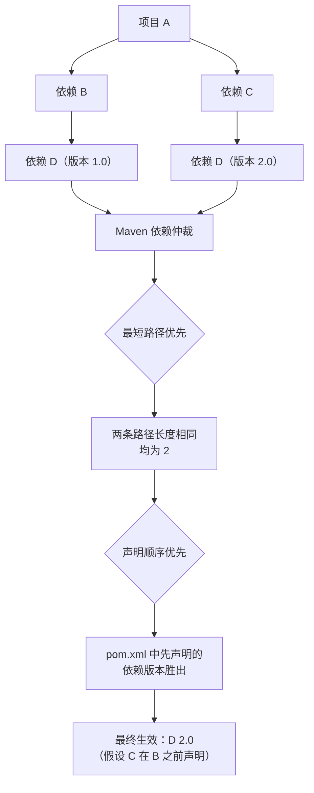
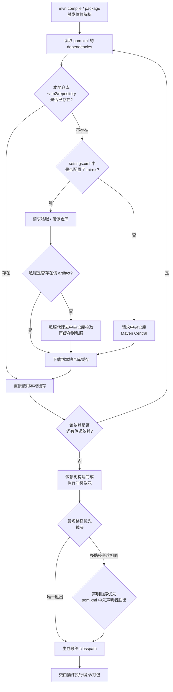

# Maven 核心原理与依赖管理

> 学习路线对应：补充模块 -- Maven 构建工具
> 前置知识：Java 基础、Spring Boot 项目结构
> 预计学习时间：3-4 小时
> 对比 Node.js：Maven 约等于 pnpm，pom.xml 约等于 package.json，GAV 坐标约等于 包名@版本

---

## 一、核心概念

### 1.1 Maven 是什么

Maven 是 Apache 基金会推出的 Java 项目管理与构建工具。它通过一个名为 POM（Project Object Model）的 XML 文件描述项目，统一了项目的构建、依赖管理、文档生成和发布流程。

在 Node.js 生态中，依赖与脚本由 package.json 描述，由 pnpm/npm 解析；在 Java 生态中，这部分职责由 pom.xml 加 Maven 来承担。两者的关键差异在于：Maven 把构建过程抽象为固定的生命周期（lifecycle），插件绑定到具体阶段执行，开发者主要做声明而非编写脚本。

> **生活化类比：Maven 是厨房管理系统** —— 把 Maven 想象成一家餐厅的厨房管理系统：POM 是菜单与配方书，依赖仓库是食材仓库（中央仓库=大型批发市场、私服=店内冷库、本地仓库=操作台），生命周期是出菜流程（备料→切配→烹饪→装盘→上桌），插件是各岗位厨师（编译插件=主厨、测试插件=质检员、打包插件=包装工）。开发者只需要写菜单（声明依赖与配置），不用亲自下厨执行每一步。

Maven 解决的核心问题：

- 依赖管理：自动下载并解析第三方库及其传递依赖，不必手动拷贝 jar 包
- 构建标准化：约定优于配置，统一目录结构与构建命令
- 项目信息：集中描述项目坐标、开发者、许可证、SCM 地址等元数据

### 1.2 坐标体系（GAV）

Maven 用一组三元组唯一定位世界上任何一个构件（artifact），称为 GAV 坐标：

| 坐标元素 | 含义 | 类比 |
|----------|------|------|
| groupId | 组织/公司反向域名 | npm 的 scope（@spring-boot） |
| artifactId | 项目/模块名 | npm 的包名 |
| version | 版本号 | npm 的 version |

```xml
<dependency>
    <groupId>org.springframework.boot</groupId>
    <artifactId>spring-boot-starter-web</artifactId>
    <version>3.2.0</version>
</dependency>
```

版本分为 RELEASE（正式版）与 SNAPSHOT（快照版）。SNAPSHOT 表示"开发中，随时会变"，Maven 会定期拉取最新快照；RELEASE 一旦发布即不可变。这一约定直接决定了私服中 hosted 仓库要按 releases 与 snapshots 分开存储。

### 1.3 POM 结构详解

POM 是 Maven 的工作对象。一个最小可用的 pom.xml 如下：

```xml
<project xmlns="http://maven.apache.org/POM/4.0.0">
    <modelVersion>4.0.0</modelVersion>

    <groupId>com.ljit</groupId>
    <artifactId>order-service</artifactId>
    <version>1.0.0</version>
    <packaging>jar</packaging>

    <properties>
        <maven.compiler.source>17</maven.compiler.source>
        <maven.compiler.target>17</maven.compiler.target>
        <project.build.sourceEncoding>UTF-8</project.build.sourceEncoding>
    </properties>

    <dependencies>
        <dependency>
            <groupId>org.springframework.boot</groupId>
            <artifactId>spring-boot-starter-web</artifactId>
            <version>3.2.0</version>
        </dependency>
    </dependencies>
</project>
```

各核心元素职责：

| 元素 | 作用 | 说明 |
|------|------|------|
| modelVersion | POM 模型版本 | 当前固定为 4.0.0 |
| groupId | 组织坐标 | 反向域名，如 com.ljit |
| artifactId | 模块坐标 | 项目名，唯一标识 |
| version | 版本 | RELEASE 或 SNAPSHOT |
| packaging | 打包类型 | jar / war / pom / ear，默认 jar |
| properties | 属性占位 | 定义版本号变量，集中管理 |
| dependencies | 依赖列表 | 项目所需第三方库 |
| dependencyManagement | 依赖版本管理 | 只声明版本，不实际引入 |
| build | 构建配置 | 插件、资源、最终产物名 |
| parent | 父 POM | 继承父项目配置 |
| modules | 子模块列表 | 聚合子模块 |
| profiles | 环境配置 | 多环境隔离 |

> **生活化类比：POM 就像一份菜谱** —— 一份完整的菜谱必须写清楚：菜名（artifactId）、所属菜系（groupId）、第几版改良配方（version）、成品形态是装盘菜还是半成品料包（packaging）、需要的常备调料清单（properties）、食材采购清单（dependencies）、关键步骤说明（build）。一份菜谱对应一道菜，谁拿到都能做出同样的成品——这就是 POM"声明式"的核心价值。

> 📖 **参考链接**：
> - [Maven - Introduction to the POM](https://maven.apache.org/guides/introduction/introduction-to-the-pom.html) -- POM 简介
> - [Maven - POM Reference](https://maven.apache.org/pom.html) -- POM 完整元素参考
> - [Maven - Introduction to the Build Lifecycle](https://maven.apache.org/guides/introduction/introduction-to-the-lifecycle.html) -- 生命周期介绍

### 1.4 约定优于配置

Maven 规定了一套标准目录结构，只要把代码放对位置，就无需在 pom.xml 里显式声明源码路径。这是 Maven 与早期 Ant（一切靠 build.xml 手写）的根本区别。

```
order-service/
├── pom.xml
├── src/
│   ├── main/
│   │   ├── java/          编译后进入 classpath
│   │   └── resources/     配置文件，打包进 jar
│   └── test/
│       ├── java/          测试代码
│       └── resources/     测试资源
└── target/                构建产物输出目录（自动生成）
```

对应到 Maven 的默认行为：`src/main/java` 的源码由 maven-compiler-plugin 编译到 `target/classes`；`src/test/java` 编译到 `target/test-classes`；打包结果落入 `target/`。开发者无需关心这些路径，遵循约定即可。

> 📖 **参考链接**：
> - [Maven - Introduction to the Standard Directory Layout](https://maven.apache.org/guides/introduction/introduction-to-the-standard-directory-layout.html) -- 标准目录布局介绍

---

## 二、底层原理

### 2.1 依赖管理机制

> **生活化类比：依赖管理就像图书馆借阅** —— Maven 的依赖管理机制非常像图书馆的借阅体系：本地仓库（`~/.m2/repository`）是你自家的书架，私服是单位内部的图书馆，中央仓库是国家级公共图书馆。当你在 POM 里登记借某本书（声明依赖），系统先查自家书架有没有；没有就去单位图书馆找；还没有就向国家图书馆发出"调拨请求"（远程下载），调拨回来后会在自家书架放一份副本（缓存）。传递依赖则相当于"这本书附带的参考资料"——借书时连带把附录资料一起借过来。

#### 传递依赖

当 A 依赖 B，B 依赖 C，则 A 自动获得 C，这就是传递依赖。Maven 会递归解析依赖树，把所有传递依赖一并下载。这正是 Spring Boot Starter 能"引入一个包拉起一整套库"的底层机制。

传递依赖并非无脑全收，它受 scope 与传递性规则约束：

| 第一依赖（A→B） \ 第二依赖（B→C） | compile | test | provided | runtime |
|-----------------------------------|---------|------|----------|---------|
| compile | compile | - | - | runtime |
| test | test | - | - | test |
| provided | provided | - | provided | provided |
| runtime | runtime | - | - | runtime |

记忆要点：test 与 provided 类型的依赖不会继续传递；compile 依赖 compile 才保持 compile，遇到 runtime 会"降级"为 runtime。

#### 依赖范围 scope

scope 决定依赖在何种 classpath 下可用，直接影响打包与测试：

| scope | 编译 | 测试 | 运行 | 打包 | 典型场景 |
|-------|:--:|:--:|:--:|:--:|------|
| compile（默认） | 是 | 是 | 是 | 是 | 通用依赖 |
| test | 否 | 是 | 否 | 否 | JUnit、Mockito |
| provided | 是 | 是 | 否 | 否 | Servlet API（容器提供） |
| runtime | 否 | 是 | 是 | 是 | JDBC 驱动 |
| system | 是 | 是 | 否 | 否 | 本地 systemPath（不推荐） |
| import | - | - | - | - | 导入另一 POM 的 dependencyManagement |

#### 依赖排除 exclusions

当传递依赖引入了不想要或冲突的库，用 exclusions 把它剔除：

```xml
<dependency>
    <groupId>org.springframework.boot</groupId>
    <artifactId>spring-boot-starter-web</artifactId>
    <version>3.2.0</version>
    <exclusions>
        <exclusion>
            <groupId>org.springframework.boot</groupId>
            <artifactId>spring-boot-starter-tomcat</artifactId>
        </exclusion>
    </exclusions>
</dependency>
```

上面的写法把 Spring Boot 默认内嵌的 Tomcat 排除，常用于切换为 Undertow 或 Jetty。

#### 依赖冲突解决

当多条路径引入同一个 artifact 的不同版本时，Maven 按两条规则裁决：

1. 最短路径优先：依赖树中离当前项目越近的版本胜出
2. 声明顺序优先：路径长度相同时，pom.xml 中先声明的那个版本胜出

假设路径为：项目 → A → B(1.0)，项目 → C → B(2.0)，两条路径长度都是 2，那么谁在 pom.xml 先声明，谁生效。若项目直接声明 B，则直接声明（路径长度 1）必然胜出，这也是强制指定版本的常用手段。



> 上图展示了 Maven 依赖冲突的典型场景：项目 A 同时依赖 B 和 C，B 传递依赖 D 1.0，C 传递依赖 D 2.0。由于两条传递路径长度相同（均为 2），Maven 无法通过最短路径优先规则裁决，转而使用声明顺序优先规则——pom.xml 中先声明的依赖所引用的版本最终胜出。在实际项目中，推荐在父 POM 的 dependencyManagement 中显式锁定版本号，避免依赖声明顺序带来的不确定性。

下面这张图描述的是 Maven 解析一条依赖时的整体流程：从本地仓库查找到远程仓库下载、再到传递依赖递归解析与最终冲突裁决的全过程。



> 这张依赖解析流程图揭示了一个常被忽略的事实：Maven 的依赖解析是"深度优先 + 缓存优先"的过程。任何一个传递依赖的缺失都会触发远程下载，这也是为什么第一次 `mvn package` 很慢、后续构建明显加速的原因——所有构件已经被缓存到本地仓库。理解这一点后，CI 环境中通常会用 Nexus 做内部代理来加速拉取，并避免开发机断网时构建失败。

> 📖 **参考链接**：
> - [Maven - Introduction to the Dependency Mechanism](https://maven.apache.org/guides/introduction/introduction-to-dependency-mechanism.html) -- 依赖机制简介（传递依赖、scope、冲突）
> - [Maven - Dependency Resolution](https://maven.apache.org/guides/introduction/introduction-to-dependency-mechanism.html#Dependency_Resolution) -- 依赖解析过程详解

### 2.2 生命周期

Maven 把构建抽象为三套互相独立的生命周期，每套包含若干有序的阶段（phase）。执行某个 phase 时，该 phase 之前的所有 phase 都会依次执行。

| 生命周期 | 主要阶段 | 用途 |
|----------|----------|------|
| clean | pre-clean、clean、post-clean | 清理 target 产物 |
| default | validate、compile、test、package、verify、install、deploy | 核心构建流程 |
| site | pre-site、site、post-site、site-deploy | 生成项目站点文档 |

default 生命周期完整阶段（节选关键的）：

```
validate -> compile -> test -> package -> verify -> install -> deploy
```

- compile：编译 src/main/java
- test：运行单元测试
- package：打包成 jar/war
- install：安装到本地仓库 ~/.m2/repository
- deploy：发布到远程仓库（私服）

理解"阶段绑定插件 goal"是关键：phase 本身不做任何事，真正干活的是绑定到该 phase 的插件目标（goal）。例如 compile 阶段默认绑定 maven-compiler-plugin 的 compile 目标。

> **生活化类比：生命周期就像工厂流水线** —— 把 Maven 的生命周期想象成工厂流水线：每个 phase 是流水线的一个工位（清洗→组装→测试→打包→入库→出库），每个工位本身不干活，真正干活的是绑在该工位的工人（插件 goal）。`mvn package` 就像"跑到测试工位"，但因为流水线有序——你必须先做完前面所有工位（compile、test），Maven 会自动从最开头开始执行。三套生命周期（clean / default / site）相当于三条独立的流水线，互不干扰。

> 📖 **参考链接**：
> - [Maven - Lifecycle Reference](https://maven.apache.org/guides/introduction/introduction-to-the-lifecycle.html#Lifecycle_Reference) -- 生命周期阶段参考
> - [Maven - Built-in Lifecycle Bindings](https://maven.apache.org/guides/introduction/introduction-to-the-lifecycle.html#Built-in_Lifecycle_Bindings) -- 默认阶段与插件绑定

### 2.3 插件机制

Maven 的所有动作都由插件完成，生命周期只是把插件 goal 串起来的骨架。一个插件是一组 goal 的集合。

```xml
<build>
    <plugins>
        <plugin>
            <groupId>org.apache.maven.plugins</groupId>
            <artifactId>maven-compiler-plugin</artifactId>
            <version>3.11.0</version>
            <configuration>
                <source>17</source>
                <target>17</target>
            </configuration>
            <executions>
                <execution>
                    <phase>compile</phase>
                    <goals>
                        <goal>compile</goal>
                    </goals>
                </execution>
            </executions>
        </plugin>
    </plugins>
</build>
```

| 配置项 | 作用 |
|--------|------|
| configuration | 插件参数（source/target 版本等） |
| executions | 一个插件可绑定多个 execution，每个绑定到不同 phase/goal |
| goal | 插件的具体目标，如 compile、test、jar |

常用内置插件：maven-compiler-plugin（编译）、maven-surefire-plugin（测试）、maven-jar-plugin（打包）、maven-install-plugin（安装）、maven-deploy-plugin（发布）、maven-clean-plugin（清理）、maven-site-plugin（站点）。

> 📖 **参考链接**：
> - [Maven - Guide to Configuring Plug-ins](https://maven.apache.org/guides/mini/guide-configuring-plugins.html) -- 插件配置指南
> - [Maven - Plugin Development Center](https://maven.apache.org/plugin-developers/index.html) -- 插件开发文档

### 2.4 聚合与继承

多模块项目里，聚合和继承是两个常被混淆的概念：

- 聚合：父 POM 的 packaging 为 pom，通过 modules 列出子模块，执行 `mvn install` 时一次性构建所有子模块
- 继承：子模块通过 parent 引用父 POM，复用父 POM 的 properties、dependencyManagement、pluginManagement、build 等配置

聚合与继承通常合并在同一个父 POM 中，但本质不同：聚合解决"一起构建"，继承解决"配置复用"。

父 POM 示例：

```xml
<project>
    <modelVersion>4.0.0</modelVersion>
    <groupId>com.ljit</groupId>
    <artifactId>ljit-parent</artifactId>
    <version>1.0.0</version>
    <packaging>pom</packaging>

    <modules>
        <module>order-api</module>
        <module>order-service</module>
        <module>order-common</module>
    </modules>

    <properties>
        <spring-boot.version>3.2.0</spring-boot.version>
    </properties>

    <dependencyManagement>
        <dependencies>
            <dependency>
                <groupId>org.springframework.boot</groupId>
                <artifactId>spring-boot-dependencies</artifactId>
                <version>${spring-boot.version}</version>
                <type>pom</type>
                <scope>import</scope>
            </dependency>
        </dependencies>
    </dependencyManagement>
</project>
```

子模块 POM：

```xml
<project>
    <modelVersion>4.0.0</modelVersion>

    <parent>
        <groupId>com.ljit</groupId>
        <artifactId>ljit-parent</artifactId>
        <version>1.0.0</version>
    </parent>

    <artifactId>order-service</artifactId>

    <dependencies>
        <!-- 只需声明坐标，无需 version，版本由父 POM 的 dependencyManagement 控制 -->
        <dependency>
            <groupId>org.springframework.boot</groupId>
            <artifactId>spring-boot-starter-web</artifactId>
        </dependency>
    </dependencies>
</project>
```

dependencyManagement 只声明版本、不实际引入依赖；子模块显式声明依赖时若不写 version，则沿用父 POM 管理的版本。这是消除多模块版本不一致的标准做法。上面用到的 `scope=import` + `type=pom`，是把 spring-boot-dependencies 的整套版本清单导入当前 dependencyManagement，省去逐个声明版本。

> **生活化类比：聚合与继承就像连锁餐饮** —— 聚合相当于"集团统一采购"：集团总部（父 POM）下订单，所有分店（子模块）的食材一次性配送到位，一次操作全部完成。继承相当于"品牌标准手册"：总部把核心配方、统一采购价、装修标准写入手册（父 POM 的 dependencyManagement / pluginManagement），所有分店直接套用，不允许私自更换。两者经常同时出现（总部既是配送中心又是标准制定者），但概念是分开的——你完全可以只做统一配送不规定配方（只聚合不继承），或只发手册不统一配送（只继承不聚合）。

> 📖 **参考链接**：
> - [Maven - Guide to Working with Multiple Modules](https://maven.apache.org/guides/mini/guide-multiple-modules.html) -- 多模块项目指南
> - [Maven - Introduction to the POM (Project Inheritance)](https://maven.apache.org/guides/introduction/introduction-to-the-pom.html#Project_Inheritance_vs_Project_Aggregation) -- 项目继承 vs 项目聚合

---

## 三、实战应用

### 3.1 创建 Maven 项目

用 Maven 自带的 archetype 插件生成一个基础工程：

```bash
mvn archetype:generate \
    -DgroupId=com.ljit \
    -DartifactId=order-service \
    -DarchetypeGroupId=org.apache.maven.archetypes \
    -DarchetypeArtifactId=maven-archetype-quickstart \
    -DinteractiveMode=false
```

生成的工程即可用标准命令构建：

```bash
mvn clean package        # 清理并打包
mvn clean install        # 打包并安装到本地仓库
mvn clean test           # 只跑测试
```

### 3.2 多模块项目搭建

一个典型的分层多模块工程：

```
ljit-cloud/
├── pom.xml              父 POM（packaging=pom，聚合+继承）
├── order-common/        公共实体、工具
├── order-api/           对外接口定义
└── order-service/       业务实现，依赖 order-common
```

父 POM 写 modules，子模块写 parent 引用。构建时在根目录执行一次 `mvn clean install`，Maven 会根据模块间依赖自动决定构建顺序（reactor 构建顺序），无需手动排序。

### 3.3 依赖冲突排查

定位"NoClassDefFoundError"或"NoSuchMethodError"类问题，核心工具是依赖树：

```bash
mvn dependency:tree
mvn dependency:tree -Dincludes=com.fasterxml.jackson.core:jackson-databind
mvn dependency:tree -Dverbose
```

- `-Dincludes` 过滤指定 artifact，快速定位它的来源路径
- `-Dverbose` 显示被冲突裁决丢弃的版本（omitted for conflict with）

实战排查流程：先用 `dependency:tree` 找出冲突 artifact 的多条引入路径，判断期望版本与实际生效版本，再用 exclusions 排除不想要版本，或在父 POM dependencyManagement 强制锁定版本。

IDEA 用户可用 Maven Helper 插件图形化查看冲突。

### 3.4 常用插件配置

打包时跳过测试、指定主类、打可执行 fat jar 是常见需求：

```xml
<build>
    <finalName>order-service</finalName>
    <plugins>
        <!-- 编译插件 -->
        <plugin>
            <groupId>org.apache.maven.plugins</groupId>
            <artifactId>maven-compiler-plugin</artifactId>
            <version>3.11.0</version>
            <configuration>
                <source>17</source>
                <target>17</target>
                <encoding>UTF-8</encoding>
            </configuration>
        </plugin>

        <!-- 单元测试插件：跳过测试 -->
        <plugin>
            <groupId>org.apache.maven.plugins</groupId>
            <artifactId>maven-surefire-plugin</artifactId>
            <version>3.2.2</version>
            <configuration>
                <skipTests>true</skipTests>
            </configuration>
        </plugin>

        <!-- Spring Boot 打包插件：生成可执行 fat jar -->
        <plugin>
            <groupId>org.springframework.boot</groupId>
            <artifactId>spring-boot-maven-plugin</artifactId>
            <version>3.2.0</version>
            <executions>
                <execution>
                    <goals>
                        <goal>repackage</goal>
                    </goals>
                </execution>
            </executions>
        </plugin>
    </plugins>
</build>
```

命令行临时覆盖参数也常用：`mvn clean package -DskipTests`、`mvn clean package -P prod`、`mvn clean install -pl order-service -am`（-pl 指定模块，-am 同时构建依赖模块）。

---

## 四、常见面试题

### 1. Maven 的依赖冲突解决规则是什么？

答案：Maven 用两条规则裁决同一 artifact 多版本冲突。第一是最短路径优先，依赖树中离当前项目越近的版本胜出；第二是声明顺序优先，当两条路径长度相同时，pom.xml 中先声明的依赖生效。若项目直接声明该依赖（路径长度为 1），则必然胜出。实际排查用 `mvn dependency:tree`，修复手段是用 exclusions 排除冲突版本，或在父 POM 的 dependencyManagement 中统一锁定版本。

### 2. dependencyManagement 与 dependencies 的区别？

答案：dependencies 是直接引入依赖，会实际加入 classpath；dependencyManagement 只声明版本，不引入依赖。子模块继承父 POM 后，引入对应依赖时若省略 version，会采用 dependencyManagement 管理的版本。它的价值是统一多模块版本，避免子模块各自写死版本号导致不一致。

### 3. Maven 的 scope 有哪些？test 和 provided 的区别？

答案：scope 有 compile、test、provided、runtime、system、import 六种。test 表示依赖只在测试编译和运行时可用，不打包进最终产物，典型如 JUnit；provided 表示编译和测试时可用，但运行时由运行环境提供，也不打包进产物，典型如 Servlet API（由 Tomcat 容器提供）。两者都不参与打包，区别在于 provided 参与编译 classpath，test 不参与。

### 4. 简述 Maven 三大生命周期。

答案：Maven 有三套独立生命周期。clean 负责清理 target 产物；default 是核心构建流程，包含 compile、test、package、install、deploy 等阶段；site 负责生成项目站点文档。三套生命周期相互独立，执行某个 phase 时该 phase 之前的所有 phase 会被依次执行，例如 `mvn package` 会触发 compile 与 test。真正执行工作的是绑定到 phase 的插件 goal。

### 5. 聚合和继承有什么区别？

答案：聚合解决"一起构建"，父 POM 通过 modules 列出子模块，一次命令构建所有模块；继承解决"配置复用"，子模块通过 parent 引用父 POM，复用 properties、dependencyManagement、pluginManagement 等配置。两者经常合并在同一个父 POM 中，但概念独立：一个项目可以只聚合不继承，也可以只继承不聚合。

---

## 五、避坑指南

| 常见错误 | 现象 | 原因 | 解决方案 |
|---------|------|------|---------|
| 传递依赖版本冲突 | NoSuchMethodError / NoClassDefFoundError | 多路径引入同一库不同版本，生效的不是预期版本 | `mvn dependency:tree -Dverbose` 查看被丢弃版本，用 exclusions 排除或在 dependencyManagement 锁定版本 |
| scope 配错导致打包膨胀 | jar 体积异常大 | 把 test/provided 依赖写成 compile，测试库被打进产物 | JUnit、Mockito 用 test；Servlet API 用 provided |
| SNAPSHOT 进生产 | 线上行为不确定 | SNAPSHOT 会被私服更新为最新构建，版本不固定 | 发布版本用 RELEASE，禁止生产依赖 SNAPSHOT |
| 子模块版本各自写死 | 多模块版本不一致 | 未用 dependencyManagement 统一管理 | 在父 POM 集中声明版本，子模块省略 version |
| 编码乱码 | 中文注释编译报错 | maven-compiler-plugin 未指定 UTF-8 | properties 中设 project.build.sourceEncoding=UTF-8，插件配 encoding |
| 忘记 parent 的 relativePath | 找不到父 POM | 子模块 parent 的 relativePath 默认为 ../pom.xml，目录不符 | 显式写 relativePath 或设空，配合 -N 在父目录安装 |

## 本章学习自检

完成本章学习后，应该能够：
- [ ] 用自己的话解释 GAV 坐标、POM 结构、约定优于配置、传递依赖、scope 六种取值、依赖冲突两条裁决规则
- [ ] 写出一个最小 pom.xml，搭建一个聚合+继承的多模块工程
- [ ] 用 `mvn dependency:tree` 排查依赖冲突并用 exclusions 或 dependencyManagement 修复
- [ ] 回答常见面试题（依赖冲突规则、dependencyManagement 区别、scope、三大生命周期、聚合与继承）
- [ ] 识别并避免常见错误（scope 误用、SNAPSHOT 进生产、版本不统一、编码乱码）

---

> **学习导航**：
> - 返回 [学习路线总览](../../README.md)
> - 本模块其他文件：[02-Maven私服与实战配置](./02-Maven私服与实战配置.md) | [03-Maven笔面试题集](./03-Maven笔面试题集.md)
> - 实战应用：[电商订单实时统计分析平台](../../extensions/project/01-电商订单实时统计分析平台.md)
