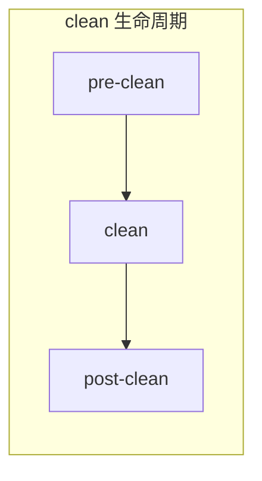
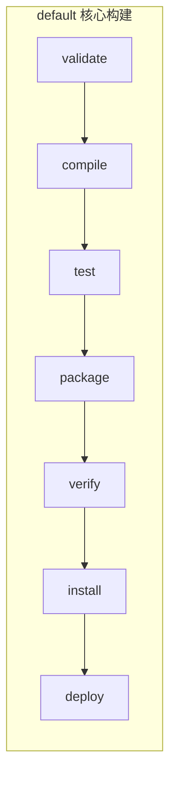
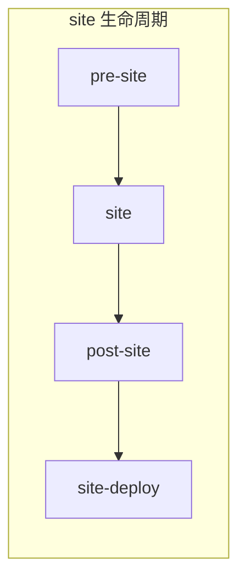

# Maven 笔面试题集

> 模块：16-maven（补充模块 Maven 构建工具）
> 覆盖：Maven 核心原理、依赖管理、私服配置、生命周期
> 题量：10 道选择题 + 5 道简答题
> 难度标注：★ 基础 / ★★ 中档 / ★★★ 拔高

---

## 一、选择题（10 题，每题附解析）

### 1. ★ Maven 中用于唯一定位一个构件（artifact）的三元组坐标是（ ）

A. groupId、artifactId、version
B. groupId、artifactId、packaging
C. name、version、url
D. artifactId、version、scope

**答案：A**

**解析：** Maven 用 groupId（组织反向域名）、artifactId（模块名）、version（版本）三个元素唯一定位构件，简称 GAV 坐标。packaging 是打包类型，scope 是依赖范围，均不属于定位坐标。

> 📖 **参考链接**：
> - [Maven - POM Maven Coordinates](https://maven.apache.org/pom.html#Maven_Coordinates) -- GAV 坐标官方说明

---

### 2. ★ pom.xml 中 modelVersion 元素的固定取值是（ ）

A. 3.0.0
B. 4.0.0
C. 5.0.0
D. 17.0.0

**答案：B**

**解析：** modelVersion 表示 POM 模型版本，当前固定为 4.0.0。它与 Java 版本无关，Maven 3 和 Maven 4 早期版本仍使用 4.0.0。

> 📖 **参考链接**：
> - [Maven - POM The Basics](https://maven.apache.org/pom.html#The_Basics) -- POM 基础元素说明

---

### 3. ★ Maven 默认的打包类型（packaging）是（ ）

A. war
B. pom
C. jar
D. ear

**答案：C**

**解析：** packaging 默认值为 jar。war 用于 Web 应用，pom 用于多模块父项目或 BOM，ear 用于企业级应用包。不显式声明 packaging 时打包结果为 jar。

> 📖 **参考链接**：
> - [Maven - POM Packaging](https://maven.apache.org/pom.html#Packaging) -- 打包类型说明

---

### 4. ★ 按照 Maven 约定优于配置原则，项目主源码应放在（ ）

A. src/main/resources
B. src/main/java
C. src/test/java
D. src/code

**答案：B**

**解析：** Maven 约定主源码位于 src/main/java，编译输出到 target/classes；测试源码位于 src/test/java；资源文件位于 src/main/resources。遵循约定即无需在 pom.xml 显式声明源码路径。

> 📖 **参考链接**：
> - [Maven - Introduction to the Standard Directory Layout](https://maven.apache.org/guides/introduction/introduction-to-the-standard-directory-layout.html) -- 标准目录布局

---

### 5. ★★ 下列依赖中，scope 应配置为 test 的是（ ）

A. spring-boot-starter-web
B. Servlet API
C. JUnit
D. MySQL JDBC 驱动

**答案：C**

**解析：** JUnit 仅在测试时使用，应配 test，不打包进产物。spring-boot-starter-web 是 compile；Servlet API 由容器提供，配 provided；JDBC 驱动运行时才需要，配 runtime。

> 📖 **参考链接**：
> - [Maven - Dependency Scope](https://maven.apache.org/guides/introduction/introduction-to-dependency-mechanism.html#Dependency_Scope) -- 依赖范围 scope 详解

---

### 6. ★★ 当项目中存在同一构件的多个版本时，Maven 依赖冲突的第一裁决规则是（ ）

A. 声明顺序优先
B. 最短路径优先
C. 版本号最大优先
D. 后声明优先

**答案：B**

**解析：** Maven 先按最短路径优先裁决，依赖树中离当前项目越近的版本胜出；当路径长度相同时，才按声明顺序优先，pom.xml 中先声明的版本生效。版本号大小不影响裁决结果。

> 📖 **参考链接**：
> - [Maven - Dependency Resolution](https://maven.apache.org/guides/introduction/introduction-to-dependency-mechanism.html#Dependency_Resolution) -- 依赖解析与冲突仲裁

---

**Maven 三套独立生命周期**

##### clean 生命周期



> clean 生命周期负责清理 target 构建产物，包含 pre-clean、clean、post-clean 三个阶段。

##### default 生命周期（核心构建）



> default 生命周期是核心构建流程，依次执行验证、编译、测试、打包、安装、部署。

##### site 生命周期



> 上图展示了 Maven 的三套独立生命周期：clean 负责清理产物、default 负责核心构建流程（编译到测试到打包到部署）、site 负责生成项目站点文档。三套生命周期相互独立，执行某套生命周期时不会触发其他生命周期，真正干活的是绑定到各阶段（phase）的插件目标（goal）。

### 7. ★★ 以下 default 生命周期阶段，执行顺序正确的是（ ）

A. compile → test → package → install → deploy
B. test → compile → package → deploy → install
C. compile → package → test → install → deploy
D. package → compile → test → install → deploy

**答案：A**

**解析：** default 生命周期的关键阶段顺序为 validate → compile → test → package → verify → install → deploy。执行某阶段时其前的所有阶段都会依次执行，因此 test 在 compile 之后、package 之前。

> 📖 **参考链接**：
> - [Maven - Lifecycle Reference](https://maven.apache.org/guides/introduction/introduction-to-the-lifecycle.html#Lifecycle_Reference) -- 生命周期阶段参考

---

### 8. ★★ Nexus 中用于聚合多个仓库、对外暴露统一访问地址的仓库类型是（ ）

A. proxy
B. hosted
C. group
D. virtual

**答案：C**

**解析：** group 仓库把多个 proxy 和 hosted 仓库聚合为一个统一入口，客户端只需配置该地址即可同时访问公共构件与内部构件。proxy 代理远程仓库，hosted 托管内部构件。

> 📖 **参考链接**：
> - [Sonatype Nexus - Repository Management](https://help.sonatype.com/repomanager3/nexus-repository-administration/formats/maven-repositories) -- Nexus Maven 仓库管理

---

### 9. ★★★ settings.xml 中 mirror 的 mirrorOf 配置为 * 会带来的问题是（ ）

A. 无法访问中央仓库
B. 所有仓库请求都被重定向到镜像，包括私服，可能拉取不到内部构件
C. Maven 无法离线工作
D. 本地仓库失效

**答案：B**

**解析：** mirrorOf=* 会拦截所有仓库请求并重定向到镜像地址，包括 pom.xml 中自定义的私服 repository，导致内部构件被错误地重定向到镜像而拉取失败。正确做法是限定为 central，或用 `*,!nexus-public` 排除私服仓库。

> 📖 **参考链接**：
> - [Maven - Guide to Mirror Settings](https://maven.apache.org/guides/mini/guide-mirror-settings.html) -- 镜像配置指南

---

### 10. ★★★ 关于 scope 取值，下列说法正确的是（ ）

A. provided 依赖会打包进最终产物
B. test 依赖参与主代码编译
C. runtime 依赖参与编译 classpath
D. import 仅用于 dependencyManagement，导入另一 POM 的依赖管理

**答案：D**

**解析：** import 专用于 dependencyManagement，配合 type=pom 把另一 POM 的整套版本管理导入当前项目，如导入 spring-boot-dependencies。provided 不打包（由环境提供）；test 不参与主代码编译；runtime 不参与编译 classpath，只在运行时与测试时可用。

> 📖 **参考链接**：
> - [Maven - Dependency Management import](https://maven.apache.org/guides/introduction/introduction-to-dependency-mechanism.html#Importing_Dependencies) -- import scope 用法

---

## 二、简答题（5 题，每题附完整解析）

### 1. ★ 简述 Maven 的依赖冲突解决规则。

**答案：** Maven 用两条规则裁决同一构件多版本冲突。第一是最短路径优先，依赖树中离当前项目越近的版本胜出，直接声明的依赖（路径长度 1）必然胜出。第二是声明顺序优先，当两条引入路径长度相同时，pom.xml 中先声明的版本生效。排查工具是 `mvn dependency:tree -Dverbose`，可看到被冲突丢弃的版本（omitted for conflict with）。修复手段是在依赖上用 exclusions 排除冲突版本，或在父 POM 的 dependencyManagement 中统一锁定版本。

> 📖 **参考链接**：
> - [Maven - Dependency Resolution](https://maven.apache.org/guides/introduction/introduction-to-dependency-mechanism.html#Dependency_Resolution) -- 依赖冲突仲裁
> - [Maven - dependency:tree Plugin](https://maven.apache.org/plugins/maven-dependency-plugin/tree-mojo.html) -- dependency:tree 插件说明

---

### 2. ★★ 简述 dependencyManagement 与 dependencies 的区别。

**答案：** dependencies 直接引入依赖，会实际加入 classpath 并打包进产物。dependencyManagement 只声明依赖版本，不引入依赖；子模块继承父 POM 后，引入同一依赖时若省略 version，会采用 dependencyManagement 管理的版本。它的价值是统一多模块版本，避免各子模块各自写死版本号导致不一致。常见用法是在父 POM 用 `scope=import` + `type=pom` 导入 spring-boot-dependencies 的整套版本清单，子模块只需声明坐标即可获得统一版本。

> 📖 **参考链接**：
> - [Maven - POM Dependency Management](https://maven.apache.org/pom.html#Dependency_Management) -- dependencyManagement 说明
> - [Maven - Introduction to Dependency Mechanism](https://maven.apache.org/guides/introduction/introduction-to-dependency-mechanism.html) -- 依赖机制介绍

---

### 3. ★★ 简述 Maven 三大生命周期及其主要阶段。

**答案：** Maven 有三套互相独立的生命周期。clean 负责清理 target 产物，阶段为 pre-clean、clean、post-clean。default 是核心构建流程，关键阶段为 validate、compile、test、package、verify、install、deploy，其中 compile 编译主源码、test 运行单元测试、package 打包、install 安装到本地仓库、deploy 发布到远程仓库。site 负责生成项目站点文档，阶段为 pre-site、site、post-site、site-deploy。执行某个 phase 时该 phase 之前的所有 phase 会依次执行，真正干活的是绑定到 phase 的插件 goal。

> 📖 **参考链接**：
> - [Maven - Introduction to the Build Lifecycle](https://maven.apache.org/guides/introduction/introduction-to-the-lifecycle.html) -- 生命周期介绍
> - [Maven - Lifecycle Reference](https://maven.apache.org/guides/introduction/introduction-to-the-lifecycle.html#Lifecycle_Reference) -- 阶段参考

---

### 4. ★★★ 简述 Nexus 的三种仓库类型及构件发布流程。

**答案：** Nexus 维护三类仓库：proxy 代理远程仓库并缓存其构件（如代理 Maven 中央仓库）；hosted 托管企业内部构件，按版本策略分为 releases（禁止覆盖，保证正式版不可变）与 snapshots（允许覆盖，每次上传生成带时间戳的子版本，保留历史）；group 聚合多个仓库，对外暴露统一访问地址。构件发布对应 default 生命周期的 deploy 阶段，由 maven-deploy-plugin 执行：根据版本号判断，含 -SNAPSHOT 的上传到 distributionManagement 的 snapshotRepository，否则上传到 repository。settings.xml 的 servers 中需有与 repository id 同名的认证条目，账号需有对应 hosted 仓库的写入权限。

> 📖 **参考链接**：
> - [Sonatype Nexus - Repository Management](https://help.sonatype.com/repomanager3/nexus-repository-administration/formats/maven-repositories) -- Nexus Maven 仓库管理
> - [Maven - POM Distribution Management](https://maven.apache.org/pom.html#Distribution_Management) -- distributionManagement 元素

---

### 5. ★★★ 简述如何在 Maven 中实现多环境配置隔离。

**答案：** 用 profiles 定义多个环境（dev/test/prod），每个 profile 通过 properties 设置环境标识变量（如 env=prod），再用 resource filtering 把变量替换进配置文件。具体做法：在 src/main/resources 放各环境配置文件（application-dev.yml、application-prod.yml 等），pom.xml 的 build 中对资源目录开启 filtering=true，并用 filters 引用 `application-${env}.yml`。构建时用 `mvn package -P prod` 激活目标 profile，占位符被替换为对应环境的值。Spring Boot 项目可结合 spring.profiles.active 与 `@env@` 占位符（由 spring-boot-starter-parent 配置的 resource delimiter），避免与 Spring 的 ${} 占位符冲突。

> 📖 **参考链接**：
> - [Maven - Introduction to Build Profiles](https://maven.apache.org/guides/introduction/introduction-to-profiles.html) -- Profile 介绍
> - [Maven - Resource Filtering](https://maven.apache.org/plugins/maven-resources-plugin/examples/filter.html) -- 资源过滤指南

---

## 三、扩展简答题（依赖冲突、私服、生命周期专题）

### 6. ★★ 简述 Maven 依赖冲突排查的完整流程。

**答案：** 排查依赖冲突的标准流程分为四步。第一步：复现问题，常见的现象是 NoSuchMethodError、NoClassDefFoundError、ClassNotFoundException。第二步：用 `mvn dependency:tree -Dverbose -Dincludes=<groupId>:<artifactId>` 查看指定构件的所有引入路径，被冲突丢弃的版本会标记为 "omitted for conflict with"。第三步：分析依赖树，确定期望版本与实际生效版本的差异，找出引入旧版本的传递路径。第四步：选择修复手段——若只有少数路径有问题，在该依赖上用 `<exclusions>` 排除冲突版本；若是多模块共同问题，在父 POM 的 dependencyManagement 中强制锁定版本。IDEA 用户可借助 Maven Helper 插件图形化查看冲突。

> 📖 **参考链接**：
> - [Maven - dependency:tree Plugin](https://maven.apache.org/plugins/maven-dependency-plugin/tree-mojo.html) -- dependency:tree 命令详解
> - [Maven - POM Exclusions](https://maven.apache.org/guides/introduction/introduction-to-optional-and-excludes-dependencies.html) -- exclusions 用法

---

### 7. ★★ Maven 中 lifecycle、phase、goal 三者的关系是什么？

**答案：** Maven 把构建过程抽象为三套独立的 lifecycle（生命周期），每套 lifecycle 包含若干有序的 phase（阶段），而每个 phase 通过绑定插件来执行具体任务，每个插件提供若干 goal（目标）。phase 本身不做任何事，真正干活的是绑定到该 phase 的插件 goal。例如 default lifecycle 的 compile phase 默认绑定 maven-compiler-plugin 的 compile goal。执行 `mvn <phase>` 时，该 phase 之前的所有 phase 会依次执行。也可以直接执行某个 goal：`mvn <plugin>:<goal>`，这种调用方式不会触发 phase 链。三套 lifecycle 相互独立，执行 clean lifecycle 的 phase 不会触发 default 的任何 phase，反之亦然。

> 📖 **参考链接**：
> - [Maven - Lifecycle, Phase, Goal](https://maven.apache.org/guides/introduction/introduction-to-the-lifecycle.html#A_Build_Lifecycle_is_Made_Up_of_Phases) -- 三者关系说明
> - [Maven - Built-in Lifecycle Bindings](https://maven.apache.org/guides/introduction/introduction-to-the-lifecycle.html#Built-in_Lifecycle_Bindings) -- 默认 phase 与 goal 绑定

---

### 8. ★★ 为什么 Nexus 要把 hosted 仓库拆分为 releases 与 snapshots？两者在存储与发布行为上有什么差异？

**答案：** 拆分是因为 RELEASE 与 SNAPSHOT 的版本语义完全不同，必须采用不同的存储策略。RELEASE 表示正式发布版本，强调"不可变"——同一版本号一旦发布就不能再被覆盖，保证下游引用者拿到的是稳定不变的内容。因此 Nexus 的 maven-releases 仓库默认禁止同版本号重复上传，重复 deploy 会报 400 Repository does not allow updating assets。SNAPSHOT 表示开发中版本，强调"可变"——同版本号可以被多次更新，每次 deploy 都生成带时间戳的子版本（如 order-common-1.0.0-20260720.083045-1.jar），保留历史构建便于回溯。两者在 updatePolicy、缓存策略、生产环境使用规范上都有差异：SNAPSHOT 常配 always 拉最新，RELEASE 一次下载永久缓存；生产环境禁止依赖 SNAPSHOT。

> 📖 **参考链接**：
> - [Maven - Introduction to Repositories](https://maven.apache.org/guides/introduction/introduction-to-repositories.html) -- 仓库体系
> - [Sonatype Nexus - Maven Repositories](https://help.sonatype.com/repomanager3/nexus-repository-administration/formats/maven-repositories) -- Nexus Maven 仓库配置

---

### 9. ★★ settings.xml 中的 mirror 与 pom.xml 中的 repository 有什么区别？

**答案：** repository 声明的是"项目要使用哪些远程仓库"，写在 pom.xml 的 `<repositories>` 节点下，是项目级的配置，会跟随 pom.xml 一起分发。mirror 声明的是"对某个仓库的请求要重定向到哪个镜像地址"，写在 settings.xml 的 `<mirrors>` 节点下，是用户级或全局级的配置，不会跟随 pom 分发。两者的关系是"拦截与被拦截"：当 Maven 准备请求某个 repository 时，会先查 settings.xml 的 mirrors，若该 repository 的 id 匹配某个 mirror 的 mirrorOf，则实际请求被重定向到 mirror 的 url。mirror 适合做"全局加速"（如所有用户都用阿里云镜像），repository 适合做"项目特定的私服声明"（如该项目要访问某个第三方私服）。

> 📖 **参考链接**：
> - [Maven - Guide to Mirror Settings](https://maven.apache.org/guides/mini/guide-mirror-settings.html) -- 镜像配置
> - [Maven - POM Repositories](https://maven.apache.org/pom.html#Repositories) -- repository 元素

---

### 10. ★★ 简述 Maven 多模块构建的 reactor 构建顺序机制。

**答案：** reactor 是 Maven 多模块构建的核心调度器，负责按依赖关系决定模块构建顺序。在父项目根目录执行 `mvn install` 时，Maven 会读取父 POM 的 `<modules>` 列出所有子模块，构建"项目有向图"——若模块 A 依赖模块 B，则 B 必须先于 A 构建。reactor 会做拓扑排序，输出最终的构建顺序。常用参数：`-pl`（projects list）指定只构建某些模块，`-am`（also make）同时构建该模块依赖的其他模块，`-amd`（also make dependents）同时构建依赖该模块的下游模块。例如 `mvn install -pl order-service -am` 只构建 order-service 及其依赖项，跳过无关模块，加快 CI 速度。若模块间出现循环依赖，reactor 会直接报错终止构建。

> 📖 **参考链接**：
> - [Maven - Guide to Working with Multiple Modules](https://maven.apache.org/guides/mini/guide-multiple-modules.html) -- 多模块项目指南
> - [Maven - Reactor Options](https://maven.apache.org/ref/current/maven-core/apidocs/org/apache/maven/ReactorManager.html) -- Reactor 调度参数

---

### 11. ★★★ scope=import 配合 type=pom 的使用场景与原理是什么？

**答案：** `scope=import` + `type=pom` 是 dependencyManagement 的特殊用法，用于把另一个 POM 的整套依赖版本清单导入当前项目的 dependencyManagement，省去逐条声明版本。典型场景是在多模块父 POM 中导入 spring-boot-dependencies：

```xml
<dependencyManagement>
    <dependencies>
        <dependency>
            <groupId>org.springframework.boot</groupId>
            <artifactId>spring-boot-dependencies</artifactId>
            <version>3.2.0</version>
            <type>pom</type>
            <scope>import</scope>
        </dependency>
    </dependencies>
</dependencyManagement>
```

原理上，Maven 在解析 dependencyManagement 时遇到 `scope=import` + `type=pom`，会读取该 POM 的 dependencyManagement 节点，把其中所有依赖项"内联展开"到当前项目的 dependencyManagement 中，相当于把版本清单整体复制过来。子模块引入对应依赖时省略 version，会按展开后的版本管理来解析。它的价值是统一管理整套生态版本（如 Spring Cloud Alibaba 全家桶），避免开发者手动维护版本号。

> 📖 **参考链接**：
> - [Maven - Importing Dependencies](https://maven.apache.org/guides/introduction/introduction-to-dependency-mechanism.html#Importing_Dependencies) -- import scope 用法
> - [Spring Boot - Spring Boot Dependencies BOM](https://docs.spring.io/spring-boot/docs/current/reference/html/using.html#using.build-systems.dependency-management) -- Spring Boot BOM 用法

---

### 12. ★★ Maven 的 dependency:tree 命令常见用法有哪些？

**答案：** `mvn dependency:tree` 是排查依赖问题的核心工具，常见用法包括五种。第一是基础用法 `mvn dependency:tree`，输出当前项目的完整依赖树。第二是过滤特定构件 `mvn dependency:tree -Dincludes=com.fasterxml.jackson.core:jackson-databind`，只显示指定 artifact 的引入路径，快速定位它的来源。第三是排除某构件 `mvn dependency:tree -Dexcludes=commons-logging:commons-logging`，从输出中过滤掉指定 artifact。第四是显示被丢弃的冲突版本 `mvn dependency:tree -Dverbose`，被冲突裁决丢弃的版本会标记为 "omitted for conflict with X.X.X"，这是排查版本冲突的关键。第五是输出到文件 `mvn dependency:tree -DoutputFile=tree.txt`，便于归档与对比。配合 `mvn dependency:analyze` 还可以分析"已声明但未使用"与"已使用但未声明"的依赖，提示项目清理冗余依赖。

> 📖 **参考链接**：
> - [Maven - dependency:tree Plugin](https://maven.apache.org/plugins/maven-dependency-plugin/tree-mojo.html) -- dependency:tree 命令详解
> - [Maven - dependency:analyze Plugin](https://maven.apache.org/plugins/maven-dependency-plugin/analyze-mojo.html) -- dependency:analyze 命令

---

### 13. ★★★ 简述 SNAPSHOT 在多模块协同开发中的工作机制及潜在风险。

**答案：** SNAPSHOT 在多模块协同开发中扮演"持续集成版本"的角色。工作机制上：当模块 A 引用模块 B 的 1.0.0-SNAPSHOT 时，Maven 不会永久缓存该版本，而是按 settings.xml 中 repository 的 updatePolicy（always/daily/interval:XX）定期检查远程仓库是否有更新。每次 B 团队重新 deploy SNAPSHOT，Nexus 会生成带时间戳的新子版本，A 团队下次构建时拉取到最新快照，从而实现"两端代码协同更新"。这一机制让团队能在不发版的情况下持续集成联调。

潜在风险有四点：第一是行为不确定性——同一 SNAPSHOT 版本号在不同时间对应不同代码，无法保证可复现构建。第二是缓存问题——本地仓库的 SNAPSHOT 可能不是最新的，需要 `-U` 强制更新，否则可能联调失败但找不到原因。第三是生产风险——若生产环境误依赖 SNAPSHOT，私服一更新就可能导致线上行为变化且无法回溯。第四是版本回滚困难——SNAPSHOT 没有正式版本号，发布失败后无法精确定位到某次构建。生产环境铁律是只依赖 RELEASE 版本，SNAPSHOT 仅用于团队内部联调与 CI 环境。

> 📖 **参考链接**：
> - [Maven - Introduction to Repositories](https://maven.apache.org/guides/introduction/introduction-to-repositories.html) -- 仓库体系与 SNAPSHOT 机制
> - [Maven - POM Version](https://maven.apache.org/pom.html#Maven_Coordinates) -- 版本号约定

---

> **学习导航**：
> - 返回 [学习路线总览](../../README.md)
> - 本模块其他文件：[01-Maven核心原理与依赖管理](./01-Maven核心原理与依赖管理.md) | [02-Maven私服与实战配置](./02-Maven私服与实战配置.md)
> - 实战应用：[电商订单实时统计分析平台](../../extensions/project/01-电商订单实时统计分析平台.md)
