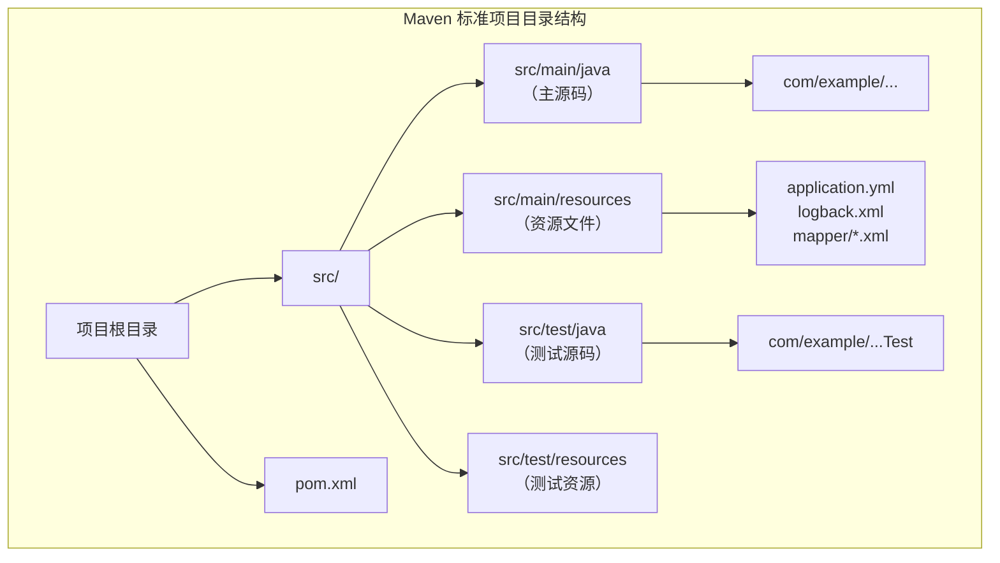

# Maven - 综合场景串联

---

## 场景一：搭建一个多模块 Maven 项目

### 场景描述
从零搭建一个企业级多模块 Maven 项目，包含父 POM 聚合模块、common 公共模块、service 业务模块和 web 接口模块，统一管理依赖版本、插件配置和构建流程。

### 涉及知识点
- [Maven 核心概念](01-Maven核心原理与依赖管理-导览.md)：GAV 坐标、POM 结构、聚合与继承、约定优于配置
- [依赖管理](01-Maven核心原理与依赖管理-导览.md)：dependencyManagement、传递依赖、scope 配置、依赖排除
- [生命周期与插件](01-Maven核心原理与依赖管理-导览.md)：clean、default、site 三大生命周期，maven-compiler-plugin 等插件配置
- [私服与发布](02-Maven私服与实战配置-导览.md)：distributionManagement、settings.xml 配置、deploy 发布

### 协作流程

**第一步：创建父 POM 项目**

使用 maven-archetype-quickstart 或在 IDE 中创建父项目，packaging 设为 pom。在父 POM 中通过 `<modules>` 声明所有子模块，通过 `<dependencyManagement>` 统一管理所有依赖的版本号，通过 `<pluginManagement>` 统一管理插件版本和配置（如 compiler 插件指定 Java 版本和 UTF-8 编码）。

**第二步：创建 common 公共模块**

在父项目目录下创建 common 子模块，packaging 为 jar。该模块存放公共工具类、通用异常、常量定义等。在 pom.xml 中声明 parent 为父 POM，依赖声明时省略 version（由父 POM 的 dependencyManagement 统一管理）。

**第三步：创建 service 业务模块**

创建 service 子模块，packaging 为 jar。该模块依赖 common 模块，并引入业务相关的第三方依赖（如 MyBatis、Spring 等）。通过 `<dependency>` 声明对 common 模块的依赖，scope 为 compile。

**第四步：创建 web 接口模块**

创建 web 子模块，packaging 为 war。该模块依赖 service 模块和 common 模块，引入 Spring MVC、Servlet API（scope 为 provided）等 Web 层依赖。配置 maven-war-plugin 打包插件。

**第五步：构建与验证**

在父 POM 目录执行 `mvn clean install`，Maven 按依赖顺序依次构建各模块。执行 `mvn dependency:tree` 检查依赖树，确认无版本冲突和 scope 错误。各模块编译通过后，web 模块的 war 包即为可部署产物。

### 关键要点
- 父 POM 的 packaging 必须为 pom，子模块通过 `<parent>` 继承
- dependencyManagement 只声明版本不引入依赖，子模块需要显式声明 gav
- 容器提供的 API（如 Servlet API）scope 必须设为 provided
- 测试相关依赖（如 JUnit）scope 设为 test
- 子模块间依赖通过 GAV 坐标声明，版本由父 POM 统一管理
- 构建时 Maven 会自动解析模块间依赖顺序，无需手动指定



> 上图展示了 Maven 标准项目的目录结构：主源码位于 `src/main/java`，资源文件位于 `src/main/resources`，测试源码位于 `src/test/java`，测试资源位于 `src/test/resources`。Maven 遵循"约定优于配置"原则，按照此结构组织代码无需额外配置即可自动识别。

### 完整可运行示例代码

以下展示一个完整的多模块 Maven 项目结构：父 POM（聚合+依赖管理） + common（公共模块） + service（业务模块） + web（接口模块）。

**步骤一：项目目录结构**

```
longjiang-maven-demo/
├── pom.xml                    # 父 POM（packaging=pom）
├── common/
│   ├── pom.xml                # 公共模块 POM
│   └── src/main/java/
│       └── com/longjiang/common/
│           ├── util/
│           │   └── StringUtils.java
│           └── exception/
│               └── BusinessException.java
├── service/
│   ├── pom.xml                # 业务模块 POM
│   └── src/main/java/
│       └── com/longjiang/service/
│           ├── UserService.java
│           └── impl/
│               └── UserServiceImpl.java
└── web/
    ├── pom.xml                # Web 模块 POM（packaging=war）
    └── src/main/
        ├── java/
        │   └── com/longjiang/web/
        │       └── controller/
        │           └── UserController.java
        └── webapp/
            └── WEB-INF/
                └── web.xml
```

**步骤二：父 POM（pom.xml）-- 聚合 + 依赖管理 + 插件管理**

```xml
<?xml version="1.0" encoding="UTF-8"?>
<project xmlns="http://maven.apache.org/POM/4.0.0"
         xmlns:xsi="http://www.w3.org/2001/XMLSchema-instance"
         xsi:schemaLocation="http://maven.apache.org/POM/4.0.0
         http://maven.apache.org/xsd/maven-4.0.0.xsd">
    <modelVersion>4.0.0</modelVersion>

    <!-- ========== 项目坐标 ========== -->
    <groupId>com.longjiang</groupId>
    <artifactId>longjiang-maven-demo</artifactId>
    <version>1.0.0-SNAPSHOT</version>
    <!-- 父 POM 的 packaging 必须为 pom -->
    <packaging>pom</packaging>

    <name>Longjiang Maven Demo</name>
    <description>多模块 Maven 项目示例</description>

    <!-- ========== 模块聚合 ========== -->
    <modules>
        <module>common</module>
        <module>service</module>
        <module>web</module>
    </modules>

    <!-- ========== 统一属性管理 ========== -->
    <properties>
        <project.build.sourceEncoding>UTF-8</project.build.sourceEncoding>
        <maven.compiler.source>8</maven.compiler.source>
        <maven.compiler.target>8</maven.compiler.target>

        <!-- 依赖版本统一管理 -->
        <junit.version>5.10.0</junit.version>
        <spring.version>5.3.30</spring.version>
        <springmvc.version>5.3.30</springmvc.version>
        <mybatis.version>3.5.13</mybatis.version>
        <mybatis-spring.version>2.1.0</mybatis-spring.version>
        <mysql.version>8.0.33</mysql.version>
        <druid.version>1.2.20</druid.version>
        <servlet.version>4.0.1</servlet.version>
        <slf4j.version>2.0.9</slf4j.version>
        <jackson.version>2.15.3</jackson.version>
    </properties>

    <!-- ========== 依赖管理（只声明版本，不引入依赖） ========== -->
    <dependencyManagement>
        <dependencies>
            <!-- 内部模块依赖 -->
            <dependency>
                <groupId>com.longjiang</groupId>
                <artifactId>common</artifactId>
                <version>${project.version}</version>
            </dependency>
            <dependency>
                <groupId>com.longjiang</groupId>
                <artifactId>service</artifactId>
                <version>${project.version}</version>
            </dependency>

            <!-- 测试依赖 -->
            <dependency>
                <groupId>org.junit.jupiter</groupId>
                <artifactId>junit-jupiter</artifactId>
                <version>${junit.version}</version>
                <scope>test</scope>
            </dependency>

            <!-- Spring 核心 -->
            <dependency>
                <groupId>org.springframework</groupId>
                <artifactId>spring-context</artifactId>
                <version>${spring.version}</version>
            </dependency>
            <dependency>
                <groupId>org.springframework</groupId>
                <artifactId>spring-jdbc</artifactId>
                <version>${spring.version}</version>
            </dependency>

            <!-- Spring MVC -->
            <dependency>
                <groupId>org.springframework</groupId>
                <artifactId>spring-webmvc</artifactId>
                <version>${springmvc.version}</version>
            </dependency>

            <!-- MyBatis -->
            <dependency>
                <groupId>org.mybatis</groupId>
                <artifactId>mybatis</artifactId>
                <version>${mybatis.version}</version>
            </dependency>
            <dependency>
                <groupId>org.mybatis</groupId>
                <artifactId>mybatis-spring</artifactId>
                <version>${mybatis-spring.version}</version>
            </dependency>

            <!-- MySQL 驱动 -->
            <dependency>
                <groupId>com.mysql</groupId>
                <artifactId>mysql-connector-j</artifactId>
                <version>${mysql.version}</version>
            </dependency>

            <!-- Druid 连接池 -->
            <dependency>
                <groupId>com.alibaba</groupId>
                <artifactId>druid</artifactId>
                <version>${druid.version}</version>
            </dependency>

            <!-- Servlet API（容器提供，scope=provided） -->
            <dependency>
                <groupId>javax.servlet</groupId>
                <artifactId>javax.servlet-api</artifactId>
                <version>${servlet.version}</version>
                <scope>provided</scope>
            </dependency>

            <!-- 日志 -->
            <dependency>
                <groupId>org.slf4j</groupId>
                <artifactId>slf4j-api</artifactId>
                <version>${slf4j.version}</version>
            </dependency>

            <!-- JSON -->
            <dependency>
                <groupId>com.fasterxml.jackson.core</groupId>
                <artifactId>jackson-databind</artifactId>
                <version>${jackson.version}</version>
            </dependency>
        </dependencies>
    </dependencyManagement>

    <!-- ========== 全局依赖（所有模块都会继承） ========== -->
    <dependencies>
        <!-- 所有模块都需要日志 -->
        <dependency>
            <groupId>org.slf4j</groupId>
            <artifactId>slf4j-api</artifactId>
        </dependency>
        <!-- 所有模块都需要测试 -->
        <dependency>
            <groupId>org.junit.jupiter</groupId>
            <artifactId>junit-jupiter</artifactId>
            <scope>test</scope>
        </dependency>
    </dependencies>

    <!-- ========== 构建配置 ========== -->
    <build>
        <pluginManagement>
            <plugins>
                <!-- 编译插件：统一 Java 版本和编码 -->
                <plugin>
                    <groupId>org.apache.maven.plugins</groupId>
                    <artifactId>maven-compiler-plugin</artifactId>
                    <version>3.11.0</version>
                    <configuration>
                        <source>${maven.compiler.source}</source>
                        <target>${maven.compiler.target}</target>
                        <encoding>${project.build.sourceEncoding}</encoding>
                    </configuration>
                </plugin>

                <!-- War 打包插件 -->
                <plugin>
                    <groupId>org.apache.maven.plugins</groupId>
                    <artifactId>maven-war-plugin</artifactId>
                    <version>3.4.0</version>
                    <configuration>
                        <failOnMissingWebXml>false</failOnMissingWebXml>
                    </configuration>
                </plugin>

                <!-- Surefire 测试插件 -->
                <plugin>
                    <groupId>org.apache.maven.plugins</groupId>
                    <artifactId>maven-surefire-plugin</artifactId>
                    <version>3.1.2</version>
                </plugin>
            </plugins>
        </pluginManagement>
    </build>
</project>
```

**步骤三：common 模块 POM（pom.xml）**

```xml
<?xml version="1.0" encoding="UTF-8"?>
<project xmlns="http://maven.apache.org/POM/4.0.0"
         xmlns:xsi="http://www.w3.org/2001/XMLSchema-instance"
         xsi:schemaLocation="http://maven.apache.org/POM/4.0.0
         http://maven.apache.org/xsd/maven-4.0.0.xsd">
    <modelVersion>4.0.0</modelVersion>

    <!-- 继承父 POM -->
    <parent>
        <groupId>com.longjiang</groupId>
        <artifactId>longjiang-maven-demo</artifactId>
        <version>1.0.0-SNAPSHOT</version>
        <relativePath>../pom.xml</relativePath>
    </parent>

    <!-- 子模块坐标 -->
    <artifactId>common</artifactId>
    <packaging>jar</packaging>

    <name>Longjiang Common Module</name>
    <description>公共模块：工具类、异常、常量</description>

    <!-- 不需要额外依赖，仅继承父 POM 中的全局依赖 -->
</project>
```

**步骤四：common 模块示例代码**

```java
// common/src/main/java/com/longjiang/common/util/StringUtils.java
package com.longjiang.common.util;

/**
 * 字符串工具类
 */
public class StringUtils {

    public static boolean isEmpty(String str) {
        return str == null || str.trim().isEmpty();
    }

    public static boolean isNotEmpty(String str) {
        return !isEmpty(str);
    }
}
```

```java
// common/src/main/java/com/longjiang/common/exception/BusinessException.java
package com.longjiang.common.exception;

/**
 * 业务异常类
 */
public class BusinessException extends RuntimeException {

    private String errorCode;

    public BusinessException(String errorCode, String message) {
        super(message);
        this.errorCode = errorCode;
    }

    public String getErrorCode() {
        return errorCode;
    }
}
```

**步骤五：service 模块 POM（pom.xml）**

```xml
<?xml version="1.0" encoding="UTF-8"?>
<project xmlns="http://maven.apache.org/POM/4.0.0"
         xmlns:xsi="http://www.w3.org/2001/XMLSchema-instance"
         xsi:schemaLocation="http://maven.apache.org/POM/4.0.0
         http://maven.apache.org/xsd/maven-4.0.0.xsd">
    <modelVersion>4.0.0</modelVersion>

    <!-- 继承父 POM -->
    <parent>
        <groupId>com.longjiang</groupId>
        <artifactId>longjiang-maven-demo</artifactId>
        <version>1.0.0-SNAPSHOT</version>
        <relativePath>../pom.xml</relativePath>
    </parent>

    <artifactId>service</artifactId>
    <packaging>jar</packaging>

    <name>Longjiang Service Module</name>
    <description>业务模块：Service 层与 DAO 层</description>

    <dependencies>
        <!-- 依赖 common 模块 -->
        <dependency>
            <groupId>com.longjiang</groupId>
            <artifactId>common</artifactId>
        </dependency>

        <!-- Spring 核心 -->
        <dependency>
            <groupId>org.springframework</groupId>
            <artifactId>spring-context</artifactId>
        </dependency>
        <dependency>
            <groupId>org.springframework</groupId>
            <artifactId>spring-jdbc</artifactId>
        </dependency>

        <!-- MyBatis -->
        <dependency>
            <groupId>org.mybatis</groupId>
            <artifactId>mybatis</artifactId>
        </dependency>
        <dependency>
            <groupId>org.mybatis</groupId>
            <artifactId>mybatis-spring</artifactId>
        </dependency>

        <!-- MySQL 驱动 -->
        <dependency>
            <groupId>com.mysql</groupId>
            <artifactId>mysql-connector-j</artifactId>
        </dependency>

        <!-- Druid 连接池 -->
        <dependency>
            <groupId>com.alibaba</groupId>
            <artifactId>druid</artifactId>
        </dependency>
    </dependencies>
</project>
```

**步骤六：service 模块示例代码**

```java
// service/src/main/java/com/longjiang/service/UserService.java
package com.longjiang.service;

import com.longjiang.common.exception.BusinessException;

/**
 * 用户服务接口
 */
public interface UserService {

    /**
     * 用户注册
     */
    void register(String username, String password) throws BusinessException;

    /**
     * 用户登录
     */
    boolean login(String username, String password);
}
```

```java
// service/src/main/java/com/longjiang/service/impl/UserServiceImpl.java
package com.longjiang.service.impl;

import com.longjiang.common.exception.BusinessException;
import com.longjiang.common.util.StringUtils;
import com.longjiang.service.UserService;
import org.slf4j.Logger;
import org.slf4j.LoggerFactory;

/**
 * 用户服务实现
 */
public class UserServiceImpl implements UserService {

    private static final Logger log = LoggerFactory.getLogger(UserServiceImpl.class);

    @Override
    public void register(String username, String password) throws BusinessException {
        if (StringUtils.isEmpty(username)) {
            throw new BusinessException("E001", "用户名不能为空");
        }
        if (StringUtils.isEmpty(password)) {
            throw new BusinessException("E002", "密码不能为空");
        }
        log.info("用户注册成功: {}", username);
    }

    @Override
    public boolean login(String username, String password) {
        log.info("用户登录: {}", username);
        return StringUtils.isNotEmpty(username) && StringUtils.isNotEmpty(password);
    }
}
```

**步骤七：web 模块 POM（pom.xml）**

```xml
<?xml version="1.0" encoding="UTF-8"?>
<project xmlns="http://maven.apache.org/POM/4.0.0"
         xmlns:xsi="http://www.w3.org/2001/XMLSchema-instance"
         xsi:schemaLocation="http://maven.apache.org/POM/4.0.0
         http://maven.apache.org/xsd/maven-4.0.0.xsd">
    <modelVersion>4.0.0</modelVersion>

    <!-- 继承父 POM -->
    <parent>
        <groupId>com.longjiang</groupId>
        <artifactId>longjiang-maven-demo</artifactId>
        <version>1.0.0-SNAPSHOT</version>
        <relativePath>../pom.xml</relativePath>
    </parent>

    <artifactId>web</artifactId>
    <!-- Web 模块打包为 war -->
    <packaging>war</packaging>

    <name>Longjiang Web Module</name>
    <description>Web 接口模块：Controller 层</description>

    <dependencies>
        <!-- 依赖 service 模块 -->
        <dependency>
            <groupId>com.longjiang</groupId>
            <artifactId>service</artifactId>
        </dependency>
        <!-- 依赖 common 模块 -->
        <dependency>
            <groupId>com.longjiang</groupId>
            <artifactId>common</artifactId>
        </dependency>

        <!-- Spring MVC -->
        <dependency>
            <groupId>org.springframework</groupId>
            <artifactId>spring-webmvc</artifactId>
        </dependency>

        <!-- Servlet API（容器提供，scope=provided） -->
        <dependency>
            <groupId>javax.servlet</groupId>
            <artifactId>javax.servlet-api</artifactId>
            <scope>provided</scope>
        </dependency>

        <!-- JSON 序列化 -->
        <dependency>
            <groupId>com.fasterxml.jackson.core</groupId>
            <artifactId>jackson-databind</artifactId>
        </dependency>
    </dependencies>

    <build>
        <plugins>
            <plugin>
                <groupId>org.apache.maven.plugins</groupId>
                <artifactId>maven-war-plugin</artifactId>
            </plugin>
        </plugins>
    </build>
</project>
```

**步骤八：web 模块示例代码**

```java
// web/src/main/java/com/longjiang/web/controller/UserController.java
package com.longjiang.web.controller;

import com.longjiang.service.UserService;
import com.longjiang.service.impl.UserServiceImpl;
import org.slf4j.Logger;
import org.slf4j.LoggerFactory;

import javax.servlet.ServletException;
import javax.servlet.annotation.WebServlet;
import javax.servlet.http.HttpServlet;
import javax.servlet.http.HttpServletRequest;
import javax.servlet.http.HttpServletResponse;
import java.io.IOException;

/**
 * 用户控制器
 */
@WebServlet("/user/*")
public class UserController extends HttpServlet {

    private static final Logger log = LoggerFactory.getLogger(UserController.class);
    private final UserService userService = new UserServiceImpl();

    @Override
    protected void doPost(HttpServletRequest req, HttpServletResponse resp)
            throws ServletException, IOException {
        req.setCharacterEncoding("UTF-8");
        resp.setContentType("application/json;charset=UTF-8");

        String username = req.getParameter("username");
        String password = req.getParameter("password");

        try {
            userService.register(username, password);
            resp.getWriter().write("{\"code\":200,\"msg\":\"注册成功\"}");
        } catch (Exception e) {
            log.error("注册失败", e);
            resp.getWriter().write("{\"code\":500,\"msg\":\"" + e.getMessage() + "\"}");
        }
    }
}
```

```xml
<!-- web/src/main/webapp/WEB-INF/web.xml -->
<?xml version="1.0" encoding="UTF-8"?>
<web-app xmlns="http://xmlns.jcp.org/xml/ns/javaee"
         xmlns:xsi="http://www.w3.org/2001/XMLSchema-instance"
         xsi:schemaLocation="http://xmlns.jcp.org/xml/ns/javaee
         http://xmlns.jcp.org/xml/ns/javaee/web-app_4_0.xsd"
         version="4.0">

    <display-name>Longjiang Web Module</display-name>

    <welcome-file-list>
        <welcome-file>index.html</welcome-file>
    </welcome-file-list>
</web-app>
```

**步骤九：构建与验证**

在父 POM 目录执行以下命令：

```bash
# 清理并构建所有模块
mvn clean install

# 查看依赖树
mvn dependency:tree

# 仅编译（跳过测试）
mvn clean compile -DskipTests

# 查看有效 POM（合并父 POM 后的完整配置）
mvn help:effective-pom
```

**步骤十：项目依赖关系图**

```
longjiang-maven-demo (父 POM, packaging=pom)
├── common (jar)
│   └── 无外部模块依赖，仅继承父 POM 全局依赖
├── service (jar)
│   └── 依赖 common 模块 + Spring/MyBatis
└── web (war)
    └── 依赖 common + service + Spring MVC + Servlet API(provided)
```

---

## 场景二：搭建 Maven 私服并配置项目发布

### 场景描述
在企业内网搭建 Nexus 私服，配置为中央仓库的代理缓存，同时作为内部构件的发布仓库。开发团队通过 settings.xml 统一配置私服地址，实现依赖加速下载和内部构件共享。

### 涉及知识点
- [仓库体系](02-Maven私服与实战配置-导览.md)：本地仓库、远程仓库、中央仓库、私服的层级关系
- [镜像机制](02-Maven私服与实战配置-导览.md)：mirror 与 mirrorOf 配置，镜像拦截规则
- [Nexus 仓库类型](02-Maven私服与实战配置-导览.md)：proxy（代理）、hosted（宿主）、group（仓库组）
- [发布配置](02-Maven私服与实战配置-导览.md)：distributionManagement、servers 认证、mvn deploy 流程
- [多环境配置](02-Maven私服与实战配置-导览.md)：profiles + resource filtering 实现环境隔离

### 协作流程

**第一步：部署 Nexus 私服**

下载 Nexus Repository Manager，解压后启动服务。默认访问地址为 http://localhost:8081，使用默认管理员账号登录。Nexus 预置了 maven-central（proxy 类型，代理中央仓库）、maven-releases（hosted 类型，存放正式版本）和 maven-snapshots（hosted 类型，存放快照版本）等仓库。

**第二步：配置仓库组**

创建 maven-public 仓库组（group 类型），将 maven-central、maven-releases、maven-snapshots 按优先级加入。开发团队只需配置这一个仓库组地址即可访问所有仓库。

**第三步：配置 settings.xml**

在 Maven 的 conf/settings.xml 或用户目录下的 .m2/settings.xml 中配置：
- `<mirrors>`：添加 mirror，mirrorOf 设为 central（或 `*,!nexus-public` 排除私服），url 指向 maven-public 仓库组地址
- `<servers>`：添加 server 配置，id 与 distributionManagement 中的 repository id 保持一致，填写 Nexus 账号密码
- `<profiles>`：添加 profile 统一配置私服仓库地址，并通过 `<activeProfiles>` 激活

**第四步：配置项目 pom.xml 发布信息**

在项目的 pom.xml 中添加 `<distributionManagement>`，配置 snapshotRepository 和 repository，分别指向 maven-snapshots 和 maven-releases 的地址。确保 repository id 与 settings.xml 中 server id 一致。

**第五步：执行发布**

开发完成后执行 `mvn clean deploy`。Maven 先执行 compile、test、package 阶段，然后根据版本号是否包含 -SNAPSHOT 判断发布到快照仓库还是正式仓库。发布成功后，其他项目可通过相同私服配置拉取该构件。

### 关键要点
- mirrorOf 不要设成 *，否则会拦截私服自身的仓库请求
- distributionManagement 的 repository id 必须与 settings.xml 的 server id 完全一致
- releases 仓库默认禁止覆盖同版本，需升级版本号后重新发布
- SNAPSHOT 缓存更新策略默认为 daily，开发阶段建议设为 always 或使用 -U 参数
- 密码不应明文写入 settings.xml，建议使用环境变量或 Maven 加密机制
- 多环境构建时，使用 profiles 定义不同环境，通过 -P 参数激活

---

> [返回模块目录](../../README.md) | [返回知识导览](../../知识导览.md)