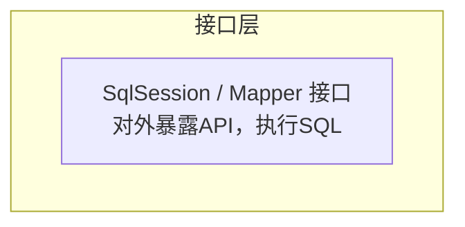
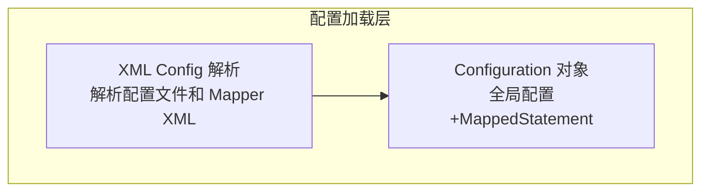
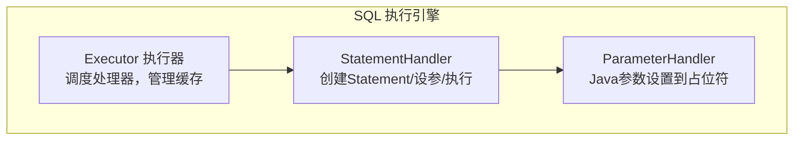
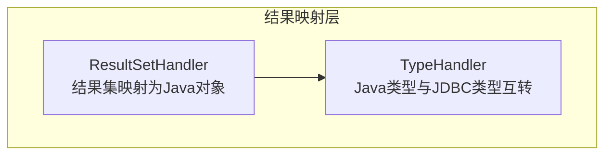
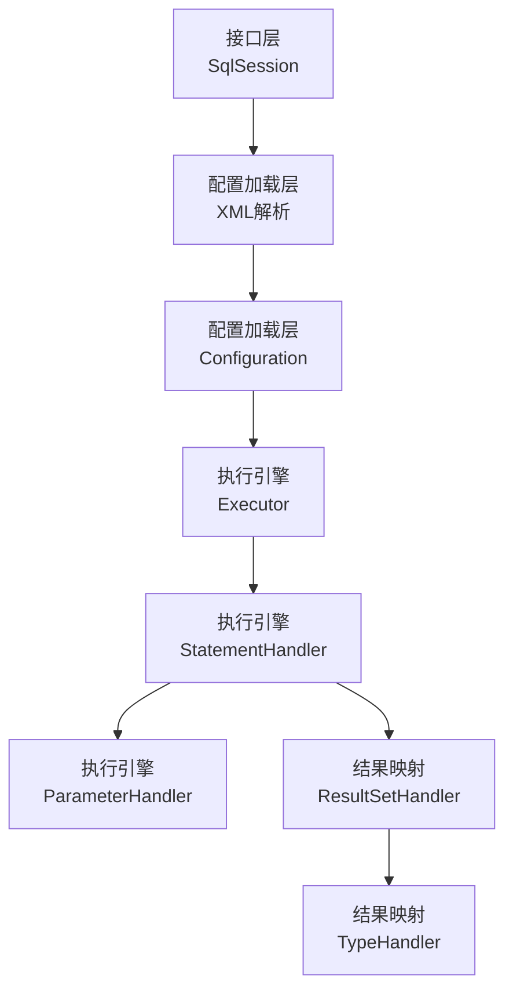
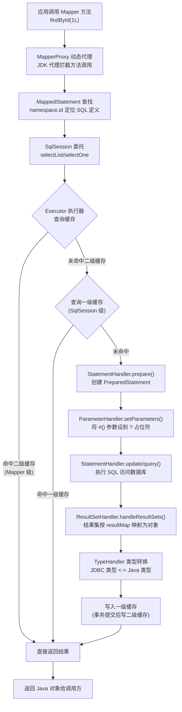

# MyBatis 原生框架

> 学习路线对应：第3周 -- 数据访问与 ORM
> 前置知识：JDBC 核心原理、SQL 基础
> 预计学习时间：2 天

> 📖 **参考链接**：
> - [MyBatis 官方文档（中文）](https://mybatis.org/mybatis-3/zh_CN/) -- MyBatis 3 中文官方手册，涵盖配置、XML 映射、动态 SQL、缓存等全部特性
> - [MyBatis 入门指南](https://mybatis.org/mybatis-3/zh_CN/getting-started.html) -- 官方入门教程，从 SqlSessionFactory 到 Mapper 的完整示例
> - [MyBatis GitHub 仓库](https://github.com/mybatis/mybatis-3) -- 源码与最新版本发布跟踪

## 一、核心概念

### 1.1 MyBatis 架构

MyBatis 是一款优秀的半自动 ORM（对象关系映射）框架，它将 JDBC 中的重复操作（加载驱动、获取连接、设置参数、遍历结果集、释放资源）封装起来，让开发者专注于 SQL 本身，同时保留对 SQL 的完全控制力。

> **生活化类比：MyBatis 是 Java 与数据库之间的"翻译官"** —— Java 程序说"对象话"（`User user = new User()`），数据库只听得懂"表格话"（`SELECT * FROM t_user`）。两者语言不通，MyBatis 就充当翻译官：你把 Java 对象交给它，它翻译成 SQL 发给数据库；数据库返回表格结果，它再翻译回 Java 对象。与全自动 ORM（如 JPA/Hibernate，相当于"全自动同声传译"，连 SQL 都帮你生成）不同，MyBatis 是"半自动翻译官"——SQL 你自己写，翻译过程它来处理。这样既保留了你对 SQL 的完全掌控（复杂报表、多表关联、性能优化都好办），又免去了 JDBC 繁琐的样板代码（加载驱动、设参数、遍历 ResultSet、关资源）。这正是它在国内后端开发中长盛不衰的原因。

**核心组件分层：**

| 层级 | 组件 | 职责 |
|------|------|------|
| **接口层** | `SqlSession` | 对外暴露 API，执行 SQL、管理事务、获取 Mapper 代理 |
| **核心处理层** | `Executor` | 执行器，调度 StatementHandler，管理一二级缓存 |
| | `StatementHandler` | 处理 JDBC Statement 的创建、参数设置、执行 |
| | `ParameterHandler` | 将 Java 对象设置到 PreparedStatement 的 `?` 占位符 |
| | `ResultSetHandler` | 将 ResultSet 映射为 Java 对象/集合 |
| **基础支撑层** | 配置解析、日志、反射、类型转换、数据源 | 提供底层支持 |

**执行流程：**

```
调用 Mapper 方法
      │
      ▼
SqlSession.selectList("namespace.id", param)
      │
      ▼
Executor（命中缓存直接返回；否则继续）
      │  ├─ 一级缓存（SqlSession 级别）
      │  └─ 二级缓存（Mapper 级别，需开启）
      ▼
StatementHandler.prepare()  创建 PreparedStatement
      │
      ▼
ParameterHandler.setParameters()  设置 ? 参数
      │
      ▼
StatementHandler.update/query()  执行 SQL
      │
      ▼
ResultSetHandler.handleResultSets()  结果集映射为对象
      │
      ▼
返回结果
```

**MyBatis 核心分层架构**

##### 接口层



> 接口层通过 SqlSession 和 Mapper 代理对外提供 API。

##### 配置加载层



> 配置加载层负责解析 XML 配置并构建 Configuration 对象。

##### SQL 执行引擎



> SQL 执行引擎由 Executor 统一调度 StatementHandler 和 ParameterHandler。

##### 结果映射层



> 结果映射层由 ResultSetHandler 和 TypeHandler 完成结果集到 Java 对象的映射。

##### 整体执行链路



> 上图展示了 MyBatis 的核心分层架构：接口层通过 SqlSession 和 Mapper 代理对外提供 API，配置加载层负责解析 XML 配置并构建 Configuration 对象，SQL 执行引擎由 Executor 统一调度并管理一二级缓存，最终由 ResultSetHandler 和 TypeHandler 完成结果集到 Java 对象的映射。各层职责清晰，通过 Configuration 对象串联起整个执行链路。

### 1.2 核心配置文件 mybatis-config.xml

```xml
<?xml version="1.0" encoding="UTF-8"?>
<!DOCTYPE configuration PUBLIC "-//mybatis.org//DTD Config 3.0//EN"
        "http://mybatis.org/dtd/mybatis-3-config.dtd">
<configuration>
    <!-- 1. 属性配置：引入外部 properties 文件 -->
    <properties resource="db.properties"/>

    <!-- 2. 全局设置 -->
    <settings>
        <!-- 开启驼峰命名自动映射（user_name -> userName） -->
        <setting name="mapUnderscoreToCamelCase" value="true"/>
        <!-- 开启二级缓存总开关 -->
        <setting name="cacheEnabled" value="true"/>
        <!-- 日志实现 -->
        <setting name="logImpl" value="STDOUT_LOGGING"/>
        <!-- 默认执行器：SIMPLE/REUSE/BATCH -->
        <setting name="defaultExecutorType" value="SIMPLE"/>
    </settings>

    <!-- 3. 类型别名：简化 XML 中全限定类名书写 -->
    <typeAliases>
        <package name="com.example.entity"/>
    </typeAliases>

    <!-- 4. 环境配置（可配置多个 environment，default 指定默认） -->
    <environments default="dev">
        <environment id="dev">
            <transactionManager type="JDBC"/>      <!-- 事务管理器 -->
            <dataSource type="POOLED">             <!-- 数据源类型：UNPOOLED/POOLED/JNDI -->
                <property name="driver" value="${jdbc.driver}"/>
                <property name="url" value="${jdbc.url}"/>
                <property name="username" value="${jdbc.username}"/>
                <property name="password" value="${jdbc.password}"/>
            </dataSource>
        </environment>
    </environments>

    <!-- 5. 映射器注册：告诉 MyBatis 去哪找 SQL 映射文件 -->
    <mappers>
        <mapper resource="mapper/UserMapper.xml"/>
        <package name="com.example.mapper"/>   <!-- 扫描包下所有接口 -->
    </mappers>
</configuration>
```

| 配置节点 | 作用 |
|---------|------|
| `properties` | 引入外部配置，支持 `${key}` 引用 |
| `settings` | 全局行为开关（驼峰映射、缓存、日志等） |
| `typeAliases` | 类型别名，`User` 代替 `com.example.entity.User` |
| `typeHandlers` | 自定义类型处理器（Java 类型与 JDBC 类型转换） |
| `environments` | 数据源与事务管理配置 |
| `mappers` | 注册 Mapper 接口或 XML 映射文件 |

### 1.3 Mapper 映射器

Mapper 由「接口 + XML」两部分组成（也可纯注解）。MyBatis 通过动态代理为接口生成实现类，将方法调用映射到对应的 SQL 语句。

> **生活化类比：Mapper 映射器 = "餐厅菜单 + 后厨"** —— 接口（`UserMapper`）就是餐厅的**菜单**，上面列着菜名（方法名 `findById`、`insert`）和点的规格（参数、返回类型）；XML 映射文件就是**后厨的菜谱**，写明每道菜到底怎么做（SQL 语句、参数映射、结果映射）。顾客（调用方）只需对着菜单点菜（调用 `mapper.findById(1L)`），不需要知道后厨怎么炒；MyBatis 这个"服务员"拿着订单去后厨，按菜谱执行 SQL，再把做好的菜（结果对象）端给顾客。菜单和菜谱必须对得上号——菜名（方法名）错了、菜谱编号（namespace）错了，服务员就上错菜（`BindingException`）。这就是「绑定规则」的本质：接口全限定名等于 namespace，方法名等于 SQL 标签 id。

```java
// 接口：定义方法签名
public interface UserMapper {
    User findById(Long id);
    List<User> findList(UserQuery query);
    int insert(User user);
}
```

```xml
<!-- UserMapper.xml：同名同包下，定义 SQL -->
<?xml version="1.0" encoding="UTF-8"?>
<!DOCTYPE mapper PUBLIC "-//mybatis.org//DTD Mapper 3.0//EN"
        "http://mybatis.org/dtd/mybatis-3-mapper.dtd">
<mapper namespace="com.example.mapper.UserMapper">

    <select id="findById" resultType="User">
        SELECT id, username, email FROM t_user WHERE id = #{id}
    </select>

    <select id="findList" resultType="User">
        SELECT id, username, email FROM t_user
        <where>
            <if test="username != null and username != ''">
                AND username LIKE CONCAT('%', #{username}, '%')
            </if>
        </where>
    </select>

    <insert id="insert" parameterType="User" useGeneratedKeys="true" keyProperty="id">
        INSERT INTO t_user (username, email) VALUES (#{username}, #{email})
    </insert>
</mapper>
```

> **绑定规则：** 接口全限定名（`com.example.mapper.UserMapper`）必须等于 XML 的 `namespace`；接口方法名必须等于 SQL 标签的 `id`；参数类型与返回类型需匹配。

---

## 二、底层原理

### 2.1 SqlSession 核心 API

**MyBatis 一次 SQL 执行的完整流程（Mermaid 图）：**



> 上图展示了 MyBatis 执行一条 SQL 的完整链路：从应用调用 Mapper 方法开始，由 JDK 动态代理（MapperProxy）拦截，通过 `namespace.id` 定位到 `MappedStatement`（SQL 定义）。Executor 执行器先查二级缓存（Mapper 级，跨 SqlSession），再查一级缓存（SqlSession 级），命中则直接返回；未命中则走数据库——StatementHandler 创建 PreparedStatement，ParameterHandler 把 `#{}` 参数填充到 `?` 占位符，执行 SQL 后由 ResultSetHandler 按 resultMap/resultType 把结果集映射为 Java 对象，TypeHandler 负责 JDBC 类型与 Java 类型互转。结果写入一级缓存，事务提交后写入二级缓存，最终返回给调用方。缓存查询顺序：二级缓存 -> 一级缓存 -> 数据库。

| 方法 | 说明 | 示例 |
|------|------|------|
| `selectOne(statement, param)` | 查询单条 | `sqlSession.selectOne("UserMapper.findById", 1L)` |
| `selectList(statement, param)` | 查询列表 | `sqlSession.selectList("UserMapper.findList", query)` |
| `selectMap(statement, param, mapKey)` | 查询并按 key 封装为 Map | `selectMap("...", query, "id")` |
| `insert(statement, param)` | 新增，返回影响行数 | `sqlSession.insert("UserMapper.insert", user)` |
| `update(statement, param)` | 修改 | `sqlSession.update("UserMapper.update", user)` |
| `delete(statement, param)` | 删除 | `sqlSession.delete("UserMapper.deleteById", 1L)` |
| `commit()` / `rollback()` | 事务提交/回滚 | 需关闭 autoCommit |
| `getMapper(Class)` | 获取 Mapper 代理对象 | `sqlSession.getMapper(UserMapper.class)` |
| `clearCache()` | 清空一级缓存 | 强制下次查询走数据库 |
| `close()` | 关闭 SqlSession | 必须关闭，释放资源 |

**SqlSessionFactory 与 SqlSession 生命周期：**

| 对象 | 生命周期 | 作用域 |
|------|---------|--------|
| `SqlSessionFactoryBuilder` | 方法局部，用完即弃 | 创建 SqlSessionFactory 后丢弃 |
| `SqlSessionFactory` | 应用级，单例 | 整个应用共享一个 |
| `SqlSession` | 请求/方法级 | 每次请求一个，非线程安全，必须关闭 |

### 2.2 动态 SQL

MyBatis 动态 SQL 通过 XML 标签在运行时根据参数动态拼接 SQL，是相比 JDBC 最大的优势之一。

> **生活化类比：动态 SQL = "乐高积木"** —— 写 JDBC 时，SQL 是一块整块的塑料（字符串硬拼接），改一处就要重做整块，稍不留神还拼出多余的 `AND` 或逗号。MyBatis 的动态 SQL 标签就像乐高积木：`<if>` 是条件块、`<where>` 是底座、`<foreach>` 是循环零件、`<choose>` 是分叉件。每个零件独立生产，运行时根据参数（你的"图纸"）自由组合拼接。用户传了 `username` 就拼上用户名过滤块，传了 `status` 就拼上状态块，什么都不传就是一块光底座（不生成 WHERE）。`<where>` 还能自动磨平多余的 `AND` 毛刺，`<set>` 能自动去掉末尾多余的逗号——就像乐高的卡扣自动对齐，不会错位。这种"按需拼装"的方式让复杂多条件查询、批量操作变得优雅且安全。

| 标签 | 作用 | 说明 |
|------|------|------|
| `<if test="...">` | 条件判断 | 满足则拼接该段 SQL |
| `<where>` | 智能 WHERE | 自动去掉首个 `AND/OR`；无条件时不生成 WHERE |
| `<set>` | 智能 SET | 自动去掉末尾逗号，用于 UPDATE |
| `<choose>` / `<when>` / `<otherwise>` | 类似 switch-case | 多选一 |
| `<trim>` | 通用修剪 | 自定义前缀、后缀及需去除的字符 |
| `<foreach>` | 遍历集合 | 用于 IN 查询、批量插入 |
| `<bind>` | 绑定变量 | 用 OGNL 表达式预定义变量 |

**示例 1：多条件查询（if + where）**

```xml
<select id="findList" resultType="User">
    SELECT id, username, email, age, status
    FROM t_user
    <where>
        <if test="username != null and username != ''">
            AND username LIKE CONCAT('%', #{username}, '%')
        </if>
        <if test="email != null and email != ''">
            AND email = #{email}
        </if>
        <if test="status != null">
            AND status = #{status}
        </if>
        <if test="minAge != null">
            AND age &gt;= #{minAge}
        </if>
    </where>
    ORDER BY id DESC
</select>
```

**示例 2：choose 多选一**

```xml
<select id="findByCondition" resultType="User">
    SELECT * FROM t_user
    <where>
        <choose>
            <when test="id != null">
                AND id = #{id}
            </when>
            <when test="username != null">
                AND username = #{username}
            </when>
            <otherwise>
                AND status = 1
            </otherwise>
        </choose>
    </where>
</select>
```

**示例 3：批量插入（foreach）**

```xml
<insert id="batchInsert" parameterType="java.util.List">
    INSERT INTO t_user (username, email) VALUES
    <foreach collection="list" item="u" separator=",">
        (#{u.username}, #{u.email})
    </foreach>
</insert>
```

**示例 4：动态更新（set）**

```xml
<update id="updateSelective">
    UPDATE t_user
    <set>
        <if test="username != null">username = #{username},</if>
        <if test="email != null">email = #{email},</if>
        <if test="age != null">age = #{age},</if>
    </set>
    WHERE id = #{id}
</update>
```

**示例 5：bind 绑定变量**

```xml
<select id="findByName" resultType="User">
    <bind name="pattern" value="'%' + username + '%'" />
    SELECT * FROM t_user WHERE username LIKE #{pattern}
</select>
```

### 2.3 一二级缓存机制

**一级缓存（SqlSession 级别，默认开启）：**

| 维度 | 说明 |
|------|------|
| 作用域 | 同一个 SqlSession 内 |
| 数据结构 | `HashMap`（key = statementId + 参数 + 分页信息） |
| 失效条件 | 执行 insert/update/delete；调用 `clearCache()`；SqlSession 关闭 |
| 适用场景 | 同会话内重复查询 |

```java
SqlSession session = factory.openSession();
UserMapper mapper = session.getMapper(UserMapper.class);

User u1 = mapper.findById(1L);  // 查询数据库，存入一级缓存
User u2 = mapper.findById(1L);  // 命中一级缓存，不发 SQL
System.out.println(u1 == u2);   // true，同一对象

mapper.updateAge(1L, 20);       // 执行更新，清空一级缓存
User u3 = mapper.findById(1L);  // 缓存失效，重新查数据库
```

**二级缓存（Mapper 级别，需手动开启）：**

| 维度 | 说明 |
|------|------|
| 作用域 | 同一 namespace（Mapper）跨 SqlSession 共享 |
| 开启方式 | 全局 `cacheEnabled=true` + Mapper 内加 `<cache/>` |
| 存储策略 | 默认 `PerpetualCache`（HashMap），可集成 Ehcache/Redis |
| 失效条件 | 该 namespace 执行 insert/update/delete |
| 注意 | 缓存对象需实现 `Serializable`；事务提交后才写入二级缓存 |

```xml
<!-- mybatis-config.xml 全局开启 -->
<setting name="cacheEnabled" value="true"/>

<!-- UserMapper.xml 中开启该 Mapper 的二级缓存 -->
<mapper namespace="com.example.mapper.UserMapper">
    <cache
        eviction="LRU"          <!-- 淘汰策略：LRU/FIFO/SOFT/WEAK -->
        flushInterval="60000"   <!-- 60s 刷新 -->
        size="512"              <!-- 最多缓存 512 个对象 -->
        readOnly="false"/>      <!-- false 返回拷贝，安全但慢 -->
</mapper>
```

**缓存淘汰策略：**

| 策略 | 说明 |
|------|------|
| `LRU`（默认） | 最近最少使用，移除最久未访问 |
| `FIFO` | 先进先出，按进入顺序移除 |
| `SOFT` | 软引用，内存不足时回收 |
| `WEAK` | 弱引用，GC 时回收 |

**查询顺序：** 二级缓存 -> 一级缓存 -> 数据库。

### 2.4 #{} vs ${} 区别

| 维度 | `#{}` | `${}` |
|------|-------|-------|
| **底层** | PreparedStatement 的 `?` 占位，预编译 | 字符串直接拼接到 SQL |
| **SQL 注入** | 安全（参数作字面量） | 存在注入风险 |
| **类型处理** | 自动类型转换 | 不做类型处理 |
| **适用场景** | 参数值 | 表名、列名、排序字段等结构 |
| **引号** | 自动加引号 | 不加引号 |

```xml
<!-- 安全：#{} 预编译 -->
<select id="findById" resultType="User">
    SELECT * FROM t_user WHERE id = #{id}
</select>
<!-- 实际：SELECT * FROM t_user WHERE id = ?  -->

<!-- 危险：${} 字符串拼接，存在注入风险 -->
<select id="findByColumn" resultType="User">
    SELECT * FROM t_user ORDER BY ${columnName} ${order}
</select>
<!-- 实际：SELECT * FROM t_user ORDER BY create_time DESC -->
```

> `${}` 用于动态表名、列名、`ORDER BY` 字段（无法预编译结构），但必须做白名单校验防止注入。

### 2.5 注解开发

MyBatis 支持纯注解开发，适合简单 SQL，复杂 SQL 仍推荐 XML。

| 注解 | 作用 |
|------|------|
| `@Select` | 查询 |
| `@Insert` | 新增 |
| `@Update` | 修改 |
| `@Delete` | 删除 |
| `@Results` / `@Result` | 结果映射（替代 `<resultMap>`） |
| `@One` | 一对一关联查询 |
| `@Many` | 一对多关联查询 |
| `@Options` | 附加选项（如 `useGeneratedKeys`） |

```java
public interface UserMapper {

    @Select("SELECT id, username, email, age FROM t_user WHERE id = #{id}")
    @Results({
        @Result(property = "id", column = "id"),
        @Result(property = "username", column = "username"),
        @Result(property = "email", column = "email"),
        @Result(property = "age", column = "age")
    })
    User findById(Long id);

    @Insert("INSERT INTO t_user (username, email) VALUES (#{username}, #{email})")
    @Options(useGeneratedKeys = true, keyProperty = "id")
    int insert(User user);

    @Update("UPDATE t_user SET email = #{email} WHERE id = #{id}")
    int updateEmail(@Param("id") Long id, @Param("email") String email);

    @Delete("DELETE FROM t_user WHERE id = #{id}")
    int deleteById(Long id);
}
```

> `@Param` 用于多参数场景，给参数命名以便 SQL 中用 `#{name}` 引用；单参数（JavaBean/Map）可直接用属性名。

### 2.6 逆向工程（MyBatis Generator）

MyBatis Generator（MBG）可根据数据库表自动生成实体类、Mapper 接口、Mapper XML，大幅减少重复劳动。

**generatorConfig.xml：**

```xml
<?xml version="1.0" encoding="UTF-8"?>
<!DOCTYPE generatorConfiguration PUBLIC
        "-//mybatis.org//DTD MyBatis Generator Configuration 1.0//EN"
        "http://mybatis.org/dtd/mybatis-generator-config_1_0.dtd">
<generatorConfiguration>
    <!-- 引入数据库驱动 -->
    <classPathEntry location="/path/to/mysql-connector-java.jar"/>

    <context id="shop" targetRuntime="MyBatis3">
        <!-- 不生成注释 -->
        <commentGenerator>
            <property name="suppressAllComments" value="true"/>
        </commentGenerator>

        <!-- 数据库连接 -->
        <jdbcConnection driverClass="com.mysql.cj.jdbc.Driver"
                        connectionURL="jdbc:mysql://127.0.0.1:3306/shop"
                        userId="root" password="123456"/>

        <!-- 实体类生成位置 -->
        <javaModelGenerator targetPackage="com.example.entity"
                            targetProject="src/main/java"/>
        <!-- Mapper XML 生成位置 -->
        <sqlMapGenerator targetPackage="mapper"
                         targetProject="src/main/resources"/>
        <!-- Mapper 接口生成位置 -->
        <javaClientGenerator targetPackage="com.example.mapper"
                             targetProject="src/main/java" type="XMLMAPPER"/>

        <!-- 指定要生成代码的表 -->
        <table tableName="t_user" domainObjectName="User"
               enableCountByExample="false"
               enableUpdateByExample="false"
               enableDeleteByExample="false"
               enableSelectByExample="false"
               selectByExampleQueryId="false"/>
        <table tableName="t_order" domainObjectName="Order"/>
    </context>
</generatorConfiguration>
```

**Maven 插件执行：**

```xml
<plugin>
    <groupId>org.mybatis.generator</groupId>
    <artifactId>mybatis-generator-maven-plugin</artifactId>
    <version>1.4.2</version>
    <configuration>
        <configurationFile>src/main/resources/generatorConfig.xml</configurationFile>
        <overwrite>true</overwrite>
    </configuration>
</plugin>
```

执行 `pnpm` 不适用，使用 Maven 命令：`mvn mybatis-generator:generate`。

> 逆向工程生成的代码建议放在专门的包中，避免被手写代码覆盖。可使用「生成 + 继承扩展」模式：MBG 生成基础类，自定义 Mapper 继承生成类扩展功能。

---

## 三、实战应用

### 3.1 完整项目搭建

**db.properties：**

```properties
jdbc.driver=com.mysql.cj.jdbc.Driver
jdbc.url=jdbc:mysql://127.0.0.1:3306/shop?useSSL=false&serverTimezone=Asia/Shanghai
jdbc.username=root
jdbc.password=123456
```

**实体类：**

```java
public class User {
    private Long id;
    private String username;
    private String email;
    private Integer age;
    private Integer status;
    // getter/setter/toString 省略
}

public class UserQuery {
    private String username;
    private String email;
    private Integer status;
    private Integer minAge;
    // getter/setter 省略
}
```

**UserMapper.xml（完整版）：**

```xml
<?xml version="1.0" encoding="UTF-8"?>
<!DOCTYPE mapper PUBLIC "-//mybatis.org//DTD Mapper 3.0//EN"
        "http://mybatis.org/dtd/mybatis-3-mapper.dtd">
<mapper namespace="com.example.mapper.UserMapper">

    <!-- 开启二级缓存 -->
    <cache/>

    <!-- 结果映射 -->
    <resultMap id="userResultMap" type="User">
        <id property="id" column="id"/>
        <result property="username" column="username"/>
        <result property="email" column="email"/>
        <result property="age" column="age"/>
        <result property="status" column="status"/>
    </resultMap>

    <!-- 通用列 -->
    <sql id="userColumns">id, username, email, age, status</sql>

    <!-- 按 id 查询 -->
    <select id="findById" parameterType="long" resultMap="userResultMap">
        SELECT <include refid="userColumns"/>
        FROM t_user WHERE id = #{id}
    </select>

    <!-- 多条件动态查询 -->
    <select id="findList" parameterType="UserQuery" resultMap="userResultMap">
        SELECT <include refid="userColumns"/>
        FROM t_user
        <where>
            <if test="username != null and username != ''">
                AND username LIKE CONCAT('%', #{username}, '%')
            </if>
            <if test="email != null and email != ''">
                AND email = #{email}
            </if>
            <if test="status != null">
                AND status = #{status}
            </if>
            <if test="minAge != null">
                AND age &gt;= #{minAge}
            </if>
        </where>
        ORDER BY id DESC
    </select>

    <!-- 新增（返回自增主键） -->
    <insert id="insert" parameterType="User" useGeneratedKeys="true" keyProperty="id">
        INSERT INTO t_user (username, email, age, status)
        VALUES (#{username}, #{email}, #{age}, #{status})
    </insert>

    <!-- 批量新增 -->
    <insert id="batchInsert" parameterType="java.util.List">
        INSERT INTO t_user (username, email) VALUES
        <foreach collection="list" item="u" separator=",">
            (#{u.username}, #{u.email})
        </foreach>
    </insert>

    <!-- 选择性更新 -->
    <update id="updateSelective" parameterType="User">
        UPDATE t_user
        <set>
            <if test="username != null">username = #{username},</if>
            <if test="email != null">email = #{email},</if>
            <if test="age != null">age = #{age},</if>
            <if test="status != null">status = #{status},</if>
        </set>
        WHERE id = #{id}
    </update>

    <!-- 批量删除 -->
    <delete id="batchDelete" parameterType="java.util.List">
        DELETE FROM t_user WHERE id IN
        <foreach collection="list" item="id" open="(" separator="," close=")">
            #{id}
        </foreach>
    </delete>
</mapper>
```

**MyBatisUtil 工具类：**

```java
import org.apache.ibatis.io.Resources;
import org.apache.ibatis.session.SqlSession;
import org.apache.ibatis.session.SqlSessionFactory;
import org.apache.ibatis.session.SqlSessionFactoryBuilder;

public class MyBatisUtil {
    private static final SqlSessionFactory FACTORY;

    static {
        try {
            FACTORY = new SqlSessionFactoryBuilder()
                .build(Resources.getResourceAsStream("mybatis-config.xml"));
        } catch (Exception e) {
            throw new RuntimeException("初始化 SqlSessionFactory 失败", e);
        }
    }

    public static SqlSession openSession() {
        return FACTORY.openSession(false);   // false = 手动提交事务
    }
}
```

**测试类：**

```java
public class UserMapperTest {
    @Test
    public void testFindById() {
        try (SqlSession session = MyBatisUtil.openSession()) {
            UserMapper mapper = session.getMapper(UserMapper.class);
            User user = mapper.findById(1L);
            System.out.println(user);
        }
    }

    @Test
    public void testFindList() {
        try (SqlSession session = MyBatisUtil.openSession()) {
            UserMapper mapper = session.getMapper(UserMapper.class);
            UserQuery query = new UserQuery();
            query.setUsername("zhang");
            query.setStatus(1);
            List<User> list = mapper.findList(query);
            list.forEach(System.out::println);
        }
    }

    @Test
    public void testBatchInsert() {
        SqlSession session = MyBatisUtil.openSession();
        try {
            UserMapper mapper = session.getMapper(UserMapper.class);
            List<User> users = Arrays.asList(
                new User("u1", "u1@xx.com"),
                new User("u2", "u2@xx.com"),
                new User("u3", "u3@xx.com"));
            mapper.batchInsert(users);
            session.commit();                    // 提交事务
        } catch (Exception e) {
            session.rollback();                  // 回滚事务
            throw e;
        } finally {
            session.close();
        }
    }
}
```

### 3.2 动态 SQL 实战

**多条件查询（任意组合条件）：**

```xml
<select id="search" resultMap="userResultMap">
    SELECT <include refid="userColumns"/>
    FROM t_user
    <where>
        <if test="username != null and username != ''">
            AND username LIKE CONCAT('%', #{username}, '%')
        </if>
        <if test="email != null and email != ''">
            AND email = #{email}
        </if>
        <if test="statusList != null and statusList.size() > 0">
            AND status IN
            <foreach collection="statusList" item="s" open="(" separator="," close=")">
                #{s}
            </foreach>
        </if>
    </where>
</select>
```

**批量更新（foreach + case when）：**

```xml
<update id="batchUpdateAge">
    UPDATE t_user SET age = CASE id
    <foreach collection="list" item="u">
        WHEN #{u.id} THEN #{u.age}
    </foreach>
    END
    WHERE id IN
    <foreach collection="list" item="u" open="(" separator="," close=")">
        #{u.id}
    </foreach>
</update>
```

### 3.3 缓存配置实战

**一级缓存验证：**

```java
SqlSession session = MyBatisUtil.openSession();
UserMapper mapper = session.getMapper(UserMapper.class);
User u1 = mapper.findById(1L);   // 发 SQL
User u2 = mapper.findById(1L);    // 命中一级缓存，不发 SQL
session.commit();                 // 提交后一级缓存清空
User u3 = mapper.findById(1L);    // 重新发 SQL
```

**二级缓存验证（跨 SqlSession）：**

```xml
<!-- UserMapper.xml 开启 -->
<cache eviction="LRU" flushInterval="60000" size="512" readOnly="false"/>
```

```java
SqlSession s1 = MyBatisUtil.openSession();
SqlSession s2 = MyBatisUtil.openSession();
UserMapper m1 = s1.getMapper(UserMapper.class);
UserMapper m2 = s2.getMapper(UserMapper.class);

User u1 = m1.findById(1L);   // 查询数据库
s1.commit();                 // 提交后写入二级缓存
User u2 = m2.findById(1L);   // 命中二级缓存，不发 SQL
```

> 注意：二级缓存在 SqlSession `commit` 或 `close` 后才会写入，未提交不会命中。

### 3.4 逆向工程使用

执行 `mvn mybatis-generator:generate` 后生成：

| 生成文件 | 位置 | 内容 |
|---------|------|------|
| `User.java` | `com.example.entity` | 实体类 |
| `UserMapper.java` | `com.example.mapper` | Mapper 接口（含基础 CRUD） |
| `UserMapper.xml` | `resources/mapper` | XML 映射文件 |
| `UserExample.java` | `com.example.entity` | 动态条件构造器（若未禁用） |

> 生成的代码建议不要手动修改，扩展功能通过继承或新建 Mapper 实现，避免重新生成时覆盖手写代码。

---

## 四、常见面试题（附答案）

### 1. MyBatis 的一级缓存和二级缓存有什么区别？

一级缓存是 SqlSession 级别，默认开启，存储在 SqlSession 内部的 HashMap 中，同一会话内相同查询直接命中，执行增删改或关闭会话时失效。二级缓存是 Mapper（namespace）级别，需手动开启（全局 `cacheEnabled=true` + Mapper 内 `<cache/>`），跨 SqlSession 共享，事务提交后才写入，执行增删改时失效。查询顺序为二级缓存 -> 一级缓存 -> 数据库。二级缓存默认使用 LRU 淘汰策略，缓存对象需实现 Serializable，适合读多写少场景，分布式环境需集成 Redis 等外部缓存。

### 2. #{} 和 ${} 的区别是什么？

`#{}` 是预编译参数占位符，底层使用 PreparedStatement 的 `?`，参数被当作字面量值处理，自动加引号、自动类型转换、防御 SQL 注入，适用于参数值。`${}` 是字符串直接拼接，将参数原样拼入 SQL，存在 SQL 注入风险，不做类型处理，适用于表名、列名、`ORDER BY` 字段等无法预编译的 SQL 结构。生产中优先用 `#{}`，必须使用 `${}` 时要做白名单校验防止注入。

### 3. MyBatis 中如何处理动态 SQL？

MyBatis 提供一组 XML 标签在运行时根据参数动态拼接 SQL：`<if>` 条件判断；`<where>` 自动生成 WHERE 并去掉首个 AND/OR；`<set>` 用于 UPDATE 自动去掉末尾逗号；`<choose>/<when>/<otherwise>` 实现多选一；`<foreach>` 遍历集合用于 IN 查询或批量插入；`<trim>` 自定义前后缀修剪；`<bind>` 用 OGNL 预定义变量。这是 MyBatis 相比 JDBC 最大的优势之一，能优雅处理多条件查询、批量操作等场景。

### 4. MyBatis 的执行流程是什么？

应用调用 Mapper 接口方法，MyBatis 通过动态代理生成接口实现，将方法映射到 `MappedStatement`（封装了 SQL 和映射规则）。SqlSession 接收到调用后委托给 Executor 执行器，Executor 先查二级缓存和一级缓存，未命中则调用 StatementHandler 创建 PreparedStatement。ParameterHandler 将 Java 参数设置到 `?` 占位符，StatementHandler 执行 SQL，最后 ResultSetHandler 将结果集按 resultMap 或 resultType 映射为 Java 对象返回。整个过程中配置解析、缓存、事务、类型转换由基础支撑层提供。

### 5. MyBatis 接口为什么不需要实现类就能执行 SQL？

MyBatis 使用 JDK 动态代理为 Mapper 接口生成代理对象。启动时 MyBatis 解析配置和 Mapper XML，将「接口全限定名 + 方法名」与对应的 `MappedStatement`（SQL 定义）建立映射关系，存入 Configuration 对象。调用 `getMapper(UserMapper.class)` 时，MyBatis 通过 `MapperProxyFactory` 使用 JDK 动态代理生成实现类，`MapperProxy.invoke` 方法被调用时，根据方法签名找到对应的 `MappedStatement`，委托 SqlSession 执行 SQL 并返回结果。因此开发者只需定义接口和 XML，无需手写实现类。

---

## 五、避坑指南

| 常见错误 | 现象 | 原因 | 解决方案 |
|---------|------|------|---------|
| namespace 与接口全限定名不一致 | `BindingException: Invalid bound statement` | XML 的 namespace 与接口包路径不匹配 | 确保 namespace 等于接口全限定名，方法名等于 SQL 标签 id |
| SqlSession 未关闭 | 连接泄漏、内存溢出 | SqlSession 非线程安全且持有连接，未释放 | 使用 try-with-resources 或 finally 中 close() |
| 使用 ${} 导致 SQL 注入 | 恶意参数被当作 SQL 执行 | `${}` 直接拼接字符串 | 参数值用 `#{}`；表名/列名用 `${}` 时做白名单校验 |
| 二级缓存脏读 | 跨表查询读到旧数据 | 二级缓存是 namespace 级别，多表关联时一方更新不会清另一方缓存 | 关联查询的表共用 namespace 或使用 `CacheNamespaceRef`；或禁用二级缓存 |
| foreach 批量插入超大集合 | SQL 过长被数据库拒绝 | 单条 SQL 拼接过多 VALUES 超过 `max_allowed_packet` | 分批执行（每批 500~1000 条）；或使用 BATCH 执行器 |
| 动态 SQL 中 `<` 报错 | XML 解析错误 | `<` 被当作标签起始符 | 使用 `&lt;` 转义，或用 `<![CDATA[ ... ]]>` 包裹 |
| 参数为单个 String/Integer 时取不到值 | `There is no getter for property` | 单参数未加 `@Param` 时 MyBatis 无法按属性名定位 | 加 `@Param("name")` 注解；或在 XML 中用 `#{_parameter}` 或 `#{value}` |
| 实体属性与列名不匹配 | 查询结果字段为 null | 数据库下划线命名（user_name）与 Java 驼峰命名不一致 | 开启 `mapUnderscoreToCamelCase=true`；或配置 resultMap 显式映射 |
| resultMap 和 resultType 混用混乱 | 映射异常或字段丢失 | resultType 自动映射列名需完全一致；resultMap 需显式声明 | 简单单表用 resultType；复杂关联/驼峰映射用 resultMap |

## 本章学习自检

完成本章学习后，应该能够：
- [ ] 用自己的话解释 MyBatis 架构分层、SqlSession 生命周期、动态 SQL 标签、一二级缓存机制、`#{}` 与 `${}` 区别
- [ ] 手写完整 Mapper XML（CRUD + 动态 SQL + 批量操作）、MyBatisUtil 工具类、缓存配置
- [ ] 回答常见面试题（一二级缓存区别、#{} vs ${}、动态 SQL、执行流程、接口无需实现类原理）
- [ ] 在实战项目中使用 MyBatis 进行数据访问层开发并配置缓存
- [ ] 识别并避免常见错误（namespace 不匹配、连接泄漏、SQL 注入、二级缓存脏读、XML 转义等）

---

> **学习导航**：
> - 返回 [学习路线总览](../../README.md)
> - 本模块其他文件：[04-Spring-Data-JPA深度](./04-Spring-Data-JPA深度.md) | [05-MyBatis-Plus实战](./05-MyBatis-Plus实战.md)
> - 关联模块：[01-MySQL基础与SQL核心](../../01-java-basics/mysql-jdbc/01-MySQL基础与SQL核心.md) | [02-JDBC核心原理](../../01-java-basics/mysql-jdbc/02-JDBC核心原理.md) | [06-MySQL深度优化](../../03-distributed-microservices/mysql-advanced/06-MySQL深度优化.md) | [07-数据库笔面试题集](../../03-distributed-microservices/mysql-advanced/07-数据库笔面试题集.md)
> - 实战应用：[电商订单实时统计分析平台](../../extensions/project/01-电商订单实时统计分析平台.md)
