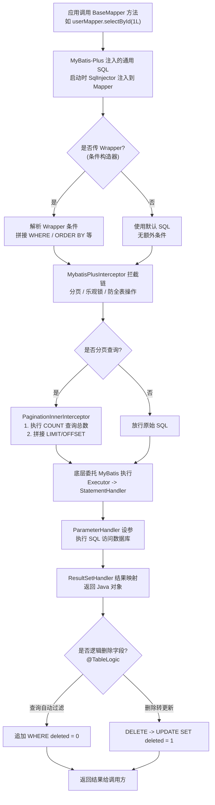

# MyBatis-Plus 实战

> 学习路线对应：第3周 -- 数据访问与 ORM
> 前置知识：MyBatis 基础、SQL 基础
> 预计学习时间：1-2 天

> 📖 **参考链接**：
> - [MyBatis-Plus 官方文档](https://baomidou.com/) -- MyBatis-Plus 官方站点，"只做增强不做改变"，涵盖快速开始、配置、插件、代码生成器等
> - [MyBatis-Plus 介绍](https://baomidou.com/introduce) -- 官方特性介绍：润物无声、效率至上、丰富功能
> - [MyBatis-Plus GitHub 仓库](https://github.com/baomidou/mybatis-plus) -- 源码与最新版本发布跟踪

## 一、核心概念

### 1.1 MyBatis vs MyBatis-Plus

> **生活化类比：MyBatis-Plus = MyBatis 的"官方外挂增强包"** —— MyBatis 是一辆手动挡汽车，性能好、操控感强（SQL 完全自己掌控），但每次起步都要踩离合挂挡（写 XML、写 CRUD），繁琐。MyBatis-Plus 就像给这辆车加装了一套"自动挡模块 + 辅助驾驶系统"——你不用换车（底层还是 MyBatis，"只做增强不做改变"），但 `BaseMapper` 自动给你提供 CRUD（自动挡），`QueryWrapper` 帮你拼条件（辅助驾驶），分页插件、乐观锁、逻辑删除、代码生成器都是"一键开启"的辅助功能。原有的手动挡（手写 XML、自定义 SQL）完全保留，你想用就用。所以国内项目"引入 MyBatis-Plus"几乎是标配：既享受 MyBatis 的 SQL 控制力，又享受增强工具的开发效率。

| 维度 | MyBatis | MyBatis-Plus |
|------|---------|-------------|
| **定位** | 半自动 ORM 框架 | MyBatis 增强工具包 |
| **CRUD** | 需手动编写 SQL | 内置 BaseMapper，无需写 SQL |
| **分页** | 需手动配置插件 | 内置分页插件 |
| **条件构造** | 需手写动态 SQL | 提供 QueryWrapper/LambdaQueryWrapper |
| **代码生成** | 需第三方工具 | 内置代码生成器（AutoGenerator） |
| **乐观锁** | 需手动实现 | 内置注解 `@Version` |
| **逻辑删除** | 需手动实现 | 内置注解 `@TableLogic` |
| **自动填充** | 需拦截器实现 | 内置 `@TableField(fill = ...)` |
| **关系** | 基础框架 | 在 MyBatis 基础上增强 |

### 1.2 核心注解

| 注解 | 作用 | 示例 |
|------|------|------|
| `@TableName` | 指定表名 | `@TableName("t_user")` |
| `@TableId` | 指定主键字段和策略 | `@TableId(type = IdType.ASSIGN_ID)` |
| `@TableField` | 指定字段映射和策略 | `@TableField(value = "user_name", fill = FieldFill.INSERT)` |
| `@TableLogic` | 逻辑删除 | `@TableLogic` |
| `@Version` | 乐观锁 | `@Version` |
| `@EnumValue` | 枚举值映射 | `@EnumValue` |

**主键策略（IdType）：**

| 策略 | 说明 |
|------|------|
| `AUTO` | 数据库自增 |
| `NONE` | 无策略（全局配置） |
| `INPUT` | 用户手动输入 |
| `ASSIGN_ID`（默认） | 雪花算法（Long） |
| `ASSIGN_UUID` | UUID（String） |

---

## 二、底层原理

### 2.1 BaseMapper 常用方法

**MyBatis-Plus 一次 CRUD 操作的完整流程（Mermaid 图）：**



> 上图展示了 MyBatis-Plus 执行 CRUD 的完整链路：应用调用 `BaseMapper` 方法（如 `selectById`），实际执行的是 MyBatis-Plus 在启动时通过 `SqlInjector` 注入的通用 SQL（无需你写 XML）。若传入 `Wrapper` 条件构造器，会解析成 WHERE/ORDER BY 子句。随后进入 `MybatisPlusInterceptor` 拦截链——分页插件会先执行 COUNT 查询总数再拼接 `LIMIT/OFFSET`，乐观锁插件会在 UPDATE 时校验版本号，防全表操作插件会拦截无 WHERE 的危险语句。最终委托底层 MyBatis 执行 SQL，结果经 ResultSetHandler 映射返回。若实体有 `@TableLogic` 逻辑删除字段，查询自动追加 `WHERE deleted = 0`，删除操作自动转为 `UPDATE SET deleted = 1`。整个流程对业务代码透明。

```java
public interface UserMapper extends BaseMapper<User> {
    // MyBatis-Plus 自动提供的方法：
    // insert(T entity)                   插入一条记录
    // deleteById(Serializable id)        根据 ID 删除
    // deleteByMap(Map<String, Object>)   根据条件删除
    // deleteBatchIds(Collection<?>)      批量删除
    // updateById(T entity)               根据 ID 更新
    // selectById(Serializable id)        根据 ID 查询
    // selectBatchIds(Collection<?>)      批量查询
    // selectByMap(Map<String, Object>)   根据条件查询
    // selectOne(Wrapper<T> wrapper)      查询一条记录
    // selectCount(Wrapper<T> wrapper)    查询总数
    // selectList(Wrapper<T> wrapper)     查询列表
    // selectPage(IPage<T> page, ...)     分页查询
}
```

### 2.2 条件构造器

> **生活化类比：条件构造器（QueryWrapper / LambdaQueryWrapper）= "智能 SQL 拼接乐高"** —— MyBatis 写动态查询要么在 XML 里堆 `<if>` 标签（像搭乐高但要在 XML 文件里写），要么手动拼字符串（容易拼错、SQL 注入）。MyBatis-Plus 的 `QueryWrapper` 把这套乐高搬到了 Java 代码里：`eq("username", "张三")` 是一块"等于"积木，`.like("email", "@qq.com")` 是一块"模糊"积木，`.between("age", 18, 30)` 是一块"区间"积木。你链式调用 `.eq().like().between()` 就像把积木一块块扣上去，最后拼出完整的 WHERE 子句。`LambdaQueryWrapper` 更进一步——用 `User::getUsername` 替代字符串 `"username"`，就像积木上刻了字段名，编译期就能检查对错（类型安全），重构改字段名时 IDE 自动跟着改，不会再出现"字符串写错运行时才报错"的尴尬。

```java
// QueryWrapper：使用字符串列名
QueryWrapper<User> wrapper = new QueryWrapper<>();
wrapper.eq("username", "张三")
       .like("email", "@qq.com")
       .between("age", 18, 30)
       .orderByDesc("created_at");

// LambdaQueryWrapper：使用 Lambda 表达式，类型安全，避免列名写错
LambdaQueryWrapper<User> lambdaWrapper = new LambdaQueryWrapper<>();
lambdaWrapper.eq(User::getUsername, "张三")
             .like(User::getEmail, "@qq.com")
             .between(User::getAge, 18, 30)
             .orderByDesc(User::getCreatedAt);
```

**常用条件方法：**

| 方法 | 说明 | 示例 |
|------|------|------|
| `eq` | 等于 = | `eq("name", "张三")` |
| `ne` | 不等于 <> | `ne("status", 0)` |
| `gt` | 大于 > | `gt("age", 18)` |
| `ge` | 大于等于 >= | `ge("age", 18)` |
| `lt` | 小于 < | `lt("age", 60)` |
| `le` | 小于等于 <= | `le("age", 60)` |
| `like` | 模糊查询 | `like("name", "张")` |
| `in` | IN 查询 | `in("id", 1, 2, 3)` |
| `between` | BETWEEN | `between("age", 18, 30)` |
| `isNull` | IS NULL | `isNull("email")` |
| `orderByAsc/Desc` | 排序 | `orderByDesc("created_at")` |
| `groupBy` | 分组 | `groupBy("dept_id")` |
| `having` | HAVING | `having("count(*) > 5")` |

### 2.3 分页插件配置

```java
@Configuration
public class MybatisPlusConfig {

    @Bean
    public MybatisPlusInterceptor mybatisPlusInterceptor() {
        MybatisPlusInterceptor interceptor = new MybatisPlusInterceptor();
        // 分页插件
        interceptor.addInnerInterceptor(new PaginationInnerInterceptor(DbType.MYSQL));
        // 乐观锁插件
        interceptor.addInnerInterceptor(new OptimisticLockerInnerInterceptor());
        return interceptor;
    }
}
```

```java
// 分页查询
IPage<User> page = new Page<>(1, 10); // 第1页，每页10条
IPage<User> result = userMapper.selectPage(page, wrapper);
System.out.println("总记录数: " + result.getTotal());
System.out.println("总页数: " + result.getPages());
System.out.println("当前页数据: " + result.getRecords());
```

### 2.3.1 自定义拦截器实现分页查询

以下是一个完整的自定义分页拦截器，展示如何在不依赖 MyBatis-Plus 内置分页插件的情况下，通过拦截器机制自己实现分页逻辑：

```java
import com.baomidou.mybatisplus.core.metadata.IPage;
import com.baomidou.mybatisplus.extension.plugins.inner.InnerInterceptor;
import lombok.extern.slf4j.Slf4j;
import org.apache.ibatis.executor.Executor;
import org.apache.ibatis.mapping.BoundSql;
import org.apache.ibatis.mapping.MappedStatement;
import org.apache.ibatis.mapping.ParameterMapping;
import org.apache.ibatis.session.ResultHandler;
import org.apache.ibatis.session.RowBounds;
import org.springframework.stereotype.Component;

import java.sql.Connection;
import java.sql.PreparedStatement;
import java.sql.ResultSet;
import java.sql.SQLException;
import java.util.Map;

/**
 * 自定义分页拦截器：演示如何从零实现分页逻辑
 * 核心流程：拦截 SQL -> 执行 COUNT 查询 -> 拼接 LIMIT 分页 -> 注入分页 SQL
 */
@Slf4j
@Component
public class CustomPaginationInterceptor implements InnerInterceptor {

    /**
     * 在查询执行前拦截，负责：
     * 1. 从参数中提取 IPage 分页对象
     * 2. 执行 COUNT 查询获取总记录数
     * 3. 拼接数据库方言的分页 SQL
     */
    @Override
    public void beforeQuery(Executor executor, MappedStatement ms, Object parameter,
                            RowBounds rowBounds, ResultHandler<?> resultHandler, BoundSql boundSql) {
        
        // 步骤1：从参数中提取分页对象
        IPage<?> page = extractPage(parameter);
        if (page == null) {
            return; // 非分页查询，直接放行
        }

        // 步骤2：执行 COUNT 查询获取总记录数
        String originalSql = boundSql.getSql();
        String countSql = String.format("SELECT COUNT(*) FROM ( %s ) TOTAL", originalSql);
        long total = executeCount(executor, ms, boundSql, countSql);
        page.setTotal(total);

        if (total == 0) {
            return; // 总数为0，无需查询数据
        }

        // 步骤3：根据数据库方言拼接分页 SQL（MySQL 示例）
        long offset = page.offset(); // 计算偏移量：(current - 1) * size
        long limit = page.getSize();
        String pageSql = originalSql + " LIMIT " + limit + " OFFSET " + offset;
        
        // 步骤4：通过反射将分页 SQL 注入到 BoundSql 中（实际使用中修改 sql 字段）
        setBoundSql(boundSql, pageSql);
        log.debug("分页 SQL 已注入: {}", pageSql);
    }

    /**
     * 从参数 Map 中提取 IPage 对象
     */
    private IPage<?> extractPage(Object parameter) {
        if (parameter instanceof Map) {
            Map<?, ?> paramMap = (Map<?, ?>) parameter;
            for (Object value : paramMap.values()) {
                if (value instanceof IPage) {
                    return (IPage<?>) value;
                }
            }
        }
        return null;
    }

    /**
     * 执行 COUNT 查询
     */
    private long executeCount(Executor executor, MappedStatement ms, BoundSql boundSql, String countSql) {
        try (Connection conn = executor.getTransaction().getConnection();
             PreparedStatement ps = conn.prepareStatement(countSql)) {
            // 设置参数
            int index = 1;
            for (ParameterMapping pm : boundSql.getParameterMappings()) {
                Object value = boundSql.getAdditionalParameter(pm.getProperty());
                if (value != null) {
                    ps.setObject(index++, value);
                }
            }
            try (ResultSet rs = ps.executeQuery()) {
                if (rs.next()) {
                    return rs.getLong(1);
                }
            }
        } catch (SQLException e) {
            log.error("自定义分页 COUNT 查询失败", e);
        }
        return 0;
    }

    /**
     * 通过反射修改 BoundSql 中的 SQL 语句
     */
    private void setBoundSql(BoundSql boundSql, String newSql) {
        try {
            java.lang.reflect.Field field = BoundSql.class.getDeclaredField("sql");
            field.setAccessible(true);
            field.set(boundSql, newSql);
        } catch (Exception e) {
            log.error("修改 BoundSql 失败", e);
        }
    }
}
```

### 2.3.2 自定义分页插件配置（完整版）

以下配置展示了 MyBatis-Plus 分页插件的完整配置项，包含多数据库方言适配、安全限制和自定义拦截器链：

```java
import com.baomidou.mybatisplus.annotation.DbType;
import com.baomidou.mybatisplus.extension.plugins.MybatisPlusInterceptor;
import com.baomidou.mybatisplus.extension.plugins.inner.BlockAttackInnerInterceptor;
import com.baomidou.mybatisplus.extension.plugins.inner.OptimisticLockerInnerInterceptor;
import com.baomidou.mybatisplus.extension.plugins.inner.PaginationInnerInterceptor;
import org.springframework.context.annotation.Bean;
import org.springframework.context.annotation.Configuration;

/**
 * MyBatis-Plus 插件完整配置
 * 包含：分页、乐观锁、防全表操作、多数据源、SQL 性能监控
 */
@Configuration
public class MybatisPlusConfig {

    /**
     * 核心拦截器配置
     * 拦截器链按添加顺序执行，分页插件建议放在最后
     */
    @Bean
    public MybatisPlusInterceptor mybatisPlusInterceptor() {
        MybatisPlusInterceptor interceptor = new MybatisPlusInterceptor();

        // ========== 1. 分页插件（核心） ==========
        PaginationInnerInterceptor pagination = new PaginationInnerInterceptor(DbType.MYSQL);
        
        // 数据库类型：支持 MYSQL / ORACLE / POSTGRE_SQL / SQL_SERVER / MARIADB 等
        // 也可以不写死，通过以下方式动态判断：
        // pagination.setDbType(JdbcUtils.getDbType(jdbcUrl));
        pagination.setDbType(DbType.MYSQL);
        
        // 溢出处理：页码超过总页数时自动修正为第一页（默认 false）
        pagination.setOverflow(true);
        
        // 单页最大限制：防止恶意请求一次性拉取全量数据（-1 表示不限制）
        pagination.setMaxLimit(500L);
        
        // 优化 COUNT 查询：LEFT JOIN 时去掉左表只保留 JOIN 关联
        pagination.setOptimizeJoin(true);
        
        interceptor.addInnerInterceptor(pagination);

        // ========== 2. 乐观锁插件 ==========
        // 配合实体类中 @Version 注解使用
        // 更新时自动 WHERE version = ? AND version = version + 1
        OptimisticLockerInnerInterceptor optimisticLocker = new OptimisticLockerInnerInterceptor();
        interceptor.addInnerInterceptor(optimisticLocker);

        // ========== 3. 防全表更新/删除插件 ==========
        // 拦截不带 WHERE 条件的 UPDATE / DELETE 语句，防止误操作清空全表
        BlockAttackInnerInterceptor blockAttack = new BlockAttackInnerInterceptor();
        interceptor.addInnerInterceptor(blockAttack);

        // ========== 4. 自定义拦截器（可选） ==========
        // 如需多租户隔离、SQL 审计日志、自定义分页等，可在此添加
        // interceptor.addInnerInterceptor(new CustomPaginationInterceptor());

        return interceptor;
    }
}
```

**多数据源场景下的分页插件配置：**

```java
import com.baomidou.mybatisplus.autoconfigure.ConfigurationCustomizer;
import org.springframework.context.annotation.Bean;
import org.springframework.context.annotation.Configuration;

/**
 * 多数据源分页适配：当项目同时使用 MySQL 和 Oracle 时
 * 可通过 MybatisPlusInterceptor 注册多个分页拦截器分别处理
 */
@Configuration
public class MultiDataSourcePaginationConfig {

    @Bean
    public MybatisPlusInterceptor multiInterceptor() {
        MybatisPlusInterceptor interceptor = new MybatisPlusInterceptor();
        
        // MySQL 分页拦截器（使用 LIMIT 语法）
        PaginationInnerInterceptor mysqlInterceptor = new PaginationInnerInterceptor(DbType.MYSQL);
        mysqlInterceptor.setMaxLimit(500L);
        interceptor.addInnerInterceptor(mysqlInterceptor);
        
        // 如需支持 Oracle，可再添加一个 Oracle 分页拦截器
        // PaginationInnerInterceptor oracleInterceptor = new PaginationInnerInterceptor(DbType.ORACLE);
        // interceptor.addInnerInterceptor(oracleInterceptor);
        
        return interceptor;
    }
    
    /**
     * 全局配置：启用 MyBatis 日志输出，方便调试 SQL
     */
    @Bean
    public ConfigurationCustomizer configurationCustomizer() {
        return configuration -> configuration.setLogImpl(
            org.apache.ibatis.logging.stdout.StdOutImpl.class
        );
    }
}
```

---

### 2.4 代码生成器（AutoGenerator）

```java
public class CodeGenerator {
    public static void main(String[] args) {
        FastAutoGenerator.create(
            "jdbc:mysql://localhost:3306/test_db",
            "root",
            "password"
        )
        .globalConfig(builder -> builder
            .author("开发者")
            .outputDir("D:\\project\\src\\main\\java")
            .disableOpenDir()
        )
        .packageConfig(builder -> builder
            .parent("com.example")
            .moduleName("user")
            .entity("entity")
            .mapper("mapper")
            .service("service")
            .controller("controller")
        )
        .strategyConfig(builder -> builder
            .addInclude("t_user", "t_order") // 指定表
            .entityBuilder()
            .enableLombok()
            .enableTableFieldAnnotation()
            .controllerBuilder()
            .enableRestStyle()
        )
        .execute();
    }
}
```

### 2.4.1 代码生成器完整配置

以下是代码生成器的**完整可运行配置**，包含数据源配置、全局配置、包配置、策略配置、模板配置等所有选项：

```java
import com.baomidou.mybatisplus.annotation.FieldFill;
import com.baomidou.mybatisplus.annotation.IdType;
import com.baomidou.mybatisplus.generator.FastAutoGenerator;
import com.baomidou.mybatisplus.generator.config.OutputFile;
import com.baomidou.mybatisplus.generator.config.rules.DateType;
import com.baomidou.mybatisplus.generator.engine.FreemarkerTemplateEngine;
import com.baomidou.mybatisplus.generator.fill.Column;
import com.baomidou.mybatisplus.generator.fill.Property;

import java.util.Collections;

/**
 * MyBatis-Plus 代码生成器 - 完整可运行配置示例
 * 使用 FastAutoGenerator 一键生成 Entity、Mapper、Service、Controller
 *
 * 依赖：需要添加 generator 和模板引擎依赖（Freemarker 或 Velocity）
 * <dependency>
 *     <groupId>com.baomidou</groupId>
 *     <artifactId>mybatis-plus-generator</artifactId>
 *     <version>3.5.5</version>
 * </dependency>
 * <dependency>
 *     <groupId>org.freemarker</groupId>
 *     <artifactId>freemarker</artifactId>
 * </dependency>
 */
public class FullCodeGenerator {

    public static void main(String[] args) {
        // ========== 1. 数据源配置 ==========
        String url = "jdbc:mysql://localhost:3306/your_database?useUnicode=true&characterEncoding=utf8&serverTimezone=GMT%2B8";
        String username = "root";
        String password = "your_password";

        // ========== 2. 输出目录 ==========
        String outputDir = System.getProperty("user.dir") + "/src/main/java";
        String xmlOutputDir = System.getProperty("user.dir") + "/src/main/resources/mapper";

        // ========== 3. 包名配置 ==========
        String parentPackage = "com.yourcompany.project";
        String moduleName = "order";
        String author = "Your Name";

        // ========== 4. 生成开始 ==========
        FastAutoGenerator.create(url, username, password)
            .globalConfig(builder -> {
                builder
                    .author(author)                 // 设置作者
                    .outputDir(outputDir)           // 输出目录
                    .fileOverride()                 // 覆盖已有文件（生产环境请关闭）
                    .openDir(false)                 // 是否打开输出目录
                    .enableSwagger()                // 开启 Swagger 注解
                    .dateType(DateType.TIME_PACK)   // 日期类型：LOCAL_DATE_TIME
                    .commentDate("yyyy-MM-dd");     // 注释日期格式
            })
            .packageConfig(builder -> {
                builder
                    .parent(parentPackage)         // 父包名
                    .moduleName(moduleName)        // 模块名
                    .entity("entity")              // Entity 包名
                    .mapper("mapper")              // Mapper 包名
                    .service("service")            // Service 包名
                    .serviceImpl("service.impl")    // ServiceImpl 包名
                    .controller("controller")      // Controller 包名
                    .xml("mapper")                 // Mapper XML 包名
                    .pathInfo(Collections.singletonMap(
                        OutputFile.xml, xmlOutputDir  // XML 文件输出到 resources
                    ));
            })
            .strategyConfig(builder -> {
                builder
                    // 需要生成代码的表名，可以多张
                    .addInclude("t_order", "t_order_item", "t_order_log")
                    // 排除表前缀（生成的类名会自动去掉前缀）
                    .addTablePrefix("t_", "b_");

                // ========== Entity 配置 ==========
                builder.entityBuilder()
                    .enableLombok()                     // 开启 Lombok 注解
                    .enableTableFieldAnnotation()       // 开启 @TableField 注解
                    .enableTableLogic()                 // 开启逻辑删除
                    .idType(IdType.ASSIGN_ID)          // 主键策略：ASSIGN_ID（雪花算法）
                    .formatFileName("%s")               // 类名格式：直接用表名
                    .addTableFills(                     // 自动填充字段
                        new Column("created_at", FieldFill.INSERT),
                        new Column("updated_at", FieldFill.INSERT_UPDATE)
                    );

                // ========== Mapper 配置 ==========
                builder.mapperBuilder()
                    .enableMapperAnnotation()           // @Mapper 注解
                    .enableBaseResultMap()             // 生成 BaseResultMap（字段映射）
                    .enableBaseColumnList()             // 生成 BaseColumnList（列名列表）
                    .formatMapperFileName("%sMapper")
                    .formatXmlFileName("%sMapper");

                // ========== Service 配置 ==========
                builder.serviceBuilder()
                    .formatServiceFileName("I%sService")
                    .formatServiceImplFileName("%sServiceImpl");

                // ========== Controller 配置 ==========
                builder.controllerBuilder()
                    .enableRestStyle()                 // REST 风格 @RestController
                    .enableHyphenStyle()               // 路径使用连字符（如 /user-list 而非 /userList）
                    .formatFileName("%sController");
            })
            // 使用 Freemarker 模板引擎（默认）
            .templateConfig(builder -> builder
                .controller("/templates/controller.java")
                .entity("/templates/entity.java")
                .mapper("/templates/mapper.java")
                .xml("/templates/mapper.xml")
                .service("/templates/service.java")
                .serviceImpl("/templates/serviceImpl.java")
            )
            .templateEngine(new FreemarkerTemplateEngine())
            .execute();
    }
}
```

**Maven 依赖配置：**

```xml
<dependencies>
    <!-- MyBatis-Plus Generator -->
    <dependency>
        <groupId>com.baomidou</groupId>
        <artifactId>mybatis-plus-generator</artifactId>
        <version>3.5.5</version>
    </dependency>
    <!-- Freemarker 模板引擎 -->
    <dependency>
        <groupId>org.freemarker</groupId>
        <artifactId>freemarker</artifactId>
        <version>2.3.32</version>
    </dependency>
    <!-- MySQL JDBC 驱动 -->
    <dependency>
        <groupId>com.mysql</groupId>
        <artifactId>mysql-connector-j</artifactId>
        <version>8.0.33</version>
    </dependency>
</dependencies>
```

**使用说明：**
1. 修改 `url`/`username`/`password` 为你的数据库配置
2. 修改 `parentPackage`/`moduleName`/`addInclude`（表名）
3. 直接运行 main 方法，自动生成所有代码

---

## 三、实战应用

### 3.1 逻辑删除

> **生活化类比：逻辑删除 = "电脑回收站"** —— 物理删除（`DELETE FROM`）就像把文件直接扔进焚化炉，灰飞烟灭，再也找不回。逻辑删除（`UPDATE SET deleted = 1`）就像把文件拖进回收站——文件还在硬盘上（数据没真删），只是加了"已删除"标记，桌面（查询）上看不到了。哪天你后悔了，还能从回收站还原（`UPDATE SET deleted = 0`）。MyBatis-Plus 的 `@TableLogic` 就是自动给你装了个回收站：调用 `deleteById()` 它偷偷改成 `UPDATE`，调用 `selectList()` 它自动加 `WHERE deleted = 0` 过滤掉"回收站"里的数据。业务代码无感知，但数据安全多了——电商订单、财务流水这类"绝对不能真删"的数据，逻辑删除是标配。

```java
// 配置
@Data
@TableName("t_user")
public class User {
    @TableId
    private Long id;

    private String username;

    @TableLogic
    private Integer deleted; // 0=未删除，1=已删除
}
```

```yaml
# application.yml
mybatis-plus:
  global-config:
    db-config:
      logic-delete-field: deleted     # 全局逻辑删除字段
      logic-delete-value: 1           # 删除后的值
      logic-not-delete-value: 0       # 未删除的值
```

配置后，`deleteById()` 会变成 `UPDATE SET deleted = 1 WHERE id = ?`，`selectList()` 会自动添加 `WHERE deleted = 0`。

### 3.2 乐观锁

```java
@Data
public class Product {
    @TableId
    private Long id;
    private String name;
    private Integer stock;

    @Version
    private Integer version; // 版本号
}

// 更新时自动检查版本号
// UPDATE product SET stock = 50, version = version + 1
// WHERE id = 1 AND version = 3
// 如果 version 不匹配，updateById 返回 0（影响行数为0），需开发者自行判断处理
// 注：Spring Data JPA 才会抛出 OptimisticLockException，MyBatis-Plus 不会抛异常
```

### 3.3 自动填充

```java
@Data
public class BaseEntity {
    @TableField(fill = FieldFill.INSERT)
    private LocalDateTime createdAt;

    @TableField(fill = FieldFill.INSERT_UPDATE)
    private LocalDateTime updatedAt;
}

@Component
public class MyMetaObjectHandler implements MetaObjectHandler {
    @Override
    public void insertFill(MetaObject metaObject) {
        this.strictInsertFill(metaObject, "createdAt", LocalDateTime.class, LocalDateTime.now());
        this.strictInsertFill(metaObject, "updatedAt", LocalDateTime.class, LocalDateTime.now());
    }

    @Override
    public void updateFill(MetaObject metaObject) {
        this.strictUpdateFill(metaObject, "updatedAt", LocalDateTime.class, LocalDateTime.now());
    }
}
```

---

## 四、常见面试题（附答案）

### 1. MyBatis 和 MyBatis-Plus 的区别？

MyBatis 是半自动 ORM 框架，需要手动编写 SQL 和 XML 映射文件。MyBatis-Plus 是 MyBatis 的增强工具包，在 MyBatis 基础上提供了内置 CRUD（BaseMapper）、条件构造器（QueryWrapper）、分页插件、代码生成器、乐观锁、逻辑删除等功能，减少重复代码。

### 2. MyBatis-Plus 的分页原理？

通过 `PaginationInnerInterceptor` 拦截器拦截 SQL 执行，在原始 SQL 外层包装分页 SQL（如 MySQL 的 `LIMIT`）。分页插件会先执行 `COUNT` 查询获取总数，再执行分页查询获取当前页数据。

### 3. QueryWrapper 和 LambdaQueryWrapper 的区别？

`QueryWrapper` 使用字符串列名（如 `"username"`），容易写错且无法利用 IDE 重构。`LambdaQueryWrapper` 使用 Lambda 表达式（如 `User::getUsername`），类型安全，支持 IDE 自动补全和重构。推荐使用 `LambdaQueryWrapper`。

### 4. MyBatis-Plus 逻辑删除的原理？

通过 `@TableLogic` 注解标识逻辑删除字段，框架会自动将 `deleteById()` 等删除操作转换为 `UPDATE` 语句，将逻辑删除字段设置为删除标记值。查询时自动添加 `WHERE deleted = 0` 条件。

### 5. MyBatis 中 `#{}` 和 `${}` 的区别？

`#{}` 是预编译占位符，会将参数替换为 `?`，通过 `PreparedStatement` 设置参数，防止 SQL 注入。`${}` 是字符串替换，直接将参数拼接到 SQL 中，存在 SQL 注入风险。一般情况下使用 `#{}`，仅在动态表名、排序字段等场景使用 `${}`。

---

## 五、避坑指南

| 常见错误 | 现象 | 原因 | 解决方案 |
|---------|------|------|---------|
| 分页查询后直接序列化 IPage | 序列化效率低，返回大量无用元数据 | IPage 对象包含大量内部元数据（如 pages、searchCount 等） | 只返回需要的数据：封装 PageResult，只传 total 和 records |
| 循环单条插入 | 批量插入极慢，每条数据一条 SQL | 每次 insert 都是一次数据库交互，网络开销大 | 使用 saveBatch() 分批插入（每 100 条一批）；使用 insertBatchSomeColumn 自定义 SQL 合并 |
| 乐观锁更新失败未重试 | 高并发下更新失败，业务异常 | 版本号不匹配时 updateById 返回 0 行，未做重试处理 | 实现重试机制（如最多 3 次），失败后重新读取最新数据再更新 |

---

> **学习导航**：
> - 返回 [学习路线总览](../../README.md)
> - 本模块其他文件：[03-MyBatis原生框架](./03-MyBatis原生框架.md) | [04-Spring-Data-JPA深度](./04-Spring-Data-JPA深度.md)
> - 关联模块：[01-MySQL基础与SQL核心](../../01-java-basics/mysql-jdbc/01-MySQL基础与SQL核心.md) | [02-JDBC核心原理](../../01-java-basics/mysql-jdbc/02-JDBC核心原理.md) | [06-MySQL深度优化](../../03-distributed-microservices/mysql-advanced/06-MySQL深度优化.md) | [07-数据库笔面试题集](../../03-distributed-microservices/mysql-advanced/07-数据库笔面试题集.md)
> - 实战应用：[电商订单实时统计分析平台](../../extensions/project/01-电商订单实时统计分析平台.md)

