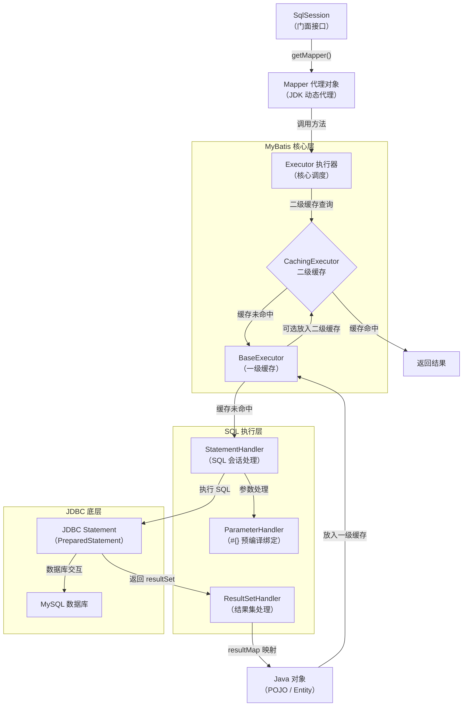

# MyBatis - 综合场景串联

---

**MyBatis 核心执行流程全景图：**



> 上图展示了 MyBatis 核心执行流程：SqlSession 通过 JDK 动态代理获取 Mapper 接口实现，Executor 调度器先查二级缓存再查一级缓存，缓存未命中时由 StatementHandler 组装 SQL 并通过 ParameterHandler 绑定参数，最终由 JDBC 执行 SQL 并将结果经 ResultSetHandler 映射为 Java 对象。

---

## 场景一：Spring Boot 整合 MyBatis 实现 CRUD

### 场景描述
在 Spring Boot 项目中整合 MyBatis，实现用户表的增删改查功能，包含动态条件查询、批量操作和分页查询。

### 涉及知识点
- [MyBatis 原生框架](./03-MyBatis原生框架.md)：Mapper XML 编写、动态 SQL（if/where/foreach/set）、#{} 与 ${} 区别、一二级缓存配置
- [MyBatis-Plus 实战](./05-MyBatis-Plus实战.md)：BaseMapper 内置 CRUD、条件构造器、分页插件
- [Spring Data JPA 深度](./04-Spring-Data-JPA深度.md)：事务管理、@Transactional 传播行为与隔离级别

### 协作流程
1. 引入 mybatis-spring-boot-starter 和数据库驱动依赖，配置 application.yml 中的数据源和 MyBatis 驼峰映射
2. 定义实体类 User 与数据库表 t_user 对应，开启 mapUnderscoreToCamelCase 自动映射下划线到驼峰
3. 创建 UserMapper 接口，定义 CRUD 方法签名，在 UserMapper.xml 中编写对应的 SQL 语句
4. 动态条件查询：使用 <where> + <if> 标签组合实现多条件模糊查询，参数值用 #{} 防注入
5. 批量操作：使用 <foreach> 实现批量插入和批量删除，注意每批数据量控制在 500~1000 条
6. 分页查询：配置 MybatisPlusInterceptor 添加 PaginationInnerInterceptor，使用 IPage 进行分页查询，返回时只传 total 和 records 避免序列化元数据
7. Service 层使用 @Transactional 管理事务，增删改操作确保事务一致性

### 关键要点
- 参数值始终使用 #{}，表名/排序列名等 SQL 结构部分用 ${} 但必须做白名单校验
- 动态 SQL 中 < 符号需用 &lt; 转义或使用 CDATA 包裹
- 单参数（非 JavaBean）时必须加 @Param 注解，否则 XML 中无法按属性名取值
- 开启二级缓存需注意多表关联场景的脏读问题，建议只对读多写少的单表开启

---

## 场景二：MyBatis-Plus 实现多表关联查询 + 分页

### 场景描述
使用 MyBatis-Plus 实现订单与用户、商品的关联查询，支持多条件筛选和分页，并处理乐观锁库存扣减。

### 涉及知识点
- [MyBatis-Plus 实战](./05-MyBatis-Plus实战.md)：BaseMapper 继承、LambdaQueryWrapper 条件构造、分页插件、乐观锁 @Version、逻辑删除 @TableLogic
- [MyBatis 原生框架](./03-MyBatis原生框架.md)：自定义 Mapper XML 多表关联查询、resultMap 映射
- [Spring Data JPA 深度](./04-Spring-Data-JPA深度.md)：事务传播行为与隔离级别

### 协作流程
1. 定义 Order、User、Product 实体类，使用 @TableName、@TableId、@TableField 等注解映射表结构
2. OrderMapper 继承 BaseMapper<Order> 获得内置 CRUD 方法，同时自定义多表关联查询方法
3. 在 OrderMapper.xml 中编写关联查询 SQL，使用 resultMap 显式映射 Order 及其关联的 User、Product 信息
4. 使用 LambdaQueryWrapper 构建类型安全的条件查询：按用户ID、订单状态、创建时间范围筛选
5. 分页查询：IPage<Order> page = new Page<>(1, 10)，调用 orderMapper.selectPage(page, wrapper)
6. 乐观锁库存扣减：Product 表添加 @Version 字段，更新时自动检查版本号，实现重试机制（最多 3 次）
7. 逻辑删除：订单表添加 @TableLogic 字段，删除操作自动转为 UPDATE 设置删除标记

### 关键要点
- LambdaQueryWrapper 优于 QueryWrapper，类型安全、支持 IDE 重构
- 分页查询结果不要直接返回 IPage 对象，应封装为只含 total 和 records 的 PageResult
- 乐观锁更新失败时 updateById 返回 0 行（不抛异常），需自行判断并实现重试
- 关联查询使用 resultMap 更灵活，避免 resultType 列名不匹配导致的字段为 null

---

## 场景三：ORM 框架选型与数据层设计

### 场景描述
在项目启动阶段，根据业务场景选择合适的 ORM 框架（MyBatis/MyBatis-Plus/JPA），设计数据访问层架构，包括实体映射、缓存策略、事务管理。

### 涉及知识点
- [MyBatis 原生框架](./03-MyBatis原生框架.md)：MyBatis 架构分层、SqlSession 生命周期、一二级缓存机制
- [Spring Data JPA 深度](./04-Spring-Data-JPA深度.md)：JPA 实体关系映射、N+1 问题、OSIV 配置、事务传播行为
- [MyBatis-Plus 实战](./05-MyBatis-Plus实战.md)：主键策略、自动填充、代码生成器

### 协作流程
1. 框架选型：标准 CRUD 为主用 JPA 或 MyBatis-Plus；复杂查询、报表、多表关联用 MyBatis；快速开发 + 复杂 SQL 场景用 MyBatis-Plus（继承 MyBatis 全部能力）
2. 实体设计：使用 @TableField(fill = FieldFill.INSERT) 实现创建时间自动填充，配合 MetaObjectHandler 统一处理
3. 主键策略：分布式场景用 ASSIGN_ID（雪花算法），单机场景用 AUTO（数据库自增）
4. 缓存策略：MyBatis 一级缓存默认开启（SqlSession 级别），二级缓存谨慎使用（仅读多写少的单表，注意跨表脏读风险）
5. JPA 注意事项：关闭 OSIV（spring.jpa.open-in-view=false），避免 N+1 问题（用 JOIN FETCH 或 @EntityGraph 预加载），双向关联用 @JsonIgnore 或 DTO 避免序列化无限递归
6. 事务管理：Service 层使用 @Transactional，默认 REQUIRED 传播行为，根据业务需求选择隔离级别（READ_COMMITTED 为常用选择）
7. 代码生成：使用 MyBatis-Plus AutoGenerator 根据数据库表生成实体、Mapper、Service、Controller，减少重复编码

### 关键要点
- 生产环境必须关闭 OSIV，避免连接池耗尽
- JPA 双向关联的 equals/hashCode 需正确重写，避免 id 为 null 时 hashCode 不一致
- MyBatis 二级缓存默认基于本地 HashMap，分布式环境需集成 Redis 等外部缓存
- 事务传播行为需根据业务场景选择：子操作需独立事务用 REQUIRES_NEW，嵌套事务用 NESTED

---

## 场景四：MyBatis 多数据源配置

### 场景描述
在 Spring Boot 项目中配置多个数据源（如主库负责读写、从库负责只读查询），实现读写分离或对接多个不同数据库，要求事务管理正确、数据源切换便捷。

### 涉及知识点
- [MyBatis 原生框架](./03-MyBatis原生框架.md)：SqlSessionFactory 配置、Mapper 扫描路径隔离
- [MyBatis-Plus 实战](./05-MyBatis-Plus实战.md)：dynamic-datasource 多数据源注解切换
- [Spring Data JPA 深度](./04-Spring-Data-JPA深度.md)：事务管理器与数据源绑定

### 协作流程
1. 引入 dynamic-datasource-spring-boot-starter 依赖（推荐）或手动配置多数据源
2. 在 application.yml 中配置主从数据源连接信息
3. 使用 @DS 注解在 Service 或 Mapper 方法上指定数据源
4. 配置事务管理器，确保 @Transactional 能正确绑定到对应数据源
5. 验证读写分离效果：写操作走主库，读操作走从库

### 关键要点
- 多数据源场景下，@Transactional 默认只管理主数据源的事务
- 使用 @DS 注解时，方法上的注解优先级高于类上的注解
- dynamic-datasource 支持负载均衡、一主多从配置
- 手动配置方式需注意 MapperScannerConfigurer 的扫描路径隔离

### 完整示例代码

#### 方案一：使用 dynamic-datasource-spring-boot-starter（推荐）

**步骤一：添加依赖 (pom.xml)**

```xml
<!-- dynamic-datasource 多数据源启动器 -->
<dependency>
    <groupId>com.baomidou</groupId>
    <artifactId>dynamic-datasource-spring-boot-starter</artifactId>
    <version>3.6.1</version>
</dependency>
```

**步骤二：配置 application.yml**

```yaml
spring:
  datasource:
    dynamic:
      # 默认数据源（主库）
      primary: master
      # 严格模式：未匹配到数据源时抛异常
      strict: true
      # 数据源列表
      datasource:
        # 主库 — 负责读写
        master:
          driver-class-name: com.mysql.cj.jdbc.Driver
          url: jdbc:mysql://192.168.1.100:3306/trading_db?useUnicode=true&characterEncoding=utf8mb4&serverTimezone=Asia/Shanghai
          username: root
          password: ${MASTER_DB_PASSWORD}
        # 从库组 — 负责只读（负载均衡轮询 slave_1 和 slave_2）
        slave:
          # 从库1
          slave_1:
            driver-class-name: com.mysql.cj.jdbc.Driver
            url: jdbc:mysql://192.168.1.101:3306/trading_db?useUnicode=true&characterEncoding=utf8mb4&serverTimezone=Asia/Shanghai
            username: root
            password: ${SLAVE_DB_PASSWORD}
          # 从库2
          slave_2:
            driver-class-name: com.mysql.cj.jdbc.Driver
            url: jdbc:mysql://192.168.1.102:3306/trading_db?useUnicode=true&characterEncoding=utf8mb4&serverTimezone=Asia/Shanghai
            username: root
            password: ${SLAVE_DB_PASSWORD}
        # 另一个独立业务库（如日志库）
        log_db:
          driver-class-name: com.mysql.cj.jdbc.Driver
          url: jdbc:mysql://192.168.1.200:3306/log_db?useUnicode=true&characterEncoding=utf8mb4&serverTimezone=Asia/Shanghai
          username: root
          password: ${LOG_DB_PASSWORD}
      # 从库负载均衡策略（默认轮询）
      seata: false

# MyBatis-Plus 配置
mybatis-plus:
  configuration:
    map-underscore-to-camel-case: true
    log-impl: org.apache.ibatis.logging.stdout.StdOutImpl
```

**步骤三：使用 @DS 注解切换数据源**

```java
package com.example.demo.service;

import com.baomidou.dynamic.datasource.annotation.DS;
import com.example.demo.entity.Order;
import com.example.demo.entity.User;
import com.example.demo.mapper.OrderMapper;
import com.example.demo.mapper.UserMapper;
import lombok.RequiredArgsConstructor;
import org.springframework.stereotype.Service;
import org.springframework.transaction.annotation.Transactional;

import java.util.List;

/**
 * 订单 Service — 演示读写分离
 */
@Service
@RequiredArgsConstructor
public class OrderService {

    private final OrderMapper orderMapper;
    private final UserMapper userMapper;

    /**
     * 创建订单 — 写操作走主库（默认）
     */
    @Transactional(rollbackFor = Exception.class)
    public Order createOrder(Order order) {
        orderMapper.insert(order);
        // 扣减库存等操作也在主库
        return order;
    }

    /**
     * 查询订单列表 — 读操作走从库，使用 @DS("slave") 利用负载均衡
     */
    @DS("slave")
    public List<Order> listOrders(Long userId) {
        // 从库负载均衡自动轮询 slave_1 和 slave_2
        return orderMapper.selectByUserId(userId);
    }

    /**
     * 查询订单详情 — 也可以指定具体从库
     */
    @DS("slave_1")
    public Order getOrderDetail(Long orderId) {
        return orderMapper.selectById(orderId);
    }

    /**
     * 在同一个 Service 中调用另一个 @DS 方法（嵌套调用）
     * 注意：同类方法调用不走代理，@DS 不生效，需注入自身或拆分到不同 Service
     */
    @DS("slave")
    public User getUserWithOrders(Long userId) {
        User user = userMapper.selectById(userId);
        // 这里调用同类方法，@DS 不会切换！
        // 解决方案：注入 self 或拆分到 OrderQueryService
        return user;
    }
}
```

**步骤四：独立数据源 Service（对接日志库）**

```java
package com.example.demo.service;

import com.baomidou.dynamic.datasource.annotation.DS;
import com.example.demo.entity.OperationLog;
import com.example.demo.mapper.OperationLogMapper;
import lombok.RequiredArgsConstructor;
import org.springframework.stereotype.Service;

/**
 * 日志 Service — 始终操作 log_db 数据源
 * 类级别 @DS 注解，所有方法默认使用 log_db
 */
@Service
@RequiredArgsConstructor
@DS("log_db")
public class OperationLogService {

    private final OperationLogMapper operationLogMapper;

    public void saveLog(OperationLog log) {
        operationLogMapper.insert(log);
    }
}
```

#### 方案二：手动配置多数据源（不依赖 dynamic-datasource）

**步骤一：配置类 — 主数据源**

```java
package com.example.demo.config;

import com.baomidou.mybatisplus.extension.spring.MybatisSqlSessionFactoryBean;
import org.apache.ibatis.session.SqlSessionFactory;
import org.mybatis.spring.SqlSessionTemplate;
import org.mybatis.spring.annotation.MapperScan;
import org.springframework.beans.factory.annotation.Qualifier;
import org.springframework.boot.context.properties.ConfigurationProperties;
import org.springframework.boot.jdbc.DataSourceBuilder;
import org.springframework.context.annotation.Bean;
import org.springframework.context.annotation.Configuration;
import org.springframework.context.annotation.Primary;
import org.springframework.core.io.support.PathMatchingResourcePatternResolver;
import org.springframework.jdbc.datasource.DataSourceTransactionManager;

import javax.sql.DataSource;

/**
 * 主数据源配置（master）
 * Mapper 接口扫描包：com.example.demo.mapper.master
 * Mapper XML 路径：classpath:mapper/master/
 */
@Configuration
@MapperScan(
        basePackages = "com.example.demo.mapper.master",
        sqlSessionTemplateRef = "masterSqlSessionTemplate"
)
public class MasterDataSourceConfig {

    @Primary
    @Bean(name = "masterDataSource")
    @ConfigurationProperties(prefix = "spring.datasource.master")
    public DataSource masterDataSource() {
        return DataSourceBuilder.create().build();
    }

    @Primary
    @Bean(name = "masterSqlSessionFactory")
    public SqlSessionFactory masterSqlSessionFactory(
            @Qualifier("masterDataSource") DataSource dataSource) throws Exception {
        MybatisSqlSessionFactoryBean bean = new MybatisSqlSessionFactoryBean();
        bean.setDataSource(dataSource);
        bean.setMapperLocations(
                new PathMatchingResourcePatternResolver()
                        .getResources("classpath:mapper/master/*.xml"));
        return bean.getObject();
    }

    @Primary
    @Bean(name = "masterTransactionManager")
    public DataSourceTransactionManager masterTransactionManager(
            @Qualifier("masterDataSource") DataSource dataSource) {
        return new DataSourceTransactionManager(dataSource);
    }

    @Primary
    @Bean(name = "masterSqlSessionTemplate")
    public SqlSessionTemplate masterSqlSessionTemplate(
            @Qualifier("masterSqlSessionFactory") SqlSessionFactory sqlSessionFactory) {
        return new SqlSessionTemplate(sqlSessionFactory);
    }
}
```

**步骤二：配置类 — 从数据源**

```java
package com.example.demo.config;

import com.baomidou.mybatisplus.extension.spring.MybatisSqlSessionFactoryBean;
import org.apache.ibatis.session.SqlSessionFactory;
import org.mybatis.spring.SqlSessionTemplate;
import org.mybatis.spring.annotation.MapperScan;
import org.springframework.beans.factory.annotation.Qualifier;
import org.springframework.boot.context.properties.ConfigurationProperties;
import org.springframework.boot.jdbc.DataSourceBuilder;
import org.springframework.context.annotation.Bean;
import org.springframework.context.annotation.Configuration;
import org.springframework.core.io.support.PathMatchingResourcePatternResolver;
import org.springframework.jdbc.datasource.DataSourceTransactionManager;

import javax.sql.DataSource;

/**
 * 从数据源配置（slave — 只读）
 * Mapper 接口扫描包：com.example.demo.mapper.slave
 * Mapper XML 路径：classpath:mapper/slave/
 */
@Configuration
@MapperScan(
        basePackages = "com.example.demo.mapper.slave",
        sqlSessionTemplateRef = "slaveSqlSessionTemplate"
)
public class SlaveDataSourceConfig {

    @Bean(name = "slaveDataSource")
    @ConfigurationProperties(prefix = "spring.datasource.slave")
    public DataSource slaveDataSource() {
        return DataSourceBuilder.create().build();
    }

    @Bean(name = "slaveSqlSessionFactory")
    public SqlSessionFactory slaveSqlSessionFactory(
            @Qualifier("slaveDataSource") DataSource dataSource) throws Exception {
        MybatisSqlSessionFactoryBean bean = new MybatisSqlSessionFactoryBean();
        bean.setDataSource(dataSource);
        bean.setMapperLocations(
                new PathMatchingResourcePatternResolver()
                        .getResources("classpath:mapper/slave/*.xml"));
        return bean.getObject();
    }

    @Bean(name = "slaveTransactionManager")
    public DataSourceTransactionManager slaveTransactionManager(
            @Qualifier("slaveDataSource") DataSource dataSource) {
        return new DataSourceTransactionManager(dataSource);
    }

    @Bean(name = "slaveSqlSessionTemplate")
    public SqlSessionTemplate slaveSqlSessionTemplate(
            @Qualifier("slaveSqlSessionFactory") SqlSessionFactory sqlSessionFactory) {
        return new SqlSessionTemplate(sqlSessionFactory);
    }
}
```

**步骤三：application.yml 多数据源配置**

```yaml
spring:
  datasource:
    master:
      driver-class-name: com.mysql.cj.jdbc.Driver
      jdbc-url: jdbc:mysql://192.168.1.100:3306/trading_db?useUnicode=true&characterEncoding=utf8mb4&serverTimezone=Asia/Shanghai
      username: root
      password: ${MASTER_DB_PASSWORD}
      hikari:
        maximum-pool-size: 20
        minimum-idle: 5
    slave:
      driver-class-name: com.mysql.cj.jdbc.Driver
      jdbc-url: jdbc:mysql://192.168.1.101:3306/trading_db?useUnicode=true&characterEncoding=utf8mb4&serverTimezone=Asia/Shanghai
      username: root
      password: ${SLAVE_DB_PASSWORD}
      hikari:
        maximum-pool-size: 10
        minimum-idle: 2
        read-only: true  # 从库连接池设为只读
```

**步骤四：Mapper 接口目录结构**

```
src/main/java/com/example/demo/mapper/
├── master/
│   ├── OrderMapper.java          # 主库 Mapper
│   ├── UserMapper.java           # 主库 Mapper
│   └── ProductMapper.java        # 主库 Mapper
└── slave/
    ├── OrderReadMapper.java      # 从库 Mapper（只读）
    └── ReportMapper.java         # 从库 Mapper（报表查询）

src/main/resources/mapper/
├── master/
│   ├── OrderMapper.xml
│   ├── UserMapper.xml
│   └── ProductMapper.xml
└── slave/
    ├── OrderReadMapper.xml
    └── ReportMapper.xml
```

**步骤五：Service 层使用不同数据源**

```java
package com.example.demo.service;

import com.example.demo.entity.Order;
import com.example.demo.mapper.master.OrderMapper;
import com.example.demo.mapper.slave.OrderReadMapper;
import lombok.RequiredArgsConstructor;
import org.springframework.stereotype.Service;
import org.springframework.transaction.annotation.Transactional;

import java.util.List;

/**
 * 订单 Service — 手动管理多数据源
 * 写操作注入 master 包下的 Mapper，读操作注入 slave 包下的 Mapper
 */
@Service
@RequiredArgsConstructor
public class OrderMultiDsService {

    private final OrderMapper orderMapper;           // 主库
    private final OrderReadMapper orderReadMapper;   // 从库

    @Transactional(rollbackFor = Exception.class)
    public Order createOrder(Order order) {
        orderMapper.insert(order);
        return order;
    }

    /**
     * 只读查询，使用从库 Mapper
     */
    public List<Order> listOrders(Long userId) {
        return orderReadMapper.selectByUserId(userId);
    }
}
```

---

> [返回模块目录](../../README.md) | [返回知识导览](../../知识导览.md)