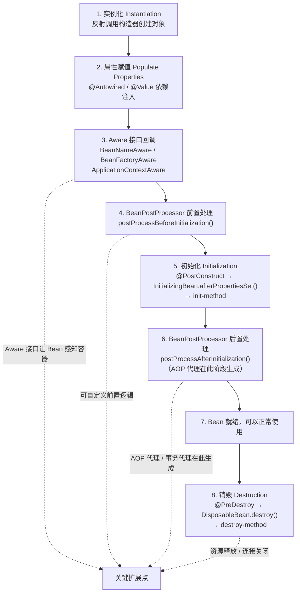
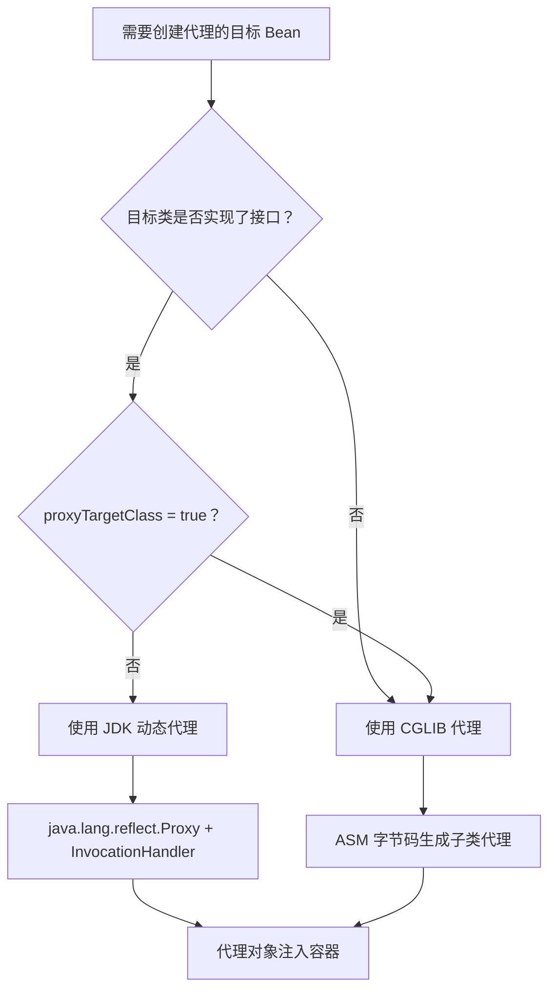

# Spring IoC 与 AOP 深度

> 学习路线对应：第2周 -- Spring Boot 框架
> 前置知识：Java 面向对象、反射、动态代理基础
> 预计学习时间：2-3 天

## 一、核心概念

### 1.1 IoC 控制反转 vs DI 依赖注入

| 概念 | 说明 | 类比 |
|------|------|------|
| **IoC（控制反转）** | 将对象创建和依赖管理的控制权从代码转移到容器 | 以前自己 new 对象，现在容器给你 |
| **DI（依赖注入）** | IoC 的具体实现方式，容器将依赖对象注入到目标对象中 | 容器自动把需要的对象"注入"进来 |

**三种注入方式：**

| 方式 | 注解 | 推荐程度 |
|------|------|---------|
| **构造器注入** | `@Autowired` 在构造器上 | 最推荐（不可变、强制依赖、便于测试） |
| **Setter 注入** | `@Autowired` 在 setter 上 | 可选依赖时使用 |
| **字段注入** | `@Autowired` 在字段上 | 不推荐（难以测试、隐藏依赖） |

```java
// 推荐：构造器注入（Spring 4.3+ 可省略 @Autowired）
@Component
public class OrderService {
    private final UserRepository userRepository;
    private final OrderRepository orderRepository;

    public OrderService(UserRepository userRepository, OrderRepository orderRepository) {
        this.userRepository = userRepository;
        this.orderRepository = orderRepository;
    }
}
```

> **生活化类比：IoC 容器就像餐厅点餐** —— 在传统开发中（自己做饭），你需要亲自去市场买菜（new 对象）、洗菜切菜（初始化）、烹饪调味（设置依赖关系），整个过程你全程参与、全程控制。而使用 IoC 容器就像去餐厅点餐：你只需要看菜单下单（声明需要什么 Bean），后厨（IoC 容器）负责采购食材、烹饪加工，最后服务员把做好的菜端到你桌上（依赖注入）。你不再关心菜是怎么做出来的，只管"点菜"和"用菜"，控制权从你（调用方）转移到了餐厅（容器），这就是"控制反转"——你不再主动创建对象，而是被动接收容器注入的对象。

> 📖 **参考链接**：
> - [Spring Framework Reference](https://docs.spring.io/spring-framework/reference/) -- Spring 框架参考文档（IoC 容器、Bean 生命周期、AOP 核心概念）

### 1.2 Bean 作用域

| 作用域 | 说明 | 使用场景 |
|--------|------|---------|
| **singleton**（默认） | 整个容器中只有一个实例 | 无状态 Service、DAO、Controller |
| **prototype** | 每次获取都创建新实例 | 有状态的 Bean，如 Struts2 Action |
| **request** | 每个 HTTP 请求一个实例 | Web 应用中请求级别的数据 |
| **session** | 每个 HTTP 会话一个实例 | 用户会话数据 |
| **application** | 每个 ServletContext 一个实例 | 全局共享数据 |

```java
@Component
@Scope("prototype") // 每次注入都创建新实例
public class PrototypeBean {
    // ...
}
```

---

## 二、底层原理

### 2.1 Bean 容器启动流程

```
1. Resource 定位
   找到配置文件（XML、注解、Java Config）

2. BeanDefinition 加载
   解析配置，生成 BeanDefinition 对象（包含 Bean 的类名、作用域、依赖等元数据）

3. BeanDefinition 注册
   将 BeanDefinition 注册到 BeanDefinitionRegistry（本质是一个 ConcurrentHashMap）

4. Bean 实例化与依赖注入
   通过反射创建 Bean 实例，完成属性填充和依赖注入
```

**核心类：**

| 类/接口 | 作用 |
|---------|------|
| `BeanDefinition` | Bean 的元数据描述 |
| `BeanFactory` | Bean 容器的根接口，提供 getBean 等基本方法 |
| `ApplicationContext` | 继承 BeanFactory，提供更多企业级功能（事件、国际化等） |
| `BeanPostProcessor` | Bean 后置处理器，在初始化前后执行 |
| `BeanFactoryPostProcessor` | BeanFactory 后置处理器，在 Bean 实例化前修改 BeanDefinition |

### 2.2 Bean 生命周期

```
1. 实例化（Instantiation）
   通过反射调用构造器创建 Bean 实例

2. 属性赋值（Populate Properties）
   @Autowired、@Value 等依赖注入

3. Aware 接口回调
   BeanNameAware、BeanFactoryAware、ApplicationContextAware 等

4. BeanPostProcessor 前置处理
   postProcessBeforeInitialization()

5. 初始化（Initialization）
   @PostConstruct -> InitializingBean.afterPropertiesSet() -> init-method

6. BeanPostProcessor 后置处理
   postProcessAfterInitialization()（AOP 代理在此阶段生成）

7. Bean 就绪，可以使用

8. 销毁（Destruction）
   @PreDestroy -> DisposableBean.destroy() -> destroy-method
```

**关键点：** AOP 代理在 `postProcessAfterInitialization()` 阶段通过 `AbstractAutoProxyCreator` 生成。

> **生活化类比：Bean 生命周期就像公务员入职到退休** —— Bean 的完整生命周期就像一名公务员的职业生涯：① **实例化**——通过公务员考试被录用（构造器创建对象）；② **属性赋值**——分配办公室、配发办公用品（依赖注入 @Autowired）；③ **Aware 回调**——告知所在部门名称、上级领导是谁（BeanNameAware 等注入容器信息）；④ **BeanPostProcessor 前置**——入职培训前的背景审查（postProcessBeforeInitialization）；⑤ **初始化**——正式入职宣誓（@PostConstruct → afterPropertiesSet → init-method）；⑥ **BeanPostProcessor 后置**——配发工牌和权限卡，从此对外代表部门办事（AOP 代理生成）；⑦ **使用**——在岗工作，处理日常事务（Bean 就绪供应用使用）；⑧ **销毁**——退休离职，交接工作、归还办公用品（@PreDestroy → destroy → destroy-method）。

**Bean 生命周期 Mermaid 流程图：**



> 上图展示了 Spring Bean 从实例化到销毁的完整生命周期，并标注了四个关键扩展点：Aware 接口回调让 Bean 感知容器信息、BeanPostProcessor 前置/后置处理提供统一拦截入口（AOP 代理在后置阶段生成）、销毁回调用于释放资源。掌握这些扩展点是理解 Spring 框架运作机制和进行功能增强的基础。

**Bean 生命周期扩展详解：**

| 阶段 | 核心接口/注解 | 作用说明 | 典型应用场景 |
|------|-------------|---------|------------|
| Aware 回调 | `BeanNameAware` | 注入 Bean 在容器中的名称 | Bean 需要知道自身名称时 |
| Aware 回调 | `BeanFactoryAware` | 注入 BeanFactory 引用 | Bean 需要主动获取其他 Bean |
| Aware 回调 | `ApplicationContextAware` | 注入 ApplicationContext | Bean 需要访问容器所有功能 |
| 前置处理 | `BeanPostProcessor` | 所有 Bean 初始化前的统一处理 | 自定义注解解析、属性修改 |
| 初始化 | `@PostConstruct` | Bean 完成注入后的初始化 | 加载配置、初始化资源池 |
| 初始化 | `InitializingBean` | `afterPropertiesSet()` | 兼容旧代码的初始化回调 |
| 后置处理 | `BeanPostProcessor` | 所有 Bean 初始化后的统一处理 | **AOP 代理生成的核心入口** |
| 销毁 | `@PreDestroy` | 容器关闭前的清理 | 关闭连接池、刷新缓存 |

**BeanPostProcessor 的重要性：** Spring 内部大量功能都基于 `BeanPostProcessor` 实现。例如 `AutowiredAnnotationBeanPostProcessor` 负责解析 `@Autowired` 注解完成依赖注入，`CommonAnnotationBeanPostProcessor` 负责 `@PostConstruct` 和 `@PreDestroy`，`AbstractAutoProxyCreator` 负责 AOP 代理生成。理解 BeanPostProcessor 是理解 Spring 扩展机制的钥匙。

> 📖 **参考链接**：
> - [Spring Framework Reference](https://docs.spring.io/spring-framework/reference/) -- Spring 框架参考文档（Bean 生命周期、BeanPostProcessor 扩展机制）

### 2.3 循环依赖问题

**Spring 三级缓存解决循环依赖：**

| 缓存 | 名称 | 存储内容 |
|------|------|---------|
| 一级缓存 | `singletonObjects` | 完全初始化好的 Bean 实例 |
| 二级缓存 | `earlySingletonObjects` | 早期暴露的 Bean 实例（未完成属性注入） |
| 三级缓存 | `singletonFactories` | Bean 工厂（ObjectFactory），可生成早期 Bean 引用 |

```
A 依赖 B，B 依赖 A 的解决流程：
1. 创建 A，将 A 的 ObjectFactory 放入三级缓存
2. 填充 A 的属性，发现依赖 B
3. 创建 B，将 B 的 ObjectFactory 放入三级缓存
4. 填充 B 的属性，发现依赖 A
5. 从三级缓存获取 A 的 ObjectFactory，生成 A 的早期引用，放入二级缓存
6. B 完成属性填充和初始化，放入一级缓存
7. A 获取到 B，完成属性填充和初始化，放入一级缓存
```

**注意：** 构造器注入的循环依赖无法解决，会抛出 `BeanCurrentlyInCreationException`。只有 Setter/字段注入且 Bean 都是 singleton 时才能解决。

> **生活化类比：循环依赖就像三角债** —— A 欠 B 钱（A 依赖 B），B 欠 C 钱（B 依赖 C），C 又欠 A 钱（C 依赖 A）。如果三方都坚持"你不还我钱我就不还他钱"，债务链就永远解不开，这就是构造器注入循环依赖的死局（编译期就卡住）。Spring 的三级缓存解决方案就像引入一个"信用中介"（ObjectFactory）：A 先给中介一张"欠条"（三级缓存的 ObjectFactory）说"我以后会还钱，你先帮我担保"，然后 B 可以凭这张欠条从中介那里拿到 A 的"信用承诺"（早期引用），B 就能顺利完成自己的事务。等 A 和 B 都把账算清了，欠条也就兑现了。

**三级缓存深入解析：**

| 缓存层级 | 字段名 | 数据类型 | 存储内容 | 何时放入 | 何时移除 |
|---------|--------|---------|---------|---------|---------|
| 一级缓存 | `singletonObjects` | `Map<String, Object>` | 完全初始化好的 Bean | Bean 完成全部生命周期后 | 应用关闭销毁时 |
| 二级缓存 | `earlySingletonObjects` | `Map<String, Object>` | 早期暴露的 Bean（半成品） | 三级缓存中的 ObjectFactory 被调用后 | 升级到一级缓存后 |
| 三级缓存 | `singletonFactories` | `Map<String, ObjectFactory>` | Bean 的工厂对象 | Bean 实例化后、属性注入前 | 被 ObjectFactory.getObject() 调用后 |

**为什么需要三级而非两级缓存？**

三级缓存的 `singletonFactories` 存储的是 `ObjectFactory`（lambda 表达式），而非直接的 Bean 实例。这样设计的关键目的是**支持 AOP 代理的延迟决策**：只有当另一个 Bean 真正需要引用当前半成品 Bean 时，ObjectFactory 才会被调用，此时 `SmartInstantiationAwareBeanPostProcessor.getEarlyBeanReference()` 有机会返回代理对象。如果使用二级缓存，则在实例化后就必须立即决定是否创建代理，而此时还无法判断是否会有循环依赖，可能导致代理重复创建。

**Spring Boot 2.6+ 默认禁止循环依赖：** 从 Spring Boot 2.6 开始，`spring.main.allow-circular-references` 默认为 `false`，启动时检测到循环依赖会直接报错。这是官方鼓励开发者通过重构代码消除循环依赖的信号——最佳实践是提取公共逻辑到第三个 Bean，或使用 `@Lazy` 延迟加载。

> 📖 **参考链接**：
> - [Spring Framework Reference](https://docs.spring.io/spring-framework/reference/) -- Spring 框架参考文档（循环依赖与三级缓存机制）

### 2.4 AOP 代理原理

#### JDK 动态代理 vs CGLIB 代理

| 维度 | JDK 动态代理 | CGLIB 代理 |
|------|-------------|-----------|
| **代理方式** | 基于接口 | 基于继承（生成子类） |
| **要求** | 目标类必须实现接口 | 不能代理 final 类/方法 |
| **实现** | `java.lang.reflect.Proxy` + `InvocationHandler` | ASM 字节码框架生成子类 |
| **性能** | 反射调用，略慢 | 字节码直接调用，较快 |
| **Spring 默认** | Spring Boot 1.x 默认 | Spring Boot 2.x 默认 |

**Spring AOP 代理选择规则：**

```java
// DefaultAopProxyFactory 的选择逻辑
if (目标类实现了接口) {
    // 默认使用 JDK 动态代理
} else {
    // 使用 CGLIB
}
// 如果配置了 proxyTargetClass = true，强制使用 CGLIB
// Spring Boot 2.x 中 spring.aop.proxy-target-class 默认为 true
```

**AOP 核心概念：**

| 概念 | 说明 |
|------|------|
| **Aspect（切面）** | 横切关注点的模块化，如日志、事务 |
| **JoinPoint（连接点）** | 程序执行过程中的某个点，如方法调用 |
| **Advice（通知）** | 切面在连接点执行的动作 |
| **Pointcut（切入点）** | 匹配连接点的表达式 |
| **Weaving（织入）** | 将切面应用到目标对象创建代理的过程 |

> **生活化类比：AOP 就像地铁安检入口** —— 想象地铁站的所有乘客（业务方法）都要经过同一个安检口（切面/Aspect），安检员会做三件事：进站前检查包（前置通知 @Before）、出站后确认物品无遗漏（返回通知 @AfterReturning）、发现违禁品时报警处理（异常通知 @AfterThrowing）。不管你是去上班、去购物还是去访友（不同的业务逻辑），都必须经过安检（横切关注点），安检逻辑与乘客目的完全分离。这就是 AOP 的核心思想——将日志、事务、权限等横切关注点从业务代码中抽离出来，统一在"安检口"处理，业务方法只关注自己的核心逻辑。环绕通知 @Around 则像是安检员全程陪同——从进站到出站全程跟随，可以在任意环节介入。

> 📖 **参考链接**：
> - [Spring Framework Reference](https://docs.spring.io/spring-framework/reference/) -- Spring 框架参考文档（AOP 面向切面编程、通知类型与切入点表达式）

**5 种通知类型：**

| 通知 | 注解 | 执行时机 |
|------|------|---------|
| 前置通知 | `@Before` | 目标方法执行前 |
| 后置通知 | `@After` | 目标方法执行后（无论是否异常） |
| 返回通知 | `@AfterReturning` | 目标方法正常返回后 |
| 异常通知 | `@AfterThrowing` | 目标方法抛出异常后 |
| 环绕通知 | `@Around` | 包裹目标方法，可控制执行 |

**Spring AOP 代理选择流程：**



以上流程图展示了 Spring AOP 在创建代理对象时的决策逻辑。首先判断目标类是否实现了接口，如果没有实现接口则直接使用 CGLIB 基于继承生成子类代理。如果实现了接口，则进一步检查 proxyTargetClass 配置项：Spring Boot 2.x 默认该值为 true，强制使用 CGLIB 代理；传统 Spring 项目中该值默认为 false，会优先使用 JDK 动态代理。JDK 动态代理基于反射调用，性能略低但无需第三方依赖，CGLIB 通过字节码直接调用，性能更优。

---

## 三、实战应用

### 3.1 自定义 AOP 切面

```java
@Aspect
@Component
@Slf4j
public class LogAspect {

    @Pointcut("execution(* com.example.service.*.*(..))")
    public void serviceLayer() {}

    @Around("serviceLayer()")
    public Object logAround(ProceedingJoinPoint joinPoint) throws Throwable {
        String methodName = joinPoint.getSignature().getName();
        Object[] args = joinPoint.getArgs();
        log.info("调用方法: {}，参数: {}", methodName, args);

        long start = System.currentTimeMillis();
        try {
            Object result = joinPoint.proceed();
            log.info("方法 {} 执行成功，耗时: {}ms", methodName,
                     System.currentTimeMillis() - start);
            return result;
        } catch (Exception e) {
            log.error("方法 {} 执行失败，耗时: {}ms", methodName,
                      System.currentTimeMillis() - start, e);
            throw e;
        }
    }
}
```

### 3.2 事务管理 AOP 原理

Spring 事务管理本质上就是 AOP 的典型应用。`@Transactional` 注解通过 AOP 织入以下逻辑：

```
@Around("@annotation(org.springframework.transaction.annotation.Transactional)")
public Object transactionalAround(ProceedingJoinPoint joinPoint) {
    1. 开启事务
    2. try {
        3. 执行目标方法
        4. 提交事务
       } catch (Exception e) {
        5. 回滚事务
       }
}
```

**事务失效场景：**
- 方法非 public（AOP 只能代理 public 方法）
- 同一个类中方法内部调用（this 调用不走代理）
- 异常被 catch 未抛出（`@Transactional` 默认回滚 RuntimeException）
- 数据库引擎不支持事务（如 MyISAM）

---

## 四、常见面试题（附答案）

### 1. IoC 和 DI 的区别？

IoC（控制反转）是一种设计思想，DI（依赖注入）是 IoC 的具体实现方式。IoC 将对象创建和管理的控制权从代码转移到容器，DI 通过构造器或 Setter 等方式将依赖注入到对象中。

### 2. Spring Bean 的生命周期？

实例化 -> 属性赋值 -> Aware 接口 -> BeanPostProcessor 前置 -> 初始化（@PostConstruct） -> BeanPostProcessor 后置（AOP 代理） -> 使用 -> 销毁（@PreDestroy）

### 3. Spring AOP 和 AspectJ 的区别？

| 维度 | Spring AOP | AspectJ |
|------|-----------|---------|
| 织入时机 | 运行时（动态代理） | 编译时、类加载时、运行时 |
| 代理方式 | JDK 动态代理 / CGLIB | 字节码修改（编译时织入） |
| 性能 | 略低（反射/代理调用） | 高（直接字节码修改） |
| 切入点 | 仅方法执行 | 方法执行、构造器、字段访问等 |
| 使用复杂度 | 简单（注解配置） | 复杂（需学习 AspectJ 语法） |

### 4. 如何解决 Spring Bean 的循环依赖？

Spring 通过三级缓存解决 setter/字段注入的 singleton Bean 循环依赖。构造器注入的循环依赖无法解决，会抛出 `BeanCurrentlyInCreationException`。建议使用构造器注入 + 重构代码消除循环依赖。

### 5. Spring 中使用了哪些设计模式？

| 设计模式 | 应用 |
|---------|------|
| 单例模式 | Bean 默认 scope 为 singleton |
| 工厂模式 | `BeanFactory`、`ApplicationContext` |
| 代理模式 | AOP（JDK 动态代理 / CGLIB） |
| 模板方法模式 | `JdbcTemplate`、`RestTemplate` |
| 观察者模式 | Spring 事件机制（`ApplicationEvent`） |
| 策略模式 | `Resource` 接口的不同实现 |
| 适配器模式 | `HandlerAdapter`（Spring MVC） |

---

## 五、避坑指南

| 常见错误 | 现象 | 原因 | 解决方案 |
|---------|------|------|---------|
| AOP 同类方法调用 | @Transactional 等 AOP 注解不生效 | this.method() 直接调用不走代理对象，AOP 拦截不到 | 拆分为两个 Service；通过 AopContext.currentProxy() 获取代理；自己注入自己（@Autowired + @Lazy） |
| @Transactional 失效 | 事务不回滚 | 方法非 public（AOP 只代理 public 方法）；同类方法调用；异常被 catch 未抛出；数据库引擎不支持事务；注解在接口上（CGLIB 代理）；多线程不共享事务 | 确保方法为 public；异常必须抛出到代理层；使用支持事务的引擎；注解放在实现类上 |
| Prototype Bean 注入到 Singleton Bean | Prototype Bean 始终是同一个实例 | Singleton Bean 只创建一次，注入的 Prototype Bean 也只会创建一次 | 使用 ObjectFactory 延迟获取；使用 @Lookup 注解方法注入 |

## 本章学习自检

完成本章学习后，应该能够：
- [ ] 用自己的话解释 IoC/DI 概念、Bean 生命周期、三级缓存解决循环依赖、AOP 代理原理（JDK 动态代理 vs CGLIB）
- [ ] 手写自定义 AOP 切面（日志、事务）、构造器注入的 Service 代码
- [ ] 回答常见面试题（Spring 设计模式、Bean 生命周期、JDK 动态代理 vs CGLIB 区别等）
- [ ] 在实战项目中应用 Spring AOP 实现日志、事务、权限等横切关注点
- [ ] 识别并避免常见错误（AOP 同类方法调用失效、@Transactional 失效场景、Prototype Bean 注入陷阱等）

---

> **学习导航**：
> - 返回 [学习路线总览](../../README.md)
> - 本模块其他文件：[05-Spring-Boot笔面试题集](./05-Spring-Boot笔面试题集.md)
> - 实战应用：[电商订单实时统计分析平台](../../extensions/project/01-电商订单实时统计分析平台.md)

