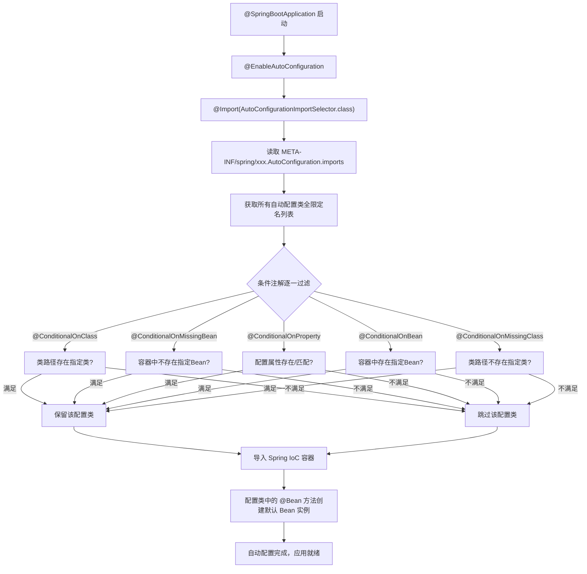
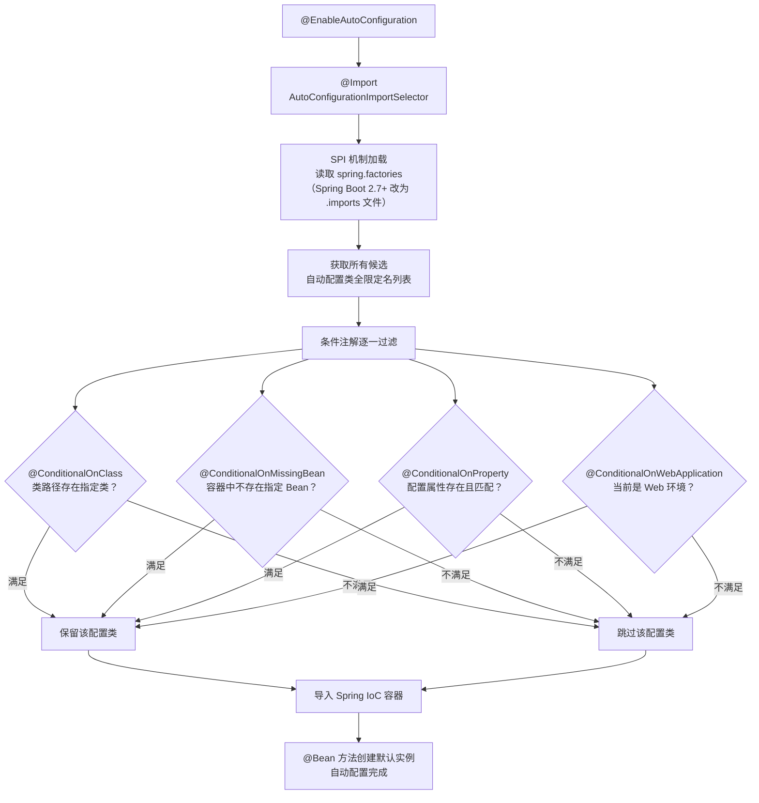

# Spring Boot 自动配置原理

> 学习路线对应：第2周 -- Spring Boot 框架
> 前置知识：Spring IoC、Java Config、条件注解
> 预计学习时间：1-2 天

## 一、核心概念

### 1.1 @SpringBootApplication 注解拆解

```java
@SpringBootApplication
// 等价于以下三个注解的组合：
@SpringBootConfiguration  // 等价于 @Configuration
@EnableAutoConfiguration  // 开启自动配置（核心）
@ComponentScan            // 组件扫描
public @interface SpringBootApplication {
    // ...
}
```

| 注解 | 作用 |
|------|------|
| `@SpringBootConfiguration` | 标识这是一个配置类，等价于 `@Configuration` |
| `@EnableAutoConfiguration` | 开启 Spring Boot 自动配置机制（核心） |
| `@ComponentScan` | 扫描当前包及其子包下的组件（`@Component`、`@Service` 等） |

### 1.2 自动配置 vs 手动配置

| 方式 | Spring Boot 自动配置 | 传统 Spring 手动配置 |
|------|---------------------|---------------------|
| 数据源 | 引入 `spring-boot-starter-jdbc`，配置 `spring.datasource.url` | 手动配置 `DataSource` Bean、`JdbcTemplate` Bean |
| 事务 | 自动启用 `@EnableTransactionManagement` | 手动添加 XML 或注解配置 |
| MVC | 自动配置 `DispatcherServlet`、视图解析器 | 手动配置 `web.xml` 和 Spring MVC 配置文件 |
| 日志 | 自动配置 Logback（默认） | 手动引入依赖和配置 |

> **生活化类比：** Spring Boot 自动配置就像买精装房 vs 传统 Spring 手动配置就像买毛坯房。毛坯房（传统 Spring）需要你自己设计水电线路、买瓷砖、刷墙、装马桶，每一样都得亲力亲为。而精装房（Spring Boot）交房时已经帮你装好了水电、铺好了地板、配好了厨卫，你只需要拎包入住，最多按自己喜好微调一下（在 application.yml 里覆盖默认配置）。Spring Boot 的 Starter 就像精装房的"套餐包"，引入一个 starter-web 等于选择了"全屋精装套餐"。

> 📖 **参考链接**：
> - [Spring Boot Reference Documentation](https://docs.spring.io/spring-boot/docs/) -- Spring Boot 官方参考文档（自动配置、Starter 机制、条件注解）
> - [Spring Framework Reference](https://docs.spring.io/spring-framework/reference/) -- Spring 框架参考文档（@Conditional、@Import、SPI 扩展机制）

---

## 二、底层原理

### 2.1 @EnableAutoConfiguration 工作流程

```java
@Target(ElementType.TYPE)
@Retention(RetentionPolicy.RUNTIME)
@Documented
@Inherited
@AutoConfigurationPackage         // 将主配置类所在包注册为自动配置包
@Import(AutoConfigurationImportSelector.class) // 核心：导入自动配置选择器
public @interface EnableAutoConfiguration {
    // ...
}
```

**AutoConfigurationImportSelector 工作流程：**

```
1. 从 META-INF/spring/org.springframework.boot.autoconfigure.AutoConfiguration.imports
   （Spring Boot 2.7 之前是 spring.factories）读取所有自动配置类全限定名

2. 根据条件注解（@ConditionalOnXxx）过滤：
   - @ConditionalOnClass：类路径中存在指定类时生效
   - @ConditionalOnMissingBean：容器中没有指定 Bean 时生效
   - @ConditionalOnProperty：配置文件中特定属性存在/匹配时生效
   - @ConditionalOnBean：容器中存在指定 Bean 时生效
   - @ConditionalOnMissingClass：类路径中不存在指定类时生效

3. 将符合条件的配置类导入 Spring 容器

4. 自动配置类通过 @Bean 方法创建默认的 Bean 实例
```

**AutoConfiguration 加载流程：**





> 上图展示了 Spring Boot 自动配置的简化流程：从 @EnableAutoConfiguration 出发，通过 SPI 机制从 spring.factories（或 .imports 文件）加载所有候选自动配置类，再经过条件注解的层层过滤，只保留满足当前运行环境的配置类，最终将其注册到 IoC 容器中并创建默认 Bean 实例。条件注解是自动配置的核心——它确保自动配置"按需生效"而非"全量加载"。

### 2.2 spring.factories 到 .imports 的演进

**Spring Boot 2.7 之前（spring.factories）：**

```
# META-INF/spring.factories
org.springframework.boot.autoconfigure.EnableAutoConfiguration=\
com.example.MyAutoConfiguration
```

**Spring Boot 2.7+（.imports 文件）：**

```
# META-INF/spring/org.springframework.boot.autoconfigure.AutoConfiguration.imports
com.example.MyAutoConfiguration
```

**变化原因：** `.imports` 文件格式更简洁，一行一个类名，无需 key-value 格式，加载效率更高。

> **生活化类比：SPI 机制就像 USB 插件体系** —— SPI（Service Provider Interface）就像电脑的 USB 接口标准：主板厂商（框架方）只定义了 USB 接口规范（接口/抽象类），但不关心你插的是鼠标、键盘还是 U 盘（具体实现）。任何符合 USB 标准的设备（第三方 Starter）都可以即插即用。Spring Boot 的自动配置正是基于这一思想：Spring Boot 定义了 `AutoConfiguration` 接口规范和 `.imports` 文件加载机制（USB 接口标准），各大组件开发者（鼠标/键盘厂商）只需按照规范编写自动配置类并注册到 `.imports` 文件中（制造 USB 设备），引入依赖后（插入 USB）Spring Boot 就能自动发现并加载（即插即用）。这种设计实现了框架与组件的彻底解耦。

**SPI 机制在 Spring Boot 中的完整工作链路：**

| 环节 | 参与者 | 作用 |
|------|--------|------|
| 定义规范 | Spring Boot 框架 | 提供 `AutoConfiguration` 类规范和 `.imports` 文件约定 |
| 编写实现 | 组件开发者（如 MyBatis、Redis） | 编写自动配置类，注册到 `.imports` 文件 |
| 加载发现 | `AutoConfigurationImportSelector` | 通过类加载器读取所有 jar 包中的 `.imports` 文件 |
| 条件过滤 | `@Conditional` 系列注解 | 根据运行环境决定哪些配置类真正生效 |
| 注册生效 | Spring IoC 容器 | 将通过过滤的配置类导入容器，执行 `@Bean` 方法 |

**Java SPI vs Spring Boot SPI 的区别：**

| 维度 | Java SPI（`ServiceLoader`） | Spring Boot SPI（`.imports`） |
|------|---------------------------|-------------------------------|
| 配置文件 | `META-INF/services/接口全限定名` | `META-INF/spring/xxx.AutoConfiguration.imports` |
| 加载方式 | `ServiceLoader.load()` 逐一实例化 | `AutoConfigurationImportSelector` 批量导入 |
| 条件过滤 | 无，全部加载 | 有，`@Conditional` 系列注解按需过滤 |
| 延迟加载 | 不支持 | 支持，通过条件注解延迟决策 |
| 典型应用 | JDBC Driver、SLF4J 日志门面 | Spring Boot 自动配置 |

> 📖 **参考链接**：
> - [Spring Boot Reference Documentation](https://docs.spring.io/spring-boot/docs/) -- Spring Boot 官方文档（AutoConfiguration.imports 机制与 SPI 加载流程）

### 2.3 条件注解详解

| 条件注解 | 生效条件 | 示例 |
|---------|---------|------|
| `@ConditionalOnClass` | 类路径中存在指定类 | `@ConditionalOnClass({DataSource.class})` |
| `@ConditionalOnMissingClass` | 类路径中不存在指定类 | `@ConditionalOnMissingClass({"com.example.LegacyLib"})` |
| `@ConditionalOnBean` | 容器中存在指定 Bean | `@ConditionalOnBean(DataSource.class)` |
| `@ConditionalOnMissingBean` | 容器中不存在指定 Bean | `@ConditionalOnMissingBean(MyService.class)` |
| `@ConditionalOnProperty` | 配置属性存在/匹配 | `@ConditionalOnProperty(name = "my.feature.enabled", havingValue = "true")` |
| `@ConditionalOnResource` | 类路径中存在指定资源 | `@ConditionalOnResource(resources = "classpath:my-config.xml")` |
| `@ConditionalOnWebApplication` | 当前是 Web 应用 | `@ConditionalOnWebApplication` |
| `@ConditionalOnExpression` | SpEL 表达式为 true | `@ConditionalOnExpression("${my.feature.enabled:true}")` |

**条件注解的评估阶段：**

条件注解在不同阶段被评估，而非简单的优先级顺序：

- **配置类过滤阶段（ConfigurationClassFilter）**：`@ConditionalOnClass`、`@ConditionalOnWebApplication` 等在配置类导入时评估，不满足条件则整个配置类被跳过
- **Bean注册阶段**：`@ConditionalOnMissingBean`、`@ConditionalOnProperty` 在 `@Bean` 方法注册时评估，此时配置类已导入

> **生活化类比：@Conditional 系列注解就像智能家居的智能开关** —— 想象一个智能家居系统，每盏灯（自动配置类）都配了一个智能开关（条件注解）。`@ConditionalOnClass` 就像"只有检测到有人在家才开灯"（类路径存在指定类）；`@ConditionalOnMissingBean` 就像"如果用户手动关了灯，自动控制就不再干预"（用户自定义了 Bean 则跳过默认配置）；`@ConditionalOnProperty` 就像"只有设置了定时模式才按计划开关"（配置属性匹配才生效）；`@ConditionalOnWebApplication` 就像"只有在家模式下才启动安防系统"（Web 环境才生效）。这些智能开关让每盏灯"按需亮起"而非"全亮"，避免不必要的能源消耗——正如条件注解让自动配置类"按需生效"而非"全量加载"。

**@Conditional 系列注解完整分类与使用场景：**

| 分类 | 注解 | 典型使用场景 |
|------|------|------------|
| 类条件 | `@ConditionalOnClass` | 当引入了某依赖（类路径存在）时才启用相关配置 |
| 类条件 | `@ConditionalOnMissingClass` | 当未引入某依赖时启用替代方案 |
| Bean 条件 | `@ConditionalOnBean` | 当容器中已存在某 Bean 时，才创建当前 Bean |
| Bean 条件 | `@ConditionalOnMissingBean` | 当用户未自定义某 Bean 时，提供默认实现（**最常用**） |
| 属性条件 | `@ConditionalOnProperty` | 根据配置文件的属性值决定是否启用功能开关 |
| 资源条件 | `@ConditionalOnResource` | 类路径存在指定资源文件时生效 |
| Web 条件 | `@ConditionalOnWebApplication` | 仅在 Web 环境（Servlet/Reactive）中生效 |
| 表达式条件 | `@ConditionalOnExpression` | 通过 SpEL 表达式实现复杂条件组合 |

**自定义条件注解示例：**

```java
// 1. 自定义条件类（实现 Condition 接口）
public class LinuxCondition implements Condition {
    @Override
    public boolean matches(ConditionContext context, AnnotatedTypeMetadata metadata) {
        String osName = context.getEnvironment().getProperty("os.name");
        return osName != null && osName.contains("Linux");
    }
}

// 2. 使用自定义条件注解
@Configuration
@Conditional(LinuxCondition.class)
public class LinuxSpecificConfig {
    @Bean
    public FilePathResolver filePathResolver() {
        return new LinuxFilePathResolver(); // 仅在 Linux 环境下生效
    }
}
```

**条件注解组合使用：** 多个条件注解可以同时标注在一个配置类或 `@Bean` 方法上，它们之间是 **AND（与）** 关系——所有条件都满足时才生效。如果需要 OR（或）关系，需通过自定义 `Condition` 实现逻辑组合。

> 📖 **参考链接**：
> - [Spring Boot Reference Documentation](https://docs.spring.io/spring-boot/docs/) -- Spring Boot 官方文档（@Conditional 系列注解全集与条件评估机制）
> - [Spring Framework Reference](https://docs.spring.io/spring-framework/reference/) -- Spring 框架参考文档（@Conditional 接口与 ConditionContext）

### 2.4 Starter 机制

**spring-boot-starter-web 引入了哪些依赖？**

```
spring-boot-starter-web
├── spring-boot-starter（核心 Starter）
│   ├── spring-boot（自动配置核心）
│   ├── spring-boot-autoconfigure（自动配置类）
│   └── spring-boot-starter-logging（日志）
├── spring-boot-starter-json（Jackson）
├── spring-boot-starter-tomcat（内嵌 Tomcat）
├── spring-webmvc（Spring MVC）
└── spring-web（Spring Web）
```

**Starter 命名规范：**
- 官方 Starter：`spring-boot-starter-{模块名}`（如 `spring-boot-starter-web`）
- 第三方 Starter：`{模块名}-spring-boot-starter`（如 `mybatis-spring-boot-starter`）

---

## 三、实战应用

### 3.1 自定义 Starter 步骤

**步骤一：创建自动配置类**

```java
@Configuration
@ConditionalOnClass(MyService.class)
@EnableConfigurationProperties(MyProperties.class)
public class MyAutoConfiguration {

    @Bean
    @ConditionalOnMissingBean
    public MyService myService(MyProperties properties) {
        return new MyService(properties.getPrefix());
    }
}
```

**步骤二：创建属性配置类**

```java
@ConfigurationProperties(prefix = "my.starter")
public class MyProperties {
    private String prefix = "default-";
    private boolean enabled = true;
    // getter/setter...
}
```

**步骤三：注册自动配置**

在 `META-INF/spring/org.springframework.boot.autoconfigure.AutoConfiguration.imports` 中添加：

```
com.example.autoconfigure.MyAutoConfiguration
```

**步骤四：提供 spring-configuration-metadata.json（可选）**

用于 IDE 提示配置属性。

### 3.2 查看当前启用的自动配置

```java
// 启动时开启 debug 模式
// application.properties
debug=true

// 启动日志中会输出：
// ============================
// CONDITIONS EVALUATION REPORT
// ============================
// Positive matches:（已生效的自动配置）
// Negative matches:（未生效的自动配置）
```

或者通过 Actuator 端点查看：

```yaml
# application.yml
management:
  endpoints:
    web:
      exposure:
        include: conditions
```

访问 `/actuator/conditions` 查看自动配置匹配情况。

### 3.3 排除不需要的自动配置

```java
// 方式1：通过注解排除
@SpringBootApplication(exclude = {DataSourceAutoConfiguration.class})

// 方式2：通过配置文件排除
// spring.autoconfigure.exclude=org.springframework.boot.autoconfigure.jdbc.DataSourceAutoConfiguration
```

---

## 四、常见面试题（附答案）

### 1. Spring Boot 的自动配置原理？

1. `@SpringBootApplication` 注解包含 `@EnableAutoConfiguration`
2. `@EnableAutoConfiguration` 通过 `@Import(AutoConfigurationImportSelector.class)` 导入自动配置选择器
3. `AutoConfigurationImportSelector` 从 `META-INF/spring/xxx.AutoConfiguration.imports` 文件读取所有自动配置类
4. 根据条件注解（`@ConditionalOnClass`、`@ConditionalOnMissingBean` 等）过滤，将符合条件的配置类导入容器
5. 自动配置类中的 `@Bean` 方法创建默认 Bean 实例

### 2. Spring Boot 的 Starter 是什么？

Starter 是一组依赖描述符的集合。它将某个功能模块所需的依赖打包在一起，开发者只需引入一个 Starter 即可获得该模块的全部依赖和自动配置。例如 `spring-boot-starter-web` 包含了 Spring MVC、内嵌 Tomcat、Jackson 等所有 Web 开发需要的依赖。

### 3. Spring Boot 如何实现热部署？

**方式1：spring-boot-devtools**
- 引入 `spring-boot-devtools` 依赖
- 修改代码后自动重启（通过双类加载器实现快速重启）
- 不保留会话状态，是重启而非热替换

**方式2：JRebel（商业）**
- 真正的热替换，修改代码不需要重启
- 支持方法体、类结构的修改

**方式3：IDEA 自动编译**
- `Settings -> Build -> Compiler -> Build project automatically`
- `Settings -> Advanced Settings -> Compiler -> Allow auto-make to start even if developed application is currently running`（IDEA 2021.2+，旧版通过 `Ctrl+Shift+Alt+/ -> Registry` 设置）

### 4. @ConditionalOnMissingBean 的作用？

当容器中不存在指定类型的 Bean 时，才创建默认的 Bean。这是自动配置的核心机制之一：如果用户自定义了 Bean，则使用用户的自定义 Bean；否则使用自动配置提供的默认 Bean。

例如，如果用户自己定义了 `DataSource` Bean，Spring Boot 就不会再创建默认的 `DataSource`。

### 5. Spring Boot 配置文件加载优先级？

```
1. 命令行参数（--server.port=8080）
2. SPRING_APPLICATION_JSON 环境变量
3. java:comp/env 中的 JNDI 属性
4. Java 系统属性（System.getProperties()）
5. 操作系统环境变量
6. RandomValuePropertySource（random.*）
7. jar 包外部的 application-{profile}.properties/yml
8. jar 包内部的 application-{profile}.properties/yml
9. jar 包外部的 application.properties/yml
10. jar 包内部的 application.properties/yml
11. @PropertySource 注解
12. SpringApplication.setDefaultProperties
```

---

## 五、避坑指南

| 常见错误 | 现象 | 原因 | 解决方案 |
|---------|------|------|---------|
| 自动配置类不被扫描 | 自定义自动配置不生效 | Spring Boot 只扫描主启动类所在包及其子包 | 使用 @Import 手动导入；在 META-INF/spring/*.imports 中注册；将主启动类放在根包下 |
| @ConditionalOnBean 条件注解顺序问题 | 依赖的 Bean 可能还未创建，导致目标 Bean 不被创建 | 未控制配置类的加载顺序 | 使用 @AutoConfigureAfter 注解指定配置类加载顺序 |
| 多环境配置切换混乱 | 环境配置不生效或互相覆盖 | 未正确使用 spring.profiles.active 或配置优先级不清晰 | 使用 application-{profile}.yml 分离环境配置，通过 spring.profiles.active 激活 |

---

> **学习导航**：
> - 返回 [学习路线总览](../../README.md)
> - 本模块其他文件：[05-Spring-Boot笔面试题集](./05-Spring-Boot笔面试题集.md)
> - 实战应用：[电商订单实时统计分析平台](../../extensions/project/01-电商订单实时统计分析平台.md)

