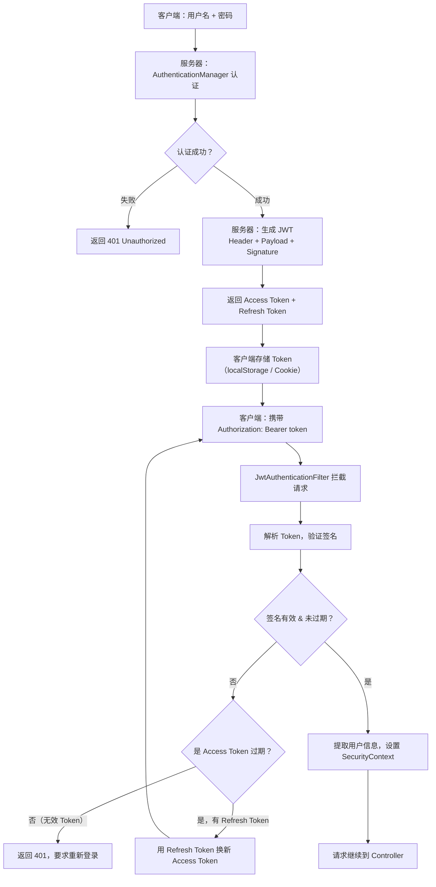

# 登录认证与安全

> 模块：02-spring-boot（第2周 Spring Boot）
> 定位：Java 后端面试高频考点，覆盖 Session/JWT 认证、Spring Security、OAuth2 及常见 Web 安全防护

---

## 一、核心概念

### 1.1 认证与授权的区别

| 概念 | 英文 | 含义 | 类比 |
|------|------|------|------|
| 认证 | Authentication | 验证"你是谁" | 出示身份证 |
| 授权 | Authorization | 验证"你能做什么" | 门禁卡权限 |

### 1.2 为什么需要认证

HTTP 是无状态协议，每次请求都是独立的，服务器不知道两次请求是否来自同一用户。认证机制通过在请求中携带身份凭证，让服务器识别用户身份。

---

## 二、基于 Session 的认证

### 2.1 工作原理

```
[浏览器] --登录请求--> [服务器]
                        |-- 创建 Session，存储用户信息
                        |-- 返回 Set-Cookie: JSESSIONID=xxx
[浏览器] --后续请求--> [服务器]
  Cookie: JSESSIONID     |-- 根据 SessionId 查找 Session
                         |-- 获取用户信息，处理请求
```

### 2.2 Session 的优势与劣势

| 优势 | 劣势 |
|------|------|
| 服务端控制，安全性高 | 服务端存储，占用内存 |
| SessionId 随机性强，难以伪造 | 分布式环境下需要 Session 共享 |
| 可主动踢人（删除 Session） | 不适用于移动端/前后端分离 |

### 2.3 分布式 Session 解决方案

**方案一：Session 粘滞（Sticky Session）**
- Nginx 配置 ip_hash，同一用户请求始终路由到同一台服务器
- 优点：简单，缺点：服务器宕机 Session 丢失，负载不均

**方案二：Session 复制**
- Tomcat 集群间 Session 广播复制
- 优点：服务器间共享，缺点：网络开销大，只适合小集群

**方案三：集中式 Session 存储（推荐）**
- 将 Session 存入 Redis，所有服务器共享
- 优点：无状态服务器，易扩展，缺点：依赖 Redis 可用性

```java
// Spring Session + Redis 配置（一行配置即可）
spring.session.store-type=redis
```

> **生活化类比：Session 就像酒店房卡系统** —— 入住酒店时（登录），前台核验你的身份证（用户名密码验证），确认无误后发给你一张房卡（JSESSIONID），这张卡里没有你的个人信息，只有一个房间编号（SessionId）。你每次进房间、使用健身房都需要刷卡（后续请求携带 Cookie），酒店系统根据卡号查到对应的房间和住客信息（服务端根据 SessionId 查找 Session）。房卡丢了可以补办（Session 重建），退房时房卡作废（Session 销毁）。如果酒店是连锁的（分布式环境），所有分店共享同一套房卡系统（Redis 集中存储 Session），你在任何分店刷卡都能识别身份——这就是 Spring Session + Redis 的集中式 Session 方案。

> 📖 **参考链接**：
> - [Spring Framework Reference](https://docs.spring.io/spring-framework/reference/) -- Spring 框架参考文档（Spring Session、分布式会话管理）

---

## 三、基于 JWT 的认证

### 3.1 JWT 结构

JWT 由三部分组成，以 `.` 分隔：

```
Header.Payload.Signature
eyJhbGciOiJIUzI1NiJ9.eyJ1c2VySWQiOjF9.xxx签名xxx
```

| 部分 | 内容 | 说明 |
|------|------|------|
| Header | `{"alg": "HS256", "typ": "JWT"}` | 签名算法和类型 |
| Payload | `{"userId": 1, "exp": 1234567890}` | 用户数据（不加密，仅 Base64 编码） |
| Signature | HMAC-SHA256(Header+Payload, secret) | 防篡改签名 |

### 3.2 JWT 认证流程

> **生活化类比：JWT 就像护照** —— 出国旅行时，你先去大使馆办护照（登录认证）：大使馆核验你的身份材料（用户名密码），确认无误后在护照上盖章签发（生成 JWT 签名）。护照内页记录了你的姓名、国籍、有效期等信息（Payload），封面注明了防伪技术类型（Header），盖的章是大使馆的专属钢印无法伪造（Signature 签名）。之后你每到一国（访问 API），只需出示护照（携带 Authorization: Bearer token），边检官员验证钢印真伪（验证签名）和有效期（检查 exp），无需再打电话给大使馆确认（无状态，不需要查服务端 Session）。护照到期后需要重新办理或凭签证延期（Refresh Token 刷新）。注意：护照内页信息是明文可见的（Payload 仅 Base64 编码，非加密），所以不能把密码写在护照上（JWT 不存敏感信息）。

```
[客户端] --登录--> [服务器]
                     |-- 验证用户名密码
                     |-- 生成 JWT（含用户ID、过期时间）
                     |-- 返回 JWT
[客户端] --请求--> [服务器]
  Authorization:      |-- 解析 JWT
  Bearer <token>      |-- 验证签名和过期时间
                      |-- 提取用户信息
```

**JWT 认证完整流程 Mermaid 图：**



**JWT 完整实现代码示例：**

```java
// 1. JWT 工具类
@Component
public class JwtUtils {
    @Value("${jwt.secret}")
    private String secret;
    @Value("${jwt.expiration:900000}") // 默认 15 分钟
    private long expiration;

    // 生成 Token
    public String generateToken(Long userId, String username) {
        return Jwts.builder()
                .setSubject(userId.toString())
                .claim("username", username)
                .setIssuedAt(new Date())
                .setExpiration(new Date(System.currentTimeMillis() + expiration))
                .signWith(Keys.hmacShaKeyFor(secret.getBytes()), SignatureAlgorithm.HS256)
                .compact();
    }

    // 解析 Token
    public Claims parseToken(String token) {
        return Jwts.parserBuilder()
                .setSigningKey(Keys.hmacShaKeyFor(secret.getBytes()))
                .build()
                .parseClaimsJws(token)
                .getBody();
    }

    // 验证 Token
    public boolean validateToken(String token) {
        try {
            parseToken(token);
            return true;
        } catch (Exception e) {
            return false;
        }
    }
}

// 2. JWT 认证过滤器
@Component
public class JwtAuthenticationFilter extends OncePerRequestFilter {
    @Autowired
    private JwtUtils jwtUtils;
    @Autowired
    private UserDetailsService userDetailsService;

    @Override
    protected void doFilterInternal(HttpServletRequest request, HttpServletResponse response,
                                    FilterChain filterChain) throws ServletException, IOException {
        String token = resolveToken(request);
        if (StringUtils.hasText(token) && jwtUtils.validateToken(token)) {
            Claims claims = jwtUtils.parseToken(token);
            String username = claims.get("username", String.class);
            UserDetails userDetails = userDetailsService.loadUserByUsername(username);
            UsernamePasswordAuthenticationToken authentication =
                new UsernamePasswordAuthenticationToken(userDetails, null, userDetails.getAuthorities());
            authentication.setDetails(new WebAuthenticationDetailsSource().buildDetails(request));
            SecurityContextHolder.getContext().setAuthentication(authentication);
        }
        filterChain.doFilter(request, response);
    }

    private String resolveToken(HttpServletRequest request) {
        String bearerToken = request.getHeader("Authorization");
        if (StringUtils.hasText(bearerToken) && bearerToken.startsWith("Bearer ")) {
            return bearerToken.substring(7);
        }
        return null;
    }
}
```

> 📖 **参考链接**：
> - [Spring Framework Reference](https://docs.spring.io/spring-framework/reference/) -- Spring 框架参考文档（JWT 认证、Spring Security 无状态会话）

### 3.3 JWT vs Session

| 维度 | Session | JWT |
|------|---------|-----|
| 存储位置 | 服务端（内存/Redis） | 客户端（浏览器/App） |
| 扩展性 | 需要 Session 共享 | 无状态，天然支持分布式 |
| 安全性 | 服务端控制，可主动失效 | 签发后无法主动失效 |
| 体积 | 只传 SessionId | 携带用户信息，每次请求都传 |
| 适用场景 | 传统 Web 应用 | 前后端分离、移动端、微服务 |

### 3.4 JWT 的常见问题

**问题一：Token 泄露怎么办？**
- 设置短过期时间（如 15 分钟），配合 Refresh Token
- 使用 HTTPS 传输
- 关键操作需要二次验证

**问题二：如何实现 Token 主动失效？**
- 维护 Token 黑名单（Redis key=`blacklist:token`，过期时间=Token 剩余有效时间）
- 使用短过期 Token + Refresh Token 轮换

**问题三：双 Token 机制**
```
Access Token：短期有效（15分钟），直接访问资源
Refresh Token：长期有效（7天），用于刷新 Access Token
```
- Access Token 过期 → 用 Refresh Token 换新的 Access Token
- Refresh Token 过期 → 重新登录
- Refresh Token 泄露 → 可通过服务端标记失效

---

## 四、Spring Security

### 4.1 核心架构

Spring Security 基于**过滤器链（Filter Chain）**，核心组件：

| 组件 | 作用 |
|------|------|
| `SecurityContextHolder` | 存储当前用户的安全上下文 |
| `Authentication` | 用户的认证信息（主体、凭证、权限） |
| `UserDetailsService` | 从数据库加载用户信息 |
| `PasswordEncoder` | 密码加密（BCrypt 等） |
| `AuthenticationManager` | 认证管理器，调用 Provider 进行认证 |
| `SecurityFilterChain` | 安全过滤器链，处理每个 HTTP 请求 |

> **生活化类比：Spring Security 过滤器链就像机场安检通道** —— 想象机场的安检流程（SecurityFilterChain），乘客（HTTP 请求）从值机到登机要经过多道关卡，每道关卡由专人负责：① 查验身份证（`SecurityContextPersistenceFilter`——恢复已有认证状态）；② 行李托运检查（`UsernamePasswordAuthenticationFilter`——处理表单登录认证）；③ 特殊旅客通道（`BasicAuthenticationFilter`——处理 HTTP Basic 认证）；④ 临时登机牌验证（`JwtAuthenticationFilter`——自定义 JWT 认证过滤器）；⑤ 最终登机口权限核验（`FilterSecurityInterceptor`——授权决策，检查是否有权限访问该航班）。每道关卡都有一套独立检查逻辑，任何一个关卡拒绝（抛出异常或返回 403），乘客就无法继续前进。只有所有关卡都通过，请求才能到达最终目的地（Controller）。

**Spring Security 过滤器链核心过滤器详解：**

| 顺序 | 过滤器名称 | 作用 | 典型场景 |
|------|----------|------|---------|
| 1 | `DisableEncodeUrlFilter` | 禁止 JSESSIONID 出现在 URL 中 | 防止 Session 固定攻击 |
| 2 | `ForceEagerSessionCreationFilter` | 强制创建 Session | 需要提前创建 Session 时 |
| 3 | `ChannelProcessingFilter` | 限制请求协议（HTTP/HTTPS） | 强制 HTTPS |
| 4 | `WebAsyncManagerIntegrationFilter` | 支持异步请求的安全上下文传播 | 异步 Controller |
| 5 | `SecurityContextPersistenceFilter` | 从 Session 恢复 SecurityContext | 维持登录状态 |
| 6 | `HeaderWriterFilter` | 写入安全响应头（X-Frame-Options 等） | 安全头防护 |
| 7 | `CorsFilter` | 处理跨域请求 | 前后端分离跨域 |
| 8 | `CsrfFilter` | CSRF 防护 | 表单提交防 CSRF |
| 9 | `LogoutFilter` | 处理注销请求 | 用户登出 |
| 10 | `UsernamePasswordAuthenticationFilter` | 处理表单登录 | 用户名密码登录 |
| 11 | `BasicAuthenticationFilter` | 处理 HTTP Basic 认证 | API 简单认证 |
| 12 | `RequestCacheAwareFilter` | 缓存被拦截的请求 | 登录后跳回原页面 |
| 13 | `SecurityContextHolderAwareRequestFilter` | 包装请求对象 | 兼容 Servlet API 安全方法 |
| 14 | `AnonymousAuthenticationFilter` | 为未认证请求设置匿名身份 | 公开接口访问 |
| 15 | `ExceptionTranslationFilter` | 处理安全异常 | 认证/授权异常转为 401/403 |
| 16 | `FilterSecurityInterceptor` | 最终授权决策 | 检查 URL 权限 |

**自定义 JWT 过滤器在链中的位置：** 通常通过 `addFilterBefore(jwtAuthenticationFilter, UsernamePasswordAuthenticationFilter.class)` 将 JWT 过滤器插入到表单登录过滤器之前，这样 JWT 请求会先被处理，未携带 JWT 的请求继续走后续流程。

> 📖 **参考链接**：
> - [Spring Framework Reference](https://docs.spring.io/spring-framework/reference/) -- Spring 框架参考文档（Spring Security 过滤器链架构与自定义扩展）

### 4.2 基本配置示例

```java
@Configuration
@EnableWebSecurity
public class SecurityConfig {
    
    @Bean
    public SecurityFilterChain filterChain(HttpSecurity http) throws Exception {
        http
            .csrf(csrf -> csrf.disable())  // 前后端分离，禁用 CSRF
            .authorizeHttpRequests(auth -> auth
                .requestMatchers("/api/public/**").permitAll()   // 公开接口
                .requestMatchers("/api/admin/**").hasRole("ADMIN") // 管理员接口
                .anyRequest().authenticated()  // 其他接口需认证
            )
            .sessionManagement(session -> 
                session.sessionCreationPolicy(SessionCreationPolicy.STATELESS) // 无状态
            )
            .addFilterBefore(jwtAuthenticationFilter, UsernamePasswordAuthenticationFilter.class);
        return http.build();
    }
    
    @Bean
    public PasswordEncoder passwordEncoder() {
        return new BCryptPasswordEncoder();
    }
}
```

### 4.3 BCrypt 密码加密

```java
// BCrypt 特点：自带盐值、不可逆、抗 GPU 暴力破解
BCryptPasswordEncoder encoder = new BCryptPasswordEncoder();
String hashed = encoder.encode("123456");
// 输出：$2a$10$N9qo8uLOickgx2ZMRZoMyeIjZAgcfl7p92ldGxad68LJZdL17lhWy

// 验证
boolean matches = encoder.matches("123456", hashed); // true
```

`$2a$10$` 中：`2a` 是算法版本，`10` 是加密强度（2^10=1024 次哈希，越大越安全越慢）。

---

## 五、OAuth2 授权码模式

### 5.1 四种授权模式

| 模式 | 适用场景 | 安全性 |
|------|---------|:---:|
| 授权码模式 | 有后端的 Web 应用 | 最高 |
| 隐式模式 | 纯前端应用（已不推荐） | 低 |
| 密码模式 | 自家应用 | 中 |
| 客户端模式 | 服务间调用 | 中 |

### 5.2 授权码模式流程（最常用）

```
1. 用户点击"微信登录" → 跳转微信授权页
2. 用户同意授权 → 微信返回授权码（code）
3. 后端用授权码换取 Access Token
4. 后端用 Access Token 获取用户信息
5. 后端创建本地用户，返回自己的 JWT
```

---

## 六、常见 Web 安全攻击与防御

### 6.1 CSRF（跨站请求伪造）

| 维度 | 说明 |
|------|------|
| 攻击原理 | 用户登录 A 网站后，访问恶意 B 网站，B 网站伪造请求向 A 网站提交 |
| 利用条件 | 浏览器自动携带 Cookie |
| 防御方式 | CSRF Token（服务端生成随机 Token，请求时必须携带） |
| 前后端分离 | Token 存在 Header 而非 Cookie，天然防 CSRF |

### 6.2 XSS（跨站脚本攻击）

| 类型 | 攻击方式 | 防御 |
|------|---------|------|
| 存储型 XSS | 恶意脚本存入数据库，用户访问时触发 | 输出编码（HTML 转义） |
| 反射型 XSS | 恶意脚本在 URL 中，服务端反射回页面 | 输入校验 + 输出编码 |
| DOM 型 XSS | 纯前端漏洞，JS 操作 DOM 时执行恶意代码 | 前端使用安全 API |

**防御措施**：
- 对用户输入进行校验和过滤
- 输出时进行 HTML 实体编码（`<` → `&lt;`）
- 设置 `Content-Security-Policy` 响应头
- Cookie 设置 `HttpOnly`（JS 无法读取）

### 6.3 SQL 注入

| 维度 | 说明 |
|------|------|
| 攻击原理 | 用户输入拼接 SQL 语句，改变 SQL 语义 |
| 示例 | `SELECT * FROM users WHERE name='' OR '1'='1'` |
| 防御方式 | 使用参数化查询（PreparedStatement）、MyBatis `#{}` 而非 `${}` |

---

## 七、常见面试题

### 1. ★★ Session 和 JWT 的区别？分别适用于什么场景？

**要点**：Session 状态存储在服务端，JWT 状态存储在客户端。Session 适用于传统 Web 应用（服务端渲染），JWT 适用于前后端分离、移动端、微服务架构。Session 可主动失效，JWT 无法主动失效（需配合黑名单）。Session 扩展需共享存储（Redis），JWT 天然支持分布式。

### 2. ★★ JWT 的 Token 泄露了怎么办？

**要点**：设置短过期时间（15分钟）+ Refresh Token 机制。Access Token 泄露后影响时间短，Refresh Token 可服务端标记失效。配合 HTTPS 防止中间人攻击，使用 HttpOnly Cookie 防止 XSS 窃取 Token。

### 3. ★★ Spring Security 的过滤器链原理？

**要点**：Spring Security 基于 Servlet Filter 实现，`SecurityFilterChain` 包含多个过滤器。核心过滤器：`SecurityContextPersistenceFilter`（管理 SecurityContext）、`UsernamePasswordAuthenticationFilter`（处理表单登录）、`FilterSecurityInterceptor`（授权决策）。每个过滤器处理完后调用 `FilterChain.doFilter()` 传递给下一个过滤器。

### 4. ★★ 如何防止 CSRF 攻击？

**要点**：传统方案：服务端生成 CSRF Token，放入表单隐藏字段和 Cookie，提交时验证两者一致。前后端分离：Token 存储在 Header 中（而非 Cookie），浏览器不会自动携带自定义 Header，天然防 CSRF。Spring Security 默认开启 CSRF 保护，前后端分离通常禁用。

### 5. ★★ BCrypt 为什么比 MD5/SHA 更适合密码存储？

**要点**：BCrypt 自带盐值（随机生成，无需额外存储），不可逆，加密强度可调（通过 rounds 参数），计算慢（1024+ 次哈希），抵抗 GPU 暴力破解和彩虹表攻击。MD5/SHA 计算快，可被彩虹表或 GPU 快速破解。

---

## 八、避坑指南

| 常见错误 | 现象 | 原因 | 解决方案 |
|---------|------|------|---------|
| JWT 中存储敏感信息 | 用户密码等泄露 | Payload 仅 Base64 编码，非加密 | JWT 只存用户 ID，敏感信息从数据库查 |
| Session 默认内存存储 | 重启后所有用户需重新登录 | 未配置分布式 Session | 使用 Spring Session + Redis |
| CSRF 不适用于前后端分离 | 误以为需要 CSRF 保护 | Token 在 Header 中，非 Cookie | 前后端分离禁用 CSRF 保护 |
| 密码用 MD5 存储 | 被彩虹表破解 | MD5 计算快，无盐值 | 使用 BCrypt 或 Argon2 |
| Refresh Token 泄露 | 长期被冒用 | 未做服务端失效机制 | Refresh Token 与设备绑定，支持服务端撤销 |

---

> **学习导航**：
> - 返回 [学习路线总览](../../README.md)
> - 本模块其他文件：[05-Spring-Boot笔面试题集](./05-Spring-Boot笔面试题集.md)
> - 实战应用：[电商订单实时统计分析平台](../../extensions/project/01-电商订单实时统计分析平台.md)

