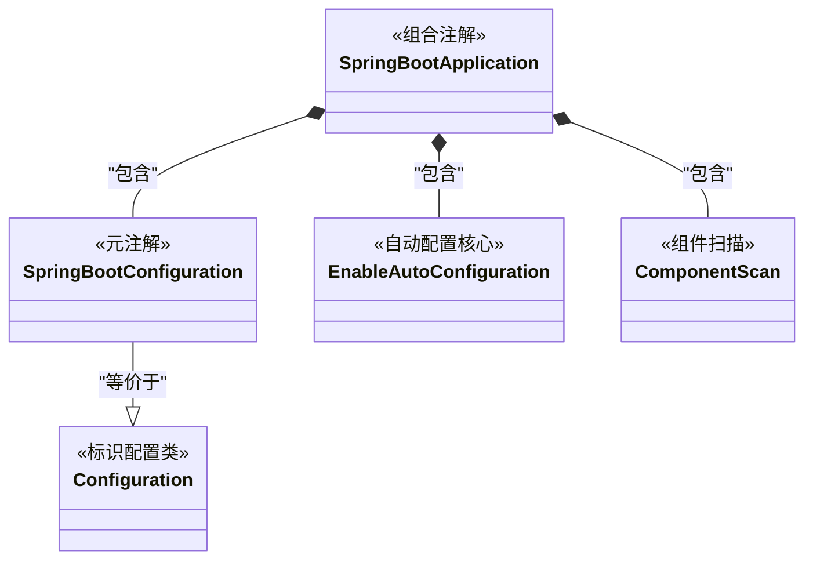

# Spring Boot 笔面试题集

> 题目来源：常见国企/互联网笔面试真题归纳
> 难度标注：★基础 ★★中档 ★★★拔高

> 📖 **参考链接**：
> - [Spring Framework Reference](https://docs.spring.io/spring-framework/reference/) -- Spring 框架参考文档（IoC、AOP、MVC、事务管理）
> - [Spring Boot Reference Documentation](https://docs.spring.io/spring-boot/docs/) -- Spring Boot 官方参考文档（自动配置、Starter、部署运维）

## 一、选择题（15 题，附解析）



> 上图展示了 `@SpringBootApplication` 注解的组合结构：它由 `@SpringBootConfiguration`（等价于 `@Configuration`）、`@EnableAutoConfiguration`（自动配置核心）和 `@ComponentScan`（组件扫描）三个核心注解组合而成。理解这一组合关系是掌握 Spring Boot 自动配置原理的前提。

1. ★ `@SpringBootApplication` 注解不包含以下哪个功能？
   A. `@Configuration`
   B. `@EnableAutoConfiguration`
   C. `@ComponentScan`
   D. `@Transactional`
   **答案：D**
   **解析：** `@SpringBootApplication` = `@SpringBootConfiguration` + `@EnableAutoConfiguration` + `@ComponentScan`，不包含 `@Transactional`。

2. ★★ 以下关于 Spring Bean 作用域默认值说法正确的是？
   A. prototype
   B. request
   C. session
   D. singleton
   **答案：D**
   **解析：** Spring Bean 默认作用域是 singleton（单例），整个容器中只有一个实例。

3. ★★ Spring AOP 不能代理以下哪种方法？
   A. public 方法
   B. protected 方法
   C. private 方法
   D. 接口方法
   **答案：C**
   **解析：** Spring AOP 使用 JDK 动态代理或 CGLIB 代理，都无法代理 private 方法。JDK 动态代理需要接口，CGLIB 通过继承生成子类也无法访问 private 方法。

4. ★★ `@Transactional` 注解默认回滚的异常类型是？
   A. Exception
   B. RuntimeException 和 Error
   C. 所有异常
   D. IOException
   **答案：B**
   **解析：** `@Transactional` 默认只回滚 RuntimeException 和 Error（未检查异常）。对于 checked exception（如 IOException），需要指定 `rollbackFor = Exception.class`。

5. ★ DispatcherServlet 的作用是？
   A. 处理数据库操作
   B. 前端控制器，统一分发请求
   C. 渲染视图
   D. 连接池管理
   **答案：B**
   **解析：** `DispatcherServlet` 是 Spring MVC 的前端控制器，负责统一接收请求并分发给对应的 Handler。

6. ★★ Spring Boot 自动配置的核心注解是？
   A. @Component
   B. @Configuration
   C. @EnableAutoConfiguration
   D. @SpringBootApplication
   **答案：C**
   **解析：** `@EnableAutoConfiguration` 是自动配置的核心注解，通过 `@Import(AutoConfigurationImportSelector.class)` 导入自动配置选择器。

7. ★★ 以下哪个条件注解表示"当容器中不存在指定 Bean 时生效"？
   A. @ConditionalOnClass
   B. @ConditionalOnMissingBean
   C. @ConditionalOnBean
   D. @ConditionalOnProperty
   **答案：B**
   **解析：** `@ConditionalOnMissingBean` 在容器中不存在指定 Bean 时生效。这是自动配置的核心机制：如果用户自定义了 Bean，则使用用户的自定义 Bean。

8. ★★ Spring MVC 中，以下哪个注解用于接收 JSON 请求体？
   A. @RequestParam
   B. @PathVariable
   C. @RequestBody
   D. @ModelAttribute
   **答案：C**
   **解析：** `@RequestBody` 用于接收 JSON/XML 格式的请求体，`@RequestParam` 用于接收查询参数，`@PathVariable` 用于 URL 路径参数。

9. ★ 以下关于 Spring Boot Starter 说法错误的是？
   A. Starter 是一组依赖描述符的集合
   B. 官方 Starter 命名格式为 `spring-boot-starter-*`
   C. Starter 只能用于 Web 开发
   D. 第三方 Starter 命名格式通常为 `*-spring-boot-starter`
   **答案：C**
   **解析：** Starter 可用于各种场景，如 `spring-boot-starter-data-jpa`（数据访问）、`spring-boot-starter-test`（测试）等。

10. ★★ Spring 中 Bean 的生命周期不包括？
    A. 实例化
    B. 属性赋值
    C. 编译
    D. 初始化
    **答案：C**
    **解析：** 编译是 Java 代码到字节码的过程，发生在运行之前，不属于 Bean 生命周期。Bean 生命周期包括：实例化 -> 属性赋值 -> 初始化 -> 使用 -> 销毁。

11. ★★ Spring 中循环依赖的解决方案是？
    A. 一级缓存
    B. 二级缓存
    C. 三级缓存
    D. 不使用缓存
    **答案：C**
    **解析：** Spring 通过三级缓存解决循环依赖：一级缓存（singletonObjects）存完全初始化好的 Bean，二级缓存（earlySingletonObjects）存早期暴露的 Bean，三级缓存（singletonFactories）存 Bean 工厂。

12. ★★ 以下哪个不是 Spring 的依赖注入方式？
    A. 构造器注入
    B. Setter 注入
    C. 字段注入
    D. 反射注入
    **答案：D**
    **解析：** Spring 支持三种注入方式：构造器注入、Setter 注入、字段注入（`@Autowired` 在字段上）。推荐使用构造器注入。

13. ★★ 拦截器（Interceptor）的执行时机不包括？
    A. Controller 方法执行前
    B. Controller 方法执行后
    C. 视图渲染后
    D. 请求到达服务器前
    **答案：D**
    **解析：** 拦截器执行时机：`preHandle`（Controller 前）、`postHandle`（Controller 后，视图渲染前）、`afterCompletion`（视图渲染后）。请求到达服务器前是 Filter 的执行时机。

14. ★★ 以下关于 `@RestController` 说法正确的是？
    A. 等价于 @Controller
    B. 等价于 @Controller + @ResponseBody
    C. 等价于 @Service
    D. 等价于 @Component
    **答案：B**
    **解析：** `@RestController` = `@Controller` + `@ResponseBody`，意味着 Controller 中所有方法返回值都会被序列化为 JSON/XML 直接写入响应体。

15. ★★★ Spring Boot 2.7 之后，自动配置注册文件从 `spring.factories` 改为？
    A. spring.autoconfig
    B. AutoConfiguration.imports
    C. auto-config.properties
    D. spring-config.xml
    **答案：B**
    **解析：** Spring Boot 2.7+ 使用 `META-INF/spring/org.springframework.boot.autoconfigure.AutoConfiguration.imports` 文件注册自动配置类，替代了之前的 `spring.factories`。

---

## 二、简答题（10 题，附要点）

### 1. ★★ Spring IoC 和 DI 的区别？

**要点：** IoC（控制反转）是一种设计思想，将对象创建和管理的控制权从代码转移到容器。DI（依赖注入）是 IoC 的具体实现方式。Spring 通过构造器注入、Setter 注入、字段注入三种方式实现 DI。

### 2. ★★ Spring Bean 的生命周期？

**要点：** 实例化（构造器） -> 属性赋值（依赖注入） -> Aware 接口回调 -> BeanPostProcessor 前置处理 -> 初始化（@PostConstruct） -> BeanPostProcessor 后置处理（AOP 代理生成） -> 使用 -> 销毁（@PreDestroy）

> **生活化类比：Bean 生命周期就像工厂流水线** —— 一辆汽车（Bean）在工厂中经历完整的制造流程：① **实例化**——冲压车间打造车身骨架（构造器创建对象）；② **属性赋值**——安装发动机、轮胎等零部件（依赖注入）；③ **Aware 回调**——贴上车辆识别码和生产标签（注入容器信息）；④ **前置处理**——质检员上线前检查（postProcessBeforeInitialization）；⑤ **初始化**——启动发动机测试、加注机油（@PostConstruct 等初始化方法）；⑥ **后置处理**——喷漆贴膜、安装 GPS 导航（AOP 代理在此生成，给 Bean "穿上外衣"）；⑦ **使用**——汽车交付客户驾驶；⑧ **销毁**——报废拆解、回收零件（@PreDestroy 资源释放）。

> 📖 **参考链接**：
> - [Spring Framework Reference](https://docs.spring.io/spring-framework/reference/) -- Spring 框架参考文档（Bean 生命周期、BeanPostProcessor 扩展点）

### 3. ★★ Spring Boot 自动配置原理？

**要点：** `@EnableAutoConfiguration` 通过 `@Import(AutoConfigurationImportSelector.class)` 导入自动配置选择器。选择器从 `META-INF/spring/*.AutoConfiguration.imports` 读取所有自动配置类，根据条件注解（`@ConditionalOnClass`、`@ConditionalOnMissingBean` 等）过滤，将符合条件的配置类导入容器。

### 4. ★★ Spring AOP 中 JDK 动态代理和 CGLIB 的区别？

**要点：** JDK 动态代理基于接口，使用 `Proxy` + `InvocationHandler`；CGLIB 基于继承，通过 ASM 生成子类。JDK 代理要求目标类实现接口，CGLIB 不能代理 final 类/方法。Spring Boot 2.x 默认使用 CGLIB。

### 5. ★★ Spring MVC 的执行流程？

**要点：** 请求 -> `DispatcherServlet` -> `HandlerMapping` 找到 Handler -> `HandlerAdapter` 调用 Handler -> Handler 返回 ModelAndView -> `ViewResolver` 解析视图 -> 视图渲染 -> 响应

### 6. ★★ @Transactional 失效的常见场景？

**要点：** ① 方法非 public（AOP 只代理 public 方法）② 同类方法调用（this.method() 不走代理）③ 异常被 catch 未抛出 ④ 数据库引擎不支持事务 ⑤ 多线程场景（事务绑定在线程上）

> **生活化类比：@Transactional 就像银行保险柜业务** —— 银行保险柜业务（事务）通过专门的客户经理（AOP 代理）办理：你（业务方法）去银行存取贵重物品，客户经理会在开始时打开保险柜（开启事务），操作完成后关上保险柜（提交事务），如果中途出错则恢复原状（回滚事务）。但以下情况会导致"保险柜形同虚设"：① **方法非 public**——你走后门私下操作（private 方法），客户经理不参与，自然没有保险柜保护；② **同类方法调用**——你在银行内部直接递东西给同事（this 调用），没经过客户经理（不走代理），保险柜不生效；③ **异常被吞**——操作出错后你悄悄修复没告诉客户经理（异常被 catch 未抛出），客户经理以为一切正常就关了保险柜（提交了事务），导致脏数据留存；④ **引擎不支持**——保险柜本身是坏的（MyISAM 不支持事务），再怎么操作也没用。

> 📖 **参考链接**：
> - [Spring Framework Reference](https://docs.spring.io/spring-framework/reference/) -- Spring 框架参考文档（声明式事务管理、@Transactional 失效场景分析）

### 7. ★★ Filter 和 Interceptor 的区别？

**要点：** Filter 是 Servlet 规范，由 Servlet 容器管理，作用于所有请求；Interceptor 是 Spring 框架的，由 Spring 容器管理，仅作用于 Spring MVC 处理的请求。Filter 在请求进入 Servlet 前后执行，Interceptor 在 Controller 方法前后和视图渲染后执行。

> **生活化类比：Filter 和 Interceptor 就像小区门禁 vs 楼栋门禁** —— Filter（过滤器）是小区大门的保安，所有进小区的人（包括送快递的、访客等所有请求，含静态资源）都要经过检查，保安由物业公司（Servlet 容器）管理，他不认识具体的住户信息。Interceptor（拦截器）是楼栋单元门的门禁系统，只有进入这栋楼去找具体住户的人（Spring MVC 处理的 Controller 请求）才需要刷卡，门禁系统由住户管理系统（Spring 容器）管理，可以获取住户信息（Spring Bean）。执行顺序是：先过小区大门（Filter）→ 再过楼栋门禁（Interceptor）→ 到达住户家中（Controller），返回时反过来走。

> 📖 **参考链接**：
> - [Spring Framework Reference](https://docs.spring.io/spring-framework/reference/) -- Spring 框架参考文档（Filter vs Interceptor 执行机制与使用场景）

### 8. ★★ @Component 和 @Bean 的区别？

**要点：** `@Component` 作用于类，通过类路径扫描自动注册为 Bean；`@Bean` 作用于方法，在 `@Configuration` 类中手动声明 Bean。`@Component` 适用于自己写的类，`@Bean` 适用于第三方类或需要复杂初始化逻辑的 Bean。

### 9. ★★ Spring Boot 配置文件加载优先级？

**要点：** 命令行参数 > 环境变量 > 系统属性 > jar 包外部 application-{profile}.yml > jar 包内部 application-{profile}.yml > jar 包外部 application.yml > jar 包内部 application.yml > @PropertySource

### 10. ★★ Spring 中使用了哪些设计模式？

**要点：** 单例模式（Bean 作用域）、工厂模式（BeanFactory）、代理模式（AOP）、模板方法模式（JdbcTemplate）、观察者模式（事件机制）、策略模式（Resource 接口）、适配器模式（HandlerAdapter）、装饰器模式（BeanWrapper）

---

## 三、编程题（3 题，每题 15 分，共 45 分）

### 1. ★★ 实现一个自定义 Spring Boot Starter

**题目**：实现一个 `my-log-spring-boot-starter`，当引入该 Starter 后，自动对所有标注了 `@MyLog` 注解的方法进行日志记录（记录方法名、参数、执行时间）。

**评分要点**：
- 正确创建 `@MyLog` 注解
- 创建 AOP 切面类（`@Aspect`、`@Around`）
- 创建自动配置类（`@Configuration` + `@ConditionalOnClass`）
- 创建 `spring.factories` 文件注册自动配置
- 创建 `spring-configuration-metadata.json` 支持 IDE 提示

**参考实现**：

```java
// 1. 注解定义
@Target(ElementType.METHOD)
@Retention(RetentionPolicy.RUNTIME)
public @interface MyLog {
    String value() default "";
}

// 2. AOP 切面
@Aspect
@Component
@Slf4j
public class LogAspect {
    @Around("@annotation(myLog)")
    public Object around(ProceedingJoinPoint joinPoint, MyLog myLog) throws Throwable {
        String methodName = joinPoint.getSignature().getName();
        Object[] args = joinPoint.getArgs();
        long start = System.currentTimeMillis();
        try {
            Object result = joinPoint.proceed();
            long time = System.currentTimeMillis() - start;
            log.info("方法: {}, 参数: {}, 耗时: {}ms", methodName, args, time);
            return result;
        } catch (Exception e) {
            log.error("方法: {} 异常: {}", methodName, e.getMessage());
            throw e;
        }
    }
}

// 3. 自动配置类
@Configuration
@ConditionalOnClass(LogAspect.class)
@EnableConfigurationProperties(MyLogProperties.class)
public class MyLogAutoConfiguration {
    @Bean
    @ConditionalOnMissingBean
    public LogAspect logAspect() {
        return new LogAspect();
    }
}

// 4. spring.factories（META-INF/spring.factories）
// org.springframework.boot.autoconfigure.EnableAutoConfiguration=\
// com.example.mylog.MyLogAutoConfiguration
```

**完整可运行版本（包含配置属性类 + spring.factories + 自动配置类）**：

```java
// ============ 手写Spring Boot Starter - 完整可运行示例 ============
// 项目结构：
// my-log-spring-boot-starter/
// ├── pom.xml
// └── src/main/
//     ├── java/com/example/mylog/
//     │   ├── MyLog.java                  // 注解定义
//     │   ├── MyLogProperties.java        // 配置属性类
//     │   ├── LogAspect.java              // AOP切面
//     │   └── MyLogAutoConfiguration.java // 自动配置类
//     └── resources/
//         └── META-INF/
//             ├── spring.factories        // 自动配置注册（Spring Boot 2.x）
//             ├── spring/
//             │   └── org.springframework.boot.autoconfigure.AutoConfiguration.imports  // Spring Boot 3.x
//             └── spring-configuration-metadata.json  // IDE提示支持（可选）

// ============ 1. 注解定义 ============
@Target(ElementType.METHOD)
@Retention(RetentionPolicy.RUNTIME)
@Documented
public @interface MyLog {
    /** 日志描述 */
    String value() default "";
    /** 是否打印参数 */
    boolean printArgs() default true;
    /** 是否打印返回值 */
    boolean printResult() default true;
}

// ============ 2. 配置属性类 ============
@ConfigurationProperties(prefix = "my.log")
public class MyLogProperties {
    /** 是否启用日志功能 */
    private boolean enabled = true;
    /** 日志前缀 */
    private String prefix = "[MY-LOG]";
    /** 是否打印方法参数 */
    private boolean printArgs = true;
    /** 是否打印方法返回值 */
    private boolean printResult = true;
    /** 耗时警告阈值（毫秒），超过此值打印WARN日志 */
    private long warnThreshold = 1000;
    /** 是否打印异常堆栈 */
    private boolean printStackTrace = false;

    // getter/setter（必须提供，否则@ConfigurationProperties绑定失败）
    public boolean isEnabled() { return enabled; }
    public void setEnabled(boolean enabled) { this.enabled = enabled; }
    public String getPrefix() { return prefix; }
    public void setPrefix(String prefix) { this.prefix = prefix; }
    public boolean isPrintArgs() { return printArgs; }
    public void setPrintArgs(boolean printArgs) { this.printArgs = printArgs; }
    public boolean isPrintResult() { return printResult; }
    public void setPrintResult(boolean printResult) { this.printResult = printResult; }
    public long getWarnThreshold() { return warnThreshold; }
    public void setWarnThreshold(long warnThreshold) { this.warnThreshold = warnThreshold; }
    public boolean isPrintStackTrace() { return printStackTrace; }
    public void setPrintStackTrace(boolean printStackTrace) { this.printStackTrace = printStackTrace; }
}

// ============ 3. AOP切面类 ============
@Aspect
@Slf4j
public class LogAspect {

    private final MyLogProperties properties;

    // 构造器注入配置属性
    public LogAspect(MyLogProperties properties) {
        this.properties = properties;
    }

    @Around("@annotation(myLog)")
    public Object around(ProceedingJoinPoint joinPoint, MyLog myLog) throws Throwable {
        // 全局开关关闭则直接执行
        if (!properties.isEnabled()) {
            return joinPoint.proceed();
        }

        String methodName = joinPoint.getSignature().getDeclaringTypeName()
                + "." + joinPoint.getSignature().getName();
        String logDesc = myLog.value().isEmpty() ? methodName : myLog.value();

        // 打印入参
        if (properties.isPrintArgs() && myLog.printArgs()) {
            Object[] args = joinPoint.getArgs();
            log.info("{}【开始】{} - 参数: {}", properties.getPrefix(), logDesc,
                    args != null ? Arrays.toString(args) : "无");
        } else {
            log.info("{}【开始】{}", properties.getPrefix(), logDesc);
        }

        long start = System.currentTimeMillis();
        try {
            Object result = joinPoint.proceed();
            long elapsed = System.currentTimeMillis() - start;

            // 打印返回值
            if (properties.isPrintResult() && myLog.printResult()) {
                log.info("{}【完成】{} - 耗时: {}ms - 返回值: {}",
                        properties.getPrefix(), logDesc, elapsed, result);
            } else {
                log.info("{}【完成】{} - 耗时: {}ms",
                        properties.getPrefix(), logDesc, elapsed);
            }

            // 慢方法警告
            if (elapsed > properties.getWarnThreshold()) {
                log.warn("{}【慢方法警告】{} - 耗时 {}ms 超过阈值 {}ms",
                        properties.getPrefix(), logDesc, elapsed, properties.getWarnThreshold());
            }

            return result;
        } catch (Exception e) {
            long elapsed = System.currentTimeMillis() - start;
            if (properties.isPrintStackTrace()) {
                log.error("{}【异常】{} - 耗时: {}ms - 异常: {}",
                        properties.getPrefix(), logDesc, elapsed, e.getMessage(), e);
            } else {
                log.error("{}【异常】{} - 耗时: {}ms - 异常: {}",
                        properties.getPrefix(), logDesc, elapsed, e.getMessage());
            }
            throw e;
        }
    }
}

// ============ 4. 自动配置类 ============
@Configuration
// 当classpath中存在LogAspect类时才生效（即引入了AOP依赖）
@ConditionalOnClass({LogAspect.class, JoinPoint.class})
// 绑定配置属性
@EnableConfigurationProperties(MyLogProperties.class)
// 当用户配置了my.log.enabled=true时才生效（默认true）
@ConditionalOnProperty(prefix = "my.log", name = "enabled", havingValue = "true", matchIfMissing = true)
public class MyLogAutoConfiguration {

    @Bean
    // 当容器中没有用户自定义的LogAspect时才创建默认的
    @ConditionalOnMissingBean(LogAspect.class)
    public LogAspect logAspect(MyLogProperties properties) {
        return new LogAspect(properties);
    }
}

// ============ 5. spring.factories（Spring Boot 2.x 方式）============
// 文件位置：META-INF/spring.factories
// 内容：
// org.springframework.boot.autoconfigure.EnableAutoConfiguration=\
// com.example.mylog.MyLogAutoConfiguration

// ============ 6. AutoConfiguration.imports（Spring Boot 2.7+/3.x 方式）============
// 文件位置：META-INF/spring/org.springframework.boot.autoconfigure.AutoConfiguration.imports
// 内容（每行一个配置类）：
// com.example.mylog.MyLogAutoConfiguration

// ============ 7. spring-configuration-metadata.json（可选，IDE提示支持）============
// 文件位置：META-INF/spring-configuration-metadata.json
// 内容：
// {
//   "properties": [
//     {
//       "name": "my.log.enabled",
//       "type": "java.lang.Boolean",
//       "description": "是否启用日志功能",
//       "defaultValue": true
//     },
//     {
//       "name": "my.log.prefix",
//       "type": "java.lang.String",
//       "description": "日志前缀",
//       "defaultValue": "[MY-LOG]"
//     },
//     {
//       "name": "my.log.print-args",
//       "type": "java.lang.Boolean",
//       "description": "是否打印方法参数",
//       "defaultValue": true
//     },
//     {
//       "name": "my.log.print-result",
//       "type": "java.lang.Boolean",
//       "description": "是否打印方法返回值",
//       "defaultValue": true
//     },
//     {
//       "name": "my.log.warn-threshold",
//       "type": "java.lang.Long",
//       "description": "耗时警告阈值（毫秒）",
//       "defaultValue": 1000
//     }
//   ]
// }

// ============ 8. 使用方（引入Starter后）============
// 在application.yml中配置：
// my:
//   log:
//     enabled: true
//     prefix: "[CUSTOM]"
//     warn-threshold: 500
//     print-args: true
//     print-result: false

// 在业务代码中使用：
// @RestController
// public class OrderController {
//     @MyLog("创建订单")
//     @PostMapping("/order")
//     public Result createOrder(@RequestBody OrderDTO dto) {
//         // 业务逻辑
//         return Result.success(orderId);
//     }
// }

// ============ 9. Starter的pom.xml（关键依赖）============
// <dependencies>
//     <!-- Spring Boot自动配置 -->
//     <dependency>
//         <groupId>org.springframework.boot</groupId>
//         <artifactId>spring-boot-autoconfigure</artifactId>
//     </dependency>
//     <!-- 配置属性处理器（生成metadata.json）-->
//     <dependency>
//         <groupId>org.springframework.boot</groupId>
//         <artifactId>spring-boot-configuration-processor</artifactId>
//         <optional>true</optional>
//     </dependency>
//     <!-- AOP支持 -->
//     <dependency>
//         <groupId>org.springframework.boot</groupId>
//         <artifactId>spring-boot-starter-aop</artifactId>
//     </dependency>
// </dependencies>
```

**Starter关键设计原则**：

| 组件 | 作用 | 关键注解/文件 |
|------|------|-------------|
| `@ConfigurationProperties` | 绑定配置属性，支持IDE提示 | `@ConfigurationProperties(prefix = "my.log")` |
| 自动配置类 | 条件装配Bean | `@ConditionalOnClass`、`@ConditionalOnMissingBean`、`@ConditionalOnProperty` |
| `spring.factories` / `AutoConfiguration.imports` | 注册自动配置类 | Spring Boot 2.x用前者，3.x用后者 |
| `spring-configuration-metadata.json` | IDE自动补全提示 | 可选，由`spring-boot-configuration-processor`自动生成 |

**条件注解速查**：

| 条件注解 | 生效条件 |
|---------|---------|
| `@ConditionalOnClass` | classpath中存在指定类 |
| `@ConditionalOnMissingClass` | classpath中不存在指定类 |
| `@ConditionalOnBean` | 容器中存在指定Bean |
| `@ConditionalOnMissingBean` | 容器中不存在指定Bean |
| `@ConditionalOnProperty` | 配置文件中存在指定属性 |
| `@ConditionalOnWebApplication` | 当前是Web应用 |
| `@ConditionalOnExpression` | SpEL表达式为true |

---

### 2. ★★ 实现一个 AOP 日志切面，记录 Controller 层的请求和响应

**题目**：使用 Spring AOP 实现一个切面，拦截所有 Controller 方法，记录请求 URL、请求参数、响应结果、执行耗时。要求对异常情况也进行记录。

**评分要点**：
- 切点表达式正确（拦截 Controller 包下所有方法）
- 使用 `@Around` 环绕通知
- 正确处理请求和响应
- 异常处理完善
- 耗时统计

**参考实现**：

```java
@Aspect
@Component
@Slf4j
public class ControllerLogAspect {
    
    @Pointcut("execution(* com.example.controller..*.*(..))")
    public void controllerPointcut() {}
    
    @Around("controllerPointcut()")
    public Object around(ProceedingJoinPoint joinPoint) throws Throwable {
        // 获取请求信息
        ServletRequestAttributes attributes = 
            (ServletRequestAttributes) RequestContextHolder.getRequestAttributes();
        HttpServletRequest request = attributes.getRequest();
        
        String url = request.getRequestURL().toString();
        String method = request.getMethod();
        String className = joinPoint.getSignature().getDeclaringTypeName();
        String methodName = joinPoint.getSignature().getName();
        Object[] args = joinPoint.getArgs();
        
        log.info("请求开始 -> URL: {}, Method: {}, Class: {}, Method: {}, Args: {}", 
                 url, method, className, methodName, JSON.toJSONString(args));
        
        long start = System.currentTimeMillis();
        Object result = null;
        try {
            result = joinPoint.proceed();
            long time = System.currentTimeMillis() - start;
            log.info("请求结束 -> URL: {}, 耗时: {}ms, 响应: {}", 
                     url, time, JSON.toJSONString(result));
            return result;
        } catch (Exception e) {
            long time = System.currentTimeMillis() - start;
            log.error("请求异常 -> URL: {}, 耗时: {}ms, 异常: {}", 
                      url, time, e.getMessage(), e);
            throw e;
        }
    }
}
```

---

### 3. ★★★ 实现一个方法级别的参数校验和防重复提交注解

**题目**：实现两个自定义注解 `@ValidateParam` 和 `@PreventDuplicate`：
- `@ValidateParam`：对方法参数进行非空校验和长度校验
- `@PreventDuplicate`：防止同一用户在 5 秒内重复提交相同请求（基于 Redis 实现）

**评分要点**：
- 注解定义正确（包含必要属性）
- 参数校验切面逻辑完善
- 防重复提交使用 Redis SET NX EX
- 生成唯一请求标识（用户ID + 方法名 + 参数MD5）
- 异常处理统一

**参考实现**：

```java
// 1. 注解定义
@Target(ElementType.METHOD)
@Retention(RetentionPolicy.RUNTIME)
public @interface ValidateParam {
    String[] notNull() default {};  // 需要非空校验的参数字段名
}

@Target(ElementType.METHOD)
@Retention(RetentionPolicy.RUNTIME)
public @interface PreventDuplicate {
    int expire() default 5;  // 防重复时间窗口（秒）
}

// 2. 防重复提交切面
@Aspect
@Component
@Slf4j
public class PreventDuplicateAspect {
    @Autowired
    private RedisTemplate<String, String> redisTemplate;
    
    @Around("@annotation(preventDuplicate)")
    public Object around(ProceedingJoinPoint joinPoint, 
                         PreventDuplicate preventDuplicate) throws Throwable {
        // 获取用户ID（从请求上下文）
        Long userId = getCurrentUserId();
        // 生成请求唯一标识
        String methodName = joinPoint.getSignature().toLongString();
        String argsMd5 = DigestUtils.md5Hex(JSON.toJSONString(joinPoint.getArgs()));
        String key = "duplicate:" + userId + ":" + methodName + ":" + argsMd5;
        
        // 使用 Redis SET NX 判断是否重复提交
        Boolean success = redisTemplate.opsForValue()
            .setIfAbsent(key, "1", preventDuplicate.expire(), TimeUnit.SECONDS);
        
        if (Boolean.FALSE.equals(success)) {
            throw new RuntimeException("请勿重复提交");
        }
        
        return joinPoint.proceed();
    }
}
```

---

## 四、场景设计题（2 题，每题 20 分，共 40 分）

### 1. ★★★ 设计一个统一异常处理方案

**题目**：在 Spring Boot 项目中设计一个完整的统一异常处理方案，要求：
- 自定义业务异常类（含错误码、错误信息）
- 使用 `@RestControllerAdvice` 全局捕获异常
- 区分业务异常、参数校验异常、系统异常
- 返回统一格式的错误响应
- 支持国际化错误信息

**参考答案**：

**架构设计**：
```
请求 → Controller → Service → 抛出业务异常
                ↓
         @RestControllerAdvice
                ↓
      统一异常处理器 → 统一错误响应
```

**核心代码**：

```java
// 1. 统一响应格式
@Data
@AllArgsConstructor
public class Result<T> {
    private Integer code;
    private String message;
    private T data;
    
    public static <T> Result<T> success(T data) {
        return new Result<>(200, "success", data);
    }
    
    public static <T> Result<T> error(Integer code, String message) {
        return new Result<>(code, message, null);
    }
}

// 2. 自定义业务异常
public class BusinessException extends RuntimeException {
    private Integer code;
    
    public BusinessException(Integer code, String message) {
        super(message);
        this.code = code;
    }
    
    public BusinessException(ErrorCode errorCode) {
        super(errorCode.getMessage());
        this.code = errorCode.getCode();
    }
}

// 3. 错误码枚举
public enum ErrorCode {
    SUCCESS(200, "成功"),
    PARAM_ERROR(400, "参数错误"),
    UNAUTHORIZED(401, "未认证"),
    FORBIDDEN(403, "无权限"),
    NOT_FOUND(404, "资源不存在"),
    DUPLICATE_SUBMIT(4001, "请勿重复提交"),
    SYSTEM_ERROR(500, "系统异常");
    
    private final Integer code;
    private final String message;
}

// 4. 全局异常处理器
@RestControllerAdvice
@Slf4j
public class GlobalExceptionHandler {
    
    // 业务异常
    @ExceptionHandler(BusinessException.class)
    public Result<Void> handleBusinessException(BusinessException e) {
        log.warn("业务异常：code={}, message={}", e.getCode(), e.getMessage());
        return Result.error(e.getCode(), e.getMessage());
    }
    
    // 参数校验异常
    @ExceptionHandler(MethodArgumentNotValidException.class)
    public Result<Void> handleValidationException(MethodArgumentNotValidException e) {
        String message = e.getBindingResult().getFieldErrors().stream()
            .map(FieldError::getDefaultMessage)
            .collect(Collectors.joining(", "));
        return Result.error(400, message);
    }
    
    // 系统异常
    @ExceptionHandler(Exception.class)
    public Result<Void> handleException(Exception e) {
        log.error("系统异常", e);
        return Result.error(500, "系统繁忙，请稍后重试");
    }
}
```

**国际化支持**：使用 `MessageSource` + `LocaleResolver`，根据请求头 `Accept-Language` 返回对应语言的错误信息。

---

### 2. ★★★ 设计一个 API 接口幂等性方案

**题目**：在分布式系统中，设计一个通用的 API 接口幂等方案，确保同一请求多次调用结果一致，不会产生重复数据（如重复扣款、重复创建订单）。

**参考答案**：

**方案一：Token 机制（适用于创建操作）**

```
1. 客户端先请求 Token：GET /api/idempotent/token → 返回 token
2. 服务端生成 token 存入 Redis：SET token:xxx "1" EX 300
3. 客户端请求时携带 token：POST /api/order Header: Idempotent-Token: xxx
4. 服务端校验 token：Lua 脚本判断 token 是否存在
   - 存在：删除 token，执行业务逻辑
   - 不存在：返回"请勿重复提交"
```

**Token 校验 Lua 脚本**：
```lua
local token = KEYS[1]
local exists = redis.call("EXISTS", token)
if exists == 1 then
    redis.call("DEL", token)
    return 1  -- 首次请求，token 有效
else
    return 0  -- 重复请求，token 无效
end
```

**方案二：唯一索引（适用于数据库层面）**

```sql
-- 订单表添加唯一索引
ALTER TABLE orders ADD UNIQUE INDEX uk_order_no (order_no);
```

**方案三：状态机（适用于有状态的业务）**

```
订单状态：待支付 → 已支付 → 已发货 → 已完成
每次状态变更前检查当前状态，只有当前状态允许的变更才执行。
```

**总结对比**：

| 方案 | 适用场景 | 优点 | 缺点 |
|------|---------|------|------|
| Token 机制 | 创建操作 | 通用性强，无侵入 | 需额外请求 Token |
| 唯一索引 | 数据库唯一约束 | 简单可靠，数据库层保证 | 仅适用于有唯一键的场景 |
| 状态机 | 有状态的业务 | 业务语义清晰 | 实现复杂，需维护状态 |

---

> **学习导航**：
> - 返回 [学习路线总览](../../README.md)
> - 本模块其他文件：[01-Spring-IoC与AOP深度](./01-Spring-IoC与AOP深度.md) | [02-Spring-Boot自动配置原理](./02-Spring-Boot自动配置原理.md) | [03-SpringMVC与RESTful设计](./03-SpringMVC与RESTful设计.md) | [04-登录认证与安全](./04-登录认证与安全.md)
> - 实战应用：[电商订单实时统计分析平台](../../extensions/project/01-电商订单实时统计分析平台.md)

