# Spring Boot - 综合场景串联

---

## 场景一：从零搭建一个 RESTful API 服务

### 场景描述
从零搭建一个用户管理 RESTful API 服务，支持用户的增删改查、分页查询、参数校验和统一异常处理。

### 涉及知识点
- [Spring Boot 自动配置原理](./02-Spring-Boot自动配置原理.md)：Spring Boot 项目初始化、Starter 依赖管理、自动配置机制
- [Spring MVC 与 RESTful 设计](./03-SpringMVC与RESTful设计.md)：Controller 层设计、RESTful API 规范、统一响应格式、参数校验、全局异常处理
- [Spring IoC 与 AOP 深度](./01-Spring-IoC与AOP深度.md)：Service 层依赖注入、构造器注入最佳实践
- [Spring Boot 部署与运维](./08-SpringBoot部署与运维.md)：多环境配置管理、JAR 打包部署

### 协作流程
1. 使用 Spring Initializr 创建项目，引入 spring-boot-starter-web、spring-boot-starter-validation 依赖
2. 自动配置机制加载内嵌 Tomcat、DispatcherServlet、Jackson 序列化等组件
3. 定义统一响应格式 Result<T>（code、message、data），所有接口返回此结构
4. 编写 Controller 层，遵循 RESTful 规范：GET /api/v1/users（分页查询）、GET /api/v1/users/{id}（详情）、POST /api/v1/users（新增）、PUT /api/v1/users/{id}（全量更新）、DELETE /api/v1/users/{id}（删除）
5. 使用 @Valid + 校验注解实现参数校验，配合 @RestControllerAdvice 全局异常处理
6. Service 层通过构造器注入依赖，使用 @Transactional 管理事务
7. 通过 application-{profile}.yml 分离多环境配置，使用 java -jar 打包部署

### 关键要点
- 构造器注入优于字段注入，便于单元测试和不可变依赖
- 统一响应格式避免前后端对接格式不一致
- 全局异常处理器区分业务异常、参数校验异常、系统异常，返回不同错误码
- 分页查询统一使用 page + size + sort 参数

```mermaid
%%{init: {'themeVariables': {'fontSize': '16px'}}}%%
flowchart LR
    A["main 方法入口"] --> B["SpringApplication.run()"]
    B --> C["创建 SpringApplication"]
    C --> D["准备环境（Environment）"]
    D --> E["创建 ApplicationContext"]
    E --> F["context.refresh() 刷新容器"]
    F --> G["自动配置加载"]
    G --> H["内嵌 Tomcat 启动"]
    H --> I["应用就绪（Ready）"]
```



> 上图展示了 Spring Boot 应用的完整启动流程：从 main 方法调用 SpringApplication.run() 开始，经历环境准备、容器创建、上下文刷新、自动配置加载和内嵌服务器启动，最终进入就绪状态。其中 context.refresh() 是核心步骤，负责完成 Bean 的加载、初始化与依赖注入。

### 完整示例代码

#### 步骤一：统一响应格式 Result

```java
package com.example.demo.common;

import lombok.AllArgsConstructor;
import lombok.Data;
import lombok.NoArgsConstructor;

/**
 * 统一响应格式，所有接口返回此结构
 */
@Data
@NoArgsConstructor
@AllArgsConstructor
public class Result<T> {

    /** 状态码：200 成功，4xx 客户端错误，5xx 服务端错误 */
    private int code;

    /** 提示信息 */
    private String message;

    /** 响应数据 */
    private T data;

    // ========== 成功响应 ==========

    public static <T> Result<T> ok(T data) {
        return new Result<>(200, "success", data);
    }

    public static <T> Result<T> ok(String message, T data) {
        return new Result<>(200, message, data);
    }

    public static Result<Void> ok() {
        return new Result<>(200, "success", null);
    }

    // ========== 失败响应 ==========

    public static <T> Result<T> fail(int code, String message) {
        return new Result<>(code, message, null);
    }

    public static <T> Result<T> fail(int code, String message, T data) {
        return new Result<>(code, message, data);
    }
}
```

#### 步骤二：自定义业务异常

```java
package com.example.demo.exception;

import lombok.Getter;

/**
 * 业务异常基类，携带错误码供全局异常处理器识别
 */
@Getter
public class BusinessException extends RuntimeException {

    private final int code;

    public BusinessException(int code, String message) {
        super(message);
        this.code = code;
    }

    public BusinessException(String message) {
        super(message);
        this.code = 400; // 默认客户端错误
    }

    /**
     * 常用静态工厂方法
     */
    public static BusinessException notFound(String message) {
        return new BusinessException(404, message);
    }

    public static BusinessException badRequest(String message) {
        return new BusinessException(400, message);
    }

    public static BusinessException forbidden(String message) {
        return new BusinessException(403, message);
    }
}
```

#### 步骤三：全局异常处理器 @RestControllerAdvice

```java
package com.example.demo.exception;

import com.example.demo.common.Result;
import lombok.extern.slf4j.Slf4j;
import org.springframework.http.HttpStatus;
import org.springframework.validation.BindException;
import org.springframework.validation.FieldError;
import org.springframework.web.bind.MethodArgumentNotValidException;
import org.springframework.web.bind.annotation.ExceptionHandler;
import org.springframework.web.bind.annotation.ResponseStatus;
import org.springframework.web.bind.annotation.RestControllerAdvice;

import jakarta.validation.ConstraintViolation;
import jakarta.validation.ConstraintViolationException;
import java.util.stream.Collectors;

/**
 * 全局异常处理器
 * 统一处理三类异常：业务异常、参数校验异常、系统未知异常
 */
@Slf4j
@RestControllerAdvice
public class GlobalExceptionHandler {

    // ========== 1. 业务异常 ==========

    @ExceptionHandler(BusinessException.class)
    public Result<Void> handleBusinessException(BusinessException e) {
        log.warn("业务异常: code={}, message={}", e.getCode(), e.getMessage());
        return Result.fail(e.getCode(), e.getMessage());
    }

    // ========== 2. 参数校验异常（@Valid + @RequestBody） ==========

    @ExceptionHandler(MethodArgumentNotValidException.class)
    @ResponseStatus(HttpStatus.BAD_REQUEST)
    public Result<Void> handleMethodArgumentNotValid(MethodArgumentNotValidException e) {
        String message = e.getBindingResult().getFieldErrors().stream()
                .map(fe -> fe.getField() + ": " + fe.getDefaultMessage())
                .collect(Collectors.joining("; "));
        log.warn("参数校验失败(@RequestBody): {}", message);
        return Result.fail(400, message);
    }

    // ========== 3. 参数校验异常（@Valid + @ModelAttribute / 无 @RequestBody） ==========

    @ExceptionHandler(BindException.class)
    @ResponseStatus(HttpStatus.BAD_REQUEST)
    public Result<Void> handleBindException(BindException e) {
        String message = e.getFieldErrors().stream()
                .map(fe -> fe.getField() + ": " + fe.getDefaultMessage())
                .collect(Collectors.joining("; "));
        log.warn("参数校验失败(Bind): {}", message);
        return Result.fail(400, message);
    }

    // ========== 4. 参数校验异常（@Validated 方法级别校验） ==========

    @ExceptionHandler(ConstraintViolationException.class)
    @ResponseStatus(HttpStatus.BAD_REQUEST)
    public Result<Void> handleConstraintViolation(ConstraintViolationException e) {
        String message = e.getConstraintViolations().stream()
                .map(cv -> cv.getPropertyPath() + ": " + cv.getMessage())
                .collect(Collectors.joining("; "));
        log.warn("参数校验失败(方法级): {}", message);
        return Result.fail(400, message);
    }

    // ========== 5. 系统未知异常（兜底） ==========

    @ExceptionHandler(Exception.class)
    @ResponseStatus(HttpStatus.INTERNAL_SERVER_ERROR)
    public Result<Void> handleException(Exception e) {
        log.error("系统异常", e);
        // 生产环境不要返回详细堆栈信息
        return Result.fail(500, "服务器内部错误，请联系管理员");
    }
}
```

#### 步骤四：自定义校验注解（手机号校验）

```java
package com.example.demo.validation;

import jakarta.validation.Constraint;
import jakarta.validation.Payload;
import java.lang.annotation.*;

/**
 * 自定义手机号校验注解
 */
@Documented
@Constraint(validatedBy = PhoneValidator.class)
@Target({ElementType.FIELD, ElementType.PARAMETER})
@Retention(RetentionPolicy.RUNTIME)
public @interface Phone {

    String message() default "手机号格式不正确";

    Class<?>[] groups() default {};

    Class<? extends Payload>[] payload() default {};
}
```

```java
package com.example.demo.validation;

import jakarta.validation.ConstraintValidator;
import jakarta.validation.ConstraintValidatorContext;
import java.util.regex.Pattern;

/**
 * 手机号校验器实现
 */
public class PhoneValidator implements ConstraintValidator<Phone, String> {

    private static final Pattern PHONE_PATTERN =
            Pattern.compile("^1[3-9]\\d{9}$");

    @Override
    public boolean isValid(String value, ConstraintValidatorContext context) {
        // 允许为空，空值校验由 @NotBlank 等注解负责
        if (value == null || value.isEmpty()) {
            return true;
        }
        return PHONE_PATTERN.matcher(value).matches();
    }
}
```

#### 步骤五：DTO 参数校验 + Controller 使用

```java
package com.example.demo.dto;

import com.example.demo.validation.Phone;
import lombok.Data;
import org.hibernate.validator.constraints.Range;

import jakarta.validation.constraints.Email;
import jakarta.validation.constraints.NotBlank;
import jakarta.validation.constraints.NotNull;
import jakarta.validation.constraints.Size;

/**
 * 用户创建请求 DTO
 */
@Data
public class UserCreateDTO {

    @NotBlank(message = "用户名不能为空")
    @Size(min = 2, max = 20, message = "用户名长度需在 2-20 之间")
    private String username;

    @NotBlank(message = "密码不能为空")
    @Size(min = 6, max = 30, message = "密码长度需在 6-30 之间")
    private String password;

    @Phone(message = "手机号格式不正确")
    private String phone;

    @Email(message = "邮箱格式不正确")
    private String email;

    @NotNull(message = "年龄不能为空")
    @Range(min = 1, max = 150, message = "年龄需在 1-150 之间")
    private Integer age;
}
```

```java
package com.example.demo.controller;

import com.example.demo.common.Result;
import com.example.demo.dto.UserCreateDTO;
import com.example.demo.dto.UserUpdateDTO;
import com.example.demo.dto.UserQueryDTO;
import com.example.demo.entity.User;
import com.example.demo.service.UserService;
import lombok.RequiredArgsConstructor;
import org.springframework.validation.annotation.Validated;
import org.springframework.web.bind.annotation.*;

import jakarta.validation.Valid;
import jakarta.validation.constraints.Min;
import java.util.List;

/**
 * 用户管理 Controller
 * 演示 @Valid、@Validated、分组校验、自定义校验注解的完整用法
 */
@RestController
@RequestMapping("/api/v1/users")
@RequiredArgsConstructor
@Validated // 开启方法级别参数校验
public class UserController {

    private final UserService userService;

    // ========== 查询 ==========

    /**
     * 分页查询用户列表
     * @Validated 配合 @Min 实现方法级别参数校验
     */
    @GetMapping
    public Result<List<User>> list(@Valid UserQueryDTO query) {
        return Result.ok(userService.list(query));
    }

    /**
     * 根据 ID 查询用户详情
     * @Min 注解在方法参数上，需要类级别加 @Validated 才生效
     */
    @GetMapping("/{id}")
    public Result<User> getById(
            @PathVariable @Min(value = 1, message = "用户ID必须大于0") Long id) {
        return Result.ok(userService.getById(id));
    }

    // ========== 新增 ==========

    /**
     * 创建用户
     * @Valid 触发 DTO 内部校验注解（@NotBlank、@Phone、@Email 等）
     */
    @PostMapping
    public Result<User> create(@RequestBody @Valid UserCreateDTO dto) {
        return Result.ok(userService.create(dto));
    }

    // ========== 更新 ==========

    /**
     * 全量更新用户
     */
    @PutMapping("/{id}")
    public Result<User> update(
            @PathVariable @Min(1) Long id,
            @RequestBody @Valid UserUpdateDTO dto) {
        return Result.ok(userService.update(id, dto));
    }

    // ========== 删除 ==========

    /**
     * 删除用户
     */
    @DeleteMapping("/{id}")
    public Result<Void> delete(
            @PathVariable @Min(value = 1, message = "用户ID必须大于0") Long id) {
        userService.delete(id);
        return Result.ok();
    }
}
```

#### 步骤六：Service 层实现（构造器注入 + 事务）

```java
package com.example.demo.service;

import com.example.demo.dto.UserCreateDTO;
import com.example.demo.dto.UserUpdateDTO;
import com.example.demo.dto.UserQueryDTO;
import com.example.demo.entity.User;
import com.example.demo.exception.BusinessException;
import com.example.demo.mapper.UserMapper;
import lombok.RequiredArgsConstructor;
import org.springframework.stereotype.Service;
import org.springframework.transaction.annotation.Transactional;

import java.util.List;

/**
 * 用户 Service
 * 使用构造器注入（@RequiredArgsConstructor），保证依赖不可变且便于单元测试
 */
@Service
@RequiredArgsConstructor
public class UserService {

    private final UserMapper userMapper;

    public List<User> list(UserQueryDTO query) {
        return userMapper.selectByCondition(query);
    }

    public User getById(Long id) {
        User user = userMapper.selectById(id);
        if (user == null) {
            throw BusinessException.notFound("用户不存在: id=" + id);
        }
        return user;
    }

    @Transactional(rollbackFor = Exception.class)
    public User create(UserCreateDTO dto) {
        // 检查用户名唯一性
        if (userMapper.existsByUsername(dto.getUsername())) {
            throw BusinessException.badRequest("用户名已存在");
        }
        User user = new User();
        user.setUsername(dto.getUsername());
        user.setPassword(dto.getPassword()); // 实际应加密存储
        user.setPhone(dto.getPhone());
        user.setEmail(dto.getEmail());
        user.setAge(dto.getAge());
        userMapper.insert(user);
        return user;
    }

    @Transactional(rollbackFor = Exception.class)
    public User update(Long id, UserUpdateDTO dto) {
        User user = getById(id);
        user.setPhone(dto.getPhone());
        user.setEmail(dto.getEmail());
        user.setAge(dto.getAge());
        userMapper.updateById(user);
        return user;
    }

    @Transactional(rollbackFor = Exception.class)
    public void delete(Long id) {
        getById(id); // 确保存在
        userMapper.deleteById(id);
    }
}
```

---

## 场景二：实现 JWT 登录认证 + 权限控制

### 场景描述
在 Spring Boot 项目中实现基于 JWT 的用户登录认证，结合 Spring Security 实现接口级别的权限控制，区分普通用户和管理员。

### 涉及知识点
- [登录认证与安全](./04-登录认证与安全.md)：JWT 认证流程、Spring Security 过滤器链、BCrypt 密码加密、CSRF 防护
- [Spring IoC 与 AOP 深度](./01-Spring-IoC与AOP深度.md)：自定义 AOP 切面实现权限校验
- [Spring Boot 自动配置原理](./02-Spring-Boot自动配置原理.md)：Spring Security 自动配置、自定义安全配置覆盖默认配置

### 协作流程
1. 引入 spring-boot-starter-security、jjwt 依赖
2. 配置 SecurityFilterChain：禁用 CSRF（前后端分离）、设置无状态会话、配置接口权限规则
3. 实现 UserDetailsService 从数据库加载用户信息
4. 配置 BCryptPasswordEncoder 作为密码加密器
5. 登录接口：验证用户名密码 -> 生成 JWT（含用户ID、角色、过期时间）-> 返回 Access Token + Refresh Token
6. 自定义 JwtAuthenticationFilter：从请求头 Authorization 中提取 Token -> 解析验证 -> 设置 SecurityContext
7. 将 JWT 过滤器添加到 SecurityFilterChain 中，位于 UsernamePasswordAuthenticationFilter 之前
8. 接口权限控制：/api/public/** 公开访问，/api/admin/** 需要 ADMIN 角色，其他接口需认证

### 关键要点
- JWT Payload 只存用户 ID 和角色，敏感信息从数据库查询
- Access Token 设置短过期时间（15分钟），配合 Refresh Token 轮换
- 前后端分离场景下禁用 CSRF 保护（Token 在 Header 中，浏览器不会自动携带）
- @PreAuthorize 注解可实现方法级别的细粒度权限控制

---

## 场景三：日志监控与运维一体化

### 场景描述
为 Spring Boot 项目配置分级日志输出、异步日志、Actuator 健康检查与指标采集，并实现 Docker 容器化部署和优雅停机。

### 涉及知识点
- [日志整合与监控](./07-日志整合与监控.md)：Logback 配置、异步日志、Actuator 端点、Prometheus 集成
- [Spring Boot 部署与运维](./08-SpringBoot部署与运维.md)：Docker 多阶段构建、外部化配置、优雅停机、内嵌容器切换

### 协作流程
1. 配置 logback-spring.xml：多环境 Profile（dev 输出 DEBUG 到控制台，prod 输出 INFO 到异步文件）-> 滚动文件策略（100MB 切割、保留 30 天）-> 异步 Appender 提升性能
2. 引入 spring-boot-starter-actuator 和 micrometer-registry-prometheus
3. 配置 Actuator：生产环境只暴露 health、info、metrics、prometheus 端点
4. 自定义 HealthIndicator 检查第三方服务可用性
5. 使用 Micrometer 采集业务指标（订单创建数、接口耗时等）
6. 编写 Dockerfile：多阶段构建（Maven 构建 + JRE 运行），减小镜像体积
7. 配置优雅停机：server.shutdown=graceful，timeout-per-shutdown-phase=30s
8. 外部化配置：将敏感配置放入环境变量，jar 包外 config/ 目录放置 application-prod.yml

### 关键要点
- 生产环境使用参数化日志，避免字符串拼接性能开销
- Actuator 端点需配合 Spring Security 鉴权，不可直接暴露公网
- 异步日志队列满时需明确丢弃策略，避免阻塞业务线程
- Docker 部署时注意时区配置（-Duser.timezone=Asia/Shanghai 或 TZ 环境变量）
- K8s 部署时 terminationGracePeriodSeconds 需大于应用优雅停机等待时间

---

> [返回模块目录](../../README.md) | [返回知识导览](../../知识导览.md)