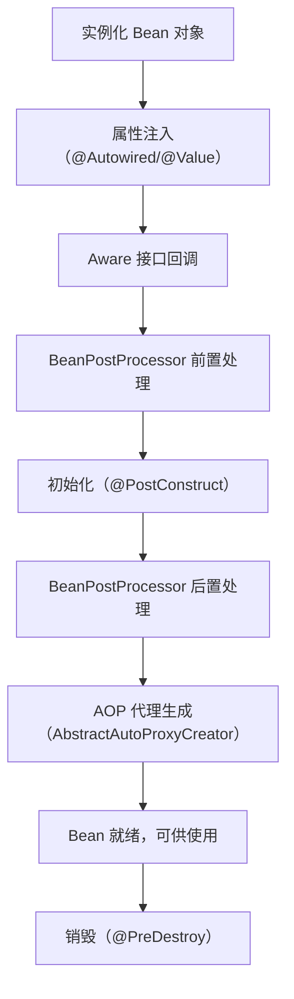

# Spring 核心与 IoC 原理

> 学习路线对应：SSM 单体架构 -- Spring 核心容器
> 前置知识：Java 面向对象、反射、动态代理基础
> 预计学习时间：2-3 天

## 一、核心概念

### 1.1 Spring 框架概述

Spring 是一个开源的 Java 应用程序框架，核心是 IoC（控制反转）和 AOP（面向切面编程）。

| 核心特性 | 说明 |
|---------|------|
| **IoC/DI** | 控制反转/依赖注入，解耦组件依赖 |
| **AOP** | 面向切面编程，统一处理横切关注点 |
| **容器** | 管理对象生命周期和配置 |
| **事务抽象** | 统一的事务编程接口，支持多种事务管理器 |
| **ORM 支持** | 集成 MyBatis、Hibernate 等 ORM 框架 |
| **MVC 框架** | SpringMVC 是原生自带的 Web 框架 |

Spring 设计理念：约定优于配置，简化企业级 Java 开发。

---

### 1.2 IoC 容器

IoC（Inversion of Control）控制反转，将对象创建和依赖管理的控制权从代码转移到容器。

> **生活化类比：** 传统编程像"自己在家做饭"——自己买菜、洗菜、切菜、烹饪，全程控制每一个环节（new 对象、组装依赖）。而 IoC 像"去餐厅吃饭"——你只需要告诉服务员你要什么菜（声明依赖），后厨（容器）帮你完成所有烹饪和组装工作，端上桌时已是一道完整的菜（注入好依赖的对象）。你从"控制烹饪过程"变成了"被动接收成品"，控制权被反转了。依赖注入（DI）就是服务员把菜端给你的过程。

#### BeanFactory vs ApplicationContext

| 特性 | BeanFactory | ApplicationContext |
|------|------------|--------------------|
| **继承关系** | 根接口 | 继承 BeanFactory |
| **功能** | 只提供基础容器功能 | 提供企业级扩展功能 |
| **初始化时机** | 懒加载，用到才创建 | 饿加载，启动时全创建 |
| **国际化** | 不支持 | 支持 |
| **事件机制** | 不支持 | 支持 |
| **资源加载** | 不支持 | 支持 |
| **注解支持** | 不支持 | 支持 |

**总结：** BeanFactory 是底层接口，ApplicationContext 是功能更丰富的容器，开发中一般用 ApplicationContext。

> 📖 **参考链接**：
> - [Spring Framework - The IoC Container](https://docs.spring.io/spring-framework/reference/core/beans/introduction.html) -- IoC 容器介绍
> - [Spring Framework - ApplicationContext vs BeanFactory](https://docs.spring.io/spring-framework/reference/core/beans/context-introduction.html) -- ApplicationContext 与 BeanFactory 对比

---

### 1.3 依赖注入三种方式

Spring 支持三种依赖注入方式：

| 注入方式 | 说明 | 推荐程度 |
|---------|------|---------|
| **构造器注入** | 通过构造方法参数注入 | 最推荐 |
| **Setter 注入** | 通过 Setter 方法注入 | 可选依赖使用 |
| **字段注入** | 通过 `@Autowired` 注解字段注入 | 不推荐 |

**构造器注入示例：**
```java
@Component
public class OrderService {
    private final UserRepository userRepository;

    public OrderService(UserRepository userRepository) {
        this.userRepository = userRepository;
    }
}
```

**优势：** 依赖不可变、强制依赖、便于单元测试、Spring 4.3+ 单构造器可省略 `@Autowired`。

> **生活化类比：依赖注入就像快递送货上门** —— 没有 DI 的传统代码相当于"自己跑到工厂提货"：在 OrderService 里 `new UserRepository()`、`new OrderRepository()`，你得亲自知道每个仓库的地址和取货方式。DI 相当于"快递送货上门"：你只需要在门口贴一张需求清单（构造方法参数 / @Autowired 字段），Spring 这个快递员就会根据清单把对应的包裹送到你手上。三种注入方式对应三种"接收方式"：构造器注入是"必须签收才能进门"（强制依赖），Setter 注入是"放在门口可以晚点取"（可选依赖），字段注入是"快递员直接扔进屋里"（看似省事，但你都不知道什么时候被塞进来的，也不方便测试）。

> 📖 **参考链接**：
> - [Spring Framework - Dependency Injection](https://docs.spring.io/spring-framework/reference/core/beans/dependencies/factory-collaborators.html) -- Spring 依赖注入参考
> - [Spring Framework - Constructor-based DI](https://docs.spring.io/spring-framework/reference/core/beans/dependencies/factory-collaborators.html#beans-constructor-injection) -- 构造器注入

---

### 1.4 Bean 生命周期

Bean 从实例化到销毁完整流程：

```
1. 实例化（Instantiation）
   通过反射调用构造器创建 Bean 实例

2. 属性注入（Dependency Injection）
   @Autowired、@Value 等完成属性填充

3. Aware 接口回调
   BeanNameAware、BeanFactoryAware、ApplicationContextAware

4. BeanPostProcessor 前置处理
   postProcessBeforeInitialization()

5. 初始化（Initialization）
   @PostConstruct → InitializingBean.afterPropertiesSet() → init-method

6. BeanPostProcessor 后置处理
   postProcessAfterInitialization()（AOP 代理在此生成）

7. Bean 就绪，可以使用

8. 销毁（Destruction）
   @PreDestroy → DisposableBean.destroy() → destroy-method
```

**关键点：** AOP 代理在 `postProcessAfterInitialization()` 阶段生成。

> 📖 **参考链接**：
> - [Spring Framework - Bean Lifecycle](https://docs.spring.io/spring-framework/reference/core/beans/factory-nature.html#beans-factory-lifecycle) -- Bean 生命周期
> - [Spring Framework - BeanPostProcessor](https://docs.spring.io/spring-framework/reference/core/beans/factory-extension.html#beans-factory-extension-bpp) -- BeanPostProcessor 扩展点

**Spring Bean 完整生命周期流程：**



以上流程图展示了 Spring Bean 从创建到销毁的完整生命周期，涵盖了实例化、属性填充、初始化回调以及销毁清理等关键阶段。其中 BeanPostProcessor 的前置处理和后置处理是 Spring 提供的核心扩展点，后置处理阶段会通过 AbstractAutoProxyCreator 判断是否需要创建 AOP 代理对象。理解这一生命周期有助于在开发中利用初始化回调进行资源加载，利用销毁回调释放连接等外部资源。

---

### 1.5 AOP 代理

AOP（Aspect Oriented Programming）面向切面编程，用于处理日志、事务、权限等横切关注点。

> **生活化类比：** AOP 就像机场安检。每个旅客（业务方法）都有自己的目的地和任务，但所有人登机前都必须经过同一个安检通道（切面）。安检人员（通知 Advice）会在你经过时执行统一的检查流程：检查身份证（权限校验）、扫描行李（日志记录）、过金属探测门（事务管理）。你不需要在每个登机口都设一个安检站，只需要在入口处统一设置一个检查点（切点 Pointcut），所有旅客自动经过。

#### JDK 动态代理 vs CGLIB 代理对比

| 维度 | JDK 动态代理 | CGLIB 代理 |
|------|-------------|-----------|
| **代理方式** | 基于接口 | 基于继承（生成子类） |
| **要求** | 目标类必须实现接口 | 不能代理 final 类/final 方法 |
| **依赖** | JDK 原生，无需额外依赖 | 需要 ASM 字节码库 |
| **性能** | 反射调用，略慢 | 字节码直接调用，较快 |
| **Spring 默认** | Spring 传统默认 | Spring Boot 2.x+ 默认 |

**Spring 选择规则：**
```
if (目标类实现了接口) {
    默认使用 JDK 动态代理
} else {
    使用 CGLIB
}
// 配置 proxyTargetClass = true 强制使用 CGLIB
```

> 📖 **参考链接**：
> - [Spring Framework - AOP Proxies](https://docs.spring.io/spring-framework/reference/core/aop/proxy.html) -- Spring AOP 代理机制
> - [Spring Framework - Choosing AOP Approach](https://docs.spring.io/spring-framework/reference/core/aop/choosing.html) -- JDK 动态代理 vs CGLIB 选择

---

### 1.6 Spring 事务管理

Spring 事务管理分为两种方式：

| 方式 | 说明 | 使用场景 |
|------|------|---------|
| **编程式事务** | 手动编码管理事务边界 | 需要精细控制事务流程 |
| **声明式事务** | `@Transactional` 注解 | 绝大多数场景推荐 |

**声明式事务本质：** AOP 增强，在方法调用前后织入事务开启、提交、回滚逻辑。

#### 传播行为（7 种）

| 传播行为 | 说明 | 使用场景 |
|---------|------|---------|
| **REQUIRED**（默认） | 如果有事务就加入，没有就新建 | 大多数场景 |
| **REQUIRES_NEW** | 总是新建事务，挂起当前事务 | 需要独立事务的操作 |
| **NESTED** | 如果有事务就在嵌套事务中执行，没有新建 | 嵌套回滚场景 |
| **SUPPORTS** | 如果有事务就加入，没有就不使用 | 只读查询 |
| **NOT_SUPPORTED** | 不使用事务，挂起当前事务 | 非事务操作 |
| **MANDATORY** | 必须在事务中执行，否则抛异常 | 强制要求事务 |
| **NEVER** | 必须不使用事务，否则抛异常 | 禁止事务 |

#### 隔离级别（4 种）

| 隔离级别 | 脏读 | 不可重复读 | 幻读 | 说明 |
|---------|------|-----------|------|------|
| **READ_UNCOMMITTED** | √ | √ | √ | 读未提交，几乎不用 |
| **READ_COMMITTED** | × | √ | √ | 读已提交，多数数据库默认 |
| **REPEATABLE_READ** | × | × | √ | 可重复读，MySQL InnoDB 默认 |
| **SERIALIZABLE** | × | × | × | 串行化，完全隔离，性能差 |

#### 事务失效常见场景

1. **方法非 public**：AOP 只能代理 public 方法，private/protected 不生效
2. **同类方法内部调用**：`this.method()` 不走代理对象，AOP 拦截不到
3. **异常被 catch 未抛出**：`@Transactional` 默认只回滚 RuntimeException，异常被吞不回滚
4. **数据库引擎不支持事务**：如 MyISAM 不支持事务，需用 InnoDB
5. **多线程场景**：事务绑定到 ThreadLocal，新线程不共享事务上下文
6. **注解在接口上**：CGLIB 代理无法读取接口注解，注解要放在实现类

> 📖 **参考链接**：
> - [Spring Framework - Transaction Management](https://docs.spring.io/spring-framework/reference/data-access/transaction.html) -- Spring 事务管理
> - [Spring Framework - Declarative Transactions](https://docs.spring.io/spring-framework/reference/data-access/transaction/declarative.html) -- 声明式事务
> - [Spring Framework - Transaction Propagation](https://docs.spring.io/spring-framework/reference/data-access/transaction/declarative/props.html) -- 事务传播行为

---

## 二、底层原理

### 2.1 Spring IoC 容器启动流程

```
1. Resource 定位
   定位配置资源（XML、注解、Java Config）

2. BeanDefinition 解析
   解析配置，生成 BeanDefinition 对象
   包含类名、作用域、依赖、初始化方法等元数据

3. BeanDefinition 注册
   将 BeanDefinition 注册到 BeanDefinitionRegistry
   底层是 ConcurrentHashMap<String, BeanDefinition>

4. Bean 实例化与依赖注入
   对非懒加载的 singleton Bean，依次实例化、注入、初始化
```

**核心组件：**
- `BeanFactory`：容器根接口，定义 `getBean()` 等基础方法
- `BeanDefinition`：Bean 的元数据描述
- `BeanDefinitionRegistry`：BeanDefinition 注册表
- `BeanPostProcessor`：Bean 后置处理器，在初始化前后扩展

---

### 2.2 Bean 生命周期详细流程

见核心概念章节的流程描述。

**扩展点：**
- `BeanPostProcessor`：在初始化前后对 Bean 进行增强
- `BeanFactoryPostProcessor`：在 BeanDefinition 注册后，实例化前修改 BeanDefinition
- `Aware` 接口：注入容器相关信息（BeanName、BeanFactory、ApplicationContext）

---

### 2.3 AOP 代理生成时机

AOP 代理在 Bean 生命周期的 `BeanPostProcessor.postProcessAfterInitialization()` 阶段生成，由 `AbstractAutoProxyCreator` 负责判断是否需要代理并创建代理对象。

---

### 2.4 事务代理机制

`@Transactional` 注解通过 AOP 织入事务逻辑：

```
@Around("@annotation(org.springframework.transaction.annotation.Transactional)")
public Object transactionAround(ProceedingJoinPoint pjp) {
    1. 获取或创建事务
    2. try {
        3. 执行目标方法
        4. 提交事务
       } catch (Exception e) {
        5. 判断是否需要回滚
        6. 需要回滚则回滚
       }
}
```

事务连接通过 `ThreadLocal<Connection>` 绑定到当前线程，保证同一事务内多个 DAO 操作使用同一个连接。

---

## 三、实战应用

### 3.1 构造器注入最佳实践

```java
// 推荐写法：final 字段 + 构造器注入
@Service
public class UserService {
    private final UserMapper userMapper;
    private final OrderMapper orderMapper;

    // Spring 4.3+ 单构造器可省略 @Autowired
    public UserService(UserMapper userMapper, OrderMapper orderMapper) {
        this.userMapper = userMapper;
        this.orderMapper = orderMapper;
    }
}
```

### 3.2 自定义 AOP 切面日志

```java
@Aspect
@Component
@Slf4j
public class ServiceLogAspect {

    @Pointcut("execution(* com.example.service.*.*(..))")
    public void serviceLayer() {}

    @Around("serviceLayer()")
    public Object logAround(ProceedingJoinPoint pjp) throws Throwable {
        String methodName = pjp.getSignature().getName();
        Object[] args = pjp.getArgs();
        long start = System.currentTimeMillis();

        log.info("方法 {} 开始执行，参数：{}", methodName, args);
        try {
            Object result = pjp.proceed();
            long time = System.currentTimeMillis() - start;
            log.info("方法 {} 执行完成，耗时：{}ms", methodName, time);
            return result;
        } catch (Exception e) {
            long time = System.currentTimeMillis() - start;
            log.error("方法 {} 执行异常，耗时：{}ms", methodName, time, e);
            throw e;
        }
    }
}
```

### 3.3 声明式事务配置

```java
// 开启注解事务支持
@Configuration
@EnableTransactionManagement
public class TransactionConfig {

    @Bean
    public PlatformTransactionManager transactionManager(DataSource dataSource) {
        return new DataSourceTransactionManager(dataSource);
    }
}

// Service 层使用
@Service
public class OrderService {

    @Transactional(rollbackFor = Exception.class)
    public void createOrder(Order order) {
        // 扣减库存
        inventoryMapper.deduct(order.getSkuId(), order.getQuantity());
        // 创建订单
        orderMapper.insert(order);
    }
}
```

`rollbackFor = Exception.class` 表示所有异常（包括 checked exception）都回滚，是推荐配置。

---

## 四、常见面试题

### 1. IoC 和 DI 的区别？

IoC（控制反转）是一种设计思想，将对象创建和依赖管理的控制权从代码转移到容器。DI（依赖注入）是 IoC 的具体实现方式，容器在运行时将依赖注入到对象中。

IoC 是思想层面，DI 是实现层面。

### 2. BeanFactory 和 ApplicationContext 的区别？

BeanFactory 是容器根接口，只提供基础容器功能，懒加载。ApplicationContext 继承 BeanFactory，添加了国际化、事件机制、资源加载、注解支持等企业级功能，启动时饿加载所有非懒加载 Bean。开发中一般使用 ApplicationContext。

### 3. 依赖注入三种方式对比，推荐哪种？

三种方式：构造器注入、Setter 注入、字段注入。推荐构造器注入，优势：依赖不可变、强制依赖、便于单元测试、循环依赖能提前暴露。Setter 注入用于可选依赖。字段注入不推荐，隐藏依赖、不便于测试、循环依赖问题会延后暴露。

### 4. 说出 Spring Bean 的完整生命周期？

实例化 → 属性注入 → Aware 接口回调 → BeanPostProcessor 前置 → 初始化（@PostConstruct） → BeanPostProcessor 后置（AOP 代理生成） → 使用 → 销毁（@PreDestroy）。

### 5. JDK 动态代理和 CGLIB 的区别？

JDK 动态代理基于接口，要求目标类实现接口，使用 `Proxy` + `InvocationHandler`，反射调用略慢。CGLIB 基于继承，生成子类，不需要接口，不能代理 final 类/final 方法，字节码直接调用较快。Spring Boot 2.x+ 默认使用 CGLIB。

### 6. @Transactional 失效场景有哪些？

① 方法非 public；② 同类方法内部调用不走代理；③ 异常被 catch 未抛出；④ 数据库引擎不支持事务；⑤ 多线程事务不共享；⑥ 注解在接口上。

### 7. Spring 事务传播行为有哪几种？默认是什么？

七种传播行为：REQUIRED（默认）、REQUIRES_NEW、NESTED、SUPPORTS、NOT_SUPPORTED、MANDATORY、NEVER。默认是 REQUIRED：有事务加入，没有新建。

### 8. Spring 事务隔离级别有哪几种？MySQL 默认是什么？

四种隔离级别：READ_UNCOMMITTED、READ_COMMITTED、REPEATABLE_READ、SERIALIZABLE。MySQL InnoDB 默认是 REPEATABLE_READ（可重复读）。

> 📖 **参考链接**：
> - [Spring Framework - Transaction Isolation](https://docs.spring.io/spring-framework/reference/data-access/transaction/declarative/isolation.html) -- 事务隔离级别
> - [MySQL - InnoDB Transaction Isolation](https://dev.mysql.com/doc/refman/8.0/en/innodb-transaction-isolation-levels.html) -- MySQL InnoDB 隔离级别

---

## 五、避坑指南

| 常见问题 | 现象 | 原因 | 解决方案 |
|---------|------|------|---------|
| AOP 同类方法调用失效 | @Transactional 等注解不生效 | this.method() 直接调用不走代理对象 | 拆分为两个 Service；`AopContext.currentProxy()` 获取代理；自身注入自身（@Autowired + @Lazy） |
| @Transactional 不回滚 | 抛异常后数据未回滚 | 默认只回滚 RuntimeException，checked 异常不回滚 | 添加 `rollbackFor = Exception.class` |
| 字段注入循环依赖不报错 | 项目能启动，但运行时 NPE | 字段注入允许循环依赖，问题延后暴露 | 改用构造器注入，提前发现循环依赖并重构 |
| CGLIB 无法代理 final 类 | 创建 Bean 时报错 | CGLIB 通过生成子类代理，final 类不能被继承 | 去掉 final 修饰；改用 JDK 动态代理（让类实现接口） |
| 多线程事务不共享 | 子线程中操作不回滚 | 事务绑定 ThreadLocal，线程间不共享 | 使用编程式事务传递 TransactionInfo；避免跨线程事务操作 |

## 本章学习自检

完成本章学习后，你应该能够：
- [ ] 解释 IoC/DI 概念、BeanFactory vs ApplicationContext、依赖注入三种方式
- [ ] 完整描述 Bean 生命周期和各阶段回调扩展点
- [ ] 对比 JDK 动态代理 vs CGLIB 代理，说明区别和使用场景
- [ ] 说出 Spring 事务 7 种传播行为、4 种隔离级别，列举事务失效场景
- [ ] 手写构造器注入 Service、自定义 AOP 切面、声明式事务配置
- [ ] 识别并解决 AOP 同类调用失效、事务不回滚等常见问题

---

> **学习导航**：
> - 返回 [02-javaweb-monolith 模块](../../README.md)
> - 下一篇：[02-SpringMVC执行流程](./02-SpringMVC执行流程.md)
