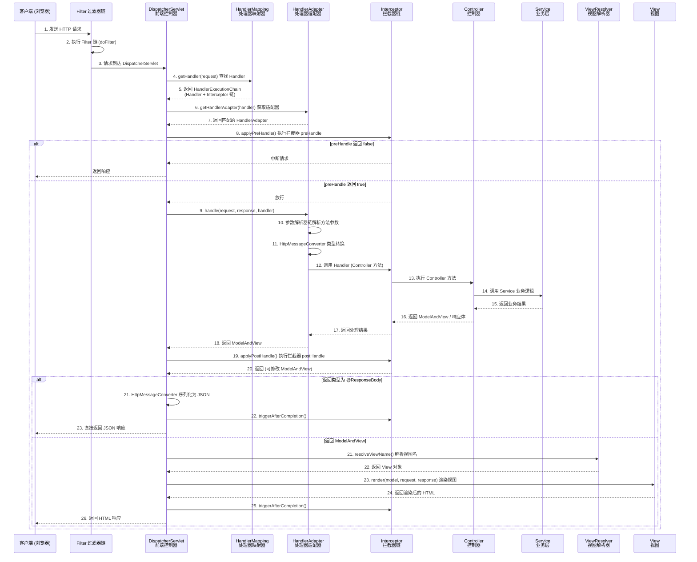

# SpringMVC 执行流程

> 学习路线对应：SSM 单体架构 -- SpringMVC Web 层
> 前置知识：Servlet 基础、HTTP 协议、Spring IoC 容器
> 预计学习时间：2-3 天

## 一、核心概念

### 1.1 MVC 设计模式

MVC（Model-View-Controller）是一种架构设计模式，将应用程序分为三层：

| 层次 | 职责 | 对应组件 |
|------|------|---------|
| **Model（模型）** | 封装业务数据和业务逻辑 | Service、DAO、Entity |
| **View（视图）** | 展示数据，与用户交互 | JSP、Thymeleaf、JSON |
| **Controller（控制器）** | 接收请求，调用 Model，选择 View | @Controller 类 |

**核心思想：** 关注点分离，各层职责单一，便于维护和扩展。

> **生活化类比：MVC 就像餐厅运营分工** —— MVC 的三层职责与餐厅运营完全对应：Model 是后厨（业务数据和配方逻辑，Service 是主厨、DAO 是采购员、Entity 是食材），View 是餐厅菜单和餐桌摆盘（用户看到并交互的内容），Controller 是服务员（接收顾客点单、把需求转告后厨、把做好的菜端给顾客）。三层各司其职：服务员不会自己炒菜（Controller 不写业务逻辑），后厨不会直接面对顾客（Model 不处理 HTTP），菜单不会自己更新（View 不修改数据）。这种"关注点分离"让任何一层的变更都不影响其他两层——换菜单不影响后厨配方，换厨师不影响服务员流程。

> 📖 **参考链接**：
> - [Spring Framework - Web MVC Framework](https://docs.spring.io/spring-framework/reference/web/webmvc.html) -- SpringMVC 官方文档
> - [Spring Framework - DispatcherServlet](https://docs.spring.io/spring-framework/reference/web/webmvc/mvc-servlet/dispatcher-servlet.html) -- DispatcherServlet 介绍

---

### 1.2 DispatcherServlet 九大组件

DispatcherServlet 是 SpringMVC 的前端控制器，内部依赖九大组件协同工作：

| 组件 | 接口 | 职责 |
|------|------|------|
| **HandlerMapping** | HandlerMapping | 根据请求 URL 查找对应的 Handler 和拦截器 |
| **HandlerAdapter** | HandlerAdapter | 执行 Handler，适配不同类型的处理器 |
| **HandlerExceptionResolver** | HandlerExceptionResolver | 处理 Handler 执行过程中抛出的异常 |
| **ViewResolver** | ViewResolver | 将逻辑视图名解析为具体的 View 对象 |
| **View** | View | 渲染视图，将模型数据填充到模板 |
| **MultipartResolver** | MultipartResolver | 处理文件上传请求 |
| **LocaleResolver** | LocaleResolver | 国际化支持，解析请求中的区域信息 |
| **ThemeResolver** | ThemeResolver | 主题解析，控制页面主题 |
| **FlashMapManager** | FlashMapManager | 管理 FlashMap，实现重定向传参 |

**常用组件关系：** HandlerMapping 找处理器，HandlerAdapter 执行处理器，ViewResolver 解析视图。

> **生活化类比：DispatcherServlet 九大组件就像大型企业前台** —— 把 DispatcherServlet 想象成一家大型企业的前台总调度：HandlerMapping 是公司电话总机（根据客户来电号码找到对应部门），HandlerAdapter 是翻译官（不同部门说不同语言——XML 风格、注解风格、传统 Servlet 风格——适配器把它们都翻译成统一调用），HandlerExceptionResolver 是公关部（出问题时统一对外解释），ViewResolver 是美工部（把业务数据填充到模板渲染成页面），MultipartResolver 是收发室（处理大件包裹即文件上传），LocaleResolver 是国际部（根据客户语言切换服务），ThemeResolver 是装修组（切换主题皮肤），FlashMapManager 是临时寄存柜（重定向时一次性传递参数）。九大组件协同工作，让 DispatcherServlet 成为企业唯一的对外窗口。

> 📖 **参考链接**：
> - [Spring Framework - DispatcherServlet Special Bean Types](https://docs.spring.io/spring-framework/reference/web/webmvc/mvc-servlet/special-bean-types.html) -- 九大组件详解
> - [Spring Framework - HandlerMapping](https://docs.spring.io/spring-framework/reference/web/webmvc/mvc-servlet/handlermapping.html) -- HandlerMapping 文档

---

### 1.3 请求处理完整流程

一个 HTTP 请求在 SpringMVC 中的完整处理流程：

```
1. 客户端发送请求
   浏览器发送 HTTP 请求到服务器

2. DispatcherServlet 接收请求
   前端控制器统一接收所有请求

3. HandlerMapping 查找 Handler
   DispatcherServlet 调用 HandlerMapping 根据 URL 找到对应的 Handler（Controller 方法）
   同时返回匹配的拦截器链

4. HandlerAdapter 调用 Handler
   DispatcherServlet 调用 HandlerAdapter 适配执行 Handler
   HandlerAdapter 执行预拦截器链的 preHandle

5. Handler 执行业务逻辑
   Controller 方法执行业务逻辑，调用 Service 层
   返回 ModelAndView（包含视图名和模型数据）

6. ViewResolver 解析视图
   DispatcherServlet 调用 ViewResolver 将逻辑视图名解析为具体 View 对象

7. View 渲染视图
   View 将模型数据填充到视图模板，生成 HTML 内容

8. 返回响应
   执行拦截器链的 afterCompletion
   将响应内容返回给客户端
```

**前后端分离场景：** 如果 Controller 方法标注了 `@ResponseBody`，则跳过 ViewResolver 和 View 渲染，直接通过 HttpMessageConverter 将返回值序列化为 JSON 写入响应体。

> 📖 **参考链接**：
> - [Spring Framework - Request Handling Flow](https://docs.spring.io/spring-framework/reference/web/webmvc/mvc-servlet/sequence.html) -- SpringMVC 请求处理流程
> - [Spring Framework - HttpMessageConverter](https://docs.spring.io/spring-framework/reference/integration/rest-clients.html#rest-message-converters) -- HttpMessageConverter 文档

**DispatcherServlet 请求处理完整时序图：**



> 上图展示了 DispatcherServlet 处理一次 HTTP 请求的完整时序：从前端控制器接收请求、HandlerMapping 定位 Handler、HandlerAdapter 适配调用、拦截器链 preHandle/postHandle/afterCompletion 三阶段回调，到最终通过 ViewResolver 渲染或 HttpMessageConverter 序列化返回响应。理解这一时序有助于排查请求未被拦截器捕获、参数解析失败、视图渲染异常等常见问题。

---

### 1.4 常用注解

SpringMVC 核心注解一览：

| 注解 | 作用 | 使用位置 |
|------|------|---------|
| **@Controller** | 声明该类为控制器，由 Spring 扫描注册 | 类 |
| **@RestController** | `@Controller` + `@ResponseBody` 组合 | 类 |
| **@RequestMapping** | 映射请求 URL 到方法 | 类/方法 |
| **@GetMapping** | 映射 GET 请求 | 方法 |
| **@PostMapping** | 映射 POST 请求 | 方法 |
| **@PutMapping** | 映射 PUT 请求 | 方法 |
| **@DeleteMapping** | 映射 DELETE 请求 | 方法 |
| **@RequestParam** | 绑定 URL 查询参数或表单字段 | 参数 |
| **@PathVariable** | 绑定 URL 路径中的变量 | 参数 |
| **@RequestBody** | 绑定 JSON 请求体到对象 | 参数 |
| **@RequestHeader** | 绑定请求头值 | 参数 |
| **@CookieValue** | 绑定 Cookie 值 | 参数 |
| **@ModelAttribute** | 绑定表单数据到对象 | 参数/方法 |

**使用示例：**
```java
@RestController
@RequestMapping("/api/users")
public class UserController {

    @GetMapping("/{id}")
    public Result<User> getUser(@PathVariable Long id) {
        // ...
    }

    @PostMapping
    public Result<Void> createUser(@RequestBody @Valid User user) {
        // ...
    }

    @GetMapping
    public Result<Page<User>> listUsers(@RequestParam(defaultValue = "1") int page,
                                         @RequestParam(defaultValue = "10") int size) {
        // ...
    }
}
```

> 📖 **参考链接**：
> - [Spring Framework - Request Mapping](https://docs.spring.io/spring-framework/reference/web/webmvc/mvc-controller/annotations/requestmapping.html) -- @RequestMapping 用法
> - [Spring Framework - Request Parameters](https://docs.spring.io/spring-framework/reference/web/webmvc/mvc-controller/annotations.html) -- 参数绑定注解

---

### 1.5 参数绑定原理

SpringMVC 参数绑定是将 HTTP 请求参数映射到 Controller 方法参数的过程。

| 绑定方式 | 数据来源 | 使用注解 |
|---------|---------|---------|
| URL 路径参数 | RESTful URL 中的变量 | `@PathVariable` |
| 查询参数 | URL `?` 后面的参数 | `@RequestParam` |
| 请求体 | POST/PUT 的 JSON/XML 请求体 | `@RequestBody` |
| 表单数据 | 表单提交的字段 | `@ModelAttribute`（可省略） |
| 请求头 | HTTP 请求头 | `@RequestHeader` |
| Cookie | 浏览器 Cookie | `@CookieValue` |

**数据绑定流程：**
1. 请求到达，DispatcherServlet 通过 HandlerAdapter 调用 Handler
2. HandlerAdapter 调用参数解析器（HandlerMethodArgumentResolver）解析每个参数
3. 根据参数类型和注解选择合适的 HttpMessageConverter 进行类型转换
4. 将转换后的值注入到方法参数中

**常见参数解析器：**
- `RequestParamMethodArgumentResolver`：处理 `@RequestParam` 注解的参数
- `PathVariableMethodArgumentResolver`：处理 `@PathVariable` 注解的参数
- `RequestResponseBodyMethodProcessor`：处理 `@RequestBody` 注解的参数

---

### 1.6 类型转换

SpringMVC 提供类型转换机制，将字符串请求参数转换为目标类型。

| 转换方式 | 说明 | 使用场景 |
|---------|------|---------|
| **默认转换器** | Spring 内置的类型转换器 | String → Integer、String → Date 等 |
| **Converter 接口** | 自定义类型转换器 | 特殊类型转换，如 String → Enum |
| **Formatter 接口** | 格式化器，支持国际化 | 日期、数字格式化 |
| **@InitBinder** | 控制器级别的类型转换绑定 | 针对特定 Controller 的类型转换 |
| **@DateTimeFormat** | 日期格式注解 | 指定日期格式转换 |
| **@NumberFormat** | 数字格式注解 | 指定数字格式转换 |

**自定义转换器示例：**
```java
@Component
public class StringToEnumConverter implements Converter<String, OrderStatus> {
    @Override
    public OrderStatus convert(String source) {
        return OrderStatus.fromCode(Integer.parseInt(source));
    }
}
```

---

### 1.7 拦截器原理与 Filter 区别

#### 拦截器（Interceptor）

拦截器是 SpringMVC 提供的请求拦截机制，基于 AOP 思想，在 Controller 方法前后执行。

**三个执行时机：**
- `preHandle`：Controller 方法执行前，返回 false 中断请求
- `postHandle`：Controller 方法执行后，视图渲染前
- `afterCompletion`：视图渲染后，用于资源清理

**实现示例：**
```java
@Component
public class AuthInterceptor implements HandlerInterceptor {
    @Override
    public boolean preHandle(HttpServletRequest request, HttpServletResponse response, Object handler) {
        // 认证逻辑：检查 token 是否有效
        String token = request.getHeader("Authorization");
        if (token == null) {
            throw new UnauthorizedException("未登录");
        }
        return true; // 返回 true 放行，false 中断
    }

    @Override
    public void afterCompletion(HttpServletRequest request, HttpServletResponse response, Object handler, Exception ex) {
        // 清理 ThreadLocal 等资源
    }
}
```

#### Filter vs Interceptor 对比

| 维度 | Filter（过滤器） | Interceptor（拦截器） |
|------|-----------------|---------------------|
| **规范** | Servlet 规范，Java EE 标准 | Spring 框架特有 |
| **容器** | Servlet 容器管理 | Spring IoC 容器管理 |
| **作用范围** | 所有请求（含静态资源） | 仅 SpringMVC 处理的请求 |
| **执行时机** | 请求进入 Servlet 前后 | Controller 方法前后 |
| **依赖注入** | 不能直接注入 Spring Bean | 可直接注入 Spring Bean |
| **执行顺序** | Filter 先于 Interceptor | Interceptor 在 Filter 之后 |
| **粒度** | 粗粒度，拦截所有 | 细粒度，可指定 Controller |
| **生命周期方法** | init、doFilter、destroy | preHandle、postHandle、afterCompletion |

**执行顺序：** Filter 链 → DispatcherServlet → Interceptor preHandle → Controller → Interceptor postHandle → 视图渲染 → Interceptor afterCompletion

> 📖 **参考链接**：
> - [Spring Framework - Interceptor](https://docs.spring.io/spring-framework/reference/web/webmvc/mvc-servlet/handlerinterceptor.html) -- HandlerInterceptor 文档
> - [Spring Framework - Filter vs Interceptor](https://docs.spring.io/spring-framework/reference/web/webmvc/mvc-servlet/filters.html) -- Filter 与 Interceptor 区别

---

### 1.8 @ControllerAdvice 全局异常处理

`@ControllerAdvice`（或 `@RestControllerAdvice`）是 SpringMVC 提供的全局异常处理机制，可以拦截所有 Controller 抛出的异常，统一处理。

```java
@RestControllerAdvice
@Slf4j
public class GlobalExceptionHandler {

    // 处理业务异常
    @ExceptionHandler(BusinessException.class)
    public Result<Void> handleBusinessException(BusinessException e) {
        log.warn("业务异常：code={}, message={}", e.getCode(), e.getMessage());
        return Result.error(e.getCode(), e.getMessage());
    }

    // 处理参数校验异常
    @ExceptionHandler(MethodArgumentNotValidException.class)
    public Result<Void> handleValidationException(MethodArgumentNotValidException e) {
        String message = e.getBindingResult().getFieldErrors().stream()
            .map(FieldError::getDefaultMessage)
            .collect(Collectors.joining(", "));
        return Result.error(400, message);
    }

    // 处理系统异常
    @ExceptionHandler(Exception.class)
    public Result<Void> handleException(Exception e) {
        log.error("系统异常", e);
        return Result.error(500, "系统繁忙，请稍后重试");
    }
}
```

**核心要素：**
- `@ExceptionHandler`：指定处理的异常类型
- `@RestControllerAdvice`：`@ControllerAdvice` + `@ResponseBody`，返回 JSON
- 异常处理优先级：子类异常处理器优先于父类异常处理器

> 📖 **参考链接**：
> - [Spring Framework - Exceptions](https://docs.spring.io/spring-framework/reference/web/webmvc/mvc-ann-rest-exceptions.html) -- SpringMVC 异常处理
> - [Spring Framework - Controller Advice](https://docs.spring.io/spring-framework/reference/web/webmvc/mvc-ann-controller-advice.html) -- @ControllerAdvice 文档

---

## 二、底层原理

### 2.1 DispatcherServlet 初始化流程

DispatcherServlet 继承自 HttpServlet，其初始化流程：

```
1. 加载 Spring 配置文件
   DispatcherServlet 初始化时创建 WebApplicationContext

2. 初始化九大组件
   调用 initStrategies() 方法，按顺序初始化九大组件

3. 注册为 Servlet
   将 DispatcherServlet 注册到 Servlet 容器，映射请求路径（通常是 "/"）
```

**initStrategies() 初始化顺序：**
```java
initMultipartResolver();      // 文件上传解析器
initLocaleResolver();         // 国际化解析器
initThemeResolver();          // 主题解析器
initHandlerMappings();        // 处理器映射器
initHandlerAdapters();        // 处理器适配器
initHandlerExceptionResolvers(); // 异常解析器
initViewResolvers();          // 视图解析器
initFlashMapManager();        // FlashMap 管理器
```

---

### 2.2 请求分发核心流程

DispatcherServlet 的核心方法 `doDispatch()` 流程：

```java
protected void doDispatch(HttpServletRequest request, HttpServletResponse response) {
    // 1. 根据请求获取 Handler（包含 Controller 方法 + 拦截器链）
    HandlerExecutionChain mappedHandler = getHandler(request);

    // 2. 根据 Handler 获取对应的 HandlerAdapter
    HandlerAdapter ha = getHandlerAdapter(mappedHandler.getHandler());

    // 3. 执行拦截器 preHandle
    if (!mappedHandler.applyPreHandle(request, response)) {
        return; // preHandle 返回 false，中断请求
    }

    // 4. 通过 HandlerAdapter 执行 Handler
    ModelAndView mv = ha.handle(request, response, mappedHandler.getHandler());

    // 5. 执行拦截器 postHandle
    mappedHandler.applyPostHandle(request, response, mv);

    // 6. 处理异常（如果有）
    // 7. 解析视图
    // 8. 渲染视图
    // 9. 执行拦截器 afterCompletion
}
```

---

### 2.3 参数解析器链

HandlerAdapter 调用 Handler 时，通过参数解析器链解析方法参数：

```java
// 参数解析器接口
public interface HandlerMethodArgumentResolver {
    boolean supportsParameter(MethodParameter parameter); // 是否支持该参数
    Object resolveArgument(MethodParameter parameter, ...); // 解析参数
}
```

SpringMVC 内置 26+ 个参数解析器，按顺序匹配，第一个 supports 返回 true 的解析器负责解析。

---

## 三、实战应用

### 3.1 RESTful API 设计

```java
@RestController
@RequestMapping("/api/orders")
public class OrderController {

    @Autowired
    private OrderService orderService;

    // GET /api/orders?page=1&size=10
    @GetMapping
    public Result<Page<OrderVO>> listOrders(@RequestParam(defaultValue = "1") int page,
                                             @RequestParam(defaultValue = "10") int size) {
        return Result.success(orderService.pageOrders(page, size));
    }

    // GET /api/orders/123
    @GetMapping("/{id}")
    public Result<OrderVO> getOrder(@PathVariable Long id) {
        return Result.success(orderService.getOrderById(id));
    }

    // POST /api/orders
    @PostMapping
    public Result<Void> createOrder(@RequestBody @Valid OrderCreateDTO dto) {
        orderService.createOrder(dto);
        return Result.success();
    }

    // PUT /api/orders/123
    @PutMapping("/{id}")
    public Result<Void> updateOrder(@PathVariable Long id, @RequestBody @Valid OrderUpdateDTO dto) {
        orderService.updateOrder(id, dto);
        return Result.success();
    }

    // DELETE /api/orders/123
    @DeleteMapping("/{id}")
    public Result<Void> deleteOrder(@PathVariable Long id) {
        orderService.deleteOrder(id);
        return Result.success();
    }
}
```

### 3.2 拦截器注册与配置

```java
@Configuration
public class WebMvcConfig implements WebMvcConfigurer {

    @Autowired
    private AuthInterceptor authInterceptor;

    @Autowired
    private LogInterceptor logInterceptor;

    @Override
    public void addInterceptors(InterceptorRegistry registry) {
        registry.addInterceptor(logInterceptor)
                .addPathPatterns("/**")           // 拦截所有路径
                .order(1);                         // 执行顺序

        registry.addInterceptor(authInterceptor)
                .addPathPatterns("/api/**")        // 只拦截 API 接口
                .excludePathPatterns("/api/login", "/api/register") // 排除登录和注册
                .order(2);
    }
}
```

### 3.3 全局异常处理 + 统一响应

```java
// 统一响应格式
@Data
@AllArgsConstructor
public class Result<T> {
    private Integer code;
    private String message;
    private T data;

    public static <T> Result<T> success(T data) {
        return new Result<>(200, "success", data);
    }

    public static <T> Result<T> success() {
        return new Result<>(200, "success", null);
    }

    public static <T> Result<T> error(Integer code, String message) {
        return new Result<>(code, message, null);
    }
}

// 全局异常处理
@RestControllerAdvice
@Slf4j
public class GlobalExceptionHandler {

    @ExceptionHandler(BusinessException.class)
    public Result<Void> handleBusinessException(BusinessException e) {
        return Result.error(e.getCode(), e.getMessage());
    }

    @ExceptionHandler(MethodArgumentNotValidException.class)
    public Result<Void> handleValidationException(MethodArgumentNotValidException e) {
        String message = e.getBindingResult().getFieldErrors().stream()
            .map(FieldError::getDefaultMessage)
            .collect(Collectors.joining(", "));
        return Result.error(400, message);
    }

    @ExceptionHandler(Exception.class)
    public Result<Void> handleException(Exception e) {
        log.error("系统异常", e);
        return Result.error(500, "系统繁忙，请稍后重试");
    }
}
```

---

## 四、常见面试题

### 1. 描述 SpringMVC 的完整执行流程？

请求到达 DispatcherServlet → HandlerMapping 查找 Handler 和拦截器链 → HandlerAdapter 执行 Handler → Handler 返回 ModelAndView → ViewResolver 解析视图 → View 渲染视图 → 返回响应。前后端分离场景下，@ResponseBody 的方法跳过视图解析，直接通过 HttpMessageConverter 返回 JSON。

### 2. Filter 和 Interceptor 的区别？

Filter 是 Servlet 规范，由 Servlet 容器管理，拦截所有请求（含静态资源），在请求进入 Servlet 前后执行，不能直接注入 Spring Bean。Interceptor 是 Spring 框架特有，由 Spring 容器管理，只拦截 Controller 请求，在 Controller 方法前后和视图渲染后执行，可直接注入 Bean。执行顺序：Filter → Interceptor → Controller。

### 3. @Controller 和 @RestController 的区别？

`@Controller` 声明控制器，方法返回值默认走视图解析。`@RestController` = `@Controller` + `@ResponseBody`，所有方法返回值自动序列化为 JSON/XML 写入响应体，不经过视图解析。前后端分离项目统一使用 `@RestController`。

### 4. @RequestParam 和 @RequestBody 的区别？

`@RequestParam` 用于接收 URL 查询参数和表单字段，`@RequestBody` 用于接收 JSON/XML 请求体。`@RequestParam` 可以接收多个参数，`@RequestBody` 一个方法只能有一个。`@RequestParam` 支持默认值，`@RequestBody` 不支持。

### 5. SpringMVC 如何处理参数绑定？

通过 HandlerMethodArgumentResolver 参数解析器链处理。根据参数类型和注解选择合适的解析器，@RequestParam 由 RequestParamMethodArgumentResolver 处理，@RequestBody 由 RequestResponseBodyMethodProcessor 处理，然后通过 HttpMessageConverter 进行类型转换。

### 6. 拦截器的三个方法分别什么时候执行？

`preHandle`：Controller 方法执行前，返回 false 中断请求；`postHandle`：Controller 方法执行后，视图渲染前，可修改 ModelAndView；`afterCompletion`：视图渲染后，用于资源清理，无论是否异常都会执行。

### 7. 如何实现全局异常处理？

使用 `@RestControllerAdvice`（或 `@ControllerAdvice`）配合 `@ExceptionHandler` 注解。`@ExceptionHandler` 指定处理的异常类型，方法返回统一响应格式。可以区分业务异常、参数校验异常、系统异常分别处理。

### 8. SpringMVC 中如何处理跨域问题？

方式一：`@CrossOrigin` 注解在 Controller 类或方法上，指定允许的域名、方法、请求头。方式二：全局配置 `WebMvcConfigurer.addCorsMappings()` 方法，配置 CORS 映射规则。方式三：使用 Filter 添加 CORS 响应头，适用于拦截所有请求。

---

## 五、避坑指南

| 常见问题 | 现象 | 原因 | 解决方案 |
|---------|------|------|---------|
| @RequestBody 读取后为空 | 请求体内容为空对象 | Content-Type 不是 application/json | 前端设置正确的 Content-Type 请求头 |
| 拦截器不生效 | 拦截器配置了但没有执行 | 拦截器未注册到 WebMvcConfigurer | 实现 WebMvcConfigurer 的 addInterceptors 注册拦截器 |
| @ExceptionHandler 不生效 | 异常没有被全局异常处理器捕获 | 异常处理器不在 Spring 扫描范围内；异常被 Controller 内部 catch 了 | 确保异常处理器在扫描路径下；Controller 层不要吞异常 |
| 请求 404 但 Controller 有注解 | 访问 URL 返回 404 | 包扫描路径不包含 Controller 类 | 检查 @ComponentScan 配置是否包含 Controller 所在包 |
| 静态资源被 DispatcherServlet 拦截 | 静态资源 404 | DispatcherServlet 映射 "/" 拦截了静态资源请求 | 配置 `<mvc:default-servlet-handler/>` 或 `WebMvcConfigurer.configureDefaultServletHandling` |

## 本章学习自检

完成本章学习后，你应该能够：
- [ ] 完整描述 SpringMVC 的请求处理流程和 DispatcherServlet 九大组件
- [ ] 对比 Filter 和 Interceptor 的区别，说明执行时机和顺序
- [ ] 熟练使用 @RequestMapping、@RequestParam、@PathVariable、@RequestBody 等核心注解
- [ ] 理解参数绑定原理和类型转换机制
- [ ] 手写拦截器和全局异常处理器
- [ ] 识别并解决常见 SpringMVC 配置问题和异常

---

> **学习导航**：
> - 返回 [02-javaweb-monolith 模块](../../README.md)
> - 上一篇：[01-Spring核心与IoC原理](./01-Spring核心与IoC原理.md)
> - 下一篇：[03-MyBatis整合与配置](./03-MyBatis整合与配置.md)