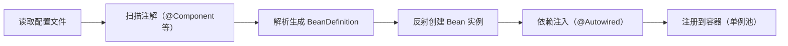

# SSM 整合笔面试题集

> 题目来源：常见国企/互联网笔面试真题归纳
> 难度标注：★基础 ★★中档 ★★★拔高

## 一、选择题（15 题，附解析）



> 上图展示了 Spring IoC 容器初始化的核心流程：从读取配置开始，经过注解扫描、Bean 定义解析、实例创建、依赖注入，最终将 Bean 注册到单例池中。理解这一流程是掌握 Spring IoC 原理的基础。

1. ★ 以下哪个不是 Spring 框架的核心特性？
   A. IoC 控制反转
   B. AOP 面向切面编程
   C. ORM 对象关系映射
   D. 依赖注入
   **答案：C**
   **解析：** Spring 核心特性包括 IoC/DI 和 AOP。ORM 是 Hibernate、MyBatis 等框架的特性，Spring 只是提供集成支持。

2. ★★ SSM 整合中，ContextLoaderListener 创建的容器管理哪些 Bean？
   A. 只管理 Controller
   B. 只管理 Service
   C. Service、DAO、事务管理器
   D. Controller、Service、DAO
   **答案：C**
   **解析：** ContextLoaderListener 创建根容器，管理 Service、DAO、事务管理器、数据源等非 Web 层 Bean。Controller 由 DispatcherServlet 创建的子容器管理。

3. ★★ 以下关于父子容器关系说法正确的是？
   A. 父容器可以访问子容器中的 Bean
   B. 子容器可以访问父容器中的 Bean
   C. 父子容器相互隔离，互不可访问
   D. 父子容器共享同一个 Bean
   **答案：B**
   **解析：** 子容器可以访问父容器中的 Bean（Controller 可以注入 Service），父容器不能访问子容器中的 Bean（Service 不能注入 Controller）。

4. ★★ `@Transactional` 注解应该放在哪一层？
   A. Controller 层
   B. Service 层
   C. DAO 层
   D. 任意层都可以
   **答案：B**
   **解析：** `@Transactional` 应当放在 Service 层。SSM 整合中 Controller 由子容器管理，事务代理在父容器生效，若放在 Controller 层可能导致事务失效。

5. ★ Spring 整合 MyBatis 时，创建 SqlSessionFactory 的类是？
   A. SqlSessionFactory
   B. SqlSessionFactoryBuilder
   C. SqlSessionFactoryBean
   D. SqlSessionTemplate
   **答案：C**
   **解析：** `SqlSessionFactoryBean` 是 Spring 整合 MyBatis 的核心工厂类，实现 `FactoryBean` 接口，用于创建 `SqlSessionFactory`。`SqlSessionFactoryBuilder` 是 MyBatis 原生 API。

6. ★★ 以下哪个注解用于自动扫描 MyBatis Mapper 接口？
   A. @ComponentScan
   B. @MapperScan
   C. @ServiceScan
   D. @RepositoryScan
   **答案：B**
   **解析：** `@MapperScan` 注解用于指定 MyBatis Mapper 接口的扫描包路径，内部通过 `MapperScannerConfigurer` 实现自动扫描和注册。

7. ★★ DispatcherServlet 默认的九大组件不包括？
   A. HandlerMapping
   B. HandlerAdapter
   C. TransactionManager
   D. ViewResolver
   **答案：C**
   **解析：** TransactionManager 是 Spring 事务管理的组件，不属于 DispatcherServlet 九大组件。九大组件包括：HandlerMapping、HandlerAdapter、HandlerExceptionResolver、ViewResolver、View、MultipartResolver、LocaleResolver、ThemeResolver、FlashMapManager。

8. ★★ Filter 和 Interceptor 的执行顺序是？
   A. Interceptor 先于 Filter
   B. Filter 先于 Interceptor
   C. 同时执行
   D. 随机执行
   **答案：B**
   **解析：** Filter 是 Servlet 规范组件，在请求进入 Servlet 前执行。Interceptor 是 SpringMVC 组件，在 Controller 方法前后执行。执行顺序：Filter → DispatcherServlet → Interceptor preHandle → Controller → Interceptor postHandle → 视图渲染 → Interceptor afterCompletion。

9. ★ 以下关于 `@RestController` 说法正确的是？
   A. 等价于 @Controller
   B. 等价于 @Controller + @ResponseBody
   C. 等价于 @Service + @Controller
   D. 等价于 @Component
   **答案：B**
   **解析：** `@RestController` = `@Controller` + `@ResponseBody`，所有方法返回值自动序列化为 JSON/XML 写入响应体。

10. ★★ SSM 整合中，事务不生效的常见原因不包括？
    A. 没有配置 @EnableTransactionManagement
    B. @Transactional 放在 Controller 层
    C. DataSource 配置了连接池
    D. 父子容器包扫描未隔离
    **答案：C**
    **解析：** DataSource 配置连接池是正常配置，不会导致事务失效。事务失效原因：未开启 @EnableTransactionManagement、@Transactional 放在 Controller 层、包扫描未隔离导致 Controller 被父容器扫描、方法非 public、异常被 catch 等。

11. ★★ `@RequestParam` 和 `@PathVariable` 的区别是？
    A. 没有区别，功能相同
    B. @RequestParam 获取 URL 查询参数，@PathVariable 获取 URL 路径变量
    C. @RequestParam 获取请求体，@PathVariable 获取查询参数
    D. @RequestParam 获取路径变量，@PathVariable 获取查询参数
    **答案：B**
    **解析：** `@RequestParam` 用于获取 URL 查询参数（如 ?page=1）和表单字段；`@PathVariable` 用于获取 RESTful URL 路径中的变量（如 /users/{id} 中的 id）。

12. ★★ 以下关于 MyBatis Mapper 接口描述错误的是？
    A. Mapper 接口不需要实现类
    B. Mapper 接口方法名必须与 XML 中的 id 一致
    C. Mapper 接口可以使用注解代替 XML 配置
    D. Mapper 接口必须继承 BaseMapper
    **答案：D**
    **解析：** MyBatis 原生 Mapper 接口不需要继承任何类。继承 BaseMapper 是 MyBatis-Plus 的特性，不是 MyBatis 原生的要求。

13. ★★ SpringMVC 拦截器的 `preHandle` 方法返回 false 时会发生什么？
    A. 继续执行 Controller 方法
    B. 中断请求，后续拦截器和 Controller 都不执行
    C. 只中断当前拦截器，其他拦截器继续执行
    D. 抛出异常
    **答案：B**
    **解析：** `preHandle` 返回 false 会中断请求处理链，后续的拦截器 preHandle、Controller 方法、所有拦截器的 postHandle 都不会执行，但已执行过的拦截器的 afterCompletion 仍会执行。

14. ★★ 关于 `@RequestBody` 注解，以下说法正确的是？
    A. 一个方法可以有多个 @RequestBody 参数
    B. @RequestBody 用于接收 URL 查询参数
    C. @RequestBody 通过 HttpMessageConverter 反序列化请求体
    D. @RequestBody 可以设置默认值
    **答案：C**
    **解析：** `@RequestBody` 通过 HttpMessageConverter 将请求体反序列化为 Java 对象。一个方法只能有一个 @RequestBody 参数（请求体只能读取一次），不支持设置默认值，用于接收 JSON/XML 请求体而非查询参数。

15. ★★★ SSM 整合中，如果 Controller 被父容器扫描到，会导致什么问题？
    A. 应用启动失败
    B. Controller 中的 @Transactional 注解失效
    C. Mapper 注入失败
    D. 视图解析失败
    **答案：B**
    **解析：** 如果 Controller 被父容器扫描到，Controller 实例在父容器中创建，子容器中也有 Controller 的定义。但事务代理（`@Transactional`）在父容器中可能不生效，因为 Controller 通常不应该承载事务逻辑。更严重的是，父容器中 Controller 的 AOP 事务代理链可能不完整，导致事务失效。

---

## 二、简答题（10 题，附要点）

### 1. ★★ SSM 整合中，SpringMVC 和 Spring 容器是什么关系？为什么要分开？

**要点：** 父子容器关系。Spring 容器（父容器）由 ContextLoaderListener 创建，管理 Service、DAO、事务等。SpringMVC 容器（子容器）由 DispatcherServlet 创建，管理 Controller、视图解析等。分开的原因：隔离 Web 层和非 Web 层，子容器可以访问父容器 Bean，避免 Controller 被父容器扫描导致事务失效。

> **生活化类比：父子容器就像集团总部与子公司** —— 父容器相当于集团总部（管财务、法务、HR 等公共职能即 Service/DAO/事务），子容器相当于子公司 SpringMVC（管市场部即 Controller）。子公司的市场部可以调用总部的财务部（Controller 注入 Service），但总部财务部不能反过来指挥子公司市场部（父不能注入子的 Bean）。包扫描隔离就是明确"谁归总部管、谁归子公司管"——避免市场部员工被总部错误地纳入编制（Controller 被父容器扫描），导致子公司这边没找到这个员工，所有"子公司专属福利"（AOP 事务代理）都没给到。

> 📖 **参考链接**：
> - [Spring Framework - Context Hierarchy](https://docs.spring.io/spring-framework/reference/core/beans/context-introduction.html#context-functionality-hierarchy) -- 父子容器层次
> - [Spring Framework - WebApplicationContext](https://docs.spring.io/spring-framework/reference/web/webmvc/mvc-servlet/context.html) -- WebApplicationContext 介绍

### 2. ★★ 描述 SSM 整合中 SqlSessionFactoryBean 的作用和配置方式？

**要点：** SqlSessionFactoryBean 是 Spring 整合 MyBatis 的 FactoryBean，用于创建 SqlSessionFactory。配置方式：设置 dataSource（数据源）、mapperLocations（Mapper XML 路径）、typeAliasesPackage（实体类别名）、configLocation（MyBatis 全局配置）、plugins（插件）。`@Bean` 方法声明后 Spring 容器启动时调用 getObject() 获取 SqlSessionFactory 实例。

> 📖 **参考链接**：
> - [MyBatis-Spring - SqlSessionFactoryBean](https://mybatis.org/spring/zh_CN/factorybean.html) -- SqlSessionFactoryBean 文档
> - [MyBatis - 配置 XML](https://mybatis.org/mybatis-3/zh_CN/configuration.html) -- MyBatis 全局配置

### 3. ★★ 如何配置 Mapper 接口的自动扫描？

**要点：** 两种方式：① 使用 `@MapperScan("com.example.mapper")` 注解在配置类上，指定 Mapper 接口包路径。② 使用 `MapperScannerConfigurer` Bean，设置 basePackage 属性。原理是扫描指定包下接口，为每个接口创建 MapperFactoryBean 的 BeanDefinition，最终通过 SqlSession.getMapper() 生成代理对象。

> 📖 **参考链接**：
> - [MyBatis-Spring - MapperScannerConfigurer](https://mybatis.org/spring/zh_CN/mappers.html) -- MapperScannerConfigurer 文档
> - [MyBatis - Mapper XML 详解](https://mybatis.org/mybatis-3/zh_CN/sqlmap-xml.html) -- Mapper XML 文件

### 4. ★★ SSM 整合中事务不生效的常见原因有哪些？

**要点：** ① 忘记配置 `@EnableTransactionManagement` 或 `<tx:annotation-driven/>`；② `@Transactional` 放在 Controller 层而非 Service 层；③ 父子容器包扫描未隔离，Controller 被父容器扫描导致事务代理失效；④ 方法非 public；⑤ 异常被 catch 未抛出；⑥ 同类方法内部调用不走代理。

> **生活化类比：Spring 事务就像银行转账** —— @Transactional 就像"银行转账的一揽子保证"：从账户 A 扣钱和向账户 B 加钱这两步必须"要么都成功、要么都回滚"，不能出现"钱从 A 扣了但没到 B"的情况。事务失效的几种常见情况可以这么理解：① 没开 @EnableTransactionManagement 相当于"银行没启用转账协议"；② @Transactional 在 Controller 层相当于"客户经理口头承诺"而不是银行系统承诺；③ 包扫描未隔离相当于"两个柜员都开了同一个账户"导致账目混乱；④ 方法非 public 相当于"账目没公开，银行系统看不见"；⑤ 异常被吞相当于"柜员发现错误但不上报系统"；⑥ 同类调用相当于"自己跟自己转账，不走银行系统"——系统根本感知不到。

> 📖 **参考链接**：
> - [Spring Framework - Transaction Management](https://docs.spring.io/spring-framework/reference/data-access/transaction.html) -- Spring 事务管理
> - [Spring Framework - Declarative Transactions](https://docs.spring.io/spring-framework/reference/data-access/transaction/declarative.html) -- 声明式事务

### 5. ★★ DispatcherServlet 的九大组件是什么？核心组件有哪些？

**要点：** 九大组件：HandlerMapping、HandlerAdapter、HandlerExceptionResolver、ViewResolver、View、MultipartResolver、LocaleResolver、ThemeResolver、FlashMapManager。核心组件是 HandlerMapping（查找处理器）、HandlerAdapter（执行处理器）、ViewResolver（解析视图）。

> 📖 **参考链接**：
> - [Spring Framework - DispatcherServlet Special Bean Types](https://docs.spring.io/spring-framework/reference/web/webmvc/mvc-servlet/special-bean-types.html) -- 九大组件详解
> - [Spring Framework - DispatcherServlet Sequence](https://docs.spring.io/spring-framework/reference/web/webmvc/mvc-servlet/sequence.html) -- 请求处理流程

### 6. ★★ Filter 和 Interceptor 有什么区别？执行顺序是什么？

**要点：** Filter 是 Servlet 规范，由 Servlet 容器管理，拦截所有请求，在请求进入 Servlet 前后执行，不能直接注入 Spring Bean。Interceptor 是 Spring 框架特有，由 Spring 容器管理，只拦截 Controller 请求，在 Controller 方法前后和视图渲染后执行，可直接注入 Bean。执行顺序：Filter → DispatcherServlet → Interceptor preHandle → Controller → Interceptor postHandle → 视图渲染 → Interceptor afterCompletion。

> 📖 **参考链接**：
> - [Servlet Specification - Filters](https://github.com/jakartaee/servlet-spec/wiki/Filters) -- Servlet Filter 规范
> - [Spring Framework - HandlerInterceptor](https://docs.spring.io/spring-framework/reference/web/webmvc/mvc-servlet/handlerinterceptor.html) -- HandlerInterceptor 文档

### 7. ★★ 如何实现全局异常处理？

**要点：** 使用 `@RestControllerAdvice`（或 `@ControllerAdvice`）配合 `@ExceptionHandler` 注解。`@ExceptionHandler` 指定处理的异常类型，可以区分业务异常、参数校验异常、系统异常分别处理。方法返回统一格式的 Result 响应。`@RestControllerAdvice` = `@ControllerAdvice` + `@ResponseBody`，返回值自动序列化为 JSON。

> 📖 **参考链接**：
> - [Spring Framework - Controller Advice](https://docs.spring.io/spring-framework/reference/web/webmvc/mvc-ann-controller-advice.html) -- @ControllerAdvice 文档
> - [Spring Framework - REST Exceptions](https://docs.spring.io/spring-framework/reference/web/webmvc/mvc-ann-rest-exceptions.html) -- REST 异常处理

### 8. ★★ @RequestParam 和 @RequestBody 的区别？

**要点：** `@RequestParam` 用于获取 URL 查询参数和表单字段，支持默认值、必填校验，一个方法可以有多个。`@RequestBody` 用于获取 JSON/XML 请求体，通过 HttpMessageConverter 反序列化，不支持默认值，一个方法只能有一个（请求体只能读取一次），Content-Type 必须为 application/json。

> 📖 **参考链接**：
> - [Spring Framework - @RequestParam](https://docs.spring.io/spring-framework/reference/web/webmvc/mvc-controller/ann-requestparam.html) -- @RequestParam 用法
> - [Spring Framework - @RequestBody](https://docs.spring.io/spring-framework/reference/web/webmvc/mvc-controller/ann-requestbody.html) -- @RequestBody 用法

### 9. ★★ SSM 整合中 DAO 注入失败的排查思路？

**要点：** ① 检查 `@MapperScan` 注解是否配置且 basePackage 路径正确；② 检查 Mapper 接口是否在指定包下；③ 检查 DataSource 配置是否正确，数据库连接是否可用；④ 检查 Mapper XML 文件路径是否匹配 mapperLocations 配置；⑤ 检查 Mapper 接口是否被父子容器重复扫描。

> 📖 **参考链接**：
> - [MyBatis-Spring - MapperScannerConfigurer](https://mybatis.org/spring/zh_CN/mappers.html) -- Mapper 扫描配置
> - [MyBatis - Mapper XML 详解](https://mybatis.org/mybatis-3/zh_CN/sqlmap-xml.html) -- Mapper XML 文件

### 10. ★★ SSM 整合中为什么需要包扫描隔离？如何配置？

**要点：** 包扫描隔离的目的是避免 Controller 被父容器扫描，导致事务代理失效或 Bean 重复创建。父容器扫描 Service/DAO 等非 Web 层 Bean，配置 `excludeFilters` 排除 @Controller 注解。子容器只扫描 Controller，配置 `includeFilters` 只包含 @Controller 注解。使用 `use-default-filters="false"` 关闭默认过滤。

> 📖 **参考链接**：
> - [Spring Framework - Component Scan](https://docs.spring.io/spring-framework/reference/core/beans/classpath-scanning.html) -- 包扫描机制
> - [Spring Framework - Filters](https://docs.spring.io/spring-framework/reference/core/beans/classpath-scanning.html#beans-scanning-filters) -- excludeFilters 与 includeFilters

---

## 三、场景设计题（3 题）

### 1. ★★★ 事务失效排查场景

**题目**：某 SSM 项目中，订单创建接口 `createOrder()` 方法上标注了 `@Transactional`，但在库存扣减失败时，订单仍然被创建了，事务没有回滚。请分析可能的原因，并给出排查步骤和解决方案。

**参考答案**：

**可能原因分析**：

1. **配置原因**：未开启 `@EnableTransactionManagement`，事务代理未生效。
2. **注解位置原因**：`@Transactional` 放在 Controller 层，Controller 被父容器扫描导致事务代理失效。
3. **异常原因**：`rollbackFor` 未配置，默认只回滚 RuntimeException，库存扣减抛出的异常是 checked exception。
4. **代理原因**：同类方法内部调用 `this.createOrder()` 不走代理对象。
5. **方法可见性**：方法非 public，AOP 不拦截。
6. **异常被吞**：方法内部 try-catch 捕获异常但未重新抛出。

**排查步骤**：

```
1. 检查 Spring 配置类是否标注了 @EnableTransactionManagement
2. 检查 @Transactional 注解是否在 Service 层方法上
3. 检查 Controller 是否被父容器扫描到（查看父容器 @ComponentScan 的 excludeFilters）
4. 检查方法是否为 public
5. 检查异常是否被 catch 后重新抛出
6. 检查 rollbackFor 配置是否覆盖了可能抛出的异常类型
7. 开启事务日志：logging.level.org.springframework.transaction=DEBUG
```

**解决方案**：

```java
// 1. 确保事务开启
@Configuration
@EnableTransactionManagement
public class SpringConfig { }

// 2. 确保注解在 Service 层
@Service
public class OrderService {
    @Transactional(rollbackFor = Exception.class) // 所有异常都回滚
    public void createOrder(OrderDTO dto) {
        inventoryService.deduct(dto.getSkuId(), dto.getQuantity());
        orderMapper.insert(dto);
    }
}

// 3. 父容器排除 Controller 扫描
@ComponentScan(basePackages = "com.example",
    excludeFilters = @ComponentScan.Filter(Controller.class))
```

---

### 2. ★★★ 整合配置问题排查场景

**题目**：新入职的同事搭建了一个 SSM 项目，启动时报错 `NoSuchBeanDefinitionException: No qualifying bean of type 'com.example.mapper.UserMapper' available`。请分析可能的原因，并给出完整的排查方案。

**参考答案**：

**可能原因分析**：

1. **@MapperScan 未配置**：忘记在配置类上添加 `@MapperScan` 注解。
2. **basePackage 路径错误**：`@MapperScan` 的包路径不包含 UserMapper 接口。
3. **DataSource 未配置**：数据源配置缺失或数据库连接失败，导致 SqlSessionFactoryBean 创建失败。
4. **Mapper XML 路径错误**：mapperLocations 配置的路径与实际文件位置不匹配。
5. **依赖缺失**：mybatis-spring 整合包未引入。
6. **父子容器冲突**：Mapper 被两个容器重复扫描，注入时匹配到错误的容器中的 Bean。

**排查方案**：

```
步骤1：检查 pom.xml 依赖
  确认引入了 mybatis-spring、mybatis、mysql-connector-java、spring-jdbc

步骤2：检查 @MapperScan 配置
  @Configuration
  @MapperScan("com.example.mapper")  // 确认包路径正确
  public class SpringConfig { }

步骤3：检查 DataSource 和 SqlSessionFactoryBean 配置
  @Bean public DataSource dataSource() { ... }
  @Bean public SqlSessionFactoryBean sqlSessionFactory(DataSource ds) { ... }

步骤4：检查 Mapper XML 位置
  factoryBean.setMapperLocations(
      new PathMatchingResourcePatternResolver()
          .getResources("classpath:mapper/*.xml"));

步骤5：检查 Mapper 接口是否在 basePackage 路径下
  com.example.mapper.UserMapper 在 com.example.mapper 包下

步骤6：查看启动日志
  搜索 "MapperScannerConfigurer" 或 "MapperFactoryBean" 相关日志
```

---

### 3. ★★★ 父子容器冲突排查场景

**题目**：某 SSM 项目在开发过程中发现了一个奇怪的问题：在 Service 层方法上标注了 `@Transactional`，但事务总是不生效。经过排查，发现项目使用了 `context:component-scan` 对 `com.example` 包进行了全量扫描，没有做任何过滤。请分析为什么会导致事务失效，并给出正确的配置方案。

**参考答案**：

**问题分析**：

当父容器和子容器都对 `com.example` 包进行全量扫描时，会发生以下问题：

1. **Controller 被父容器扫描**：Controller 实例在父容器中创建，同时子容器也会创建 Controller 实例。两个容器中存在两个 Controller Bean。
2. **事务代理失效**：父容器中的 Controller 的 `@Transactional` 注解理论上可以通过 AOP 生成代理，但 SpringMVC 的子容器是实际处理请求的容器，子容器中的 Controller 实例可能没有经过事务代理。
3. **Bean 重复创建**：Service 和 DAO 也会被两个容器重复创建，导致注入混乱。

**更根本的原因**：即使 Controller 不应该有 `@Transactional`，问题在于相同包被两个容器扫描后，AOP 代理链可能不完整。父容器中有 Service 的代理，但子容器中也可能有 Service 的非代理版本，导致注入时使用了非代理版本。

**正确的配置方案**：

```java
// === 父容器配置（SpringConfig）===
@Configuration
@ComponentScan(
    basePackages = "com.example",
    excludeFilters = @ComponentScan.Filter(
        type = FilterType.ANNOTATION,
        classes = {Controller.class, RestController.class}
    )
)
@EnableTransactionManagement
@MapperScan("com.example.mapper")
public class SpringConfig {
    // 数据源、SqlSessionFactory、事务管理器配置
}

// === 子容器配置（SpringMvcConfig）===
@Configuration
@EnableWebMvc
@ComponentScan(
    basePackages = "com.example.controller"
)
public class SpringMvcConfig implements WebMvcConfigurer {
    // 视图解析器、静态资源、拦截器配置
}

// === Web 初始化配置 ===
public class WebAppInitializer 
    extends AbstractAnnotationConfigDispatcherServletInitializer {
    
    @Override
    protected Class<?>[] getRootConfigClasses() {
        return new Class<?>[]{SpringConfig.class};
    }
    
    @Override
    protected Class<?>[] getServletConfigClasses() {
        return new Class<?>[]{SpringMvcConfig.class};
    }
    
    @Override
    protected String[] getServletMappings() {
        return new String[]{"/"};
    }
}
```

**XML 配置方式**：

```xml
<!-- 父容器：排除 Controller -->
<context:component-scan base-package="com.example">
    <context:exclude-filter type="annotation" 
        expression="org.springframework.stereotype.Controller"/>
    <context:exclude-filter type="annotation" 
        expression="org.springframework.web.bind.annotation.RestController"/>
</context:component-scan>

<!-- 子容器：只扫描 Controller -->
<context:component-scan base-package="com.example.controller" 
    use-default-filters="false">
    <context:include-filter type="annotation" 
        expression="org.springframework.stereotype.Controller"/>
</context:component-scan>
```

**关键原则**：
- 父容器负责 Service、DAO、事务等非 Web 层 Bean
- 子容器只负责 Controller 等 Web 层 Bean
- 两个容器的扫描包路径不能重叠
- `@Transactional` 必须放在 Service 层，Controller 不承载事务

---

## 四、手写代码示例（2 题，完整可运行）

### 1. ★★★ 手写 Spring IoC 容器核心逻辑

**题目**：实现一个简化版的 Spring IoC 容器，包含 BeanFactory、注解扫描（@Component/@Autowired）、依赖注入（字段注入）和单例管理。

**核心实现**：

```java
// ============ 手写Spring IoC容器 - BeanFactory + 注解扫描 + 依赖注入简化版 ============

// 1. 自定义注解
@Retention(RetentionPolicy.RUNTIME)
@Target(ElementType.TYPE)
@interface Component {
    String value() default "";
}

@Retention(RetentionPolicy.RUNTIME)
@Target(ElementType.FIELD)
@interface Autowired {
}

@Retention(RetentionPolicy.RUNTIME)
@Target(ElementType.TYPE)
@interface Scope {
    String value() default "singleton";
}

// 2. Bean定义（存储Bean元信息）
class BeanDefinition {
    private String beanName;
    private Class<?> beanClass;
    private String scope = "singleton";

    public BeanDefinition() {}
    public BeanDefinition(String beanName, Class<?> beanClass) {
        this.beanName = beanName;
        this.beanClass = beanClass;
    }
    public String getBeanName() { return beanName; }
    public void setBeanName(String beanName) { this.beanName = beanName; }
    public Class<?> getBeanClass() { return beanClass; }
    public void setBeanClass(Class<?> beanClass) { this.beanClass = beanClass; }
    public String getScope() { return scope; }
    public void setScope(String scope) { this.scope = scope; }
}

// 3. 核心容器（BeanFactory + 注解扫描 + 依赖注入）
public class SimpleApplicationContext {
    // 存储所有Bean定义
    private final Map<String, BeanDefinition> beanDefinitionMap = new ConcurrentHashMap<>();
    // 单例池（一级缓存）
    private final Map<String, Object> singletonObjects = new ConcurrentHashMap<>();

    /**
     * 构造方法：扫描指定包路径，注册Bean定义，实例化单例
     */
    public SimpleApplicationContext(String... basePackages) throws Exception {
        for (String basePackage : basePackages) {
            scanPackage(basePackage);
        }
        instantiateSingletons();
    }

    // ===== 包扫描 =====
    private void scanPackage(String basePackage) throws Exception {
        // 将包名转换为路径
        String path = basePackage.replace('.', '/');
        ClassLoader classLoader = Thread.currentThread().getContextClassLoader();
        Enumeration<URL> resources = classLoader.getResources(path);

        while (resources.hasMoreElements()) {
            URL resource = resources.nextElement();
            File dir = new File(resource.getFile());
            if (!dir.exists()) continue;

            for (File file : dir.listFiles(f -> f.getName().endsWith(".class"))) {
                String className = basePackage + "."
                        + file.getName().replace(".class", "");
                Class<?> clazz = Class.forName(className);

                // 只处理有@Component注解的类
                if (clazz.isAnnotationPresent(Component.class)) {
                    Component comp = clazz.getAnnotation(Component.class);
                    String beanName = comp.value().isEmpty()
                            ? lowerFirst(clazz.getSimpleName())
                            : comp.value();

                    BeanDefinition bd = new BeanDefinition(beanName, clazz);

                    // 处理@Scope注解
                    if (clazz.isAnnotationPresent(Scope.class)) {
                        bd.setScope(clazz.getAnnotation(Scope.class).value());
                    }

                    beanDefinitionMap.put(beanName, bd);
                    System.out.println("[IoC] 扫描到Bean: " + beanName + " -> " + clazz.getSimpleName());
                }
            }
        }
    }

    // ===== 实例化所有单例Bean =====
    private void instantiateSingletons() throws Exception {
        for (String beanName : beanDefinitionMap.keySet()) {
            BeanDefinition bd = beanDefinitionMap.get(beanName);
            if ("singleton".equals(bd.getScope())) {
                getBean(beanName);  // 提前实例化
            }
        }
    }

    // ===== 获取Bean（核心方法，模拟getBean流程）=====
    @SuppressWarnings("unchecked")
    public <T> T getBean(String name) throws Exception {
        BeanDefinition bd = beanDefinitionMap.get(name);
        if (bd == null) {
            throw new RuntimeException("Bean不存在: " + name);
        }

        // 单例：从缓存获取
        if ("singleton".equals(bd.getScope())) {
            Object bean = singletonObjects.get(name);
            if (bean != null) {
                return (T) bean;
            }
        }

        // 创建Bean实例（调用无参构造器）
        T instance = (T) bd.getBeanClass().getDeclaredConstructor().newInstance();

        // 依赖注入：扫描所有字段，对有@Autowired注解的字段自动注入
        for (Field field : bd.getBeanClass().getDeclaredFields()) {
            if (field.isAnnotationPresent(Autowired.class)) {
                field.setAccessible(true);
                Object dependency = getBean(field.getType());
                field.set(instance, dependency);
            }
        }

        // 单例放入缓存
        if ("singleton".equals(bd.getScope())) {
            singletonObjects.put(name, instance);
        }
        return instance;
    }

    // 根据类型获取Bean
    public <T> T getBean(Class<T> clazz) throws Exception {
        // 优先按类型名查找，找不到再遍历所有Bean定义匹配类型
        String beanName = lowerFirst(clazz.getSimpleName());
        if (beanDefinitionMap.containsKey(beanName)) {
            return getBean(beanName);
        }
        // 遍历查找匹配类型
        for (BeanDefinition bd : beanDefinitionMap.values()) {
            if (clazz.isAssignableFrom(bd.getBeanClass())) {
                return getBean(bd.getBeanName());
            }
        }
        throw new RuntimeException("未找到类型为 " + clazz.getName() + " 的Bean");
    }

    // 工具方法：首字母小写
    private String lowerFirst(String str) {
        if (str == null || str.isEmpty()) return str;
        char[] chars = str.toCharArray();
        chars[0] = Character.toLowerCase(chars[0]);
        return new String(chars);
    }

    // ===== 测试用例 =====
    public static void main(String[] args) throws Exception {
        SimpleApplicationContext ctx = new SimpleApplicationContext("com.example");

        // 获取Bean并调用方法
        UserService userService = ctx.getBean(UserService.class);
        userService.sayHello();
        // 输出：
        // [IoC] 扫描到Bean: userService -> UserService
        // [IoC] 扫描到Bean: orderService -> OrderService
        // UserService.hello
        // OrderService.hello
    }
}

// ===== 测试用Bean =====
@Component
class UserService {
    @Autowired
    private OrderService orderService;

    public void sayHello() {
        System.out.println("UserService.hello");
        orderService.sayHello();
    }
}

@Component
class OrderService {
    public void sayHello() {
        System.out.println("OrderService.hello");
    }
}
```

**核心流程总结**：

```
1. 扫描包路径 → 找到所有@Component注解的类
2. 解析注解 → 生成BeanDefinition（beanName、beanClass、scope）
3. 实例化单例 → 对scope=singleton的Bean提前调用getBean()
4. getBean()流程：
   a. 查BeanDefinition
   b. 单例查缓存（singletonObjects）
   c. 反射创建实例（无参构造器）
   d. 依赖注入（扫描@Autowired字段，递归getBean）
   e. 放入单例缓存
```

### 2. ★★★ 手写 SpringMVC 核心流程（DispatcherServlet 简化版）

**题目**：实现一个简化版的 SpringMVC DispatcherServlet，包含 HandlerMapping 映射、参数绑定、返回值处理（JSON/视图）。

**核心实现**：

```java
// ============ 手写SpringMVC核心流程 - DispatcherServlet简化版 ============

// 1. 自定义注解
@Retention(RetentionPolicy.RUNTIME)
@Target(ElementType.TYPE)
@interface Controller {
}

@Retention(RetentionPolicy.RUNTIME)
@Target(ElementType.METHOD)
@interface RequestMapping {
    String value();
}

@Retention(RetentionPolicy.RUNTIME)
@Target(ElementType.PARAMETER)
@interface RequestParam {
    String value();
}

// 2. 处理器映射信息
class HandlerInfo {
    private String url;           // 映射URL
    private Object controller;    // Controller实例
    private Method method;        // 处理方法
    private String[] paramNames;  // 参数名数组

    // getter/setter...
    public String getUrl() { return url; }
    public void setUrl(String url) { this.url = url; }
    public Object getController() { return controller; }
    public void setController(Object controller) { this.controller = controller; }
    public Method getMethod() { return method; }
    public void setMethod(Method method) { this.method = method; }
    public String[] getParamNames() { return paramNames; }
    public void setParamNames(String[] paramNames) { this.paramNames = paramNames; }
}

// 3. ModelAndView
class ModelAndView {
    private String viewName;
    private Map<String, Object> model = new HashMap<>();

    public ModelAndView() {}
    public ModelAndView(String viewName) { this.viewName = viewName; }

    public String getViewName() { return viewName; }
    public void setViewName(String viewName) { this.viewName = viewName; }
    public Map<String, Object> getModel() { return model; }
    public void addObject(String key, Object value) { model.put(key, value); }
}

// 4. 核心DispatcherServlet（简化版）
public class SimpleDispatcherServlet extends HttpServlet {
    // URL -> Handler 映射表
    private final Map<String, HandlerInfo> handlerMap = new HashMap<>();
    private final ObjectMapper objectMapper = new ObjectMapper();

    /**
     * 初始化：扫描Controller包，构建Handler映射
     */
    public SimpleDispatcherServlet(String basePackage) throws Exception {
        initHandlerMappings(basePackage);
    }

    private void initHandlerMappings(String basePackage) throws Exception {
        String path = basePackage.replace('.', '/');
        ClassLoader classLoader = Thread.currentThread().getContextClassLoader();
        Enumeration<URL> resources = classLoader.getResources(path);

        while (resources.hasMoreElements()) {
            File dir = new File(resources.nextElement().getFile());
            File[] classFiles = dir.listFiles(f -> f.getName().endsWith(".class"));
            if (classFiles == null) continue;

            for (File file : classFiles) {
                String className = basePackage + "."
                        + file.getName().replace(".class", "");
                Class<?> clazz = Class.forName(className);

                // 只处理@Controller注解的类
                if (clazz.isAnnotationPresent(Controller.class)) {
                    Object controller = clazz.getDeclaredConstructor().newInstance();

                    // 遍历所有方法，处理@RequestMapping
                    for (Method method : clazz.getDeclaredMethods()) {
                        if (method.isAnnotationPresent(RequestMapping.class)) {
                            RequestMapping rm = method.getAnnotation(RequestMapping.class);

                            HandlerInfo handler = new HandlerInfo();
                            handler.setUrl(rm.value());
                            handler.setController(controller);
                            handler.setMethod(method);

                            // 解析参数名
                            Parameter[] params = method.getParameters();
                            String[] paramNames = new String[params.length];
                            for (int i = 0; i < params.length; i++) {
                                RequestParam rp = params[i].getAnnotation(RequestParam.class);
                                paramNames[i] = rp != null ? rp.value() : params[i].getName();
                            }
                            handler.setParamNames(paramNames);

                            handlerMap.put(rm.value(), handler);
                            System.out.println("[MVC] 映射: " + rm.value()
                                    + " -> " + clazz.getSimpleName() + "." + method.getName());
                        }
                    }
                }
            }
        }
    }

    // ===== 核心分发方法（模拟DispatcherServlet.doDispatch）=====
    @Override
    protected void service(HttpServletRequest req, HttpServletResponse resp)
            throws ServletException, IOException {
        // 1. 获取请求路径
        String uri = req.getRequestURI();
        String contextPath = req.getContextPath();
        String path = uri.substring(contextPath.length());

        // 2. 查找Handler（对应HandlerMapping.getHandler）
        HandlerInfo handler = handlerMap.get(path);
        if (handler == null) {
            resp.sendError(HttpServletResponse.SC_NOT_FOUND,
                    "No handler found for: " + path);
            return;
        }

        try {
            // 3. 参数绑定（对应HandlerAdapter.handle）
            Object[] args = resolveParameters(req, handler);

            // 4. 反射调用Handler方法
            Object result = handler.getMethod().invoke(handler.getController(), args);

            // 5. 处理返回值（对应ViewResolver + 消息转换器）
            handleResult(result, req, resp);

        } catch (Exception e) {
            resp.sendError(HttpServletResponse.SC_INTERNAL_SERVER_ERROR,
                    "Internal error: " + e.getMessage());
            e.printStackTrace();
        }
    }

    // ===== 参数解析（模拟HandlerMethodArgumentResolver）=====
    private Object[] resolveParameters(HttpServletRequest req, HandlerInfo handler) {
        String[] paramNames = handler.getParamNames();
        Class<?>[] paramTypes = handler.getMethod().getParameterTypes();
        Object[] args = new Object[paramTypes.length];

        for (int i = 0; i < paramTypes.length; i++) {
            String paramValue = req.getParameter(paramNames[i]);
            if (paramTypes[i] == String.class) {
                args[i] = paramValue;
            } else if (paramTypes[i] == Integer.class || paramTypes[i] == int.class) {
                args[i] = (paramValue != null && !paramValue.isEmpty())
                        ? Integer.parseInt(paramValue) : 0;
            } else if (paramTypes[i] == Long.class || paramTypes[i] == long.class) {
                args[i] = (paramValue != null && !paramValue.isEmpty())
                        ? Long.parseLong(paramValue) : 0L;
            } else if (paramTypes[i] == Boolean.class || paramTypes[i] == boolean.class) {
                args[i] = Boolean.parseBoolean(paramValue);
            }
        }
        return args;
    }

    // ===== 返回值处理 =====
    private void handleResult(Object result, HttpServletRequest req,
                              HttpServletResponse resp) throws Exception {
        if (result == null) {
            return;
        }

        if (result instanceof ModelAndView) {
            // 视图转发（模拟ViewResolver）
            ModelAndView mv = (ModelAndView) result;
            for (Map.Entry<String, Object> entry : mv.getModel().entrySet()) {
                req.setAttribute(entry.getKey(), entry.getValue());
            }
            req.getRequestDispatcher(mv.getViewName()).forward(req, resp);

        } else if (result instanceof String) {
            String str = (String) result;
            if (str.startsWith("redirect:")) {
                resp.sendRedirect(str.substring(9));
            } else if (str.startsWith("forward:")) {
                req.getRequestDispatcher(str.substring(8)).forward(req, resp);
            } else {
                // 纯文本响应
                resp.setContentType("text/plain;charset=UTF-8");
                resp.getWriter().write(str);
            }

        } else {
            // JSON响应（模拟HttpMessageConverter，如MappingJackson2HttpMessageConverter）
            resp.setContentType("application/json;charset=UTF-8");
            resp.getWriter().write(objectMapper.writeValueAsString(result));
        }
    }
}

// ===== 测试Controller =====
@Controller
class UserController {

    @RequestMapping("/user/hello")
    public String hello(@RequestParam("name") String name) {
        return "Hello, " + name + "!";
    }

    @RequestMapping("/user/info")
    public Map<String, Object> info(@RequestParam("id") Integer id) {
        Map<String, Object> result = new HashMap<>();
        result.put("id", id);
        result.put("name", "test-user");
        result.put("email", "test@example.com");
        return result;  // 自动序列化为JSON
    }

    @RequestMapping("/user/detail")
    public ModelAndView detail(@RequestParam("id") Integer id) {
        ModelAndView mv = new ModelAndView("/WEB-INF/views/user_detail.jsp");
        mv.addObject("userId", id);
        mv.addObject("userName", "test-user");
        return mv;  // 转发到JSP视图
    }
}

// ===== 启动类（嵌入式Tomcat测试）=====
public class Application {
    public static void main(String[] args) throws Exception {
        // 创建DispatcherServlet
        SimpleDispatcherServlet dispatcherServlet =
                new SimpleDispatcherServlet("com.example");

        // 启动嵌入式Tomcat
        // 实际项目中通过web.xml或ServletContainerInitializer注册
        System.out.println("SimpleMVC started. Handlers:");
        // 输出所有映射的URL
    }
}
```

**核心流程总结（对比真实SpringMVC）**：

| 步骤 | 简化版实现 | 真实SpringMVC |
|------|-----------|--------------|
| 1. 请求到达 | `service()` 方法 | `DispatcherServlet.doDispatch()` |
| 2. 查找Handler | `handlerMap.get(path)` | `HandlerMapping.getHandler()` |
| 3. 获取HandlerAdapter | 直接反射调用 | `HandlerAdapter.handle()` |
| 4. 参数解析 | `resolveParameters()` | `HandlerMethodArgumentResolver` |
| 5. 调用方法 | `method.invoke()` | `ServletInvocableHandlerMethod` |
| 6. 处理返回值 | `handleResult()` | `HandlerMethodReturnValueHandler` + `ViewResolver` + `HttpMessageConverter` |

> **学习导航**：
> - 返回 [02-javaweb-monolith 模块](../../README.md)
> - 上一篇：[03-MyBatis整合与配置](./03-MyBatis整合与配置.md)
> - 本模块其他文件：[01-Spring核心与IoC原理](./01-Spring核心与IoC原理.md) | [02-SpringMVC执行流程](./02-SpringMVC执行流程.md)