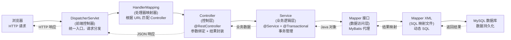

# SSM - 综合场景串联

---

## 场景一：从零搭建 SSM 项目实现 CRUD

### 场景描述
从零搭建一个基于 Spring + Spring MVC + MyBatis 的 SSM 项目，实现用户管理模块的完整 CRUD 功能，包含包扫描隔离、父子容器配置、声明式事务和 RESTful 接口设计。

### 涉及知识点
- [Spring IoC 与 DI](01-Spring核心与IoC原理-导览.md)：Bean 生命周期、依赖注入方式、构造器注入
- [Spring AOP 与事务](01-Spring核心与IoC原理-导览.md)：声明式事务、事务传播行为、事务隔离级别
- [Spring MVC 执行流程](02-SpringMVC执行流程-导览.md)：DispatcherServlet、请求映射、参数绑定、RESTful 接口
- [SSM 整合配置](03-MyBatis整合与配置-导览.md)：父子容器、包扫描隔离、SqlSessionFactory、MapperScannerConfigurer
- [MyBatis 配置](03-MyBatis整合与配置-导览.md)：Mapper XML、动态 SQL、参数映射

### 协作流程

**第一步：创建项目结构与依赖**

创建 Maven Web 项目，在 pom.xml 中引入 spring-context、spring-webmvc、spring-jdbc、mybatis、mybatis-spring、mysql-connector-java、druid 等依赖。使用 dependencyManagement 统一管理版本。

**第二步：配置 web.xml 与父子容器**

配置 ContextLoaderListener 作为父容器加载器，contextConfigLocation 指向 Spring 核心配置文件（service、dao 层 Bean）。配置 DispatcherServlet 作为子容器，contextConfigLocation 指向 Spring MVC 配置文件（controller 层 Bean）。父容器负责 Service 和 DAO 的 Bean 管理，子容器负责 Controller 的 Bean 管理。

**第三步：配置 Spring 核心容器（父容器）**

创建 applicationContext.xml，配置数据源（DruidDataSource）、SqlSessionFactoryBean（指定数据源和 Mapper XML 位置）、MapperScannerConfigurer（扫描 Mapper 接口包路径）。配置包扫描（context:component-scan），使用 excludeFilters 排除 @Controller 注解的类，避免 Controller 被父容器扫描。配置声明式事务管理器（DataSourceTransactionManager）和 tx:annotation-driven 开启事务注解。

**第四步：配置 Spring MVC 容器（子容器）**

创建 springmvc-servlet.xml，配置包扫描（context:component-scan），仅扫描 Controller 包。配置 mvc:annotation-driven 启用 MVC 注解驱动。配置 InternalResourceViewResolver 视图解析器。配置 mvc:default-servlet-handler 放行静态资源。配置拦截器注册。

**第五步：编写持久层代码**

创建 User 实体类。编写 UserMapper 接口，定义 CRUD 方法（insert、deleteById、updateById、selectById、selectAll）。编写 UserMapper.xml，配置 namespace 指向 UserMapper 接口，编写对应的 SQL 语句（insert、delete、update、select），使用 resultMap 映射字段与属性。

**第六步：编写业务层代码**

创建 UserService 接口和 UserServiceImpl 实现类。在 Service 实现类上添加 @Service 和 @Transactional 注解。在 Service 方法中注入 UserMapper（使用构造器注入），调用 Mapper 方法完成数据操作。@Transactional 添加 rollbackFor = Exception.class 确保所有异常都触发回滚。

**第七步：编写控制层代码**

创建 UserController 类，添加 @RestController 和 @RequestMapping("/users") 注解。使用构造器注入 UserService。定义 RESTful 接口：GET /users（查询全部）、GET /users/{id}（查询单个）、POST /users（新增）、PUT /users/{id}（更新）、DELETE /users/{id}（删除）。使用 @PathVariable、@RequestBody、@RequestParam 等注解绑定参数。

**第八步：测试与验证**

启动项目，使用 Postman 或浏览器测试各接口。验证 CRUD 操作正常，事务回滚正常（故意抛出异常确认数据未持久化），包扫描隔离正确（Controller 中注入 Service 成功，父容器无 Controller Bean）。

### 关键要点
- 父容器必须排除 Controller 扫描，否则 @Transactional 在 Controller 层会失效
- @MapperScan 的 basePackage 必须指向 Mapper 接口所在包，否则 Mapper 无法注入
- @Transactional 必须放在 Service 层，并添加 rollbackFor = Exception.class
- 构造器注入优先于字段注入，便于发现循环依赖和编写单元测试
- Mapper XML 的 namespace 必须与 Mapper 接口全限定名一致
- 静态资源配置 default-servlet-handler 避免 DispatcherServlet 拦截静态资源



> 上图展示了 SSM 整合项目中一次 HTTP 请求的完整处理链路：浏览器请求经 DispatcherServlet 前端控制器统一接收，通过 HandlerMapping 定位到具体的 Controller，Controller 调用 Service 层处理业务逻辑（含声明式事务），Service 通过 MyBatis Mapper 代理执行 SQL 操作数据库，最终结果逐层返回至浏览器。

### 完整可运行示例代码

以下展示 SSM（Spring + Spring MVC + MyBatis）整合的完整配置，包含 XML 配置和注解两种方式，涵盖用户 CRUD 完整功能。

**步骤一：项目结构总览**

```
ssm-demo/
├── pom.xml
└── src/main/
    ├── java/com/longjiang/
    │   ├── entity/
    │   │   └── User.java                          # 实体类
    │   ├── mapper/
    │   │   └── UserMapper.java                    # Mapper 接口
    │   ├── service/
    │   │   ├── UserService.java                   # Service 接口
    │   │   └── impl/
    │   │       └── UserServiceImpl.java            # Service 实现
    │   └── controller/
    │       └── UserController.java                 # REST 控制器
    ├── resources/
    │   ├── applicationContext.xml                  # Spring 核心配置（父容器）
    │   ├── springmvc-servlet.xml                   # Spring MVC 配置（子容器）
    │   ├── jdbc.properties                         # 数据库连接配置
    │   └── com/longjiang/mapper/
    │       └── UserMapper.xml                      # MyBatis SQL 映射文件
    └── webapp/
        └── WEB-INF/
            └── web.xml                             # Web 部署描述符
```

**步骤二：Maven 依赖（pom.xml）**

```xml
<?xml version="1.0" encoding="UTF-8"?>
<project xmlns="http://maven.apache.org/POM/4.0.0"
         xmlns:xsi="http://www.w3.org/2001/XMLSchema-instance"
         xsi:schemaLocation="http://maven.apache.org/POM/4.0.0
         http://maven.apache.org/xsd/maven-4.0.0.xsd">
    <modelVersion>4.0.0</modelVersion>

    <groupId>com.longjiang</groupId>
    <artifactId>ssm-demo</artifactId>
    <version>1.0.0-SNAPSHOT</version>
    <packaging>war</packaging>

    <properties>
        <project.build.sourceEncoding>UTF-8</project.build.sourceEncoding>
        <maven.compiler.source>8</maven.compiler.source>
        <maven.compiler.target>8</maven.compiler.target>
        <spring.version>5.3.30</spring.version>
        <mybatis.version>3.5.13</mybatis.version>
        <mybatis-spring.version>2.1.0</mybatis-spring.version>
        <mysql.version>8.0.33</mysql.version>
        <druid.version>1.2.20</druid.version>
        <jackson.version>2.15.3</jackson.version>
        <servlet.version>4.0.1</servlet.version>
    </properties>

    <dependencies>
        <!-- Spring 核心 -->
        <dependency>
            <groupId>org.springframework</groupId>
            <artifactId>spring-context</artifactId>
            <version>${spring.version}</version>
        </dependency>
        <dependency>
            <groupId>org.springframework</groupId>
            <artifactId>spring-jdbc</artifactId>
            <version>${spring.version}</version>
        </dependency>

        <!-- Spring MVC -->
        <dependency>
            <groupId>org.springframework</groupId>
            <artifactId>spring-webmvc</artifactId>
            <version>${spring.version}</version>
        </dependency>

        <!-- MyBatis -->
        <dependency>
            <groupId>org.mybatis</groupId>
            <artifactId>mybatis</artifactId>
            <version>${mybatis.version}</version>
        </dependency>
        <dependency>
            <groupId>org.mybatis</groupId>
            <artifactId>mybatis-spring</artifactId>
            <version>${mybatis-spring.version}</version>
        </dependency>

        <!-- MySQL 驱动 -->
        <dependency>
            <groupId>com.mysql</groupId>
            <artifactId>mysql-connector-j</artifactId>
            <version>${mysql.version}</version>
        </dependency>

        <!-- Druid 连接池 -->
        <dependency>
            <groupId>com.alibaba</groupId>
            <artifactId>druid</artifactId>
            <version>${druid.version}</version>
        </dependency>

        <!-- Jackson JSON -->
        <dependency>
            <groupId>com.fasterxml.jackson.core</groupId>
            <artifactId>jackson-databind</artifactId>
            <version>${jackson.version}</version>
        </dependency>

        <!-- Servlet API (provided) -->
        <dependency>
            <groupId>javax.servlet</groupId>
            <artifactId>javax.servlet-api</artifactId>
            <version>${servlet.version}</version>
            <scope>provided</scope>
        </dependency>
    </dependencies>
</project>
```

**步骤三：web.xml -- 父子容器配置**

```xml
<?xml version="1.0" encoding="UTF-8"?>
<web-app xmlns="http://xmlns.jcp.org/xml/ns/javaee"
         xmlns:xsi="http://www.w3.org/2001/XMLSchema-instance"
         xsi:schemaLocation="http://xmlns.jcp.org/xml/ns/javaee
         http://xmlns.jcp.org/xml/ns/javaee/web-app_4_0.xsd"
         version="4.0">

    <display-name>SSM Demo</display-name>

    <!-- ========== 父容器：Spring 核心容器（管理 Service/DAO 层 Bean） ========== -->
    <context-param>
        <param-name>contextConfigLocation</param-name>
        <param-value>classpath:applicationContext.xml</param-value>
    </context-param>

    <!-- ContextLoaderListener 启动父容器 -->
    <listener>
        <listener-class>org.springframework.web.context.ContextLoaderListener</listener-class>
    </listener>

    <!-- ========== 子容器：Spring MVC 容器（管理 Controller 层 Bean） ========== -->
    <servlet>
        <servlet-name>springmvc</servlet-name>
        <servlet-class>org.springframework.web.servlet.DispatcherServlet</servlet-class>
        <init-param>
            <param-name>contextConfigLocation</param-name>
            <param-value>classpath:springmvc-servlet.xml</param-value>
        </init-param>
        <load-on-startup>1</load-on-startup>
    </servlet>
    <servlet-mapping>
        <servlet-name>springmvc</servlet-name>
        <url-pattern>/</url-pattern>
    </servlet-mapping>

    <!-- 编码过滤器 -->
    <filter>
        <filter-name>CharacterEncodingFilter</filter-name>
        <filter-class>org.springframework.web.filter.CharacterEncodingFilter</filter-class>
        <init-param>
            <param-name>encoding</param-name>
            <param-value>UTF-8</param-value>
        </init-param>
        <init-param>
            <param-name>forceEncoding</param-name>
            <param-value>true</param-value>
        </init-param>
    </filter>
    <filter-mapping>
        <filter-name>CharacterEncodingFilter</filter-name>
        <url-pattern>/*</url-pattern>
    </filter-mapping>

</web-app>
```

**步骤四：jdbc.properties -- 数据库连接配置**

```properties
# ========== Druid 数据源配置 ==========
jdbc.driverClassName=com.mysql.cj.jdbc.Driver
jdbc.url=jdbc:mysql://localhost:3306/ssm_demo?useSSL=false&serverTimezone=Asia/Shanghai&characterEncoding=utf8mb4
jdbc.username=root
jdbc.password=your_password

# 连接池配置
jdbc.initialSize=5
jdbc.maxActive=20
jdbc.minIdle=5
jdbc.maxWait=60000
```

**步骤五：applicationContext.xml -- Spring 核心配置（父容器，XML 方式）**

```xml
<?xml version="1.0" encoding="UTF-8"?>
<beans xmlns="http://www.springframework.org/schema/beans"
       xmlns:xsi="http://www.w3.org/2001/XMLSchema-instance"
       xmlns:context="http://www.springframework.org/schema/context"
       xmlns:tx="http://www.springframework.org/schema/tx"
       xsi:schemaLocation="
           http://www.springframework.org/schema/beans
           http://www.springframework.org/schema/beans/spring-beans.xsd
           http://www.springframework.org/schema/context
           http://www.springframework.org/schema/context/spring-context.xsd
           http://www.springframework.org/schema/tx
           http://www.springframework.org/schema/tx/spring-tx.xsd">

    <!-- ========== 1. 加载属性文件 ========== -->
    <context:property-placeholder location="classpath:jdbc.properties"/>

    <!-- ========== 2. 包扫描（排除 @Controller，避免 Controller 被父容器管理） ========== -->
    <context:component-scan base-package="com.longjiang">
        <!-- 排除 Controller 注解 -->
        <context:exclude-filter type="annotation"
            expression="org.springframework.stereotype.Controller"/>
    </context:component-scan>

    <!-- ========== 3. 数据源配置（Druid） ========== -->
    <bean id="dataSource" class="com.alibaba.druid.pool.DruidDataSource"
          init-method="init" destroy-method="close">
        <property name="driverClassName" value="${jdbc.driverClassName}"/>
        <property name="url" value="${jdbc.url}"/>
        <property name="username" value="${jdbc.username}"/>
        <property name="password" value="${jdbc.password}"/>
        <property name="initialSize" value="${jdbc.initialSize}"/>
        <property name="maxActive" value="${jdbc.maxActive}"/>
        <property name="minIdle" value="${jdbc.minIdle}"/>
        <property name="maxWait" value="${jdbc.maxWait}"/>
    </bean>

    <!-- ========== 4. SqlSessionFactory 配置 ========== -->
    <bean id="sqlSessionFactory" class="org.mybatis.spring.SqlSessionFactoryBean">
        <property name="dataSource" ref="dataSource"/>
        <!-- 指定 Mapper XML 文件位置 -->
        <property name="mapperLocations" value="classpath:com/longjiang/mapper/*.xml"/>
        <!-- MyBatis 全局配置 -->
        <property name="configuration">
            <bean class="org.apache.ibatis.session.Configuration">
                <property name="mapUnderscoreToCamelCase" value="true"/>  <!-- 驼峰命名 -->
                <property name="logImpl" value="org.apache.ibatis.logging.stdout.StdOutImpl"/>
            </bean>
        </property>
    </bean>

    <!-- ========== 5. Mapper 接口扫描（替代每个 Mapper 单独配置） ========== -->
    <bean class="org.mybatis.spring.mapper.MapperScannerConfigurer">
        <property name="basePackage" value="com.longjiang.mapper"/>
        <property name="sqlSessionFactoryBeanName" value="sqlSessionFactory"/>
    </bean>

    <!-- ========== 6. 事务管理器 ========== -->
    <bean id="transactionManager"
          class="org.springframework.jdbc.datasource.DataSourceTransactionManager">
        <property name="dataSource" ref="dataSource"/>
    </bean>

    <!-- ========== 7. 开启声明式事务注解驱动 ========== -->
    <tx:annotation-driven transaction-manager="transactionManager"/>

</beans>
```

**步骤六：springmvc-servlet.xml -- Spring MVC 配置（子容器）**

```xml
<?xml version="1.0" encoding="UTF-8"?>
<beans xmlns="http://www.springframework.org/schema/beans"
       xmlns:xsi="http://www.w3.org/2001/XMLSchema-instance"
       xmlns:context="http://www.springframework.org/schema/context"
       xmlns:mvc="http://www.springframework.org/schema/mvc"
       xsi:schemaLocation="
           http://www.springframework.org/schema/beans
           http://www.springframework.org/schema/beans/spring-beans.xsd
           http://www.springframework.org/schema/context
           http://www.springframework.org/schema/context/spring-context.xsd
           http://www.springframework.org/schema/mvc
           http://www.springframework.org/schema/mvc/spring-mvc.xsd">

    <!-- ========== 1. 仅扫描 Controller 包 ========== -->
    <context:component-scan base-package="com.longjiang.controller"/>

    <!-- ========== 2. 启用 MVC 注解驱动（自动注册 HandlerMapping、HandlerAdapter 等） ========== -->
    <mvc:annotation-driven>
        <mvc:message-converters>
            <!-- 配置 JSON 消息转换器（解决中文乱码） -->
            <bean class="org.springframework.http.converter.StringHttpMessageConverter">
                <constructor-arg value="UTF-8"/>
            </bean>
            <bean class="org.springframework.http.converter.json.MappingJackson2HttpMessageConverter">
                <property name="defaultCharset" value="UTF-8"/>
            </bean>
        </mvc:message-converters>
    </mvc:annotation-driven>

    <!-- ========== 3. 静态资源放行（不拦截 CSS/JS/图片等） ========== -->
    <mvc:default-servlet-handler/>

    <!-- ========== 4. 视图解析器 ========== -->
    <bean class="org.springframework.web.servlet.view.InternalResourceViewResolver">
        <property name="prefix" value="/WEB-INF/views/"/>
        <property name="suffix" value=".jsp"/>
    </bean>

</beans>
```

**步骤七：注解方式替代 XML 配置（Spring 配置类）**

```java
package com.longjiang.config;

import com.alibaba.druid.pool.DruidDataSource;
import org.mybatis.spring.SqlSessionFactoryBean;
import org.mybatis.spring.mapper.MapperScannerConfigurer;
import org.springframework.beans.factory.annotation.Value;
import org.springframework.context.annotation.*;
import org.springframework.context.support.PropertySourcesPlaceholderConfigurer;
import org.springframework.core.io.ClassPathResource;
import org.springframework.jdbc.datasource.DataSourceTransactionManager;
import org.springframework.transaction.annotation.EnableTransactionManagement;

import javax.sql.DataSource;

/**
 * Spring 核心配置类（替代 applicationContext.xml）
 */
@Configuration
@ComponentScan(basePackages = "com.longjiang",
               excludeFilters = @ComponentScan.Filter(Controller.class))
@PropertySource("classpath:jdbc.properties")
@EnableTransactionManagement
public class RootConfig {

    @Value("${jdbc.driverClassName}")
    private String driverClassName;

    @Value("${jdbc.url}")
    private String url;

    @Value("${jdbc.username}")
    private String username;

    @Value("${jdbc.password}")
    private String password;

    /**
     * 必须配置静态 PropertySourcesPlaceholderConfigurer，否则 @Value 无法解析
     */
    @Bean
    public static PropertySourcesPlaceholderConfigurer propertyConfigurer() {
        return new PropertySourcesPlaceholderConfigurer();
    }

    /**
     * 数据源配置
     */
    @Bean(initMethod = "init", destroyMethod = "close")
    public DataSource dataSource() {
        DruidDataSource dataSource = new DruidDataSource();
        dataSource.setDriverClassName(driverClassName);
        dataSource.setUrl(url);
        dataSource.setUsername(username);
        dataSource.setPassword(password);
        dataSource.setInitialSize(5);
        dataSource.setMaxActive(20);
        dataSource.setMinIdle(5);
        return dataSource;
    }

    /**
     * SqlSessionFactory 配置
     */
    @Bean
    public SqlSessionFactoryBean sqlSessionFactory(DataSource dataSource) {
        SqlSessionFactoryBean factoryBean = new SqlSessionFactoryBean();
        factoryBean.setDataSource(dataSource);
        factoryBean.setMapperLocations(
                new ClassPathResource("com/longjiang/mapper/UserMapper.xml"));
        // 配置驼峰命名
        org.apache.ibatis.session.Configuration config = new org.apache.ibatis.session.Configuration();
        config.setMapUnderscoreToCamelCase(true);
        factoryBean.setConfiguration(config);
        return factoryBean;
    }

    /**
     * Mapper 扫描器
     */
    @Bean
    public MapperScannerConfigurer mapperScannerConfigurer() {
        MapperScannerConfigurer scanner = new MapperScannerConfigurer();
        scanner.setBasePackage("com.longjiang.mapper");
        scanner.setSqlSessionFactoryBeanName("sqlSessionFactory");
        return scanner;
    }

    /**
     * 事务管理器
     */
    @Bean
    public DataSourceTransactionManager transactionManager(DataSource dataSource) {
        return new DataSourceTransactionManager(dataSource);
    }
}
```

```java
package com.longjiang.config;

import org.springframework.context.annotation.ComponentScan;
import org.springframework.context.annotation.Configuration;
import org.springframework.web.servlet.config.annotation.EnableWebMvc;
import org.springframework.web.servlet.config.annotation.WebMvcConfigurer;

/**
 * Spring MVC 配置类（替代 springmvc-servlet.xml）
 */
@Configuration
@EnableWebMvc
@ComponentScan(basePackages = "com.longjiang.controller")
public class WebConfig implements WebMvcConfigurer {
    // 通过实现 WebMvcConfigurer 接口，可自定义拦截器、消息转换器、跨域等
}
```

**步骤八：Entity 实体类**

```java
package com.longjiang.entity;

import java.time.LocalDateTime;

/**
 * 用户实体类
 */
public class User {
    private Long id;
    private String username;
    private String password;
    private String email;
    private Integer status;       // 1=启用, 0=禁用
    private LocalDateTime createTime;
    private LocalDateTime updateTime;

    public User() {}

    public User(String username, String password, String email) {
        this.username = username;
        this.password = password;
        this.email = email;
    }

    // ========== Getter & Setter ==========
    public Long getId() { return id; }
    public void setId(Long id) { this.id = id; }

    public String getUsername() { return username; }
    public void setUsername(String username) { this.username = username; }

    public String getPassword() { return password; }
    public void setPassword(String password) { this.password = password; }

    public String getEmail() { return email; }
    public void setEmail(String email) { this.email = email; }

    public Integer getStatus() { return status; }
    public void setStatus(Integer status) { this.status = status; }

    public LocalDateTime getCreateTime() { return createTime; }
    public void setCreateTime(LocalDateTime createTime) { this.createTime = createTime; }

    public LocalDateTime getUpdateTime() { return updateTime; }
    public void setUpdateTime(LocalDateTime updateTime) { this.updateTime = updateTime; }

    @Override
    public String toString() {
        return "User{id=" + id + ", username='" + username + "', email='" + email + "'}";
    }
}
```

**步骤九：Mapper 接口与 XML 映射**

```java
package com.longjiang.mapper;

import com.longjiang.entity.User;
import org.apache.ibatis.annotations.Param;

import java.util.List;

/**
 * 用户 Mapper 接口
 */
public interface UserMapper {

    /**
     * 新增用户
     */
    int insert(User user);

    /**
     * 根据 ID 删除
     */
    int deleteById(Long id);

    /**
     * 更新用户
     */
    int updateById(User user);

    /**
     * 根据 ID 查询
     */
    User selectById(Long id);

    /**
     * 查询全部用户
     */
    List<User> selectAll();

    /**
     * 根据用户名模糊查询
     */
    List<User> selectByUsername(@Param("username") String username);
}
```

```xml
<?xml version="1.0" encoding="UTF-8"?>
<!DOCTYPE mapper PUBLIC "-//mybatis.org//DTD Mapper 3.0//EN"
        "http://mybatis.org/dtd/mybatis-3-mapper.dtd">

<!-- namespace 必须与 Mapper 接口全限定名一致 -->
<mapper namespace="com.longjiang.mapper.UserMapper">

    <!-- ========== ResultMap 映射 ========== -->
    <resultMap id="BaseResultMap" type="com.longjiang.entity.User">
        <id column="id" property="id"/>
        <result column="username" property="username"/>
        <result column="password" property="password"/>
        <result column="email" property="email"/>
        <result column="status" property="status"/>
        <result column="create_time" property="createTime"/>
        <result column="update_time" property="updateTime"/>
    </resultMap>

    <!-- ========== 新增用户 ========== -->
    <insert id="insert" parameterType="com.longjiang.entity.User"
            useGeneratedKeys="true" keyProperty="id">
        INSERT INTO t_user (username, password, email, status, create_time, update_time)
        VALUES (#{username}, #{password}, #{email}, #{status}, NOW(), NOW())
    </insert>

    <!-- ========== 根据 ID 删除 ========== -->
    <delete id="deleteById" parameterType="long">
        DELETE FROM t_user WHERE id = #{id}
    </delete>

    <!-- ========== 更新用户 ========== -->
    <update id="updateById" parameterType="com.longjiang.entity.User">
        UPDATE t_user
        <set>
            <if test="username != null and username != ''">
                username = #{username},
            </if>
            <if test="password != null and password != ''">
                password = #{password},
            </if>
            <if test="email != null and email != ''">
                email = #{email},
            </if>
            <if test="status != null">
                status = #{status},
            </if>
            update_time = NOW()
        </set>
        WHERE id = #{id}
    </update>

    <!-- ========== 根据 ID 查询 ========== -->
    <select id="selectById" parameterType="long" resultMap="BaseResultMap">
        SELECT id, username, password, email, status, create_time, update_time
        FROM t_user
        WHERE id = #{id}
    </select>

    <!-- ========== 查询全部 ========== -->
    <select id="selectAll" resultMap="BaseResultMap">
        SELECT id, username, password, email, status, create_time, update_time
        FROM t_user
        ORDER BY id DESC
    </select>

    <!-- ========== 根据用户名模糊查询 ========== -->
    <select id="selectByUsername" resultMap="BaseResultMap">
        SELECT id, username, password, email, status, create_time, update_time
        FROM t_user
        WHERE username LIKE CONCAT('%', #{username}, '%')
    </select>

</mapper>
```

**步骤十：Service 层（声明式事务）**

```java
package com.longjiang.service;

import com.longjiang.entity.User;

import java.util.List;

/**
 * 用户服务接口
 */
public interface UserService {

    /**
     * 新增用户
     */
    boolean addUser(User user);

    /**
     * 根据 ID 删除用户
     */
    boolean deleteUser(Long id);

    /**
     * 更新用户信息
     */
    boolean updateUser(User user);

    /**
     * 根据 ID 查询用户
     */
    User getUserById(Long id);

    /**
     * 查询全部用户
     */
    List<User> getAllUsers();

    /**
     * 转账操作（事务示例）
     */
    void transfer(Long fromUserId, Long toUserId, java.math.BigDecimal amount);
}
```

```java
package com.longjiang.service.impl;

import com.longjiang.entity.User;
import com.longjiang.mapper.UserMapper;
import com.longjiang.service.UserService;
import org.springframework.beans.factory.annotation.Autowired;
import org.springframework.stereotype.Service;
import org.springframework.transaction.annotation.Isolation;
import org.springframework.transaction.annotation.Propagation;
import org.springframework.transaction.annotation.Transactional;

import java.util.List;

/**
 * 用户服务实现
 * 使用构造器注入（推荐方式）
 */
@Service
public class UserServiceImpl implements UserService {

    private final UserMapper userMapper;

    /**
     * 构造器注入 -- 优先于 @Autowired 字段注入
     */
    @Autowired
    public UserServiceImpl(UserMapper userMapper) {
        this.userMapper = userMapper;
    }

    @Override
    @Transactional(rollbackFor = Exception.class)
    public boolean addUser(User user) {
        return userMapper.insert(user) > 0;
    }

    @Override
    @Transactional(rollbackFor = Exception.class)
    public boolean deleteUser(Long id) {
        return userMapper.deleteById(id) > 0;
    }

    @Override
    @Transactional(rollbackFor = Exception.class)
    public boolean updateUser(User user) {
        return userMapper.updateById(user) > 0;
    }

    @Override
    @Transactional(readOnly = true, propagation = Propagation.SUPPORTS)
    public User getUserById(Long id) {
        return userMapper.selectById(id);
    }

    @Override
    @Transactional(readOnly = true, propagation = Propagation.SUPPORTS)
    public List<User> getAllUsers() {
        return userMapper.selectAll();
    }

    /**
     * 转账示例 -- 演示事务传播和隔离级别
     * 两个更新操作在同一事务中，任一失败则整体回滚
     */
    @Override
    @Transactional(
            rollbackFor = Exception.class,
            propagation = Propagation.REQUIRED,
            isolation = Isolation.READ_COMMITTED
    )
    public void transfer(Long fromUserId, Long toUserId, java.math.BigDecimal amount) {
        // 实际业务中应操作账户表，此处仅演示事务结构
        // 扣减转出账户余额...
        // 增加转入账户余额...
        // 任何一步抛出异常，整体回滚
    }
}
```

**步骤十一：Controller 层（RESTful 接口）**

```java
package com.longjiang.controller;

import com.longjiang.entity.User;
import com.longjiang.service.UserService;
import org.springframework.beans.factory.annotation.Autowired;
import org.springframework.http.HttpStatus;
import org.springframework.http.ResponseEntity;
import org.springframework.web.bind.annotation.*;

import java.util.HashMap;
import java.util.List;
import java.util.Map;

/**
 * 用户控制器 -- RESTful API
 */
@RestController
@RequestMapping("/users")
public class UserController {

    private final UserService userService;

    @Autowired
    public UserController(UserService userService) {
        this.userService = userService;
    }

    /**
     * 查询全部用户
     * GET /users
     */
    @GetMapping
    public ResponseEntity<Map<String, Object>> list() {
        List<User> users = userService.getAllUsers();
        Map<String, Object> result = new HashMap<>();
        result.put("code", 200);
        result.put("data", users);
        result.put("total", users.size());
        return ResponseEntity.ok(result);
    }

    /**
     * 查询单个用户
     * GET /users/{id}
     */
    @GetMapping("/{id}")
    public ResponseEntity<Map<String, Object>> getById(@PathVariable Long id) {
        User user = userService.getUserById(id);
        Map<String, Object> result = new HashMap<>();
        if (user != null) {
            result.put("code", 200);
            result.put("data", user);
            return ResponseEntity.ok(result);
        } else {
            result.put("code", 404);
            result.put("msg", "用户不存在");
            return ResponseEntity.status(HttpStatus.NOT_FOUND).body(result);
        }
    }

    /**
     * 新增用户
     * POST /users
     * Body: {"username":"xxx","password":"xxx","email":"xxx@xx.com"}
     */
    @PostMapping
    public ResponseEntity<Map<String, Object>> add(@RequestBody User user) {
        boolean success = userService.addUser(user);
        Map<String, Object> result = new HashMap<>();
        if (success) {
            result.put("code", 200);
            result.put("msg", "创建成功");
            result.put("data", user);
            return ResponseEntity.ok(result);
        } else {
            result.put("code", 500);
            result.put("msg", "创建失败");
            return ResponseEntity.status(HttpStatus.INTERNAL_SERVER_ERROR).body(result);
        }
    }

    /**
     * 更新用户
     * PUT /users/{id}
     */
    @PutMapping("/{id}")
    public ResponseEntity<Map<String, Object>> update(@PathVariable Long id,
                                                       @RequestBody User user) {
        user.setId(id);
        boolean success = userService.updateUser(user);
        Map<String, Object> result = new HashMap<>();
        if (success) {
            result.put("code", 200);
            result.put("msg", "更新成功");
            return ResponseEntity.ok(result);
        } else {
            result.put("code", 500);
            result.put("msg", "更新失败");
            return ResponseEntity.status(HttpStatus.INTERNAL_SERVER_ERROR).body(result);
        }
    }

    /**
     * 删除用户
     * DELETE /users/{id}
     */
    @DeleteMapping("/{id}")
    public ResponseEntity<Map<String, Object>> delete(@PathVariable Long id) {
        boolean success = userService.deleteUser(id);
        Map<String, Object> result = new HashMap<>();
        if (success) {
            result.put("code", 200);
            result.put("msg", "删除成功");
            return ResponseEntity.ok(result);
        } else {
            result.put("code", 500);
            result.put("msg", "删除失败");
            return ResponseEntity.status(HttpStatus.INTERNAL_SERVER_ERROR).body(result);
        }
    }
}
```

**步骤十二：XML 方式 vs 注解方式对比**

| 配置项 | XML 方式 | 注解方式 |
|-------|---------|---------|
| Bean 注册 | `<bean>` 标签 | `@Component` / `@Service` / `@Repository` |
| 依赖注入 | `<property>` 或 `<constructor-arg>` | `@Autowired` / `@Resource` |
| 包扫描 | `<context:component-scan>` | `@ComponentScan` |
| 事务 | `<tx:annotation-driven>` | `@EnableTransactionManagement` |
| MVC | `<mvc:annotation-driven>` | `@EnableWebMvc` |
| 数据源 | `<bean class="DruidDataSource">` | `@Bean` 方法 |
| MyBatis | `<bean class="SqlSessionFactoryBean">` | `@Bean` 方法 |

**步骤十三：父子容器关系图**

```
web.xml
├── ContextLoaderListener (启动父容器)
│   └── applicationContext.xml
│       ├── 数据源 (DataSource)
│       ├── SqlSessionFactory
│       ├── Mapper 接口扫描
│       ├── 事务管理器 + 声明式事务
│       └── 包扫描 (排除 @Controller)
│           ├── @Service  → UserServiceImpl
│           ├── @Repository → (MyBatis Mapper)
│           └── @Component → 工具类等
│
└── DispatcherServlet (启动子容器)
    └── springmvc-servlet.xml
        └── 包扫描 (仅扫描 @Controller)
            └── @Controller → UserController
                └── 注入父容器中的 @Service Bean (子容器可访问父容器 Bean)
```

---

## 场景二：整合 Spring 声明式事务

### 场景描述
在一个 SSM 项目中配置 Spring 声明式事务，实现转账业务的事务一致性。涉及事务管理器配置、传播行为选择、隔离级别设置、事务失效场景排查和编程式事务的备选方案。

### 涉及知识点
- [Spring IoC 与容器](01-Spring核心与IoC原理-导览.md)：Bean 管理、代理机制、AOP 原理
- [Spring 事务管理](01-Spring核心与IoC原理-导览.md)：声明式事务、事务传播行为（7 种）、事务隔离级别（4 种）
- [事务失效场景](01-Spring核心与IoC原理-导览.md)：同类方法调用、非 public 方法、异常类型不匹配、多线程
- [SSM 父子容器](03-MyBatis整合与配置-导览.md)：包扫描隔离、事务代理在哪个容器生效

### 协作流程

**第一步：配置事务管理器**

在 Spring 核心配置文件中配置 DataSourceTransactionManager，注入数据源。Spring 通过事务管理器获取数据库连接，管理事务的开启、提交和回滚。

**第二步：启用声明式事务**

在配置文件中添加 tx:annotation-driven，指定 transaction-manager。Spring 会为标注了 @Transactional 的 Bean 生成 AOP 代理，在方法执行前后加入事务管理逻辑。

**第三步：编写转账业务代码**

创建 AccountService 接口和 AccountServiceImpl 实现类。在 transfer 方法上添加 @Transactional(rollbackFor = Exception.class, propagation = Propagation.REQUIRED, isolation = Isolation.READ_COMMITTED)。方法内部先扣减转出账户余额，再增加转入账户余额。任何一步失败时整个操作回滚。

**第四步：设置合适的事务传播行为**

对于转账场景，使用 Propagation.REQUIRED（默认）：如果当前存在事务则加入，不存在则新建。对于日志记录场景，使用 Propagation.REQUIRES_NEW：始终新建事务，日志记录失败不影响主业务。对于只读查询，使用 Propagation.SUPPORTS 并设置 readOnly = true 提升性能。

**第五步：配置事务隔离级别**

根据业务需求选择隔离级别。转账场景使用 READ_COMMITTED（默认）：防止脏读，读取已提交数据。对账报表使用 REPEATABLE_READ：防止不可重复读。高并发扣库存使用 READ_COMMITTED + 乐观锁避免使用 SERIALIZABLE 带来的性能问题。

**第六步：排查事务失效问题**

检查事务是否生效的常见核查点：方法是否为 public（非 public 方法 @Transactional 不生效）；是否为同类方法内部调用（this.method() 不走代理）；异常是否被 catch 吞掉（需向上抛出）；rollbackFor 是否覆盖了抛出的异常类型；Controller 是否被父容器扫描（事务代理应在 Service 层生效）。

**第七步：编程式事务备选方案**

当声明式事务无法满足需求时（如需要在事务中动态决定提交或回滚），使用 TransactionTemplate 或 PlatformTransactionManager 的编程式事务。通过 transactionTemplate.execute() 传入 TransactionCallback，在回调中编写业务逻辑，抛出异常即回滚。

### 关键要点
- @Transactional 必须标注在 public 方法上，非 public 方法不生效
- 默认只回滚 RuntimeException 和 Error，必须加 rollbackFor = Exception.class
- 同类方法内部调用不走代理，需拆分为两个 Service 或使用 AopContext.currentProxy()
- Controller 不能被父容器扫描，否则事务代理在 Controller 层可能丢失
- 事务隔离级别越高性能越低，根据业务场景选择合适的级别
- 多线程环境下事务不共享，避免跨线程的事务操作
- 只读事务设置 readOnly = true 可让数据库优化查询性能

---

> [返回模块目录](../../README.md) | [返回知识导览](../../知识导览.md)