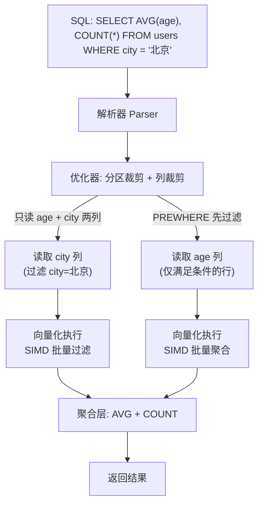

# ClickHouse 核心原理

> 学习路线对应：第8周 — ClickHouse 列式数据库
> 前置知识：SQL 基础、MySQL 基础
> 对比 MySQL：MySQL 行式存储适合 OLTP，ClickHouse 列式存储适合 OLAP 分析

---

## 一、核心概念

### 1.1 ClickHouse 是什么

ClickHouse 是由俄罗斯搜索引擎公司 **Yandex** 开源的**面向列的 OLAP 数据库管理系统**。它专为海量数据的实时分析而设计，能够在秒级甚至亚秒级完成数十亿行数据的聚合查询。

**核心特性**：
- **列式存储**：同一列数据连续存储，查询时只读取需要的列，大幅减少 IO
- **数据压缩**：列式存储天然适合压缩，压缩比可达 5-10 倍，减少存储成本
- **向量化执行**：利用 CPU SIMD 指令批量处理数据，而非逐行处理
- **分布式计算**：支持分布式表和分片，可水平扩展至数百节点
- **SQL 兼容**：支持标准 SQL 语法，学习成本低
- **实时写入**：支持高吞吐的批量写入，每秒可写入数百万行

> **生活化类比：ClickHouse = 超级分析引擎** —— 把 ClickHouse 想象成一台超级数据分析引擎。普通数据库（MySQL）像计算器，一次算一道题；ClickHouse 像一台大型并行计算器，能同时处理成千上万行数据。你问它"过去三个月每天各品类销售额趋势"，它能在秒级给出答案，因为它竖着读数据（列式存储）、批量处理（向量化执行）、还提前帮你算好了答案（物化视图）。

> 📖 **参考链接**：
> - [ClickHouse Documentation](https://clickhouse.com/docs/) -- ClickHouse 官方文档总入口
> - [ClickHouse Introduction](https://clickhouse.com/docs/en/intro/) -- ClickHouse 简介与核心特性

### 1.2 OLTP vs OLAP

| 维度 | OLTP（联机事务处理） | OLAP（联机分析处理） |
|------|---------------------|---------------------|
| **代表数据库** | MySQL、PostgreSQL、Oracle | ClickHouse、Doris、StarRocks |
| **存储方式** | 行式存储 | 列式存储 |
| **典型操作** | INSERT/UPDATE/DELETE（高频小事务） | SELECT（大批量聚合查询） |
| **查询特点** | 少量行，全列查询 | 大量行，少量列查询 |
| **并发能力** | 高并发（数千连接） | 中低并发（数十连接） |
| **数据量级** | GB 级 | TB~PB 级 |
| **典型场景** | 订单创建、用户登录、转账 | 销售报表、用户行为分析、漏斗分析 |

**一句话总结**：MySQL 负责"记流水账"（OLTP），ClickHouse 负责"算总账"（OLAP）。

### 1.3 适用场景

- **海量日志分析**：Nginx 访问日志、应用日志、安全审计日志
- **时序数据分析**：监控指标、IoT 传感器数据、股票行情
- **用户行为分析**：点击流、页面浏览、转化漏斗
- **实时报表**：运营看板、BI 报表、大屏展示
- **广告分析**：曝光量、点击率、转化率统计

---

## 二、底层原理

### 2.1 列式存储原理

**行式存储（MySQL）**：
```
行1: [id=1, name='张三', age=25, city='北京']
行2: [id=2, name='李四', age=30, city='上海']
行3: [id=3, name='王五', age=28, city='广州']
```
磁盘上逐行存储：`1,张三,25,北京,2,李四,30,上海,3,王五,28,广州`

**列式存储（ClickHouse）**：
```
id 列:   [1, 2, 3]
name 列: ['张三', '李四', '王五']
age 列:  [25, 30, 28]
city 列: ['北京', '上海', '广州']
```
磁盘上逐列存储：`1,2,3` → `张三,李四,王五` → `25,30,28` → `北京,上海,广州`

**列式存储的优势**：
1. **只读需要的列**：`SELECT AVG(age) FROM users` 只需读取 `age` 列，减少 IO
2. **高压缩比**：同一列数据类型相同，值相似度高，压缩效果好（LZ4/ZSTD 压缩比 5-10 倍）
3. **向量化执行**：同一列数据在内存中连续，CPU 可批量处理（SIMD 指令）

> **生活化类比：列式存储 = 竖着读表格** —— 想象一张成绩单表格：行式存储（MySQL）像横着读，想统计"全班平均分"得把每行（每个学生的所有科目）都读一遍；列式存储（ClickHouse）像竖着读，只看"成绩"那一列，直接读完算平均。竖着读不仅读得少，而且同一列都是数字，压缩起来特别省空间（5-10 倍压缩比）。这就是 ClickHouse 查询快的根本原因。

**列式存储与查询流程 Mermaid 图：**



> 📖 **参考链接**：
> - [ClickHouse 列式存储](https://clickhouse.com/docs/en/optimize/skipping-indexes/) -- 列式存储与查询优化官方说明

### 2.2 MergeTree 引擎家族

MergeTree 是 ClickHouse 最核心的表引擎家族，所有高级引擎都基于它。

| 引擎 | 特点 | 适用场景 |
|------|------|---------|
| **MergeTree** | 基础引擎，支持分区、排序键、主键、TTL | 通用场景，最常用 |
| **ReplacingMergeTree** | 在 MergeTree 基础上，合并时删除重复数据（保留最新版本） | 数据去重，幂等写入 |
| **SummingMergeTree** | 合并时自动汇总数值列 | 预聚合统计（如 PV/UV 汇总） |
| **AggregatingMergeTree** | 合并时按聚合函数聚合数据 | 物化视图的底层存储 |
| **CollapsingMergeTree** | 通过 sign 标记行的增删，合并时折叠 | 频繁更新的场景 |
| **ReplicatedMergeTree** | 数据副本，高可用 | 生产环境必选 |

**MergeTree 建表示例**：
```sql
CREATE TABLE order_events (
    event_time  DateTime,
    product_id  UInt64,
    category    String,
    amount      Decimal(10, 2),
    user_id     UInt64,
    event_type  LowCardinality(String)  -- 低基数字符串优化
)
ENGINE = MergeTree()
PARTITION BY toYYYYMM(event_time)      -- 按月分区
ORDER BY (product_id, event_time)      -- 排序键（也是主键）
TTL event_time + INTERVAL 90 DAY       -- 90 天后自动删除
SETTINGS index_granularity = 8192;     -- 索引粒度，默认 8192 行
```

> **生活化类比：MergeTree = 合并树** —— MergeTree 就像一棵不断生长合并的树。每次批量写入就像长出一片新叶子（Part），新叶子小而多。后台有专门的"园丁"（合并线程）定期把小叶子合并成大叶子，让树更整洁高效。不同品种的树有不同的合并规则：ReplacingMergeTree 合并时去掉重复叶，SummingMergeTree 合并时把数值相加，CollapsingMergeTree 合并时根据标记折叠增删。合并是异步的，你不用担心它影响查询，但要记住：合并时机不确定，查询时可能还有未合并的小叶子。

> 📖 **参考链接**：
> - [ClickHouse MergeTree](https://clickhouse.com/docs/en/engines/table-engines/mergetree-family/mergetree/) -- MergeTree 引擎家族官方说明

### 2.3 分区策略（PARTITION BY）

分区是将数据按指定规则拆分到不同物理目录，查询时 ClickHouse 只扫描相关分区，大幅减少数据扫描量。

**常用分区方式**：
```sql
-- 按月份分区（最常用）
PARTITION BY toYYYYMM(event_time)

-- 按天分区
PARTITION BY toYYYYMMDD(event_time)

-- 按小时分区
PARTITION BY toYYYYMMDDhh(event_time)

-- 按自定义键分区
PARTITION BY category
```

**分区裁剪原理**：
```sql
-- 查询只扫描 202601 和 202602 两个分区
SELECT COUNT(*) FROM order_events
WHERE event_time >= '2026-01-01' AND event_time < '2026-03-01';
```

**注意事项**：
- 分区数量不宜过多（建议不超过 1000 个），否则影响元数据管理性能
- 按天分区适合每日数据量较大（数亿行）的场景
- 按小时分区适合实时性要求极高的场景

### 2.4 排序键和稀疏索引

**排序键（ORDER BY）**：
- 数据按排序键顺序物理存储，同一排序键值的数据连续存放
- 排序键是 ClickHouse 查询性能的关键，应选择查询中最常用的过滤和聚合字段
- 排序键即为主键（可不唯一），不需要显式指定 PRIMARY KEY

**稀疏索引**：
- ClickHouse 使用**稀疏索引**（Sparse Index），而非 MySQL 的稠密索引（B+Tree）
- 默认每 8192 行（`index_granularity`）生成一个标记（Mark）
- 每个标记记录该区间内排序键的最小值和最大值，以及对应的物理偏移量

**稀疏索引 vs 稠密索引**：

| 维度 | 稀疏索引（ClickHouse） | 稠密索引（MySQL B+Tree） |
|------|----------------------|------------------------|
| 索引粒度 | 8192 行一个标记 | 每一行一个索引项 |
| 索引大小 | 极小（约为数据的千分之一） | 较大（约为数据的 10%-30%） |
| 查询方式 | 先定位标记区间，再扫描区间内数据 | 直接定位到具体行 |
| 适用场景 | 大批量扫描 + 聚合 | 精确查找 + 点查询 |

**一级索引 vs 二级索引**：
- **一级索引**：基于排序键的稀疏索引，自动创建
- **二级索引（跳数索引）**：额外创建的索引，如 `minmax`、`set`、`bloom_filter`

```sql
-- 创建跳数索引（布隆过滤器）
ALTER TABLE order_events
ADD INDEX idx_user_id user_id TYPE bloom_filter GRANULARITY 4;
```

### 2.5 数据压缩

ClickHouse 默认使用 **LZ4** 压缩算法，也支持 **ZSTD**（压缩比更高但速度稍慢）。

**列式存储天然适合压缩的原因**：
- 同一列数据类型相同，值域有限
- 排序后相邻行的值相似度更高
- 压缩比通常可达 5-10 倍

**压缩配置**：
```sql
CREATE TABLE events (...) ENGINE = MergeTree()
ORDER BY (event_time)
SETTINGS
    min_compress_block_size = 65536,   -- 压缩块最小大小
    max_compress_block_size = 1048576; -- 压缩块最大大小
```

**压缩带来的收益**：
- 减少磁盘 IO（读取更少的数据）
- 减少网络传输（分布式查询时）
- 减少存储成本（100GB 原始数据只需 10-20GB 存储）

### 2.6 物化视图（Materialized View）

物化视图是 ClickHouse 的预聚合加速利器，本质上是一个**触发器**——当源表有新数据写入时，自动将聚合结果写入目标表。

```sql
-- 创建目标表（存储聚合结果）
CREATE TABLE order_hourly_stats (
    hour        DateTime,
    category    String,
    order_count UInt64,
    total_amount Decimal(20, 2)
)
ENGINE = SummingMergeTree()
PARTITION BY toYYYYMM(hour)
ORDER BY (category, hour);

-- 创建物化视图
CREATE MATERIALIZED VIEW mv_order_hourly_stats
TO order_hourly_stats
AS
SELECT
    toStartOfHour(event_time) AS hour,
    category,
    count() AS order_count,
    sum(amount) AS total_amount
FROM order_events
GROUP BY hour, category;
```

**物化视图的特点**：
- 增量更新：只计算新写入的数据，不影响历史数据
- 查询加速：查询聚合结果直接读预计算的目标表，无需扫描原始数据
- 数据冗余：原始数据仍然保留，物化视图是额外的副本

---

## 三、实战应用

### 3.1 建表最佳实践

```sql
CREATE TABLE user_behavior (
    -- 时间字段
    event_time      DateTime,
    event_date      Date DEFAULT toDate(event_time),
    
    -- 维度字段（用于过滤和分组）
    user_id         UInt64,
    event_type      LowCardinality(String),  -- 低基数优化
    page_url        String,
    device          LowCardinality(String),
    
    -- 指标字段（用于聚合计算）
    duration        UInt32,
    click_count     UInt16
)
ENGINE = MergeTree()
PARTITION BY toYYYYMM(event_time)            -- 按月分区
ORDER BY (event_type, event_time, user_id)   -- 排序键：查询最常用的字段
TTL event_time + INTERVAL 180 DAY           -- 6 个月后自动删除
SETTINGS
    index_granularity = 8192,
    min_rows_for_wide_part = 0;              -- 使用 Wide 格式存储
```

**最佳实践要点**：
1. **PARTITION BY**：按月分区，平衡分区数量和查询效率
2. **ORDER BY**：选择查询中最常用的过滤和聚合字段，高基数列在前
3. **TTL**：设置自动过期，避免数据无限增长
4. **LowCardinality**：对低基数字符串字段使用此优化，减少内存占用
5. **避免 Nullable**：Nullable 字段有额外开销，尽量用默认值替代

### 3.2 数据类型选择

| 数据类型 | 说明 | 推荐替代 |
|---------|------|---------|
| `UInt8/UInt16/UInt32/UInt64` | 无符号整数 | 按值域选最小类型 |
| `Int8/Int16/Int32/Int64` | 有符号整数 | 同上 |
| `Float32/Float64` | 浮点数 | 金额用 `Decimal` |
| `Decimal(P, S)` | 定点数 | 金额字段首选 |
| `String` | 变长字符串 | 一般场景 |
| `FixedString(N)` | 定长字符串 | 如 MD5、SHA256 |
| `LowCardinality(T)` | 低基数优化 | 状态、类型、设备等枚举值 |
| `DateTime/Date` | 日期时间 | 时间字段 |
| `Array(T)` | 数组 | 标签、多值字段 |

**避免使用的类型**：
- `Nullable(T)`：每个 Nullable 字段在每行都有一个额外的 Null 标记字节，写入和查询都有额外开销
- `Enum`：不如 `LowCardinality(String)` 灵活，修改 Enum 需要 ALTER TABLE

### 3.3 Spring Boot 集成 ClickHouse

**Maven 依赖**：
```xml
<dependency>
    <groupId>com.clickhouse</groupId>
    <artifactId>clickhouse-jdbc</artifactId>
    <version>0.4.6</version>
</dependency>
```

**数据源配置**：
```java
@Configuration
public class ClickHouseConfig {
    @Bean
    @ConfigurationProperties(prefix = "spring.datasource.clickhouse")
    public DataSource clickHouseDataSource() {
        return DataSourceBuilder.create()
            .url("jdbc:clickhouse://localhost:8123/default")
            .driverClassName("com.clickhouse.jdbc.ClickHouseDriver")
            .build();
    }

    @Bean
    public JdbcTemplate clickHouseJdbcTemplate(@Qualifier("clickHouseDataSource") DataSource ds) {
        return new JdbcTemplate(ds);
    }
}
```

**Repository 示例**：
```java
@Repository
public class StatsRepository {
    @Autowired
    @Qualifier("clickHouseJdbcTemplate")
    private JdbcTemplate jdbcTemplate;

    public List<Map<String, Object>> hourlyPV(String date) {
        return jdbcTemplate.queryForList(
            "SELECT toStartOfHour(event_time) AS hour, count() AS pv, uniq(user_id) AS uv " +
            "FROM order_events " +
            "WHERE toDate(event_time) = ? " +
            "GROUP BY hour ORDER BY hour", date);
    }

    public void batchInsert(List<OrderEvent> events) {
        // 批量 INSERT，而非逐行插入
        String sql = "INSERT INTO order_events (event_time, product_id, category, amount, user_id) " +
                     "VALUES (?, ?, ?, ?, ?)";
        jdbcTemplate.batchUpdate(sql, events, 1000, (ps, event) -> {
            ps.setObject(1, event.getEventTime());
            ps.setLong(2, event.getProductId());
            ps.setString(3, event.getCategory());
            ps.setBigDecimal(4, event.getAmount());
            ps.setLong(5, event.getUserId());
        });
    }
}
```

### 3.4 数据写入方式

| 写入方式 | 说明 | 适用场景 |
|---------|------|---------|
| **批量 INSERT** | 每批 1000-10000 行，减少 Part 数量 | 推荐方式 |
| **Buffer 引擎** | 内存缓冲写入，达到阈值后批量刷入目标表 | 高频小量写入 |
| **Kafka 引擎** | 直接从 Kafka 消费写入 | 流式数据接入 |
| **JDBC 逐行写入** | 不推荐，会产生大量 Part | 仅测试环境 |

**Buffer 引擎示例**：
```sql
-- 创建 Buffer 表，缓冲写入
CREATE TABLE order_events_buffer AS order_events
ENGINE = Buffer(default, order_events, 16, 10, 100, 10000, 1000000, 10000000, 100000000);
-- num_layers=16, min_time=10s, max_time=100s, min_rows=10000, max_rows=1000000, min_bytes=10M, max_bytes=100M
-- 满足任一条件时自动 flush 到目标表
```

### 3.5 典型场景：用户点击流日志分析

**数据表设计**：
```sql
CREATE TABLE click_stream (
    event_time      DateTime,
    event_date      Date DEFAULT toDate(event_time),
    user_id         UInt64,
    session_id      String,
    page_url        String,
    referrer        String,
    event_type      LowCardinality(String),  -- page_view, click, scroll, exit
    element_id      String,
    device_type     LowCardinality(String),  -- mobile, desktop, tablet
    browser         LowCardinality(String),
    stay_duration   UInt32                   -- 停留时长（秒）
)
ENGINE = MergeTree()
PARTITION BY toYYYYMMDD(event_time)
ORDER BY (event_type, event_date, user_id);
```

**PV/UV 统计**：
```sql
-- 按小时统计 PV/UV
SELECT
    toStartOfHour(event_time) AS hour,
    count() AS pv,
    uniq(user_id) AS uv,
    round(uniq(user_id) / count(), 4) AS uv_rate
FROM click_stream
WHERE event_date = '2026-06-29'
GROUP BY hour
ORDER BY hour;
```

**漏斗分析**：
```sql
-- 页面浏览 → 商品点击 → 加入购物车 → 下单 漏斗
SELECT
    event_type,
    uniq(user_id) AS users
FROM click_stream
WHERE event_date = '2026-06-29'
  AND event_type IN ('page_view', 'product_click', 'add_cart', 'place_order')
GROUP BY event_type
ORDER BY
    multiIf(event_type = 'page_view', 1, event_type = 'product_click', 2,
            event_type = 'add_cart', 3, event_type = 'place_order', 4, 5);
```

---

## 四、常见面试题

### 1. ClickHouse 为什么查询这么快？

**答**：四大核心原因：
1. **列式存储**：查询只读取需要的列，大幅减少磁盘 IO。例如 `SELECT AVG(age) FROM users` 只读取 `age` 列。
2. **向量化执行**：利用 CPU SIMD 指令批量处理数据，一次处理一批数据而非逐行处理，充分利用 CPU 缓存。
3. **稀疏索引**：按排序键建立稀疏索引，默认每 8192 行一个标记，索引极小但能快速定位数据区间。
4. **数据压缩**：列式存储天然适合压缩（同一列值类型相同、相似度高），压缩比 5-10 倍，减少磁盘 IO 和网络传输。

### 2. MergeTree 引擎的合并机制？为什么需要合并？

**答**：每次批量写入都会产生一个新的 Part（不可变数据块）。随着时间推移，Part 数量增多，查询需要合并多个 Part 的结果，性能下降。后台合并线程（Merge）将多个小 Part 合并为一个大 Part，合并后删除旧 Part。合并机制的好处：减少 Part 数量，提高查询性能；在合并过程中，ReplacingMergeTree 去重、SummingMergeTree 汇总等逻辑生效。注意：合并时机由 ClickHouse 自动决定，不建议手动干预。

### 3. 行式存储和列式存储的区别？什么时候选列式存储？

**答**：

| 维度 | 行式存储 | 列式存储 |
|------|---------|---------|
| 存储方式 | 同一行数据连续存储 | 同一列数据连续存储 |
| 写入性能 | 好（一行一次写入） | 一般（多列需多次写入） |
| 查询少量列 | 差（需读取整行） | 好（只读需要的列） |
| 压缩比 | 低 | 高（5-10 倍） |
| 聚合查询 | 慢 | 快 |

**选择列式存储**：当查询模式是"大量行、少量列、聚合计算"时，如报表分析、BI 看板、日志分析。**选择行式存储**：当查询模式是"少量行、全列、频繁更新"时，如订单查询、用户信息修改。

### 4. ClickHouse 和 Elasticsearch 的核心区别？分别适合什么场景？

**答**：

| 维度 | ClickHouse | Elasticsearch |
|------|-----------|---------------|
| 核心能力 | 聚合分析（OLAP） | 全文检索 |
| 存储方式 | 列式存储 | 行式存储（底层列式） |
| 索引结构 | 稀疏索引 | 倒排索引 |
| 查询语言 | SQL | DSL（JSON） |
| 写入性能 | 极高（批量写入） | 较高 |
| 聚合性能 | 极快 | 较慢 |
| 全文搜索 | 不支持 | 核心能力 |

**适用场景**：
- ClickHouse：实时报表、BI 分析、海量数据聚合、用户行为分析
- Elasticsearch：商品搜索、日志检索、全文搜索、模糊匹配

**最佳实践**：两者配合使用——ES 负责搜索，ClickHouse 负责统计。

### 5. ClickHouse 的物化视图和普通数据库视图有什么区别？

**答**：ClickHouse 的物化视图本质上是一个**触发器**：源表有新数据写入时，自动增量计算聚合结果并写入目标表。查询时直接读目标表的预计算结果，无需扫描原始数据。与普通视图的区别：普通视图是逻辑视图（查询时实时计算），不存储数据；物化视图是物理视图，存储了预计算的聚合结果，查询性能极高但占用额外存储空间。ClickHouse 的物化视图是**增量更新**的，只计算新写入的数据，不会重复计算历史数据。

> 📖 **参考链接**：
> - [ClickHouse 最佳实践](https://clickhouse.com/docs/en/guides/developer/best-practices/) -- 建表、写入、查询最佳实践官方指南
> - [ClickHouse 物化视图](https://clickhouse.com/docs/en/sql-reference/statements/create/view/) -- 物化视图与增量更新官方说明

---

## 五、避坑指南

| 常见错误 | 现象 | 原因 | 解决方案 |
|---------|------|------|---------|
| 频繁小批量写入 | Part 数量爆炸，查询性能下降，CPU 和 IO 被合并线程占满 | MergeTree 每次写入产生新的 Part，后台合并有开销 | 批量写入（每 1000-10000 条或每 5-10 秒一批）；使用 Buffer 引擎或 Kafka 引擎缓冲写入 |
| 频繁 UPDATE/DELETE | 磁盘 IO 飙升，Part 数量激增 | ClickHouse 的 UPDATE/DELETE 是异步 Mutation，会重写整个 Part | 避免需要 UPDATE/DELETE 的场景；使用 ReplacingMergeTree + 版本号实现逻辑更新；通过数据覆盖替代 UPDATE |
| 用 ClickHouse 替代 MySQL 做业务主库 | 事务缺失，点查询慢 | ClickHouse 不支持事务，不适合 OLTP 场景 | MySQL 做业务主库（OLTP），ClickHouse 做分析引擎（OLAP） |
| 未使用 PREWHERE 优化 | 全列读取后过滤，IO 浪费 | WHERE 先读取所有列再过滤 | 优先使用 PREWHERE（列裁剪，先过滤再读取其他列）；MergeTree 引擎会自动优化部分 WHERE 到 PREWHERE |
| SELECT * 查询 | 列式存储优势丧失，IO 浪费 | 列式存储的优势在于只读需要的列 | 只查询需要的列 |
| 分区粒度过大或过小 | 分区数过多（>1000）影响元数据管理 | 未合理规划分区粒度 | 分区数控制在 1000 以内 |
| JOIN 大表 | 查询超时，性能差 | ClickHouse JOIN 性能不如分布式计算引擎 | 将 JOIN 逻辑放到数据写入时做宽表 |
| 使用 COUNT(DISTINCT) | 性能差 | COUNT(DISTINCT) 精确去重开销大 | 使用 uniq() 近似去重（HyperLogLog 算法） |
| 不监控 Part 数量 | 查询性能下降 | Part 数量过多未及时发现 | 定期查询 system.parts 监控 Part 数量 |

## 本章学习自检

完成本章学习后，应该能够：
- [ ] 用自己的话解释列式存储原理、MergeTree 引擎家族、分区策略与稀疏索引、物化视图的增量更新机制
- [ ] 手写 ClickHouse 建表语句（含分区、排序键、TTL）、Spring Boot 集成 ClickHouse 的批量写入代码
- [ ] 回答常见面试题（ClickHouse 查询快的原因、MergeTree 合并机制、行式 vs 列式存储区别、ClickHouse vs ES 区别、物化视图 vs 普通视图等）
- [ ] 在实战项目中应用 ClickHouse 实现海量数据实时统计分析
- [ ] 识别并避免常见错误（频繁小批量写入、对 ClickHouse 做 UPDATE/DELETE、用 ClickHouse 替代 MySQL 做主库、SELECT * 查询等）

---

> **学习导航**：
> - 返回 [学习路线总览](../../README.md)
> - 本模块其他文件：[02-ClickHouse笔面试题集](./02-ClickHouse笔面试题集.md)
> - 实战应用：[电商订单实时统计分析平台](../../extensions/project/01-电商订单实时统计分析平台.md)


