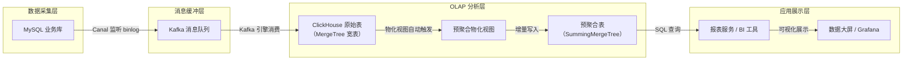

# ClickHouse - 综合场景串联

---

**实时数仓数据流转架构图：**



> 上图展示了实时数仓的完整数据流转链路：从 MySQL 业务库通过 Canal 采集 binlog 进入 Kafka 缓冲，ClickHouse 通过 Kafka 引擎消费写入宽表，物化视图自动触发预聚合写入 SummingMergeTree 目标表，最终由报表服务查询预聚合结果实现毫秒级响应。

---

## 场景一：构建 OLAP 实时数仓

### 场景描述
构建一个支持多维分析的实时数据仓库，从 MySQL 业务库同步数据到 ClickHouse，通过物化视图预聚合实现分钟级延迟的实时报表。

### 涉及知识点
- [ClickHouse核心原理](01-ClickHouse核心原理.md)：MergeTree 引擎、分区策略、排序键、物化视图、数据写入方式
- [ClickHouse笔面试题集](02-ClickHouse笔面试题集.md)：数据同步方案、多维实时报表设计

### 协作流程
1. 数据采集：Canal 监听 MySQL binlog，解析变更事件发送到 Kafka
2. 数据缓冲：Kafka 按表名创建 Topic，分区数根据数据量设定
3. 数据写入：ClickHouse 通过 Kafka 引擎消费 Kafka 消息，写入宽表
4. 宽表设计：在写入时完成 JOIN，将订单、用户、商品信息合并为一张宽表，避免查询时 JOIN
5. 分区策略：按月分区（PARTITION BY toYYYYMM(event_time)），平衡分区数量与裁剪效率
6. 排序键设计：选择查询最常用的过滤和聚合字段（如 event_type、event_time、user_id），高基数列在前
7. 物化视图预聚合：创建物化视图按小时、分类、地区三维度聚合销售额、订单数、用户数
8. 目标表选择：物化视图目标表使用 SummingMergeTree 引擎，按排序键自动汇总
9. 数据生命周期：设置 TTL 90 天自动过期，冷数据迁移到 HDFS 或对象存储
10. 查询服务：报表服务直接查询预聚合表，毫秒级返回

### 关键要点
- 写入时做宽表，避免查询时 JOIN（ClickHouse JOIN 性能弱）
- 批量写入每 1000-10000 条一批，避免 Part 数量爆炸
- 排序键选择高频查询字段，高基数列在前
- 物化视图只处理增量数据，不重算历史，需注意源表删除不同步
- 监控 Part 数量和合并进度，避免合并跟不上写入

---

## 场景二：实时指标统计分析

### 场景描述
构建一个电商平台的实时 PV/UV 统计系统，日均 1 亿条日志，支持按小时和页面维度统计 PV/UV，延迟要求 5 分钟以内。

### 涉及知识点
- [ClickHouse核心原理](01-ClickHouse核心原理.md)：列式存储、数据压缩、uniq 去重、物化视图
- [ClickHouse笔面试题集](02-ClickHouse笔面试题集.md)：实时 PV/UV 统计系统设计

### 协作流程
1. 日志采集：Nginx 日志通过 Filebeat 采集发送到 Kafka
2. 原始表设计：按天分区（PARTITION BY toYYYYMMDD(event_time)），排序键按 (event_date, page_url, user_id)
3. 数据写入：ClickHouse 通过 Kafka 引擎消费写入原始表 page_views
4. 物化视图预聚合：创建物化视图按小时和页面 URL 聚合，count() 计算 PV，uniq(user_id) 计算 UV
5. 目标表设计：pv_uv_hourly 使用 SummingMergeTree 引擎，按 (hour, page_url) 排序
6. 查询：直接查询 pv_uv_hourly 预聚合表，毫秒级返回结果
7. 数据保留：设置 TTL 90 天自动过期
8. 监控：监控 Kafka Lag 和 ClickHouse Part 数量，确保延迟在 5 分钟以内

### 关键要点
- uniq() 函数基于 HyperLogLog 算法，近似去重，默认误差约 2%
- 对精确度要求高时使用 uniqCombined() 或 uniqExact()
- 物化视图目标表需使用 SummingMergeTree 或 AggregatingMergeTree 存储聚合结果
- 按天分区，单分区 1 亿条数据在合理范围内
- 查询时始终使用预聚合表，避免直接查询原始表

---

## 完整可运行示例代码

以下是一个基于 ClickHouse 的实时数据分析报表完整示例，涵盖建表、数据导入、物化视图预聚合和 SQL 查询分析。

### 步骤一：环境准备 - Docker Compose

```yaml
# docker-compose.yml
version: '3.8'
services:
  clickhouse:
    image: clickhouse/clickhouse-server:23.11
    container_name: clickhouse-node
    ports:
      - "8123:8123"      # HTTP 接口
      - "9000:9000"      # Native 接口
      - "9009:9009"      # 集群间通信
    ulimits:
      nofile:
        soft: 262144
        hard: 262144
    volumes:
      - ./clickhouse-data:/var/lib/clickhouse
      - ./clickhouse-logs:/var/log/clickhouse-server
      - ./config:/etc/clickhouse-server/config.d
    environment:
      CLICKHOUSE_DB: ecommerce
      CLICKHOUSE_USER: default
      CLICKHOUSE_PASSWORD: clickhouse123
    networks:
      - ch-network

  # ClickHouse 可视化工具（可选）
  tabix:
    image: spoonest/clickhouse-tabix-web-client
    container_name: tabix
    ports:
      - "8080:80"
    depends_on:
      - clickhouse
    networks:
      - ch-network

networks:
  ch-network:
    driver: bridge
```

```bash
# 启动 ClickHouse
docker-compose up -d

# 连接 ClickHouse 客户端
docker exec -it clickhouse-node clickhouse-client -u default --password clickhouse123

# 验证安装
SELECT version();

# 查看数据库
SHOW DATABASES;
```

### 步骤二：创建原始数据表

```sql
-- ==========================================
-- 1. 订单宽表（MergeTree 引擎）
-- 将订单、用户、商品信息合并为一张宽表，避免查询时 JOIN
-- ==========================================
CREATE TABLE IF NOT EXISTS ecommerce.order_wide
(
    -- 订单信息
    order_id        String COMMENT '订单编号',
    order_status    UInt8 COMMENT '订单状态: 0-待支付, 1-已支付, 2-已发货, 3-已完成, 4-已取消',
    order_amount    Decimal(10, 2) COMMENT '订单金额',

    -- 时间维度
    event_time      DateTime COMMENT '事件时间',
    event_date      Date DEFAULT toDate(event_time) COMMENT '事件日期（用于分区）',

    -- 用户信息
    user_id         UInt64 COMMENT '用户ID',
    user_level      String COMMENT '用户等级: normal, vip, svip',
    user_register_date Date COMMENT '用户注册日期',
    user_city       String COMMENT '用户所在城市',
    user_province   String COMMENT '用户所在省份',

    -- 商品信息
    product_id      UInt64 COMMENT '商品ID',
    product_name    String COMMENT '商品名称',
    category_id     UInt32 COMMENT '分类ID',
    category_name   String COMMENT '分类名称',
    brand           String COMMENT '品牌',
    quantity        UInt32 COMMENT '购买数量',
    unit_price      Decimal(10, 2) COMMENT '单价',

    -- 支付信息
    pay_type        String COMMENT '支付方式: alipay, wechat, credit_card',
    pay_time        DateTime COMMENT '支付时间',
    is_paid         UInt8 COMMENT '是否已支付: 0-否, 1-是',

    -- 渠道信息
    channel         String COMMENT '渠道: app, h5, miniprogram, pc'
)
ENGINE = MergeTree()
PARTITION BY toYYYYMM(event_time)       -- 按月分区
ORDER BY (event_date, category_id, user_id)  -- 排序键：高频查询和过滤字段
TTL event_time + INTERVAL 90 DAY        -- 90 天后自动过期删除
SETTINGS index_granularity = 8192;
```

```sql
-- ==========================================
-- 2. 用户行为日志表（MergeTree 引擎）
-- 记录 PV/UV 埋点数据
-- ==========================================
CREATE TABLE IF NOT EXISTS ecommerce.user_behavior
(
    event_id        String COMMENT '事件ID',
    event_type      String COMMENT '事件类型: page_view, click, add_cart, buy',
    user_id         UInt64 COMMENT '用户ID（可为0表示未登录）',
    session_id      String COMMENT '会话ID',
    page_url        String COMMENT '页面URL',
    product_id      UInt64 DEFAULT 0 COMMENT '商品ID',
    referrer        String COMMENT '来源页面',
    ip              String COMMENT '客户端IP',
    device_type     String COMMENT '设备类型: ios, android, pc',
    event_time      DateTime COMMENT '事件时间',
    event_date      Date DEFAULT toDate(event_time) COMMENT '事件日期'
)
ENGINE = MergeTree()
PARTITION BY toYYYYMMDD(event_time)      -- 按天分区
ORDER BY (event_date, event_type, user_id)
TTL event_time + INTERVAL 30 DAY
SETTINGS index_granularity = 8192;
```

### 步骤三：创建预聚合表（物化视图目标表）

```sql
-- ==========================================
-- 1. 按小时 + 分类的销售汇总表（SummingMergeTree）
-- ==========================================
CREATE TABLE IF NOT EXISTS ecommerce.sales_hourly
(
    event_hour      DateTime COMMENT '小时（精确到小时）',
    category_id     UInt32 COMMENT '分类ID',
    category_name   String COMMENT '分类名称',
    order_count     UInt64 COMMENT '订单数',
    total_amount    Decimal(20, 2) COMMENT '总销售额',
    total_quantity  UInt64 COMMENT '总销量',
    user_count      UInt64 COMMENT '下单用户数',
    avg_amount      Decimal(10, 2) COMMENT '平均客单价'
)
ENGINE = SummingMergeTree()
PARTITION BY toYYYYMM(event_hour)
ORDER BY (event_hour, category_id)
TTL event_hour + INTERVAL 180 DAY;
```

```sql
-- ==========================================
-- 2. 按天 + 省份的销售汇总表
-- ==========================================
CREATE TABLE IF NOT EXISTS ecommerce.sales_daily_province
(
    event_date      Date COMMENT '日期',
    user_province   String COMMENT '省份',
    order_count     UInt64 COMMENT '订单数',
    total_amount    Decimal(20, 2) COMMENT '总销售额',
    user_count      UInt64 COMMENT '下单用户数'
)
ENGINE = SummingMergeTree()
PARTITION BY toYYYYMM(event_date)
ORDER BY (event_date, user_province)
TTL event_date + INTERVAL 365 DAY;
```

```sql
-- ==========================================
-- 3. PV/UV 按小时统计表（AggregatingMergeTree）
-- ==========================================
CREATE TABLE IF NOT EXISTS ecommerce.pv_uv_hourly
(
    event_hour      DateTime COMMENT '小时',
    page_url        String COMMENT '页面URL',
    pv              UInt64 COMMENT '页面浏览量',
    uv              AggregateFunction(uniq, UInt64) COMMENT '独立访客数（HyperLogLog）',
    session_count   UInt64 COMMENT '会话数'
)
ENGINE = AggregatingMergeTree()
PARTITION BY toYYYYMM(event_hour)
ORDER BY (event_hour, page_url)
TTL event_hour + INTERVAL 90 DAY;
```

### 步骤四：创建物化视图（自动预聚合）

```sql
-- ==========================================
-- 1. 销售小时汇总物化视图
-- 订单宽表数据写入时，自动触发预聚合
-- ==========================================
CREATE MATERIALIZED VIEW IF NOT EXISTS ecommerce.mv_sales_hourly
TO ecommerce.sales_hourly
AS
SELECT
    toStartOfHour(event_time) AS event_hour,
    category_id,
    any(category_name) AS category_name,
    count() AS order_count,
    sum(order_amount) AS total_amount,
    sum(quantity) AS total_quantity,
    uniq(user_id) AS user_count,
    round(avg(order_amount), 2) AS avg_amount
FROM ecommerce.order_wide
WHERE order_status IN (1, 2, 3)   -- 仅统计已支付、已发货、已完成的订单
GROUP BY event_hour, category_id;
```

```sql
-- ==========================================
-- 2. 销售按天+省份汇总物化视图
-- ==========================================
CREATE MATERIALIZED VIEW IF NOT EXISTS ecommerce.mv_sales_daily_province
TO ecommerce.sales_daily_province
AS
SELECT
    event_date,
    user_province,
    count() AS order_count,
    sum(order_amount) AS total_amount,
    uniq(user_id) AS user_count
FROM ecommerce.order_wide
WHERE order_status IN (1, 2, 3)
GROUP BY event_date, user_province;
```

```sql
-- ==========================================
-- 3. PV/UV 小时汇总物化视图
-- ==========================================
CREATE MATERIALIZED VIEW IF NOT EXISTS ecommerce.mv_pv_uv_hourly
TO ecommerce.pv_uv_hourly
AS
SELECT
    toStartOfHour(event_time) AS event_hour,
    page_url,
    count() AS pv,
    uniqState(user_id) AS uv,
    uniq(session_id) AS session_count
FROM ecommerce.user_behavior
WHERE event_type = 'page_view'
GROUP BY event_hour, page_url;
```

### 步骤五：批量导入模拟数据

```sql
-- ==========================================
-- 插入订单宽表数据（模拟 30 天的数据）
-- ==========================================
INSERT INTO ecommerce.order_wide
SELECT
    -- 订单编号
    concat('ORD', toString(rand() * 100000000000)) AS order_id,
    -- 订单状态（随机）
    rand() % 5 AS order_status,
    -- 订单金额（100-20000 随机）
    toDecimal64(round(rand() * 19900 + 100, 2), 2) AS order_amount,
    -- 事件时间（过去30天内随机）
    now() - INTERVAL (rand() * 30 * 24 * 3600) SECOND AS event_time,
    toDate(event_time) AS event_date,
    -- 用户ID
    toUInt64(rand() * 50000 + 1) AS user_id,
    -- 用户等级
    ['normal', 'normal', 'normal', 'normal', 'vip', 'vip', 'svip'][toUInt8(rand() * 7 + 1)] AS user_level,
    -- 注册日期
    toDate('2020-01-01') + INTERVAL (rand() * 1500) DAY AS user_register_date,
    -- 城市和省份
    ['北京', '上海', '广州', '深圳', '杭州', '成都', '武汉', '南京', '西安', '重庆'][toUInt8(rand() * 10 + 1)] AS user_city,
    ['北京', '上海', '广东', '广东', '浙江', '四川', '湖北', '江苏', '陕西', '重庆'][toUInt8(rand() * 10 + 1)] AS user_province,
    -- 商品ID
    toUInt64(rand() * 5000 + 1) AS product_id,
    -- 商品名称
    ['iPhone 15 Pro', '华为Mate 60', '小米14', 'MacBook Pro', 'iPad Air', 'AirPods Pro', '戴尔显示器', 'PS5', 'Switch', '小米电视'][toUInt8(rand() * 10 + 1)] AS product_name,
    -- 分类ID
    toUInt32(rand() * 5 + 1) * 100 AS category_id,
    -- 分类名称
    ['手机', '电脑', '平板', '配件', '家电'][toUInt8(rand() * 5 + 1)] AS category_name,
    -- 品牌
    ['Apple', '华为', '小米', 'Sony', 'Dell', 'Nintendo', 'OPPO', 'Samsung'][toUInt8(rand() * 8 + 1)] AS brand,
    -- 数量
    toUInt32(rand() * 5 + 1) AS quantity,
    toDecimal64(round(rand() * 5000 + 100, 2), 2) AS unit_price,
    -- 支付方式
    ['alipay', 'wechat', 'credit_card'][toUInt8(rand() * 3 + 1)] AS pay_type,
    event_time + INTERVAL (rand() * 300) SECOND AS pay_time,
    rand() % 2 AS is_paid,
    -- 渠道
    ['app', 'h5', 'miniprogram', 'pc'][toUInt8(rand() * 4 + 1)] AS channel
FROM numbers(1000000);  -- 生成 100 万条订单数据
```

```sql
-- ==========================================
-- 插入用户行为日志（模拟 7 天的数据，日均 PV 约 100 万）
-- ==========================================
INSERT INTO ecommerce.user_behavior
SELECT
    generateUUIDv4() AS event_id,
    ['page_view', 'page_view', 'page_view', 'page_view', 'click', 'add_cart', 'buy'][toUInt8(rand() * 7 + 1)] AS event_type,
    toUInt64(rand() * 50000) AS user_id,
    concat('session_', toString(rand() * 10000000)) AS session_id,
    ['/index', '/products/detail', '/products/list', '/cart', '/order/confirm', '/user/profile'][toUInt8(rand() * 6 + 1)] AS page_url,
    toUInt64(rand() * 5000 + 1) AS product_id,
    ['', 'https://www.baidu.com', 'https://www.weixin.com', 'direct'][toUInt8(rand() * 4 + 1)] AS referrer,
    concat(toString(rand() * 255), '.', toString(rand() * 255), '.', toString(rand() * 255), '.', toString(rand() * 255)) AS ip,
    ['ios', 'android', 'android', 'pc'][toUInt8(rand() * 4 + 1)] AS device_type,
    now() - INTERVAL (rand() * 7 * 24 * 3600) SECOND AS event_time,
    toDate(event_time) AS event_date
FROM numbers(7000000);  -- 生成 700 万条行为日志
```

```sql
-- 查看数据量
SELECT
    '订单宽表' AS table_name,
    count() AS row_count,
    formatReadableSize(sum(bytes)) AS data_size
FROM ecommerce.order_wide
UNION ALL
SELECT
    '用户行为日志' AS table_name,
    count() AS row_count,
    formatReadableSize(sum(bytes)) AS data_size
FROM ecommerce.user_behavior;
```

### 步骤六：实时数据分析 SQL 查询

```sql
-- ==========================================
-- 查询 1: 最近 24 小时各分类销售趋势（从预聚合表查询，毫秒级）
-- ==========================================
SELECT
    event_hour,
    category_name,
    order_count,
    total_amount,
    avg_amount
FROM ecommerce.sales_hourly
WHERE event_hour >= now() - INTERVAL 24 HOUR
  AND event_hour < now()
ORDER BY event_hour DESC, total_amount DESC;

-- ==========================================
-- 查询 2: 最近 7 天各省份销售额排名
-- ==========================================
SELECT
    user_province,
    sum(order_count) AS total_orders,
    sum(total_amount) AS total_sales,
    sum(user_count) AS total_users,
    round(sum(total_amount) / sum(order_count), 2) AS avg_order_amount
FROM ecommerce.sales_daily_province
WHERE event_date >= today() - INTERVAL 7 DAY
GROUP BY user_province
ORDER BY total_sales DESC
LIMIT 10;

-- ==========================================
-- 查询 3: 最近 1 小时各页面 PV/UV 实时统计
-- ==========================================
SELECT
    event_hour,
    page_url,
    sum(pv) AS pv,
    uniqMerge(uv) AS uv,
    round(sum(pv) / uniqMerge(uv), 2) AS avg_pv_per_user
FROM ecommerce.pv_uv_hourly
WHERE event_hour >= now() - INTERVAL 1 HOUR
GROUP BY event_hour, page_url
ORDER BY pv DESC
LIMIT 20;

-- ==========================================
-- 查询 4: 品牌销售额 TOP 10（从原始宽表查询）
-- ==========================================
SELECT
    brand,
    count() AS order_count,
    sum(order_amount) AS total_sales,
    uniq(user_id) AS user_count,
    round(sum(order_amount) / count(), 2) AS avg_order_value
FROM ecommerce.order_wide
WHERE event_time >= now() - INTERVAL 30 DAY
  AND order_status IN (1, 2, 3)
GROUP BY brand
ORDER BY total_sales DESC
LIMIT 10;

-- ==========================================
-- 查询 5: 用户等级消费分析
-- ==========================================
SELECT
    user_level,
    count() AS order_count,
    sum(order_amount) AS total_sales,
    uniq(user_id) AS user_count,
    round(sum(order_amount) / uniq(user_id), 2) AS avg_spend_per_user,
    round(sum(order_amount) / count(), 2) AS avg_order_value
FROM ecommerce.order_wide
WHERE event_time >= now() - INTERVAL 30 DAY
  AND order_status IN (1, 2, 3)
GROUP BY user_level
ORDER BY avg_spend_per_user DESC;

-- ==========================================
-- 查询 6: 支付方式分布
-- ==========================================
SELECT
    pay_type,
    count() AS order_count,
    sum(order_amount) AS total_sales,
    round(count() * 100.0 / sum(count()) OVER(), 2) AS percentage
FROM ecommerce.order_wide
WHERE event_time >= now() - INTERVAL 7 DAY
  AND is_paid = 1
GROUP BY pay_type
ORDER BY order_count DESC;

-- ==========================================
-- 查询 7: 渠道转化漏斗分析
-- ==========================================
SELECT
    channel,
    countIf(order_status IN (1, 2, 3)) AS paid_orders,
    count() AS total_orders,
    round(paid_orders * 100.0 / total_orders, 2) AS conversion_rate,
    round(sumIf(order_amount, order_status IN (1, 2, 3)), 2) AS paid_amount
FROM ecommerce.order_wide
WHERE event_time >= now() - INTERVAL 7 DAY
GROUP BY channel
ORDER BY conversion_rate DESC;

-- ==========================================
-- 查询 8: 每小时 GMV 趋势（最近 24 小时）
-- ==========================================
SELECT
    toStartOfHour(event_time) AS hour,
    sum(order_amount) AS gmv,
    count() AS order_count,
    uniq(user_id) AS user_count
FROM ecommerce.order_wide
WHERE event_time >= now() - INTERVAL 24 HOUR
  AND order_status IN (1, 2, 3)
GROUP BY hour
ORDER BY hour;
```

### 步骤七：性能优化配置

```sql
-- ==========================================
-- 1. 手动触发分区合并（优化查询性能）
-- ==========================================
OPTIMIZE TABLE ecommerce.order_wide PARTITION 202406 FINAL;
OPTIMIZE TABLE ecommerce.sales_hourly PARTITION 202406 FINAL;
OPTIMIZE TABLE ecommerce.sales_daily_province PARTITION 202406 FINAL;
OPTIMIZE TABLE ecommerce.pv_uv_hourly PARTITION 202406 FINAL;

-- ==========================================
-- 2. 查看表信息和分区情况
-- ==========================================
SELECT
    database,
    table,
    engine,
    formatReadableSize(total_bytes) AS total_size,
    total_rows
FROM system.tables
WHERE database = 'ecommerce'
ORDER BY total_bytes DESC;

-- 查看分区信息
SELECT
    partition,
    name AS table_name,
    rows,
    formatReadableSize(bytes_on_disk) AS disk_size
FROM system.parts
WHERE database = 'ecommerce'
  AND active = 1
ORDER BY table_name, partition;

-- ==========================================
-- 3. 查看物化视图延迟
-- ==========================================
SELECT
    'order_wide -> sales_hourly' AS pipeline,
    (SELECT max(event_time) FROM ecommerce.order_wide) AS source_max_time,
    (SELECT max(event_hour) FROM ecommerce.sales_hourly) AS target_max_time,
    dateDiff('second', target_max_time, source_max_time) AS lag_seconds
FORMAT Vertical;

-- ==========================================
-- 4. 查看当前正在执行的查询
-- ==========================================
SELECT
    query_id,
    left(query, 100) AS query_preview,
    elapsed,
    read_rows,
    formatReadableSize(read_bytes) AS read_size,
    formatReadableSize(memory_usage) AS memory
FROM system.processes
WHERE query NOT LIKE '%system.processes%'
ORDER BY elapsed DESC;
```

### 步骤八：Python 数据导入脚本（可选，替代 SQL 批量插入）

```python
# import_data.py - 使用 clickhouse-driver 批量导入数据
from clickhouse_driver import Client
import random
import time
from datetime import datetime, timedelta

# 连接 ClickHouse
client = Client(
    host='localhost',
    port=9000,
    user='default',
    password='clickhouse123',
    database='ecommerce'
)

# 批量插入参数
BATCH_SIZE = 50000
TOTAL_ROWS = 1000000

categories = ['手机', '电脑', '平板', '配件', '家电']
brands = ['Apple', '华为', '小米', 'Sony', 'Dell', 'Nintendo', 'OPPO', 'Samsung']
provinces = ['北京', '上海', '广东', '浙江', '四川', '湖北', '江苏', '陕西', '重庆']
cities = ['北京', '上海', '广州', '深圳', '杭州', '成都', '武汉', '南京', '西安', '重庆']
channels = ['app', 'h5', 'miniprogram', 'pc']
pay_types = ['alipay', 'wechat', 'credit_card']
levels = ['normal', 'normal', 'normal', 'normal', 'vip', 'vip', 'svip']
product_names = ['iPhone 15 Pro', '华为Mate 60', '小米14', 'MacBook Pro',
                 'iPad Air', 'AirPods Pro', '戴尔显示器', 'PS5', 'Switch', '小米电视']

print(f"开始导入 {TOTAL_ROWS} 条数据...")
start_time = time.time()
batch = []

for i in range(TOTAL_ROWS):
    event_time = datetime.now() - timedelta(seconds=random.randint(0, 30 * 24 * 3600))
    cat_idx = random.randint(0, 4)

    batch.append((
        f'ORD{random.randint(100000000000, 999999999999)}',
        random.randint(0, 4),
        round(random.uniform(100, 20000), 2),
        event_time,
        event_time.date(),
        random.randint(1, 50000),
        random.choice(levels),
        (datetime(2020, 1, 1) + timedelta(days=random.randint(0, 1500))).date(),
        random.choice(cities),
        provinces[cities.index(random.choice(cities))]
            if random.choice(cities) in cities[:len(provinces)] else random.choice(provinces),
        random.randint(1, 5000),
        random.choice(product_names),
        (cat_idx + 1) * 100,
        categories[cat_idx],
        random.choice(brands),
        random.randint(1, 5),
        round(random.uniform(100, 5000), 2),
        random.choice(pay_types),
        event_time + timedelta(seconds=random.randint(0, 300)),
        random.randint(0, 1),
        random.choice(channels)
    ))

    if len(batch) >= BATCH_SIZE:
        client.execute(
            'INSERT INTO ecommerce.order_wide VALUES',
            batch
        )
        batch = []
        print(f"已导入 {i + 1} / {TOTAL_ROWS} 条 ({((i + 1) / TOTAL_ROWS * 100):.1f}%)")

# 导入剩余数据
if batch:
    client.execute('INSERT INTO ecommerce.order_wide VALUES', batch)

elapsed = time.time() - start_time
print(f"导入完成！总耗时: {elapsed:.1f} 秒, 平均速度: {TOTAL_ROWS / elapsed:.0f} 条/秒")
```

```bash
# 安装 Python 依赖
pip install clickhouse-driver

# 运行导入脚本
python import_data.py
```

> [返回模块目录](../../README.md) | [返回知识导览](../../知识导览.md)