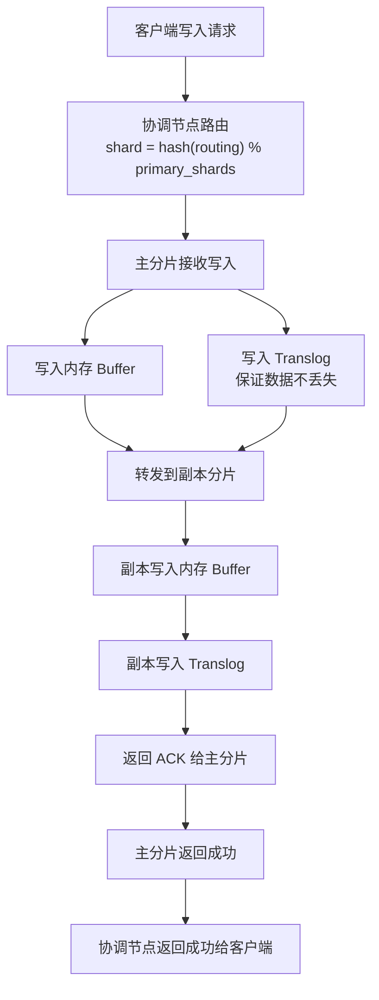
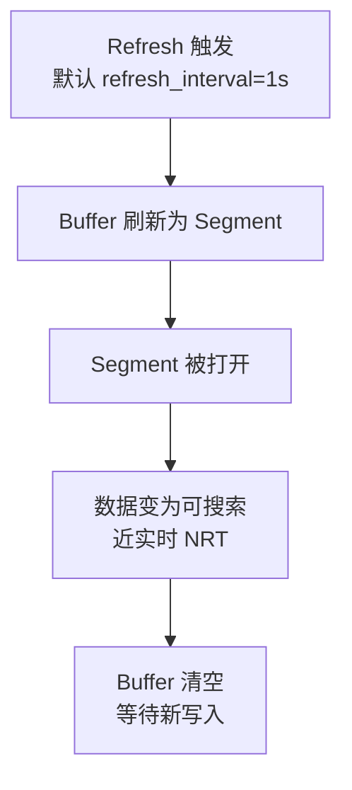
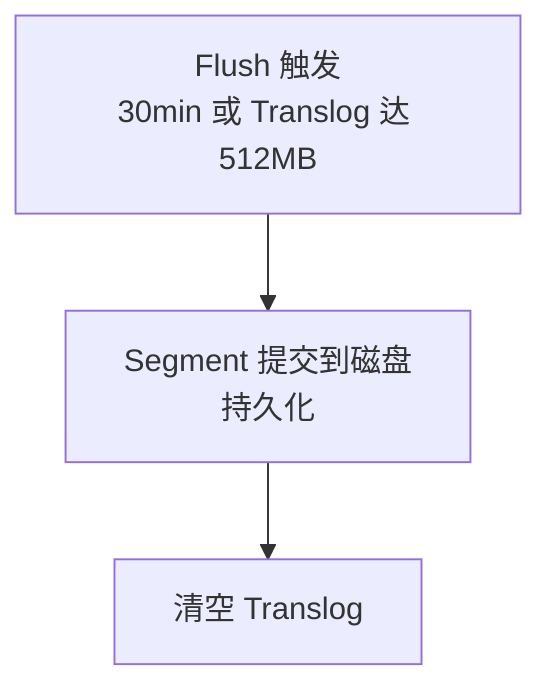
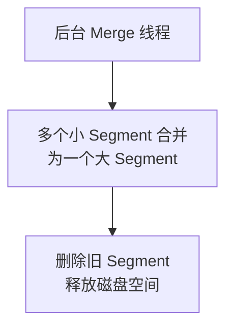
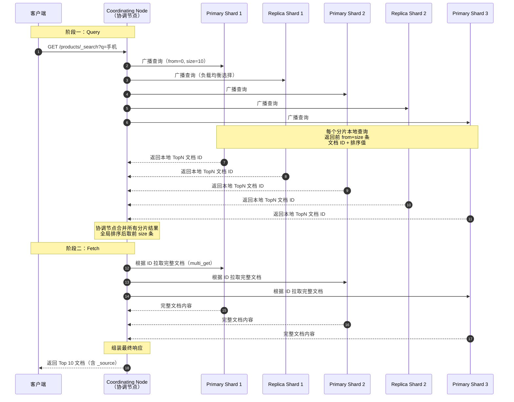

# Elasticsearch 核心原理

> 学习路线对应：第7周 — Elasticsearch 搜索引擎
> 前置知识：数据库基础（索引概念）
> 对比 MySQL：ES 索引 ≈ MySQL 表，但自带全文检索和倒排索引

---

## 本文目录

- [一、核心概念](#一核心概念)
- [二、底层原理](#二底层原理)
- [三、实战应用](#三实战应用)
- [四、常见面试题](#四常见面试题)
- [五、避坑指南](#五避坑指南)

## 一、核心概念

### 1.1 ES 是什么

Elasticsearch（简称 ES）是一个基于 **Apache Lucene** 构建的**分布式搜索和分析引擎**。它能够以近乎实时的速度存储、搜索和分析海量数据。ES 不仅仅是一个搜索引擎，它还具备强大的聚合分析能力，常用于日志分析、全文检索、业务监控、安全分析等场景。

ES 的核心优势：
- **分布式架构**：天然支持水平扩展，数据自动分片和复制
- **全文检索**：基于倒排索引，支持复杂的中文分词和相关性评分
- **近实时搜索**：数据写入后约 1 秒即可被搜索到（NRT, Near Real Time）
- **RESTful API**：基于 HTTP 协议的 JSON 交互，客户端语言无关
- **聚合分析**：支持类似 SQL GROUP BY 的复杂聚合统计

> **生活化类比：Elasticsearch = 超级智能图书馆** —— 想象一家超级图书馆，藏书量达百亿册（海量数据），每天有上千万读者来检索。**传统数据库**（MySQL）就像图书馆的传统索引卡片柜：你只能按"书名"或"作者"精确查找（B+Tree 索引），想找"讲人工智能且通俗易懂的书"完全做不到。**Elasticsearch** 是超级智能图书馆：① 每本书进馆时，图书管理员会把内容拆解成关键词（分词），建立"关键词 -> 书籍编号"的反向目录（倒排索引）；② 你输入"人工智能 通俗易懂"，系统瞬间定位到所有相关书籍（全文检索），并按相关度排序（评分）；③ 系统能统计"近 30 天借阅次数最多的 AI 类图书"（聚合分析）；④ 藏书量太大时，系统自动把书分散到多个分馆存储（分片），任一分馆故障时其他分馆继续服务（高可用）；⑤ 新书入库 1 秒后即可被检索到（近实时）。

### 1.2 核心概念与术语

| ES 概念 | 说明 | MySQL 类比 |
|---------|------|-----------|
| **Index（索引）** | 文档的集合，ES 7+ 中一个 Index 对应一个表 | Table（表） |
| **Type（类型）** | 索引内部的逻辑分区，ES 7.x 已废弃，8.x 完全移除 | Table（表）— 已废弃 |
| **Document（文档）** | 可被索引的基本信息单元，JSON 格式 | Row（行） |
| **Field（字段）** | 文档中的键值对 | Column（列） |
| **Mapping（映射）** | 定义字段的类型、分词器等约束 | Schema（表结构定义） |
| **Shard（分片）** | 索引的物理存储单元，一个索引可拆分为多个分片 | 分表 |
| **Replica（副本）** | 分片的复制，提供高可用和负载均衡 | 主从复制 |

> 注意：ES 7.x 起，一个索引只能有一个 Type（默认 `_doc`），ES 8.x 已完全移除 Type 概念。在 ES 7+ 中，Index 直接类比为 MySQL 的 Table 更准确。

### 1.3 ES 集群架构

ES 采用主从架构，集群中的节点角色分为：

| 节点角色 | 职责 |
|---------|------|
| **Master Node（主节点）** | 管理集群元数据（索引创建/删除、分片分配）、维护集群状态，不处理读写请求 |
| **Data Node（数据节点）** | 存储数据、执行 CRUD 操作、搜索和聚合 |
| **Coordinating Node（协调节点）** | 接收客户端请求，路由到正确的数据节点，汇总结果后返回（每个节点默认都是协调节点） |
| **Ingest Node（预处理节点）** | 在索引文档前对数据进行预处理（如字段转换、富化） |

一个典型的集群架构：

```
客户端请求 → Coordinating Node → Data Node 1（Primary Shard）
                               → Data Node 2（Replica Shard）
                               → Data Node 3（Primary Shard + Replica Shard）
```

---

## 二、底层原理

### 2.1 倒排索引（Inverted Index）

倒排索引是 ES 全文检索的核心数据结构。它与传统的"正向索引"（文档 ID → 词项列表）相反，结构为 **词项（Term）→ 文档 ID 列表**。

**正向索引（MySQL B+Tree 索引）**：
```
文档1 → ["苹果", "手机", "很好用"]
文档2 → ["华为", "手机", "也不错"]
```

**倒排索引**：
```
"苹果" → [文档1]
"手机" → [文档1, 文档2]
"很好用" → [文档1]
"华为" → [文档2]
"也不错" → [文档2]
```

**为什么倒排索引比正向索引快？**
- 正向索引搜索"手机"需要遍历所有文档
- 倒排索引直接通过词项定位到包含该词的文档列表，时间复杂度 O(1)
- 倒排索引还存储了词频（TF）、位置（Position）等信息，用于相关性评分

**倒排索引的内部结构**：
```
Term Dictionary（词项字典）→ 排序的 Term 列表，支持二分查找
  └── Term Index（词项索引）→ 基于 FST（有限状态转换器）的压缩前缀树，加速定位
        └── Posting List（倒排列表）→ 包含该 Term 的文档 ID 列表
              ├── Doc ID（文档 ID）
              ├── Term Frequency（词频，TF）
              ├── Position（词在文档中的位置）
              └── Offset（字符偏移量，用于高亮）
```

> **生活化类比：倒排索引 = 图书馆主题词反向目录** —— 倒排索引就像图书馆的"主题词反向目录"。**传统索引**（正向索引）是"按书找内容"：你想知道"书架第 3 排第 5 本"是什么书，翻开目录看它的章节标题（文档 -> 词项）。但如果你想找"所有讲人工智能的书"，传统目录帮不上忙——你只能挨本翻看（全表扫描）。**倒排索引**是"按内容找书"：图书管理员在每本书进馆时，提取书中的关键词，编制一张"关键词 -> 书籍编号清单"的反向目录。你想找"讲人工智能的书"，直接翻开反向目录找到"人工智能"词条，下面列着"书架 3-5、书架 7-2、书架 12-8..."所有相关书的编号（Posting List）。**三层结构类比**：① **Term Dictionary**（词项字典）= 反向目录的字母索引页（按字母排序，方便二分查找）；② **Term Index**（词项索引）= 索引页开头的"首字母分组表"（FST 压缩前缀树，帮你快速跳到 A 字母区）；③ **Posting List**（倒排列表）= 该词条下的书籍编号清单（含词频、位置、偏移量等额外信息）。三层配合实现"瞬间定位"。

### 2.2 分词器（Analyzer）

分词器负责将文本拆分为独立的词项（Term），是全文检索的基础。一个 Analyzer 由三部分组成：

```
Analyzer = Character Filter + Tokenizer + Token Filter
```

**1. Character Filter（字符过滤器）**
- 在分词前对原始文本进行预处理
- 如：去除 HTML 标签（`html_strip`）、字符映射转换（`&` → `and`）

**2. Tokenizer（分词器）**
- 将文本拆分为词项（Token）
- 常用：`standard`（标准分词）、`ik_smart`（IK 粗粒度分词）、`ik_max_word`（IK 细粒度分词）

**3. Token Filter（词项过滤器）**
- 对分词后的 Token 进行过滤处理
- 如：`lowercase`（转小写）、`stop`（去除停用词）、`synonym`（同义词扩展）

**中文分词利器 — IK 分词器**：

IK 分词器是 ES 中文分词的标配，提供两种模式：

| 模式 | 说明 | 示例："中华人民共和国国歌" |
|------|------|--------------------------|
| `ik_smart` | 粗粒度分词，尽量切分出最少的词 | `中华人民共和国`、`国歌` |
| `ik_max_word` | 细粒度分词，穷尽所有可能的词 | `中华人民共和国`、`中华人民`、`中华`、`华人`、`人民共和国`、`人民`、`共和国`、`共和`、`国`、`国歌` |

**分词测试示例**：
```json
POST /_analyze
{
  "analyzer": "ik_max_word",
  "text": "苹果手机很好用"
}
// 结果：["苹果", "手机", "很好", "好用", "很", "好", "用"]
```

### 2.3 分片机制（Shard）

分片是 ES 实现分布式存储和并行计算的核心机制。

**Primary Shard（主分片）**：
- 索引创建时确定数量，**设置后不可修改**（只能通过 Reindex 重建索引）
- 每个文档只属于一个主分片，通过路由算法决定：`shard = hash(_routing) % number_of_primary_shards`
- 主分片负责处理写操作

**Replica Shard（副本分片）**：
- 主分片的拷贝，数量可以动态调整
- 提供高可用（主分片故障时选举为新主分片）
- 分担读请求负载（读操作可以在主分片或副本分片执行）

**分片分配策略**：
- 主分片和其副本分片不会分配到同一节点
- 默认每个节点上的分片数尽量均衡

**分片数规划建议**：
- 单个分片大小建议 10GB-50GB
- 分片数 = 数据总量 / 单分片大小
- 日志类数据按时间滚动索引，每个索引分片数不宜过多

> **生活化类比：分片与副本 = 图书馆总分馆体系** —— ES 分片机制就像大型连锁图书馆的总分馆体系。**Primary Shard（主分片）**= 总馆的藏书被拆分到多个分馆：当藏书量达 1 亿册时（数据量大），单一馆舍放不下，集团决定在北京、上海、广州建 3 个分馆（3 个主分片），每个分馆存放 1/3 的藏书。读者检索时，查询请求并行发到 3 个分馆，每个分馆返回自己负责的部分结果，总部（协调节点）汇总后呈现给读者（分布式并行查询加速）。**Replica Shard（副本分片）**= 每个分馆都有一个"备份分馆"：北京分馆的藏书在上海备份一份（副本），当北京分馆火灾时（节点宕机），上海备份馆立即升级为主馆（故障转移），保证服务不中断。**关键约束**：主分片数创建时确定且不可修改（一旦分了 3 个分馆就不能改成 5 个，只能整体搬迁重建 = Reindex），但副本数可动态调整（随时增加备份分馆数量）。**路由算法**：每本书按"书名 hash 取模"决定存放在哪个分馆（`shard = hash(routing) % number_of_shards`），保证同一本书始终存放在固定分馆。

### 2.4 写入流程

ES 数据写入的完整流程（以默认 1 个主分片 + 1 个副本分片为例）：

```
1. 客户端 → Coordinating Node（协调节点）
   - 接收写入请求，计算文档路由：shard = hash(_routing) % num_primary_shards
   
2. Coordinating Node → Primary Shard（主分片所在节点）
   - 转发写入请求到主分片所在节点
   
3. Primary Shard 处理写入：
   a. 写入内存缓冲区（Buffer）
   b. 同时写入 Translog（事务日志），保证数据不丢失
   c. 转发写入请求到 Replica Shard
   
4. Replica Shard 处理写入：
   a. 写入内存缓冲区
   b. 写入 Translog
   c. 返回成功给 Primary Shard
   
5. Primary Shard → Coordinating Node
   - 所有副本成功写入后，返回成功
   
6. Coordinating Node → 客户端
   - 返回写入成功
```

### 2.5 Refresh 机制与近实时搜索（NRT）

ES 不是实时搜索，而是**近实时（Near Real Time）**，默认延迟约 1 秒。

**Refresh 流程**：
```
1. 文档写入内存 Buffer（此时不可搜索）
2. 每秒（默认 refresh_interval=1s）将 Buffer 中的数据刷新为新的 Segment
3. Segment 被打开，数据变为可搜索
4. Buffer 清空，等待新的写入
```

**为什么是近实时而非实时？**
- 如果每次写入都立即刷新，会创建大量小 Segment，严重影响性能
- 1 秒的延迟折中了实时性和性能

**调优建议**：
- 对实时性要求不高的场景，可增大 `refresh_interval`（如 30s）以提升写入性能
- 批量导入时，可设置 `refresh_interval=-1` 关闭自动刷新，导入完成后再恢复

### 2.6 段合并（Segment Merge）

每个 Refresh 操作都会创建一个新的 Segment（不可变）。随着时间推移，Segment 数量增长会降低查询性能。

**段合并机制**：
- 后台自动合并线程将多个小 Segment 合并为一个大 Segment
- 合并后删除旧 Segment，释放磁盘空间
- 合并过程消耗 CPU 和 IO 资源

**合并策略**：
- TieredMergePolicy（分层合并策略）：优先合并大小相近的 Segment
- 通过 `max_merged_segment`（默认 5GB）控制单个 Segment 最大大小
- 通过 `segments_per_tier` 控制每层 Segment 数量

### 2.7 数据可靠性保证

**Translog（事务日志）**：
- 每个分片维护一个 Translog 文件
- 每次写入操作先写入 Translog，再写入内存 Buffer
- 节点宕机恢复时，从 Translog 重放未持久化的操作

**Flush 机制**：
- 默认每 30 分钟或 Translog 达到 512MB 时触发
- Flush 过程：将内存中的 Segment 提交到磁盘 → 清空 Translog
- 与 Refresh 的区别：Refresh 是将 Buffer 刷到 Segment（可搜索但未持久化），Flush 是将 Segment 持久化到磁盘

**数据一致性层级：**
```
写入请求 → 内存 Buffer（不可搜索）
         → Refresh → Segment（可搜索，在内存/文件系统缓存中）
         → Flush → 磁盘持久化
```

**文档写入全流程（Refresh -> Flush -> Merge）拆分为四个独立阶段：**

### 写入阶段

> 客户端写入请求经过协调节点路由到主分片，主分片写入 Buffer 和 Translog 后，再转发到副本分片，所有副本确认后返回成功。



> 注：D 节点（写入内存 Buffer）完成后，将触发 Refresh 阶段的 L 节点。

### Refresh 阶段

> Refresh 默认每 1 秒触发一次，将内存 Buffer 刷新为 Segment 并打开，使数据变为近实时可搜索（NRT）。



> 注：L 节点由写入阶段的 D 节点触发；M 节点（Segment 生成后）将触发 Flush 阶段的 Q 节点。

### Flush 阶段

> Flush 默认每 30 分钟或 Translog 达到 512MB 时触发，将 Segment 提交到磁盘持久化，并清空 Translog。



> 注：Q 节点由 Refresh 阶段的 M 节点（Segment 生成后）触发。

### Merge 阶段

> 后台 Merge 线程将多个小 Segment 合并为一个大 Segment，删除旧 Segment 以释放磁盘空间。



> 注：T 节点由 Refresh 阶段的 N 节点（Segment 被打开后）触发。

### 2.8 查询流程（Query Then Fetch）

ES 的搜索请求采用 **Query Then Fetch** 两阶段模型，协调节点先广播查询到所有分片收集文档 ID，再根据 ID 拉取完整文档内容返回客户端。



**两阶段查询要点：**

| 阶段 | 职责 | 数据量 |
|------|------|--------|
| **Query** | 每个分片本地查询，返回前 `from+size` 条文档 ID + 排序值 | 仅返回 ID 和排序字段，数据量小 |
| **Fetch** | 协调节点根据全局排序后的文档 ID，去对应分片拉取完整 `_source` | 仅拉取最终 `size` 条的完整内容 |

**深度分页问题：** 当 `from + size` 较大时（如 from=10000, size=10），每个分片需返回 10010 条数据到协调节点，协调节点需合并 `10010 × 分片数` 条数据再排序取前 10 条，内存和 CPU 开销巨大。ES 默认 `max_result_window=10000`，超过会报错。

**深度分页替代方案：**

| 方案 | 原理 | 适用场景 |
|------|------|----------|
| `search_after` | 基于上一页最后一条文档的排序值，仅查询后续记录 | 实时翻页（推荐） |
| `scroll` | 创建快照，迭代拉取（类似游标） | 全量导出，非实时 |
| `search_after + PIT` | Point In Time + search_after | 严格一致的翻页（ES 7.10+） |

---

## 三、实战应用

### 3.1 Spring Boot 集成 ES

**Maven 依赖**：
```xml
<dependency>
    <groupId>org.springframework.boot</groupId>
    <artifactId>spring-boot-starter-data-elasticsearch</artifactId>
</dependency>
```

**application.yml 配置**：
```yaml
spring:
  elasticsearch:
    uris: http://localhost:9200
    connection-timeout: 5s
    socket-timeout: 30s
```

**两种操作方式**：

| 方式 | 说明 | 适用场景 |
|------|------|---------|
| `ElasticsearchRestTemplate` | 底层模板类，灵活控制查询 | 复杂 DSL 查询 |
| `ElasticsearchRepository` | 类似 Spring Data JPA 的 Repository | 简单 CRUD 操作 |

**实体类示例**：
```java
@Document(indexName = "products")
public class ProductDoc {
    @Id
    private String id;
    
    @Field(type = FieldType.Text, analyzer = "ik_max_word", searchAnalyzer = "ik_smart")
    private String name;
    
    @Field(type = FieldType.Keyword)
    private String category;
    
    @Field(type = FieldType.Double)
    private Double price;
    
    @Field(type = FieldType.Text, index = false) // 不索引，仅存储
    private String description;
    
    @Field(type = FieldType.Date, format = DateFormat.basic_date_time)
    private Date createTime;
}
```

### 3.2 索引设计最佳实践

**Setting 配置**：
```json
PUT /products
{
  "settings": {
    "number_of_shards": 3,
    "number_of_replicas": 1,
    "refresh_interval": "5s",
    "analysis": {
      "analyzer": {
        "ik_pinyin_analyzer": {
          "type": "custom",
          "tokenizer": "ik_max_word",
          "filter": ["lowercase"]
        }
      }
    }
  },
  "mappings": {
    "properties": {
      "name": {
        "type": "text",
        "analyzer": "ik_max_word",
        "search_analyzer": "ik_smart",
        "fields": {
          "keyword": { "type": "keyword" }
        }
      },
      "price": { "type": "double" },
      "category": { "type": "keyword" },
      "create_time": { "type": "date", "format": "yyyy-MM-dd HH:mm:ss" }
    }
  }
}
```

**Mapping 字段类型选择**：
| 字段类型 | 用途 | 示例 |
|---------|------|------|
| `text` | 全文搜索，会被分词 | 商品名称、文章内容 |
| `keyword` | 精确匹配、排序、聚合 | 分类、标签、状态 |
| `long` / `integer` / `double` | 数值 | 价格、数量、评分 |
| `date` | 日期时间 | 创建时间、更新时间 |
| `boolean` | 布尔值 | 是否上架 |
| `geo_point` | 地理位置 | 经纬度坐标 |

### 3.3 索引模板（Index Template）

索引模板用于统一管理按时间滚动创建的索引（如日志索引）。

```json
PUT /_index_template/logs_template
{
  "index_patterns": ["logs-*"],
  "template": {
    "settings": {
      "number_of_shards": 3,
      "number_of_replicas": 1,
      "refresh_interval": "30s"
    },
    "mappings": {
      "properties": {
        "level": { "type": "keyword" },
        "message": { "type": "text", "analyzer": "ik_max_word" },
        "timestamp": { "type": "date", "format": "yyyy-MM-dd HH:mm:ss" }
      }
    }
  }
}
```

创建 `logs-2026-06-01` 索引时，会自动应用上述模板配置。

### 3.4 数据同步方案

| 方案 | 原理 | 优缺点 |
|------|------|--------|
| **Logstash** | 定时从 MySQL 拉取数据写入 ES | 简单但有延迟，适合全量同步 |
| **Canal** | 监听 MySQL binlog，解析变更事件写入 ES | 实时性好，零侵入，但运维复杂 |
| **MQ 异步同步** | 业务代码写入 MySQL 后发送 MQ 消息，消费端写入 ES | 灵活可控，但需业务代码配合 |
| **双写** | 业务代码同时写入 MySQL 和 ES | 简单直接，但一致性难保证 |

**推荐方案 — Canal + MQ 组合**：
```
MySQL binlog → Canal Server → Kafka → ES 同步消费者
```
- 解耦：Canal 专注于解析 binlog，消费者专注于写入 ES
- 可靠：Kafka 持久化消息，保证不丢失
- 实时：Canal 近实时解析 binlog

---

## 四、常见面试题

### 1. 什么是倒排索引？为什么比正向索引快？

**答**：倒排索引是一种从词项（Term）到文档 ID 列表的映射数据结构。正向索引是"文档 → 词项"的映射，检索时需要遍历所有文档匹配关键词；倒排索引是"词项 → 文档列表"的映射，检索时直接通过词项查找到所有包含该词的文档，时间复杂度为 O(1)（通过 Term Dictionary 的二分查找或 FST 前缀树）。倒排索引还存储了词频（TF）和位置信息，用于计算相关性评分，排序搜索结果。

### 2. ES 的写入流程是怎样的？为什么是近实时（NRT）？

**答**：写入流程：客户端请求 → 协调节点路由 → 主分片写入内存 Buffer 和 Translog → 转发到副本分片 → 副本写入成功 → 返回成功。近实时的原因：文档写入后先进入内存 Buffer（不可搜索），默认每 1 秒（refresh_interval）将 Buffer 刷新为 Segment 并打开，此时才可搜索。1 秒的延迟是性能和实时性的折中——如果每次写入都立即刷新会产生大量小 Segment，严重影响性能。可通过修改 `refresh_interval` 参数调整。

### 3. ES 的分片策略？Primary Shard 和 Replica Shard 的作用？

**答**：Primary Shard（主分片）是数据的主要存储单元，创建索引时确定数量且不可修改，负责处理写请求。Replica Shard（副本分片）是主分片的拷贝，数量可动态调整。作用：Primary Shard 实现数据的水平扩展（容量和写入吞吐），Replica Shard 提供高可用（主分片故障时提升为新的主分片）和读负载均衡（读请求可分发到副本）。注意：主分片和其副本不会被分配到同一节点。

### 4. ES 如何保证数据一致性？

**答**：ES 通过 **Translog（事务日志）+ 定期 Flush** 机制保证数据不丢失。每次写入操作先写入 Translog，再写入内存 Buffer。节点宕机后重启时，从 Translog 重放未持久化的操作恢复数据。Flush 定期将内存中的 Segment 持久化到磁盘并清空 Translog（默认 30 分钟或 Translog 达 512MB）。ES 是 AP 系统（CAP 理论），牺牲了强一致性来换取高可用和分区容错，写入成功返回表示所有副本已写入，但读取时可能读到旧数据（主从之间可能有短暂不一致）。

### 5. IK 分词器的 ik_smart 和 ik_max_word 区别？

**答**：`ik_smart` 是粗粒度分词模式，尽量切分出最少的词，适合索引时使用（如搜索框的查询分析）。`ik_max_word` 是细粒度分词模式，穷尽所有可能的词组合，适合存储时使用（如索引文档内容）。最佳实践：索引时用 `ik_max_word`（尽可能多地切分词，提高召回率），搜索时用 `ik_smart`（精确匹配，提高准确率）。

---

## 五、避坑指南

| 常见错误 | 现象 | 原因 | 解决方案 |
|---------|------|------|---------|
| 动态映射敏感字段 | 日期格式字符串被误识别为 Date 类型，后续写入报错 | ES 默认开启动态映射，自动推断字段类型 | 关闭动态映射（`dynamic: "strict"`）；或使用 dynamic_templates 精确控制 |
| 分片数设置不合理 | 分片数无法动态修改，不合理的分片数影响性能 | Primary Shard 数量在索引创建时确定 | 创建索引前做好容量规划：分片数 = 预估数据量 / 单分片建议大小（10-50GB）；修改需通过 Reindex API 重建索引 |
| 用 ES 做事务型主存储 | 数据不一致，不支持事务 | ES 是 AP 系统，牺牲了强一致性 | MySQL 做主存储，ES 做搜索引擎和只读副本，通过数据同步保持最终一致性 |
| 深度分页 | 协调节点内存暴增，查询超时 | 协调节点需从每个分片收集 from+size 条数据，默认限制 10000 | 使用 search_after（实时翻页）；使用 scroll（全量导出）；修改 max_result_window（临时方案） |
| text 字段上做聚合 | 聚合结果无意义 | text 类型字段被分词，聚合无意义 | 聚合必须使用 keyword 类型字段 |
| 大量小 Segment | 查询性能下降 | 频繁写入产生大量小 Segment | 低峰期手动调用 _forcemerge 合并；批量导入时设置 refresh_interval=-1 |
| 不监控集群健康状态 | 部分分片不可用未及时发现 | 未监控集群状态 | 监控 green/yellow/red 状态，yellow 以上需及时处理 |

## 本章学习自检

完成本章学习后，应该能够：
- [ ] 用自己的话解释倒排索引原理、分词器组成（Character Filter + Tokenizer + Token Filter）、写入流程与 Refresh 机制、段合并原理
- [ ] 手写 ES 索引创建（Settings + Mappings）、Spring Boot 集成 ES 的实体类定义
- [ ] 回答常见面试题（倒排索引 vs 正向索引、ES 写入流程与 NRT、分片策略、数据一致性保证、IK 分词器模式区别等）
- [ ] 在实战项目中应用 ES 实现商品搜索、日志检索等功能
- [ ] 识别并避免常见错误（动态映射误识别日期、分片数设置后不可修改、用 ES 做主存储、深度分页性能问题等）

---

> 📖 **参考链接**：
> - [Elasticsearch 官方文档](https://www.elastic.co/guide/en/elasticsearch/reference/8.19/index.html) -- Elasticsearch 8.19 完整参考手册，含核心概念、API、配置
> - [倒排索引原理](https://www.elastic.co/guide/en/elasticsearch/reference/8.19/inverted-indexes.html) -- 倒排索引、Term Dictionary、FST 内部结构详解
> - [文档索引与近实时](https://www.elastic.co/guide/en/elasticsearch/reference/8.19/docs-index_.html) -- 写入流程、Refresh、Flush、Translog 机制说明
> - [分片与集群架构](https://www.elastic.co/guide/en/elasticsearch/reference/8.19/docs-index_.html) -- Primary / Replica Shard、路由算法、故障转移
> - [Search 详解](https://www.elastic.co/guide/en/elasticsearch/reference/8.19/search-search.html) -- Query Then Fetch 两阶段查询、search_after、scroll 分页
> - [中文分词 IK 插件](https://github.com/medcl/elasticsearch-analysis-ik) -- IK 分词器 ik_smart / ik_max_word 模式与配置
> - [Spring Data Elasticsearch](https://docs.spring.io/spring-data/elasticsearch/reference/) -- Spring Boot 集成 ES 的官方文档

---

> **学习导航**：
> - 返回 [学习路线总览](../../README.md)
> - 本模块其他文件：[03-ES笔面试题集](./03-ES笔面试题集.md)
> - 实战应用：[电商订单实时统计分析平台](../../extensions/project/01-电商订单实时统计分析平台.md)

