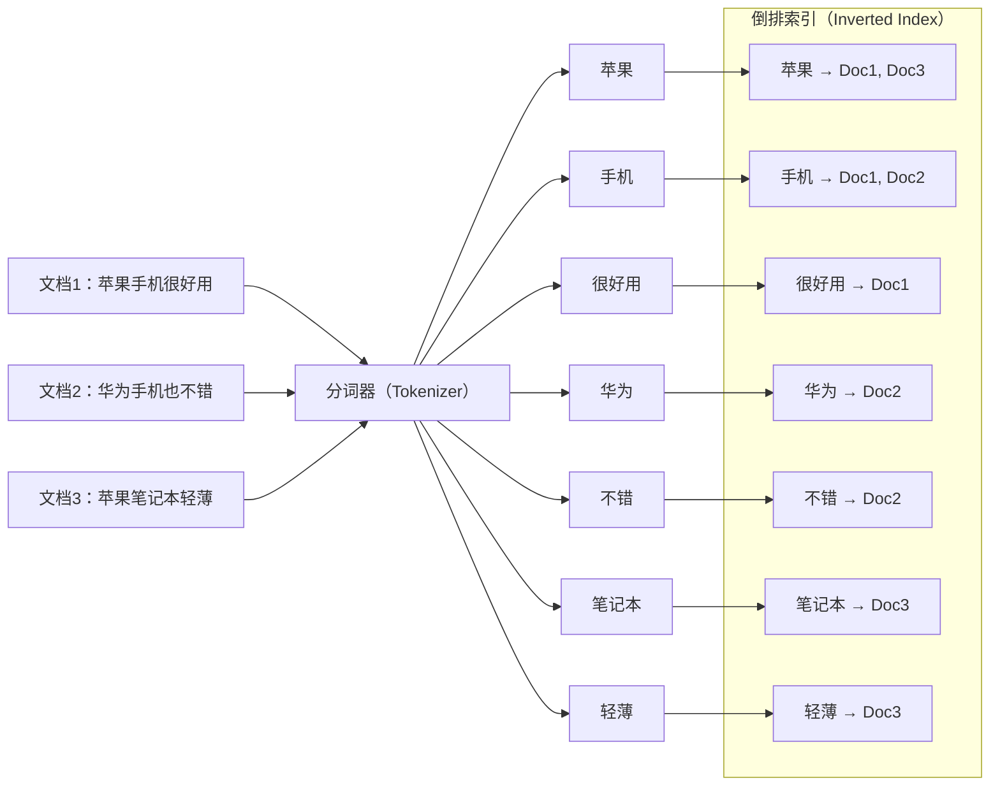
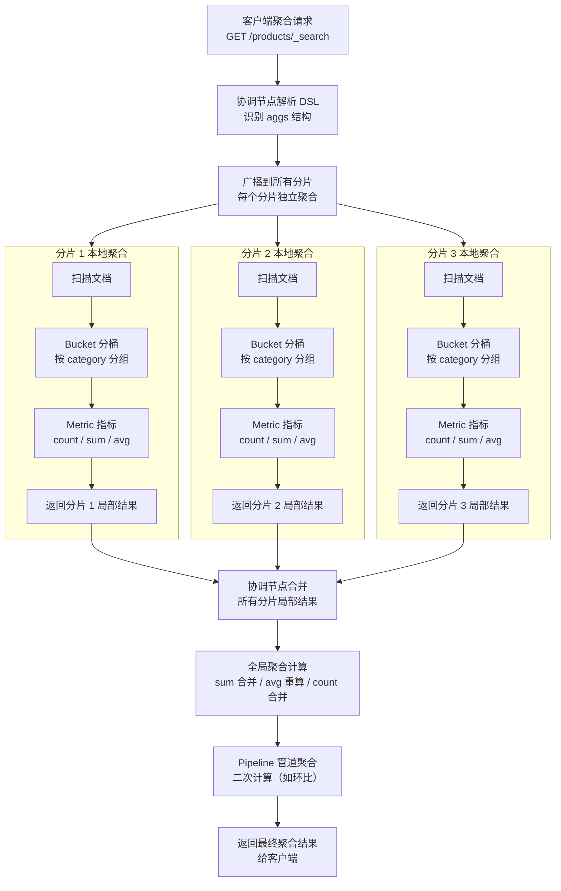

# ES 查询与聚合分析

> 学习路线对应：第7周 — Elasticsearch 搜索引擎
> 前置知识：ES 核心概念（倒排索引、分词器、Mapping）

---

## 本文目录

- [一、核心概念](#一核心概念)
- [二、DSL 查询详解](#二dsl-查询详解)
- [三、聚合分析](#三聚合分析)
- [四、常见面试题](#四常见面试题)
- [五、避坑指南](#五避坑指南)

## 一、核心概念

### 1.1 查询上下文 vs 过滤上下文

ES 的查询分为两种上下文，理解其区别是写好 DSL 的基础：

| 维度 | Query Context（查询上下文） | Filter Context（过滤上下文） |
|------|---------------------------|----------------------------|
| **目的** | 回答"有多匹配" | 回答"是否匹配" |
| **相关性评分** | 计算 `_score`（相关性得分） | 不计算评分，只判断命中（是/否） |
| **性能** | 较慢，需计算评分 | 较快，ES 自动缓存过滤结果 |
| **典型场景** | 全文搜索、关键词匹配 | 分类筛选、价格区间、状态过滤 |
| **DSL 示例** | `must`、`should` | `filter`、`must_not` |

**核心原则**：能用 `filter` 就不用 `must`，因为 filter 不计算评分且结果会被缓存。

> **生活化类比：Query Context vs Filter Context = 图书馆"按相关度推荐书单" vs "按条件精准筛选"** —— 想象你在图书馆找书。**Query Context（查询上下文）**就像图书管理员"按相关度推荐"：你说"我想了解人工智能"，管理员在所有书中找出相关书籍，并按"相关程度"排序后推荐给你（计算 _score 评分）。同一本书可能因为内容匹配度高而排在前面，匹配度低而排在后面。**Filter Context（过滤上下文）**则是"按硬性条件筛选"：你说"我只看 2020 年后出版且价格低于 100 元的书"，管理员直接按年份和价格筛选，不关心"相关度"，只判断"符合/不符合"（是/否判断）。两种方式各有用途：找"讲人工智能的书"用 Query（需要相关度排序）；筛"2020 年后且低于 100 元"用 Filter（不计算评分、结果可缓存、性能高）。**核心原则**：能用 Filter 就别用 Query，让 Query 专注做"相关度排序"，Filter 专注做"硬性条件筛选"，分工明确效率最高。

### 1.2 全文搜索 vs 精确搜索

| 维度 | 全文搜索（Full Text） | 精确搜索（Term） |
|------|----------------------|-----------------|
| **是否分词** | 对查询词进行分词后匹配 | 不对查询词分词，直接精确匹配 |
| **适用字段** | `text` 类型字段 | `keyword`、数值、日期、布尔类型 |
| **典型查询** | `match`、`match_phrase`、`multi_match` | `term`、`terms`、`range`、`exists` |
| **示例** | 搜索"苹果手机"会匹配到"苹果"和"手机"相关文档 | 查询 `category = "手机"` 只匹配分类为"手机"的文档 |

### 1.3 聚合（Aggregation）

聚合是 ES 的分析能力，类似 SQL 的 `GROUP BY` + 聚合函数：

| 聚合类型 | 说明 | SQL 类比 |
|---------|------|---------|
| **Bucket Aggregation（分桶聚合）** | 按条件将文档分组 | `GROUP BY` |
| **Metric Aggregation（指标聚合）** | 对文档进行统计计算 | `COUNT()`、`SUM()`、`AVG()` |
| **Pipeline Aggregation（管道聚合）** | 对其他聚合结果进行二次计算 | 窗口函数、`HAVING` |

**倒排索引建立过程图**：



> 倒排索引是 ES 高效搜索的核心数据结构。原始文档经过**分词器**拆分为独立词项后，每个词项维护一个指向包含该词项的文档列表的映射。搜索"苹果手机"时，ES 直接查找"苹果"和"手机"两个词项的倒排列表，取交集即可快速定位到 Doc1，避免了全表扫描。

---

## 二、DSL 查询详解

### 2.1 基本查询

**match 查询（分词匹配）**：
```json
// 对查询词进行分词后匹配，适用于 text 字段
GET /products/_search
{
  "query": {
    "match": {
      "name": "苹果手机"  // 分词为 ["苹果","手机"]，分别匹配
    }
  }
}
```

**match_phrase 查询（短语匹配）**：
```json
// 要求分词后的词项按顺序连续出现
GET /products/_search
{
  "query": {
    "match_phrase": {
      "name": "苹果手机"  // 必须包含"苹果"和"手机"且顺序一致
    }
  }
}
```

**multi_match 查询（多字段匹配）**：
```json
// 在多个字段中搜索
GET /products/_search
{
  "query": {
    "multi_match": {
      "query": "苹果手机",
      "fields": ["name^3", "description"]  // name 权重为 3
    }
  }
}
```

**term 查询（精确匹配）**：
```json
// 不对查询词分词，直接精确匹配，适用于 keyword 字段
GET /products/_search
{
  "query": {
    "term": {
      "category": "手机"  // 精确匹配分类为"手机"
    }
  }
}
```

**terms 查询（多值精确匹配）**：
```json
// 类似 SQL 的 IN 查询
GET /products/_search
{
  "query": {
    "terms": {
      "category": ["手机", "电脑", "平板"]
    }
  }
}
```

**range 查询（范围查询）**：
```json
GET /products/_search
{
  "query": {
    "range": {
      "price": {
        "gte": 1000,    // 大于等于
        "lte": 5000,    // 小于等于
        "boost": 2.0    // 提升权重
      }
    }
  }
}
```

**exists 查询（字段存在性）**：
```json
// 查询存在某字段的文档
GET /products/_search
{
  "query": {
    "exists": {
      "field": "discount"
    }
  }
}
```

### 2.2 bool 组合查询

`bool` 查询是 ES 中最强大的组合查询，可以组合多个查询条件：

```json
GET /products/_search
{
  "query": {
    "bool": {
      "must": [                    // 必须匹配，AND 逻辑，计算评分
        { "match": { "name": "手机" } }
      ],
      "should": [                  // 应该匹配，OR 逻辑，计算评分
        { "match": { "name": "华为" } },
        { "match": { "brand": "Apple" } }
      ],
      "must_not": [                // 必须不匹配，NOT 逻辑，不计算评分
        { "term": { "status": "已下架" } }
      ],
      "filter": [                  // 必须匹配，AND 逻辑，不计算评分（有缓存）
        { "term": { "category": "电子产品" } },
        { "range": { "price": { "gte": 1000, "lte": 5000 } } }
      ],
      "minimum_should_match": 1    // should 至少匹配 1 个
    }
  }
}
```

**must vs filter 的区别**：

| 维度 | must | filter |
|------|------|--------|
| 评分 | 计算 `_score` | 不计算评分 |
| 缓存 | 不缓存 | 自动缓存 |
| 性能 | 较慢 | 较快 |
| 使用场景 | 全文搜索、相关性排序 | 精确筛选、权限过滤 |

### 2.3 高亮显示（Highlight）

```json
GET /products/_search
{
  "query": {
    "match": { "name": "苹果手机" }
  },
  "highlight": {
    "pre_tags": ["<em>"],       // 高亮前缀
    "post_tags": ["</em>"],     // 高亮后缀
    "fields": {
      "name": {
        "fragment_size": 150,   // 片段长度
        "number_of_fragments": 3 // 返回片段数
      }
    }
  }
}
```

返回结果中，匹配的关键词会被 `<em>关键词</em>` 包裹，前端直接渲染高亮效果。

### 2.4 排序和分页

**排序**：
```json
GET /products/_search
{
  "query": { "match_all": {} },
  "sort": [
    { "price": { "order": "asc" } },     // 按价格升序
    { "create_time": { "order": "desc" } }, // 按时间降序
    "_score"                               // 默认按相关性评分降序
  ]
}
```

**分页**：
```json
GET /products/_search
{
  "query": { "match_all": {} },
  "from": 0,     // 起始位置（从 0 开始）
  "size": 20     // 每页条数
  // 注意：from + size 不能超过 10000（默认 max_result_window）
}
```

**search_after（深度分页推荐方案）**：
```json
GET /products/_search
{
  "query": { "match_all": {} },
  "size": 20,
  "sort": [
    { "price": "asc" },
    { "_id": "asc" }    // 必须包含唯一排序字段作为 tiebreaker
  ],
  "search_after": [2999, "p_10050"]  // 上一页最后一条数据的排序值
}
```

### 2.5 别名（Index Alias）

索引用别名是 ES 零停机运维的核心技巧：

```json
// 创建别名
POST /_aliases
{
  "actions": [
    { "add": { "index": "products_v2", "alias": "products" } }
  ]
}

// 零停机切换索引
POST /_aliases
{
  "actions": [
    { "remove": { "index": "products_v1", "alias": "products" } },
    { "add":    { "index": "products_v2", "alias": "products" } }
  ]
}
```

应用程序始终读写 `products` 别名，底层切换索引时无需修改代码。

---

## 三、聚合分析

### 3.1 分桶聚合（Bucket Aggregation）

**terms 聚合（按字段值分组）**：
```json
// 统计每个分类下的商品数量（类似 GROUP BY category）
GET /products/_search
{
  "size": 0,  // 不返回文档，只返回聚合结果
  "aggs": {
    "category_stats": {
      "terms": {
        "field": "category",
        "size": 10,       // 返回前 10 个分类
        "order": { "_count": "desc" }  // 按文档数降序
      }
    }
  }
}
```

> **生活化类比：ES 聚合 = Excel 数据透视表** —— ES 聚合就像 Excel 的数据透视表。想象你有一张包含 100 万行销售记录的表格（原始文档），你想分析"每个分类、每月的销售额和订单量"。**Excel 做法**：① 创建数据透视表；② 行标签拖入"分类"字段（**Bucket 分桶聚合** = 按 category 分组）；③ 列标签拖入"月份"字段（嵌套 Bucket = 按 date_histogram 分组）；④ 值区域拖入"销售额"求和、订单量计数（**Metric 指标聚合** = sum/count）；⑤ 在透视表基础上再做"环比增长率"计算（**Pipeline 管道聚合** = 二次计算）。**ES 聚合 DSL** 与数据透视表一一对应：`aggs` 就是定义透视表的过程，外层 aggs 是行标签（分桶），内层 aggs 是值区域（指标），可无限嵌套形成多维分析。

**聚合分析完整流程图：**



**聚合执行要点：**

| 阶段 | 说明 | 性能影响 |
|------|------|----------|
| **分片本地聚合** | 每个分片独立扫描文档、分桶、计算指标 | 并行执行，速度取决于分片数据量 |
| **协调节点合并** | 合并各分片局部聚合结果 | 网络传输量取决于 size 和桶数量 |
| **全局聚合计算** | 对合并后的结果重新计算 avg / sum / count | sum/count 可直接相加，avg 需重新计算 |
| **Pipeline 二次计算** | 在最终结果上计算派生指标（如环比、排序） | 仅在协调节点执行，开销小 |

**terms 聚合 vs SQL GROUP BY 对比：**

| 维度 | ES terms 聚合 | SQL GROUP BY |
|------|---------------|--------------|
| 默认排序 | 按文档数降序（_count desc） | 默认无序，需 ORDER BY |
| 分桶数量 | 受 size 参数限制（默认 10） | 返回所有分组 |
| 性能 | 分布式并行聚合，支持海量数据 | 单机聚合，大数据量慢 |
| 错误率 | 可能有误差（doc_count_error_upper_bound） | 精确无误差 |
| 缓存 | shard_size 越大越精确，但更慢 | 无内置缓存 |

**date_histogram 聚合（按时间间隔分组）**：
```json
// 统计每天创建的订单数
GET /orders/_search
{
  "size": 0,
  "aggs": {
    "orders_over_time": {
      "date_histogram": {
        "field": "create_time",
        "calendar_interval": "day",   // 按天分组，也可用 hour/week/month
        "format": "yyyy-MM-dd",
        "min_doc_count": 0            // 包含没有文档的日期
      }
    }
  }
}
```

**range 聚合（按范围分组）**：
```json
// 按价格区间统计商品数量
GET /products/_search
{
  "size": 0,
  "aggs": {
    "price_ranges": {
      "range": {
        "field": "price",
        "ranges": [
          { "to": 1000 },
          { "from": 1000, "to": 3000 },
          { "from": 3000, "to": 5000 },
          { "from": 5000 }
        ]
      }
    }
  }
}
```

**filter 聚合（先过滤再聚合）**：
```json
// 只统计上架商品
GET /products/_search
{
  "size": 0,
  "aggs": {
    "online_products": {
      "filter": { "term": { "status": "上架" } },
      "aggs": {
        "by_category": {
          "terms": { "field": "category" }
        }
      }
    }
  }
}
```

### 3.2 指标聚合（Metric Aggregation）

```json
GET /products/_search
{
  "size": 0,
  "aggs": {
    "avg_price":    { "avg":    { "field": "price" } },  // 平均价格
    "max_price":    { "max":    { "field": "price" } },  // 最高价格
    "min_price":    { "min":    { "field": "price" } },  // 最低价格
    "sum_sales":    { "sum":    { "field": "sales" } },  // 总销量
    "price_stats":  { "stats":  { "field": "price" } },  // 综合统计（含 count/avg/min/max/sum）
    "unique_brands": { "cardinality": { "field": "brand" } }  // 近似去重计数
  }
}
```

### 3.3 嵌套聚合（实战案例）

**嵌套聚合**是分桶聚合内嵌套指标聚合，实现类似 SQL 的 `GROUP BY + 聚合函数`：

```json
// 统计每个分类下的商品数量、平均价格和最高价格
GET /products/_search
{
  "size": 0,
  "aggs": {
    "by_category": {
      "terms": { "field": "category", "size": 10 },
      "aggs": {
        "avg_price": { "avg": { "field": "price" } },
        "max_price": { "max": { "field": "price" } },
        "total_sales": { "sum": { "field": "sales" } }
      }
    }
  }
}
```

等价 SQL：
```sql
SELECT category, COUNT(*), AVG(price), MAX(price), SUM(sales)
FROM products
GROUP BY category
ORDER BY COUNT(*) DESC
LIMIT 10;
```

### 3.4 实战案例：电商商品搜索

综合运用全文搜索、过滤、聚合的完整查询：

```json
GET /products/_search
{
  "query": {
    "bool": {
      "must": [
        { "multi_match": { "query": "蓝牙耳机", "fields": ["name^3", "description"] } }
      ],
      "filter": [
        { "term": { "category": "耳机" } },
        { "range": { "price": { "gte": 100, "lte": 1000 } } },
        { "term": { "status": "上架" } }
      ]
    }
  },
  "aggs": {
    "brand_distribution": {           // 品牌分布
      "terms": { "field": "brand", "size": 10 }
    },
    "price_range": {                  // 价格区间分布
      "range": {
        "field": "price",
        "ranges": [
          { "to": 200 }, { "from": 200, "to": 500 },
          { "from": 500, "to": 800 }, { "from": 800 }
        ]
      }
    },
    "avg_price": { "avg": { "field": "price" } }
  },
  "sort": [
    { "sales": { "order": "desc" } },  // 按销量排序
    "_score"                            // 按相关性评分排序
  ],
  "highlight": {
    "fields": { "name": {} }
  },
  "from": 0,
  "size": 20
}
```

---

## 四、常见面试题

### 1. match 和 term 查询的区别？什么场景用哪个？

**答**：`match` 查询会对搜索词进行分词，然后匹配分词后的词项，适用于 `text` 类型字段（全文检索）。`term` 查询不对搜索词分词，直接精确匹配，适用于 `keyword`、数值、日期等精确值字段。场景：用户搜索"苹果手机"用 `match`（匹配包含"苹果"或"手机"的文档），筛选分类为"手机"用 `term`。特别注意：`text` 字段被分词后存储，若用 `term` 查询 `text` 字段，实际上是匹配分词后的词项，而不是原始字符串，可能导致预期之外的结果。

### 2. bool 查询中 must 和 filter 的区别？

**答**：`must` 参与相关性评分计算（`_score`），查询结果不缓存；`filter` 不参与评分，只判断文档是否匹配（是/否），结果会被自动缓存。性能上 `filter` 比 `must` 快。最佳实践：全文搜索（需要评分的场景）用 `must`，精确筛选（分类、状态、价格区间等）用 `filter`。例如：搜索"手机"用 `must`，筛选"上架状态 + 价格区间"用 `filter`。

### 3. ES 深度分页有哪些解决方案？

**答**：三种方案：（1）**search_after**：基于上一页最后一条数据的排序值实时查询下一页，适合实时翻页和无限滚动，性能最优但无法跳页。（2）**scroll**：创建数据快照，遍历所有数据，适合全量导出和批量处理，但快照期间的增量数据不可见。（3）**修改 max_result_window**：调大 `max_result_window` 参数，简单但治标不治本，深度分页时协调节点内存压力大。推荐 `search_after` 作为深度分页的首选方案。

### 4. 聚合分析中 cardinality 的精度问题？

**答**：`cardinality` 聚合用于近似去重计数，基于 HyperLogLog++ 算法实现。它的精度是**近似的**，默认误差率在 5% 以内。可以通过 `precision_threshold` 参数调整精度，最大值为 40000（此时误差率约 1%）。精度越高，内存消耗越大。如果对精度要求极高，需要精确去重，建议在应用层实现或使用 `scripted_metric` 聚合（但性能较差）。

### 5. 如何优化 ES 的聚合查询性能？

**答**：优化策略：（1）**使用 `keyword` 类型字段**进行聚合，避免在 `text` 字段上开启 `fielddata`；（2）**设置 `size: 0`** 不返回文档，只返回聚合结果；（3）**使用 filter 聚合**先缩小数据范围；（4）**合理设置分片数**，聚合会跨分片计算，分片过多增加协调开销；（5）**对频繁聚合的字段设置 `eager_global_ordinals`** 预加载全局序号；（6）**使用 `execution_hint: map`** 优化低基数 terms 聚合。

---

## 五、避坑指南

| 常见错误 | 现象 | 原因 | 解决方案 |
|---------|------|------|---------|
| text 类型字段使用 term 查询 | 查询不到预期结果 | text 字段存储时已被分词，term 查询匹配的是分词后的词项 | 使用 match 查询；或对 name.keyword 子字段使用 term 查询 |
| text 类型字段上做聚合 | 聚合结果无意义，或堆内存消耗大 | text 字段默认不能聚合，需设置 fielddata=true（加载到堆内存） | 为 text 字段设置 fields 子字段（如 name.keyword），用 keyword 子字段做聚合 |
| terms 聚合的 size 过大 | 性能下降 | 指定过大的 size 会影响性能，默认只返回前 10 个桶 | 如需全部分组，使用 composite 聚合分页获取 |
| 高基数字段 terms 聚合 | 内存和 CPU 消耗大 | 如 user_id 去重聚合，桶数量巨大 | 使用 cardinality 近似替代 |
| date_histogram 时区未设置 | 聚合结果按 UTC 时区计算，与预期不符 | 默认使用 UTC 时区 | 显式设置 `time_zone: "+08:00"` |
| filter 缓存失效 | 频繁变化的 filter 条件命中率低 | 如"最近一小时"条件频繁变化，不适合缓存 | ES 会自动跳过不适合缓存的 filter；使用 Profile API 分析慢查询 |

---

> 📖 **参考链接**：
> - [Elasticsearch 查询 DSL](https://www.elastic.co/guide/en/elasticsearch/reference/8.19/query-filter-context.html) -- Query Context 与 Filter Context 的官方说明
> - [Elasticsearch 聚合分析](https://www.elastic.co/guide/en/elasticsearch/reference/8.19/search-aggregations.html) -- Bucket / Metric / Pipeline 三类聚合的完整 API
> - [Bool Query 文档](https://www.elastic.co/guide/en/elasticsearch/reference/8.19/query-dsl-bool-query.html) -- must / filter / should / must_not 子句详解
> - [Search After 分页](https://www.elastic.co/guide/en/elasticsearch/reference/8.19/paginate-search-results.html) -- search_after / scroll / PIT 深度分页方案
> - [Date Histogram 聚合](https://www.elastic.co/guide/en/elasticsearch/reference/8.19/search-aggregations-bucket-datehistogram-aggregation.html) -- 时间分桶聚合与时区设置
> - [Kibana 可视化](https://www.elastic.co/guide/en/kibana/8.19/index.html) -- Kibana Dashboard 与 Lens 可视化聚合结果
> - [Cardinality 聚合精度](https://www.elastic.co/guide/en/elasticsearch/reference/8.19/search-aggregations-metrics-cardinality-aggregation.html) -- HyperLogLog++ 算法与 precision_threshold 参数

---

> **学习导航**：
> - 返回 [学习路线总览](../../README.md)
> - 本模块其他文件：[03-ES笔面试题集](./03-ES笔面试题集.md)
> - 实战应用：[电商订单实时统计分析平台](../../extensions/project/01-电商订单实时统计分析平台.md)

