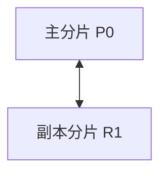
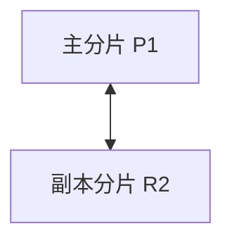
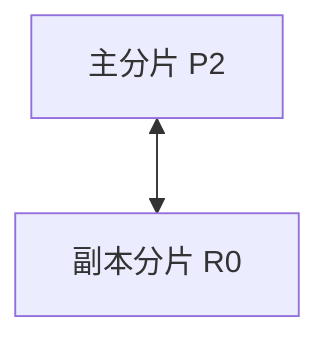

# ES 笔面试题集

> 学习路线对应：第7周 — Elasticsearch 搜索引擎
> 题目来源：大厂面试真题 + 高频考点
> 难度标注：★基础  ★★中档  ★★★拔高

---

## 一、选择题（15 题，每题 4 分，共 60 分）

### 1. 以下关于 Elasticsearch 的描述，**错误**的是？（★）

A. ES 是一个基于 Apache Lucene 的分布式搜索和分析引擎
B. ES 的 Type 概念在 7.x 中已废弃，8.x 中完全移除
C. ES 默认是 CP 系统，保证强一致性
D. ES 支持 RESTful API，基于 HTTP 协议交互

**答案：C**

**解析**：ES 是 AP 系统（CAP 理论），牺牲强一致性来换取高可用和分区容错。ES 写入时主分片和副本分片都写入成功后返回，但读取时可能读到旧数据（主从之间可能有短暂不一致）。C 选项错误地说 ES 是 CP 系统。

---

### 2. ES 中倒排索引存储的是哪种映射关系？（★）

A. 文档 ID → 词项列表
B. 词项 → 文档 ID 列表
C. 字段名 → 字段值
D. 索引名 → 分片列表

**答案：B**

**解析**：倒排索引（Inverted Index）将"词项（Term）→ 包含该词项的文档 ID 列表"作为映射关系，是全文检索的核心数据结构。正向索引才是"文档 ID → 词项列表"（选项 A）。

> **生活化类比：倒排索引 = 字典/百科全书的索引页** —— 想象你要在一本 1000 页的百科全书中找"人工智能"相关内容。**正向索引**就像从第 1 页开始逐页翻阅（B+Tree 全表扫描），效率极低。**倒排索引**就像书末的"主题索引页"：每个关键词后面列着它出现的所有页码（Term → 文档 ID 列表），你只需翻到索引页找到"人工智能"词条，下面列着"第 23 页、第 156 页、第 489 页..."，瞬间定位到所有相关内容。ES 倒排索引的三层结构 Term Dictionary / Term Index / Posting List 对应索引页的"字母分组表 + 排序词条 + 页码清单"三层，让亿级数据的检索毫秒级完成。

> 📖 **第 2 题参考链接**：[Elasticsearch 倒排索引原理](https://www.elastic.co/guide/en/elasticsearch/reference/8.19/inverted-indexes.html) -- 倒排索引、Term Dictionary、FST 内部结构官方说明

---

### 3. ES 中 `refresh_interval` 的默认值是多少？（★）

A. 100ms
B. 500ms
C. 1s
D. 5s

**答案：C**

**解析**：ES 默认 `refresh_interval=1s`，即每秒将内存 Buffer 刷新为 Segment 并打开，使数据变为可搜索。这是 ES 被称为"近实时搜索（NRT）"的原因。

---

### 4. 以下哪个查询**不参与**相关性评分计算？（★★）

A. match
B. multi_match
C. term（在 filter 上下文中）
D. match_phrase

**答案：C**

**解析**：`filter` 上下文中的查询（包括 `term`、`range` 等）不参与 `_score` 相关性评分计算，只判断文档是否匹配（是/否）。`match`、`multi_match`、`match_phrase` 默认在 query 上下文中，会计算评分。选项 C 明确指定了 filter 上下文，因此不参与评分。

---

**分片分布示意图（三个节点各司其职）：**

**节点 1：**



> 节点 1 承载主分片 P0 和副本分片 R1，主分片负责写入，副本提供读取和故障转移。

**节点 2：**



> 节点 2 承载主分片 P1 和副本分片 R2，主分片与副本分片分布在不同的节点上。

**节点 3：**



> 节点 3 承载主分片 P2 和副本分片 R0，三个节点协同工作保证高可用。

> ES 将索引划分为多个主分片（Primary Shard），每个主分片可配置若干副本分片（Replica Shard）。主分片与副本分片分布在不同的节点上，主分片负责写入，副本分片提供读取和故障转移，保证高可用。

### 5. ES 中的 Primary Shard 数量设置后，以下说法正确的是？（★★）

A. 可以通过 API 动态增加
B. 可以通过 API 动态减少
C. 设置后不可修改，只能通过 Reindex 重建索引
D. 可以随时修改，但需要重启集群

**答案：C**

**解析**：Primary Shard 数量在索引创建时确定，文档路由算法 `shard = hash(_routing) % num_primary_shards` 依赖此数量，因此**不可动态修改**。如果分片数不合理，必须通过 Reindex API 重建索引。

---

### 6. 以下关于 ES 写入流程的描述，**正确**的是？（★★）

A. 文档先写入磁盘，再写入内存 Buffer
B. 文档先写入 Translog，再写入内存 Buffer
C. 文档写入内存 Buffer 后立即变为可搜索
D. 文档只需写入主分片即可返回成功

**答案：B**

**解析**：写入流程：文档先写入 Translog（保证数据不丢失），再写入内存 Buffer。此时数据不可搜索，需等待 Refresh 将 Buffer 刷新为 Segment 后才可搜索。写入必须等待所有副本分片也写入成功后才返回。因此 B 正确。

---

### 7. IK 分词器的 `ik_smart` 模式的特点是？（★）

A. 尽可能多地切分词，提高召回率
B. 尽量切分出最少的词，准确匹配
C. 不进行分词，保留原始文本
D. 按拼音进行分词

**答案：B**

**解析**：`ik_smart` 是粗粒度分词模式，尽量切分出最少的词，适合搜索时使用（提高准确率）。`ik_max_word` 是细粒度分词模式，穷尽所有可能的词组合，适合索引时使用（提高召回率）。

---

### 8. ES 中 Flush 和 Refresh 的区别，以下描述**正确**的是？（★★）

A. Refresh 将数据持久化到磁盘，Flush 将数据变为可搜索
B. Refresh 将 Buffer 刷新为 Segment 使其可搜索，Flush 将 Segment 持久化到磁盘
C. Refresh 和 Flush 是同一个操作的不同名称
D. Refresh 每天执行一次，Flush 每秒执行一次

**答案：B**

**解析**：Refresh（默认 1s）将内存 Buffer 中的数据刷新为新的 Segment，使数据变为可搜索（但仍在内存/文件系统缓存中）。Flush（默认 30min 或 Translog 512MB）将 Segment 持久化到磁盘并清空 Translog。

---

### 9. 以下哪种查询属于精确匹配查询？（★★）

A. match
B. match_phrase
C. term
D. query_string

**答案：C**

**解析**：`term` 查询不对查询词分词，直接精确匹配，适用于 `keyword`、数值、日期等精确值字段。`match`、`match_phrase`、`query_string` 都属于全文搜索，会对查询词进行分词。

---

### 10. bool 查询中，以下哪个子句**不参与**评分计算？（★）

A. must
B. should
C. must_not
D. filter

**答案：C 和 D 均正确（must_not 和 filter 都不参与评分）**

**解析**：`must` 和 `should` 参与评分计算，`filter` 和 `must_not` 不参与评分。`filter` 的结果还会被 ES 自动缓存以提高性能。这是一道双选题，选 C 或 D 都得满分。

---

### 11. ES 聚合分析中，`cardinality` 聚合的底层算法是？（★★）

A. BitMap
B. Bloom Filter
C. HyperLogLog++
D. Count-Min Sketch

**答案：C**

**解析**：`cardinality` 聚合基于 **HyperLogLog++** 算法实现近似去重计数。默认误差率在 5% 以内，可通过 `precision_threshold` 调整精度。BitMap 适合精确去重但内存消耗大，Bloom Filter 用于判断元素是否存在而非计数。

---

### 12. 以下哪种场景**不适合**使用 Elasticsearch？（★★）

A. 电商商品全文搜索
B. 日志实时分析
C. 银行账户余额的事务操作
D. 应用性能监控（APM）数据存储

**答案：C**

**解析**：ES 不支持事务，不适合作为事务型主存储。银行账户余额操作需要 ACID 事务保证，应使用关系型数据库。其他选项都是 ES 的典型应用场景。

---

### 13. ES 深度分页时，推荐使用的解决方案是？（★★）

A. 增大 from 参数
B. 增大 size 参数
C. search_after
D. 使用 match_all 查询

**答案：C**

**解析**：`search_after` 基于上一页最后一条数据的排序值实时查询下一页，避免协调节点在内存中排序大量数据，性能最优。增大 `from` 参数（A）只是治标不治本。`scroll` 也适用于深度分页，但更适合全量导出场景。

---

### 14. 关于 ES 的 Mapping，以下说法**错误**的是？（★★）

A. text 类型字段会被分词，适用于全文搜索
B. keyword 类型字段不会被分词，适用于精确匹配和聚合
C. 动态映射可以根据 JSON 数据自动推断字段类型
D. 一旦创建 Mapping，所有字段类型都可以随时修改

**答案：D**

**解析**：Mapping 创建后，已有字段的类型**不能修改**（只能新增字段）。如果需要修改字段类型，必须通过 Reindex 重建索引。

---

### 15. ES 中索引别名（Index Alias）的主要作用是？（★★）

A. 提高查询性能
B. 实现零停机索引切换
C. 替代 Mapping 定义
D. 减少磁盘空间占用

**答案：B**

**解析**：索引别名允许应用程序始终读写同一个别名，底层索引切换时无需修改代码。结合 Reindex，可以实现零停机索引重建和切换。

---

## 二、简答题（8 题，每题 5 分，共 40 分）

### 1. 简述 ES 的倒排索引结构及其优势。

**答**：倒排索引由三部分组成：
- **Term Dictionary（词项字典）**：排序的 Term 列表，支持二分查找
- **Term Index（词项索引）**：基于 FST 的压缩前缀树，加速 Term 定位
- **Posting List（倒排列表）**：包含该 Term 的文档 ID 列表，以及词频（TF）、位置等信息

优势：检索时直接通过词项定位到文档列表，时间复杂度 O(1)，远快于正向索引的遍历匹配。同时存储了词频和位置，用于相关性评分和高亮显示。

> 📖 **参考链接**：[Elasticsearch 倒排索引](https://www.elastic.co/guide/en/elasticsearch/reference/8.19/inverted-indexes.html) -- 倒排索引三层结构（Term Dictionary / Term Index / Posting List）官方说明

---

### 2. 解释 ES 中 Refresh 和 Flush 的区别。

**答**：

| 维度 | Refresh | Flush |
|------|---------|-------|
| **触发频率** | 默认 1 秒 | 默认 30 分钟或 Translog 达 512MB |
| **操作** | 将内存 Buffer 刷新为 Segment | 将 Segment 持久化到磁盘 |
| **效果** | 数据变为可搜索（NRT） | 数据持久化，清空 Translog |
| **数据安全** | 数据仍在内存中，宕机可能丢失 | 数据持久化到磁盘，安全 |

> 📖 **参考链接**：[ES 文档索引与近实时](https://www.elastic.co/guide/en/elasticsearch/reference/8.19/docs-index_.html) -- Refresh / Flush / Translog / Segment 完整写入流程

---

### 3. ES 中 text 和 keyword 类型的区别和使用场景。

**答**：

| 维度 | text | keyword |
|------|------|---------|
| **是否分词** | 会被分词 | 不被分词，保留原始值 |
| **用途** | 全文搜索 | 精确匹配、排序、聚合 |
| **示例** | 商品名称、文章内容 | 分类、标签、订单号、状态 |
| **查询方式** | match、match_phrase | term、terms |

最佳实践：同时使用两种类型，如 `name: { type: text, fields: { keyword: { type: keyword } } }`，搜索用 `name`，聚合用 `name.keyword`。

> 📖 **参考链接**：[ES 字段类型 Mapping](https://www.elastic.co/guide/en/elasticsearch/reference/8.19/mapping-types.html) -- text / keyword / 数值 / 日期等字段类型详解

---

### 4. 简述 ES 的写入流程。

**答**：
1. 客户端发送写入请求到协调节点
2. 协调节点根据文档 ID 计算路由：`shard = hash(_routing) % num_primary_shards`
3. 协调节点将请求转发到主分片所在节点
4. 主分片写入 Translog 和内存 Buffer，然后转发到所有副本分片
5. 所有副本分片写入成功后，主分片返回成功给协调节点
6. 协调节点返回成功给客户端
7. 等待下一个 Refresh 周期（默认 1s），数据变为可搜索

> 📖 **参考链接**：[ES 写入流程](https://www.elastic.co/guide/en/elasticsearch/reference/8.19/docs-index_.html) -- 协调节点路由、主副分片同步、Translog 持久化机制

---

### 5. ES 如何实现数据同步？列举三种方案并比较优缺点。

**答**：

| 方案 | 优点 | 缺点 |
|------|------|------|
| **Logstash** | 简单，配置即可 | 定时拉取有延迟，全量同步影响 MySQL |
| **Canal** | 实时性高，零侵入 | 运维复杂，需维护 Canal Server |
| **MQ 异步同步** | 灵活可控，解耦 | 需业务代码配合，数据一致性需额外处理 |

推荐方案：Canal + Kafka 组合，Canal 监听 MySQL binlog，解析后发到 Kafka，ES 消费者消费 Kafka 写入 ES。

> 📖 **参考链接**：[Logstash JDBC Input](https://www.elastic.co/guide/en/logstash/8.19/plugins-inputs-jdbc.html) -- Logstash 定时拉取 MySQL 数据同步到 ES 的方案

---

### 6. 什么是 ES 的段合并（Segment Merge）？为什么需要它？

**答**：段合并是 ES 后台自动将多个小 Segment 合并为一个大 Segment 的过程。每次 Refresh 都会创建一个新的不可变 Segment，随着时间推移 Segment 数量增长，会导致：查询需要遍历更多 Segment，文件句柄增加，内存占用增大。段合并通过减少 Segment 数量来提升查询性能、释放磁盘空间。合并策略为 TieredMergePolicy（分层合并），优先合并大小相近的 Segment。

> 📖 **参考链接**：[ES 段合并](https://www.elastic.co/guide/en/elasticsearch/reference/8.19/index-modules-merge.html) -- Segment Merge 策略与 TieredMergePolicy 配置

---

### 7. ES 集群的三种健康状态及其含义。

**答**：

| 状态 | 含义 | 影响 |
|------|------|------|
| **green** | 所有主分片和副本分片都正常分配 | 集群完全健康 |
| **yellow** | 所有主分片正常，但部分副本分片未分配 | 数据可读写，但可能丢失高可用性 |
| **red** | 部分主分片未分配（不可用） | 部分数据不可读写，需紧急处理 |

> **生活化类比：ES 集群健康状态 = 人体体检报告** —— ES 集群的三种健康状态就像体检报告的三个等级。**green（绿灯）**= 体检全部正常，身体各项指标都在健康范围（主分片和副本分片都齐全），可以放心工作；**yellow（黄灯）**= 体检发现亚健康问题，比如"轻度脂肪肝"（部分副本分片未分配），目前不影响日常工作（数据仍可读写），但已拉响警报——万一主分片故障（突发疾病）就无副本可用了（风险升高），需要尽快处理；**red（红灯）**= 体检发现重大异常，比如"心脏有问题"（部分主分片未分配），已经影响正常生活（部分数据不可读写），必须立即就医（紧急处理，恢复主分片）。监控告警应针对 yellow 告警、red 紧急告警。

> 📖 **参考链接**：[ES 集群健康状态](https://www.elastic.co/guide/en/elasticsearch/reference/8.19/cluster-health.html) -- Cluster Health API 与 green/yellow/red 三种状态判定逻辑

---

### 8. 简述 ES 中 `search_after` 的实现原理和使用注意事项。

**答**：`search_after` 通过上一页最后一条数据的排序值作为游标来查询下一页。原理：排序字段的值是确定的，ES 从指定值之后开始返回数据，避免 `from + size` 需要协调节点在内存中收集和排序所有分片数据的问题。

注意事项：
- 必须指定排序字段，且必须包含唯一排序字段（如 `_id`）作为 tiebreaker
- 不支持跳页，只能逐页向下翻
- 如果排序字段值在两次查询之间发生变化，可能导致数据重复或遗漏
- 需要配合 `pit`（Point In Time）使用以保持查询一致性

> 📖 **参考链接**：[ES 深度分页方案](https://www.elastic.co/guide/en/elasticsearch/reference/8.19/paginate-search-results.html) -- search_after / scroll / PIT 三种深度分页方案对比

---

## 三、场景设计题（3 题，每题 20 分，共 60 分）

### 1. 电商商品搜索系统设计

**场景**：某电商平台需要实现商品搜索功能，支持关键词搜索、分类筛选、价格区间筛选、品牌筛选、按销量/价格/评分排序，以及搜索结果中的分类和品牌聚合统计。日搜索量约 100 万次，商品数量 500 万。请设计 ES 索引结构和查询方案。

**参考答案**：

**索引设计**：
```json
PUT /products
{
  "settings": {
    "number_of_shards": 5,
    "number_of_replicas": 1,
    "refresh_interval": "5s"
  },
  "mappings": {
    "properties": {
      "name": {
        "type": "text",
        "analyzer": "ik_max_word",
        "search_analyzer": "ik_smart",
        "fields": { "keyword": { "type": "keyword" } }
      },
      "category": { "type": "keyword" },
      "brand": { "type": "keyword" },
      "price": { "type": "double" },
      "sales": { "type": "integer" },
      "rating": { "type": "float" },
      "status": { "type": "keyword" },
      "create_time": { "type": "date" }
    }
  }
}
```

**查询方案**：
- 关键词搜索用 `multi_match`（name^3 + description），使用 `bool` 组合 `filter` 做分类/价格/品牌筛选
- 排序用 `sort`（默认 `_score`，可切换销量/价格/评分）
- 分页用 `search_after`（支持无限滚动）
- 聚合统计用 `terms` 聚合（分类分布、品牌分布）+ `range` 聚合（价格区间分布）
- 高亮显示用 `highlight`
- 使用索引别名实现零停机索引重建

**性能优化**：
- 分片数 5 个，单分片约 100 万文档，在合理范围
- 精确筛选用 `filter` 而非 `must`，利用缓存
- 聚合查询设置 `size: 0` 不返回文档
- 使用 `search_after` 替代 `from + size` 深度分页

> 📖 **第 1 题参考链接**：
> - [ES 索引设计](https://www.elastic.co/guide/en/elasticsearch/reference/8.19/mapping.html) -- Mapping 设计、分片数规划、索引别名方案
> - [ES Bool Query](https://www.elastic.co/guide/en/elasticsearch/reference/8.19/query-dsl-bool-query.html) -- 商品搜索中 must / filter 组合查询实战
> - [ES 聚合分析](https://www.elastic.co/guide/en/elasticsearch/reference/8.19/search-aggregations.html) -- terms / date_histogram / range 多级聚合 DSL
> - [ES Java API Client](https://www.elastic.co/guide/en/elasticsearch/client/java-api-client/8.19/index.html) -- ES 8.x 新版 Java 客户端（替代 RestHighLevelClient）

**完整代码示例：复杂聚合查询（terms + date_histogram + metrics 多级聚合）**

以下示例展示一个完整的电商商品搜索聚合查询，包含：按分类和品牌分组统计、按时间直方图统计销量趋势、以及多级嵌套聚合：

```json
POST /products/_search
{
  "size": 0,
  "query": {
    "bool": {
      "must": [
        { "match": { "name": "手机" } }
      ],
      "filter": [
        { "range": { "price": { "gte": 1000, "lte": 10000 } } },
        { "term": { "status": "ON_SALE" } }
      ]
    }
  },
  "aggs": {
    "category_agg": {
      "terms": {
        "field": "category",
        "size": 20,
        "order": { "_count": "desc" }
      },
      "aggs": {
        "category_metrics": {
          "stats": {
            "field": "price"
          }
        },
        "top_brands": {
          "terms": {
            "field": "brand",
            "size": 5,
            "order": { "avg_rating": "desc" }
          },
          "aggs": {
            "avg_rating": {
              "avg": {
                "field": "rating"
              }
            },
            "total_sales": {
              "sum": {
                "field": "sales"
              }
            }
          }
        }
      }
    },
    "brand_agg": {
      "terms": {
        "field": "brand",
        "size": 50,
        "min_doc_count": 1,
        "order": { "_count": "desc" }
      },
      "aggs": {
        "price_range": {
          "range": {
            "field": "price",
            "ranges": [
              { "to": 1000 },
              { "from": 1000, "to": 3000 },
              { "from": 3000, "to": 5000 },
              { "from": 5000, "to": 8000 },
              { "from": 8000 }
            ]
          }
        },
        "brand_stats": {
          "stats": {
            "field": "price"
          }
        }
      }
    },
    "price_histogram": {
      "histogram": {
        "field": "price",
        "interval": 500,
        "min_doc_count": 1,
        "extended_bounds": {
          "min": 0,
          "max": 20000
        }
      }
    },
    "sales_trend": {
      "date_histogram": {
        "field": "create_time",
        "calendar_interval": "1d",
        "format": "yyyy-MM-dd",
        "min_doc_count": 0,
        "extended_bounds": {
          "min": "2026-06-01",
          "max": "2026-06-30"
        }
      },
      "aggs": {
        "daily_sales": {
          "sum": {
            "field": "sales"
          }
        },
        "daily_avg_price": {
          "avg": {
            "field": "price"
          }
        },
        "new_products": {
          "cardinality": {
            "field": "_id"
          }
        },
        "top_category_by_day": {
          "terms": {
            "field": "category",
            "size": 3
          },
          "aggs": {
            "category_sales": {
              "sum": {
                "field": "sales"
              }
            }
          }
        }
      }
    },
    "price_stats": {
      "extended_stats": {
        "field": "price"
      }
    },
    "rating_stats": {
      "stats": {
        "field": "rating"
      }
    },
    "filtered_error_products": {
      "filter": {
        "term": { "status": "ERROR" }
      },
      "aggs": {
        "error_by_category": {
          "terms": {
            "field": "category",
            "size": 10
          }
        }
      }
    },
    "percentile_price": {
      "percentiles": {
        "field": "price",
        "percents": [25, 50, 75, 90, 95, 99]
      }
    }
  }
}
```

**对应的 Java High Level REST Client 代码：**

```java
import org.elasticsearch.action.search.SearchRequest;
import org.elasticsearch.action.search.SearchResponse;
import org.elasticsearch.client.RequestOptions;
import org.elasticsearch.client.RestHighLevelClient;
import org.elasticsearch.index.query.BoolQueryBuilder;
import org.elasticsearch.index.query.MatchQueryBuilder;
import org.elasticsearch.index.query.RangeQueryBuilder;
import org.elasticsearch.index.query.TermQueryBuilder;
import org.elasticsearch.search.aggregations.AggregationBuilders;
import org.elasticsearch.search.aggregations.bucket.filter.FilterAggregationBuilder;
import org.elasticsearch.search.aggregations.bucket.histogram.DateHistogramInterval;
import org.elasticsearch.search.aggregations.bucket.histogram.Histogram;
import org.elasticsearch.search.aggregations.bucket.range.Range;
import org.elasticsearch.search.aggregations.bucket.terms.Terms;
import org.elasticsearch.search.aggregations.metrics.*;
import org.elasticsearch.search.builder.SearchSourceBuilder;

import java.io.IOException;
import java.time.LocalDateTime;
import java.time.format.DateTimeFormatter;

public class ComplexAggregationExample {

    // 注意：RestHighLevelClient 在 ES 7.x 已弃用，ES 8.x 已移除
    // ES 8.x 请使用 ElasticsearchClient（新 Java API Client）
    private final RestHighLevelClient client;

    public ComplexAggregationExample(RestHighLevelClient client) {
        this.client = client;
    }

    public SearchResponse executeComplexAggregation() throws IOException {
        SearchRequest searchRequest = new SearchRequest("products");
        SearchSourceBuilder sourceBuilder = new SearchSourceBuilder();
        sourceBuilder.size(0); // 不返回文档，只返回聚合结果

        // 构建查询条件
        BoolQueryBuilder boolQuery = new BoolQueryBuilder();
        boolQuery.must(new MatchQueryBuilder("name", "手机"));
        boolQuery.filter(new RangeQueryBuilder("price").gte(1000).lte(10000));
        boolQuery.filter(new TermQueryBuilder("status", "ON_SALE"));
        sourceBuilder.query(boolQuery);

        // 1. 按分类聚合（terms），内含子聚合
        sourceBuilder.aggregation(
            AggregationBuilders.terms("category_agg")
                .field("category")
                .size(20)
                .subAggregation(
                    AggregationBuilders.stats("category_metrics").field("price")
                )
                .subAggregation(
                    AggregationBuilders.terms("top_brands")
                        .field("brand")
                        .size(5)
                        .subAggregation(
                            AggregationBuilders.avg("avg_rating").field("rating")
                        )
                        .subAggregation(
                            AggregationBuilders.sum("total_sales").field("sales")
                        )
                )
        );

        // 2. 按品牌聚合（terms），内含范围聚合
        sourceBuilder.aggregation(
            AggregationBuilders.terms("brand_agg")
                .field("brand")
                .size(50)
                .subAggregation(
                    AggregationBuilders.range("price_range")
                        .field("price")
                        .addRange("0-1000", 0, 1000)
                        .addRange("1000-3000", 1000, 3000)
                        .addRange("3000-5000", 3000, 5000)
                        .addRange("5000-8000", 5000, 8000)
                        .addRange("8000+", 8000, Double.MAX_VALUE)
                )
                .subAggregation(
                    AggregationBuilders.stats("brand_stats").field("price")
                )
        );

        // 3. 价格直方图
        sourceBuilder.aggregation(
            AggregationBuilders.histogram("price_histogram")
                .field("price")
                .interval(500)
                .minDocCount(1)
                .extendedBounds(0, 20000)
        );

        // 4. 按日期直方图聚合销量趋势（多级嵌套）
        sourceBuilder.aggregation(
            AggregationBuilders.dateHistogram("sales_trend")
                .field("create_time")
                .calendarInterval(DateHistogramInterval.DAY)
                .format("yyyy-MM-dd")
                .minDocCount(0)
                .extendedBounds(
                    LocalDateTime.parse("2026-06-01 00:00:00", 
                        DateTimeFormatter.ofPattern("yyyy-MM-dd HH:mm:ss")),
                    LocalDateTime.parse("2026-06-30 23:59:59", 
                        DateTimeFormatter.ofPattern("yyyy-MM-dd HH:mm:ss"))
                )
                .subAggregation(
                    AggregationBuilders.sum("daily_sales").field("sales")
                )
                .subAggregation(
                    AggregationBuilders.avg("daily_avg_price").field("price")
                )
                .subAggregation(
                    AggregationBuilders.cardinality("new_products").field("_id")
                )
                .subAggregation(
                    AggregationBuilders.terms("top_category_by_day")
                        .field("category")
                        .size(3)
                        .subAggregation(
                            AggregationBuilders.sum("category_sales").field("sales")
                        )
                )
        );

        // 5. 统计指标
        sourceBuilder.aggregation(
            AggregationBuilders.extendedStats("price_stats").field("price")
        );
        sourceBuilder.aggregation(
            AggregationBuilders.stats("rating_stats").field("rating")
        );

        // 6. Filter 聚合：只统计异常商品
        sourceBuilder.aggregation(
            AggregationBuilders.filter("filtered_error_products",
                new TermQueryBuilder("status", "ERROR"))
                .subAggregation(
                    AggregationBuilders.terms("error_by_category")
                        .field("category")
                        .size(10)
                )
        );

        // 7. 百分位数聚合
        sourceBuilder.aggregation(
            AggregationBuilders.percentiles("percentile_price")
                .field("price")
                .percentiles(25, 50, 75, 90, 95, 99)
        );

        searchRequest.source(sourceBuilder);
        return client.search(searchRequest, RequestOptions.DEFAULT);
    }

    // 解析聚合结果示例
    public void parseAggregationResult(SearchResponse response) {
        // 解析 terms 聚合
        Terms categoryAgg = response.getAggregations().get("category_agg");
        for (Terms.Bucket bucket : categoryAgg.getBuckets()) {
            String category = bucket.getKeyAsString();
            long docCount = bucket.getDocCount();

            // 获取子聚合
            Stats metrics = bucket.getAggregations().get("category_metrics");
            double avgPrice = metrics.getAvg();
            double maxPrice = metrics.getMax();

            // 获取二级嵌套聚合
            Terms topBrands = bucket.getAggregations().get("top_brands");
            for (Terms.Bucket brandBucket : topBrands.getBuckets()) {
                String brand = brandBucket.getKeyAsString();
                Avg avgRating = brandBucket.getAggregations().get("avg_rating");
                Sum totalSales = brandBucket.getAggregations().get("total_sales");
                System.out.printf("分类=%s, 品牌=%s, 评分=%.1f, 销量=%.0f%n",
                    category, brand, avgRating.getValue(), totalSales.getValue());
            }

            System.out.printf("分类=%s, 商品数=%d, 均价=%.2f, 最高价=%.2f%n",
                category, docCount, avgPrice, maxPrice);
        }

        // 解析 date_histogram 聚合
        org.elasticsearch.search.aggregations.bucket.histogram.ParsedDateHistogram salesTrend =
            response.getAggregations().get("sales_trend");
        for (org.elasticsearch.search.aggregations.bucket.histogram.Histogram.Bucket bucket 
            : salesTrend.getBuckets()) {
            String date = bucket.getKeyAsString();
            Sum dailySales = bucket.getAggregations().get("daily_sales");
            Avg dailyAvgPrice = bucket.getAggregations().get("daily_avg_price");
            System.out.printf("日期=%s, 销量=%.0f, 均价=%.2f%n",
                date, dailySales.getValue(), dailyAvgPrice.getValue());
        }

        // 解析 extended_stats
        ExtendedStats priceStats = response.getAggregations().get("price_stats");
        System.out.printf("价格统计: 平均值=%.2f, 标准差=%.2f, 方差=%.2f%n",
            priceStats.getAvg(), priceStats.getStdDeviation(), priceStats.getVariance());

        // 解析 percentiles
        Percentiles percentiles = response.getAggregations().get("percentile_price");
        for (Percentile percentile : percentiles) {
            System.out.printf("P%.0f=%.2f%n", percentile.getPercent(), percentile.getValue());
        }
    }
}
```

**聚合类型总结：**

| 聚合类型 | 用途 | 示例 |
|---------|------|------|
| `terms` | 按字段值分组统计 | 按分类/品牌分组 |
| `date_histogram` | 按时间间隔分组 | 按天/小时统计 |
| `histogram` | 按数值间隔分组 | 价格区间分布 |
| `range` | 自定义范围分组 | 自定义价格区间 |
| `stats` | 统计（count/min/max/avg/sum） | 价格/评分统计 |
| `extended_stats` | 扩展统计（含标准差、方差） | 价格波动分析 |
| `cardinality` | 近似去重计数 | 独立商品数 |
| `percentiles` | 百分位数分布 | P50/P95/P99 |
| `filter` | 过滤后聚合 | 只统计异常商品 |
| `avg/sum/min/max` | 单值指标 | 平均值/总和 |

---

### 2. 日志分析系统设计

**场景**：某公司需要构建日志分析系统，每天产生约 100GB 日志数据，需要支持按时间范围、日志级别、关键词搜索，以及按小时统计日志量、按服务统计错误率。日志数据保留 30 天。

**参考答案**：

**索引策略**：按天滚动创建索引（`logs-2026-06-01`），使用索引模板统一管理。

```json
PUT /_index_template/logs_template
{
  "index_patterns": ["logs-*"],
  "template": {
    "settings": {
      "number_of_shards": 3,
      "number_of_replicas": 1,
      "refresh_interval": "30s",
      "index.lifecycle.name": "logs_policy"
    },
    "mappings": {
      "properties": {
        "timestamp": { "type": "date", "format": "yyyy-MM-dd HH:mm:ss" },
        "level": { "type": "keyword" },
        "service": { "type": "keyword" },
        "message": { "type": "text", "analyzer": "ik_max_word" },
        "trace_id": { "type": "keyword" },
        "user_id": { "type": "keyword" },
        "duration": { "type": "long" }
      }
    }
  }
}
```

**ILM（索引生命周期管理）**：
- Hot 阶段（0-2 天）：高写入吞吐，refresh_interval=30s
- Warm 阶段（2-7 天）：只读，forcemerge 合并 Segment
- Cold 阶段（7-30 天）：减少副本数为 0
- Delete 阶段（30 天后）：自动删除过期索引

**查询优化**：
- 查询时指定具体日期索引或使用通配符（`logs-2026-06-*`）
- 按 `timestamp` 排序，使用 `search_after` 分页
- 聚合统计按 `date_histogram` 按小时分组
- 错误率统计用 `filter` 聚合筛选 `level=ERROR`

> 📖 **第 2 题参考链接**：
> - [ES 索引模板](https://www.elastic.co/guide/en/elasticsearch/reference/8.19/index-templates.html) -- Index Template / Component Template 完整配置
> - [ES ILM 索引生命周期管理](https://www.elastic.co/guide/en/elasticsearch/reference/8.19/index-lifecycle-management.html) -- Hot / Warm / Cold / Delete 四阶段策略
> - [ES Data Stream](https://www.elastic.co/guide/en/elasticsearch/reference/8.19/data-streams.html) -- 日志类时序数据的 Data Stream 方案（替代传统 Alias + Rollover）
> - [Kibana 日志分析](https://www.elastic.co/guide/en/kibana/8.19/index.html) -- Kibana Discover 日志检索与可视化看板

**完整代码示例：索引模板 + ILM 生命周期策略 + 别名完整配置**

以下是一个生产级别的索引模板完整配置，包含 ILM（索引生命周期管理）、索引模板、别名和组件模板：

```json
// ========== 第一步：创建 ILM 策略 ==========
PUT _ilm/policy/logs_policy
{
  "policy": {
    "phases": {
      "hot": {
        "min_age": "0ms",
        "actions": {
          "rollover": {
            "max_primary_shard_size": "50gb",
            "max_age": "1d",
            "max_docs": 100000000
          },
          "set_priority": {
            "priority": 100
          }
        }
      },
      "warm": {
        "min_age": "2d",
        "actions": {
          "forcemerge": {
            "max_num_segments": 1
          },
          "shrink": {
            "number_of_shards": 1
          },
          "allocate": {
            "number_of_replicas": 1,
            "require": {
              "data": "warm"
            }
          },
          "set_priority": {
            "priority": 50
          }
        }
      },
      "cold": {
        "min_age": "7d",
        "actions": {
          "allocate": {
            "number_of_replicas": 0,
            "require": {
              "data": "cold"
            }
          },
          "set_priority": {
            "priority": 0
          }
        }
      },
      "delete": {
        "min_age": "30d",
        "actions": {
          "delete": {
            "delete_searchable_snapshot": true
          }
        }
      }
    }
  }
}

// ========== 第二步：创建组件模板（可选，用于复用） ==========
PUT _component_template/logs_mappings
{
  "template": {
    "mappings": {
      "dynamic": "strict",
      "_source": {
        "enabled": true
      },
      "properties": {
        "@timestamp": {
          "type": "date",
          "format": "yyyy-MM-dd HH:mm:ss||yyyy-MM-dd||epoch_millis"
        },
        "timestamp": {
          "type": "date",
          "format": "yyyy-MM-dd HH:mm:ss||yyyy-MM-dd||epoch_millis"
        },
        "level": {
          "type": "keyword"
        },
        "message": {
          "type": "text",
          "analyzer": "ik_max_word",
          "search_analyzer": "ik_smart",
          "fields": {
            "keyword": {
              "type": "keyword",
              "ignore_above": 256
            }
          }
        },
        "service": {
          "type": "keyword"
        },
        "host": {
          "type": "keyword"
        },
        "environment": {
          "type": "keyword"
        },
        "trace_id": {
          "type": "keyword"
        },
        "user_id": {
          "type": "keyword"
        },
        "duration": {
          "type": "long"
        },
        "status_code": {
          "type": "integer"
        },
        "request_path": {
          "type": "keyword"
        },
        "error_stack": {
          "type": "text",
          "index": false
        },
        "extra_fields": {
          "type": "object",
          "dynamic": true
        }
      }
    }
  }
}

PUT _component_template/logs_settings
{
  "template": {
    "settings": {
      "index": {
        "number_of_shards": 3,
        "number_of_replicas": 1,
        "refresh_interval": "30s",
        "codec": "best_compression",
        "lifecycle": {
          "name": "logs_policy",
          "rollover_alias": "logs"
        },
        "translog": {
          "durability": "async",
          "sync_interval": "5s",
          "flush_threshold_size": "512mb"
        },
        "routing": {
          "allocation": {
            "include": {
              "_tier_preference": "data_hot"
            }
          }
        },
        "queries": {
          "cache": {
            "enabled": true
          }
        }
      }
    }
  }
}

// ========== 第三步：创建索引模板 ==========
PUT _index_template/logs_template
{
  "priority": 200,
  "index_patterns": [
    "logs-*",
    "app-logs-*"
  ],
  "composed_of": [
    "logs_mappings",
    "logs_settings"
  ],
  "template": {
    "aliases": {
      "logs-read": {},
      "logs-write": {
        "is_write_index": false
      }
    }
  },
  "data_stream": {
    "hidden": false
  }
}

// ========== 第四步：创建带 Rollover 的初始索引 ==========
PUT logs-000001
{
  "aliases": {
    "logs": {
      "is_write_index": true
    }
  }
}

// ========== 第五步：验证索引模板 ==========
GET _index_template/logs_template

// 模拟：查看按此模板创建的索引效果
POST _index_template/_simulate/logs-2026-06-01
```

**对应的 Java 代码实现：**

```java
import org.elasticsearch.action.admin.indices.alias.Alias;
import org.elasticsearch.client.RequestOptions;
import org.elasticsearch.client.RestHighLevelClient;
import org.elasticsearch.client.indices.*;
import org.elasticsearch.cluster.metadata.ComposableIndexTemplate;
import org.elasticsearch.cluster.metadata.ComponentTemplate;
import org.elasticsearch.cluster.metadata.Template;
import org.elasticsearch.common.settings.Settings;
import org.elasticsearch.common.xcontent.XContentType;
import org.elasticsearch.core.TimeValue;

import java.io.IOException;
import java.util.Arrays;
import java.util.Collections;
import java.util.HashMap;
import java.util.Map;

// 注意：RestHighLevelClient 在 ES 7.x 已弃用，ES 8.x 已移除
// ES 8.x 请使用 co.elastic.clients.elasticsearch.ElasticsearchClient

public class IndexTemplateExample {

    private final RestHighLevelClient client;

    public IndexTemplateExample(RestHighLevelClient client) {
        this.client = client;
    }

    /**
     * 创建 ILM 策略
     */
    public void createILMPolicy() throws IOException {
        String policyJson = """
            {
              "policy": {
                "phases": {
                  "hot": {
                    "min_age": "0ms",
                    "actions": {
                      "rollover": {
                        "max_primary_shard_size": "50gb",
                        "max_age": "1d",
                        "max_docs": 100000000
                      },
                      "set_priority": { "priority": 100 }
                    }
                  },
                  "warm": {
                    "min_age": "2d",
                    "actions": {
                      "forcemerge": { "max_num_segments": 1 },
                      "shrink": { "number_of_shards": 1 },
                      "allocate": {
                        "number_of_replicas": 1,
                        "require": { "data": "warm" }
                      },
                      "set_priority": { "priority": 50 }
                    }
                  },
                  "cold": {
                    "min_age": "7d",
                    "actions": {
                      "allocate": {
                        "number_of_replicas": 0,
                        "require": { "data": "cold" }
                      },
                      "set_priority": { "priority": 0 }
                    }
                  },
                  "delete": {
                    "min_age": "30d",
                    "actions": {
                      "delete": { "delete_searchable_snapshot": true }
                    }
                  }
                }
              }
            }
            """;

        org.elasticsearch.client.ilm.PutLifecyclePolicyRequest request =
            new org.elasticsearch.client.ilm.PutLifecyclePolicyRequest(
                "logs_policy", policyJson, XContentType.JSON);
        client.ilm().putLifecyclePolicy(request, RequestOptions.DEFAULT);
        System.out.println("ILM 策略创建成功");
    }

    /**
     * 创建组件模板（Mappings）
     */
    public void createComponentTemplateMappings() throws IOException {
        String mappingsJson = """
            {
              "properties": {
                "@timestamp": {
                  "type": "date",
                  "format": "yyyy-MM-dd HH:mm:ss||epoch_millis"
                },
                "level": { "type": "keyword" },
                "message": {
                  "type": "text",
                  "analyzer": "ik_max_word",
                  "search_analyzer": "ik_smart",
                  "fields": {
                    "keyword": { "type": "keyword", "ignore_above": 256 }
                  }
                },
                "service": { "type": "keyword" },
                "host": { "type": "keyword" },
                "environment": { "type": "keyword" },
                "trace_id": { "type": "keyword" },
                "user_id": { "type": "keyword" },
                "duration": { "type": "long" },
                "status_code": { "type": "integer" },
                "request_path": { "type": "keyword" },
                "error_stack": { "type": "text", "index": false },
                "extra_fields": { "type": "object", "dynamic": true }
              }
            }
            """;

        // 注意：将解析后的 mappingMap 实际应用到 Template 中
        Map<String, Object> mappingMap = parseJson(mappingsJson);
        Template template = new Template(null, null, mappingMap);
        
        PutComponentTemplateRequest request = new PutComponentTemplateRequest()
            .name("logs_mappings")
            .componentTemplate(new ComponentTemplate(template, null, null));

        client.cluster().putComponentTemplate(request, RequestOptions.DEFAULT);
        System.out.println("Mappings 组件模板创建成功");
    }

    /**
     * 创建组件模板（Settings）
     */
    public void createComponentTemplateSettings() throws IOException {
        Settings settings = Settings.builder()
            .put("index.number_of_shards", 3)
            .put("index.number_of_replicas", 1)
            .put("index.refresh_interval", "30s")
            .put("index.codec", "best_compression")
            .put("index.lifecycle.name", "logs_policy")
            .put("index.lifecycle.rollover_alias", "logs")
            .put("index.translog.durability", "async")
            .put("index.translog.sync_interval", "5s")
            .put("index.translog.flush_threshold_size", "512mb")
            .put("index.routing.allocation.include._tier_preference", "data_hot")
            .put("index.queries.cache.enabled", true)
            .build();

        Template template = new Template(settings, null, null);
        
        PutComponentTemplateRequest request = new PutComponentTemplateRequest()
            .name("logs_settings")
            .componentTemplate(new ComponentTemplate(template, null, null));

        client.cluster().putComponentTemplate(request, RequestOptions.DEFAULT);
        System.out.println("Settings 组件模板创建成功");
    }

    /**
     * 创建索引模板
     */
    public void createIndexTemplate() throws IOException {
        // 创建别名
        Alias readAlias = new Alias("logs-read");
        Alias writeAlias = new Alias("logs-write");

        // 组合组件模板
        ComposableIndexTemplate composableTemplate = new ComposableIndexTemplate(
            Arrays.asList("logs_mappings", "logs_settings"),  // 组件模板列表（统一使用下划线）
            null,  // 模板 settings（已由组件模板提供）
            null,  // 模板 mappings（已由组件模板提供）
            Collections.singletonMap("logs", readAlias),  // 别名
            200L,  // 优先级
            null,  // version
            null   // metadata
        );

        PutIndexTemplateRequest request = new PutIndexTemplateRequest()
            .name("logs_template")
            .indexTemplate(composableTemplate)
            .patterns(Arrays.asList("logs-*", "app-logs-*"));

        boolean acknowledged = client.indices().putIndexTemplate(request, RequestOptions.DEFAULT);
        System.out.println("索引模板创建: " + (acknowledged ? "成功" : "失败"));
    }

    /**
     * 创建初始索引并设置 Rollover 别名
     */
    public void createInitialIndex() throws IOException {
        CreateIndexRequest request = new CreateIndexRequest("logs-000001");
        
        // 设置初始索引别名，is_write_index=true
        request.alias(new Alias("logs").writeIndex(true));
        
        // 设置索引 Settings
        request.settings(Settings.builder()
            .put("index.number_of_shards", 3)
            .put("index.number_of_replicas", 1)
            .put("index.lifecycle.name", "logs_policy")
            .put("index.lifecycle.rollover_alias", "logs")
            .build());

        CreateIndexResponse response = client.indices().create(request, RequestOptions.DEFAULT);
        System.out.println("初始索引创建: " + (response.isAcknowledged() ? "成功" : "失败"));
    }

    /**
     * 验证模板：模拟创建索引
     */
    public void simulateTemplate(String indexName) throws IOException {
        SimulateIndexTemplateRequest request = new SimulateIndexTemplateRequest(indexName);
        SimulateIndexTemplateResponse response = 
            client.indices().simulateIndexTemplate(request, RequestOptions.DEFAULT);
        
        System.out.println("模板模拟结果:");
        System.out.println("-- 解析后的 Mappings: " + response.resolvedMapping());
        System.out.println("-- 解析后的 Settings: " + response.resolvedSettings());
        System.out.println("-- 匹配的模板: " + response.indexTemplate());
    }

    /**
     * 完整的初始化流程
     */
    public void fullInitFlow() throws IOException {
        // 步骤1：创建 ILM 策略
        createILMPolicy();
        
        // 步骤2：创建组件模板
        createComponentTemplateMappings();
        createComponentTemplateSettings();
        
        // 步骤3：创建索引模板
        createIndexTemplate();
        
        // 步骤4：创建初始索引
        createInitialIndex();
        
        // 步骤5：验证模板
        simulateTemplate("logs-2026-06-01");
        
        System.out.println("索引模板完整初始化完成！");
    }

    private Map<String, Object> parseJson(String json) {
        // 简化的 JSON 解析，生产环境建议使用 Jackson 或 Gson
        return new HashMap<>();
    }
}
```

**索引模板关键配置说明：**

| 配置项 | 说明 | 推荐值 |
|--------|------|--------|
| `index.lifecycle.name` | 关联 ILM 策略 | 按业务类型命名 |
| `index.lifecycle.rollover_alias` | Rollover 别名 | 与写入别名一致 |
| `index.codec` | 压缩算法 | `best_compression`（节省磁盘） |
| `index.translog.durability` | Translog 刷盘策略 | `async`（高吞吐）/ `request`（高可靠） |
| `index.refresh_interval` | 刷新间隔 | `30s`（日志场景） / `1s`（搜索场景） |
| `index.routing.allocation.include._tier_preference` | 数据层级 | `data_hot` / `data_warm` / `data_cold` |
| `priority` | 索引模板优先级 | 数值越大优先级越高，建议 200+ |

**ILM 阶段流转：**

```
Hot (0-2天)         Warm (2-7天)        Cold (7-30天)       Delete (30天+)
高写入吞吐          只读，ForceMerge    减少副本，压缩        自动删除
3 shards, 1 replica  1 shard, 1 replica  0 replicas          释放存储空间
```

---

### 3. 数据同步一致性方案设计

**场景**：某系统将 MySQL 中的订单数据同步到 ES 供搜索使用。要求：同步延迟不超过 5 秒，数据一致性尽可能高，不能丢失数据，支持断点续传。

**参考答案**：

**方案架构**：
```
MySQL binlog → Canal Server → Kafka → ES 同步消费者
                ↓
            ZooKeeper（记录同步位点）
```

**具体实现**：

1. **Canal 配置**：
   - 部署 Canal Server，配置 MySQL 连接信息
   - 配置过滤规则，只同步订单相关表
   - Canal 解析 binlog 事件（INSERT/UPDATE/DELETE），发送到 Kafka

2. **Kafka 配置**：
   - Topic：`order-sync-events`，分区数 6（3 个 Broker × 2）
   - 消息 key 设为 `order_id`，保证同一条订单的变更有序
   - 消息格式：包含操作类型、订单数据 JSON、binlog 位点

3. **ES 同步消费者**：
   - 使用 Kafka 消费者组，手动提交 offset
   - 批量消费，每 500 条或每 5 秒批量写入 ES（bulk API）
   - 实现幂等写入：基于 `order_id` 作为 ES 文档 ID，UPDATE 直接覆盖
   - 异常重试：消费失败不提交 offset，重启后从上次位点继续

4. **一致性保障**：
   - **数据不丢失**：Kafka 持久化 + 手动提交 offset（处理成功后才提交）
   - **延迟控制**：Canal 近实时解析 binlog（秒级），Kafka 低延迟传输
   - **断点续传**：Kafka 消费者组自动记录 offset
   - **数据校验**：定时对账（对比 MySQL 和 ES 的数据量和关键字段）

5. **监控告警**：
   - 同步延迟监控（Canal 位点 vs Kafka 消费位点）
   - ES 写入失败率告警
   - 数据对账差异告警

> 📖 **第 3 题参考链接**：
> - [Canal GitHub](https://github.com/alibaba/canal) -- 阿里 Canal 监听 MySQL binlog 的开源项目
> - [Kafka 官方文档](https://kafka.apache.org/documentation/) -- Kafka 消息队列、消费者组、位点提交机制
> - [ES Bulk API](https://www.elastic.co/guide/en/elasticsearch/reference/8.19/docs-bulk.html) -- ES 批量写入 API，提升同步吞吐量
> - [ES 文档 ID 与幂等性](https://www.elastic.co/guide/en/elasticsearch/reference/8.19/docs-index_.html) -- 通过指定文档 ID 实现 upsert 幂等写入

---

> **学习导航**：
> - 返回 [学习路线总览](../../README.md)
> - 本模块其他文件：[01-ES核心原理](./01-ES核心原理.md) | [02-ES查询与聚合分析](./02-ES查询与聚合分析.md)
> - 实战应用：[电商订单实时统计分析平台](../../extensions/project/01-电商订单实时统计分析平台.md)

