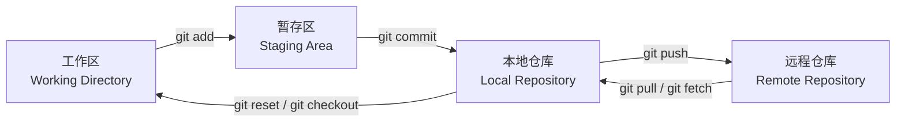
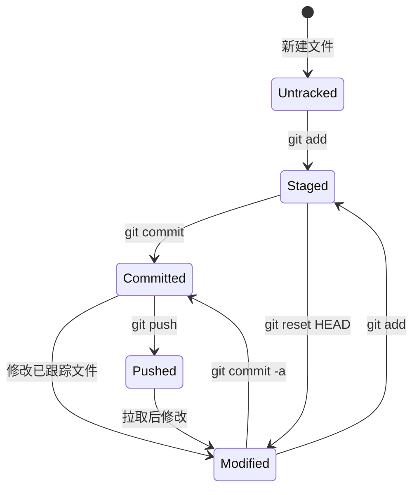

# Git 核心概念与常用命令

> 学习路线对应：补充模块 — Git 版本控制
> 前置知识：命令行基础操作
> 预计学习时间：1 天

---

## 一、核心概念

### 1.1 Git 概述：分布式版本控制

Git 是由 Linus Torvalds（林纳斯·托瓦兹）在 2005 年创建的**分布式版本控制系统**，用于高效管理 Linux 内核开发。

**什么是版本控制？**
版本控制是一种记录文件内容变化，以便将来查阅特定版本修订情况的系统。它可以：
- 追踪文件的修改历史
- 回退到之前的任意版本
- 多人协作开发，合并修改
- 查看谁修改了哪部分内容

> **生活化类比：Git = 时光机** —— Git 就像一台代码时光机。它能带你穿越到项目历史的任意时刻，看看那个版本长什么样；如果改错了，可以一键回到之前的"存档点"；还能创造"平行时间线"（分支），在不同时间线上做不同实验，互不干扰，最后再把好的时间线合并回来。而 SVN 只有一本"流水账"记在中央服务器上，服务器挂了就全没了；Git 让每个开发者都有一台完整的时光机在本地。

> 📖 **参考链接**：
> - [Git Documentation](https://git-scm.com/docs/) -- Git 官方文档总入口
> - [Pro Git Book 中文版](https://git-scm.com/book/zh/v2) -- 官方免费书籍，Git 学习权威指南

### 1.2 分布式 vs 集中式（Git vs SVN）

| 对比维度 | Git（分布式） | SVN（集中式） |
|---------|--------------|--------------|
| **仓库存储** | 每个开发者本地都有完整仓库 | 只有中央服务器有完整仓库 |
| **网络依赖** | 大部分操作无需联网，离线可提交 | 几乎所有操作都需要联网 |
| **分支管理** | 分支轻量，创建切换非常快 | 分支是目录复制，相对笨重 |
| **内容存储** | 按内容（快照）存储 | 按文件差异存储 |
| **完整性** | SHA-1 校验保证内容完整性 | 无内置完整性校验 |
| **协作方式** | 可以推送拉取，也可以离线工作 | 必须依赖中央服务器协作 |

**Git 的核心优势：**
- **离线工作**：本地提交不依赖网络，需要时再推送到远程
- **灵活分支**：快速创建分支，方便功能开发和实验
- **分布式**：即使中央服务器宕机，任意开发者的仓库都可以恢复
- **性能强大**：绝大多数操作本地完成，速度极快

### 1.3 Git 四层模型：工作区 / 暂存区 / 本地仓库 / 远程仓库

Git 管理的文件在四个区域间流转，理解这四层是掌握 Git 的关键：

```
┌─────────────┐
│  工作区     │  Working Directory：你实际编辑的文件目录
│  (你看到的)  │
└──────┬──────┘
       │ git add
       ▼
┌─────────────┐
│  暂存区     │  Staging Area：临时存放修改，保存下次要提交的文件列表
│  (缓存)      │
└──────┬──────┘
       │ git commit
       ▼
┌─────────────┐
│  本地仓库   │  Local Repository：完整仓库，包含所有版本历史
│  (本地磁盘) │  .git 目录存储所有数据和元信息
└──────┬──────┘
       │ git push
       ▼
┌─────────────┐
│  远程仓库   │  Remote Repository：托管在服务器的仓库，供团队共享
│  (服务器)    │  GitHub / Gitee / GitLab 等
└─────────────┘
```

**各区域详解：**

1. **工作区（Working Directory）**：就是你在电脑上能看到的目录，存放项目代码。你修改代码都是在工作区进行。

2. **暂存区（Stage / Index）**：位于 `.git/index` 文件中，也叫索引。你用 `git add` 把修改添加进来，它会记录下这次要提交的文件的信息。

3. **本地仓库（Local Repository）**：工作区下的 `.git` 目录，Git 在这里存储所有版本历史、分支信息、标签等。这是完整的仓库，每个人本地一份。

4. **远程仓库（Remote Repository）**：托管在网络服务器上的仓库，用于团队协作。比如 GitHub、GitLab、Gitee。本地分支可以与远程分支关联。

**文件状态生命周期：**
```
未跟踪 (Untracked)
    ↓ git add
已暂存 (Staged)
    ↓ git commit
已提交 (Committed) → 在本地仓库
    ↓ git push
已推送 (Pushed) → 在远程仓库
```

> **Git 四区转换流程**：下图直观展示了文件在 Git 四个区域之间的流转路径，是理解 Git 版本控制模型的核心基础。



> 工作区是实际编辑代码的地方，暂存区是提交前的"购物车"，本地仓库保存完整版本历史，远程仓库用于团队协作共享。掌握这四个区域的转换关系是熟练使用 Git 的关键。

> **生活化类比：暂存区 = 购物车** —— 暂存区（Stage）就像超市的购物车。你在货架（工作区）上挑了很多商品（修改了多个文件），但不是所有修改都想一次性结账（提交）。你把想一起结的商品放进购物车（git add），不想结的先留在货架上。等购物车里的东西满意了，再去收银台一次性结账（git commit）。结账后商品就入库了（本地仓库），购物车清空，可以继续下一轮采购。

**Git 文件状态流转 Mermaid 图：**



> 📖 **参考链接**：
> - [Git 暂存区原理](https://git-scm.com/book/zh/v2/Git-基础-记录每次更新到仓库) -- 官方暂存区（Stage）机制详解

### 1.4 SHA-1 快照机制

Git 中所有东西都用 **SHA-1** 哈希值校验和标识，这是 Git 保证数据完整性的核心机制。

**什么是快照？**
- SVN 保存的是**文件差异**：每个版本只保存与上一版本相比变化了哪些内容
- Git 保存的是**快照**：每次提交，Git 会把当前所有文件生成一个快照，保存这个快照的索引

> 对于未修改的文件，Git 不会重复存储，只保留一个指向已有相同内容的引用，因此非常节省空间。

**SHA-1 哈希：**
- Git 对每个对象（commit、tree、blob）计算 40 个字符的十六进制 SHA-1 哈希
- 哈希值基于文件内容计算，内容相同则哈希相同，内容不同则哈希必定不同
- 示例：`a1085907a8a0767f7d7a8c5d7e2f3a1b6c4d8e9f`
- 你只需要前 6-7 位就能唯一标识一个提交了

**为什么 SHA-1 这么重要？**
1. **完整性保证**：如果文件内容被篡改，SHA-1 会变，Git 能检测出来
2. **去重存储**：相同内容只存一份，节省空间
3. **内容寻址**：通过哈希可以快速找到对应对象

Git 的三种对象类型：
- **blob**：存储文件内容
- **tree**：存储目录树结构，指向 blob 或其他 tree
- **commit**：指向一个 tree，包含提交信息、父提交引用

---

## 二、底层原理

### 2.1 Git 对象存储模型

Git 的 `.git` 目录结构：

```
.git/
├── HEAD          # 当前分支指向
├── index         # 暂存区（索引）文件
├── objects/      # 所有 Git 对象存储在这里
│   ├── info/
│   ├── pack/     # 打包后的对象
│   └── [0-9a-f]/ # 按前两位哈希分目录存放
├── refs/
│   ├── heads/    # 分支引用，每个分支一个文件存对应 commit 的 SHA-1
│   ├── tags/     # 标签引用
│   └── remotes/  # 远程分支引用
├── config        # 项目配置
└── description   # 项目描述
```

### 2.2 分支实现原理

Git 分支本质上就是一个**指向某个提交对象的可变指针**。

```
你创建分支时，Git 只是新建了一个 41 字节的文件（存储 40 位 SHA-1 + 换行），所以创建分支是 O(1) 操作，非常快！
```

**分支指针示意图：**

```
master: commit C -- pointer → [SHA-1 of C]
                         C
                        / \
               ... ← A ← B   [master pointer]
                         ↑
                       topic: 新提交 D
                            D
                            ↑
                  [topic pointer]
```

- `HEAD` 指针指向当前所在分支，`HEAD` 文件内容就是 `ref: refs/heads/master`
- 当你切换分支，Git 只需要改变 `HEAD` 指向，然后把对应分支指向的提交快照还原到工作区

这就是为什么 Git 创建切换分支都如此快速的原因！

> **生活化类比：分支 = 平行宇宙** —— Git 分支就像科幻电影里的平行宇宙。你可以在"主宇宙"（master）之外开辟一个"平行宇宙"（feature 分支），在那里做实验性开发，完全不影响主宇宙。两个宇宙各自发展，时间线独立。等平行宇宙的实验成功了，你可以把它"合并"回主宇宙（merge）；如果实验失败了，直接消灭这个平行宇宙（git branch -d）即可，主宇宙毫无感知。这就是 Git 分支轻量、灵活的精髓——创建和消灭一个宇宙只需要 41 字节。

> 📖 **参考链接**：
> - [Git 分支原理](https://git-scm.com/book/zh/v2/Git-分支-分支简介) -- 官方分支机制与 HEAD 指针详解

### 2.3 为什么说 Git 是分布式？

**集中式（SVN）工作流：**
```
你 → 中央服务器 → 其他人
每个人都必须依赖中央服务器，每次提交都要联网
服务器挂了，所有人都没法提交了
```

**分布式（Git）工作流：**
```
每个人电脑上都有完整仓库
你本地提交完，再推送到"远程仓库"
远程仓库只是一个约定好的共享位置，不是必须的
服务器挂了，随便找一个人的仓库克隆一份就恢复了
```

所以，Git 的"分布式"核心是：**没有哪个中央仓库是必须的，每个节点都是完整的仓库**。

---

## 三、实战应用

### 3.1 基本操作速查

#### 初始化与克隆

```bash
# 在当前目录初始化一个 Git 仓库
git init

# 克隆远程仓库到本地
git clone https://github.com/username/project.git
git clone git@github.com:username/project.git  # SSH 方式
```

#### 查看状态

```bash
# 查看哪些文件在什么状态
git status

# 简洁输出
git status -s
```

#### 添加到暂存区

```bash
# 添加指定文件到暂存区
git add <file>

# 添加所有修改（包括新建、修改、删除）到暂存区
git add .

# 添加所有匹配的文件（比如所有 .java 文件）
git add *.java
```

#### 提交

```bash
# 提交暂存区到本地仓库，会打开编辑器让你写提交信息
git commit

# 直接在命令行写提交信息
git commit -m "提交信息：一句话说明本次修改内容"

# 跳过暂存区，直接把所有已跟踪文件的修改提交（不包含新增的未跟踪文件）
git commit -a -m "..."
```

> **提交信息规范**：第一行不超过 50 字，空一行再写详细说明。用现在时态，祈使语气。

#### 对比差异

```bash
# 查看工作区与暂存区的差异（哪些修改还没 add）
git diff

# 查看暂存区与上次提交的差异（哪些修改已经 add 还没 commit）
git diff --cached

# 查看工作区与上次提交的差异
git diff HEAD

# 查看某个文件的差异
git diff -- <file>
```

#### 查看提交历史

```bash
# 按时间倒序列出所有提交
git log

# 精简输出，一行显示一个提交
git log --oneline

# 显示分支拓扑图
git log --oneline --graph

# 显示最近 N 个提交
git log -n 10

# 搜索提交信息包含某个关键词
git log --grep="关键词"

# 查看某个文件是谁改了哪一行
git blame <file>
```

#### 恢复历史操作：reflog

```bash
# 查看所有操作记录，包括已经被删除的提交
git reflog

# 这个命令非常重要！你 reset 错了、删了分支，都可以从 reflog 找回来
```

### 3.2 reset 三种模式详解

`git reset` 用于把当前分支指针移动到指定位置，有三种模式，区别在于对暂存区和工作区的处理：

| 模式 | 移动分支指针 | 修改暂存区 | 修改工作区 | 使用场景 |
|------|-------------|-----------|-----------|---------|
| `--soft` | ✅ 是 | ❌ 不碰 | ❌ 不碰 | 撤销 `git commit`，修改还留在暂存区，你改完再重新提交 |
| `--mixed` (默认) | ✅ 是 | ✅ 覆盖 | ❌ 不碰 | 撤销 `git add` 和 `git commit`，修改还留在工作区 |
| `--hard` | ✅ 是 | ✅ 覆盖 | ✅ 覆盖 | 彻底回退到指定版本，**工作区所有修改会丢失！** |

**图解三种模式：**

假设当前提交是 `C2`，我们要 reset 回 `C1`：

```
初始状态：
工作区：C2 代码
暂存区：C2
HEAD 指向 C2 (master → C2)

--soft 结果：
工作区：保持 C2 不变 ✓
暂存区：保持 C2 不变 ✓
HEAD 指向 C1 (master → C1)
→ 你现在重新 commit 就会把刚才的修改变成新提交，相当于撤销了上一次 commit

--mixed 结果：
工作区：保持 C2 修改不变 ✓
暂存区：改成 C1，所有修改从暂存区撤回到工作区 ✗
HEAD 指向 C1
→ 你需要重新 git add 再 commit，相当于撤销 commit 和 add

--hard 结果：
工作区：彻底改成 C1 版本，所有工作区修改丢失 ✗
暂存区：改成 C1 ✗
HEAD 指向 C1
→ 完全回退到 C1 当时的状态
```

**常用场景：**

```bash
# 1. 撤销上一次 commit，保留修改，方便你改完重新提交
git reset --soft HEAD^

# 2. 取消已经 add 到暂存区的文件，保留修改在工作区
git reset HEAD -- <file>

# 3. 彻底丢弃工作区所有修改，回退到上次提交
git reset --hard HEAD

# 4. 回退到某个历史版本，彻底丢弃之后的所有修改
git reset --hard <commit-hash>
```

> ⚠️ **警告**：`--hard` 会丢掉工作区所有未提交的修改，操作前想清楚！如果错了，试试 `git reflog` 找回来。

### 3.3 远程协作

#### 远程仓库管理

```bash
# 查看已配置的远程仓库
git remote -v

# 添加远程仓库
git remote add origin <url>

# 修改远程仓库地址
git remote set-url origin <new-url>

# 删除远程仓库
git remote remove <name>

# 重命名远程仓库
git remote rename <old> <new>
```

#### 推送、拉取、抓取的区别

| 命令 | 作用 | 是否自动合并 | 常用场景 |
|------|------|-------------|---------|
| `git fetch` | 从远程仓库下载所有最新提交到本地远程分支（如 `origin/master`） | ❌ 不合并 | 先查看远程有什么更新，再决定是否合并 |
| `git pull` | 从远程仓库下载最新版本，**自动合并**到当前本地分支 | ✅ 合并 | 直接把远程更新拉下来合并到当前分支 |
| `git push` | 将本地分支的提交推送到远程仓库 | - | 把你的修改分享到远程，供团队其他人获取 |

**更清晰理解：**
```
git pull = git fetch + git merge
```

如果你想更可控，推荐：
```bash
# 先抓取，看看有什么变化
git fetch origin
git diff origin/master

# 确认没问题再合并
git merge origin/master
# 或者 git pull --rebase（见下文）
```

#### pull --rebase 是什么？

当你本地有提交，远程也有新提交，直接 `git pull` 会产生一个"合并提交"：

```
本地：A -- B -- my-commit (master)
远程：A -- B -- C (origin/master)
git pull → A -- B -- my-commit -- C -- merge-commit
                         ↘           ↗
```

用 `git pull --rebase` 会把你的提交"变基"到远程最新提交之后，历史更干净：

```
git pull --rebase → A -- B -- C -- my-commit  (线性历史，没有多余合并提交)
```

**推荐做法：**
```bash
# 拉取时使用 rebase 保持线性历史
git pull --rebase origin master

# 或者配置 Git 默认 pull 用 rebase：
git config --global pull.rebase true
```

好处：提交历史干净，没有不必要的合并提交，方便阅读。

#### 推送到远程

```bash
# 推送当前分支到对应远程分支
git push origin <branch-name>

# 推送所有本地分支到远程
git push --all origin

# 删除远程分支
git push origin --delete <branch-name>
```

### 3.4 标签与版本

标签（tag）用于给某个特定提交打上一个标记，通常用来标记版本发布，比如 `v1.0.0`。

#### 创建标签

```bash
# 创建轻量标签
git tag v1.0.0

# 创建附注标签（推荐，包含更多信息）
git tag -a v1.0.0 -m "版本 1.0.0 发布"

# 给历史某个提交打标签
git tag -a v0.9.0 <commit-hash>
```

#### 列标签与查看

```bash
# 列出所有标签
git tag

# 搜索标签（比如搜索 v1. 开头）
git tag -l "v1.*"

# 查看标签信息
git show v1.0.0
```

#### 推送标签

```bash
# 推送单个标签到远程
git push origin v1.0.0

# 推送所有本地标签到远程
git push origin --tags
```

#### 删除标签

```bash
# 删除本地标签
git tag -d v1.0.0

# 删除远程标签
git push origin --delete v1.0.0
```

#### 语义化版本号

**SemVer 语义化版本规范**：`主版本号.次版本号.修订号`

格式：`MAJOR.MINOR.PATCH`

- **MAJOR 主版本号**：不兼容的 API 修改，打破向后兼容
- **MINOR 次版本号**：向下兼容，新增功能
- **PATCH 修订号**：向下兼容，仅修复 bug

示例：
- `v1.0.0` → 第一个稳定版本
- `v1.1.0` → 在 1.0 基础上新增了功能
- `v1.1.1` → 在 1.1.0 基础上修复了 bug
- `v2.0.0` → 重构了 API，不兼容旧版本

先行版本号可以加在修订号之后：
- `v2.0.0-alpha.1`
- `v2.0.0-beta.3`
- `v2.0.0-rc.1`

---

## 四、常见面试题

### 1. Git 和 SVN 的主要区别是什么？Git 优势在哪里？

**答案要点：**
- Git 是分布式，SVN 是集中式；Git 每个本地都是完整仓库，SVN 依赖中央服务器
- Git 分支轻量，创建切换快；SVN 分支是复制目录，比较重
- Git 按快照存储，SVN 按文件差异存储
- Git 大部分操作本地完成，速度快，支持离线工作；SVN 多数操作需要联网
- Git 使用 SHA-1 保证内容完整性，SVN 没有这个机制
- Git 优势：离线工作、灵活分支、更快的性能、更强大的分支合并、分布式更安全

### 2. Git 工作区、暂存区、本地仓库、远程仓库的区别？

**答案要点：**
- 工作区：你实际编辑代码的目录，就是你看到的文件
- 暂存区：`.git/index`，临时存放你要提交的修改，`git add` 就是放到这里
- 本地仓库：`.git` 目录，存储了所有版本历史、分支等信息，完整仓库在本地
- 远程仓库：托管在服务器上的共享仓库，比如 GitHub，团队协作用
- 流程：`工作区 →(add)→ 暂存区 →(commit)→ 本地仓库 →(push)→ 远程仓库`

### 3. `git fetch` 和 `git pull` 的区别？

**答案要点：**
- `git fetch`：只从远程下载最新提交到本地远程分支（`origin/master`），**不合并**，需要你手动合并
- `git pull`：从远程下载最新版本，**自动合并**到当前本地分支，相当于 `git fetch + git merge`
- 推荐先 `git fetch` 查看变化再合并，更可控；`git pull` 比较快捷

### 4. reset 的三种模式（soft/mixed/hard）区别是什么？各自使用场景？

**答案要点：**
- `--soft`：只移动分支指针，不改变暂存区，不改变工作区。场景：撤销上一次 commit，修改还在暂存区，改完重新提交。
- `--mixed`（默认）：移动分支指针，覆盖暂存区，不改变工作区。场景：撤销 commit 和 add，修改退回到工作区，需要重新 add。
- `--hard`：移动分支指针，覆盖暂存区，覆盖工作区。场景：彻底回退到指定版本，工作区所有修改丢失。
- 总结口诀：soft 只动提交头，mixed 动了提交头和暂存，hard 三个全动。

### 5. 什么是 SHA-1 快照？Git 为什么用 SHA-1？

**答案要点：**
- Git 不保存文件差异，每次提交保存整个项目的快照
- 每个对象（文件、目录、提交）都计算一个 40 位的 SHA-1 哈希值作为标识
- 哈希值由内容决定，内容相同则哈希相同
- 为什么用 SHA-1：① 保证数据完整性，内容被篡改能检测出来；② 去重存储，相同内容只存一份节省空间；③ 内容寻址，通过哈希快速定位对象

### 6. Git 分支是什么？为什么 Git 创建分支这么快？

**答案要点：**
- Git 分支本质就是一个指向某个提交对象的指针，存储在一个很小的文件里（只有 41 字节）
- 创建分支只需要新建这个指针文件，不需要复制整个项目，所以创建是 O(1) 操作，非常快
- HEAD 指针指向当前所在分支，切换分支只需要改变 HEAD 指向然后还原工作区，所以也很快

### 7. 什么是语义化版本号？规则是什么？

**答案要点：**
- 语义化版本号格式是 `主版本号.次版本号.修订号`（MAJOR.MINOR.PATCH）
- 主版本号：不兼容的 API 修改，打破向后兼容时递增
- 次版本号：向下兼容，新增功能时递增
- 修订号：向下兼容，仅修复 bug 时递增
- 作用：清晰表明版本变化的大小，方便使用者判断更新影响

### 8. `git reflog` 有什么用？什么时候用？

**答案要点：**
- `git reflog` 记录了 Git 中所有分支的所有操作记录，包括已经被删除的提交
- 当你 `git reset --hard` 错了，把提交弄丢了，可以用 reflog 找到之前的哈希，然后 reset 回去恢复
- 当你删除了一个分支，还想找回来，也可以用 reflog 找到最后一次提交的哈希恢复

> 📖 **参考链接**：
> - [Git reset 命令](https://git-scm.com/docs/git-reset) -- reset 三种模式官方文档
> - [Git reflog 命令](https://git-scm.com/docs/git-reflog) -- reflog 操作记录与恢复官方文档
> - [Git 常用命令](https://git-scm.com/docs/) -- Git 命令行参考手册

---

## 五、避坑指南

| 常见坑点 | 现象 | 原因 | 正确姿势 |
|---------|------|------|---------|
| `git reset --hard` 丢了代码 | 工作区修改没提交，reset 后找不到了 | `--hard` 会覆盖工作区，未提交的修改直接丢掉 | 任何 reset --hard 之前，先把修改 commit 或者 stash 保存；错了立刻看 git reflog |
| 把不该提交的大文件/敏感信息提交了 | node_modules、密码、密钥提交到了仓库 | 没写 `.gitignore`，或者一开始没注意 | 提前写好 `.gitignore`；已经提交了用 `git filter-branch` 或 `bfg` 从历史移除 |
| 直接在 `master` 分支开发，直接推 | 把未完成代码推上去，影响别人；出问题不好回退 | 习惯不好，没有分支开发意识 | 功能开发新建 feature 分支，测试完再合并到 master |
| 提交信息写得乱七八糟 | `git log` 看不懂每次改了什么 | 不重视提交信息 | 提交信息第一行一句话说明做了什么，改动大的话空一行写详情；用祈使语气，现在时态 |
| pull 不用 rebase，历史一堆合并提交 | log 历史很乱，看不懂主干进展 | 默认 pull 是 merge，每次拉都产生合并提交 | 配置 `git config --global pull.rebase true`，默认 pull --rebase 保持线性 |
| 推远程失败提示快进失败 | `error: failed to push some refs` | 远程有你本地没有的提交，需要先 pull | 先 `git pull --rebase` 把远程更新拉下来，解决冲突再推 |
| 解决完 rebase 冲突不知道下一步 | 卡住了，不知道该干嘛 | rebase 流程是一步步来的 | 解决完冲突后 `git add`，然后 `git rebase --continue`，要放弃就 `git rebase --abort` |
| 本地分支推远程写错了远程分支名 | 远程多出来一个错的分支 | 不小心推错了 | 删除远程分支：`git push origin --delete wrong-branch` |
| 误删了分支，找不回来了 | 分支删了，上面的代码也找不到了 | 以为删了就没了 | Git 不会立刻删除提交，只要你没推，之前的提交还在，用 `git reflog` 找最后一次提交恢复 |
| tag 打错了想改 | 已经把错误 tag 推远程了 | 打错了版本号 | 本地删：`git tag -d v1.0.0`，远程删：`git push origin --delete v1.0.0`，然后重新打正确的再推 |

---

## 本章学习自检

完成本章学习后，应该能够：

- [ ] 清楚说明 Git 分布式版本控制与 SVN 集中式的区别，理解 Git 的优势
- [ ] 准确说出工作区、暂存区、本地仓库、远程仓库四个区域的作用和转换流程
- [ ] 理解 SHA-1 快照机制，说明为什么 Git 用 SHA-1
- [ ] 熟练使用 `init/clone/add/commit/status/diff/log/reflog` 这些基本命令
- [ ] 清晰区分 `reset --soft/mixed/hard` 三种模式，并能说出各自使用场景
- [ ] 说明 `fetch/pull/push` 的区别，理解 `pull --rebase` 的作用和好处
- [ ] 掌握 tag 的基本操作，理解语义化版本号的规则
- [ ] 遇到误操作（reset 错了、删分支了）知道用 `reflog` 恢复

---

> **学习导航**：
> - 返回 [学习路线总览](../../README.md)
> - 本模块其他文件：[03-Git笔面试题集](./03-Git笔面试题集.md)

