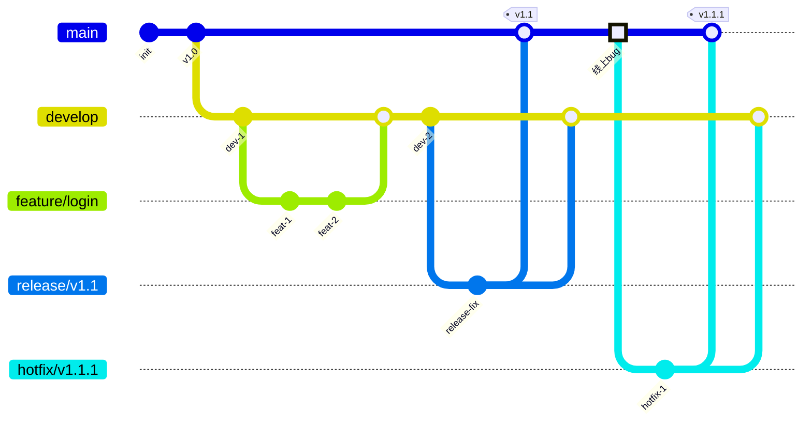

# Git 分支策略与协作工作流

> 学习路线对应：补充模块 — Git 进阶
> 前置知识：Git 基础操作（add、commit、push、pull）
> 预计学习时间：2 天

---

## 一、分支管理基础

### 1.1 什么是分支

分支（Branch）是 Git 的核心概念之一，本质上是一个指向某个提交对象的可变指针。Git 使用分支来实现并行开发，不同功能可以在各自的分支上独立进行，互不干扰。

Git 的分支极其轻量——创建一个分支仅仅是在 `.git/refs/heads/` 目录下写入一个 40 字节的 SHA-1 哈希值，几乎不消耗任何磁盘空间。

> 📖 **参考链接**：
> - [Git Documentation](https://git-scm.com/docs/) -- Git 官方文档总入口
> - [Pro Git Book 中文版](https://git-scm.com/book/zh/v2) -- 官方免费书籍，分支策略章节必读

### 1.2 HEAD 指针与分支切换

HEAD 是一个特殊的指针，指向当前所在的分支（或某个具体的提交）。理解 HEAD 是理解所有分支操作的基础：

| 概念 | 说明 |
|------|------|
| **HEAD** | 指向当前分支的指针，通常指向一个分支引用 |
| **detached HEAD** | HEAD 直接指向某个提交而非分支，此时处于"游离"状态 |
| **分支指针** | 指向该分支最新提交的引用，随提交自动向前移动 |

### 1.3 branch 命令详解

#### 基本操作

```bash
# 查看所有本地分支（当前分支前有 * 标记）
git branch

# 查看所有远程分支
git branch -r

# 查看所有本地和远程分支
git branch -a

# 查看分支的详细信息（包含最后一次提交）
git branch -v

# 查看已合并到当前分支的分支
git branch --merged

# 查看尚未合并到当前分支的分支
git branch --no-merged
```

#### 创建与删除分支

```bash
# 创建分支（不切换）
git branch feature-login

# 创建并切换到新分支
git checkout -b feature-login
# 等价的新命令（Git 2.23+）
git switch -c feature-login

# 删除本地分支（安全删除，未合并会警告）
git branch -d feature-login

# 强制删除本地分支（即使未合并）
git branch -D feature-login

# 删除远程分支
git push origin --delete feature-login
```

#### 重命名分支

```bash
# 重命名当前分支
git branch -m new-name

# 重命名指定分支
git branch -m old-name new-name
```

### 1.4 checkout 命令详解

`git checkout` 是一个多功能命令，主要承担三个职责：切换分支、恢复工作区文件、创建新分支。

```bash
# 切换分支
git checkout main

# 创建并切换到新分支
git checkout -b feature-order

# 基于远程分支创建本地分支
git checkout -b feature-order origin/feature-order

# 恢复工作区文件（丢弃修改，慎用）
git checkout -- filename.txt

# 切换到某个提交（进入 detached HEAD 状态）
git checkout <commit-hash>
```

> **重要**：Git 2.23 引入了 `git switch` 和 `git restore` 两个新命令，将 `checkout` 的职责拆分：
> - `git switch`：专门用于切换分支
> - `git restore`：专门用于恢复文件
> - 建议新项目中优先使用这两个命令，语义更清晰。

### 1.5 merge 的三种模式

`git merge` 用于将一个分支的修改合并到当前分支。Git 提供了三种合并策略：

#### 模式一：Fast-Forward Merge（快进合并）

当被合并分支是当前分支的直接后继时，Git 只需将当前分支指针直接前移，不会产生新的合并提交。

```
合并前：
  main: A---B
              \
  feature:     C---D

合并后（fast-forward）：
  main: A---B---C---D
```

```bash
# 默认在可能时使用 fast-forward
git merge feature

# 禁用 fast-forward，强制生成合并提交
git merge --no-ff feature
```

> **`--no-ff` 的意义**：即使可以快进合并，也强制生成一个合并提交节点。这样做的好处是保留了分支的历史信息，可以清楚地看到哪些提交属于哪个功能分支，便于后续追溯和回滚。

#### 模式二：Three-Way Merge（三方合并）

当两个分支各自都有新的提交时，Git 需要找到两个分支的共同祖先（即 merge base），然后进行三方合并：

```
合并前：
  main: A---B---C---D
         \
  feature: E---F---G

合并后：
  main: A---B---C---D---M
         \             /
  feature: E---F---G--/
```

三方合并会创建一个新的"合并提交"（Merge Commit），它有两个父提交。

#### 模式三：Squash Merge（压缩合并）

将特性分支上的所有提交压缩成一个提交，然后应用到当前分支上。不会保留原分支的提交历史，也不会创建合并提交，除非手动指定。

```bash
# 压缩合并，将所有改动放入暂存区
git merge --squash feature
# 然后手动提交
git commit -m "feat: 添加登录功能"
```

| 合并模式 | 历史记录 | 分支轨迹 | 适用场景 |
|---------|---------|---------|---------|
| **Fast-Forward** | 线性，无合并提交 | 不保留 | 简单线性开发 |
| **--no-ff** | 保留合并提交 | 清晰保留 | 功能分支开发，需要追溯 |
| **Three-Way** | 有合并提交 | 保留 | 长期并行的分支合并 |
| **Squash** | 压缩为单个提交 | 不保留 | 杂乱提交历史整理 |

---

## 二、分支高阶操作

### 2.1 rebase 黄金法则

#### rebase 原理

`git rebase` 的工作方式是：找到当前分支和目标分支的共同祖先，然后将当前分支上的所有提交"暂存"起来，把当前分支指向目标分支的最新提交，最后将暂存的提交逐个重新应用上去。

```
rebase 前：
  main: A---B---C---D
         \
  feature: E---F---G

执行 git rebase main（在 feature 分支上）：
  main: A---B---C---D
                    \
  feature:           E'---F'---G'
```

注意：E'、F'、G' 是全新的提交，拥有不同的 SHA-1 值。原提交 E、F、G 在 rebase 完成后将被垃圾回收。

#### rebase vs merge

| 对比维度 | git merge | git rebase |
|---------|-----------|------------|
| **历史记录** | 保留完整分支历史，含合并节点 | 线性历史，干净整洁 |
| **冲突解决** | 一次性解决所有冲突 | 可能需要逐个提交解决冲突 |
| **提交 SHA** | 原提交保持不变 | 提交被重写，SHA 全部改变 |
| **可追溯性** | 清晰知道哪个提交来自哪个分支 | 线性历史，分支信息丢失 |
| **回滚难度** | 容易，合并提交可整体回滚 | 较难，多个提交需要逐个处理 |

#### rebase 黄金法则

> **永远不要对已经推送到公共仓库的提交执行 rebase。**

原因：rebase 会重写提交历史，生成全新的 SHA-1 哈希值。如果其他人已经基于你的原提交进行了开发，rebase 后他们的工作基础就被破坏了。当他们尝试推送时，Git 会拒绝，因为历史已经分叉。

```bash
# 正确做法：只对本地尚未推送的提交执行 rebase
git fetch origin
git rebase origin/main

# 错误做法：对已推送的分支执行 rebase 后强制推送
# git push --force  # 危险！会覆盖远程分支历史
# 如确需使用，请用更安全的 --force-with-lease
git push --force-with-lease
```

#### 交互式 rebase

交互式 rebase 是 Git 最强大的历史编辑工具之一：

```bash
# 对最近 3 个提交进行交互式 rebase
git rebase -i HEAD~3
```

进入编辑器后，可以对每个提交执行以下操作：

| 命令 | 作用 |
|------|------|
| `pick` | 保留该提交（默认） |
| `reword` | 保留提交但修改提交信息 |
| `edit` | 保留提交但暂停以修改内容 |
| `squash` | 将该提交合并到前一个提交，保留提交信息 |
| `fixup` | 将该提交合并到前一个提交，丢弃提交信息 |
| `drop` | 删除该提交 |
| `reorder` | 调整提交顺序（通过调整行顺序实现） |

```bash
# 典型场景：将多个小提交合并为一个有意义的提交
# 交互式 rebase 编辑器中：
pick a1b2c3d feat: 添加登录页面
squash b2c3d4e fix: 修复登录按钮样式
squash c3d4e5f chore: 调整登录表单布局
# 结果：三个提交合并为一个，保留第一个的提交信息
```

### 2.2 cherry-pick 操作

`git cherry-pick` 用于将某个（或某些）提交的修改应用到当前分支，而不需要合并整个分支：

```bash
# 应用单个提交
git cherry-pick <commit-hash>

# 应用多个连续提交（不包含 start，包含 end）
git cherry-pick <start-hash>..<end-hash>

# 应用多个连续提交（包含 start）
git cherry-pick <start-hash>^..<end-hash>

# 应用提交但不自动创建提交（放入暂存区）
git cherry-pick --no-commit <commit-hash>

# 如果发生冲突，解决后继续
git cherry-pick --continue

# 放弃 cherry-pick
git cherry-pick --abort
```

#### 典型应用场景

| 场景 | 说明 |
|------|------|
| **跨分支移植修复** | 在 release 分支上修复的 bug，cherry-pick 到 main 和 develop |
| **选择性合并** | 只需要某个分支上的部分提交，而不是全部 |
| **误操作恢复** | 提交到了错误的分支，cherry-pick 到正确分支后回退原分支 |
| **补丁迁移** | 将某个功能从一个版本移植到另一个版本 |

```bash
# 场景示例：将 hotfix 分支上的修复移植到 main
git checkout main
git cherry-pick hotfix

# 场景示例：将修复提交同时应用到多个版本分支
git checkout release-1.0
git cherry-pick <fix-commit-hash>
git checkout release-2.0
git cherry-pick <fix-commit-hash>
```

---

## 三、冲突解决

### 3.1 冲突产生的原因

合并冲突（Merge Conflict）发生在 Git 无法自动合并两个分支的修改时。根本原因是：**两个分支对同一个文件的同一区域进行了不同的修改**。

常见触发场景：

| 场景 | 说明 |
|------|------|
| **并行修改同一文件** | 两个开发者同时修改了同一个文件的同一行 |
| **文件删除冲突** | 一个分支修改了文件，另一个分支删除了该文件 |
| **文件重命名冲突** | 一个分支重命名了文件，另一个分支继续修改原文件名 |
| **二进制文件冲突** | 对二进制文件（如图片）的并行修改，Git 无法自动合并 |
| **rebase 冲突** | 在 rebase 过程中，多个提交逐个应用时可能遇到冲突 |

### 3.2 冲突标记解读

当冲突发生时，Git 会在冲突文件中插入冲突标记：

```
<<<<<<< HEAD
当前分支（你正在合并到的分支）的内容
=======
被合并分支的内容
>>>>>>> feature-branch
```

- `<<<<<<< HEAD` 到 `=======` 之间：当前分支的内容
- `=======` 到 `>>>>>>> feature-branch` 之间：被合并分支的内容
- 解决冲突就是决定保留哪部分（或组合两部分的修改），并删除冲突标记

### 3.3 冲突解决流程

```bash
# 1. 执行合并操作
git merge feature-branch
# 输出：CONFLICT (content): Merge conflict in src/User.java

# 2. 查看冲突文件列表
git status
# 输出：both modified: src/User.java

# 3. 查看冲突详细内容
git diff

# 4. 手动编辑冲突文件，删除冲突标记，保留正确的代码

# 5. 将解决后的文件标记为已解决
git add src/User.java

# 6. 完成合并
git commit -m "merge: 合并 feature-branch，解决 User.java 冲突"

# 如果中途想放弃合并
git merge --abort
```

### 3.4 可视化冲突解决工具

| 工具 | 类型 | 说明 |
|------|------|------|
| **VS Code** | 内置 | 编辑器内直接显示冲突区域，点击按钮选择保留哪一方 |
| **IntelliJ IDEA** | 内置 | 三栏对比视图，直观展示本地、远程和合并结果 |
| **git mergetool** | 命令行 | 调用配置的外部合并工具 |
| **Beyond Compare** | 第三方 | 专业的文件和目录对比工具 |
| **Meld** | 开源 | 轻量级的可视化差异和合并工具 |
| **GitKraken** | GUI 客户端 | 图形化 Git 客户端，内置冲突解决工具 |

在 VS Code 中解决冲突时，编辑器会高亮显示冲突区域，并提供四个操作按钮：
- **Accept Current Change**：保留当前分支的修改
- **Accept Incoming Change**：接受被合并分支的修改
- **Accept Both Changes**：保留双方的修改
- **Compare Changes**：打开差异对比视图

在 IntelliJ IDEA 中：
- 合并冲突窗口提供三栏视图：左侧为本地版本、中间为合并结果、右侧为远程版本
- 支持逐行选择接受/拒绝，也可以手动编辑合并结果
- 支持语法高亮，可以看到代码结构

### 3.5 git rerere：记录冲突解决方案

`git rerere`（Reuse Recorded Resolution）是 Git 中一个被低估但极其强大的功能。它能够记录你解决冲突的方式，当同样的冲突再次出现时自动应用之前的解决方案。

```bash
# 启用 rerere 功能
git config --global rerere.enabled true

# 查看 rerere 记录的解决方案
git rerere status

# 查看具体的解决方案内容
git rerere diff

# 忘记之前的解决方案，重新记录
git rerere forget <path>
```

**工作原理**：
1. 当冲突发生时，rerere 记录冲突前的文件状态
2. 当你解决冲突后，rerere 记录你的解决方案
3. 当下次遇到相同的冲突时，rerere 自动应用之前的解决方案
4. 文件会自动标记为已解决，但仍需手动 `git add`

**典型应用场景**：

| 场景 | 说明 |
|------|------|
| **长期特性分支 rebase** | 频繁 rebase 主分支时，相同冲突反复出现 |
| **cherry-pick 批量操作** | 批量 cherry-pick 时，相似冲突多次出现 |
| **测试性合并** | 执行 `git merge` 测试合并效果，rerere 记住解决方案后回退，正式合并时自动解决 |
| **多版本维护** | 将同一个修复合并到多个维护分支时 |

```bash
# 实际案例：测试性合并
git checkout main
git merge --no-commit feature  # 测试合并，不提交
# 解决冲突...
git config rerere.enabled true  # 此时 rerere 已记录解决方案
git merge --abort               # 回退测试合并

# 后续正式合并时，rerere 自动应用解决方案
git merge feature
# 冲突自动解决！只需 git add + git commit
```

---

## 四、分支策略对比

### 4.1 GitFlow

GitFlow 是最经典的分支模型，由 Vincent Driessen 在 2010 年提出，适合有明确版本发布周期的项目。

#### 分支结构

```
main (master)
  │
  ├── develop
  │     │
  │     ├── feature/login
  │     ├── feature/order
  │     └── feature/payment
  │
  ├── release/1.0
  │
  └── hotfix/1.0.1
```

#### 分支类型与职责

| 分支 | 生命周期 | 来源 | 合并到 | 命名规范 |
|------|---------|------|--------|---------|
| **main** | 永久 | - | - | `main` |
| **develop** | 永久 | - | - | `develop` |
| **feature** | 临时 | develop | develop | `feature/<功能名>` |
| **release** | 临时 | develop | main + develop | `release/<版本号>` |
| **hotfix** | 临时 | main | main + develop | `hotfix/<版本号>` |

#### 工作流程

```
1. 从 develop 创建 feature 分支
2. 在 feature 分支上开发，完成后合并回 develop
3. 准备发布时，从 develop 创建 release 分支
4. 在 release 分支上进行测试、修复 bug、更新版本号
5. release 分支合并到 main（打 tag）和 develop
6. 线上紧急 bug：从 main 创建 hotfix 分支
7. 修复后合并到 main（打 tag）和 develop
```

> **生活化类比：GitFlow = 公司组织架构** —— GitFlow 就像一家公司的组织架构。**main** 是公司总部（生产环境），永远保持稳定运转。**develop** 是研发中心，所有新功能在这里集成测试。**feature 分支** 是各个项目组，从研发中心抽调人手开发新功能，完成后回归研发中心。**release 分支** 是质检部门，从研发中心拿到产品做最后检查和打磨，通过后送往总部发布。**hotfix 分支** 是应急小组，总部出问题（线上 bug）时直接从总部抽调人手紧急修复，修完同时通知总部和研发中心。每个角色各司其职，流程严谨但略显复杂。

**Git Flow 分支模型 Mermaid 图：**



> 📖 **参考链接**：
> - [A successful Git branching model](https://nvie.com/posts/a-successful-git-branching-model/) -- GitFlow 原始文章
> - [Git 分支管理](https://git-scm.com/book/zh/v2/Git-分支-分支管理) -- 官方分支管理指南

#### 优点

- 分支职责清晰，每个分支有明确的目的
- 适合有固定发布周期的项目（如移动端 App、企业软件）
- 严格的流程控制，降低出错概率
- 支持多版本并行维护

#### 缺点

- 分支模型复杂，学习成本高
- 合并流程繁琐，影响交付速度
- develop 分支容易成为瓶颈
- 对于持续部署的项目过于重量级

### 4.2 GitHub Flow

GitHub Flow 是 GitHub 倡导的简化分支模型，极其轻量，适合持续部署的 Web 应用。

#### 分支结构

```
main
  │
  ├── feature-login
  ├── feature-order
  └── hotfix-payment
```

#### 核心原则

1. **main 分支始终保持可部署状态**
2. **任何新工作都从 main 创建描述性分支**
3. **定期推送本地分支到远程**
4. **通过 Pull Request 发起讨论和代码审查**
5. **合并到 main 后立即部署**

#### 工作流程

```
1. 从 main 创建功能分支
2. 在分支上开发，频繁提交并推送到远程
3. 随时可以发起 Pull Request 进行讨论
4. 代码审查通过后合并到 main
5. 合并后立即部署到生产环境
```

#### 优点

- 极简模型，易于理解和上手
- 鼓励频繁部署，快速交付
- Pull Request 促进代码审查和知识共享
- 适合持续部署/持续交付（CD）的 SaaS 项目

#### 缺点

- 不支持多版本并行维护
- 缺少发布缓冲阶段
- 依赖完善的质量保障体系（自动化测试、代码审查）
- 不适合有固定发布周期的项目

### 4.3 Trunk-Based Development（主干开发）

Trunk-Based Development（TBD）是最激进的分支模型，所有开发者直接在主干（trunk/main）上进行小批量、高频次的提交。

#### 分支结构

```
main (trunk)
  │
  └── (短生命周期分支，通常 < 1 天)
```

#### 核心原则

1. **所有开发者直接在主干上工作**
2. **分支生命周期极短（通常不超过 1 天）**
3. **通过功能开关（Feature Flag）控制未完成功能的可见性**
4. **极高的自动化测试覆盖率要求**
5. **Pair Programming 和持续代码审查**

#### 工作流程

```
1. 从 main 拉取最新代码
2. 直接在 main 上进行小批量修改
3. 运行全部测试
4. 立即提交并推送
5. 如果功能未完成，使用 Feature Flag 隐藏
```

#### 配套实践

| 实践 | 说明 |
|------|------|
| **Feature Flag** | 功能开关，控制新功能的开启/关闭，无需分支隔离 |
| **Branch by Abstraction** | 通过抽象层逐步替换实现，避免长期分支 |
| **暗发布（Dark Launching）** | 新功能部署到生产环境但对用户不可见 |
| **金丝雀发布（Canary Release）** | 逐步向小部分用户开放新功能 |

#### 优点

- 极致的持续集成，几乎不会出现大规模合并冲突
- 代码审查粒度小，效率高
- 极高的交付频率，适合精英团队
- 促进良好的工程实践（自动化测试、CI/CD）

#### 缺点

- 对团队工程能力要求极高
- 需要完善的 CI/CD 和自动化测试基础设施
- 功能开关管理复杂，需要专门的工具和规范
- 不适合大型团队和外包协作模式

### 4.4 三种策略对比选型

| 对比维度 | GitFlow | GitHub Flow | Trunk-Based |
|---------|---------|-------------|-------------|
| **复杂度** | 高 | 低 | 中 |
| **分支数量** | 多（5类分支） | 少（2类） | 极少（1类） |
| **发布周期** | 固定周期（数周/数月） | 持续部署 | 持续部署 |
| **合并冲突** | 冲突可能性高 | 中等 | 冲突极少 |
| **回滚能力** | 强（版本隔离） | 中（依赖部署回滚） | 中（依赖 Feature Flag） |
| **多版本维护** | 完美支持 | 不支持 | 不支持 |
| **团队规模** | 大团队 | 中等团队 | 小团队/精英团队 |
| **CI/CD 要求** | 低 | 中 | 极高 |
| **适用项目** | 企业软件、移动端 App | Web 应用、SaaS | 互联网产品、微服务 |

#### 选型建议

```
你的项目适合哪种分支策略？

├── 有固定版本发布周期（如移动端 App、企业软件）？
│   └── 是 → GitFlow
│
├── Web 应用、SaaS 服务？
│   ├── 团队 < 10 人，CI/CD 成熟 → Trunk-Based
│   └── 团队规模中等，需要 PR 审查流程 → GitHub Flow
│
├── 需要同时维护多个版本（如 v1.0、v2.0）？
│   └── 是 → GitFlow
│
└── 追求极致交付速度，自动化测试覆盖率 > 80%？
    └── 是 → Trunk-Based
```

> 📖 **参考链接**：
> - [GitHub Flow 官方说明](https://docs.github.com/en/get-started/quickstart/github-flow) -- GitHub Flow 分支模型
> - [Trunk Based Development](https://trunkbaseddevelopment.com/) -- 主干开发权威指南
> - [Conventional Commits](https://www.conventionalcommits.org/zh-hans/) -- 约定式提交规范

---

## 五、协作工作流

### 5.1 Pull Request / Merge Request 流程

Pull Request（GitHub）或 Merge Request（GitLab）是代码协作的核心机制，它不是一个 Git 原生概念，而是代码托管平台提供的功能。

#### 完整 PR 流程

```
1. Fork / Clone 仓库
2. 创建功能分支
3. 开发并提交代码
4. 推送分支到远程
5. 创建 Pull Request
6. 触发 CI/CD 流水线
7. 代码审查（Code Review）
8. 根据审查意见修改
9. 审查通过，合并到目标分支
10. 删除功能分支
```

#### PR 最佳实践

| 实践 | 说明 |
|------|------|
| **单一职责** | 一个 PR 只做一件事，保持小而专注 |
| **描述清晰** | 写清楚背景、改动内容、测试方法、影响范围 |
| **关联 Issue** | 在 PR 描述中关联对应的 Issue（如 `Closes #123`） |
| **提交信息规范** | 使用 Conventional Commits 规范（如 `feat:`、`fix:`、`docs:`） |
| **保持更新** | 定期 rebase 目标分支，避免合并冲突累积 |
| **自测通过** | 提交前确保本地测试通过，CI 通过后再请求审查 |
| **及时响应** | 收到审查意见后及时修改并回复，保持 PR 活跃 |

> **生活化类比：Fork-Pull = 投稿审稿** —— Fork + Pull Request 就像给杂志投稿。你先 Fork（复制一份杂志到自己名下），在自己的副本上写好文章（开发功能），然后向原杂志社提交 Pull Request（投稿）。杂志社的编辑（维护者）会审阅你的文章（Code Review），提出修改意见或直接录用（Merge）。如果文章质量不行或不符合方向，可以退稿（Close PR）。这种模式保证了杂志社（主仓库）的内容质量——任何人的稿件都要经过编辑审阅才能发表。

> 📖 **参考链接**：
> - [GitHub Pull Request 文档](https://docs.github.com/en/pull-requests) -- PR 流程与最佳实践官方说明
> - [Git 分支与合并](https://git-scm.com/book/zh/v2/Git-分支-分支的变基) -- 官方 rebase 与 merge 详解

#### PR 描述模板示例

```markdown
## 背景
简述为什么要做这个改动，关联的 Issue 编号。

## 改动内容
- 修改了 xxx 模块的 xxx 逻辑
- 新增了 xxx 功能
- 修复了 xxx 问题

## 测试方法
1. 启动服务后访问 xxx 接口
2. 传入参数 xxx，预期返回 xxx

## 影响范围
- 影响模块：xxx
- 是否需要数据库迁移：是/否
- 是否需要配置变更：是/否

## 检查清单
- [ ] 代码符合团队规范
- [ ] 单元测试通过
- [ ] 集成测试通过
- [ ] 文档已更新

Closes #123
```

### 5.2 Code Review 规范

Code Review 是保证代码质量的关键环节，也是团队知识共享的重要方式。

#### 审查者视角

| 关注点 | 检查内容 |
|--------|---------|
| **设计** | 代码设计是否合理？是否过度设计？是否便于扩展？ |
| **功能** | 是否实现了需求？是否考虑了边界条件和异常情况？ |
| **复杂度** | 是否有不必要的复杂逻辑？能否简化？ |
| **测试** | 是否有足够的测试覆盖？测试用例是否合理？ |
| **命名** | 变量、函数、类命名是否清晰表达意图？ |
| **注释** | 注释是否解释了"为什么"而非"做了什么"？ |
| **风格** | 是否符合团队代码规范和风格指南？ |
| **安全** | 是否存在安全漏洞（SQL 注入、XSS、敏感信息泄露等）？ |
| **性能** | 是否有明显的性能问题（N+1 查询、不必要的循环等）？ |

#### 审查评论规范

```
# 好的审查评论
"这里的 for 循环复杂度是 O(n^2)，当数据量增大时可能会有性能问题。
建议使用 HashMap 优化为 O(n)，参考 xxx 文件的实现方式。"

# 不好的审查评论
"这里写得不好，重写。"
```

**审查评论三要素**：指出问题 + 说明原因 + 给出建议。

#### 审查速度建议

- 非紧急 PR 应在 24 小时内给出初步反馈
- 单次审查时间控制在 60 分钟以内，避免疲劳导致的审查质量下降
- 单次审查的代码量不宜超过 400 行

### 5.3 git stash：暂存工作进度

当你在一个分支上工作到一半，需要切换到另一个分支处理紧急任务时，`git stash` 可以将工作区和暂存区的修改暂存起来，让工作区恢复干净状态。

```bash
# 暂存当前所有修改（包括工作区和暂存区）
git stash

# 暂存时添加描述信息（推荐）
git stash push -m "WIP: 登录功能开发中"

# 暂存包括未追踪文件
git stash -u

# 查看所有暂存列表
git stash list
# 输出：
# stash@{0}: On feature-login: WIP: 登录功能开发中
# stash@{1}: On main: fix: 修复用户头像加载

# 恢复最近一次暂存（不删除 stash 记录）
git stash apply

# 恢复最近一次暂存（删除 stash 记录）
git stash pop

# 恢复指定暂存
git stash apply stash@{1}

# 查看暂存内容的差异
git stash show -p stash@{0}

# 删除指定暂存
git stash drop stash@{0}

# 清空所有暂存
git stash clear

# 从暂存中创建新分支
git stash branch <new-branch-name> stash@{0}
```

#### 典型使用场景

```bash
# 场景：开发功能到一半，需要紧急修复线上 bug
# 当前分支：feature-login（有未提交的修改）

# 1. 暂存当前工作
git stash push -m "WIP: 登录功能开发中"

# 2. 切换到 main 创建 hotfix 分支
git checkout main
git checkout -b hotfix-urgent

# 3. 修复 bug，提交，合并
# ...

# 4. 回到原分支，恢复工作
git checkout feature-login
git stash pop
```

> **注意事项**：
> - `git stash pop` 恢复时如果遇到冲突，stash 不会被自动删除，需要手动 `git stash drop`
> - stash 是局部的，不会随 push 推送到远程仓库
> - 不要过度依赖 stash，长时间 stash 的内容应该考虑提交到临时分支

### 5.4 git bisect：二分法定位问题提交

`git bisect` 使用二分查找算法，帮助你在大量提交中快速定位引入 bug 的提交。

#### 基本流程

```bash
# 1. 启动 bisect 会话
git bisect start

# 2. 标记当前版本为"有问题"
git bisect bad

# 3. 标记一个已知正常的版本
git bisect good <commit-hash>
# 或使用相对引用
git bisect good HEAD~20

# 4. Git 会自动切换到中间位置的提交
# 测试这个版本是否有问题
# 如果正常：
git bisect good
# 如果有问题：
git bisect bad

# 5. 重复步骤 4，直到 Git 定位到引入 bug 的具体提交
# 输出：<commit-hash> is the first bad commit

# 6. 结束 bisect 会话，回到原来的分支
git bisect reset
```

#### 自动化 bisect

如果可以通过脚本或命令自动判断版本是否有问题，可以完全自动化 bisect 过程：

```bash
# 启动 bisect
git bisect start
git bisect bad HEAD
git bisect good v1.0.0

# 自动运行测试脚本，根据返回码判断
git bisect run npm test

# 或者运行自定义脚本
git bisect run sh test-build.sh
```

脚本/命令的退出码含义：
- `0`：表示这个版本是正常的（good）
- `1-127`（除 125 外）：表示这个版本有问题（bad）
- `125`：表示这个版本无法测试（skip），Git 会跳过并选择邻近的提交

#### 实际案例

```bash
# 场景：某次发布后，发现订单金额计算错误
# 已知 v2.0.0 正常，v2.1.0 有问题，中间有 200 个提交

git bisect start
git bisect bad v2.1.0
git bisect good v2.0.0
# 二分法最多只需 log2(200) ≈ 8 次测试即可定位

# 自动化：
git bisect run mvn test -Dtest=OrderAmountTest
```

---

## 学习导航

**推荐学习路径**：
1. [Pro Git 中文版](https://git-scm.com/book/zh/v2) - 官方文档，Git 分支章节必读
2. [Learn Git Branching](https://learngitbranching.js.org/) - 可视化交互学习 Git 分支操作，强烈推荐
3. [A successful Git branching model](https://nvie.com/posts/a-successful-git-branching-model/) - GitFlow 原始文章
4. [GitHub Flow 官方说明](https://docs.github.com/en/get-started/quickstart/github-flow)
5. [Trunk Based Development 官方网站](https://trunkbaseddevelopment.com/) - 主干开发权威指南
6. [Conventional Commits](https://www.conventionalcommits.org/zh-hans/) - 约定式提交规范
7. 下一章节：[Git 笔面试题集](./03-Git笔面试题集.md)

**实践练习**：
- 在本地仓库模拟 GitFlow 完整流程：创建 feature 分支、合并到 develop、创建 release、合并到 main 并打 tag
- 使用 `git rebase -i` 整理本地提交历史，练习 squash、reword、reorder 操作
- 故意制造合并冲突，练习使用 VS Code 或 IDEA 可视化解决冲突
- 启用 `git rerere`，模拟测试性合并场景，体验自动解决冲突
- 使用 `git bisect` 在本地仓库中定位一个已知的 bug 提交
- 模拟 GitHub Flow 流程：创建分支、推送、发起 PR、代码审查、合并

## 自检清单

**请检查你是否掌握了以下知识点：**

- [ ] 能够解释 Git 分支的本质（指向提交对象的指针）
- [ ] 理解 HEAD 指针的作用，知道 detached HEAD 是什么
- [ ] 能够熟练使用 `git branch`、`git checkout`、`git switch` 进行分支操作
- [ ] 能够区分 merge 的三种模式（fast-forward、--no-ff、squash）及各自适用场景
- [ ] 理解 rebase 的工作原理，能画出 rebase 前后的提交历史图
- [ ] 牢记 rebase 黄金法则：不对已推送的提交执行 rebase
- [ ] 能够使用 `git rebase -i` 进行交互式 rebase，掌握 squash、reword、edit 等操作
- [ ] 理解 cherry-pick 的使用场景，能够跨分支移植提交
- [ ] 能够解释合并冲突产生的原因，读懂冲突标记
- [ ] 能够熟练使用命令行或 IDE 工具解决合并冲突
- [ ] 了解 `git rerere` 的工作原理，知道如何启用和使用
- [ ] 能够画出 GitFlow 的分支结构图，说出五种分支的职责
- [ ] 能够说出 GitHub Flow 和 GitFlow 的核心区别
- [ ] 理解 Trunk-Based Development 的核心理念和配套实践
- [ ] 能够根据项目特点选择合适的分支策略
- [ ] 掌握完整的 PR/MR 流程，知道如何写一个好的 PR 描述
- [ ] 了解 Code Review 的关注点和评论规范
- [ ] 能够熟练使用 `git stash` 暂存工作进度
- [ ] 能够使用 `git bisect` 二分定位问题提交
- [ ] 了解 `--force-with-lease` 和 `--force` 的区别，知道何时使用

> - 返回 [学习路线总览](../../README.md)