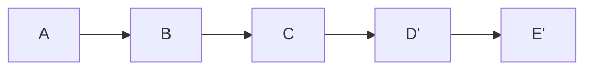
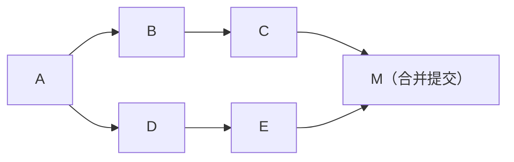

# Git 笔面试题集

> 涵盖核心概念、分支操作、冲突解决、协作流程、常见误操作恢复。每题附详细解析，难度标注 ★/★★/★★★。

> 📖 **参考链接**：
> - [Git Documentation](https://git-scm.com/docs/) -- Git 官方文档总入口
> - [Pro Git Book 中文版](https://git-scm.com/book/zh/v2) -- 官方免费书籍

---

## 一、选择题（15题）

### 1. Git 中，以下哪个命令用于查看当前工作区的状态？（★）

- A. `git log`
- B. `git status`
- C. `git diff`
- D. `git show`

**正确答案：B**

**解析：**
- `git status` 用于查看工作区和暂存区的状态，展示哪些文件被修改、哪些文件已暂存、哪些文件未跟踪等。
- `git log` 查看提交历史记录。
- `git diff` 比较文件差异（默认比较工作区与暂存区）。
- `git show` 显示某个提交的详细信息。

---

### 2. 以下关于 Git 工作区的描述，错误的是？（★）

- A. 工作区（Working Directory）是用户当前正在编辑的文件目录
- B. 暂存区（Staging Area / Index）存放即将提交的修改
- C. 本地仓库（Local Repository）存放已提交的所有版本数据
- D. `git commit` 命令会将工作区的修改直接提交到本地仓库，跳过暂存区

**正确答案：D**

**解析：**
- D 选项错误，`git commit` 默认只会将**暂存区**中的内容提交到本地仓库，不会跳过暂存区。如果希望跳过暂存区直接提交所有已跟踪文件的修改，需要使用 `git commit -a`。
- A、B、C 均描述正确，是 Git 的三个核心区域。

---

### 3. 执行 `git commit -m "fix: 修复登录bug"` 后，发现遗漏了一个文件未提交，且不想新增一条 commit 记录，应该怎么做？（★★）

- A. 重新执行 `git commit -m "fix: 补充遗漏文件"`
- B. 执行 `git add 遗漏文件`，然后 `git commit --amend`
- C. 执行 `git reset HEAD~1`，然后重新提交
- D. 执行 `git add 遗漏文件`，然后 `git commit -m "fix: 修复登录bug"`

**正确答案：B**

**解析：**
- `git commit --amend` 可以将暂存区的内容追加到**上一次提交**中，不产生新的 commit 记录。先 `git add` 遗漏文件，再 `git commit --amend`，即可将遗漏文件合并到上一次提交中。
- A 和 D 都会产生新的 commit 记录。
- C 虽然也能实现目的，但操作更复杂且会丢失上一次提交信息，不如 B 简洁。

---

### 4. 在 Git 中，`HEAD` 通常指向什么？（★）

- A. 远程仓库的最新提交
- B. 当前分支的最新提交
- C. 工作区的根目录
- D. 暂存区的索引文件

**正确答案：B**

**解析：**
- `HEAD` 是一个指针，指向当前所在分支的最新提交（即当前分支的顶端）。当切换分支时，`HEAD` 会随之改变。
- 在"分离头指针"（detached HEAD）状态下，`HEAD` 直接指向某个具体的 commit，而非分支。

---

### 5. 以下哪个命令用于将本地分支 `feature-a` 推送到远程仓库，并建立追踪关系？（★★）

- A. `git push origin feature-a`
- B. `git push -u origin feature-a`
- C. `git push --set-upstream origin feature-a`
- D. B 和 C 都可以

**正确答案：D**

**解析：**
- `-u` 是 `--set-upstream` 的缩写，两者等价。执行后会推送本地 `feature-a` 分支到远程，并建立追踪关系（tracking），之后在 `feature-a` 分支上直接执行 `git push` 即可，无需再指定远程和分支名。
- A 选项只推送但不建立追踪关系。

---

### 6. 执行 `git merge feature` 时发生冲突，以下处理流程正确的是？（★★）

- A. 直接执行 `git commit` 完成合并
- B. 执行 `git merge --abort` 放弃合并，然后手动修改冲突文件
- C. 手动解决冲突文件中的冲突标记，`git add` 标记已解决的文件，然后 `git commit` 完成合并
- D. 执行 `git reset --hard` 回退

**正确答案：C**

**解析：**
- 正确的冲突解决流程是：
  1. 打开冲突文件，找到 `<<<<<<<`、`=======`、`>>>>>>>` 标记的冲突区域。
  2. 手动编辑，保留需要的代码，删除冲突标记。
  3. 执行 `git add <文件名>` 将解决后的文件标记为已解决。
  4. 执行 `git commit` 完成合并提交。
- A 需要在解决冲突后再 commit。
- B 中 `--abort` 会放弃合并，之后无需再手动修改。
- D 会丢失所有未提交的修改，风险极高。

---

**rebase 与 merge 对比示意图：**

**rebase（线性历史）：**



> rebase 将提交重新应用到目标分支之上，生成线性历史更清晰，但会改写 commit hash。

**merge（保留分支）：**



> merge 创建合并提交保留分支拓扑，更真实反映开发过程但历史较复杂。

> git rebase 将当前分支的提交重新应用到目标分支之上，生成线性历史更清晰但会改写 commit hash；git merge 创建合并提交保留分支拓扑，更真实反映开发过程但历史较复杂。选择取决于团队协作规范。

### 7. 以下关于 `git rebase` 和 `git merge` 的区别，描述正确的是？（★★）

- A. `rebase` 和 `merge` 效果完全相同，只是命令不同
- B. `rebase` 会改写提交历史，使历史更加线性；`merge` 会保留分支的合并记录
- C. `rebase` 不会产生冲突，`merge` 会产生冲突
- D. `rebase` 只能用于本地分支，不能用于远程分支

**正确答案：B**

**解析：**
- `git rebase` 会将当前分支的提交"变基"到目标分支的最新提交之上，使提交历史呈现为一条直线，更清晰。但会改写提交历史（commit hash 会变化）。
- `git merge` 会创建一个新的合并提交，保留分支的分叉历史，更真实地反映开发过程。
- 两者都可能产生冲突，都需要手动解决。
- `rebase` 也可以用于远程分支，但需谨慎，避免对已推送的公共分支进行 rebase。

---

### 8. 执行 `git reset --soft HEAD~1` 后，会发生什么？（★★★）

- A. 上一次提交被完全删除，工作区和暂存区的修改都丢失
- B. 上一次提交被撤销，但修改保留在暂存区
- C. 上一次提交被撤销，修改保留在工作区但不在暂存区
- D. 仅移动 HEAD 指针，不改变暂存区和工作区，也不改变 commit 历史

**正确答案：B**

**解析：**
- `git reset` 的三种模式：
  - `--soft`：仅移动 HEAD 指针，**暂存区和工作区不变**。最后一次提交的修改会回到暂存区，可以重新编辑后提交。
  - `--mixed`（默认）：移动 HEAD 指针，**重置暂存区**，但**工作区不变**。修改回到工作区，需要重新 `git add`。
  - `--hard`：移动 HEAD 指针，**重置暂存区和工作区**。所有修改丢失，危险操作。
- `HEAD~1` 表示往回移动一个提交。

> 📖 **参考链接**：[git reset 官方文档](https://git-scm.com/docs/git-reset) -- reset 三种模式（--soft/--mixed/--hard）官方说明

---

### 9. 在协作开发中，`git pull` 实际上是哪两个命令的组合？（★）

- A. `git clone` + `git merge`
- B. `git fetch` + `git merge`
- C. `git fetch` + `git rebase`
- D. `git clone` + `git checkout`

**正确答案：B**

**解析：**
- `git pull` 等价于 `git fetch`（拉取远程更新）+ `git merge`（合并到当前分支）。
- 如果希望使用 rebase 而非 merge，可以执行 `git pull --rebase`，等价于 `git fetch` + `git rebase`。
- 推荐在日常开发中优先使用 `git fetch` + 手动 `git merge/rebase`，以便在合并前检查变更。

---

### 10. 不小心执行了 `git reset --hard HEAD~2`，想要恢复被删除的提交，应该怎么办？（★★★）

- A. 无法恢复，提交已永久丢失
- B. 执行 `git reflog` 找到之前的 commit hash，然后 `git reset --hard <hash>`
- C. 执行 `git revert HEAD~2`
- D. 执行 `git checkout HEAD~2`

**正确答案：B**

**解析：**
- `git reflog` 记录了 HEAD 的所有移动历史（包括被 reset 掉的提交），只要没有执行 `git gc`（垃圾回收），这些提交仍然存在于 Git 的对象数据库中。
- 通过 `git reflog` 找到目标 commit hash，然后 `git reset --hard <hash>` 即可恢复。
- `git revert` 是创建一个新的反向提交，不是恢复被删除的提交。
- Git 的很多"误操作"都可以通过 `reflog` 恢复，这是 Git 的重要安全保障。

---

### 11. 以下关于 `git stash` 的描述，错误的是？（★★）

- A. `git stash` 可以暂存当前工作区的修改，使工作区恢复干净状态
- B. `git stash pop` 恢复最近一次 stash 的内容，并删除该 stash 记录
- C. `git stash` 默认会暂存已跟踪文件和未跟踪文件
- D. `git stash list` 可以查看所有 stash 记录

**正确答案：C**

**解析：**
- `git stash` 默认**只暂存已跟踪文件的修改**，不会暂存未跟踪（untracked）的文件。
- 要包含未跟踪文件，需要使用 `git stash -u` 或 `git stash --include-untracked`。
- 要包含被忽略的文件，可以使用 `git stash -a` 或 `git stash --all`。
- A、B、D 描述均正确。

---

### 12. 以下哪个工作流最适合开源项目的协作方式？（★★）

- A. 所有开发者直接在 `main` 分支上提交代码
- B. 开发者 Fork 仓库，在自己的仓库中开发，然后提交 Pull Request
- C. 开发者直接推送到主仓库的 `main` 分支
- D. 每个开发者各自维护一个独立的 Git 仓库，互不关联

**正确答案：B**

**解析：**
- Fork + Pull Request（PR）是开源项目最主流的协作模式：
  1. 开发者 Fork 原仓库到自己的账号下。
  2. 在自己的 Fork 仓库中创建分支进行开发。
  3. 开发完成后向原仓库提交 Pull Request。
  4. 仓库维护者 Review 代码后决定是否合并。
- 这种模式保证了主仓库的安全性和代码质量，避免未经审核的代码直接进入主分支。
- 在企业内部协作中，常使用分支策略（如 Git Flow、GitHub Flow）配合 PR 进行代码审查。

---

### 13. 执行 `git cherry-pick` 的作用是什么？（★★）

- A. 删除指定的提交记录
- B. 将某个分支完全合并到当前分支
- C. 将指定的一个或多个提交应用到当前分支
- D. 选择性地丢弃工作区中的修改

**正确答案：C**

**解析：**
- `git cherry-pick <commit-hash>` 可以将指定的提交"摘取"到当前分支，相当于将该提交的变更重新应用一次，生成一个新的 commit。
- 典型场景：在 `feature-a` 分支上修复了一个 bug，但 `feature-b` 也需要这个修复，可以在 `feature-b` 上 cherry-pick 那个修复提交。
- `cherry-pick` 过程中也可能产生冲突，需要手动解决。

---

### 14. 关于 Git 分支策略 Git Flow，以下描述错误的是？（★★★）

- A. `main` 分支用于存放生产环境的稳定代码
- B. `develop` 分支是开发的主分支，所有功能分支都从这里拉取
- C. `hotfix` 分支从 `develop` 分支拉取，修复后合并回 `develop`
- D. `release` 分支用于准备发布版本，进行最后的测试和修复

**正确答案：C**

**解析：**
- Git Flow 模型中，`hotfix` 分支应该从 **`main`（master）分支**拉取，而不是从 `develop` 拉取。修复完成后，需要同时合并回 `main` 和 `develop`。
- 原因：`hotfix` 是针对线上紧急问题的修复，线上运行的代码对应 `main` 分支，所以修复必须基于 `main` 分支进行。
- 其他选项描述正确：`main` 存放稳定生产代码，`develop` 是开发集成分支，`release` 用于发布前的准备。

---

### 15. 以下哪个命令可以安全地撤销一个已经推送到远程的公共提交？（★★）

- A. `git reset --hard HEAD~1 && git push -f`
- B. `git revert HEAD`
- C. `git reset --soft HEAD~1`
- D. `git commit --amend`

**正确答案：B**

**解析：**
- 对于已经推送到远程的**公共提交**，应该使用 `git revert`。`revert` 会创建一个新的提交来撤销指定提交的更改，**不会改写历史**，因此不会影响其他协作者。
- A 选项使用 `git push -f`（强制推送）会改写远程历史，如果其他人已经基于该提交进行了开发，会导致严重问题。
- C 和 D 都是本地操作，无法撤销远程的提交；且 `--amend` 也会改写历史。
- 核心原则：**不要对已推送的公共分支使用 `reset` 或 `amend` 等改写历史的操作**。

---

## 二、简答题（6题）

### 1. 请简述 Git 中工作区、暂存区、本地仓库和远程仓库四个区域之间的关系。（★）

**参考答案：**

Git 的四个核心区域及其数据流转关系如下：

| 区域 | 说明 | 对应命令 |
|------|------|----------|
| 工作区（Working Directory） | 开发者实际编辑文件的目录，文件可被修改、新增、删除 | — |
| 暂存区（Staging Area / Index） | 临时存放准备提交的修改 | `git add` 将修改从工作区移到暂存区 |
| 本地仓库（Local Repository） | 存放所有已提交的版本历史 | `git commit` 将暂存区内容提交到本地仓库 |
| 远程仓库（Remote Repository） | 托管在服务器上的共享仓库 | `git push` 推送到远程；`git fetch/pull` 拉取到本地 |

**数据流转方向：**

```
工作区 --(git add)--> 暂存区 --(git commit)--> 本地仓库 --(git push)--> 远程仓库
工作区 <--(git checkout/restore)-- 暂存区
工作区 <--(git checkout/restore)-- 本地仓库
本地仓库 <--(git fetch/pull)-- 远程仓库
```

这种分层设计使得开发者可以精确控制每次提交的内容，支持灵活的版本管理。

> **生活化类比：Git = 时光机，暂存区 = 购物车** —— Git 就像一台时光机，能带你穿越到代码历史的任意版本。而暂存区（Stage）就像超市购物车：你在货架上挑了很多商品（修改了多个文件），但不是所有修改都想一起结账。你把想一起提交的放进购物车（git add），满意后去收银台结账（git commit），结完账商品入库（本地仓库），购物车清空。这种分层设计让你精确控制每次提交的内容。

> 📖 **参考链接**：[Git 基础-记录每次更新到仓库](https://git-scm.com/book/zh/v2/Git-基础-记录每次更新到仓库) -- 工作区、暂存区、本地仓库官方详解

---

### 2. 请解释 `git fetch`、`git pull` 和 `git clone` 三者的区别。（★★）

**参考答案：**

| 命令 | 作用 | 是否合并到本地分支 | 使用场景 |
|------|------|-------------------|----------|
| `git clone` | 将远程仓库完整复制到本地，包括所有分支和提交历史 | 自动创建本地 `main` 分支并关联 | 首次获取项目代码 |
| `git fetch` | 从远程仓库下载最新的提交和分支信息到本地 | **不合并**，仅更新远程跟踪分支（如 `origin/main`） | 想查看远程更新但不立即合并 |
| `git pull` | 从远程仓库下载最新数据并**自动合并**到当前分支 | **自动合并**（等价于 `fetch + merge`） | 快速同步远程更新 |

**关键区别：**
- `fetch` 是安全的，不会修改当前工作分支的代码，允许先检查再决定是否合并。
- `pull` 是快捷操作，但可能产生意外的合并冲突。推荐在团队协作中优先使用 `fetch` + 手动 `merge`/`rebase`，以便在合并前了解变更内容。
- `clone` 只在项目初始化时使用一次。

---

### 3. 请描述 Git 中合并冲突的典型场景及解决步骤。（★★）

**参考答案：**

**典型冲突场景：**
1. 两个分支修改了同一个文件的同一行代码。
2. 一个分支删除了某个文件，另一个分支修改了该文件。
3. 两个分支同时修改了同一个文件的同一区域。

**解决步骤：**

```
1. 执行合并操作（如 git merge feature-branch），Git 提示冲突

2. 使用 git status 查看冲突文件列表

3. 打开冲突文件，找到冲突标记：
   <<<<<<< HEAD
   当前分支的代码
   =======
   合并分支的代码
   >>>>>>> feature-branch

4. 手动编辑文件，选择保留的代码，删除冲突标记

5. 执行 git add <文件名> 将解决后的文件标记为已解决

6. 执行 git commit 完成合并提交
```

**补充说明：**
- 如果不想解决冲突，可以执行 `git merge --abort` 放弃合并，恢复到合并前的状态。
- 可以使用 `git mergetool` 调用可视化工具辅助解决冲突。
- 预防冲突的最佳实践：频繁拉取最新代码、保持分支粒度小、及时沟通。

---

### 4. 请简述 Git Flow 分支模型中的主要分支类型及其职责。（★★★）

**参考答案：**

Git Flow 是一种经典的分支管理模型，定义了以下分支类型：

| 分支类型 | 命名示例 | 职责 | 生命周期 |
|----------|----------|------|----------|
| `main`（master） | `main` | 存放生产环境稳定代码，每个 commit 对应一个发布版本 | 永久存在 |
| `develop` | `develop` | 开发集成分支，所有功能分支的代码最终合并到此 | 永久存在 |
| `feature` | `feature/xxx` | 从 `develop` 拉取，用于开发新功能，完成后合并回 `develop` | 功能完成后删除 |
| `release` | `release/v1.0` | 从 `develop` 拉取，用于发布前的最终测试和 bug 修复，完成后合并到 `main` 和 `develop` | 发布后删除 |
| `hotfix` | `hotfix/xxx` | 从 `main` 拉取，用于紧急修复线上问题，完成后合并到 `main` 和 `develop` | 修复后删除 |

**流程示意：**

```
main:     ●───────●──────────────●──────
          │       │              │
develop:  ├─●──●──┼─●──●──●─────┼─●──●──
          │  │     │  │  │       │  │
feature:  │  ●──●  │  │  │       │  │
release:           ●──●──●      │  │
hotfix:                         ●──●
```

**注意：** 在现代敏捷开发中，GitHub Flow（更简单的模型，仅 `main` + `feature` 分支）也越来越流行，适合持续部署的项目。

---

### 5. `git reset` 的三种模式（`--soft`、`--mixed`、`--hard`）有什么区别？请分别说明各自的使用场景。（★★★）

**参考答案：**

| 模式 | HEAD | 暂存区 | 工作区 | 使用场景 |
|------|------|--------|--------|----------|
| `--soft` | 移动 | 不变 | 不变 | 想重新编辑上一次的提交信息，或把多个提交合并为一个 |
| `--mixed`（默认） | 移动 | 重置 | 不变 | 想撤销 `git add` 和 `git commit`，但保留代码修改 |
| `--hard` | 移动 | 重置 | 重置 | 想彻底放弃所有修改，恢复到某个干净的历史状态 |

**场景举例：**

- **`--soft`**：刚提交完发现提交信息写错了，或者漏了一个小文件，可以 `git reset --soft HEAD~1`，修改重新暂存后再次提交。
- **`--mixed`**：提交后发现某个文件不应该包含在本次提交中，`git reset HEAD~1` 将修改退回到工作区，重新选择要提交的文件。
- **`--hard`**：实验性代码写乱了，想完全丢弃，回到上一个干净的状态。**注意：此操作不可逆（除非有 reflog），务必谨慎使用。**

> **生活化类比：reset 三种模式 = 退货的三种程度** —— `--soft` 像"退货但保留商品"：你撤销了交易（commit），但商品还在你手里（暂存区），你可以调整后重新交易。`--mixed` 像"退货且商品放回货架"：交易撤销了，商品也从购物车退回货架（工作区），你需要重新挑选放购物车才能再交易。`--hard` 像"退货且直接销毁商品"：交易撤销，商品也扔了，一切回到交易前的状态，不可恢复（除非有监控录像 reflog）。

> 📖 **参考链接**：[git reset 官方文档](https://git-scm.com/docs/git-reset) -- 三种模式详细参数说明

---

### 6. 请解释 `git rebase` 的工作原理，以及使用 `rebase` 时需要注意的"黄金法则"。（★★★）

**参考答案：**

**工作原理：**

`git rebase` 的核心操作是：将当前分支的提交"摘取"下来，然后按顺序逐个应用到目标分支的最新提交之上，最终使提交历史呈现为一条直线。

```
# 执行 git rebase main（在 feature 分支上）

Before:                    After:
      D---E  feature               D'---E'  feature
     /                            /
A---B---C  main          A---B---C  main
```

提交 D 和 E 会被重新应用到 C 之上，生成了新的提交 D' 和 E'（commit hash 已改变）。

**黄金法则：**

> **永远不要对已经推送到公共仓库的分支执行 rebase。**

**原因：**
- `rebase` 会改写提交历史（生成新的 commit hash），如果其他人已经基于你推送的提交进行了开发，强制推送 rebase 后的分支会造成历史分叉，导致协作混乱。
- 如果你强行推送（`git push -f`），其他人的本地仓库和你推送的远程仓库之间会产生严重冲突。

**正确使用场景：**
- 在本地私有分支上使用 rebase 保持历史整洁。
- 在推送前使用 `git pull --rebase` 避免无意义的合并提交。
- 如果团队明确约定使用 rebase 工作流，需要全员遵守规范。

---

## 三、场景题（2题）

### 场景一：紧急修复与功能开发的冲突处理（★★★）

**场景描述：**

你正在 `feature/payment` 分支上开发支付功能，已经写了很多代码但尚未提交。此时领导通知你线上出现了一个紧急 bug，需要你立即切换到 `main` 分支拉取最新代码，基于 `main` 创建 `hotfix/urgent-fix` 分支进行修复并推送。

**问题：**
1. 你当前工作区有大量未提交的修改，直接切换分支会丢失这些修改吗？Git 会如何提示？
2. 请写出完整的操作步骤，从当前状态到完成 hotfix 推送，再回到 `feature/payment` 继续开发。
3. 如果在 hotfix 中的修复代码也需要应用到 `feature/payment` 分支，应该用什么命令？

**参考答案：**

**问题1：**

直接切换分支时，Git 会检查当前工作区的修改是否与目标分支有冲突：
- 如果修改的文件在目标分支上没有变化，Git 会自动将修改带到目标分支。
- 如果修改的文件在目标分支上有不同的版本，Git 会拒绝切换，提示 `error: Your local changes to the following files would be overwritten by checkout`，要求先处理修改。
- 总之，**未提交的修改一般不会丢失，但可能阻止切换**。

**问题2：完整操作步骤：**

```bash
# 步骤1：暂存当前工作区的修改
git stash -u

# 步骤2：切换到 main 分支并拉取最新代码
git checkout main
git pull

# 步骤3：创建 hotfix 分支并修复 bug
git checkout -b hotfix/urgent-fix
# ... 编写修复代码 ...

# 步骤4：提交并推送 hotfix
git add .
git commit -m "hotfix: 修复紧急支付回调异常"
git push -u origin hotfix/urgent-fix

# 步骤5：切回 main 并合并 hotfix（或通过 PR 合并）
git checkout main
git merge hotfix/urgent-fix
git push

# 步骤6：回到 feature/payment 分支，恢复之前的工作
git checkout feature/payment
git stash pop
```

**问题3：**

使用 `git cherry-pick` 命令：

```bash
# 在 feature/payment 分支上
git cherry-pick <hotfix-commit-hash>
```

这样可以将 hotfix 中的修复提交应用到 `feature/payment` 分支，避免重复编码。如果有多个提交，可以一次性 cherry-pick 多个：

```bash
git cherry-pick <hash1> <hash2> <hash3>
```

**完整代码示例：分支操作完整工作流（feature 开发 -> 合并 -> 解决冲突 -> 发布）**

以下是一个完整的 Git 分支操作实战流程，从功能开发到上线的全生命周期：

```bash
# ============================================================
# 阶段一：项目初始化与分支创建
# ============================================================

# 1. 克隆仓库
git clone git@github.com:company/project.git
cd project

# 2. 查看当前分支状态
git branch -a
# 输出：* main  remotes/origin/main  remotes/origin/develop

# 3. 切换到 develop 分支并拉取最新代码
git checkout develop
git pull

# 4. 从 develop 创建 feature 分支
git checkout -b feature/payment-gateway
# 等同于：git branch feature/payment-gateway && git checkout feature/payment-gateway

# 5. 将本地分支推送到远程并建立追踪关系
git push -u origin feature/payment-gateway


# ============================================================
# 阶段二：日常开发与提交
# ============================================================

# 6. 编写代码后，查看工作区状态
git status

# 7. 将修改添加到暂存区
git add src/main/java/com/example/payment/PaymentService.java
git add src/main/java/com/example/payment/PaymentController.java
# 或者添加所有修改（谨慎使用）
git add .

# 8. 查看暂存区差异
git diff --cached

# 9. 提交代码（遵循 Conventional Commits 规范）
git commit -m "feat: 实现微信支付集成

- 添加 PaymentService 核心支付逻辑
- 实现 PaymentController 支付接口
- 集成微信支付 SDK v3.0

Closes #123"

# 10. 如果遗漏了文件，追加到上一次提交
git add src/main/resources/payment-config.yml
git commit --amend --no-edit  # 不改动提交信息

# 11. 推送到远程
git push

# 如果他人已经推送了新提交，需要先拉取
git pull --rebase origin feature/payment-gateway
git push


# ============================================================
# 阶段三：同步上游代码（重要！定期执行）
# ============================================================

# 12. 拉取 develop 最新代码，变基合并到 feature 分支
git fetch origin develop
git rebase origin/develop
# 或者使用 rebase 的交互模式（更精细控制）
git rebase -i origin/develop

# 13. 如果 rebase 过程中发生冲突
# 解决冲突后：
git add <冲突文件>
git rebase --continue
# 如果想放弃 rebase：
git rebase --abort

# 14. 将 rebase 后的结果强制推送到远程（仅限 feature 分支！）
git push --force-with-lease origin feature/payment-gateway
# 注意：--force-with-lease 比 --force 更安全，会检查远程是否被他人修改过


# ============================================================
# 阶段四：合并冲突解决（实战场景）
# ============================================================

# 场景：feature/payment-gateway 合并到 develop 时发生冲突

# 15. 切换到 develop 并拉取最新
git checkout develop
git pull

# 16. 合并 feature 分支（会产生冲突）
git merge feature/payment-gateway
# 输出：CONFLICT (content): Merge conflict in PaymentService.java

# 17. 查看冲突文件列表
git status
# 输出：both modified: PaymentService.java

# 18. 查看冲突文件的具体内容
git diff

# 冲突文件内容示例：
# <<<<<<< HEAD
#     private String apiKey = "prod-api-key-2024";
# =======
#     private String apiKey = "test-api-key-v3";
# >>>>>>> feature/payment-gateway

# 19. 手动解决冲突（编辑文件，选择保留的代码）
# 解决后：
#     private String apiKey = "prod-api-key-2024-v3";

# 20. 标记冲突已解决
git add PaymentService.java

# 21. 查看所有冲突是否都已解决
git status

# 22. 完成合并提交
git commit -m "merge: 合并 feature/payment-gateway 到 develop

- 解决 PaymentService.java 中 API Key 配置冲突
- 保留生产环境配置，合并 V3 版本更新"

# 23. 推送到远程
git push origin develop


# ============================================================
# 阶段五：发布流程（release 分支）
# ============================================================

# 方式一：Git Flow 发布流程

# 24. 从 develop 创建 release 分支
git checkout develop
git pull
git checkout -b release/v1.2.0

# 25. 在 release 分支上进行最终修复
# 修改版本号、更新 CHANGELOG 等
git add .
git commit -m "chore: bump version to 1.2.0"

# 26. 推送 release 分支
git push -u origin release/v1.2.0

# 27. 合并到 main（生产分支）
git checkout main
git pull
git merge release/v1.2.0 --no-ff  # --no-ff 保留合并历史

# 28. 打标签
git tag -a v1.2.0 -m "Release v1.2.0: 支付网关功能上线"
git push origin v1.2.0

# 29. 合并回 develop（同步 release 上的修复）
git checkout develop
git merge release/v1.2.0 --no-ff
git push origin develop

# 30. 删除 release 分支
git branch -d release/v1.2.0
git push origin --delete release/v1.2.0


# 方式二：GitHub Flow 发布流程（更简单）

# 31. 直接在 feature 分支上通过 PR 合并到 main
# GitHub 上操作：创建 Pull Request -> Code Review -> 合并

# 32. 合并后打标签
git checkout main
git pull
git tag -a v1.2.0 -m "Release v1.2.0"
git push origin v1.2.0


# ============================================================
# 阶段六：紧急修复（hotfix 分支）
# ============================================================

# 33. 从 main 创建 hotfix 分支
git checkout main
git pull
git checkout -b hotfix/fix-payment-timeout

# 34. 修复 bug 并提交
git add .
git commit -m "fix: 修复支付回调超时导致订单状态异常

- 增加支付回调重试机制
- 设置合理的超时时间 30s

Closes #456"

# 35. 推送 hotfix 分支
git push -u origin hotfix/fix-payment-timeout

# 36. 合并到 main
git checkout main
git merge hotfix/fix-payment-timeout --no-ff
git tag -a v1.1.1 -m "Hotfix: 修复支付回调超时"
git push origin main v1.1.1

# 37. 合并到 develop（同步修复）
git checkout develop
git merge hotfix/fix-payment-timeout --no-ff
git push origin develop

# 38. 删除 hotfix 分支
git branch -d hotfix/fix-payment-timeout
git push origin --delete hotfix/fix-payment-timeout


# ============================================================
# 阶段七：清理与维护
# ============================================================

# 39. 删除本地已合并的 feature 分支
git branch -d feature/payment-gateway

# 40. 清理远程已删除的分支引用
git remote prune origin

# 41. 查看已合并的分支
git branch --merged develop

# 42. 批量删除已合并的本地分支
git branch --merged develop | grep -v "develop\|main" | xargs git branch -d

# 43. 查看分支树形图
git log --graph --oneline --all --decorate -20
```

**分支操作速查表：**

| 操作 | 命令 | 说明 |
|------|------|------|
| 创建分支 | `git checkout -b <name>` | 创建并切换到新分支 |
| 切换分支 | `git checkout <name>` | 切换到已有分支 |
| 列出分支 | `git branch -a` | 查看所有本地和远程分支 |
| 删除本地分支 | `git branch -d <name>` | 安全删除（已合并） |
| 强制删除分支 | `git branch -D <name>` | 强制删除（即使未合并） |
| 删除远程分支 | `git push origin --delete <name>` | 删除远程分支 |
| 推送并追踪 | `git push -u origin <name>` | 推送并建立追踪关系 |
| 合并分支 | `git merge <branch>` | 将指定分支合并到当前分支 |
| 变基分支 | `git rebase <branch>` | 将当前分支变基到指定分支 |
| 中止合并 | `git merge --abort` | 放弃合并，恢复到合并前状态 |
| 中止变基 | `git rebase --abort` | 放弃变基，恢复到变基前状态 |
| 查看分支图 | `git log --graph --oneline --all` | 可视化分支历史 |
| 远程引用清理 | `git remote prune origin` | 清理已删除的远程分支引用 |

**推荐的团队分支策略（简化版 Git Flow）：**

```
main       ●──────────────●──────────●──────  (生产环境)
           │              │          │
develop    ├─●──●──●─────┼─●──●────┼─●──●  (集成分支)
           │  │  │       │  │       │
feature/a  │  ●──●       │  │       │            (功能分支)
feature/b                ●──●──●    │
hotfix                              ●──●        (紧急修复)
```

---

**场景描述：**

某天你不小心在 `develop` 分支上执行了以下一系列误操作：

1. 执行了 `git commit -m "WIP: 未完工作"`，提交了一些不完整的代码。
2. 又执行了 `git commit -m "feat: 新功能"`。
3. 发现不对，执行了 `git reset --hard HEAD~2`，把所有修改都丢了。
4. 惊慌中又执行了 `git push -f origin develop`，把远程分支也覆盖了。

**问题：**
1. 如何恢复被 `git reset --hard` 删掉的两个提交？
2. 远程仓库的 `develop` 分支被强制推送覆盖了，如何恢复远程分支？
3. 这次事件暴露了哪些不规范的操作？应该如何改进团队协作流程以避免类似问题？

**参考答案：**

**问题1：恢复被删除的本地提交**

```bash
# 使用 reflog 查找被删除的提交
git reflog

# 输出示例：
# abc1234 HEAD@{0}: reset: moving to HEAD~2
# def5678 HEAD@{1}: commit: feat: 新功能
# ghi9012 HEAD@{2}: commit: WIP: 未完工作

# 恢复到误操作前的状态（恢复到 feat: 新功能 那个提交）
git reset --hard def5678
# 或者恢复到更早的提交
git reset --hard ghi9012
```

**核心原理：** `git reflog` 记录了所有 HEAD 的移动历史，即使是被 `reset --hard` 删除的提交，只要没有执行 `git gc`（垃圾回收），仍然可以通过 reflog 找回。

**问题2：恢复远程分支**

```bash
# 方法一：在本地恢复后重新强制推送
git reset --hard def5678
git push -f origin develop

# 方法二：如果远程仓库（如 GitHub/GitLab）保留了强制推送前的历史
# 可以在仓库的 Web 界面找到被覆盖的 commit，然后本地恢复
git fetch origin
git reset --hard <被覆盖的commit-hash>
git push -f origin develop
```

**注意：** 如果在误操作期间其他协作者已经拉取了被覆盖的错误版本，需要通知他们进行同步，建议他们执行：
```bash
git fetch origin
git reset --hard origin/develop
```

**问题3：暴露的问题及改进建议：**

| 问题 | 改进措施 |
|------|----------|
| 在 `develop` 公共分支上直接开发 | 严格遵循分支策略，在 `feature` 分支上开发，通过 PR 合并到 `develop` |
| 使用 `reset --hard` 随意丢弃提交 | 培养使用 `git revert` 撤销公共提交的习惯，`reset --hard` 仅限本地私有分支 |
| 使用 `push -f` 强制推送 | 在远程仓库设置**分支保护规则**（Branch Protection），禁止对 `main`/`develop` 分支进行强制推送 |
| 提交信息不规范（"WIP"） | 建立 commit message 规范，如 Conventional Commits |
| 缺乏代码审查机制 | 要求所有合并必须通过 Pull Request + Code Review |

**团队协作流程改进建议：**

1. 启用分支保护：`main` 和 `develop` 分支禁止直接推送和强制推送，必须通过 PR 合并。
2. 制定 Git 操作规范：明确哪些操作可以在公共分支上执行，哪些仅限于本地分支。
3. 定期进行 Git 培训：确保团队成员理解 `reset`、`rebase`、`push -f` 等危险操作的风险。
4. 建立 Code Review 文化：所有代码合并前必须经过至少一人审查。

---

## 附加专题：Git Hooks 完整配置示例

### pre-commit Hook：提交前代码检查

在 `.git/hooks/pre-commit` 文件中配置（项目根目录下执行）：

```bash
#!/bin/bash
# ============================================================
# pre-commit hook：在提交前自动执行代码检查和格式化
# 文件路径：.git/hooks/pre-commit
# 启用方式：chmod +x .git/hooks/pre-commit
# ============================================================

set -e  # 任何命令失败则终止

echo ">>> 开始执行 pre-commit 检查..."

# 1. 获取本次提交涉及的文件列表
STAGED_FILES=$(git diff --cached --name-only --diff-filter=ACMR)

# 如果没有任何暂存文件，跳过检查
if [ -z "$STAGED_FILES" ]; then
    echo "没有暂存文件，跳过检查。"
    exit 0
fi

# 2. 检查是否包含调试代码（如 console.log, debugger, System.out.println）
echo ">>> 检查调试代码..."
DEBUG_FOUND=false
for file in $STAGED_FILES; do
    if [[ "$file" =~ \.(js|ts|jsx|tsx|java|py|go)$ ]]; then
        if git diff --cached "$file" | grep -n -E '(console\.log|debugger|System\.out\.println|print\(|fmt\.Println)' > /dev/null 2>&1; then
            echo "  [错误] $file 文件中包含调试代码！"
            echo "  请移除以下调试代码："
            git diff --cached "$file" | grep -n -E '(console\.log|debugger|System\.out\.println|print\(|fmt\.Println)'
            echo ""
            DEBUG_FOUND=true
        fi
    fi
done

# 3. 检查是否包含敏感信息（如 API Key、密码等）
echo ">>> 检查敏感信息..."
SENSITIVE_FOUND=false
for file in $STAGED_FILES; do
    if git diff --cached "$file" | grep -n -E '(password|secret|api_key|token)\s*=\s*["'"'"'][^"'"'"']+["'"'"']' > /dev/null 2>&1; then
        echo "  [警告] $file 文件中可能包含硬编码的敏感信息！"
        echo "  请确认以下内容是否应该提交："
        git diff --cached "$file" | grep -n -E '(password|secret|api_key|token)\s*=\s*["'"'"'][^"'"'"']+["'"'"']'
        echo ""
        SENSITIVE_FOUND=true
    fi
done

# 4. 针对前端项目：运行 ESLint 检查
if [ -f "package.json" ] && command -v pnpm &> /dev/null; then
    # 检查是否有暂存的 JS/TS 文件
    JS_FILES=$(echo "$STAGED_FILES" | grep -E '\.(js|ts|jsx|tsx)$' || true)
    if [ -n "$JS_FILES" ]; then
        echo ">>> 运行 ESLint 检查..."
        if grep -q '"lint"' package.json; then
            pnpm lint
        elif [ -f "node_modules/.bin/eslint" ]; then
            npx eslint $JS_FILES --max-warnings=0
        fi
        echo "  ESLint 检查通过"
    fi
fi

# 5. 针对前端项目：运行 Prettier 格式化检查
if [ -f "package.json" ] && command -v pnpm &> /dev/null; then
    FORMAT_FILES=$(echo "$STAGED_FILES" | grep -E '\.(js|ts|jsx|tsx|json|css|scss|md|yaml|yml)$' || true)
    if [ -n "$FORMAT_FILES" ]; then
        echo ">>> 运行 Prettier 格式检查..."
        if grep -q '"format"' package.json; then
            pnpm format --check
        elif [ -f "node_modules/.bin/prettier" ]; then
            npx prettier --check $FORMAT_FILES
        fi
        echo "  Prettier 格式检查通过"
    fi
fi

# 6. 针对 Java 项目：运行 Checkstyle
if [ -f "pom.xml" ] || [ -f "build.gradle" ]; then
    JAVA_FILES=$(echo "$STAGED_FILES" | grep -E '\.java$' || true)
    if [ -n "$JAVA_FILES" ]; then
        echo ">>> 检测到 Java 项目，跳过 Checkstyle（需手动配置）"
        # 实际项目中取消注释以下行：
        # mvn checkstyle:check -Dcheckstyle.config.location=google_checks.xml
    fi
fi

# 7. 检查是否包含大文件（超过 1MB）
echo ">>> 检查大文件..."
LARGE_FILES_FOUND=false
for file in $STAGED_FILES; do
    if [ -f "$file" ]; then
        FILE_SIZE=$(wc -c < "$file")
        if [ "$FILE_SIZE" -gt 1048576 ]; then  # 1MB = 1048576 bytes
            echo "  [警告] $file 文件大小超过 1MB ($((FILE_SIZE / 1024)) KB)"
            echo "  请考虑使用 Git LFS 管理大文件"
            LARGE_FILES_FOUND=true
        fi
    fi
done

# 8. 检查提交信息格式（使用 commit-msg hook 更合适，这里作为示例）
# 此处省略，推荐使用 commitlint 或单独的 commit-msg hook

# 汇总结果
echo ""
if [ "$DEBUG_FOUND" = true ]; then
    echo ">>> [失败] 提交中包含调试代码，请移除后重新提交！"
    exit 1
fi

if [ "$SENSITIVE_FOUND" = true ]; then
    echo ">>> [警告] 提交中可能包含敏感信息，请确认！"
    echo ">>> 如果确认无误，使用 git commit --no-verify 跳过检查"
    exit 1
fi

echo ">>> pre-commit 检查全部通过！"
exit 0
```

### pre-push Hook：推送前检查

在 `.git/hooks/pre-push` 文件中配置：

```bash
#!/bin/bash
# ============================================================
# pre-push hook：在推送到远程仓库前自动执行检查和测试
# 文件路径：.git/hooks/pre-push
# 启用方式：chmod +x .git/hooks/pre-push
# ============================================================

set -e

echo ">>> 开始执行 pre-push 检查..."

# 获取当前分支名
CURRENT_BRANCH=$(git symbolic-ref --short HEAD)
REMOTE_NAME=$1
REMOTE_URL=$2

echo ">>> 当前分支: $CURRENT_BRANCH"
echo ">>> 推送目标: $REMOTE_NAME ($REMOTE_URL)"

# 1. 禁止直接推送到 main/master 分支
if [[ "$CURRENT_BRANCH" =~ ^(main|master)$ ]]; then
    echo ">>> [错误] 禁止直接推送到 $CURRENT_BRANCH 分支！"
    echo ">>> 请使用 Pull Request 合并代码。"
    exit 1
fi

# 2. 禁止直接推送到 develop 分支（根据团队规范可选）
if [[ "$CURRENT_BRANCH" =~ ^develop$ ]]; then
    echo ">>> [警告] 正在推送到 develop 分支，请确认是否使用 PR 合并。"
    echo ">>> 如果确认，使用 git push --no-verify 跳过检查"
    # 取消注释以下行以启用严格禁止：
    # exit 1
fi

# 3. 检查是否推送了未合并的 WIP 提交
echo ">>> 检查 WIP 提交..."
WIP_COMMITS=$(git log --oneline --grep="WIP" --grep="TODO" origin/$CURRENT_BRANCH..HEAD 2>/dev/null || true)
if [ -n "$WIP_COMMITS" ]; then
    echo "  [警告] 推送中包含 WIP/TODO 提交："
    echo "$WIP_COMMITS"
    echo "  建议使用 git rebase -i 整理提交历史"
fi

# 4. 运行单元测试
if [ -f "package.json" ] && command -v pnpm &> /dev/null; then
    if grep -q '"test"' package.json; then
        echo ">>> 运行单元测试..."
        pnpm test -- --passWithNoTests 2>/dev/null || {
            echo ">>> [错误] 单元测试失败，请修复后重新推送！"
            exit 1
        }
        echo "  单元测试通过"
    fi
fi

# 5. 针对 Java 项目：运行测试
if [ -f "pom.xml" ]; then
    echo ">>> 运行 Maven 测试..."
    mvn test -q 2>/dev/null || {
        echo ">>> [错误] Maven 测试失败，请修复后重新推送！"
        exit 1
    }
    echo "  Maven 测试通过"
fi

# 6. 运行 TypeScript 类型检查
if [ -f "tsconfig.json" ] && command -v pnpm &> /dev/null; then
    echo ">>> 运行 TypeScript 类型检查..."
    if grep -q '"typecheck"' package.json; then
        pnpm typecheck
    elif grep -q '"type-check"' package.json; then
        pnpm type-check
    elif [ -f "node_modules/.bin/tsc" ]; then
        npx tsc --noEmit
    fi
    echo "  TypeScript 类型检查通过"
fi

# 7. 构建检查（确保代码可以成功构建）
if [ -f "package.json" ] && command -v pnpm &> /dev/null; then
    if grep -q '"build"' package.json; then
        echo ">>> 运行构建检查..."
        pnpm build 2>/dev/null || {
            echo ">>> [错误] 构建失败，请修复后重新推送！"
            exit 1
        }
        echo "  构建检查通过"
    fi
fi

echo ""
echo ">>> pre-push 检查全部通过！推送继续..."
exit 0
```

### commit-msg Hook：提交信息格式校验

在 `.git/hooks/commit-msg` 文件中配置：

```bash
#!/bin/bash
# ============================================================
# commit-msg hook：校验提交信息格式（Conventional Commits）
# 文件路径：.git/hooks/commit-msg
# 启用方式：chmod +x .git/hooks/commit-msg
# ============================================================

COMMIT_MSG_FILE=$1
COMMIT_MSG=$(cat "$COMMIT_MSG_FILE")

# 检查提交信息是否为空
if [ -z "$COMMIT_MSG" ]; then
    echo "[错误] 提交信息不能为空！"
    exit 1
fi

# 检查提交信息是否以指定类型开头
# 类型列表：feat, fix, docs, style, refactor, perf, test, chore, ci, build, revert
COMMIT_TYPES="feat|fix|docs|style|refactor|perf|test|chore|ci|build|revert"
if ! echo "$COMMIT_MSG" | head -1 | grep -qE "^($COMMIT_TYPES)(\(.+\))?!?: .+"; then
    echo "------------------------------------------------------------------"
    echo "[错误] 提交信息格式不正确！"
    echo ""
    echo "请遵循 Conventional Commits 规范："
    echo "  <type>(<scope>): <subject>"
    echo ""
    echo "类型 (type)："
    echo "  feat:     新功能"
    echo "  fix:      Bug 修复"
    echo "  docs:     文档更新"
    echo "  style:    代码格式（不影响代码运行的变动）"
    echo "  refactor: 重构（既不是新功能，也不是修复bug）"
    echo "  perf:     性能优化"
    echo "  test:     测试相关"
    echo "  chore:    构建过程或辅助工具的变动"
    echo "  ci:       CI/CD 相关变更"
    echo "  build:    构建系统或外部依赖变更"
    echo "  revert:   回滚提交"
    echo ""
    echo "示例："
    echo "  feat: 添加用户登录功能"
    echo "  fix(auth): 修复 token 过期未刷新问题"
    echo "  docs: 更新 API 文档"
    echo "------------------------------------------------------------------"
    exit 1
fi

# 检查主题行长度（建议不超过 72 字符）
SUBJECT=$(echo "$COMMIT_MSG" | head -1)
if [ ${#SUBJECT} -gt 72 ]; then
    echo "[警告] 提交主题行超过 72 个字符（当前 ${#SUBJECT} 个），建议精简。"
    echo "主题行: $SUBJECT"
fi

# 检查提交信息是否包含正文与主题之间的空行
LINE_COUNT=$(echo "$COMMIT_MSG" | wc -l)
if [ "$LINE_COUNT" -gt 1 ]; then
    SECOND_LINE=$(echo "$COMMIT_MSG" | sed -n '2p')
    if [ -n "$SECOND_LINE" ]; then
        echo "[警告] 提交主题行和正文之间应该有一个空行。"
    fi
fi

echo "提交信息格式校验通过！"
exit 0
```

### 一键安装 Hook 脚本

在项目根目录创建 `scripts/install-hooks.sh`（或 `.bat`）：

```bash
#!/bin/bash
# ============================================================
# 一键安装 Git Hooks 脚本
# 用法：bash scripts/install-hooks.sh
# ============================================================

HOOKS_DIR=".git/hooks"
SCRIPT_DIR="scripts/git-hooks"

echo ">>> 正在安装 Git Hooks..."

# 确保 hooks 目录存在
mkdir -p "$HOOKS_DIR"

# 检查 hooks 源目录是否存在
if [ ! -d "$SCRIPT_DIR" ]; then
    echo ">>> [错误] Hook 脚本目录不存在: $SCRIPT_DIR"
    echo ">>> 请先创建 scripts/git-hooks/ 目录并将 hook 脚本放入其中"
    exit 1
fi

# 安装所有 hook 脚本
for hook_file in "$SCRIPT_DIR"/*; do
    hook_name=$(basename "$hook_file")
    # 跳过非 hook 文件
    if [[ "$hook_name" =~ ^(pre-commit|pre-push|commit-msg|pre-rebase|post-merge)$ ]]; then
        cp "$hook_file" "$HOOKS_DIR/$hook_name"
        chmod +x "$HOOKS_DIR/$hook_name"
        echo "  [OK] 已安装: $hook_name"
    fi
done

echo ">>> Git Hooks 安装完成！"
echo ">>> 可以使用 git commit --no-verify 跳过 hook 检查"
echo ">>> 可以使用 git push --no-verify 跳过 hook 检查"
```

**Windows 版本（`scripts/install-hooks.bat`）：**

```batch
@echo off
REM ============================================================
REM 一键安装 Git Hooks 脚本（Windows 版本）
REM 用法：scripts\install-hooks.bat
REM ============================================================

setlocal enabledelayedexpansion

echo >>> 正在安装 Git Hooks...

set HOOKS_DIR=.git\hooks
set SCRIPT_DIR=scripts\git-hooks

if not exist "%HOOKS_DIR%" (
    mkdir "%HOOKS_DIR%"
)

if not exist "%SCRIPT_DIR%" (
    echo >>> [错误] Hook 脚本目录不存在: %SCRIPT_DIR%
    exit /b 1
)

for %%f in ("%SCRIPT_DIR%\*") do (
    copy /Y "%%f" "%HOOKS_DIR%\%%~nxf" > nul
    echo   [OK] 已安装: %%~nxf
)

echo >>> Git Hooks 安装完成！
```

**Husky 方案（推荐用于 Node.js 项目）：**

在 `package.json` 中配置：

```json
{
  "scripts": {
    "prepare": "husky install",
    "precommit": "lint-staged",
    "lint": "eslint . --ext .ts,.tsx,.js,.jsx",
    "format": "prettier --check .",
    "typecheck": "tsc --noEmit"
  },
  "lint-staged": {
    "*.{ts,tsx,js,jsx}": [
      "eslint --fix --max-warnings=0",
      "prettier --write"
    ],
    "*.{json,css,scss,md,yaml,yml}": [
      "prettier --write"
    ]
  },
  "devDependencies": {
    "husky": "^9.0.0",
    "lint-staged": "^15.0.0",
    "prettier": "^3.0.0",
    "eslint": "^8.0.0",
    "@commitlint/cli": "^19.0.0",
    "@commitlint/config-conventional": "^19.0.0"
  }
}
```

Husky 初始化命令：

```bash
# 安装依赖
pnpm install

# 初始化 Husky
pnpm dlx husky init

# 添加 pre-commit hook
echo "pnpm lint-staged" > .husky/pre-commit

# 添加 commit-msg hook
echo "pnpm dlx commitlint --edit \$1" > .husky/commit-msg

# 添加 pre-push hook
echo "pnpm test" > .husky/pre-push
```

**Git Hooks 类型总结：**

| Hook 名称 | 触发时机 | 典型用途 | 返回值 |
|----------|----------|----------|--------|
| `pre-commit` | `git commit` 之前 | 代码检查、格式化、静态分析 | 非0阻止提交 |
| `commit-msg` | 编辑提交信息后 | 提交信息格式校验 | 非0阻止提交 |
| `pre-push` | `git push` 之前 | 运行测试、构建检查、分支保护 | 非0阻止推送 |
| `pre-rebase` | `git rebase` 之前 | 检查 rebase 安全性 | 非0阻止变基 |
| `post-merge` | `git merge` 之后 | 依赖更新、数据库迁移 | 不影响合并 |
| `post-checkout` | `git checkout` 之后 | 环境切换、依赖安装 | 不影响切换 |
| `pre-receive` | 服务端接收推送前 | 服务端代码审查（GitLab/GitHub 自带） | 非0拒绝推送 |
| `post-receive` | 服务端接收推送后 | 触发 CI/CD、通知 | 不影响推送 |

> 📖 **参考链接**：
> - [Git Hooks 官方文档](https://git-scm.com/docs/githooks) -- Git Hooks 类型与配置官方说明
> - [git rebase 官方文档](https://git-scm.com/docs/git-rebase) -- rebase 原理与黄金法则官方说明
> - [git cherry-pick 官方文档](https://git-scm.com/docs/git-cherry-pick) -- cherry-pick 跨分支移植官方说明

---

## 学习导航栏

### 按难度分类

| 难度 | 选择题 | 简答题 | 场景题 |
|------|--------|--------|--------|
| ★（基础） | 第1、2、4、9题 | 第1题 | — |
| ★★（进阶） | 第3、5、6、7、11、12、13、15题 | 第2、3题 | — |
| ★★★（高级） | 第8、10、14题 | 第4、5、6题 | 第1、2题 |

### 按知识点分类

| 知识点 | 对应题目 |
|--------|----------|
| 核心概念（工作区/暂存区/仓库/HEAD） | 选择题1、2、4；简答题1 |
| 基础操作（add/commit/status/diff/log） | 选择题1、3；简答题2 |
| 分支操作（branch/checkout/merge/rebase） | 选择题5、6、7、14；简答题4、6 |
| 冲突解决 | 选择题6；简答题3；场景题1 |
| 撤销与恢复（reset/revert/reflog/stash） | 选择题3、8、10、11、15；简答题5；场景题2 |
| 协作流程（push/pull/fetch/PR/Fork） | 选择题5、9、12、14；简答题2；场景题1、2 |
| 高级操作（cherry-pick/rebase -i/amend） | 选择题3、13；简答题6；场景题1 |

### 推荐学习路径

```
第1步：核心概念
  └─ 选择题1、2、4 → 简答题1

第2步：基础操作
  └─ 选择题3、9 → 简答题2

第3步：分支操作
  └─ 选择题5、7、14 → 简答题4、6

第4步：冲突解决
  └─ 选择题6 → 简答题3 → 场景题1

第5步：协作流程
  └─ 选择题12、15 → 场景题1、2

第6步：误操作恢复
  └─ 选择题8、10、11 → 简答题5 → 场景题2
```

### 扩展阅读推荐

- [Pro Git 中文版（官方免费书籍）](https://git-scm.com/book/zh/v2)
- [Git 官方文档](https://git-scm.com/docs)
- [Learn Git Branching（交互式学习游戏）](https://learngitbranching.js.org/)
- [Conventional Commits 规范](https://www.conventionalcommits.org/zh-hans/)
- [GitHub Flow 说明](https://docs.github.com/en/get-started/using-github/github-flow)
- [Atlassian Git 教程](https://www.atlassian.com/git/tutorials)

---

> **最后更新：** 2026年6月30日
> **适用场景：** 前端/后端/全栈开发岗位 Git 相关笔面试准备

> - 返回 [学习路线总览](../../README.md)