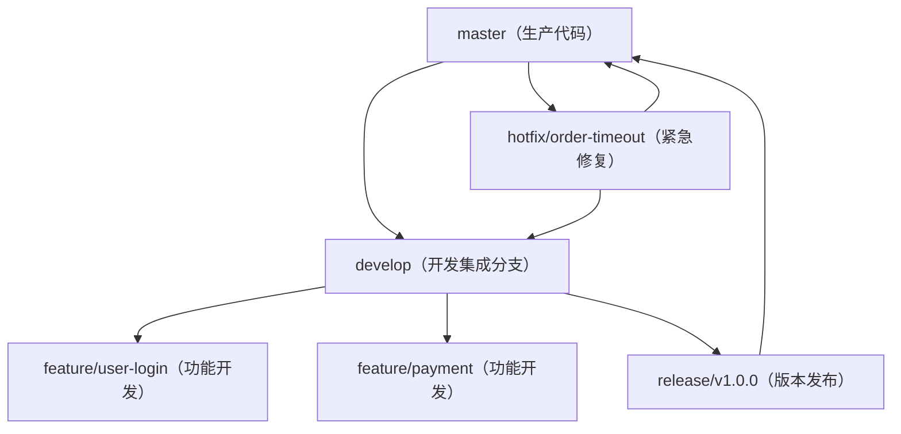

# Git - 综合场景串联

---

## 场景一：GitFlow 工作流完整流程

### 场景描述
团队采用 GitFlow 分支策略管理一个企业级项目，需要同时支持版本发布、功能开发、紧急修复。演示从需求到上线的完整 GitFlow 流程。

### 涉及知识点
- [Git分支策略与协作工作流](02-Git分支策略与协作工作流.md)：GitFlow 分支模型、merge 的三种模式、Pull Request 流程
- [Git核心概念与常用命令](01-Git核心概念与常用命令.md)：分支操作、标签管理、远程协作

### 协作流程

**GitFlow 分支模型图：**



> Git Flow 工作流定义了五种核心分支：master 存放生产代码，develop 作为开发集成分支，feature 分支从 develop 拉取用于功能开发，release 分支用于版本发布准备，hotfix 分支从 master 拉取用于紧急修复。所有分支最终合并回主干。

1. 项目初始化：创建 main 和 develop 分支，main 存放生产代码，develop 为开发集成分支
2. 功能开发：从 develop 拉取 feature/user-login 分支，开发完成后提交 Pull Request 合并回 develop
3. 功能分支合并时使用 `--no-ff` 强制保留分支轨迹，便于追溯和回滚
4. 版本发布准备：从 develop 拉取 release/v1.0.0 分支，进行发布前测试、版本号更新、文档完善
5. release 分支测试通过后，合并到 main 并打 tag v1.0.0，同时合并回 develop 同步修复
6. 部署 main 到生产环境
7. 线上紧急修复：从 main 拉取 hotfix/order-timeout 分支，修复紧急问题
8. hotfix 修复完成后，合并到 main 打 tag v1.0.1，同时合并回 develop 避免开发分支缺失修复
9. 删除已合并的 feature、release、hotfix 分支，保持仓库整洁

### 关键要点
- main 分支始终对应生产环境，每个提交对应一个发布版本
- develop 是集成分支，所有功能开发最终合并到这里
- 使用 `--no-ff` 合并保留分支拓扑，即使可以快进也强制生成合并提交
- hotfix 必须从 main 拉取（基于生产代码），修复后同时合并到 main 和 develop
- 标签使用语义化版本号（MAJOR.MINOR.PATCH），发布时打附注标签

### 完整可运行命令示例

#### 第一步：项目初始化

```bash
# 1. 创建空仓库并克隆到本地
git clone https://github.com/your-org/your-project.git
cd your-project

# 2. 初始化项目，创建 main 和 develop 分支
# 注意：如果远程仓库已有 main 分支，使用 git checkout main 切换即可
# 如果是新仓库首次提交，使用 git branch -M main 重命名当前分支
git checkout -b main
git commit --allow-empty -m "Initial commit: project setup"
git checkout -b develop
git push -u origin develop
git push -u origin main
```

#### 第二步：功能开发流程

```bash
# 1. 从 develop 拉取功能分支
git checkout develop
git pull origin develop
git checkout -b feature/user-login

# 2. 开发过程中频繁提交
git add .
git commit -m "feat: add login page UI"
git commit -m "feat: implement username/password validation"
git commit -m "fix: fix captcha refresh issue"

# 3. 推送到远程准备 Pull Request
git push -u origin feature/user-login

# 4. 代码审查通过后，合并回 develop（使用 --no-ff 保留分支历史）
git checkout develop
git pull origin develop
git merge --no-ff feature/user-login
git push origin develop

# 5. 删除已合并的功能分支
git branch -d feature/user-login
git push origin --delete feature/user-login
```

#### 第三步：版本发布流程

```bash
# 1. 从 develop 拉取 release 分支
git checkout develop
git pull origin develop
git checkout -b release/v1.0.0

# 2. 发布前准备：更新版本号、完善文档、修复测试问题
vim package.json  # 更新版本号到 1.0.0
vim CHANGELOG.md # 更新变更日志
git add package.json CHANGELOG.md
git commit -m "chore: bump version to 1.0.0 and update changelog"

# 3. 测试通过后，合并到 main 并打 tag
git checkout main
git pull origin main
git merge --no-ff release/v1.0.0
git tag -a v1.0.0 -m "Release v1.0.0: add user login system"
git push origin main
git push origin v1.0.0

# 4. 将发布中的修复同步回 develop
git checkout develop
git merge --no-ff release/v1.0.0
git push origin develop

# 5. 删除已合并的 release 分支
git branch -d release/v1.0.0
git push origin --delete release/v1.0.0
```

#### 第四步：线上紧急修复流程

```bash
# 1. 从 main 拉取 hotfix 分支
git checkout main
git pull origin main
git checkout -b hotfix/order-timeout

# 2. 定位问题并修复
git add src/OrderService.java
git commit -m "fix: resolve order processing timeout issue"

# 3. 验证修复后，合并到 main 并打新 tag
git checkout main
git merge --no-ff hotfix/order-timeout
git tag -a v1.0.1 -m "Release v1.0.1: fix order timeout bug"
git push origin main
git push origin v1.0.1

# 4. 同步修复到 develop
git checkout develop
git merge --no-ff hotfix/order-timeout
git push origin develop

# 5. 删除 hotfix 分支
git branch -d hotfix/order-timeout
git push origin --delete hotfix/order-timeout
```

#### 第五步：代码审查与 Pull Request 常用命令

```bash
# 1. 开发者：推送功能分支后创建 PR
git checkout feature/payment-integration
git push -u origin feature/payment-integration
# 在 GitHub/GitLab 上创建 Pull Request

# 2. 审查者：本地拉取 PR 分支测试
git fetch origin pull/123/head:pr-123
git checkout pr-123
# 运行测试，检查代码

# 3. 审查通过后，在网页端合并，或本地合并
git checkout develop
git merge --no-ff pr-123
git push origin develop

# 4. 如果需要本地修改 PR
git checkout feature/payment-integration
# 修改代码后提交推送
git add .
git commit -m "address review comments: fix null pointer"
git push origin feature/payment-integration
```

---

## 场景二：解决 Git 合并冲突

### 场景描述
两个开发者同时修改了同一文件的同一区域，在合并分支时产生冲突。演示从冲突发生到解决的完整流程，以及预防冲突的最佳实践。

### 涉及知识点
- [Git分支策略与协作工作流](02-Git分支策略与协作工作流.md)：冲突产生原因、冲突标记解读、冲突解决流程、rerere 机制
- [Git核心概念与常用命令](01-Git核心概念与常用命令.md)：merge 与 rebase 操作、git status 与 git diff

### 协作流程
1. 开发者 A 在 feature-a 分支修改了 OrderService.java 的 processOrder 方法
2. 开发者 B 在 feature-b 分支也修改了同一文件的同一方法
3. 开发者 A 先将 feature-a 合并到 develop
4. 开发者 B 尝试将 feature-b 合并到 develop 时，Git 检测到冲突
5. Git 在冲突文件中插入标记：`<<<<<<< HEAD`（当前分支内容）、`=======`（分隔符）、`>>>>>>> feature-b`（被合并分支内容）
6. 开发者 B 使用 `git status` 查看冲突文件列表，`git diff` 查看冲突详情
7. 开发者 B 手动编辑文件，保留正确的代码，删除所有冲突标记
8. 执行 `git add OrderService.java` 标记冲突已解决
9. 执行 `git commit` 完成合并提交
10. 若想放弃合并，执行 `git merge --abort` 恢复到合并前状态

### 关键要点
- 冲突标记以 `<<<<<<<`、`=======`、`>>>>>>>` 三组界定，需手动编辑删除
- 解决冲突后必须 `git add` 标记已解决，再 `git commit` 完成合并
- 启用 `git rerere` 记录冲突解决方案，相同冲突再次出现时自动应用
- 预防冲突：频繁拉取最新代码、小粒度分支、及时沟通分工
- 二进制文件冲突无法自动合并，只能选择保留其中一方的版本
- 使用 VS Code 或 IDEA 等可视化工具辅助解决冲突

---

> [返回模块目录](../../README.md) | [返回知识导览](../../知识导览.md)