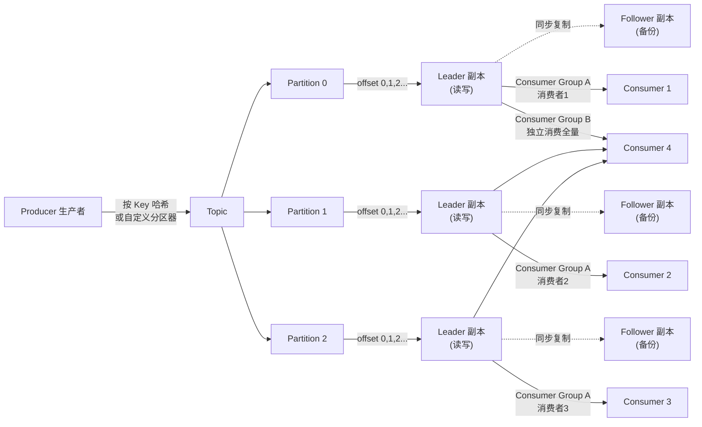
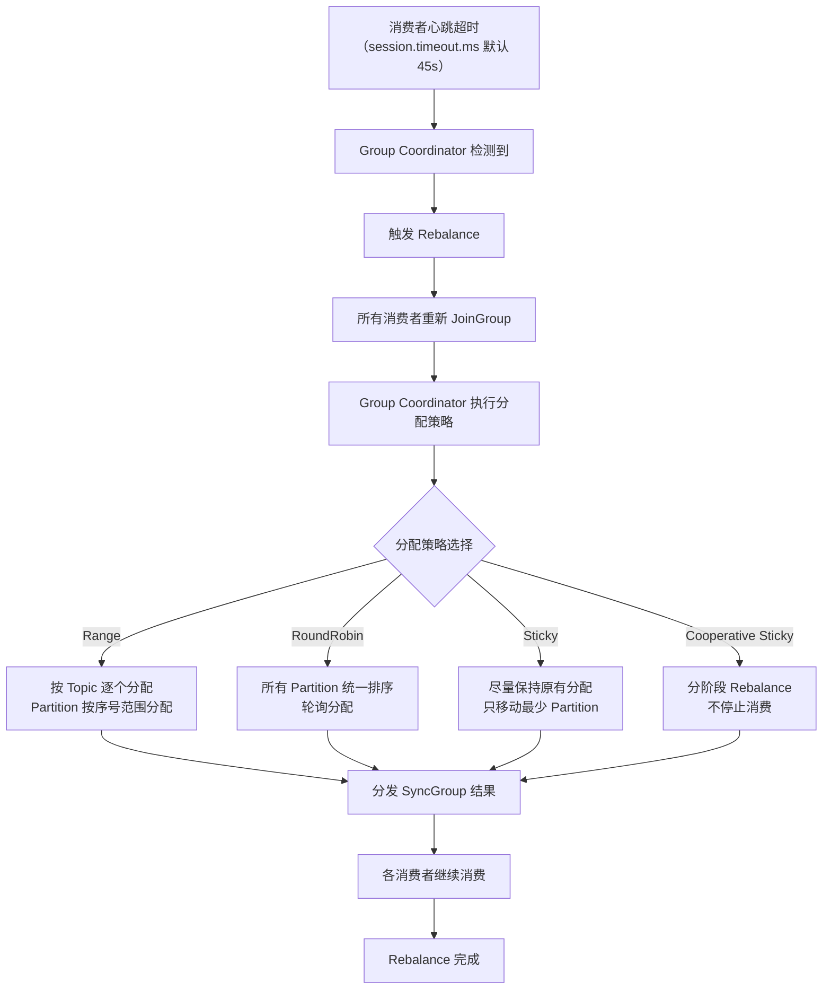

# Kafka 核心原理

> 学习路线对应：第4周 -- 消息队列
> 前置知识：Java 基础、Linux 基础
> 对比 Node.js：Kafka 生产者/消费者 约等于 EventEmitter + Redis Pub/Sub（但 Kafka 持久化、高吞吐）

---

## 一、核心概念

### 1.1 消息队列的作用

消息队列是分布式系统中实现异步通信、系统解耦、流量削峰的核心组件。

| 作用 | 说明 | 典型场景 |
|------|------|----------|
| **削峰填谷** | 将瞬间高并发请求暂存到队列，后端按自身处理能力消费 | 秒杀活动、ETC 交易高峰 |
| **系统解耦** | 生产者和消费者不直接依赖，通过队列间接通信 | 订单系统通知物流、库存系统 |
| **异步处理** | 非关键路径操作异步化，提升响应速度 | 注册后发送邮件/短信 |
| **数据分发** | 一条消息可被多个下游系统消费 | 用户行为数据分发给推荐、风控、报表系统 |

### 1.2 Kafka 核心组件

Kafka 架构由以下核心概念组成：

| 组件 | 描述 |
|------|------|
| **Broker** | Kafka 服务节点，负责消息存储和转发 |
| **Topic** | 消息的逻辑分类，类似数据库的表 |
| **Partition** | Topic 的物理分片，每个 Partition 是一个有序、不可变的消息序列 |
| **Producer** | 消息生产者，向指定 Topic 发送消息 |
| **Consumer** | 消息消费者，从指定 Topic 拉取消息 |
| **Consumer Group** | 消费者组，组内消费者分摊消费 Partition，组间相互独立 |
| **Replica** | Partition 的副本，分为 Leader（读写）和 Follower（备份） |
| **ISR（In-Sync Replicas）** | 与 Leader 保持同步的副本集合 |
| **Controller** | Kafka 集群管理者，负责 Partition 的 Leader 选举 |

> **生活化类比：** Kafka 消息队列就像快递分拣中心。**生产者（Producer）** 是寄件人，把包裹（消息）送到分拣中心。**Topic** 是目的地城市，所有发往同一城市的包裹归为一类。**Partition** 是分拣中心的传送带，每条传送带独立运转，包裹在上面按顺序排列（有序、不可变）。**消费者（Consumer）** 是派件员，从传送带上取走属于自己的包裹。**Offset** 是快递单号，每个包裹在传送带上都有唯一的编号，派件员靠这个编号记录自己派到哪了，下次接着派。**Consumer Group** 就像快递站点，同一站点的派件员不会重复派送同一个包裹，但不同站点可以各自独立派送。

### 1.3 Kafka 消息模型

Kafka 通过消费者组巧妙实现了两种消息模型：

- **点对点模型**：同一消费者组内的多个消费者，每条消息只被一个消费者消费（负载均衡）
- **发布/订阅模型**：不同消费者组各自独立消费同一 Topic 的全部消息（广播）

> **生活化类比：Kafka = 邮政系统** —— 把整个 Kafka 集群想象成国家邮政系统。**Broker** 是各地邮局大楼，负责接收和暂存邮件；**Topic** 是信箱上的"投递类别"标签（如"国内信件""国际包裹"），寄件人按类别投递；**Producer** 是寄件人，**Consumer** 是收件人。整个系统通过标准化的分拣、运输、投递流程，保证邮件有序、可靠地送达，且能支撑海量邮件并发处理。

> 📖 **参考链接**：
> - [Kafka Documentation](https://kafka.apache.org/documentation/) -- Kafka 官方文档总入口
> - [Apache Kafka Quickstart](https://kafka.apache.org/quickstart) -- 官方快速上手指南
> - [Kafka 核心概念](https://kafka.apache.org/documentation/#gettingStarted) -- Topic、Partition、Producer、Consumer 核心概念官方说明

### 1.4 与 RabbitMQ 对比

| 维度 | Kafka | RabbitMQ |
|------|-------|----------|
| **吞吐量** | 极高（单机 100w+ TPS） | 中等（单机 1w-2w TPS） |
| **延迟** | 较低（ms 级） | 低（us 级） |
| **消息模型** | 基于日志（Log） | 基于队列（Queue） |
| **协议** | 自定义二进制协议 | AMQP（高级消息队列协议） |
| **消息回溯** | 支持（按 offset 回溯） | 不支持（消费后删除） |
| **事务消息** | 支持（事务 API） | 不原生支持 |
| **适用场景** | 日志收集、流处理、大数据管道 | 业务消息、RPC 调用、复杂路由 |

**Kafka 消息生产消费流程 Mermaid 图：**



> 📖 **参考链接**：
> - [Kafka Producer 配置](https://kafka.apache.org/documentation/#producerconfigs) -- 生产者配置参数官方说明
> - [Kafka Consumer 配置](https://kafka.apache.org/documentation/#consumerconfigs) -- 消费者配置参数官方说明
> - [Kafka 设计原理](https://kafka.apache.org/documentation/#design) -- 高吞吐、持久化、副本等底层设计

---

## 二、底层原理

### 2.1 分区机制（Partition 并行读写的核心）

Partition 是 Kafka 实现并行处理和水平扩展的基本单位：

- 每个 Topic 可以配置多个 Partition
- 每个 Partition 是一个**有序、不可变**的消息序列，消息在 Partition 内按写入顺序分配 offset
- 生产者可以指定消息发送到哪个 Partition（按 Key 哈希或自定义分区器）
- **分区数量决定消费并行度**：一个 Partition 只能被消费者组内一个消费者消费，消费者数量超过 Partition 则多余消费者空闲

```
分区设计原则：
- Partition 越多，吞吐量越高（并行读写）
- 但 Partition 过多会增加元数据开销和故障恢复时间
- 生产环境建议每个 Broker 上的 Partition 总数不超过 2000-4000
```

> **生活化类比：Topic = 信箱，Partition = 分拣窗口** —— Topic 就像邮局里按目的地分类的信箱，你把信投进"北京"信箱，所有去北京的信都汇聚在这里。但信箱只是逻辑分类容器，真正的物理分拣靠的是 Partition——它好比邮局里一排排分拣窗口，每个窗口独立运转、按顺序处理邮件。窗口越多，分拣越快（并行度高），但管理成本也越高。同一封信只能进一个窗口（同 Key 消息进同一 Partition 保证有序），不同窗口间的邮件顺序无法保证。

> 📖 **参考链接**：
> - [Kafka Topics 与 Partitions](https://kafka.apache.org/documentation/#intro_topics) -- Topic 与 Partition 核心概念官方说明

### 2.2 ISR 机制（In-Sync Replicas）

ISR 是 Kafka 高可靠的核心机制。ISR 中的副本与 Leader 保持同步。

**ISR 判断条件：**

一个 Follower 是否在 ISR 中，取决于其与 Leader 的同步延迟是否超过 `replica.lag.time.max.ms`（默认 30 秒）：

```java
// ISR 判断伪代码
public boolean isInSync(long leaderLEO, long followerLEO, long lastCaughtUpTime) {
    if (followerLEO >= leaderLEO) {
        lastCaughtUpTime = System.currentTimeMillis();
    }
    return System.currentTimeMillis() - lastCaughtUpTime < 30000; // 30 秒
}
```

> 注意：Kafka 0.9 之前使用 `replica.lag.max.messages`（消息数量差），但突发流量会导致 Follower 频繁进出 ISR，现已废弃。

**Leader 选举：**

- 当 Leader 宕机时，Controller 从 ISR 中选举新 Leader
- 优先选择 ISR 中最新的副本（AR 中第一个存活的 ISR 副本）
- 如果 ISR 为空，根据 `unclean.leader.election.enable` 配置决定是否从非 ISR 副本选举（默认 false，即不允许从非 ISR 选举，优先保证数据不丢失）

### 2.3 高吞吐原理

Kafka 以极高的吞吐量著称，单机可达百万条消息/秒。其高吞吐的秘密在于六大设计：

| 设计 | 原理 | 效果 |
|------|------|------|
| **顺序写磁盘** | 所有消息追加写入日志文件末尾，避免随机 I/O | 顺序写 600MB/s vs 随机写 100KB/s（差距 6000 倍） |
| **零拷贝（sendfile）** | 使用 `sendfile()` 系统调用，数据从 Page Cache 直接 DMA 拷贝到网卡 | 传统模式 4 次拷贝+4 次上下文切换，sendfile 仅 2 次拷贝+2 次上下文切换 |
| **Page Cache** | 完全依赖操作系统页缓存，读操作优先命中缓存 | 避免磁盘 I/O，利用 OS 缓存管理 |
| **批量压缩** | 生产者端批量压缩消息，减少网络传输数据量 | GZIP/Snappy/LZ4/ZSTD，压缩率 3-5 倍 |
| **分区并行** | 每个 Partition 独立处理，多 Partition 并行读写 | 水平扩展，无上限 |
| **批量发送** | 生产者将多条消息打包成批次发送，减少网络往返 | `batch.size` + `linger.ms` 控制 |

**零拷贝（sendfile）流程对比：**

```
传统 I/O（4 次拷贝 + 4 次上下文切换）：
  磁盘 ->(DMA)-> Page Cache ->(CPU)-> 用户缓冲区 ->(CPU)-> Socket Buffer ->(DMA)-> 网卡

sendfile 零拷贝（2 次拷贝 + 2 次上下文切换）：
  磁盘 ->(DMA)-> Page Cache ->(DMA)-> 网卡
  （数据不经过用户态，CPU 不参与拷贝）
```

**压缩算法对比：**

| 压缩算法 | 压缩率 | 压缩速度 | CPU 消耗 | 适用场景 |
|----------|--------|----------|----------|----------|
| GZIP | 最高 | 慢 | 高 | 对带宽敏感，不在意 CPU |
| Snappy | 中等 | 快 | 低 | 均衡选择 |
| LZ4 | 较低 | 最快 | 最低 | 高吞吐场景 |
| ZSTD | 高 | 较快 | 中 | 最新推荐，压缩率高且速度快 |

### 2.4 消息可靠性

Kafka 通过 acks 配置和幂等机制保证消息可靠性：

**acks 配置：**

| acks 值 | 含义 | 可靠性 | 性能 |
|---------|------|--------|------|
| **acks=0** | 生产者不等待任何确认 | 可能丢失消息 | 最高 |
| **acks=1** | Leader 写入成功即确认 | Leader 宕机可能丢失 | 中等 |
| **acks=all（或 -1）** | 所有 ISR 副本写入成功才确认 | 不会丢失消息 | 最低 |

**幂等性（Idempotent）：**

Kafka 为每个生产者分配一个 PID（Producer ID），每条消息携带 PID + Sequence Number。Broker 根据 PID + Sequence Number 去重，保证同一生产者的消息不会重复写入。

```java
// 幂等生产者配置
Properties props = new Properties();
props.put("enable.idempotence", true);  // 开启幂等
props.put("acks", "all");               // 必须 acks=all
props.put("retries", Integer.MAX_VALUE);
props.put("max.in.flight.requests.per.connection", 5);
```

**Exactly-Once 语义（事务生产者）：**

通过事务 API 实现"消费-处理-生产"的原子操作：

```
流程：initTransactions() -> beginTransaction() -> send() -> sendOffsetsToTransaction() -> commitTransaction()
```

消费者隔离级别：
- `read_uncommitted`：可以消费所有消息，包括未提交事务的消息（**默认**）
- `read_committed`：只消费已提交事务的消息（需显式配置 `isolation.level=read_committed`）

### 2.5 消费者组重平衡（Rebalance）

**触发条件：**

1. 消费者组成员变更（新增/下线消费者）
2. Topic 的 Partition 数量变更
3. 消费者超时未发送心跳（`session.timeout.ms` 默认 45s）

**Rebalance 流程：**

```
消费者心跳超时 -> Group Coordinator 检测到 -> 触发 Rebalance
-> 所有消费者重新 JoinGroup -> Group Coordinator 重新分配 Partition
-> 分发 SyncGroup 结果 -> 各消费者继续消费
```

**Rebalance 流程 Mermaid 图：**



> **生活化类比：Consumer Group = 邮递员小组** —— 消费者组就像邮局的一个邮递员小组，组内邮递员分工合作，每人负责固定的分拣窗口（Partition），互不重复派送。如果某个邮递员请假（消费者下线）或新人入职（新增消费者），组长（Group Coordinator）就要重新分配窗口——这就是 Rebalance。整个小组共享一份派送进度单（Offset），谁派到哪了大家都清楚；而不同小组（不同 Consumer Group）各派各的，互不干扰。

> 📖 **参考链接**：
> - [Kafka Consumer Groups](https://kafka.apache.org/documentation/#consumerconfigs) -- 消费者组与 Rebalance 官方配置说明

**四种分区分配策略：**

| 策略 | 原理 | 优点 | 缺点 |
|------|------|------|------|
| **Range** | 按 Topic 逐个分配，每个 Topic 的 Partition 按序号范围分配 | 实现简单 | 分配不均 |
| **RoundRobin** | 所有 Topic 的 Partition 统一排序，轮询分配 | 分配均匀 | Rebalance 时全部重新分配 |
| **Sticky** | 尽量保持原有分配，只移动最少 Partition | 减少不必要的迁移 | 首次分配不均匀 |
| **Cooperative Sticky** | Sticky 改进版，分阶段 Rebalance，不停止消费 | 平滑迁移，不暂停消费 | Kafka 2.4+ 才支持 |

---

## 三、实战应用

### 3.1 Spring Boot 集成 Kafka

**依赖配置：**

```xml
<dependency>
    <groupId>org.springframework.kafka</groupId>
    <artifactId>spring-kafka</artifactId>
</dependency>
```

**生产者配置：**

```java
@Service
public class KafkaProducerService {

    @Autowired
    private KafkaTemplate<String, String> kafkaTemplate;

    public void sendMessage(String topic, String message) {
        // 同步发送
        SendResult<String, String> result =
            kafkaTemplate.send(topic, message).get();
        System.out.println("发送成功，offset: " + result.getRecordMetadata().offset());
    }

    public void sendAsync(String topic, String message) {
        // 异步发送
        kafkaTemplate.send(topic, message).addCallback(
            result -> System.out.println("发送成功"),
            ex -> System.err.println("发送失败: " + ex.getMessage())
        );
    }
}
```

**消费者配置：**

```java
@Component
public class KafkaConsumerService {

    @KafkaListener(topics = "order-topic", groupId = "order-group")
    public void onMessage(ConsumerRecord<String, String> record) {
        System.out.println("收到消息: " + record.value());
        System.out.println("Topic: " + record.topic() + ", Partition: " + record.partition());
        System.out.println("Offset: " + record.offset());
    }
}
```

**application.yml 配置：**

```yaml
spring:
  kafka:
    bootstrap-servers: localhost:9092
    producer:
      key-serializer: org.apache.kafka.common.serialization.StringSerializer
      value-serializer: org.apache.kafka.common.serialization.StringSerializer
      acks: all
      retries: 3
      batch-size: 16384
      linger-ms: 10
      compression-type: lz4
    consumer:
      key-deserializer: org.apache.kafka.common.serialization.StringDeserializer
      value-deserializer: org.apache.kafka.common.serialization.StringDeserializer
      group-id: order-group
      enable-auto-commit: false
      auto-offset-reset: earliest
      max-poll-records: 500
```

### 3.2 消息发送失败重试策略

```java
@Configuration
public class KafkaRetryConfig {

    @Bean
    public KafkaTemplate<String, String> kafkaTemplate(
            ProducerFactory<String, String> producerFactory) {
        Map<String, Object> props = new HashMap<>();
        props.put(ProducerConfig.RETRIES_CONFIG, 3);           // 重试 3 次
        props.put(ProducerConfig.RETRY_BACKOFF_MS_CONFIG, 100); // 重试间隔 100ms
        // ... 其他配置
        return new KafkaTemplate<>(new DefaultKafkaProducerFactory<>(props));
    }
}
```

### 3.3 消费积压排查

**使用 kafka-consumer-groups 命令：**

```bash
# 查看消费者组列表
kafka-consumer-groups --bootstrap-server localhost:9092 --list

# 查看消费者组详情（含消费积压 Lag）
kafka-consumer-groups --bootstrap-server localhost:9092 \
  --group order-group --describe

# 输出示例：
# GROUP        TOPIC        PARTITION  CURRENT-OFFSET  LOG-END-OFFSET  LAG
# order-group  order-topic  0          1520            2000            480
# order-group  order-topic  1          1600            2000            400
```

**积压处理策略：**

1. 增加消费者数量（不能超过 Partition 数量）
2. 增加 Partition 数量
3. 优化消费者处理逻辑（减少处理时间）
4. 临时启动批量消费模式

---

## 四、常见面试题

### 1. Kafka 为什么能实现高吞吐？

**答案：** 六大设计共同作用：

1. **顺序写磁盘**：所有消息追加写入日志末尾，避免随机 I/O。顺序写 600MB/s，随机写仅 100KB/s，差距 6000 倍
2. **零拷贝（sendfile）**：数据从 Page Cache 直接 DMA 拷贝到网卡，避免 CPU 拷贝和用户态上下文切换，从 4 次拷贝降至 2 次
3. **Page Cache**：完全依赖操作系统页缓存，读操作优先命中缓存，避免磁盘 I/O
4. **批量压缩**：生产者端批量压缩消息（Snappy/LZ4），减少网络传输量
5. **分区并行**：每个 Partition 独立处理，多 Partition 并行读写，水平扩展无上限
6. **批量发送**：生产者将多条消息打包成批次发送，减少网络往返次数

### 2. ISR 机制是什么？Leader 选举如何保证数据不丢失？

**答案：** ISR（In-Sync Replicas）是与 Leader 保持同步的副本集合。Follower 在 `replica.lag.time.max.ms`（默认 30s）内有同步记录则属于 ISR。Leader 选举时，Controller 优先从 ISR 中选举新 Leader。通过设置 `unclean.leader.election.enable=false`，禁止从非 ISR 的副本中选举 Leader，确保新 Leader 拥有所有已提交的消息。配合 `acks=all` 和 `min.insync.replicas >= 2`，可以保证消息不丢失。

### 3. Kafka 如何保证消息不重复消费？

**答案：** 分两层保障：

- **幂等生产者**：Broker 为每个 Producer 分配 PID，每条消息携带 PID + Sequence Number。Broker 根据 PID + Seq 去重，保证同一 Producer 的消息不会重复写入
- **事务生产者**：通过 `initTransactions() -> beginTransaction() -> send() -> commitTransaction()` 实现跨 Partition 的原子写入。消费者使用 `read_committed` 隔离级别，只消费已提交事务的消息

### 4. 消费者组 Rebalance 什么时候触发？如何优化？

**答案：** Rebalance 触发条件：
1. 消费者组成员变更（新增/下线消费者）
2. Topic 的 Partition 数量变更
3. 消费者心跳超时（`session.timeout.ms` 默认 45s）

优化措施：
1. 增大 `session.timeout.ms`（如 30s）和 `heartbeat.interval.ms`（如 3s），减少因网络抖动导致的误判
2. 使用 Cooperative Sticky 分配策略（Kafka 2.4+），分阶段 Rebalance，不停止消费
3. 避免频繁启停消费者
4. 消费者处理逻辑不要长时间阻塞（如超过 `max.poll.interval.ms`）

> 📖 **参考链接**：
> - [Kafka 运维与监控](https://kafka.apache.org/documentation/#ops) -- Kafka 运维操作与监控官方指南
> - [Kafka 配置参数](https://kafka.apache.org/documentation/#configuration) -- 核心 Broker/Topic 配置参数说明

---

## 五、避坑指南

| 常见错误 | 现象 | 原因 | 解决方案 |
|---------|------|------|---------|
| 设置过大的 batch.size | 消息延迟增加 | 消息在缓冲区等待凑批时间过长 | 建议 16KB-32KB，配合 linger.ms（5-10ms）控制最大等待时间 |
| Consumer 长时间阻塞 | 消费者被踢出消费组，触发 Rebalance | 处理消息超过 max.poll.interval.ms（默认 5 分钟） | 将慢处理消息转发到专用 Topic；使用线程池异步处理，主线程快速返回 |
| Partition 数量规划不当 | 元数据开销大，故障恢复慢 | Partition 过多会增加元数据开销和恢复时间 | 每个 Broker 上 Partition 总数不超过 2000-4000；预留 20-30% 扩容余量 |
| 依赖全局消息顺序 | 业务逻辑异常 | Kafka 只在单个 Partition 内保证消息顺序 | 设计为幂等处理，不依赖全局顺序；必要时使用单一 Partition（牺牲并行度） |
| 不监控消费 Lag | 消费积压严重，消息处理延迟 | 消费能力不足时 Lag 持续增长，未及时发现 | 生产环境必须监控 Lag，设置告警阈值，及时扩容或优化 |

## 本章学习自检

完成本章学习后，应该能够：
- [ ] 用自己的话解释 Kafka 核心组件、分区机制、ISR 机制、高吞吐六大设计原理（顺序写、零拷贝、Page Cache 等）
- [ ] 手写 Spring Boot 集成 Kafka 的生产者和消费者代码
- [ ] 回答常见面试题（Kafka 高吞吐原因、ISR 与 Leader 选举、消息可靠性保证、Rebalance 触发条件等）
- [ ] 在实战项目中应用 Kafka 实现异步通信、系统解耦、削峰填谷
- [ ] 识别并避免常见错误（消费积压、Rebalance 频繁触发、Partition 数量规划不当、依赖消息顺序性等）

---

> **学习导航**：
> - 返回 [学习路线总览](../../../README.md)
> - 本模块其他文件：[03-消息队列笔面试题集](../03-消息队列笔面试题集.md)
> - 实战应用：[电商订单实时统计分析平台](../../../extensions/project/01-电商订单实时统计分析平台.md)


