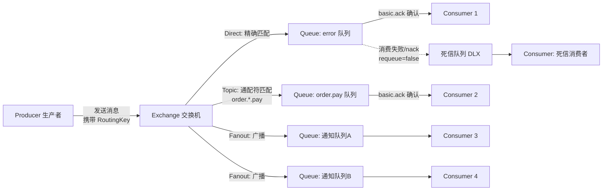

# RabbitMQ 核心原理

> 学习路线对应：第4周 -- 消息队列
> 前置知识：AMQP 协议基础

---

## 一、核心概念

### 1.1 AMQP 协议模型

RabbitMQ 基于 AMQP（Advanced Message Queuing Protocol，高级消息队列协议）构建，其核心模型为：

```
Producer（生产者） --> Exchange（交换机） --> Binding（绑定） --> Queue（队列） --> Consumer（消费者）
```

| 组件 | 说明 |
|------|------|
| **Producer** | 消息生产者，将消息发送到 Exchange |
| **Exchange** | 交换机，接收消息并根据路由键（Routing Key）和绑定规则将消息路由到队列 |
| **Binding** | 绑定，定义 Exchange 和 Queue 之间的路由规则 |
| **Queue** | 队列，存储消息的缓冲区 |
| **Consumer** | 消费者，从队列中拉取或接收推送的消息 |

> **生活化类比：RabbitMQ = 快递中转站** —— 把 RabbitMQ 想象成一个快递中转站。**Producer（生产者）** 是寄件人，把包裹送到中转站前台。**Exchange（交换机）** 是中转站的分拣中心，根据包裹上的地址标签（Routing Key）决定送往哪条线路。**Queue（队列）** 是一条条配送路线，包裹在路线上排队等待派送。**Consumer（消费者）** 是终点收件人，从路线上取走属于自己的包裹。整个中转站保证包裹不丢、不重、可靠送达。

> 📖 **参考链接**：
> - [RabbitMQ Documentation](https://www.rabbitmq.com/docs/) -- RabbitMQ 官方文档总入口
> - [AMQP 0-9-1 协议模型](https://www.rabbitmq.com/tutorials/amqp-concepts) -- AMQP 协议与核心概念官方教程

### 1.2 四种 Exchange 类型

| 类型 | 路由逻辑 | 适用场景 | 示意图 |
|------|----------|----------|--------|
| **Direct** | 精确匹配 Routing Key | 单播路由，如日志级别分类 | `RoutingKey == bindingKey` |
| **Topic** | 通配符匹配 Routing Key（`*` 匹配一个词，`#` 匹配零个或多个词） | 多条件路由，如按地域+业务分类 | `order.cn.*` 匹配 `order.cn.create` |
| **Fanout** | 忽略 Routing Key，广播到所有绑定的队列 | 广播消息，如配置变更通知 | 所有绑定队列都收到 |
| **Headers** | 根据消息 Header 属性匹配（忽略 Routing Key） | 复杂的属性匹配路由 | 通过 `x-match` 指定 all/any |

**Topic Exchange 通配符示例：**

```
Binding Key: "order.#"
匹配: "order.create", "order.pay", "order.cn.pay", "order.ship"

Binding Key: "order.*.pay"
匹配: "order.cn.pay", "order.us.pay"
不匹配: "order.pay", "order.cn.ship"
```

> **生活化类比：Exchange = 分拣中心** —— Exchange 就像快递中转站的分拣中心，有四种工作模式：**Direct** 是"精确地址派送"，只送到地址完全匹配的路线；**Topic** 是"通配符分拣"，比如"北京.*区"能匹配"北京.朝阳区""北京.海淀区"；**Fanout** 是"全员广播"，不管地址，所有路线都送一份；**Headers** 是"按包裹属性分拣"，不看地址看包裹上的标签（如"易碎品""加急"）来决定去向。

> 📖 **参考链接**：
> - [RabbitMQ Exchange 类型](https://www.rabbitmq.com/tutorials/amqp-concepts#exchanges) -- 四种 Exchange 类型官方说明

### 1.3 与 Kafka 对比

| 维度 | RabbitMQ | Kafka |
|------|----------|-------|
| **消息模型** | 基于队列（Queue），消费后删除 | 基于日志（Log），消费后保留 |
| **吞吐量** | 中等（单机 1w-2w TPS） | 极高（单机 100w+ TPS） |
| **延迟** | 低（us 级） | 较低（ms 级） |
| **路由能力** | 强大（Exchange + Binding + Routing Key） | 弱（仅 Topic 级别，无路由） |
| **消息优先级** | 支持 | 不支持 |
| **消息回溯** | 不支持（消费后删除） | 支持（按 offset 回溯） |
| **协议** | AMQP 0-9-1（标准协议） | 自定义二进制协议 |
| **适用场景** | 业务消息、复杂路由、RPC 调用 | 日志收集、流处理、大数据管道 |
| **运维复杂度** | 低（Erlang 运行时，相对简单） | 较高（依赖 ZooKeeper/KRaft） |

**选型建议：**
- 需要复杂路由、低延迟、消息优先级时选 RabbitMQ
- 需要高吞吐、消息回溯、流处理时选 Kafka

> **生活化类比：Queue = 配送路线** —— Queue 就像快递中转站的一条条配送路线，包裹（消息）在路线上排队等待派送。每条路线独立排队、先到先得（FIFO）。路线可以设置容量上限（x-max-length），满了就拒收新包裹；也可以设置包裹保质期（TTL），过期自动转到"问题件处理区"（死信队列）。消费者就是派件员，从路线上取走包裹，处理完签收（ack）才算完成；如果处理失败可以拒收退回（nack + requeue）。

**RabbitMQ 消息路由流程 Mermaid 图：**



> 📖 **参考链接**：
> - [RabbitMQ Tutorials](https://www.rabbitmq.com/getstarted.html) -- 官方教程（含路由、队列、确认等）
> - [RabbitMQ 消息可靠性](https://www.rabbitmq.com/docs/confirms) -- Producer Confirm 与 Consumer Ack 官方说明

---

## 二、底层原理

### 2.1 消息确认机制

RabbitMQ 提供了两层确认机制保证消息可靠传递：

**Producer Confirm（生产者确认）：**

生产者发送消息后，Broker 返回确认（ack）或否定确认（nack）：
- 消息成功路由到所有持久化队列后返回 ack
- 消息无法路由（如无可达队列）时返回 nack 或触发 Return 回调

```java
// Spring Boot 配置 Producer Confirm
rabbitTemplate.setConfirmCallback((correlationData, ack, cause) -> {
    if (ack) {
        System.out.println("消息发送成功: " + correlationData.getId());
    } else {
        System.err.println("消息发送失败: " + cause);
        // 重试或记录异常
    }
});
```

**Consumer Ack（消费者确认）：**

| 确认模式 | 行为 | 可靠性 |
|----------|------|--------|
| **auto（自动确认）** | 消息投递后立即确认，无论处理是否成功 | 可能丢失消息 |
| **manual（手动确认）** | 消费者显式调用 `basic.ack` 或 `basic.nack` | 高可靠 |
| **none** | 不确认 | 最低 |

```java
// 手动确认模式
@RabbitListener(queues = "order.queue")
public void onMessage(Message message, Channel channel) throws IOException {
    try {
        // 处理消息
        processOrder(message);
        // 手动确认
        channel.basicAck(message.getMessageProperties().getDeliveryTag(), false);
    } catch (Exception e) {
        // 拒绝并重新入队
        channel.basicNack(message.getMessageProperties().getDeliveryTag(), false, true);
    }
}
```

### 2.2 持久化

RabbitMQ 的持久化需要三个层面同时保证：

| 持久化层面 | 配置方式 | 说明 |
|------------|----------|------|
| **队列持久化** | `QueueBuilder.durable()` | 队列元数据持久化，Broker 重启后队列仍存在 |
| **消息持久化** | `deliveryMode=2` | 消息体持久化到磁盘，Broker 重启后消息不丢失 |
| **Exchange 持久化** | `ExchangeBuilder.durable()` | Exchange 元数据持久化 |

> 注意：仅设置消息持久化（deliveryMode=2）而不设置队列持久化，Broker 重启后队列消失，消息仍会丢失。

### 2.3 死信队列（DLX/DLQ）

死信（Dead Letter）是指无法被正常消费的消息。死信队列用于接收和处理这些消息。

**消息成为死信的三种情况：**

1. **消息 TTL 过期**：消息在队列中存活时间超过设置的 TTL
2. **队列已满**：队列达到最大长度，新消息被拒绝（需设置 `x-overflow` 为 `reject-publish`）
3. **消费拒绝**：消费者调用 `basic.nack` 或 `basic.reject` 且 `requeue=false`

**死信队列配置：**

```java
@Configuration
public class DeadLetterConfig {

    // 普通队列，绑定死信交换机
    @Bean
    public Queue normalQueue() {
        return QueueBuilder.durable("normal.queue")
            .deadLetterExchange("dlx.exchange")      // 死信交换机
            .deadLetterRoutingKey("dlx.routing.key")  // 死信路由键
            .ttl(10000)                                // 消息 TTL 10 秒
            .maxLength(1000)                           // 队列最大长度
            .build();
    }

    // 死信交换机
    @Bean
    public DirectExchange dlxExchange() {
        return new DirectExchange("dlx.exchange");
    }

    // 死信队列
    @Bean
    public Queue dlxQueue() {
        return QueueBuilder.durable("dlx.queue").build();
    }

    // 绑定
    @Bean
    public Binding dlxBinding() {
        return BindingBuilder.bind(dlxQueue())
            .to(dlxExchange())
            .with("dlx.routing.key");
    }
}
```

### 2.4 延迟队列

RabbitMQ 本身不直接支持延迟队列，但可以通过两种方式实现：

**方案一：TTL + DLX 组合（常用）**

设置消息或队列的 TTL，消息过期后自动进入死信队列，消费者监听死信队列即可实现延迟消费。

```
消息发送到普通队列（设置 TTL=30s）
  -> 30s 后消息过期
  -> 自动转发到死信队列
  -> 消费者从死信队列消费（实现 30s 延迟）
```

**方案二：rabbitmq-delayed-message-exchange 插件**

安装插件后，使用 `x-delayed-type` 类型的 Exchange，消息携带 `x-delay` 头部指定延迟时间。

```java
// 延迟队列交换机
@Bean
public CustomExchange delayedExchange() {
    Map<String, Object> args = new HashMap<>();
    args.put("x-delayed-type", "direct");
    return new CustomExchange("delayed.exchange", "x-delayed-message", true, false, args);
}
```

**典型场景：订单超时取消**

```java
// 下单时发送延迟消息
public void createOrder(Order order) {
    // 1. 保存订单
    orderRepository.save(order);
    // 2. 发送延迟消息（30 分钟后检查订单状态）
    rabbitTemplate.convertAndSend("order.delayed.exchange",
        "order.cancel.check", order.getId(), msg -> {
            msg.getMessageProperties().setDelay(30 * 60 * 1000); // 30 分钟延迟
            return msg;
        });
}

// 30 分钟后消费延迟消息
@RabbitListener(queues = "order.cancel.check.queue")
public void checkOrderStatus(Long orderId) {
    Order order = orderRepository.findById(orderId);
    if (order.getStatus() == OrderStatus.UNPAID) {
        // 订单仍未支付，执行取消
        orderService.cancel(orderId);
    }
}
```

### 2.5 惰性队列（Lazy Queue）

RabbitMQ 3.10引入了惰性队列（Lazy Queue），3.12版本起成为默认队列模式。与默认队列将消息保存在内存中不同，惰性队列将消息直接写入磁盘。

**默认队列 vs 惰性队列对比**：

| 维度 | 默认队列 | 惰性队列（Lazy Queue） |
|------|---------|----------------------|
| **消息存储** | 内存为主，磁盘为备份 | 磁盘为主，内存仅缓存 |
| **写入性能** | 高（内存写入极快） | 较低（每条消息都写磁盘） |
| **消费性能** | 高（内存直接读取） | 中等（从磁盘读取到内存） |
| **内存占用** | 高（消息堆积导致OOM） | 低（消息不占内存） |
| **消息堆积能力** | 有限（受内存限制） | 极强（受磁盘限制，可达百万级） |
| **适用场景** | 低延迟、消息量可控 | 大量消息堆积、内存有限 |
| **数据安全** | 异步刷盘，断电可能丢消息 | 同步写盘，数据更安全 |

**工作原理**：

```
默认队列：Producer → Exchange → Queue(内存中缓存) → Consumer
惰性队列：Producer → Exchange → Queue(直接写磁盘) → Consumer(从磁盘读取)
```

惰性队列在消息到达时立即将其写入磁盘文件（`.rdq`文件），消费时再从磁盘加载到内存。这种机制以牺牲少量延迟换取内存安全。

**配置方式**：

方式一：队列参数（单个队列配置）

```java
@Bean
public Queue lazyQueue() {
    Map<String, Object> args = new HashMap<>();
    args.put("x-queue-mode", "lazy");
    return new Queue("lazy.queue", true, false, false, args);
}
```

方式二：策略配置（批量匹配）

```bash
rabbitmqctl set_policy lazy "^lazy\." '{"queue-mode":"lazy"}'
```

方式三：全局默认配置（rabbitmq.conf）

```ini
# RabbitMQ 3.12+ 经典队列默认采用磁盘优先存储（等同于 lazy 行为）
# 如需将默认队列类型设为仲裁队列（quorum），使用以下配置
default_queue_type = quorum
```

**性能参考**：在百万级消息堆积场景下，默认队列内存占用可达数GB且面临OOM风险，惰性队列内存占用稳定在几百MB，但消费吞吐量降低约30%-50%。

### 2.6 镜像队列（Mirrored Queue）

镜像队列是 RabbitMQ 的高可用（HA）方案：

- 每个队列有一个 Master 节点和多个 Mirror（镜像）节点
- 生产者发送消息到 Master，Master 将消息同步到所有 Mirror
- 当 Master 故障时，资历最老的 Mirror 提升为新 Master
- 所有操作（发布、消费、确认）都经过 Master 处理

**配置方式：**

```bash
# 通过 Policy 配置镜像队列
rabbitmqctl set_policy ha-all "^ha\." '{"ha-mode":"all", "ha-sync-mode":"automatic"}'
```

**ha-mode 选项：**

| 模式 | 说明 |
|------|------|
| `all` | 镜像到集群所有节点 |
| `exactly` | 指定精确数量的镜像节点 |
| `nodes` | 指定具体节点列表 |

> 注意：镜像队列会降低性能（所有消息需同步到镜像节点），且不提供负载均衡（所有读写都经过 Master）。

---

## 三、实战应用

### 3.1 Spring Boot 集成 RabbitMQ

**依赖配置：**

```xml
<dependency>
    <groupId>org.springframework.boot</groupId>
    <artifactId>spring-boot-starter-amqp</artifactId>
</dependency>
```

**基础配置：**

```yaml
spring:
  rabbitmq:
    host: localhost
    port: 5672
    username: guest
    password: guest
    virtual-host: /
    # 生产者确认
    publisher-confirm-type: correlated
    publisher-returns: true
    # 消费者确认
    listener:
      simple:
        acknowledge-mode: manual
        prefetch: 10
```

**生产者示例：**

```java
@Service
public class RabbitMQProducer {

    @Autowired
    private RabbitTemplate rabbitTemplate;

    public void sendOrderMessage(String orderId) {
        rabbitTemplate.convertAndSend("order.exchange", "order.create", orderId);
    }
}
```

**消费者示例：**

```java
@Component
public class RabbitMQConsumer {

    @RabbitListener(queues = "order.queue")
    public void handleOrder(String orderId, Message message, Channel channel) throws IOException {
        try {
            System.out.println("处理订单: " + orderId);
            // 手动确认
            channel.basicAck(message.getMessageProperties().getDeliveryTag(), false);
        } catch (Exception e) {
            // 拒绝并重新入队
            channel.basicNack(message.getMessageProperties().getDeliveryTag(), false, true);
        }
    }
}
```

### 3.2 订单超时取消（延迟队列典型场景）

```java
@Service
public class OrderTimeoutService {

    @Autowired
    private RabbitTemplate rabbitTemplate;

    /**
     * 下单后发送延迟检查消息
     */
    public void scheduleOrderCheck(Long orderId, int timeoutMinutes) {
        rabbitTemplate.convertAndSend("order.delayed.exchange",
            "order.check", orderId, message -> {
                message.getMessageProperties()
                    .setDelay(timeoutMinutes * 60 * 1000);
                return message;
            });
    }
}

@Component
public class OrderTimeoutConsumer {

    @Autowired
    private OrderService orderService;

    @RabbitListener(queues = "order.check.queue")
    public void checkOrder(Long orderId, Message message, Channel channel) throws IOException {
        try {
            Order order = orderService.findById(orderId);
            if (order != null && order.getStatus() == OrderStatus.UNPAID) {
                orderService.cancelOrder(orderId);
                System.out.println("订单 " + orderId + " 超时取消");
            }
            channel.basicAck(message.getMessageProperties().getDeliveryTag(), false);
        } catch (Exception e) {
            channel.basicNack(message.getMessageProperties().getDeliveryTag(), false, true);
        }
    }
}
```

### 3.3 消息可靠性保障（Confirm + Return + Ack 三重保障）

```java
@Configuration
public class RabbitMQReliableConfig {

    @Bean
    public RabbitTemplate reliableRabbitTemplate(ConnectionFactory connectionFactory) {
        RabbitTemplate template = new RabbitTemplate(connectionFactory);

        // 1. Confirm 回调：确认消息是否到达 Broker
        template.setConfirmCallback((correlationData, ack, cause) -> {
            if (ack) {
                System.out.println("消息到达 Broker: " + correlationData.getId());
            } else {
                System.err.println("消息未到达 Broker: " + cause);
                // 保存到数据库重试表
            }
        });

        // 2. Return 回调：处理无法路由到队列的消息
        template.setReturnsCallback(returned -> {
            System.err.println("消息无法路由: " + returned.getMessage());
            System.err.println("Exchange: " + returned.getExchange());
            System.err.println("RoutingKey: " + returned.getRoutingKey());
            // 保存到异常消息表
        });

        return template;
    }
}
```

---

## 四、常见面试题

### 1. RabbitMQ 的 Exchange 类型有哪些？各自适用场景？

**答案：**

| 类型 | 路由逻辑 | 适用场景 |
|------|----------|----------|
| **Direct** | 精确匹配 Routing Key | 单播消息，如按日志级别（error、info）分发 |
| **Topic** | 通配符匹配（`*` 一个词，`#` 多个词） | 多条件路由，如 `order.*.pay` 按地域+业务路由 |
| **Fanout** | 广播到所有绑定队列 | 配置变更通知、全局广播 |
| **Headers** | 根据 Header 属性匹配 | 复杂属性路由，较少使用 |

### 2. 如何保证 RabbitMQ 消息不丢失？

**答案：** 需要从三个环节保证：

1. **生产者端**：开启 Publisher Confirm 机制，确认消息到达 Broker；开启 Return 回调处理无法路由的消息
2. **Broker 端**：设置队列持久化（durable=true）+ 消息持久化（deliveryMode=2）+ Exchange 持久化；配置镜像队列实现高可用
3. **消费者端**：使用手动确认模式（manual ack），消息处理成功后再确认，避免自动确认导致消息丢失

### 3. 死信队列有什么用？有哪些常见使用场景？

**答案：** 死信队列（DLX/DLQ）用于接收和处理无法正常消费的消息。常见场景：

1. **消息重试**：消费失败的消息进入死信队列，定时任务重新投递
2. **延迟队列**：利用 TTL + DLX 实现延迟消息（如订单超时取消）
3. **异常消息分析**：收集无法消费的消息，分析原因并修复
4. **流量削峰**：队列满时，多余消息进入死信队列，后台异步处理

### 4. RabbitMQ 和 Kafka 的核心区别？什么时候选 RabbitMQ？

**答案：**

| 对比维度 | RabbitMQ | Kafka |
|----------|----------|-------|
| 消息模型 | 队列模型，消费后删除 | 日志模型，消费后保留 |
| 吞吐量 | 中等（1w-2w TPS） | 极高（100w+ TPS） |
| 路由能力 | 强大（多种 Exchange） | 弱 |
| 延迟 | 低（us 级） | 较低（ms 级） |

**选 RabbitMQ 的场景：**
- 需要复杂路由逻辑（如按业务类型+地域分发）
- 需要低延迟实时通信（如 RPC 调用）
- 需要消息优先级、延迟消息等高级特性
- 团队规模较小，运维能力有限（RabbitMQ 运维更简单）

> 📖 **参考链接**：
> - [RabbitMQ 死信队列](https://www.rabbitmq.com/docs/dlx) -- 死信交换机（DLX）官方说明
> - [RabbitMQ 延迟消息插件](https://www.rabbitmq.com/docs/deferred-message-exchange) -- delayed-message-exchange 插件官方文档
> - [RabbitMQ 镜像队列](https://www.rabbitmq.com/docs/ha) -- 高可用镜像队列官方说明

---

## 五、避坑指南

| 常见错误 | 现象 | 原因 | 解决方案 |
|---------|------|------|---------|
| 生产环境使用匿名队列 | 消费者断开后消息丢失 | 匿名队列（autoDelete=true）在消费者断开后自动删除 | 使用命名持久化队列（durable=true） |
| 消费端未实现幂等 | 消息重复消费，业务数据出错 | RabbitMQ 的"至少一次"投递语义可能导致重复 | 使用唯一业务 ID 去重；数据库唯一约束；Redis 记录已处理消息 ID |
| 设置过大的 Prefetch | 消息在消费者端堆积，宕机后大量消息重新入队 | 消费者一次拉取过多消息，未确认的消息需重新投递 | 设置较小的 prefetch（10-50），配合手动确认 |
| 队列无限增长 | 内存和磁盘耗尽 | 未设置队列长度限制或消息 TTL | 设置 x-max-length 限制队列最大长度；设置消息 TTL |
| 过于复杂的路由拓扑 | 运维困难，排查问题耗时长 | 过多的 Exchange、Queue、Binding 增加复杂度 | 保持路由拓扑简洁，每个 Exchange 绑定不超过 10 个 Queue |

---

> **学习导航**：
> - 返回 [学习路线总览](../../../README.md)
> - 本模块其他文件：[03-消息队列笔面试题集](../03-消息队列笔面试题集.md)
> - 实战应用：[电商订单实时统计分析平台](../../../extensions/project/01-电商订单实时统计分析平台.md)


