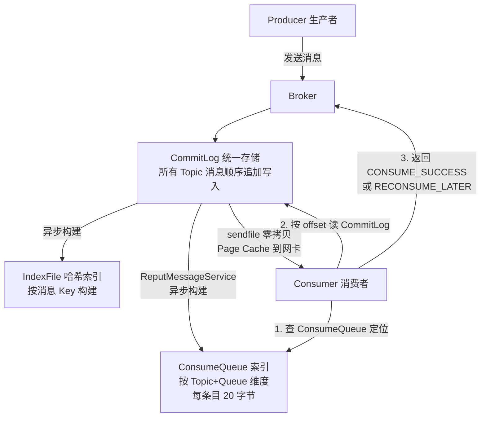
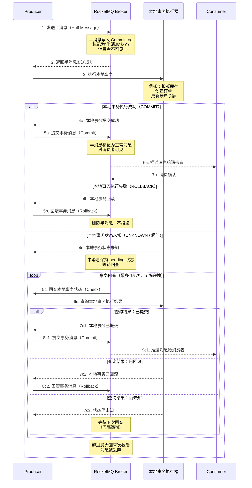

# RocketMQ 核心原理

> 学习路线对应：第4周 -- 消息队列
> 前置知识：Java 基础、分布式系统基础
> 对比 Node.js：RocketMQ 生产者/消费者 约等于 EventEmitter + Redis Pub/Sub（但 RocketMQ 持久化、高可靠、支持事务消息）

---

## 一、核心概念

### 1.1 RocketMQ 概述与发展历史

RocketMQ 是阿里巴巴开源的分布式消息中间件，起源于 2011 年 MetaQ 项目，2012 年正式更名为 RocketMQ。2016 年捐赠给 Apache 基金会，2017 年成为 Apache 顶级项目。

| 时间节点 | 里程碑 |
|----------|--------|
| 2011 年 | 阿里内部 MetaQ 诞生，服务于淘宝交易核心链路 |
| 2012 年 | 更名为 RocketMQ，抽象出 NameServer、Broker、Producer、Consumer 四大组件 |
| 2016 年 | 捐赠 Apache 基金会，进入孵化器 |
| 2017 年 | 成为 Apache 顶级项目（TLP） |
| 2018 年 | 发布 4.3.0，引入事务消息（半消息） |
| 2020 年 | 发布 4.7.0，引入 ACL 权限控制 |
| 2022 年 | 发布 5.0，引入 Proxy 模式、Pop 消费模式、轻量级 SDK |
| 2024 年 | 5.x 版本持续迭代，支持云原生部署 |

RocketMQ 设计初衷是解决阿里巴巴双十一场景下的万亿级消息流转需求，历经多年大规模生产验证，在金融、电商、物流等领域广泛使用。

### 1.2 与 Kafka/RabbitMQ 对比

| 维度 | RocketMQ | Kafka | RabbitMQ |
|------|----------|-------|----------|
| **定位** | 金融级业务消息、事务消息 | 大数据管道、流处理 | 业务消息、复杂路由 |
| **吞吐量** | 高（单机 10w+ TPS） | 极高（单机 100w+ TPS） | 中等（单机 1w-2w TPS） |
| **延迟** | 低（ms 级） | 较低（ms 级） | 极低（us 级） |
| **消息模型** | 基于 Topic + Queue（类似 Kafka） | 基于日志（Log） | 基于队列（Queue），消费后删除 |
| **消息回溯** | 支持（按时间或 offset） | 支持（按 offset） | 不支持 |
| **事务消息** | 原生支持（半消息 + 回查） | 支持（事务 API） | 不原生支持 |
| **顺序消息** | 严格顺序（全局/分区） | 仅分区内有序 | 通过单队列实现 |
| **延迟消息** | 支持（18 个预设等级） | 不原生支持 | 通过 TTL + DLX 间接实现 |
| **消息过滤** | Tag 过滤 + SQL 表达式过滤 | 无 | 通过 Routing Key 路由 |
| **协议** | 自定义 Remoting 协议 | 自定义二进制协议 | AMQP 0-9-1 |
| **运维复杂度** | 中等（NameServer 轻量） | 较高（依赖 ZooKeeper/KRaft） | 较低（Erlang 运行时） |
| **适用场景** | 电商订单、金融交易、分布式事务 | 日志收集、流处理、数据管道 | 业务消息、复杂路由、RPC |

### 1.3 整体架构

RocketMQ 架构由四大核心组件构成：

```
Producer（生产者） --> NameServer（路由注册中心）
                            |
Broker（消息存储转发）  <-- NameServer（路由发现）
                            |
Consumer（消费者）    <-- NameServer（路由发现）
```

| 组件 | 说明 |
|------|------|
| **NameServer** | 无状态路由注册中心，每个 Broker 启动时向所有 NameServer 注册，NameServer 之间不通信。职责：接收 Broker 注册、维护路由信息、供 Producer/Consumer 查询 |
| **Broker** | 消息存储与转发节点，分为 Master 和 Slave。Master 负责读写，Slave 负责备份。每组 Broker 有唯一的 BrokerName，通过 BrokerId（0 为 Master）区分 |
| **Producer** | 消息生产者，从 NameServer 获取 Broker 路由信息，选择 MessageQueue 发送消息 |
| **Consumer** | 消息消费者，从 NameServer 获取 Broker 路由信息，通过 Pull 或 Push 模式消费消息 |

**数据流：**

```
1. Broker 启动 -> 向所有 NameServer 注册 Topic 路由信息（心跳 30s）
2. Producer 启动 -> 从 NameServer 拉取 Topic 路由信息 -> 选择 MessageQueue 发送消息到 Broker
3. Consumer 启动 -> 从 NameServer 拉取 Topic 路由信息 -> 建立长连接 -> 从 Broker 拉取消息
```

> **生活化类比：RocketMQ = 特快专递** —— 把 RocketMQ 想象成一家特快专递公司。**Producer** 是寄件客户，**Consumer** 是收件客户。整个系统专为高可靠、高时效的特快专递设计——支持签收付款（事务消息）、定时派送（延迟消息）、按标签分拣（Tag 过滤），适合电商订单、金融交易等对可靠性要求极高的场景。

> **生活化类比：NameServer = 调度中心** —— NameServer 就像特快专递公司的调度中心，负责记录所有配送站（Broker）的位置和状态。它是无状态的，多个调度中心各自独立工作、互不通信，任何一个调度中心都能为客户提供完整路由信息。配送站每 30 秒向调度中心汇报一次"我还在线"，如果 120 秒没汇报，调度中心就认为该配送站已下线，不再把客户引向它。

> 📖 **参考链接**：
> - [RocketMQ Documentation](https://rocketmq.apache.org/docs/) -- RocketMQ 官方文档总入口
> - [RocketMQ 架构设计](https://rocketmq.apache.org/docs/rmq-arc/) -- 四大组件与整体架构官方说明

### 1.4 核心概念

| 概念 | 说明 |
|------|------|
| **Topic** | 消息的逻辑分类，一类消息的集合。Producer 将消息发送到指定 Topic，Consumer 从指定 Topic 订阅消息 |
| **Tag** | Topic 的子分类，用于同一 Topic 下消息的进一步过滤。例如 Topic 为 "order"，Tag 可为 "create"、"pay"、"cancel" |
| **MessageQueue** | Topic 的物理分片，每个 Topic 在一个 Broker 上可配置多个读队列和写队列。MessageQueue 是消息存储和消费的最小并行单位 |
| **ProducerGroup** | 生产者组，一类 Producer 的集合。发送事务消息时，Broker 通过 ProducerGroup 标识回查生产者 |
| **ConsumerGroup** | 消费者组，一类 Consumer 的集合。集群模式下，同一 ConsumerGroup 内每个 MessageQueue 只被一个 Consumer 消费 |

**MessageQueue 读写分离设计：**

| 配置项 | 含义 | 作用 |
|--------|------|------|
| `writeQueueNums` | 写队列数量 | 控制生产者可写入的队列数，决定发送并行度 |
| `readQueueNums` | 读队列数量 | 控制消费者可读取的队列数，决定消费并行度 |

通常 `writeQueueNums = readQueueNums`。当需要缩容时可以先将 `writeQueueNums` 调小，待消费完毕后再调整 `readQueueNums`。

> **生活化类比：Broker = 配送站** —— Broker 就像特快专递的配送站，负责接收、保管和分发包裹。每个配送站有主站（Master）和分站（Slave）：主站负责收件和派件（读写），分站负责备份库存。配送站把所有包裹统一堆放在一个大仓库（CommitLog）里，再按目的地建一份索引册（ConsumeQueue）方便快速查找。包裹入库时可以选择"当场登记入库"（同步刷盘）或"先放门口稍后统一入库"（异步刷盘）。

> 📖 **参考链接**：
> - [RocketMQ 核心概念](https://rocketmq.apache.org/docs/feature/transaction-message/) -- Topic、Tag、MessageQueue 等核心概念

---

## 二、底层原理

### 2.1 NameServer 路由发现

NameServer 是 RocketMQ 的轻量级路由注册中心，对比 ZooKeeper 和 Nacos 更简单高效。

| 特性 | 说明 |
|------|------|
| **无状态** | 各 NameServer 之间不通信，互不感知 |
| **最终一致性** | Broker 心跳上报路由信息，NameServer 不主动推送，客户端定时拉取 |
| **高可用** | 多 NameServer 部署，任意一台宕机不影响整体功能（客户端会重试其他 NameServer） |

**路由注册流程：**

```
Broker 启动 -> 向所有 NameServer 发送注册请求（携带 Topic 配置、读写队列数、集群名等）
         -> 每 30s 发送心跳维持注册信息
         -> 如果 120s 未收到心跳，NameServer 移除该 Broker 路由信息
```

**路由发现流程：**

```
Producer/Consumer 启动 -> 定时（默认 30s）从 NameServer 拉取 Topic 路由信息
                      -> 解析路由信息，获取 Broker 列表和 MessageQueue 列表
                      -> 当 Broker 变更时，NameServer 不会主动通知，客户端在下一次定时拉取时感知
```

**NameServer 路由剔除机制：**

| 剔除方式 | 触发条件 | 说明 |
|----------|----------|------|
| 心跳超时 | Broker 120s 未发送心跳 | NameServer 主动关闭连接，移除路由 |
| 主动下线 | Broker 正常关闭 | Broker 发送 UNREGISTER_BROKER 请求 |
| 磁盘故障 | Broker 磁盘满 | Broker 向 NameServer 标记自身不可写 |

### 2.2 消息存储（CommitLog + ConsumeQueue + IndexFile）

RocketMQ 采用三层存储结构，所有消息统一存储在 CommitLog 中，再按 Topic 和队列维度构建 ConsumeQueue 索引。

```
存储结构：
CommitLog（所有消息顺序写入）
  └─ ConsumeQueue（按 Topic + Queue 的索引文件）
      └─ IndexFile（按 Key 的哈希索引文件）
```

**CommitLog（消息主体存储）：**

| 特性 | 说明 |
|------|------|
| 存储模型 | 所有 Topic 的消息顺序追加写入同一个 CommitLog 文件 |
| 文件大小 | 默认 1GB，单个文件写满后新建文件继续写入 |
| 文件命名 | 以起始偏移量命名，如 `00000000000000000000` |
| 优势 | 顺序写磁盘，所有消息共用一个写入流，吞吐量极高 |
| 缺点 | 消费时需按 offset 随机读取，依赖 ConsumeQueue 索引加速 |

**ConsumeQueue（消息消费队列）：**

| 特性 | 说明 |
|------|------|
| 是什么 | 按 Topic + Queue 维度构建的索引文件，每个条目固定 20 字节 |
| 条目结构 | 8 字节 CommitLog Offset + 4 字节消息大小 + 8 字节 Tag HashCode |
| 作用 | 消费者根据 ConsumeQueue 找到 CommitLog 中的消息位置，实现快速消费 |
| 存储位置 | `$HOME/store/consumequeue/{topic}/{queueId}/{fileName}` |
| 写入时机 | 异步构建，ReputMessageService 定时从 CommitLog 转发到 ConsumeQueue |

**IndexFile（索引文件）：**

| 特性 | 说明 |
|------|------|
| 是什么 | 按消息 Key 构建的哈希索引，支持按 Key 快速查询消息 |
| 结构 | 哈希槽 + 索引条目，每个 IndexFile 约 400MB，包含 500w 个哈希槽和 2000w 个索引条目 |
| 查询流程 | Key 哈希 -> 定位哈希槽 -> 获取索引条目链表 -> 匹配消息 |

**存储文件目录结构：**

```
$HOME/store/
├── commitlog/                  # CommitLog 存储目录
│   ├── 00000000000000000000
│   └── 00000000001073741824
├── consumequeue/               # ConsumeQueue 存储目录
│   └── TopicA/
│       ├── 0/
│       │   └── 00000000000000000000
│       └── 1/
│           └── 00000000000000000000
├── index/                      # IndexFile 存储目录
│   └── 20240701120000000
└── config/
    └── consumerOffset.json
```

**RocketMQ 消息存储与消费流程 Mermaid 图：**



> 📖 **参考链接**：
> - [RocketMQ 存储设计](https://rocketmq.apache.org/docs/rmq-arc/) -- CommitLog + ConsumeQueue 存储模型官方说明

### 2.3 零拷贝（mmap vs sendfile）

RocketMQ 同时使用 mmap 和 sendfile 两种零拷贝技术，分别用于不同的 I/O 场景。

**mmap（内存映射文件）：**

| 特性 | 说明 |
|------|------|
| 使用场景 | CommitLog 写入、ConsumeQueue 读取 |
| 原理 | 将文件映射到进程虚拟地址空间，对内存的读写直接反映到磁盘文件 |
| 拷贝次数 | 1 次（DMA 拷贝到 Page Cache，用户态直接操作 Page Cache） |
| 上下文切换 | 2 次（用户态 <-> 内核态） |
| 优势 | 减少内存拷贝，用户态可直接读写文件，适合小数据量随机读写 |
| 限制 | 单个文件映射受虚拟内存地址空间限制（64 位系统无此问题） |

**sendfile（系统调用）：**

| 特性 | 说明 |
|------|------|
| 使用场景 | 消息从磁盘发送到网卡（消费者拉取消息时） |
| 原理 | 数据从 Page Cache 直接 DMA 拷贝到网卡，不经过用户态 |
| 拷贝次数 | 2 次（DMA 拷贝到 Page Cache，DMA 拷贝到网卡） |
| 上下文切换 | 2 次（用户态 -> 内核态 -> 用户态） |
| 优势 | CPU 不参与数据拷贝，适合大文件传输 |

**mmap + sendfile 协作流程：**

```
生产者发送消息：
  消息 -> mmap 写入 CommitLog（Page Cache 映射） -> 异步刷盘到磁盘

消费者拉取消息：
  消费者请求 -> 查找 ConsumeQueue（mmap 读取） -> 定位 CommitLog offset
  -> sendfile 将 CommitLog 数据从 Page Cache 直接发送到网卡
```

### 2.4 同步刷盘 vs 异步刷盘

RocketMQ 的消息可靠性取决于刷盘策略和主从复制策略的组合。

**刷盘策略对比：**

| 维度 | 同步刷盘（SYNC_FLUSH） | 异步刷盘（ASYNC_FLUSH） |
|------|------------------------|--------------------------|
| 原理 | 消息写入 Page Cache 后，立即调用 fsync 强制刷盘，返回成功前等待刷盘完成 | 消息写入 Page Cache 后立即返回成功，后台线程定期刷盘（默认 500ms） |
| 可靠性 | 极高，Broker 宕机不丢消息 | 可能丢失最近 500ms 内的消息 |
| 吞吐量 | 较低（TPS 约 5k-10k） | 高（TPS 可达 10w+） |
| 延迟 | 较高（ms 级） | 极低（us 级） |
| 适用场景 | 金融支付、订单交易等不可丢消息的场景 | 日志收集、数据埋点等允许少量丢失的场景 |

**主从复制策略：**

| 模式 | 说明 | 可靠性 |
|------|------|--------|
| 同步复制（SYNC_MASTER） | Master 等待 Slave 复制完成才返回成功 | 高可靠，Master 宕机 Slave 有全量数据 |
| 异步复制（ASYNC_MASTER） | Master 写入成功即返回，异步同步到 Slave | 可能丢失少量数据 |

**推荐生产配置组合：**

| 场景 | 刷盘模式 | 复制模式 |
|------|----------|----------|
| 金融支付 | 同步刷盘 + 同步复制 | 最高可靠，但吞吐最低 |
| 电商订单 | 异步刷盘 + 同步复制 | 可靠与性能均衡 |
| 日志收集 | 异步刷盘 + 异步复制 | 最高吞吐 |

### 2.5 消息发送（同步/异步/单向）

RocketMQ 提供三种消息发送方式，适用于不同的可靠性需求。

| 发送方式 | 原理 | 可靠性 | 性能 | 使用场景 |
|----------|------|--------|------|----------|
| 同步发送（Sync） | 发送消息后阻塞等待 Broker 返回结果 | 高（可感知发送结果） | 中等 | 重要业务消息，如订单创建 |
| 异步发送（Async） | 发送后立即返回，通过回调函数处理结果 | 高（回调通知结果） | 高 | 对响应时间敏感的链路 |
| 单向发送（Oneway） | 发送后不等待任何返回结果 | 低（不感知结果） | 最高 | 日志收集、不重要的数据上报 |

**发送流程：**

```
1. Producer 从 NameServer 获取 Topic 路由信息
2. 根据负载均衡策略选择 MessageQueue
3. 构建消息（Topic + Tag + Key + Body）
4. 序列化并发送到目标 Broker
5. Broker 接收消息 -> 写入 CommitLog -> 构建 ConsumeQueue -> 返回结果
```

**消息发送重试机制：**

| 配置项 | 默认值 | 说明 |
|--------|--------|------|
| `retryTimesWhenSendFailed` | 2 | 同步发送失败重试次数 |
| `retryTimesWhenSendAsyncFailed` | 2 | 异步发送失败重试次数 |
| `retryAnotherBrokerWhenNotStoreOK` | false | 发送失败是否尝试其他 Broker |

**重试流程：**

```
发送失败 -> 判断是否可重试（超时、连接异常等可重试，业务错误不可重试）
        -> 选择另一个 Broker（重试时自动避开失败的 Broker）
        -> 重试 N 次 -> 仍失败则抛出异常，业务层处理
```

### 2.6 消费重试机制

RocketMQ 消费重试用于处理消费者消费失败的消息，通过延迟等级实现退避重试。

**重试机制原理：**

| 特性 | 说明 |
|------|------|
| 重试触发 | 消费者返回 `RECONSUME_LATER` 或抛出异常 |
| 重试方式 | 消息发送到 `%RETRY%{ConsumerGroup}` 重试 Topic |
| 重试延迟 | 基于延迟等级（共 18 个级别），每次重试延迟递增 |
| 最大重试次数 | 默认 16 次 |

**重试延迟等级表：**

| 重试次数 | 延迟等级 | 延迟时间 |
|----------|----------|----------|
| 1 | 3 | 10s |
| 2 | 4 | 30s |
| 3 | 5 | 1m |
| 4 | 6 | 2m |
| 5 | 7 | 3m |
| 6 | 8 | 4m |
| 7 | 9 | 5m |
| 8 | 10 | 6m |
| 9 | 11 | 7m |
| 10 | 12 | 8m |
| 11 | 13 | 9m |
| 12 | 14 | 10m |
| 13 | 15 | 20m |
| 14 | 16 | 30m |
| 15 | 17 | 1h |
| 16 | 18 | 2h |

超过最大重试次数后，消息进入死信队列（DLQ），Topic 为 `%DLQ%{ConsumerGroup}`。

### 2.7 事务消息（半消息机制）

RocketMQ 的事务消息基于"半消息（Half Message）"机制实现分布式事务的最终一致性。核心思路是：发送方先将消息作为"半消息"发送到 Broker，此时消息对消费者不可见；待本地事务执行完成后，再根据执行结果决定提交（Commit）或回滚（Rollback）该消息。如果 Broker 长时间未收到确认，则通过回查机制主动查询本地事务执行状态。

**事务消息核心流程：**

| 阶段 | 说明 |
|------|------|
| 1. 发送半消息 | Producer 向 Broker 发送半消息，Broker 将消息写入 CommitLog，但标记为"半消息"状态，消费者不可见 |
| 2. 执行本地事务 | Producer 执行本地事务逻辑（如数据库操作），并将执行结果记录到本地 |
| 3. 提交/回滚 | 根据本地事务执行结果，向 Broker 发送 Commit 或 Rollback 请求 |
| 4. 回查机制 | 如果 Broker 长时间未收到 Commit/Rollback 请求（如 Producer 宕机、网络超时），则主动回查 Producer 的本地事务执行状态，最多回查 15 次 |

**事务消息半消息机制完整时序图：**



**回查机制关键参数：**

| 参数 | 默认值 | 说明 |
|------|--------|------|
| `transactionCheckMax` | 15 | 最大回查次数 |
| `transactionCheckInterval` | 60s | 回查间隔 |
| `transactionTimeout` | 6s | 事务超时时间，超时后 Broker 开始回查 |

**事务消息典型使用场景：**
- 订单创建 + 库存扣减：订单服务先发半消息，再创建订单，成功则提交消息触发库存扣减
- 支付成功 + 积分发放：支付服务先发半消息，再处理支付，成功则提交消息触发积分发放
- 用户注册 + 发送欢迎邮件：注册服务先发半消息，再注册用户，成功则提交消息触发邮件发送

---

## 三、实战应用

### 3.1 Spring Boot 集成 RocketMQ

**依赖配置：**

```xml
<dependency>
    <groupId>org.apache.rocketmq</groupId>
    <artifactId>rocketmq-spring-boot-starter</artifactId>
    <version>2.3.0</version>
</dependency>
```

**application.yml 配置：**

```yaml
rocketmq:
  name-server: 127.0.0.1:9876
  producer:
    group: order-producer-group
    send-message-timeout: 3000
    retry-times-when-send-failed: 2
    retry-times-when-send-async-failed: 2
    max-message-size: 4194304
  consumer:
    group: order-consumer-group
    topic: order-topic
```

**生产者示例：**

```java
@Service
public class OrderMessageProducer {

    @Autowired
    private RocketMQTemplate rocketMQTemplate;

    /**
     * 同步发送消息
     */
    public void sendOrderSync(String orderId) {
        SendResult result = rocketMQTemplate.syncSend("order-topic:create",
            MessageBuilder.withPayload(orderId).build());
        System.out.println("发送结果: " + result.getSendStatus());
    }

    /**
     * 异步发送消息
     */
    public void sendOrderAsync(String orderId) {
        rocketMQTemplate.asyncSend("order-topic:create",
            MessageBuilder.withPayload(orderId).build(),
            new SendCallback() {
                @Override
                public void onSuccess(SendResult sendResult) {
                    System.out.println("异步发送成功: " + sendResult.getMsgId());
                }
                @Override
                public void onException(Throwable e) {
                    System.err.println("异步发送失败: " + e.getMessage());
                }
            });
    }

    /**
     * 单向发送消息
     */
    public void sendOrderOneway(String orderId) {
        rocketMQTemplate.sendOneWay("order-topic:create",
            MessageBuilder.withPayload(orderId).build());
    }
}
```

**消费者示例：**

```java
@Service
@RocketMQMessageListener(
    topic = "order-topic",
    consumerGroup = "order-consumer-group",
    selectorExpression = "create"  // 只消费 Tag 为 create 的消息
)
public class OrderMessageConsumer implements RocketMQListener<String> {

    @Override
    public void onMessage(String orderId) {
        System.out.println("收到订单消息: " + orderId);
        // 处理订单业务逻辑
        // 抛出异常或返回 null 会触发消费重试
    }
}
```

### 3.2 消息发送可靠性保障

```java
@Service
public class ReliableMessageProducer {

    @Autowired
    private RocketMQTemplate rocketMQTemplate;

    @Autowired
    private MessageLogMapper messageLogMapper;

    /**
     * 可靠消息发送：先落库，再发送，最后更新状态
     */
    @Transactional(rollbackFor = Exception.class)
    public void sendReliableMessage(String orderId, String messageBody) {
        // 1. 消息落库，状态为"待发送"
        MessageLog log = new MessageLog();
        log.setMessageId(UUID.randomUUID().toString());
        log.setTopic("order-topic");
        log.setTag("create");
        log.setMessageBody(messageBody);
        log.setStatus("PENDING");
        messageLogMapper.insert(log);

        // 2. 发送消息到 RocketMQ
        try {
            SendResult result = rocketMQTemplate.syncSend("order-topic:create",
                MessageBuilder.withPayload(messageBody)
                    .setHeader("messageId", log.getMessageId())
                    .build());
            // 3. 更新消息状态为"已发送"
            log.setStatus("SENT");
            log.setMsgId(result.getMsgId());
            messageLogMapper.updateById(log);
        } catch (Exception e) {
            // 4. 发送失败，记录日志，由定时任务重试
            System.err.println("消息发送失败: " + e.getMessage());
        }
    }
}
```

### 3.3 消费积压排查

**RocketMQ 控制台查看：**

```bash
# 查看消费组详情
mqadmin consumerProgress -g order-consumer-group

# 查看 Topic 统计
mqadmin statsAll -t order-topic

# 输出示例：
# TPS: 5000
# Diff Total: 100000  （积压总量）
```

**消费积压处理策略：**

1. 临时增加消费者实例数量（不能超过 MessageQueue 的 readQueueNums）
2. 提升消费并行度：增加 `consumeThreadMin` 和 `consumeThreadMax` 配置
3. 优化消费逻辑：异步处理耗时操作，减少单条消息处理时间
4. 临时扩容 readQueueNums（需重启 Broker）
5. 创建临时 ConsumerGroup 消费积压数据，转发到新 Topic

---

## 四、常见面试题

### 1. RocketMQ 的整体架构是怎样的？各组件分别承担什么职责？

**答案：** RocketMQ 由四大组件构成：

1. **NameServer（路由注册中心）**：无状态、不通信，接收 Broker 注册并维护路由信息，供 Producer 和 Consumer 查询。Broker 每 30s 上报心跳，120s 无心跳则剔除路由
2. **Broker（消息存储转发）**：分为 Master 和 Slave，Master 负责读写，Slave 负责备份。消息统一存储在 CommitLog，通过 ConsumeQueue 索引加速消费
3. **Producer（消息生产者）**：从 NameServer 获取路由信息，按负载均衡策略选择 MessageQueue 发送消息，支持同步、异步、单向三种发送方式
4. **Consumer（消息消费者）**：从 NameServer 获取路由信息，建立长连接拉取消息，支持集群模式和广播模式

### 2. RocketMQ 的 CommitLog + ConsumeQueue 存储模型有什么优势？

**答案：**

1. **顺序写 CommitLog**：所有 Topic 的消息顺序追加写入同一个 CommitLog，避免了随机 I/O，磁盘顺序写速度可达 600MB/s
2. **ConsumeQueue 轻量索引**：每条 ConsumeQueue 条目仅 20 字节，通过固定大小条目实现快速定位，消费者按 ConsumeQueue 找到 CommitLog 中的消息
3. **读写分离**：写入走 CommitLog（顺序写），读取走 ConsumeQueue 定位后从 CommitLog 读取，互不干扰
4. **Topic 队列数灵活调整**：通过读写队列分离，支持动态缩容（先缩小 writeQueueNums，消费完再缩小 readQueueNums）

### 3. RocketMQ 如何保证消息不丢失？

**答案：** 从三个环节保证：

1. **生产者端**：使用同步发送 + 重试机制，发送失败自动重试；使用本地消息表保证发送可靠性
2. **Broker 端**：配置同步刷盘（SYNC_FLUSH）+ 同步复制（SYNC_MASTER），确保消息落盘到 Master 并同步到 Slave 后才返回成功
3. **消费者端**：消费成功后才返回 CONSUME_SUCCESS，消费失败返回 RECONSUME_LATER 触发重试；超过最大重试次数进入死信队列，保证不丢失

### 4. 同步刷盘和异步刷盘有什么区别？如何选择？

**答案：**

| 维度 | 同步刷盘 | 异步刷盘 |
|------|----------|----------|
| 可靠性 | 极高，Broker 宕机不丢消息 | 可能丢失 500ms 内消息 |
| 吞吐量 | TPS 约 5k-10k | TPS 可达 10w+ |
| 延迟 | ms 级 | us 级 |

选择建议：金融支付、订单交易等不可丢消息的场景选择同步刷盘；日志收集、数据埋点等允许少量丢失的场景选择异步刷盘。大多数业务场景推荐"异步刷盘 + 同步复制"的折中方案。

> 📖 **参考链接**：
> - [RocketMQ 消息可靠性](https://rocketmq.apache.org/docs/feature/transaction-message/) -- 消息不丢失与事务消息官方说明
> - [RocketMQ 最佳实践](https://rocketmq.apache.org/docs/best-practice/) -- 生产环境配置与运维最佳实践

---

## 五、避坑指南

| 常见错误 | 现象 | 原因 | 解决方案 |
|---------|------|------|---------|
| Consumer 消费失败后直接吞异常 | 消息静默丢失，无法追踪 | 消费失败未返回 RECONSUME_LATER 或抛出异常，消息被标记为成功消费 | 消费失败时抛出异常或返回 RECONSUME_LATER 触发重试；异常需记录日志 |
| 同步发送 + 同步刷盘 + 同步复制全部开启 | 吞吐量极低，TPS 不到 1000 | 三个同步操作串行叠加，每次发送需等待刷盘 + 复制完成 | 根据业务场景选择：金融场景用同步刷盘 + 同步复制；普通业务用异步刷盘 + 同步复制 |
| readQueueNums 设置过小 | 消费积压，消费者扩容无效 | 消费者并行度上限等于 readQueueNums，消费者数量超过 readQueueNums 则多余消费者空闲 | 预估流量，readQueueNums 设置为消费者数量的 2-4 倍；预留扩容空间 |
| 生产环境使用默认消费重试 16 次 | 故障消息阻塞消费队列，正常消息被延迟 | 每次重试延迟递增，16 次需要约 2-3 小时才能进入死信队列 | 根据业务设置合理的重试次数（如 3-5 次），失败后快速进入死信队列人工处理 |
| NameServer 全部部署在同一台机器 | NameServer 宕机后整个集群不可用 | NameServer 单点故障，Producer/Consumer 无法获取路由信息 | 至少部署 2 台 NameServer（推荐 3 台），分布在不同的物理机上 |
| 未设置消息 Key 或 Tag | 消息无法按 Key 查询，排查困难 | 生产消息时未设置 Key，无法通过 IndexFile 按 Key 检索消息 | 每条消息设置唯一的业务 Key（如订单号），设置合理的 Tag 进行分类 |

---

## 本章学习自检

完成本章学习后，应该能够：
- [ ] 用自己的话解释 RocketMQ 四大组件（NameServer、Broker、Producer、Consumer）的职责和协作流程
- [ ] 对比 RocketMQ 与 Kafka、RabbitMQ 的差异，能在不同场景下合理选型
- [ ] 阐述 CommitLog + ConsumeQueue + IndexFile 三层存储模型的设计原理和优势
- [ ] 理解 mmap 和 sendfile 两种零拷贝技术的区别和使用场景
- [ ] 区分同步刷盘和异步刷盘、同步复制和异步复制的差异，能根据业务场景选择合适的配置组合
- [ ] 手写 Spring Boot 集成 RocketMQ 的生产者和消费者代码
- [ ] 识别并避免常见错误（刷盘模式选择不当、readQueueNums 配置过小、消费重试次数配置不合理等）

---

> **学习导航**：
> - 返回 [学习路线总览](../../../README.md)
> - 本模块其他文件：[02-RocketMQ高级特性](./02-RocketMQ高级特性.md) | [RocketMQ笔面试题集](./RocketMQ笔面试题集.md)